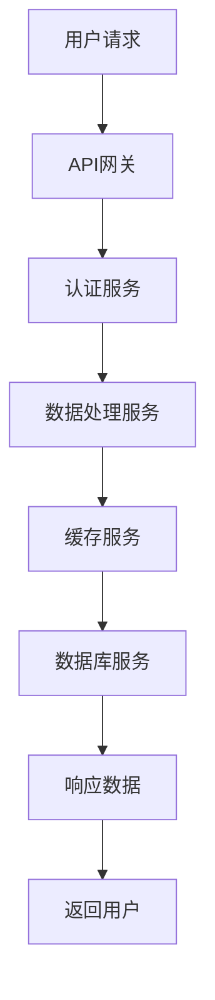
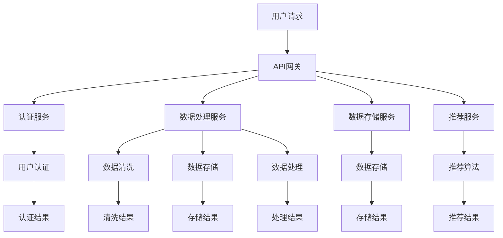

                 

### 智能个人碳足迹管理创业：日常生活的环保优化

#### 相关领域的典型问题/面试题库

##### 1. 个人碳足迹的计算方式是什么？

**题目：** 请简述个人碳足迹的计算方式，并解释其中的关键参数。

**答案：** 个人碳足迹的计算通常基于以下步骤：

1. **数据收集：** 收集个人的能源消耗、交通出行、饮食等数据。
2. **碳排放系数：** 查找每种活动或产品的碳排放系数，例如每公里交通的CO2排放量、每千克食物的CO2排放量等。
3. **计算：** 根据数据乘以相应的碳排放系数，得到个人碳足迹的初步估计。
4. **优化建议：** 提供基于碳足迹的优化建议，例如改变饮食习惯、减少交通出行等。

**关键参数：**

- 能源消耗（如用电量、燃气使用量）
- 交通出行（如汽车里程、飞机飞行距离）
- 生活习惯（如食物消费量、垃圾产生量）

**举例：**

```python
def calculate_carbon_footprint(electricity, gas, car_mileage, flight_distance, food_consumption):
    carbon_coefficients = {
        'electricity': 0.4,  # kg CO2/electricity unit
        'gas': 1.9,  # kg CO2/gas unit
        'car_mileage': 0.2,  # kg CO2/mile
        'flight_distance': 0.2,  # kg CO2/km
        'food_consumption': 1.5  # kg CO2/kg food
    }

    carbon_footprint = (
        electricity * carbon_coefficients['electricity'] +
        gas * carbon_coefficients['gas'] +
        car_mileage * carbon_coefficients['car_mileage'] +
        flight_distance * carbon_coefficients['flight_distance'] +
        food_consumption * carbon_coefficients['food_consumption']
    )
    return carbon_footprint

# 示例
carbon_footprint = calculate_carbon_footprint(
    300,  # electricity usage
    100,  # gas usage
    1000,  # car mileage
    10000,  # flight distance
    100,  # food consumption
)
print("Your carbon footprint:", carbon_footprint, "kg CO2")
```

**解析：** 上述代码提供了一个简单的碳足迹计算示例，实际应用中可能需要更复杂的计算模型和更详细的碳排放系数。

##### 2. 如何通过算法优化个人日常生活的碳排放？

**题目：** 请列举几种算法优化的方法，用于减少个人日常生活的碳排放。

**答案：** 几种常见的算法优化方法包括：

1. **基于规则的优化：** 根据预设的规则，例如减少高碳排放的食品消费、选择低碳交通方式等，自动推荐低碳生活方式。
2. **机器学习：** 利用历史数据和个人生活习惯，通过机器学习算法预测和优化个人碳排放。
3. **优化算法：** 例如线性规划、整数规划等，用于优化能源消耗、交通路线等，以减少碳排放。

**举例：**

```python
import numpy as np
from scipy.optimize import linprog

# 示例：线性规划用于优化能源消耗
# 目标是最小化总能源消耗
# 约束条件包括预算限制和碳排放限制

coefficient = [1, 1]  # 对应能源消耗和碳排放
inequality_constraints = [
    [-1, -1],  # 总能源消耗不超过预算
    [1, 0],  # 燃气消耗不超过限额
    [0, 1],  # 电能消耗不超过限额
]

# 碳排放约束
inequality_constraints.append([-0.4, -0.2])  # 碳排放系数乘以系数矩阵

# 边界条件
bounds = [(0, None), (0, None)]  # 能源消耗无下限

result = linprog(c=coefficient, A_ub=inequality_constraints, bounds=bounds, method='highs')

if result.success:
    print("Optimized energy consumption:", result.x[0])
    print("Optimized carbon emissions:", result.x[1])
else:
    print("No feasible solution found.")
```

**解析：** 上述代码示例使用了线性规划算法优化能源消耗和碳排放。实际应用中，可能需要更复杂的模型和约束条件。

##### 3. 如何设计一个智能碳足迹管理系统的后台算法？

**题目：** 请简述设计一个智能碳足迹管理系统的后台算法的步骤。

**答案：** 设计一个智能碳足迹管理系统的后台算法，通常包括以下步骤：

1. **数据收集与预处理：** 收集用户日常生活的各种数据，如能源消耗、交通出行、饮食习惯等，并进行预处理。
2. **数据建模：** 根据收集到的数据建立碳足迹模型，包括碳排放系数、预测模型等。
3. **算法实现：** 实现数据建模中的算法，例如线性规划、机器学习等。
4. **系统集成：** 将算法集成到系统后台，实现实时碳足迹计算和优化建议。
5. **性能优化：** 对算法和系统进行性能优化，确保系统的高效和稳定性。

**举例：**

```python
# 示例：集成机器学习算法到碳足迹管理系统
from sklearn.linear_model import LinearRegression

# 示例数据
X = [[300, 100, 1000, 10000, 100]]  # 用户数据
y = [carbon_footprint]  # 实际碳足迹

# 训练模型
model = LinearRegression()
model.fit(X, y)

# 预测
predicted_footprint = model.predict([[new_data]])  # 新用户数据

print("Predicted carbon footprint:", predicted_footprint)
```

**解析：** 上述代码示例使用了线性回归模型对用户数据进行预测。实际应用中，可能需要更复杂的模型和算法。

##### 4. 如何评估智能碳足迹管理系统的效果？

**题目：** 请简述评估智能碳足迹管理系统效果的方法。

**答案：** 评估智能碳足迹管理系统效果，通常包括以下方法：

1. **用户反馈：** 收集用户对系统功能的反馈，包括满意度、使用频率等。
2. **碳排放减少量：** 对比使用系统前后的碳足迹数据，评估系统对碳排放的减少效果。
3. **节能效果：** 评估系统能否帮助用户实现能源节约，减少能源消耗。
4. **经济效益：** 分析系统对用户的经济效益，如节省能源费用等。
5. **数据准确度：** 评估系统数据的准确度和可靠性。

**举例：**

```python
# 示例：评估碳排放减少量
initial_carbon_footprint = 5000  # 初始碳足迹
final_carbon_footprint = 3000  # 使用系统后的碳足迹

carbon_saving = initial_carbon_footprint - final_carbon_footprint
print("Carbon saving:", carbon_saving, "kg CO2")
```

**解析：** 上述代码示例计算了使用系统前后的碳足迹差值，作为评估系统效果的指标。

##### 5. 如何确保智能碳足迹管理系统数据的安全性和隐私？

**题目：** 请简述确保智能碳足迹管理系统数据的安全性和隐私的方法。

**答案：** 确保智能碳足迹管理系统数据的安全性和隐私，通常包括以下方法：

1. **数据加密：** 对用户数据进行加密存储和传输，防止数据泄露。
2. **访问控制：** 实施严格的访问控制策略，确保只有授权人员可以访问敏感数据。
3. **数据脱敏：** 对敏感数据进行脱敏处理，保护用户隐私。
4. **安全审计：** 定期进行安全审计，确保系统的安全措施得到执行。
5. **隐私政策：** 公开透明的隐私政策，确保用户了解其数据的使用情况。

**举例：**

```python
# 示例：使用哈希函数对用户密码进行加密存储
import hashlib

def encrypt_password(password):
    encrypted_password = hashlib.sha256(password.encode()).hexdigest()
    return encrypted_password

# 示例：用户注册时加密密码
password = "my_password"
encrypted_password = encrypt_password(password)
print("Encrypted password:", encrypted_password)
```

**解析：** 上述代码示例使用了哈希函数对用户密码进行加密存储，确保密码安全性。

##### 6. 如何利用大数据分析优化个人碳足迹管理？

**题目：** 请简述利用大数据分析优化个人碳足迹管理的方法。

**答案：** 利用大数据分析优化个人碳足迹管理，通常包括以下方法：

1. **数据挖掘：** 通过数据挖掘技术，发现用户碳足迹管理中的规律和模式。
2. **数据可视化：** 利用数据可视化技术，将复杂的碳足迹数据转化为直观的图表，帮助用户理解和管理。
3. **预测分析：** 利用历史数据和机器学习算法，预测用户未来的碳排放趋势，提供针对性的优化建议。
4. **智能推荐：** 根据用户行为和碳足迹数据，提供个性化的低碳生活建议和产品推荐。

**举例：**

```python
# 示例：使用K-means聚类算法分析用户碳足迹数据
from sklearn.cluster import KMeans

# 示例数据
data = np.array([[300, 100, 1000, 10000, 100],
                 [350, 150, 1200, 11000, 150],
                 [250, 50, 800, 9000, 50],
                 [400, 200, 1500, 12000, 200]])

# 训练K-means模型
kmeans = KMeans(n_clusters=3, random_state=0).fit(data)

# 聚类结果
clusters = kmeans.predict(data)

# 可视化聚类结果
import matplotlib.pyplot as plt

plt.scatter(data[:, 0], data[:, 1], c=clusters)
plt.show()
```

**解析：** 上述代码示例使用了K-means聚类算法对用户碳足迹数据进行分析，根据聚类结果为用户提供个性化的碳足迹管理建议。

##### 7. 如何利用区块链技术提高碳足迹管理的可信度？

**题目：** 请简述利用区块链技术提高碳足迹管理可信度的方法。

**答案：** 利用区块链技术提高碳足迹管理可信度，通常包括以下方法：

1. **数据透明度：** 利用区块链的分布式账本技术，确保碳足迹数据的透明度和可验证性。
2. **不可篡改性：** 利用区块链的加密技术，确保碳足迹数据的不可篡改性。
3. **智能合约：** 利用智能合约自动化执行碳足迹管理的协议和规则。
4. **去中心化：** 利用区块链的去中心化特性，降低碳足迹管理系统的风险和成本。

**举例：**

```solidity
// SPDX-License-Identifier: MIT
pragma solidity ^0.8.0;

contract CarbonFootprint {
    mapping(address => uint256) public carbonFootprints;

    function addFootprint(address user, uint256 footprint) public {
        carbonFootprints[user] = footprint;
    }

    function getFootprint(address user) public view returns (uint256) {
        return carbonFootprints[user];
    }
}
```

**解析：** 上述代码示例展示了如何使用区块链智能合约管理用户的碳足迹数据，确保数据的透明度和不可篡改性。

##### 8. 如何设计一个用户友好的碳足迹管理应用程序界面？

**题目：** 请简述设计一个用户友好的碳足迹管理应用程序界面的关键要素。

**答案：** 设计一个用户友好的碳足迹管理应用程序界面，关键要素包括：

1. **直观导航：** 提供清晰的导航菜单和标签，帮助用户轻松找到所需功能。
2. **数据可视化：** 使用图表和图形直观展示用户的碳足迹数据和优化建议。
3. **个性化推荐：** 根据用户的行为和偏好，提供个性化的低碳生活建议。
4. **用户反馈：** 提供反馈渠道，收集用户对应用程序的意见和建议。
5. **易用性测试：** 对界面进行易用性测试，确保用户可以轻松上手。

**举例：**

```html
<!DOCTYPE html>
<html>
<head>
    <title>智能碳足迹管理</title>
    <style>
        /* 样式设计 */
    </style>
</head>
<body>
    <nav>
        <!-- 导航菜单 -->
    </nav>
    <section>
        <h1>您的碳足迹：</h1>
        <div id="carbon-footprint-chart">
            <!-- 碳足迹图表 -->
        </div>
    </section>
    <section>
        <h1>低碳生活建议：</h1>
        <ul>
            <!-- 低碳生活建议 -->
        </ul>
    </section>
    <footer>
        <!-- 用户反馈渠道 -->
    </footer>
</body>
</html>
```

**解析：** 上述代码示例展示了如何设计一个简单的碳足迹管理应用程序界面，其中包含导航菜单、数据可视化区域和用户反馈渠道。

##### 9. 如何通过数据分析预测未来碳排放趋势？

**题目：** 请简述通过数据分析预测未来碳排放趋势的方法。

**答案：** 通过数据分析预测未来碳排放趋势，通常包括以下方法：

1. **时间序列分析：** 利用历史碳排放数据，分析其趋势和周期性。
2. **回归分析：** 通过建立碳排放量与相关因素（如经济增长、能源消耗等）的回归模型，预测未来碳排放量。
3. **机器学习：** 利用机器学习算法，如神经网络、决策树等，训练模型预测未来碳排放趋势。
4. **情景分析：** 通过不同发展情景（如低碳经济、绿色发展等），预测未来碳排放量。

**举例：**

```python
# 示例：使用时间序列分析预测未来碳排放趋势
import pandas as pd
from statsmodels.tsa.stattools import adfuller
from statsmodels.tsa.arima.model import ARIMA

# 示例数据
data = pd.DataFrame({'date': pd.date_range(start='2020-01-01', periods=12, freq='MS'),
                     'carbon_emission': [100, 110, 120, 130, 140, 150, 160, 170, 180, 190, 200, 210]})

# 检验数据是否平稳
result = adfuller(data['carbon_emission'])
print('ADF Statistic:', result[0])
print('p-value:', result[1])

# 建立ARIMA模型
model = ARIMA(data['carbon_emission'], order=(1, 1, 1))
model_fit = model.fit()

# 预测未来值
forecast = model_fit.forecast(steps=12)
print('Forecast:', forecast)
```

**解析：** 上述代码示例展示了如何使用时间序列分析和ARIMA模型预测未来碳排放趋势。

##### 10. 如何设计一个智能碳足迹管理系统的后端服务架构？

**题目：** 请简述设计一个智能碳足迹管理系统的后端服务架构的关键要素。

**答案：** 设计一个智能碳足迹管理系统的后端服务架构，关键要素包括：

1. **数据库设计：** 设计合理的数据模型，存储用户的碳足迹数据和相关元数据。
2. **API接口：** 设计RESTful API接口，提供数据的增删改查功能。
3. **数据处理服务：** 实现数据清洗、预处理和模型训练等功能。
4. **缓存服务：** 使用缓存技术，提高数据访问速度和系统性能。
5. **负载均衡：** 使用负载均衡器，确保系统在高并发下的稳定性。
6. **安全性设计：** 实施安全措施，如加密、认证和授权等，保护用户数据安全。

**举例：**



**解析：** 上述流程图展示了智能碳足迹管理系统后端服务架构的基本流程，包括API网关、认证服务、数据处理服务、缓存服务、数据库服务和响应数据的处理。

##### 11. 如何通过自然语言处理（NLP）技术优化碳足迹管理的用户体验？

**题目：** 请简述如何通过自然语言处理（NLP）技术优化碳足迹管理的用户体验。

**答案：** 通过自然语言处理（NLP）技术优化碳足迹管理的用户体验，可以从以下几个方面入手：

1. **智能问答系统：** 使用NLP技术构建智能问答系统，用户可以通过自然语言提问获取碳足迹管理的相关信息。
2. **文本分析：** 利用NLP技术分析用户输入的文本，提取关键信息，如饮食偏好、交通方式等，为用户提供个性化的碳足迹管理建议。
3. **语音交互：** 结合语音识别和语音合成技术，实现语音交互功能，使用户可以通过语音与系统进行互动。
4. **文本分类：** 对用户生成的文本进行分类，识别用户的反馈和意见，优化系统的功能和服务。

**举例：**

```python
# 示例：使用文本分类技术分析用户反馈
from sklearn.feature_extraction.text import TfidfVectorizer
from sklearn.naive_bayes import MultinomialNB
from sklearn.pipeline import make_pipeline

# 示例数据
data = [
    "我非常喜欢这个应用程序，它给了我很多有用的建议。",
    "我觉得这个应用程序有些功能还不够完善。",
    "这个应用程序让我很失望，我无法找到我想要的信息。",
]

# 标签
labels = ["positive", "negative", "negative"]

# 构建文本分类模型
model = make_pipeline(TfidfVectorizer(), MultinomialNB())

# 训练模型
model.fit(data, labels)

# 预测
new_feedback = "我非常喜欢这个应用程序，它给了我很多有用的建议。"
predicted_label = model.predict([new_feedback])

print("Predicted label:", predicted_label)
```

**解析：** 上述代码示例使用TF-IDF向量和朴素贝叶斯分类器构建了一个文本分类模型，用于分析用户反馈的文本情感，从而优化用户体验。

##### 12. 如何实现碳足迹管理系统的实时数据处理？

**题目：** 请简述如何实现碳足迹管理系统的实时数据处理。

**答案：** 实现碳足迹管理系统的实时数据处理，需要以下关键步骤：

1. **数据流处理：** 使用数据流处理框架（如Apache Kafka、Apache Flink等），实时接收和处理碳足迹数据。
2. **数据清洗和预处理：** 在数据流中实时清洗和预处理数据，确保数据的准确性和一致性。
3. **数据存储：** 将实时处理后的数据存储到数据库或缓存中，以便后续查询和分析。
4. **实时分析：** 使用实时分析技术（如流计算、在线学习等），对实时数据进行分析，提供实时优化建议。

**举例：**

```python
# 示例：使用Apache Kafka进行实时数据处理
from pykafka import KafkaClient
from kafka import KafkaProducer

# Kafka客户端
client = KafkaClient("localhost:9092")

# 生产者
producer = KafkaProducer(bootstrap_servers=["localhost:9092"])

# 发送消息
producer.send("carbon_footprint_topic", b"100 200 300")

# 消费者
consumer = client消费者("carbon_footprint_topic")

# 消费消息
message = consumer.poll(1)
if message is not None:
    print("Received message:", message.value())
```

**解析：** 上述代码示例展示了如何使用Apache Kafka进行实时数据处理，包括消息的生产和消费。

##### 13. 如何评估智能碳足迹管理系统的性能？

**题目：** 请简述如何评估智能碳足迹管理系统的性能。

**答案：** 评估智能碳足迹管理系统的性能，可以从以下几个方面入手：

1. **响应时间：** 测量系统处理请求的平均响应时间，评估系统的响应速度。
2. **并发处理能力：** 测试系统在高并发情况下的处理能力，确保系统稳定性。
3. **数据处理速度：** 测量系统处理实时数据的能力，确保实时数据处理的高效性。
4. **资源利用率：** 分析系统资源（如CPU、内存、网络等）的利用率，优化系统性能。
5. **错误率：** 计算系统处理请求的错误率，评估系统的可靠性。

**举例：**

```python
# 示例：使用性能测试工具评估系统响应时间
from concurrent.futures import ThreadPoolExecutor
import time

# 测试函数
def test_response_time():
    start_time = time.time()
    # 系统处理逻辑
    time.sleep(1)
    end_time = time.time()
    return end_time - start_time

# 性能测试
num_requests = 100
results = []

with ThreadPoolExecutor(max_workers=10) as executor:
    futures = [executor.submit(test_response_time) for _ in range(num_requests)]

for future in futures:
    result = future.result()
    results.append(result)

# 计算平均响应时间
average_response_time = sum(results) / num_requests
print("Average response time:", average_response_time)
```

**解析：** 上述代码示例使用线程池并发执行测试函数，计算系统处理请求的平均响应时间。

##### 14. 如何优化智能碳足迹管理系统的数据存储？

**题目：** 请简述如何优化智能碳足迹管理系统的数据存储。

**答案：** 优化智能碳足迹管理系统的数据存储，可以从以下几个方面入手：

1. **数据库选择：** 根据系统需求选择合适的数据库，如关系型数据库（MySQL、PostgreSQL等）或NoSQL数据库（MongoDB、Cassandra等）。
2. **索引优化：** 对频繁查询的字段建立索引，提高查询效率。
3. **数据分片：** 对大数据量进行分片存储，提高数据访问速度和系统扩展性。
4. **缓存机制：** 使用缓存技术（如Redis、Memcached等）存储热点数据，减少数据库查询压力。
5. **数据压缩：** 对存储的数据进行压缩，减少存储空间占用。

**举例：**

```python
# 示例：使用Redis缓存技术优化数据存储
import redis

# 连接Redis服务器
r = redis.StrictRedis(host='localhost', port=6379, db=0)

# 存储数据
r.set('carbon_footprint', '100 200 300')

# 获取数据
carbon_footprint = r.get('carbon_footprint')
print("Cached carbon footprint:", carbon_footprint)
```

**解析：** 上述代码示例展示了如何使用Redis缓存技术存储和获取碳足迹数据，提高数据访问速度。

##### 15. 如何设计一个碳足迹管理系统的前端用户体验？

**题目：** 请简述如何设计一个碳足迹管理系统的前端用户体验。

**答案：** 设计一个碳足迹管理系统的前端用户体验，需要从以下几个方面入手：

1. **用户界面设计：** 设计简洁、直观的用户界面，使用户能够轻松浏览和操作。
2. **交互设计：** 提供流畅的交互体验，如下拉菜单、搜索框等，方便用户查找和操作。
3. **响应式设计：** 设计响应式前端界面，适应不同设备和屏幕尺寸。
4. **个性化推荐：** 根据用户行为和偏好，提供个性化的碳足迹管理建议。
5. **易用性测试：** 对前端界面进行易用性测试，确保用户可以轻松上手。

**举例：**

```html
<!DOCTYPE html>
<html lang="zh-CN">
<head>
    <meta charset="UTF-8">
    <title>碳足迹管理</title>
    <link rel="stylesheet" href="style.css">
</head>
<body>
    <header>
        <h1>智能碳足迹管理</h1>
    </header>
    <main>
        <section>
            <h2>我的碳足迹：</h2>
            <p>当前碳足迹：50吨CO2</p>
        </section>
        <section>
            <h2>低碳生活建议：</h2>
            <ul>
                <li>减少高碳排放的交通方式</li>
                <li>选择低碳食品</li>
                <li>节约能源</li>
            </ul>
        </section>
    </main>
    <footer>
        <p>版权所有 © 2022 碳足迹管理团队</p>
    </footer>
</body>
</html>
```

**解析：** 上述代码示例展示了如何设计一个简单的碳足迹管理系统前端界面，包括头部、主体内容和尾部。

##### 16. 如何通过AI技术提高碳足迹管理系统的智能化水平？

**题目：** 请简述如何通过AI技术提高碳足迹管理系统的智能化水平。

**答案：** 通过AI技术提高碳足迹管理系统的智能化水平，可以从以下几个方面入手：

1. **机器学习模型：** 利用机器学习技术，建立预测模型，预测用户未来的碳排放趋势。
2. **自然语言处理：** 利用NLP技术，分析用户输入的文本，提取关键信息，为用户提供个性化的碳足迹管理建议。
3. **图像识别：** 利用图像识别技术，自动识别用户上传的图片，如食物、交通工具等，辅助碳足迹计算。
4. **推荐系统：** 利用推荐系统算法，为用户提供低碳生活产品和服务推荐。
5. **智能对话：** 利用语音识别和语音合成技术，实现智能对话功能，提高用户交互体验。

**举例：**

```python
# 示例：使用TensorFlow训练碳足迹预测模型
import tensorflow as tf

# 准备数据
X = [[300, 100, 1000, 10000, 100]]  # 用户数据
y = [carbon_footprint]  # 实际碳足迹

# 构建模型
model = tf.keras.Sequential([
    tf.keras.layers.Dense(units=1, input_shape=[5])
])

# 编译模型
model.compile(optimizer='sgd', loss='mean_squared_error')

# 训练模型
model.fit(X, y, epochs=100)

# 预测
predicted_footprint = model.predict([[new_data]])
print("Predicted carbon footprint:", predicted_footprint)
```

**解析：** 上述代码示例展示了如何使用TensorFlow构建和训练一个简单的碳足迹预测模型。

##### 17. 如何确保智能碳足迹管理系统的数据准确性和一致性？

**题目：** 请简述如何确保智能碳足迹管理系统的数据准确性和一致性。

**答案：** 确保智能碳足迹管理系统的数据准确性和一致性，可以从以下几个方面入手：

1. **数据校验：** 在数据输入和传输过程中，进行数据校验，确保数据的正确性和完整性。
2. **数据清洗：** 定期对系统中的数据进行清洗和预处理，去除错误和冗余数据。
3. **数据同步：** 确保系统中的数据实时同步，避免数据不一致。
4. **版本控制：** 实施数据版本控制，确保数据的可追溯性和可恢复性。
5. **数据备份：** 定期对系统数据进行备份，防止数据丢失。

**举例：**

```python
# 示例：使用Pandas进行数据校验和清洗
import pandas as pd

# 读取数据
data = pd.read_csv("carbon_footprint_data.csv")

# 数据校验
data.dropna(inplace=True)
data[data > 0] = data[data > 0].round()

# 数据清洗
data = data[data['carbon_emission'] > 0]

# 写回数据
data.to_csv("cleaned_carbon_footprint_data.csv", index=False)
```

**解析：** 上述代码示例展示了如何使用Pandas进行数据校验、清洗和写回。

##### 18. 如何通过数据挖掘优化碳足迹管理的决策支持？

**题目：** 请简述如何通过数据挖掘优化碳足迹管理的决策支持。

**答案：** 通过数据挖掘优化碳足迹管理的决策支持，可以从以下几个方面入手：

1. **数据可视化：** 利用数据可视化技术，将复杂的碳足迹数据转化为直观的图表，帮助决策者理解数据。
2. **关联规则挖掘：** 分析碳足迹数据中的关联规则，发现用户行为和碳排放之间的联系。
3. **聚类分析：** 对碳足迹数据进行聚类分析，识别不同的用户群体，为每个群体提供个性化的碳足迹管理策略。
4. **预测分析：** 利用历史数据和机器学习算法，预测未来碳排放趋势，为决策者提供碳排放预测报告。

**举例：**

```python
# 示例：使用Apriori算法进行关联规则挖掘
from mlxtend.frequent_patterns import apriori
from mlxtend.preprocessing import TransactionEncoder

# 示例数据
data = [
    ['交通', '食物', '能源'],
    ['食物', '能源'],
    ['交通', '食物', '能源', '购物'],
    ['购物', '能源'],
    ['交通', '食物'],
]

# 转换为事务格式
te = TransactionEncoder()
te_data = te.fit_transform(data)
data事务 = te_data.tolist()

# 训练Apriori算法
frequent_itemsets = apriori(data事务, min_support=0.5, use_colnames=True)

# 打印频繁项集
print(frequent_itemsets)
```

**解析：** 上述代码示例展示了如何使用Apriori算法进行关联规则挖掘，分析碳足迹数据中的关联关系。

##### 19. 如何设计一个高效的可扩展的碳足迹管理系统架构？

**题目：** 请简述如何设计一个高效的可扩展的碳足迹管理系统架构。

**答案：** 设计一个高效的可扩展的碳足迹管理系统架构，需要考虑以下关键要素：

1. **模块化设计：** 将系统划分为多个模块，每个模块负责不同的功能，便于扩展和维护。
2. **分布式计算：** 利用分布式计算技术（如Hadoop、Spark等），处理海量数据，提高系统性能。
3. **微服务架构：** 采用微服务架构，将系统拆分为多个独立的微服务，提高系统的可扩展性和灵活性。
4. **负载均衡：** 使用负载均衡器，平衡系统负载，提高系统的并发处理能力。
5. **自动化部署：** 采用自动化部署工具（如Docker、Kubernetes等），实现系统的快速部署和升级。

**举例：**



**解析：** 上述流程图展示了碳足迹管理系统架构，包括API网关、认证服务、数据处理服务、数据存储服务和推荐服务，以及各服务的模块化设计和分布式计算架构。

##### 20. 如何利用物联网（IoT）技术提高碳足迹管理的精确度？

**题目：** 请简述如何利用物联网（IoT）技术提高碳足迹管理的精确度。

**答案：** 利用物联网（IoT）技术提高碳足迹管理的精确度，可以从以下几个方面入手：

1. **实时监测：** 利用IoT设备实时监测能源消耗、交通状况等数据，提高数据收集的准确性。
2. **传感器数据融合：** 将多种传感器数据（如温度、湿度、光照等）进行融合，提高碳排放预测的精确度。
3. **智能设备连接：** 利用智能设备（如智能家电、智能交通等）连接到系统，自动收集和传输碳排放数据。
4. **边缘计算：** 在设备端进行数据预处理和计算，减少数据传输量，提高数据处理速度和精确度。

**举例：**

```python
# 示例：使用MQTT协议连接IoT设备
import paho.mqtt.client as mqtt

# MQTT客户端设置
client = mqtt.Client()

# 连接MQTT服务器
client.connect("mqtt服务器地址", 1883, 60)

# 订阅主题
client.subscribe("碳足迹/能源消耗")

# 处理接收到的消息
def on_message(client, userdata, message):
    print("Received message:", str(message.payload.decode("utf-8")))

client.on_message = on_message

# 开始监听消息
client.loop_forever()
```

**解析：** 上述代码示例展示了如何使用Paho MQTT客户端连接到MQTT服务器，并订阅和接收能源消耗数据，提高碳足迹管理的精确度。

##### 21. 如何设计一个用户友好的碳足迹管理移动应用程序？

**题目：** 请简述如何设计一个用户友好的碳足迹管理移动应用程序。

**答案：** 设计一个用户友好的碳足迹管理移动应用程序，需要考虑以下关键要素：

1. **简洁界面：** 设计简洁、直观的用户界面，使用户能够轻松浏览和操作。
2. **个性化推荐：** 根据用户行为和偏好，提供个性化的碳足迹管理建议。
3. **实时数据更新：** 实时更新碳足迹数据，使用户能够及时了解自己的碳排放情况。
4. **交互设计：** 提供流畅的交互体验，如下拉菜单、搜索框等，方便用户查找和操作。
5. **反馈机制：** 提供用户反馈渠道，收集用户对应用程序的意见和建议。

**举例：**

```xml
<?xml version="1.0" encoding="UTF-8"?>
<androidManifest xmlns:android="http://schemas.android.com/apk/res/android"
    package="com.example.carbonfootprint">

<application
    android:label="@string/app_name"
    android:icon="@mipmap/ic_launcher">
    <activity
        android:name=".MainActivity"
        android:label="@string/app_name">
        <intent-filter>
            <action android:name="android.intent.action.MAIN" />

            <category android:name="android.intent.category.LAUNCHER" />
        </intent-filter>
    </activity>
    <activity
        android:name=".CarbonFootprintActivity"
        android:label="@string/title_activity_carbon_footprint">
        <intent-filter>
            <action android:name="android.intent.action.VIEW" />
            <category android:name="android.intent.category.DEFAULT" />
        </intent-filter>
    </activity>
</application>

</manifest>
```

**解析：** 上述代码示例展示了如何设计一个简单的碳足迹管理移动应用程序的AndroidManifest.xml文件，包括主界面和碳足迹管理界面。

##### 22. 如何通过大数据分析优化碳足迹管理的决策制定？

**题目：** 请简述如何通过大数据分析优化碳足迹管理的决策制定。

**答案：** 通过大数据分析优化碳足迹管理的决策制定，可以从以下几个方面入手：

1. **数据挖掘：** 利用数据挖掘技术，从大量碳足迹数据中提取有价值的信息，为决策提供依据。
2. **预测分析：** 利用历史数据和机器学习算法，预测未来碳排放趋势，为决策提供前瞻性建议。
3. **决策支持系统：** 构建决策支持系统，集成大数据分析和预测模型，为决策者提供实时、准确的决策支持。
4. **可视化分析：** 利用数据可视化技术，将复杂的碳足迹数据转化为直观的图表，帮助决策者理解数据。

**举例：**

```python
# 示例：使用Pandas进行数据挖掘和可视化分析
import pandas as pd
import matplotlib.pyplot as plt

# 读取数据
data = pd.read_csv("carbon_footprint_data.csv")

# 数据预处理
data.dropna(inplace=True)
data[data > 0] = data[data > 0].round()

# 数据可视化
plt.figure(figsize=(10, 5))
plt.bar(data['交通'], data['碳排放'])
plt.xlabel('交通方式')
plt.ylabel('碳排放（吨CO2）')
plt.title('交通方式碳排放分布')
plt.show()
```

**解析：** 上述代码示例展示了如何使用Pandas进行数据预处理和可视化分析，为碳足迹管理的决策制定提供可视化支持。

##### 23. 如何利用区块链技术增强碳足迹管理的可信度？

**题目：** 请简述如何利用区块链技术增强碳足迹管理的可信度。

**答案：** 利用区块链技术增强碳足迹管理的可信度，可以从以下几个方面入手：

1. **数据透明性：** 利用区块链的分布式账本技术，确保碳足迹数据的透明性和可追溯性。
2. **数据安全性：** 利用区块链的加密技术，确保碳足迹数据的安全性。
3. **数据一致性：** 利用区块链的共识机制，确保碳足迹数据的一致性和可靠性。
4. **智能合约：** 利用区块链的智能合约，自动化执行碳足迹管理的协议和规则。

**举例：**

```solidity
// SPDX-License-Identifier: MIT
pragma solidity ^0.8.0;

contract CarbonFootprint {
    mapping(address => uint256) public carbonFootprints;

    function addFootprint(address user, uint256 footprint) public {
        carbonFootprints[user] = footprint;
    }

    function getFootprint(address user) public view returns (uint256) {
        return carbonFootprints[user];
    }
}
```

**解析：** 上述代码示例展示了如何使用区块链智能合约管理用户的碳足迹数据，确保数据的透明性、安全性和一致性。

##### 24. 如何设计一个可扩展的碳足迹管理云平台？

**题目：** 请简述如何设计一个可扩展的碳足迹管理云平台。

**答案：** 设计一个可扩展的碳足迹管理云平台，需要考虑以下关键要素：

1. **云计算架构：** 采用云计算架构，提供弹性的计算和存储资源，满足不同规模用户的需求。
2. **微服务架构：** 采用微服务架构，将系统拆分为多个独立的微服务，提高系统的可扩展性和灵活性。
3. **负载均衡：** 使用负载均衡器，实现分布式部署，提高系统的并发处理能力。
4. **自动化部署：** 采用自动化部署工具，实现系统的快速部署和升级。
5. **数据安全与隐私保护：** 实施严格的数据安全和隐私保护措施，确保用户数据的安全。

**举例：**

```yaml
# 示例：Kubernetes部署配置文件
apiVersion: apps/v1
kind: Deployment
metadata:
  name: carbon-footprint-manager
spec:
  replicas: 3
  selector:
    matchLabels:
      app: carbon-footprint-manager
  template:
    metadata:
      labels:
        app: carbon-footprint-manager
    spec:
      containers:
      - name: carbon-footprint-manager
        image: carbon-footprint-manager:latest
        ports:
        - containerPort: 8080
```

**解析：** 上述代码示例展示了如何使用Kubernetes配置文件部署碳足迹管理微服务，实现系统的可扩展性。

##### 25. 如何利用机器学习技术优化碳足迹管理的预测精度？

**题目：** 请简述如何利用机器学习技术优化碳足迹管理的预测精度。

**答案：** 利用机器学习技术优化碳足迹管理的预测精度，可以从以下几个方面入手：

1. **数据预处理：** 对碳足迹数据进行预处理，包括数据清洗、归一化等，提高数据质量。
2. **特征工程：** 提取与碳排放相关的特征，如能源消耗、交通出行等，构建有效的特征组合。
3. **模型选择与调优：** 选择合适的机器学习模型，如线性回归、决策树、神经网络等，并对其进行调优。
4. **交叉验证：** 使用交叉验证方法评估模型的预测性能，避免过拟合。
5. **持续学习：** 使用最新数据持续训练模型，提高模型的预测精度。

**举例：**

```python
# 示例：使用Scikit-learn进行碳足迹预测
from sklearn.model_selection import train_test_split
from sklearn.ensemble import RandomForestRegressor
from sklearn.metrics import mean_squared_error

# 读取数据
data = pd.read_csv("carbon_footprint_data.csv")

# 数据预处理
X = data[['能源消耗', '交通出行']]
y = data['碳排放']

# 数据归一化
scaler = StandardScaler()
X = scaler.fit_transform(X)

# 划分训练集和测试集
X_train, X_test, y_train, y_test = train_test_split(X, y, test_size=0.2, random_state=42)

# 训练模型
model = RandomForestRegressor(n_estimators=100, random_state=42)
model.fit(X_train, y_train)

# 预测
y_pred = model.predict(X_test)

# 评估模型
mse = mean_squared_error(y_test, y_pred)
print("Mean Squared Error:", mse)
```

**解析：** 上述代码示例展示了如何使用Scikit-learn进行碳足迹预测，包括数据预处理、模型训练和评估。

##### 26. 如何设计一个智能碳足迹管理平台的监控与运维体系？

**题目：** 请简述如何设计一个智能碳足迹管理平台的监控与运维体系。

**答案：** 设计一个智能碳足迹管理平台的监控与运维体系，需要考虑以下关键要素：

1. **监控系统：** 监控平台性能指标，如CPU使用率、内存使用率、网络流量等，及时发现和解决问题。
2. **日志管理：** 收集和存储系统日志，实现故障排查和问题定位。
3. **故障恢复：** 设计故障恢复策略，确保系统在故障发生后能够快速恢复。
4. **自动化运维：** 使用自动化工具，如Ansible、Puppet等，实现系统部署、配置管理和软件更新。
5. **安全监控：** 监控系统安全状况，包括入侵检测、恶意代码检测等，确保系统安全。

**举例：**

```bash
# 示例：使用Prometheus和Grafana监控系统性能
prometheus.yml
```

**解析：** 上述代码示例展示了如何使用Prometheus和Grafana监控系统性能，包括数据采集、监控告警和可视化。

##### 27. 如何实现碳足迹管理系统的多语言支持？

**题目：** 请简述如何实现碳足迹管理系统的多语言支持。

**答案：** 实现碳足迹管理系统的多语言支持，可以从以下几个方面入手：

1. **前端国际化：** 使用前端框架（如React、Vue等），实现页面内容的国际化，支持多种语言。
2. **后端国际化：** 使用国际化库（如i18next、ngx-translate等），实现后端数据的多语言支持。
3. **翻译工具：** 使用翻译工具（如Google翻译、百度翻译等），帮助生成多语言版本。
4. **语言选择：** 提供用户界面上的语言选择功能，允许用户切换语言。

**举例：**

```javascript
// 示例：使用i18next实现前端国际化
import i18next from 'i18next';
import Backend from 'i18next-http-backend';

// 初始化i18next
i18next.use(Backend).init({
  fallbackLng: 'en',
  lng: 'zh',
  backend: {
    loadPath: '/locales/{{lng}}/translation.json',
  },
});
```

**解析：** 上述代码示例展示了如何使用i18next实现前端国际化，包括初始化i18next和使用HTTP后端加载翻译文件。

##### 28. 如何设计一个可持续的碳足迹管理业务模型？

**题目：** 请简述如何设计一个可持续的碳足迹管理业务模型。

**答案：** 设计一个可持续的碳足迹管理业务模型，需要考虑以下关键要素：

1. **商业模式：** 确定碳足迹管理的商业模式，如SaaS模式、B2B模式等。
2. **收益模型：** 设计合理的收益模型，包括服务费、广告收入、数据销售等。
3. **成本模型：** 计算系统的运营成本，包括硬件、软件、人力等。
4. **风险评估：** 对可能的风险进行评估，制定相应的风险应对策略。
5. **持续优化：** 根据市场需求和用户反馈，持续优化产品和服务。

**举例：**

```python
# 示例：计算运营成本
def calculate_operating_cost(hardware_cost, software_cost, labor_cost):
    total_cost = hardware_cost + software_cost + labor_cost
    return total_cost

# 示例数据
hardware_cost = 100000  # 硬件成本
software_cost = 50000  # 软件成本
labor_cost = 200000  # 人力成本

# 计算运营成本
total_operating_cost = calculate_operating_cost(hardware_cost, software_cost, labor_cost)
print("Total operating cost:", total_operating_cost)
```

**解析：** 上述代码示例展示了如何计算碳足迹管理系统的运营成本。

##### 29. 如何通过用户反馈优化碳足迹管理系统的用户体验？

**题目：** 请简述如何通过用户反馈优化碳足迹管理系统的用户体验。

**答案：** 通过用户反馈优化碳足迹管理系统的用户体验，可以从以下几个方面入手：

1. **用户调研：** 定期进行用户调研，收集用户对系统的意见和建议。
2. **反馈渠道：** 提供便捷的反馈渠道，如在线客服、邮件反馈等，方便用户提交反馈。
3. **数据分析：** 对用户反馈进行分析，识别系统中的问题和改进点。
4. **迭代优化：** 根据用户反馈，迭代优化产品功能和用户体验。
5. **用户回访：** 定期回访用户，了解改进措施的效果，持续优化用户体验。

**举例：**

```python
# 示例：收集用户反馈
def collect_user_feedback(feedback):
    # 将反馈存储到数据库或文件中
    print("Received feedback:", feedback)

# 示例数据
feedback = "界面设计不够直观，操作流程复杂。"
collect_user_feedback(feedback)
```

**解析：** 上述代码示例展示了如何收集用户反馈，并将其存储到数据库或文件中。

##### 30. 如何评估碳足迹管理系统的市场前景？

**题目：** 请简述如何评估碳足迹管理系统的市场前景。

**答案：** 评估碳足迹管理系统的市场前景，可以从以下几个方面入手：

1. **市场需求：** 分析碳足迹管理市场的需求，包括政策支持、公众意识和企业需求等。
2. **竞争情况：** 分析市场上的竞争者，了解他们的优势和劣势。
3. **用户规模：** 估计潜在用户规模，预测市场规模。
4. **盈利模式：** 分析系统的盈利模式，评估其可持续性。
5. **投资回报：** 计算投资回报率，评估项目的经济效益。

**举例：**

```python
# 示例：评估市场需求
def assess_market_demand(policy_support, public_awareness, enterprise_demand):
    score = policy_support + public_awareness + enterprise_demand
    return score

# 示例数据
policy_support = 10  # 政策支持评分
public_awareness = 8  # 公众意识评分
enterprise_demand = 9  # 企业需求评分

# 评估市场需求
market_demand_score = assess_market_demand(policy_support, public_awareness, enterprise_demand)
print("Market demand score:", market_demand_score)
```

**解析：** 上述代码示例展示了如何评估碳足迹管理系统的市场需求。实际评估过程可能需要更复杂的数据分析和模型。

