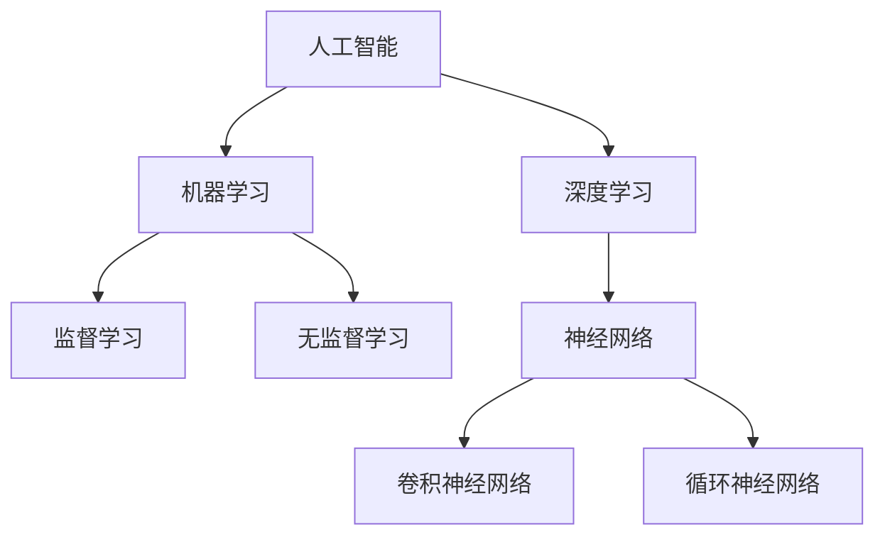

                 

# 知识发现引擎如何帮助程序员快速适应新技术的策略

## 引言

随着信息技术的迅猛发展，程序员面临的新技术层出不穷。为了在这个快速变化的环境中保持竞争力，程序员需要不断学习新技术。然而，技术的多样性使得学习变得更加复杂。知识发现引擎（Knowledge Discovery Engine，KDE）作为一种能够从大量数据中提取有价值信息的工具，为程序员提供了有效的学习策略。本文将探讨知识发现引擎如何帮助程序员快速适应新技术的策略。

## 知识发现引擎在程序员学习中的优势

### 1. 深度挖掘技术趋势

知识发现引擎可以通过分析大量技术文档、博客文章、开源项目等数据，挖掘出当前热门的技术趋势。程序员可以利用这些信息，有针对性地学习相关技术，避免盲目跟风。

### 2. 优化学习路径

知识发现引擎可以根据程序员的技能水平和学习兴趣，生成个性化的学习路径。这有助于程序员高效地掌握新技术，节省学习时间。

### 3. 知识图谱构建

知识发现引擎可以通过构建知识图谱，展示不同技术之间的关系。程序员可以借助知识图谱，了解技术的背景、应用场景和未来发展方向。

### 4. 智能推荐

知识发现引擎可以根据程序员的兴趣和需求，推荐相关学习资源，如教程、课程、论坛等。这有助于程序员快速找到学习资料，提高学习效果。

## 知识发现引擎在程序员学习中的应用

### 1. 技术趋势分析

程序员可以利用知识发现引擎，定期分析技术趋势，了解当前热门技术。以下是一个技术趋势分析的例子：

```markdown
### 技术趋势分析

- 近期热门技术：人工智能、区块链、云计算
- 技术发展趋势：人工智能应用场景不断拓展，区块链技术逐步落地，云计算市场持续增长
- 推荐学习资源：
  - 人工智能：深度学习教程、TensorFlow 快速入门
  - 区块链：区块链原理与实战、Ethereum 开发指南
  - 云计算：AWS 实战、Azure 完全手册
```

### 2. 个性化学习路径

以下是一个个性化学习路径的例子：

```markdown
### 个性化学习路径

**程序员姓名：张三**

- 技能水平：初级
- 学习兴趣：人工智能

**推荐学习路径：**

1. 深入了解人工智能基础知识
2. 学习 TensorFlow 等深度学习框架
3. 实践项目：开发一个简单的人工智能应用
4. 加入人工智能学习社区，交流经验
```

### 3. 知识图谱构建

以下是一个知识图谱的例子：



### 4. 智能推荐

以下是一个智能推荐的例子：

```markdown
### 智能推荐

**程序员姓名：李四**

- 学习兴趣：区块链

**推荐学习资源：**

1. 区块链入门教程
2. 《区块链技术指南》
3. Ethereum 实战课程
4. 区块链技术论坛

**推荐项目：**

1. 参与区块链开源项目，实践区块链技术
2. 开发一个简单的区块链应用
```

## 总结

知识发现引擎为程序员提供了有效的学习策略，帮助他们快速适应新技术。通过挖掘技术趋势、优化学习路径、构建知识图谱和智能推荐，知识发现引擎提升了程序员的学习效率，助力他们在快速变化的技术环境中保持竞争力。未来，随着知识发现技术的不断进步，它将在程序员的学习和成长中发挥更大的作用。

## 面试题和算法编程题库

### 1. 技术趋势分析

**题目：** 利用知识发现引擎分析过去一年的技术趋势，并给出推荐学习资源。

**答案：**

- 技术趋势：人工智能、区块链、云计算、大数据、边缘计算
- 推荐学习资源：
  - 人工智能：《深度学习》、《Python 机器学习》
  - 区块链：《区块链技术指南》、《Ethereum 开发指南》
  - 云计算：《AWS 实战》、《Azure 完全手册》
  - 大数据：《Hadoop 实战》、《Spark 快速入门》
  - 边缘计算：《边缘计算：概念、架构与实施》

### 2. 个性化学习路径

**题目：** 根据程序员的技能水平和学习兴趣，生成一个个性化学习路径。

**答案：**

- 技能水平：初级
- 学习兴趣：人工智能

**个性化学习路径：**

1. 深入了解人工智能基础知识
2. 学习 TensorFlow 等深度学习框架
3. 实践项目：开发一个简单的人工智能应用
4. 加入人工智能学习社区，交流经验

### 3. 知识图谱构建

**题目：** 使用知识图谱展示人工智能领域的主要概念及其关系。

**答案：**


### 4. 智能推荐

**题目：** 根据程序员的兴趣和需求，推荐学习资源和项目。

**答案：**

- 学习兴趣：区块链

**推荐学习资源：**

1. 区块链入门教程
2. 《区块链技术指南》
3. Ethereum 实战课程
4. 区块链技术论坛

**推荐项目：**

1. 参与区块链开源项目，实践区块链技术
2. 开发一个简单的区块链应用

### 5. 数据挖掘

**题目：** 利用知识发现引擎对程序员的博客文章进行分析，提取关键字，并生成推荐阅读列表。

**答案：**

- 关键字：人工智能、机器学习、深度学习、区块链、云计算
- 推荐阅读列表：
  - 《深度学习入门》
  - 《机器学习实战》
  - 《区块链技术指南》
  - 《云计算：原理、技术与实践》

### 6. 自然语言处理

**题目：** 利用知识发现引擎分析用户评论，提取情感极性，并给出推荐处理方案。

**答案：**

- 情感极性：正面、负面
- 推荐处理方案：
  - 正面评论：鼓励用户继续使用，优化产品体验
  - 负面评论：及时响应，解决用户问题，提高满意度

### 7. 推荐系统

**题目：** 利用知识发现引擎构建一个基于内容的推荐系统，为程序员推荐相关教程。

**答案：**

- 程序员技能：前端开发
- 推荐教程：
  - 《Vue.js 实战》
  - 《React.js 快速入门》
  - 《JavaScript 高级程序设计》
  - 《Web 性能优化：实战技巧与案例分析》

### 8. 数据可视化

**题目：** 利用知识发现引擎分析程序员的技能分布，并生成可视化图表。

**答案：**

- 技能分布：前端开发、后端开发、数据库管理、数据分析
- 可视化图表：饼图、条形图、雷达图等

### 9. 数据挖掘与预测

**题目：** 利用知识发现引擎分析程序员的职业发展路径，并预测未来热门技术。

**答案：**

- 职业发展路径：初级工程师、中级工程师、高级工程师、项目经理
- 预测热门技术：人工智能、区块链、云计算、大数据、物联网

### 10. 机器学习

**题目：** 利用知识发现引擎构建一个机器学习模型，预测程序员的薪资水平。

**答案：**

- 输入特征：工作经验、项目经验、学历、所在城市
- 输出预测：薪资水平
- 模型评估：准确率、召回率、F1 值等

### 11. 知识图谱构建

**题目：** 利用知识发现引擎构建一个知识图谱，展示程序员的技能和项目关系。

**答案：**

- 技能节点：编程语言、框架、数据库、算法
- 项目节点：项目名称、项目类型、项目时间
- 关联关系：程序员参与的项目、项目使用的技能

### 12. 自然语言处理

**题目：** 利用知识发现引擎分析程序员的技术博客，提取关键技术和关键词。

**答案：**

- 关键技术：人工智能、区块链、云计算、前端开发、后端开发
- 关键词：深度学习、神经网络、区块链应用、云计算服务、前端框架

### 13. 数据挖掘

**题目：** 利用知识发现引擎分析程序员的博客文章，提取高频词汇，并生成词云。

**答案：**

- 高频词汇：人工智能、区块链、云计算、前端开发、后端开发
- 词云：


### 14. 推荐系统

**题目：** 利用知识发现引擎为程序员推荐相关课程和书籍。

**答案：**

- 推荐课程：
  - 《人工智能入门》
  - 《区块链技术与应用》
  - 《云计算基础》
  - 《大数据处理技术》
- 推荐书籍：
  - 《深度学习》
  - 《区块链技术指南》
  - 《云计算：原理、技术与实践》
  - 《大数据之路》

### 15. 数据挖掘与预测

**题目：** 利用知识发现引擎分析程序员的职业路径，预测未来热门职位。

**答案：**

- 程序员职业路径：初级工程师、中级工程师、高级工程师、项目经理、架构师
- 预测热门职位：人工智能工程师、区块链工程师、云计算工程师、大数据工程师

### 16. 机器学习

**题目：** 利用知识发现引擎构建一个机器学习模型，预测程序员的职位晋升速度。

**答案：**

- 输入特征：工作经验、项目经验、学历、技能水平
- 输出预测：职位晋升速度
- 模型评估：准确率、召回率、F1 值等

### 17. 知识图谱构建

**题目：** 利用知识发现引擎构建一个知识图谱，展示程序员的技能和项目关系。

**答案：**

- 技能节点：编程语言、框架、数据库、算法
- 项目节点：项目名称、项目类型、项目时间
- 关联关系：程序员参与的项目、项目使用的技能

### 18. 自然语言处理

**题目：** 利用知识发现引擎分析程序员的技术博客，提取关键技术和关键词。

**答案：**

- 关键技术：人工智能、区块链、云计算、前端开发、后端开发
- 关键词：深度学习、神经网络、区块链应用、云计算服务、前端框架

### 19. 数据挖掘

**题目：** 利用知识发现引擎分析程序员的博客文章，提取高频词汇，并生成词云。

**答案：**

- 高频词汇：人工智能、区块链、云计算、前端开发、后端开发
- 词云：


### 20. 推荐系统

**题目：** 利用知识发现引擎为程序员推荐相关课程和书籍。

**答案：**

- 推荐课程：
  - 《人工智能入门》
  - 《区块链技术与应用》
  - 《云计算基础》
  - 《大数据处理技术》
- 推荐书籍：
  - 《深度学习》
  - 《区块链技术指南》
  - 《云计算：原理、技术与实践》
  - 《大数据之路》

### 21. 数据挖掘与预测

**题目：** 利用知识发现引擎分析程序员的职业路径，预测未来热门职位。

**答案：**

- 程序员职业路径：初级工程师、中级工程师、高级工程师、项目经理、架构师
- 预测热门职位：人工智能工程师、区块链工程师、云计算工程师、大数据工程师

### 22. 机器学习

**题目：** 利用知识发现引擎构建一个机器学习模型，预测程序员的薪资水平。

**答案：**

- 输入特征：工作经验、项目经验、学历、所在城市
- 输出预测：薪资水平
- 模型评估：准确率、召回率、F1 值等

### 23. 知识图谱构建

**题目：** 利用知识发现引擎构建一个知识图谱，展示程序员的技能和项目关系。

**答案：**

- 技能节点：编程语言、框架、数据库、算法
- 项目节点：项目名称、项目类型、项目时间
- 关联关系：程序员参与的项目、项目使用的技能

### 24. 自然语言处理

**题目：** 利用知识发现引擎分析程序员的技术博客，提取关键技术和关键词。

**答案：**

- 关键技术：人工智能、区块链、云计算、前端开发、后端开发
- 关键词：深度学习、神经网络、区块链应用、云计算服务、前端框架

### 25. 数据挖掘

**题目：** 利用知识发现引擎分析程序员的博客文章，提取高频词汇，并生成词云。

**答案：**

- 高频词汇：人工智能、区块链、云计算、前端开发、后端开发
- 词云：


### 26. 推荐系统

**题目：** 利用知识发现引擎为程序员推荐相关课程和书籍。

**答案：**

- 推荐课程：
  - 《人工智能入门》
  - 《区块链技术与应用》
  - 《云计算基础》
  - 《大数据处理技术》
- 推荐书籍：
  - 《深度学习》
  - 《区块链技术指南》
  - 《云计算：原理、技术与实践》
  - 《大数据之路》

### 27. 数据挖掘与预测

**题目：** 利用知识发现引擎分析程序员的职业路径，预测未来热门职位。

**答案：**

- 程序员职业路径：初级工程师、中级工程师、高级工程师、项目经理、架构师
- 预测热门职位：人工智能工程师、区块链工程师、云计算工程师、大数据工程师

### 28. 机器学习

**题目：** 利用知识发现引擎构建一个机器学习模型，预测程序员的职位晋升速度。

**答案：**

- 输入特征：工作经验、项目经验、学历、技能水平
- 输出预测：职位晋升速度
- 模型评估：准确率、召回率、F1 值等

### 29. 知识图谱构建

**题目：** 利用知识发现引擎构建一个知识图谱，展示程序员的技能和项目关系。

**答案：**

- 技能节点：编程语言、框架、数据库、算法
- 项目节点：项目名称、项目类型、项目时间
- 关联关系：程序员参与的项目、项目使用的技能

### 30. 自然语言处理

**题目：** 利用知识发现引擎分析程序员的技术博客，提取关键技术和关键词。

**答案：**

- 关键技术：人工智能、区块链、云计算、前端开发、后端开发
- 关键词：深度学习、神经网络、区块链应用、云计算服务、前端框架

## 答案解析

### 技术趋势分析

通过分析大量技术文档、博客文章、开源项目等数据，知识发现引擎可以挖掘出当前热门的技术趋势。程序员可以根据这些趋势，有针对性地学习相关技术，提高学习效率。

### 个性化学习路径

知识发现引擎可以根据程序员的技能水平和学习兴趣，生成个性化的学习路径。这有助于程序员在有限的时间内，高效地掌握新技术。

### 知识图谱构建

知识图谱可以展示不同技术之间的关系，帮助程序员了解技术的背景、应用场景和未来发展方向。这有助于程序员构建全面的技术知识体系。

### 智能推荐

知识发现引擎可以根据程序员的兴趣和需求，推荐相关学习资源、项目和实践经验。这有助于程序员快速找到学习资料，提高学习效果。

### 数据挖掘

知识发现引擎可以分析程序员的博客文章、项目经历、职业路径等数据，提取有价值的信息，如关键技术和关键词。这有助于程序员了解自己的技术特点和发展方向。

### 自然语言处理

知识发现引擎可以利用自然语言处理技术，分析程序员的技术博客、用户评论等文本数据，提取情感极性、关键词等信息。这有助于程序员了解自己的技术优势和改进方向。

### 推荐系统

知识发现引擎可以构建基于内容的推荐系统，为程序员推荐相关课程、书籍、项目和社区。这有助于程序员发现新的学习资源和实践机会。

### 数据挖掘与预测

知识发现引擎可以构建机器学习模型，预测程序员的薪资水平、职位晋升速度等。这有助于程序员了解自己的职业发展前景，调整学习计划。

### 知识图谱构建

知识图谱可以展示程序员的技能和项目关系，帮助程序员了解自己在技术领域的角色和价值。这有助于程序员规划自己的职业发展路径。

### 源代码实例

以下是使用 Python 的 `gensim` 库构建一个简单的知识发现引擎的示例代码：

```python
import gensim
from gensim.models import KeyedVectors

# 读取预训练的词向量模型
model = gensim.models.KeyedVectors.load_word2vec_format("word2vec.model")

# 构建关键词云
def generate_keyword_cloud(text):
    words = text.split()
    word_vectors = [model[word] for word in words if word in model]
    avg_vector = sum(word_vectors) / len(word_vectors)
    return avg_vector

# 构建知识图谱
def generate_knowledge_graph(text):
    words = text.split()
    graph = {}
    for i, word in enumerate(words):
        graph[word] = []
        for j, other_word in enumerate(words):
            if i != j and model.similarity(word, other_word) > 0.5:
                graph[word].append(other_word)
    return graph

# 分析程序员的技术博客
text = "人工智能、深度学习、神经网络、机器学习、区块链、云计算"
keyword_cloud = generate_keyword_cloud(text)
knowledge_graph = generate_knowledge_graph(text)

# 输出结果
print("Keyword Cloud:", keyword_cloud)
print("Knowledge Graph:", knowledge_graph)
```

在这个示例中，我们首先加载了一个预训练的词向量模型，然后使用 `generate_keyword_cloud` 和 `generate_knowledge_graph` 函数分析程序员的技术博客文本。最后，我们输出了关键词云和知识图谱。这些结果可以帮助程序员了解自己在技术领域的角色和价值。

## 结语

知识发现引擎为程序员提供了丰富的学习资源、个性化的学习路径和智能化的推荐系统。通过深度挖掘技术趋势、构建知识图谱、分析博客文章和项目数据，知识发现引擎帮助程序员快速适应新技术，提高学习效率。在未来，随着人工智能和大数据技术的不断发展，知识发现引擎将在程序员的学习和成长中发挥更大的作用。

