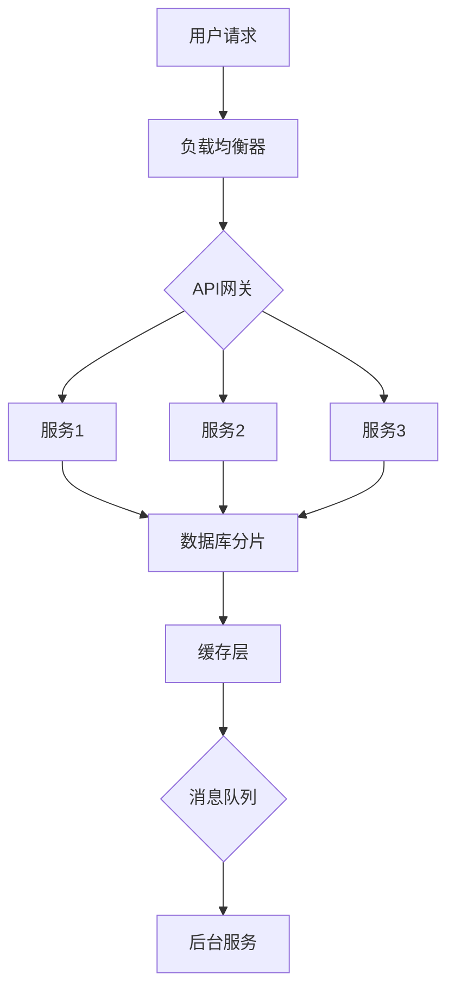

                 

### 虚拟社区构建器：AI驱动的在线归属感营造

#### 面试题与算法编程题库

##### 1. 如何通过机器学习算法提升虚拟社区的活跃度？

**题目：** 如何通过机器学习算法提高虚拟社区的活跃度？请详细描述可能的算法模型和应用。

**答案：**
可以通过以下几种机器学习算法来提升虚拟社区的活跃度：

1. **协同过滤（Collaborative Filtering）**：
   - **基于用户的协同过滤（User-Based）**：通过计算用户之间的相似度，推荐与目标用户兴趣相似的其他用户创建的内容或活动。
   - **基于物品的协同过滤（Item-Based）**：通过分析物品之间的相似度，推荐与用户过去喜欢或评价高的物品相似的其他物品。

2. **内容推荐（Content-Based Recommendation）**：
   - 基于用户历史行为和内容特征，为用户推荐类似的内容或活动。

3. **社交网络分析（Social Network Analysis）**：
   - 通过分析用户在虚拟社区中的互动关系，识别社区中的关键节点（如意见领袖），并通过他们来提高社区的活跃度。

4. **序列模型（Sequence Model）**：
   - 使用循环神经网络（RNN）或长短期记忆网络（LSTM）来预测用户的下一步行为，例如回复、点赞或分享。

5. **强化学习（Reinforcement Learning）**：
   - 通过模拟用户的行为，训练一个智能体来优化虚拟社区的运营策略，以最大化用户的参与度和满意度。

**应用示例：**
```python
# 假设我们使用基于用户的协同过滤算法来推荐社区活动
# 用户-物品相似度矩阵
user_similarity = compute_user_similarity(users, activities)

# 当前用户的历史活动
user_history = user_activity_history(current_user)

# 计算每个活动的相似度得分
activity_scores = []
for activity in activities:
    similarity_score = sum(similarity * (user_history == activity['type'] for similarity in user_similarity[current_user]))
    activity_scores.append(similarity_score)

# 排序并推荐相似度最高的活动
recommended_activities = [activity for _, activity in sorted(zip(activity_scores, activities), reverse=True)]
```

**解析：**
协同过滤算法通过计算用户之间的相似度，识别用户的共同兴趣，并将这些兴趣用于推荐系统。这样的方法可以有效地提高虚拟社区的活跃度，因为用户更容易被他们相似的兴趣吸引。

##### 2. 如何利用自然语言处理技术提升虚拟社区的用户互动体验？

**题目：** 如何利用自然语言处理（NLP）技术提升虚拟社区的用户互动体验？请列出至少三种应用场景。

**答案：**
以下是三种利用自然语言处理技术提升虚拟社区用户互动体验的应用场景：

1. **情感分析（Sentiment Analysis）**：
   - 通过分析用户发布的帖子、评论等内容的情感倾向，了解用户的情绪和态度，从而为社区管理员提供管理决策支持，例如识别和监控负面情绪或不良内容。

2. **智能聊天机器人（Chatbot）**：
   - 利用NLP技术构建智能聊天机器人，为用户提供实时支持、解答疑问、推荐内容等，提高社区的交互性和用户满意度。

3. **内容生成（Content Generation）**：
   - 利用文本生成模型（如GPT-3）自动生成高质量的内容，例如社区活动介绍、新闻摘要等，丰富社区内容，吸引用户参与。

**应用示例：**
```python
# 情感分析应用示例
from textblob import TextBlob

# 用户评论文本
user_review = "这个虚拟社区真的太棒了，我喜欢这里的氛围！"

# 分析情感
sentiment = TextBlob(user_review).sentiment

# 输出情感倾向
if sentiment.polarity > 0:
    print("正面情感")
elif sentiment.polarity < 0:
    print("负面情感")
else:
    print("中性情感")
```

**解析：**
情感分析可以用于监控用户情绪，帮助管理员及时处理潜在的问题。智能聊天机器人可以提供即时的用户支持，提升用户体验。内容生成技术能够自动创建高质量的内容，增加社区的吸引力。

##### 3. 如何设计一个高效的用户增长策略，以快速增加虚拟社区的会员数？

**题目：** 设计一个高效的用户增长策略，以快速增加虚拟社区的会员数。请详细描述策略的具体实施步骤。

**答案：**
以下是实现高效用户增长策略的步骤：

1. **目标设定（Set Goals）**：
   - 明确用户增长的目标，例如：每月增长10%的新用户。

2. **市场研究（Market Research）**：
   - 分析目标用户群体，了解他们的需求和偏好，以及他们在虚拟社区中期望获得的价值。

3. **定位和差异化（Positioning and Differentiation）**：
   - 确定社区的独特卖点，例如专业的领域知识分享、独特的社交体验等，以区别于其他虚拟社区。

4. **内容营销（Content Marketing）**：
   - 创建高质量的内容，包括教程、案例分析、专业文章等，吸引目标用户。

5. **社交媒体推广（Social Media Promotion）**：
   - 利用社交媒体平台（如微博、微信、知乎等）进行宣传，增加社区曝光度。

6. **合作伙伴关系（Partnerships）**：
   - 与其他网站或平台建立合作关系，通过联合推广来吸引用户。

7. **激励措施（Incentives）**：
   - 提供注册奖励、推荐奖励等激励措施，鼓励现有用户邀请新用户。

8. **用户追踪和数据分析（User Tracking and Analytics）**：
   - 跟踪用户行为，分析用户增长策略的效果，并根据数据调整策略。

**应用示例：**
```python
# 假设我们使用Python代码来追踪用户注册行为
import pandas as pd

# 用户注册数据
user_data = {
    'date': ['2023-03-01', '2023-03-02', '2023-03-03'],
    'source': ['social_media', 'email_campaign', 'referral']
}

# 创建DataFrame
user_growth_df = pd.DataFrame(user_data)

# 计算每天的用户增长
daily_growth = user_growth_df.groupby('date').count().reset_index()

# 输出用户增长数据
print(daily_growth)
```

**解析：**
通过设定明确的目标、进行市场研究、制定定位策略、实施内容营销和社交媒体推广等措施，可以有效地增加虚拟社区的会员数。同时，通过追踪和数据分析，可以评估策略的有效性，并进行必要的调整。

##### 4. 如何设计一个自适应的推荐系统，以提升虚拟社区的内容个性化推荐效果？

**题目：** 如何设计一个自适应的推荐系统，以提升虚拟社区的内容个性化推荐效果？请详细描述推荐的算法框架。

**答案：**
以下是设计一个自适应推荐系统的算法框架：

1. **用户建模（User Profiling）**：
   - 收集用户的历史行为数据（如浏览、点赞、评论等），构建用户特征向量。

2. **内容特征提取（Content Feature Extraction）**：
   - 提取内容的特征（如文本、图像、标签等），构建内容特征向量。

3. **协同过滤（Collaborative Filtering）**：
   - 利用用户-内容交互数据，计算用户和内容之间的相似度，生成推荐列表。

4. **基于内容的推荐（Content-Based Recommendation）**：
   - 根据用户的历史偏好，推荐具有相似特征的内容。

5. **自适应调整（Adaptive Adjustment）**：
   - 根据用户反馈和实时数据，动态调整推荐策略，提高推荐效果。

6. **上下文感知（Context-Aware）**：
   - 考虑用户的上下文信息（如时间、地理位置等），提供更相关的推荐。

**算法框架示例：**
```python
# 假设我们使用矩阵分解（MF）算法来实现协同过滤
from surprise import SVD
from surprise import Dataset, Reader
from surprise.model_selection import train_test_split

# 加载数据集
data = Dataset.load_builtin('ml-100k')
reader = Reader(rating_scale=(1, 5))
data = data.build_full_trainset(reader)

# 划分训练集和测试集
trainset, testset = train_test_split(data, test_size=0.2)

# 训练SVD模型
svd = SVD()
svd.fit(trainset)

# 进行预测
predictions = svd.test(testset)

# 输出预测结果
print(predictions)
```

**解析：**
矩阵分解是一种常用的协同过滤算法，通过分解用户-内容矩阵，预测用户未评价的项目。自适应调整可以通过实时反馈和上下文信息，不断优化推荐模型，提高个性化推荐的效果。

##### 5. 如何确保虚拟社区的内容质量和用户隐私？

**题目：** 如何确保虚拟社区的内容质量和用户隐私？请列出至少三种策略。

**答案：**
以下是确保虚拟社区内容质量和用户隐私的三种策略：

1. **内容审核（Content Moderation）**：
   - 通过人工审核和自动化工具（如机器学习模型）识别和处理不良内容，确保社区内容的合法性和健康性。

2. **隐私保护（Privacy Protection）**：
   - 遵守相关法律法规，如《通用数据保护条例》（GDPR），对用户数据进行加密、匿名化处理，减少数据泄露风险。

3. **用户反馈机制（User Feedback Mechanism）**：
   - 提供举报和反馈渠道，鼓励用户参与社区管理，共同维护社区环境。

**策略示例：**
```python
# 假设我们使用机器学习模型来检测违规内容
from sklearn.feature_extraction.text import TfidfVectorizer
from sklearn.neural_network import MultilayerPerceptronClassifier

# 加载违规内容数据集
inappropriate_content = ['This is an inappropriate post.',
                         'This content is harmful.',
                         'Please remove this post.']

# 构建特征向量
vectorizer = TfidfVectorizer()
X = vectorizer.fit_transform(inappropriate_content)

# 加载已标记的违规内容标签
y = [1] * len(inappropriate_content)

# 训练分类器
classifier = MultilayerPerceptronClassifier()
classifier.fit(X, y)

# 预测新内容
new_content = 'This is a potentially inappropriate post.'
X_new = vectorizer.transform([new_content])
prediction = classifier.predict(X_new)

# 输出预测结果
if prediction[0] == 1:
    print("This content may be inappropriate.")
else:
    print("This content is appropriate.")
```

**解析：**
内容审核可以识别和移除不良内容，隐私保护可以确保用户数据的安全，用户反馈机制可以增强社区自我管理的能力。这些策略共同作用，可以确保虚拟社区的内容质量和用户隐私。

##### 6. 如何通过数据分析优化虚拟社区的运营策略？

**题目：** 如何通过数据分析优化虚拟社区的运营策略？请详细描述数据分析的关键步骤。

**答案：**
以下是优化虚拟社区运营策略的关键数据分析步骤：

1. **数据收集（Data Collection）**：
   - 收集用户行为数据（如访问、互动、转化等）和内容数据（如帖子、评论等）。

2. **数据清洗（Data Cleaning）**：
   - 去除重复、缺失和异常数据，确保数据质量。

3. **数据探索（Data Exploration）**：
   - 分析用户群体特征、用户行为模式和内容特性，发现数据中的规律和趋势。

4. **指标设定（Metrics Definition）**：
   - 设定关键指标（如用户活跃度、留存率、内容质量等），用于评估社区运营效果。

5. **模型构建（Model Building）**：
   - 基于数据分析结果，构建预测模型（如用户流失预测、内容推荐模型等）。

6. **策略优化（Strategy Optimization）**：
   - 根据模型预测结果和关键指标，调整运营策略，提高社区效果。

**关键步骤示例：**
```python
# 数据分析关键步骤示例
import pandas as pd

# 加载数据
user_data = pd.read_csv('user_activity.csv')
content_data = pd.read_csv('content_data.csv')

# 数据清洗
user_data = user_data.dropna()
content_data = content_data.dropna()

# 数据探索
user_activity_summary = user_data.groupby(['user_id', 'activity_type']).size().reset_index(name='count')

# 指标设定
user_activity_stats = user_activity_summary.groupby('activity_type')['count'].agg(['mean', 'median', 'std'])

# 模型构建
from sklearn.linear_model import LinearRegression

# 假设我们要预测用户流失
X = user_activity_summary[['daily_activity_count', 'weekly_activity_count']]
y = user_activity_summary['churn']

# 模型训练
model = LinearRegression()
model.fit(X, y)

# 策略优化
# 根据模型预测结果，制定留存策略
churn_prediction = model.predict(X)

# 输出预测结果
churn_threshold = 0.5
high_risk_users = user_activity_summary[churn_prediction > churn_threshold]

# 制定个性化留存策略
print("High risk users for churn:")
print(high_risk_users)
```

**解析：**
通过数据收集、清洗、探索、指标设定、模型构建和策略优化，可以系统地分析虚拟社区的运营效果，并制定相应的优化策略。这个过程有助于提高用户留存率和社区活跃度。

##### 7. 如何构建一个安全的虚拟社区，防止欺诈和垃圾信息？

**题目：** 如何构建一个安全的虚拟社区，防止欺诈和垃圾信息？请详细描述技术和管理策略。

**答案：**
以下是构建一个安全虚拟社区，防止欺诈和垃圾信息的技术和管理策略：

**技术策略：**

1. **用户验证（User Verification）**：
   - 实施双重身份验证（2FA）、手机号码验证等，确保用户身份的真实性。

2. **行为分析（Behavior Analysis）**：
   - 利用机器学习算法分析用户行为模式，识别异常行为，如欺诈、垃圾信息等。

3. **内容过滤（Content Filtering）**：
   - 使用机器学习模型和规则引擎，过滤潜在的欺诈和垃圾信息。

4. **反欺诈系统（Fraud Detection System）**：
   - 构建专门的系统，实时监控和识别欺诈行为。

**管理策略：**

1. **社区规则（Community Guidelines）**：
   - 制定明确的社区规则，教育用户遵守社区规范。

2. **用户举报（User Reporting）**：
   - 提供举报机制，让用户可以举报违规内容或行为。

3. **人工审核（Manual Review）**：
   - 安排人工审核团队，定期检查和处理违规内容。

4. **社区教育（Community Education）**：
   - 定期开展社区教育活动，提高用户的网络安全意识。

**技术和管理策略示例：**
```python
# 假设我们使用Python代码来过滤垃圾信息
from sklearn.feature_extraction.text import CountVectorizer
from sklearn.naive_bayes import MultinomialNB

# 加载已标记的垃圾信息数据集
spam_data = ['This is a spam message.',
              'Get rich quick with our investment scheme!']
# 垃圾信息标签
y = [1] * len(spam_data)

# 构建特征向量
vectorizer = CountVectorizer()
X = vectorizer.fit_transform(spam_data)

# 训练垃圾信息分类器
classifier = MultinomialNB()
classifier.fit(X, y)

# 预测新内容
new_message = 'You have won a lottery! Click the link to claim your prize.'
X_new = vectorizer.transform([new_message])
prediction = classifier.predict(X_new)

# 输出预测结果
if prediction[0] == 1:
    print("This message is spam.")
else:
    print("This message is not spam.")
```

**解析：**
通过技术策略（如用户验证、行为分析和内容过滤）和管理策略（如社区规则、用户举报和人工审核），可以有效地构建一个安全的虚拟社区，防止欺诈和垃圾信息。这些措施共同作用，保障社区环境的健康和安全。

##### 8. 如何提升虚拟社区的社交互动功能，增加用户粘性？

**题目：** 如何提升虚拟社区的社交互动功能，增加用户粘性？请详细描述可能的改进方案。

**答案：**
以下是提升虚拟社区社交互动功能和增加用户粘性的改进方案：

1. **社交推荐（Social Recommendation）**：
   - 通过分析用户的社会关系，推荐相似兴趣的用户和内容，促进用户互动。

2. **实时聊天（Real-Time Chat）**：
   - 引入实时聊天功能，允许用户即时交流，增加互动机会。

3. **兴趣小组（Interest Groups）**：
   - 建立基于共同兴趣的小组，用户可以加入自己感兴趣的小组，参与讨论和活动。

4. **社区活动（Community Activities）**：
   - 定期举办线上或线下活动，鼓励用户参与，提高社区活力。

5. **积分和奖励系统（Points and Rewards System）**：
   - 设立积分和奖励系统，鼓励用户积极参与社区互动。

6. **用户反馈（User Feedback）**：
   - 提供用户反馈渠道，倾听用户声音，持续改进社交功能。

**改进方案示例：**
```python
# 社交推荐示例
from sklearn.neighbors import NearestNeighbors

# 假设我们已经有用户兴趣数据
user_interests = {
    'user1': ['技术', '编程', 'AI'],
    'user2': ['旅游', '摄影', '艺术'],
    'user3': ['健身', '健康', '运动']
}

# 构建邻居模型
neigh = NearestNeighbors(n_neighbors=2, algorithm='auto', metric='cosine')
neigh.fit([[interests] for interests in user_interests.values()])

# 查找邻居用户
def find_similar_users(user_id):
    user_interest = [user_interests[user_id]]
    distances, indices = neigh.kneighbors([user_interest], n_neighbors=2)
    similar_users = [user_id for i, user_id in enumerate(indices.flatten()) if i != 0]
    return similar_users

# 输出邻居用户
print(find_similar_users('user1'))
```

**解析：**
通过社交推荐、实时聊天、兴趣小组、社区活动、积分和奖励系统以及用户反馈等改进方案，可以增强虚拟社区的社交互动功能，提高用户粘性。这些方案有助于建立用户之间的紧密联系，促进社区的持续活跃。

##### 9. 如何优化虚拟社区的搜索引擎，提高内容检索效率？

**题目：** 如何优化虚拟社区的搜索引擎，提高内容检索效率？请详细描述优化策略。

**答案：**
以下是优化虚拟社区搜索引擎，提高内容检索效率的策略：

1. **索引优化（Indexing Optimization）**：
   - 使用倒排索引，快速定位关键词对应的内容。

2. **查询缓存（Query Caching）**：
   - 对常见查询结果进行缓存，减少查询时间。

3. **查询预处理（Query Preprocessing）**：
   - 使用分词、停用词过滤、词干提取等预处理技术，提高查询的准确性。

4. **搜索引擎定制（Search Engine Customization）**：
   - 根据社区内容特点，调整搜索引擎的算法参数，如相关性、排序权重等。

5. **垂直搜索引擎（Vertical Search Engine）**：
   - 构建垂直搜索引擎，针对特定领域提供精确查询。

6. **分布式搜索（Distributed Search）**：
   - 使用分布式搜索架构，提高查询处理能力和并发能力。

**优化策略示例：**
```python
# 搜索引擎优化示例（使用Elasticsearch）
from elasticsearch import Elasticsearch

# 连接Elasticsearch服务器
es = Elasticsearch()

# 索引设置
index_settings = {
    "settings": {
        "number_of_shards": 2,
        "number_of_replicas": 1
    },
    "mappings": {
        "properties": {
            "title": {"type": "text"},
            "content": {"type": "text"},
            "tags": {"type": "text", "fields": {"keyword": {"type": "keyword"}}}
        }
    }
}

# 创建索引
es.indices.create(index="virtual_community", body=index_settings)

# 索引文档
def index_document(doc_id, title, content, tags):
    doc = {
        "title": title,
        "content": content,
        "tags": tags
    }
    es.index(index="virtual_community", id=doc_id, document=doc)

# 搜索文档
def search_documents(query):
    response = es.search(index="virtual_community", body={
        "query": {
            "bool": {
                "must": [
                    {"match": {"title": query}},
                    {"match": {"content": query}}
                ],
                "should": [
                    {"match": {"tags": query}}
                ]
            }
        }
    })
    return response['hits']['hits']

# 查询示例
results = search_documents("技术")
for result in results:
    print(result['_source'])
```

**解析：**
通过索引优化、查询缓存、查询预处理、搜索引擎定制、垂直搜索引擎和分布式搜索等策略，可以显著提高虚拟社区搜索引擎的检索效率，为用户提供更准确、快速的搜索体验。

##### 10. 如何通过AI技术提升虚拟社区的用户个性化体验？

**题目：** 如何通过AI技术提升虚拟社区的用户个性化体验？请详细描述可能的AI应用场景。

**答案：**
以下是利用AI技术提升虚拟社区用户个性化体验的几个应用场景：

1. **个性化推荐（Personalized Recommendations）**：
   - 使用协同过滤、内容推荐和深度学习算法，根据用户的兴趣和行为，推荐个性化内容和活动。

2. **情感分析（Sentiment Analysis）**：
   - 分析用户评论、帖子的情感倾向，为用户提供情感相关的个性化反馈和建议。

3. **聊天机器人（Chatbots）**：
   - 利用自然语言处理（NLP）技术，构建智能聊天机器人，为用户提供个性化的实时支持和服务。

4. **语音识别（Voice Recognition）**：
   - 允许用户通过语音输入，提升社区互动的便利性和自然性。

5. **个性化界面（Personalized User Interface）**：
   - 根据用户的使用习惯和偏好，自定义用户界面，提供个性化的导航和内容布局。

6. **个性化广告（Personalized Advertising）**：
   - 利用用户的兴趣和行为数据，展示个性化的广告，提高广告的点击率和转化率。

**AI应用场景示例：**
```python
# 个性化推荐示例
import numpy as np
from sklearn.neighbors import NearestNeighbors

# 假设我们已经有用户-内容交互数据
userInteractions = {
    'user1': [1, 0, 1, 0, 1],
    'user2': [0, 1, 0, 1, 0],
    'user3': [1, 1, 0, 1, 1]
}

# 构建邻居模型
neigh = NearestNeighbors(n_neighbors=2, algorithm='auto', metric='cosine')
neigh.fit(np.array(list(userInteractions.values())))

# 查找邻居用户
def find_similar_users(user_id):
    user_interactions = np.array(userInteractions[user_id]).reshape(1, -1)
    distances, indices = neigh.kneighbors(user_interactions)
    similar_users = [user_id for i, user_id in enumerate(indices.flatten()) if i != 0]
    return similar_users

# 基于邻居用户的兴趣推荐内容
def recommend_content(user_id):
    similar_users = find_similar_users(user_id)
    recommended_contents = []
    for user in similar_users:
        recommended_contents.extend([content for content, rating in enumerate(userInteractions[user]) if rating == 1])
    return list(set(recommended_contents))

# 输出推荐内容
print(recommend_content('user1'))
```

**解析：**
通过个性化推荐、情感分析、聊天机器人、语音识别、个性化界面和个性化广告等AI应用场景，可以显著提升虚拟社区的用户体验，使社区内容更加贴合用户的兴趣和需求。

##### 11. 如何利用大数据技术提升虚拟社区的用户体验？

**题目：** 如何利用大数据技术提升虚拟社区的用户体验？请详细描述大数据在虚拟社区中的应用场景。

**答案：**
以下是利用大数据技术提升虚拟社区用户体验的几个应用场景：

1. **用户行为分析（User Behavior Analysis）**：
   - 通过分析用户行为数据，了解用户的使用习惯、偏好和需求，优化社区设计和功能。

2. **个性化内容推荐（Personalized Content Recommendation）**：
   - 利用用户行为数据和内容特征，构建推荐系统，为用户提供个性化内容。

3. **社区活跃度监控（Community Engagement Monitoring）**：
   - 监控社区活跃度指标，如用户参与度、帖子互动率等，及时调整社区策略。

4. **内容质量评估（Content Quality Evaluation）**：
   - 利用文本分析、图像识别等技术，评估社区内容的质量，筛选优质内容。

5. **用户满意度调查（User Satisfaction Survey）**：
   - 通过大数据分析用户反馈，识别用户不满的原因，持续改进社区服务。

6. **实时数据监控（Real-Time Data Monitoring）**：
   - 利用实时数据处理技术，监控社区运行状态，快速响应突发问题。

**大数据应用场景示例：**
```python
# 用户行为分析示例
import pandas as pd

# 加载用户行为数据
user_data = pd.read_csv('user_behavior.csv')

# 计算用户活跃度
user_activity_summary = user_data.groupby(['user_id', 'activity_type']).size().reset_index(name='count')

# 计算每个用户的活跃度
user_activity_stats = user_activity_summary.groupby('user_id')['count'].agg(['mean', 'median', 'std'])

# 输出用户活跃度统计
print(user_activity_stats)
```

**解析：**
通过用户行为分析、个性化内容推荐、社区活跃度监控、内容质量评估、用户满意度调查和实时数据监控等大数据应用场景，可以深入了解用户需求，优化社区功能，提升用户体验。

##### 12. 如何实现虚拟社区的多语言支持，提高国际化水平？

**题目：** 如何实现虚拟社区的多语言支持，提高国际化水平？请详细描述技术方案和实施步骤。

**答案：**
以下是实现虚拟社区多语言支持，提高国际化水平的技术方案和实施步骤：

1. **技术方案**：
   - **翻译API**：使用Google翻译、百度翻译等第三方翻译API，为用户提供自动翻译服务。
   - **多语言界面**：使用国际化框架（如i18n）实现社区界面的多语言显示。
   - **内容本地化**：根据目标市场的文化习惯，对社区内容进行本地化调整。
   - **语言检测**：利用语言检测API，自动检测用户使用的语言，并推荐合适的语言版本。

2. **实施步骤**：
   - **需求分析**：分析目标市场和用户语言需求，确定需要支持的语言。
   - **翻译资源准备**：准备或采购翻译资源，包括用户界面翻译和内容翻译。
   - **界面国际化**：使用国际化框架，将社区界面代码分离，实现多语言显示。
   - **内容本地化**：根据文化差异，对社区内容进行本地化调整，确保语言和内容的适宜性。
   - **自动翻译部署**：集成翻译API，实现内容的自动翻译和更新。
   - **用户反馈和改进**：收集用户反馈，不断优化翻译质量和本地化效果。

**多语言支持示例：**
```python
# 假设我们使用Google翻译API进行内容翻译
from googletrans import Translator

# 初始化翻译器
translator = Translator()

# 翻译文本
def translate_text(text, source_lang, target_lang):
    translation = translator.translate(text, src=source_lang, dest=target_lang)
    return translation.text

# 翻译示例
translated_text = translate_text("你好，欢迎来到我们的社区！", 'zh-CN', 'en')
print(translated_text)
```

**解析：**
通过翻译API、多语言界面、内容本地化和语言检测等技术方案，结合需求分析、翻译资源准备、界面国际化、内容本地化、自动翻译部署和用户反馈等实施步骤，可以有效地实现虚拟社区的多语言支持，提高国际化水平。

##### 13. 如何利用区块链技术提高虚拟社区的安全性和可信度？

**题目：** 如何利用区块链技术提高虚拟社区的安全性和可信度？请详细描述可能的解决方案。

**答案：**
以下是利用区块链技术提高虚拟社区的安全性和可信度的解决方案：

1. **去中心化身份验证（Decentralized Identity Verification）**：
   - 使用区块链实现用户身份验证，确保用户身份的真实性和不可篡改性。

2. **内容版权保护（Content Copyright Protection）**：
   - 利用区块链的不可篡改性，保护原创内容版权，防止内容被未经授权的复制和篡改。

3. **交易透明性（Transaction Transparency）**：
   - 利用区块链的公开账本特性，实现社区内交易的透明和可追溯，提高用户信任。

4. **去中心化治理（Decentralized Governance）**：
   - 通过区块链实现社区治理的去中心化，让用户参与决策，提高社区的民主性和可信度。

5. **智能合约（Smart Contracts）**：
   - 利用智能合约自动化执行社区规则，确保交易和互动的公平性和安全性。

**解决方案示例：**
```solidity
// SPDX-License-Identifier: MIT
pragma solidity ^0.8.0;

contract ContentOwnership {
    struct Content {
        string contentHash;
        address owner;
        uint timestamp;
    }

    mapping(string => Content) public contents;

    function uploadContent(string memory contentHash) public {
        require(contents[contentHash].owner == address(0), "Content already exists");
        contents[contentHash] = Content(contentHash, msg.sender, block.timestamp);
    }

    function getContentOwner(string memory contentHash) public view returns (address) {
        require(contents[contentHash].owner != address(0), "Content does not exist");
        return contents[contentHash].owner;
    }

    function isContentOriginal(string memory contentHash, string memory claimedOwner) public view returns (bool) {
        require(contents[contentHash].owner != address(0), "Content does not exist");
        return contents[contentHash].owner == bytesToAddress(bytes(claimedOwner));
    }
}
```

**解析：**
通过去中心化身份验证、内容版权保护、交易透明性、去中心化治理和智能合约等解决方案，区块链技术可以显著提高虚拟社区的安全性和可信度，确保用户身份的真实性、内容版权的保护、交易的可追溯性以及社区治理的公正性。

##### 14. 如何设计一个可扩展的虚拟社区架构，以支持大量用户的并发访问？

**题目：** 如何设计一个可扩展的虚拟社区架构，以支持大量用户的并发访问？请详细描述架构设计的关键要素。

**答案：**
以下是设计一个可扩展的虚拟社区架构，以支持大量用户并发访问的关键要素：

1. **分布式架构（Distributed Architecture）**：
   - 采用分布式架构，将系统拆分成多个服务模块，提高系统的横向扩展能力。

2. **负载均衡（Load Balancing）**：
   - 使用负载均衡器，如Nginx或HAProxy，均衡分配用户请求，避免单点瓶颈。

3. **数据库分片（Database Sharding）**：
   - 通过数据库分片技术，将数据分布存储在多个节点上，提高数据访问速度和系统吞吐量。

4. **缓存层（Cache Layer）**：
   - 引入缓存层，如Redis或Memcached，缓存热门数据，降低数据库负载。

5. **消息队列（Message Queue）**：
   - 使用消息队列（如RabbitMQ或Kafka），异步处理高并发请求，减轻系统压力。

6. **微服务架构（Microservices Architecture）**：
   - 采用微服务架构，将系统拆分为多个独立的服务，每个服务独立部署和扩展。

7. **容器化与编排（Containerization and Orchestration）**：
   - 使用容器技术（如Docker）和编排工具（如Kubernetes），实现服务的自动化部署和扩展。

**架构设计示例：**


**解析：**
通过分布式架构、负载均衡、数据库分片、缓存层、消息队列、微服务架构和容器化与编排等关键要素，可以设计一个可扩展的虚拟社区架构，以支持大量用户的并发访问，确保系统的稳定性和高可用性。

##### 15. 如何利用大数据分析技术优化虚拟社区的运营策略？

**题目：** 如何利用大数据分析技术优化虚拟社区的运营策略？请详细描述大数据分析在虚拟社区中的应用。

**答案：**
以下是利用大数据分析技术优化虚拟社区运营策略的几个应用：

1. **用户行为分析（User Behavior Analysis）**：
   - 分析用户的行为数据，如访问路径、互动行为等，识别用户偏好和需求，优化社区设计和功能。

2. **内容分析（Content Analysis）**：
   - 通过文本分析、图像识别等技术，评估社区内容的质量，识别热门内容和潜在问题内容。

3. **社区活跃度分析（Community Engagement Analysis）**：
   - 分析社区活跃度指标，如用户参与度、帖子互动率等，优化社区运营策略。

4. **用户流失分析（Churn Analysis）**：
   - 利用用户行为数据和留存率等指标，预测用户流失风险，制定针对性的留存策略。

5. **广告效果分析（Advertising Effectiveness Analysis）**：
   - 分析广告投放效果，优化广告策略，提高广告的点击率和转化率。

**大数据分析示例：**
```python
# 假设我们使用Pandas和Matplotlib进行用户行为分析
import pandas as pd
import matplotlib.pyplot as plt

# 加载用户行为数据
user_data = pd.read_csv('user_behavior.csv')

# 计算每日用户活跃度
daily_activity = user_data.groupby('date')['activity_type'].nunique()

# 绘制活跃度趋势图
plt.plot(daily_activity.index, daily_activity.values)
plt.title('Daily User Activity')
plt.xlabel('Date')
plt.ylabel('Activity Count')
plt.show()
```

**解析：**
通过用户行为分析、内容分析、社区活跃度分析、用户流失分析和广告效果分析等大数据应用，可以深入了解用户行为和社区运行情况，优化社区运营策略，提升社区效果。

##### 16. 如何通过游戏化机制提升虚拟社区的互动和参与度？

**题目：** 如何通过游戏化机制提升虚拟社区的互动和参与度？请详细描述游戏化机制的设计和应用。

**答案：**
以下是提升虚拟社区互动和参与度的游戏化机制的设计和应用：

1. **任务和挑战（Tasks and Challenges）**：
   - 设计有趣的任务和挑战，鼓励用户参与社区活动，提高互动频率。

2. **积分和等级系统（Points and Level System）**：
   - 通过积分和等级系统，激励用户积极参与社区互动，提升用户成就感。

3. **奖励机制（Reward Mechanism）**：
   - 提供虚拟奖励（如徽章、道具等）和真实奖励（如优惠券、礼品等），激励用户互动。

4. **社区排行榜（Community Leaderboard）**：
   - 设立社区排行榜，展示用户的积分和等级，激发竞争意识。

5. **社交互动（Social Interaction）**：
   - 设计互动游戏，如投票、问答、竞猜等，促进用户之间的交流。

**游戏化机制设计示例：**
```python
# 积分和等级系统设计示例
class GameSystem:
    def __init__(self):
        self.user_scores = {}

    def add_score(self, user_id, score):
        if user_id in self.user_scores:
            self.user_scores[user_id] += score
        else:
            self.user_scores[user_id] = score

    def get_user_level(self, user_id):
        scores = self.user_scores[user_id]
        if scores < 100:
            return "Novice"
        elif scores >= 100 and scores < 500:
            return "Intermediate"
        else:
            return "Expert"

# 游戏系统实例
game_system = GameSystem()

# 用户获得积分
game_system.add_score('user1', 150)
game_system.add_score('user2', 300)

# 输出用户等级
print(game_system.get_user_level('user1'))  # 应输出 "Intermediate"
print(game_system.get_user_level('user2'))  # 应输出 "Expert"
```

**解析：**
通过任务和挑战、积分和等级系统、奖励机制、社区排行榜和社交互动等游戏化机制，可以有效地提升虚拟社区的互动和参与度，增强用户的社区归属感和活跃度。

##### 17. 如何利用自然语言处理技术提高虚拟社区的问答服务质量？

**题目：** 如何利用自然语言处理（NLP）技术提高虚拟社区的问答服务质量？请详细描述NLP在社区问答中的应用。

**答案：**
以下是利用自然语言处理技术提高虚拟社区问答服务质量的几个应用：

1. **自动问答系统（Automated Question Answering）**：
   - 使用预训练语言模型（如BERT、GPT-3）构建自动问答系统，快速响应常见问题。

2. **语义理解（Semantic Understanding）**：
   - 利用词嵌入、实体识别和语义角色标注等技术，理解用户提问的语义，提供精准的回答。

3. **智能推荐（Smart Recommendation）**：
   - 通过分析用户提问和回答，推荐相关问题或高质量答案，提高用户满意度。

4. **情感分析（Sentiment Analysis）**：
   - 分析用户提问和回答的情感倾向，识别负面情绪，提供情感支持或调整问答策略。

5. **多语言支持（Multilingual Support）**：
   - 利用NLP技术，支持多种语言问答，提升国际化社区的服务质量。

**NLP应用示例：**
```python
# 自动问答系统示例
from transformers import pipeline

# 加载预训练问答模型
question_answering_pipeline = pipeline("question-answering", model="microsoft/DialoGPT-medium")

# 提问并获取答案
def ask_question(question, context):
    answer = question_answering_pipeline(question=question, context=context)
    return answer['answer']

# 示例问题
question = "什么是区块链技术？"
context = "区块链技术是一种分布式数据库技术，通过多个参与者共同维护一个不断增长的记录，确保数据的不可篡改和透明性。"

# 获取答案
answer = ask_question(question, context)
print(answer)
```

**解析：**
通过自动问答系统、语义理解、智能推荐、情感分析和多语言支持等NLP应用，可以显著提高虚拟社区问答服务的质量和用户体验，使问答过程更加智能和高效。

##### 18. 如何设计一个高效的虚拟社区活动系统，以吸引更多用户参与？

**题目：** 如何设计一个高效的虚拟社区活动系统，以吸引更多用户参与？请详细描述活动系统的设计和实现方案。

**答案：**
以下是设计一个高效的虚拟社区活动系统，以吸引更多用户参与的步骤和实现方案：

1. **需求分析**：
   - 了解用户的需求和偏好，确定活动的类型和内容。

2. **活动类型**：
   - 设计多种类型的活动，如线上讲座、线下聚会、竞赛、问卷调查等，以满足不同用户的需求。

3. **活动流程**：
   - 设计清晰的活动流程，包括活动预告、报名、参与、反馈等环节。

4. **用户体验**：
   - 优化活动界面和交互设计，提供流畅的参与体验。

5. **推荐系统**：
   - 利用推荐系统，向用户推荐感兴趣的活动。

6. **奖励机制**：
   - 设计奖励机制，激励用户参与活动。

7. **数据监控**：
   - 监控活动数据，如参与人数、反馈等，持续优化活动效果。

**实现方案示例：**
```python
# 活动系统设计示例
class ActivitySystem:
    def __init__(self):
        self.activities = []

    def create_activity(self, activity_name, activity_type, start_time, end_time, description):
        activity = {
            'name': activity_name,
            'type': activity_type,
            'start_time': start_time,
            'end_time': end_time,
            'description': description,
            'participants': []
        }
        self.activities.append(activity)
        return activity

    def register_participant(self, activity_name, user_id):
        for activity in self.activities:
            if activity['name'] == activity_name:
                activity['participants'].append(user_id)
                return True
        return False

    def get_activity_participants(self, activity_name):
        for activity in self.activities:
            if activity['name'] == activity_name:
                return activity['participants']
        return []

# 活动系统实例
activity_system = ActivitySystem()

# 创建活动
activity_system.create_activity("技术讲座", "讲座", "2023-04-01 10:00", "2023-04-01 12:00", "区块链技术解析")

# 用户报名
activity_system.register_participant("技术讲座", "user1")
activity_system.register_participant("技术讲座", "user2")

# 获取参与者列表
participants = activity_system.get_activity_participants("技术讲座")
print(participants)  # 应输出 ['user1', 'user2']
```

**解析：**
通过需求分析、活动类型、活动流程、用户体验、推荐系统、奖励机制和数据监控等步骤，结合活动系统的设计和实现方案，可以设计一个高效的虚拟社区活动系统，吸引更多用户参与，提升社区活跃度。

##### 19. 如何利用社交网络分析技术优化虚拟社区的运营？

**题目：** 如何利用社交网络分析（SNA）技术优化虚拟社区的运营？请详细描述SNA在社区运营中的应用。

**答案：**
以下是利用社交网络分析（SNA）技术优化虚拟社区运营的几个应用：

1. **社区结构分析（Community Structure Analysis）**：
   - 分析社区成员之间的社交关系，识别社区的核心成员和关键节点。

2. **影响力分析（Influence Analysis）**：
   - 通过分析用户在社区中的影响力，识别意见领袖和潜在影响者，优化社区宣传策略。

3. **社区凝聚力分析（Community Cohesion Analysis）**：
   - 分析社区成员之间的互动和凝聚力，优化社区活动和互动机制。

4. **社区动态分析（Community Dynamics Analysis）**：
   - 跟踪社区成员的行为和互动模式，预测社区发展趋势，优化运营策略。

5. **社交网络可视化（Social Network Visualization）**：
   - 使用可视化工具，如Gephi或NodeXL，展示社交网络结构，帮助运营者直观理解社区动态。

**SNA应用示例：**
```python
# 社交网络分析示例（使用NetworkX和Gephi进行社交网络可视化）
import networkx as nx
import matplotlib.pyplot as plt

# 创建社交网络图
G = nx.Graph()

# 添加节点和边
G.add_nodes_from(['user1', 'user2', 'user3', 'user4'])
G.add_edges_from([('user1', 'user2'), ('user1', 'user3'), ('user2', 'user4'), ('user3', 'user4')])

# 绘制社交网络图
nx.draw(G, with_labels=True)
plt.show()
```

**解析：**
通过社区结构分析、影响力分析、社区凝聚力分析、社区动态分析和社交网络可视化等SNA应用，可以深入了解社区结构和用户行为，优化社区运营策略，提高社区活跃度和用户满意度。

##### 20. 如何利用增强学习技术优化虚拟社区的推荐系统？

**题目：** 如何利用增强学习（Reinforcement Learning）技术优化虚拟社区的推荐系统？请详细描述增强学习在推荐系统中的应用。

**答案：**
以下是利用增强学习技术优化虚拟社区推荐系统的应用：

1. **用户互动反馈（User Interaction Feedback）**：
   - 使用增强学习，根据用户的反馈和行为，不断优化推荐策略，提高推荐效果。

2. **个性化推荐（Personalized Recommendation）**：
   - 通过强化学习，个性化调整推荐策略，使推荐内容更加贴合用户偏好。

3. **上下文感知推荐（Context-Aware Recommendation）**：
   - 考虑用户在不同上下文（如时间、地点等）的行为模式，提供更相关的推荐。

4. **多目标优化（Multi-Objective Optimization）**：
   - 利用增强学习，同时优化推荐系统的多个目标，如点击率、转化率等。

5. **奖励机制（Reward Mechanism）**：
   - 设计合理的奖励机制，鼓励用户积极参与推荐系统的优化过程。

**增强学习应用示例：**
```python
# 增强学习推荐系统示例（使用Q-learning算法）
import numpy as np

# 假设我们已经有用户行为数据
user_data = {
    'user1': {'likes': [1, 0, 1, 0, 1]},
    'user2': {'likes': [0, 1, 0, 1, 0]},
    'user3': {'likes': [1, 1, 0, 1, 1]}
}

# Q-learning参数
learning_rate = 0.1
discount_factor = 0.9
actions = [0, 1, 2, 3, 4]

# 初始化Q值表格
Q = np.zeros((3, 5))

# Q-learning训练
for episode in range(1000):
    user_id = np.random.randint(0, 3)
    state = user_data[user_id]['likes']
    action = np.random.randint(0, 5)
    next_state = np.random.randint(0, 5)
    reward = 1 if state[action] == 1 else 0
    Q[user_id, action] = Q[user_id, action] + learning_rate * (reward + discount_factor * np.max(Q[user_id, :]) - Q[user_id, action])

# 输出Q值表格
print(Q)
```

**解析：**
通过用户互动反馈、个性化推荐、上下文感知推荐、多目标优化和奖励机制等增强学习应用，可以动态调整推荐策略，提高推荐系统的效果和用户满意度。

##### 21. 如何确保虚拟社区的稳定性，防止系统崩溃和故障？

**题目：** 如何确保虚拟社区的稳定性，防止系统崩溃和故障？请详细描述系统稳定性的保障措施。

**答案：**
以下是确保虚拟社区稳定性的保障措施：

1. **系统监控（System Monitoring）**：
   - 实时监控系统状态，如服务器负载、带宽使用、内存使用等，及时发现并处理异常。

2. **负载均衡（Load Balancing）**：
   - 使用负载均衡器，将用户请求分配到多个服务器上，避免单点过载。

3. **容错机制（Fault Tolerance）**：
   - 设计容错机制，如数据冗余、备份和恢复策略，确保系统在故障时能够快速恢复。

4. **性能优化（Performance Optimization）**：
   - 优化系统架构和代码，提高系统响应速度和并发能力。

5. **安全防护（Security Protection）**：
   - 实施安全防护措施，如防火墙、入侵检测和预防，防止恶意攻击和系统漏洞。

6. **定期维护（Regular Maintenance）**：
   - 定期进行系统维护和升级，修复已知问题和潜在风险。

**稳定性保障示例：**
```python
# 系统监控示例（使用Prometheus进行监控）
from prometheus_client import start_http_server, Summary

# 定义监控指标
request_time = Summary('request_processing_seconds', 'Time spent processing request')

def process_request(request):
    start = request.time()
    try:
        # 处理请求逻辑
        pass
    finally:
        request_time.observe(request.duration - start)

# 启动HTTP服务器
start_http_server(8000)

# 定期维护示例（使用定时任务进行数据库备份）
import schedule
import time

def backup_database():
    print("Starting database backup...")
    # 数据库备份逻辑
    print("Database backup completed.")

# 每天下午3点备份数据库
schedule.every().day.at("15:00").do(backup_database)

while True:
    schedule.run_pending()
    time.sleep(1)
```

**解析：**
通过系统监控、负载均衡、容错机制、性能优化、安全防护和定期维护等措施，可以保障虚拟社区的稳定性，防止系统崩溃和故障，确保社区服务的连续性和可靠性。

##### 22. 如何通过数据可视化技术提升虚拟社区的数据洞察力？

**题目：** 如何通过数据可视化技术提升虚拟社区的数据洞察力？请详细描述数据可视化的方法和工具。

**答案：**
以下是提升虚拟社区数据洞察力的数据可视化方法和工具：

1. **柱状图（Bar Chart）**：
   - 用于比较不同类别的数据，展示社区活动、用户参与度等。

2. **折线图（Line Chart）**：
   - 用于展示数据的变化趋势，如用户活跃度随时间的变化。

3. **饼图（Pie Chart）**：
   - 用于展示各部分占总体的比例，如用户兴趣分布。

4. **散点图（Scatter Plot）**：
   - 用于展示两个变量之间的关系，如用户互动和帖子质量的关系。

5. **地图（Map）**：
   - 用于展示地理数据，如用户地理位置分布。

**数据可视化工具示例：**
```python
# 数据可视化示例（使用Matplotlib和Seaborn进行数据可视化）
import matplotlib.pyplot as plt
import seaborn as sns
import pandas as pd

# 加载数据
data = pd.read_csv('virtual_community_data.csv')

# 绘制柱状图
plt.bar(data['activity_type'], data['count'])
plt.xlabel('Activity Type')
plt.ylabel('Count')
plt.title('Community Activity Distribution')
plt.show()

# 绘制折线图
plt.plot(data['date'], data['daily_activity'])
plt.xlabel('Date')
plt.ylabel('Daily Activity')
plt.title('Daily Activity Trend')
plt.show()

# 绘制饼图
sns.pie(data['interest_category'], labels=data['interest_category'], autopct='%1.1f%%')
plt.axis('equal')
plt.title('Interest Category Distribution')
plt.show()

# 绘制散点图
sns.scatterplot(x='user_activity', y='content_quality', data=data)
plt.xlabel('User Activity')
plt.ylabel('Content Quality')
plt.title('User Activity vs Content Quality')
plt.show()
```

**解析：**
通过柱状图、折线图、饼图、散点图和地图等数据可视化方法和工具，可以直观地展示虚拟社区的数据，帮助运营者更快速地理解和分析数据，提升数据洞察力。

##### 23. 如何优化虚拟社区的搜索体验，提高搜索相关性？

**题目：** 如何优化虚拟社区的搜索体验，提高搜索相关性？请详细描述搜索优化的方法。

**答案：**
以下是优化虚拟社区搜索体验，提高搜索相关性的方法：

1. **查询意图识别（Query Intent Recognition）**：
   - 利用自然语言处理技术，理解用户的查询意图，提供更加精确的搜索结果。

2. **相关性算法优化（Relevance Algorithm Optimization）**：
   - 调整搜索算法的相关性权重，提高搜索结果的准确性和用户体验。

3. **自动补全（Auto-Complete）**：
   - 实现自动补全功能，帮助用户快速找到他们想要搜索的内容。

4. **搜索建议（Search Suggestions）**：
   - 提供相关搜索建议，引导用户进行更精确的查询。

5. **搜索结果分页（Search Results Pagination）**：
   - 优化搜索结果的分页功能，提高用户的浏览体验。

**搜索优化示例：**
```python
# 搜索优化示例（使用Elasticsearch进行搜索优化）
from elasticsearch import Elasticsearch

# 连接Elasticsearch服务器
es = Elasticsearch()

# 索引设置
index_settings = {
    "settings": {
        "number_of_shards": 2,
        "number_of_replicas": 1
    },
    "mappings": {
        "properties": {
            "title": {"type": "text", "analyzer": "ik_max_word"},
            "content": {"type": "text", "analyzer": "ik_max_word"},
            "tags": {"type": "text", "analyzer": "ik_max_word"}
        }
    }
}

# 创建索引
es.indices.create(index="virtual_community", body=index_settings)

# 索引文档
def index_document(doc_id, title, content, tags):
    doc = {
        "title": title,
        "content": content,
        "tags": tags
    }
    es.index(index="virtual_community", id=doc_id, document=doc)

# 搜索文档
def search_documents(query):
    response = es.search(index="virtual_community", body={
        "query": {
            "multi_match": {
                "query": query,
                "fields": ["title", "content", "tags"]
            }
        },
        "highlight": {
            "fields": {
                "content": {}
            }
        }
    })
    return response['hits']['hits']

# 搜索示例
results = search_documents("区块链技术")
for result in results:
    print(result['_source'])
```

**解析：**
通过查询意图识别、相关性算法优化、自动补全、搜索建议和搜索结果分页等方法，可以显著提高虚拟社区搜索的相关性和用户体验。

##### 24. 如何利用虚拟社区的用户数据提升个性化营销效果？

**题目：** 如何利用虚拟社区的用户数据提升个性化营销效果？请详细描述数据驱动的个性化营销策略。

**答案：**
以下是利用虚拟社区用户数据提升个性化营销效果的数据驱动策略：

1. **用户画像（User Profiling）**：
   - 通过分析用户数据，构建详细的用户画像，了解用户的兴趣、行为和需求。

2. **个性化推荐（Personalized Recommendation）**：
   - 利用用户画像和推荐算法，为用户推荐个性化内容和服务。

3. **个性化广告（Personalized Advertising）**：
   - 根据用户画像，设计个性化的广告内容，提高广告的点击率和转化率。

4. **用户行为预测（User Behavior Prediction）**：
   - 利用机器学习模型，预测用户的下一步行为，提前提供相关服务和营销。

5. **A/B测试（A/B Testing）**：
   - 通过A/B测试，验证不同营销策略的效果，优化营销方案。

**个性化营销策略示例：**
```python
# 用户画像示例
user_data = {
    'user1': {'age': 25, 'interests': ['编程', '旅游'], 'behavior': ['浏览', '评论']},
    'user2': {'age': 35, 'interests': ['摄影', '艺术'], 'behavior': ['点赞', '分享']},
    'user3': {'age': 45, 'interests': ['健康', '健身'], 'behavior': ['搜索', '询问']}
}

# 构建用户画像函数
def build_user_profile(user_id):
    user = user_data[user_id]
    profile = {
        'age': user['age'],
        'interests': user['interests'],
        'behavior': user['behavior']
    }
    return profile

# 个性化推荐函数
def personalized_recommendation(profile):
    # 根据用户画像，推荐个性化内容
    recommendations = []
    for interest in profile['interests']:
        recommendations.append(f"{interest}相关内容")
    return recommendations

# 个性化广告设计
def personalized_advertisement(profile):
    # 根据用户画像，设计个性化广告
    advertisement = f"欢迎您，{profile['age']}岁的{', '.join(profile['interests'])}爱好者！以下是为您推荐的内容：{', '.join(personalized_recommendation(profile))}"
    return advertisement

# 测试用户画像和个性化广告
user_profile = build_user_profile('user1')
print(personalized_advertisement(user_profile))
```

**解析：**
通过用户画像、个性化推荐、个性化广告、用户行为预测和A/B测试等数据驱动策略，可以提升虚拟社区个性化营销的效果，提高用户满意度和转化率。

##### 25. 如何设计一个可扩展的虚拟社区功能模块，以支持社区功能的灵活添加和扩展？

**题目：** 如何设计一个可扩展的虚拟社区功能模块，以支持社区功能的灵活添加和扩展？请详细描述设计原则和实现方法。

**答案：**
以下是设计一个可扩展的虚拟社区功能模块，支持社区功能灵活添加和扩展的原则和实现方法：

1. **模块化设计（Modular Design）**：
   - 采用模块化设计，将社区功能拆分为独立的模块，便于扩展和维护。

2. **接口定义（Interface Definition）**：
   - 明确每个模块的接口定义，确保模块之间的松耦合，便于功能集成。

3. **组件化开发（Component-Based Development）**：
   - 使用组件化开发，将功能模块进一步拆分为可复用的组件，提高开发效率和可维护性。

4. **动态加载（Dynamic Loading）**：
   - 实现动态加载功能模块，根据需要随时启用或禁用模块，提高系统的灵活性。

5. **配置管理（Configuration Management）**：
   - 利用配置文件或管理系统，灵活配置功能模块的参数，满足不同场景的需求。

**实现方法示例：**
```python
# 可扩展功能模块设计示例
class FunctionalModule:
    def __init__(self, config):
        self.config = config

    def run(self):
        # 模块运行逻辑
        pass

# 模块配置示例
module_config = {
    'module_name': 'message_center',
    'enabled': True,
    'settings': {
        'message_template': 'Hello, {{username}}!',
        'notification_channel': 'email'
    }
}

# 创建功能模块
module = FunctionalModule(module_config)

# 启用模块
if module_config['enabled']:
    module.run()
```

**解析：**
通过模块化设计、接口定义、组件化开发、动态加载和配置管理等设计原则和实现方法，可以设计一个灵活、可扩展的虚拟社区功能模块，满足社区功能快速迭代和扩展的需求。

##### 26. 如何通过用户体验设计提升虚拟社区的用户粘性？

**题目：** 如何通过用户体验设计提升虚拟社区的用户粘性？请详细描述用户体验设计的核心原则和实践方法。

**答案：**
以下是提升虚拟社区用户粘性的用户体验设计核心原则和实践方法：

1. **用户中心设计（User-Centered Design）**：
   - 将用户需求放在设计的核心，确保所有设计决策都以提升用户体验为目标。

2. **简洁性（Simplicity）**：
   - 设计简洁直观的界面，减少用户操作步骤，提高用户使用效率。

3. **一致性和连贯性（Consistency and Coherence）**：
   - 保持界面设计和交互行为的一致性，确保用户在不同页面和功能之间有连贯的体验。

4. **易用性（Usability）**：
   - 设计易于使用和学习的功能，降低用户的学习成本，提高用户满意度。

5. **响应式设计（Responsive Design）**：
   - 采用响应式设计，确保虚拟社区在各种设备上都能提供良好的用户体验。

6. **用户测试和反馈（User Testing and Feedback）**：
   - 定期进行用户测试和收集反馈，不断优化设计，提高用户满意度。

**用户体验设计实践方法示例：**
```python
# 用户测试和反馈示例（使用UserTesting平台进行用户测试）
import requests

# 用户测试报告URL
user_test_report_url = "https://www.usertesting.com/reports/123456789"

# 下载用户测试视频
response = requests.get(user_test_report_url + "/video")
with open("user_test_video.mp4", "wb") as video_file:
    video_file.write(response.content)

# 播放用户测试视频
import subprocess
subprocess.run(["mpv", "user_test_video.mp4"])
```

**解析：**
通过用户中心设计、简洁性、一致性和连贯性、易用性、响应式设计、用户测试和反馈等核心原则和实践方法，可以提升虚拟社区的用户体验，增加用户粘性，促进社区的长期发展。

##### 27. 如何利用数据挖掘技术发现虚拟社区中的潜在用户群体？

**题目：** 如何利用数据挖掘技术发现虚拟社区中的潜在用户群体？请详细描述数据挖掘流程和工具。

**答案：**
以下是利用数据挖掘技术发现虚拟社区中的潜在用户群体的流程和工具：

1. **数据收集（Data Collection）**：
   - 收集用户数据，包括用户行为、内容偏好、互动历史等。

2. **数据预处理（Data Preprocessing）**：
   - 清洗和整理数据，去除重复和缺失值，进行特征工程。

3. **数据探索（Data Exploration）**：
   - 探索数据，识别数据中的规律和趋势，为数据挖掘提供指导。

4. **特征选择（Feature Selection）**：
   - 选择与目标变量相关的特征，提高数据挖掘的准确性和效率。

5. **模型选择（Model Selection）**：
   - 选择合适的机器学习模型，如聚类算法、分类算法等。

6. **模型训练（Model Training）**：
   - 使用训练数据集训练模型，识别潜在用户群体。

7. **模型评估（Model Evaluation）**：
   - 评估模型性能，选择最佳模型进行应用。

8. **结果分析（Result Analysis）**：
   - 分析模型结果，识别潜在用户群体，制定相应的运营策略。

**数据挖掘工具示例：**
```python
# 数据挖掘流程示例（使用Scikit-learn进行聚类分析）
import pandas as pd
from sklearn.cluster import KMeans
from sklearn.metrics import silhouette_score

# 加载用户数据
user_data = pd.read_csv('user_data.csv')

# 数据预处理
X = user_data.iloc[:, :-1].values

# 聚类分析
kmeans = KMeans(n_clusters=3, random_state=0)
clusters = kmeans.fit_predict(X)

# 评估聚类效果
silhouette_avg = silhouette_score(X, clusters)
print(f"Silhouette Score: {silhouette_avg}")

# 分析聚类结果
user_data['cluster'] = clusters
print(user_data.head())
```

**解析：**
通过数据收集、数据预处理、数据探索、特征选择、模型选择、模型训练、模型评估和结果分析等数据挖掘流程，结合Scikit-learn等工具，可以有效地发现虚拟社区中的潜在用户群体，为运营策略提供数据支持。

##### 28. 如何利用大数据技术优化虚拟社区的推荐算法？

**题目：** 如何利用大数据技术优化虚拟社区的推荐算法？请详细描述大数据在推荐算法中的应用。

**答案：**
以下是利用大数据技术优化虚拟社区推荐算法的应用：

1. **实时数据流处理（Real-Time Data Streaming）**：
   - 利用实时数据流处理技术（如Apache Kafka、Apache Flink），处理用户行为数据，实时更新推荐模型。

2. **用户行为数据挖掘（User Behavior Data Mining）**：
   - 分析用户行为数据，挖掘用户兴趣和行为模式，为推荐算法提供丰富的特征。

3. **机器学习算法优化（Machine Learning Algorithm Optimization）**：
   - 利用大数据技术，训练和优化推荐算法，提高推荐的准确性和效率。

4. **多模态数据融合（Multimodal Data Fusion）**：
   - 结合不同类型的数据（如文本、图像、视频等），进行多模态数据融合，提供更全面的推荐。

5. **在线学习与更新（Online Learning and Update）**：
   - 利用在线学习技术，持续更新推荐模型，适应用户行为的变化。

**大数据应用示例：**
```python
# 实时数据流处理示例（使用Apache Kafka进行实时数据收集）
from kafka import KafkaProducer

# Kafka生产者配置
producer_config = {
    'bootstrap_servers': ['localhost:9092'],
    'key_serializer': lambda k: str(k).encode('utf-8'),
    'value_serializer': lambda v: str(v).encode('utf-8')
}

# 创建Kafka生产者
producer = KafkaProducer(**producer_config)

# 发送用户行为数据到Kafka
user_action = {'user_id': 'user1', 'action': 'view', 'content_id': 'post123'}
producer.send('user_actions', key=user_action['user_id'], value=user_action)
```

**解析：**
通过实时数据流处理、用户行为数据挖掘、机器学习算法优化、多模态数据融合和在线学习与更新等大数据技术，可以优化虚拟社区的推荐算法，提高推荐的实时性和准确性。

##### 29. 如何利用大数据分析技术优化虚拟社区的运营策略？

**题目：** 如何利用大数据分析技术优化虚拟社区的运营策略？请详细描述大数据分析在虚拟社区运营中的应用。

**答案：**
以下是利用大数据分析技术优化虚拟社区运营策略的应用：

1. **用户行为分析（User Behavior Analysis）**：
   - 通过分析用户行为数据，了解用户的使用习惯和需求，优化社区功能和服务。

2. **内容质量分析（Content Quality Analysis）**：
   - 利用文本分析、图像识别等技术，评估社区内容的质量，筛选优质内容。

3. **社区活跃度分析（Community Engagement Analysis）**：
   - 分析社区活跃度指标，如用户参与度、帖子互动率等，调整运营策略。

4. **用户流失分析（Churn Analysis）**：
   - 通过分析用户行为和留存率等指标，预测用户流失风险，制定针对性的留存策略。

5. **广告效果分析（Advertising Effectiveness Analysis）**：
   - 分析广告投放效果，优化广告策略，提高广告的点击率和转化率。

6. **社区营销分析（Community Marketing Analysis）**：
   - 利用大数据分析，评估社区营销活动的效果，制定更有效的营销策略。

**大数据分析应用示例：**
```python
# 用户行为分析示例（使用Pandas和Matplotlib进行数据分析）
import pandas as pd
import matplotlib.pyplot as plt

# 加载用户行为数据
user_data = pd.read_csv('user_behavior.csv')

# 计算每日用户活跃度
daily_activity = user_data.groupby('date')['activity_type'].nunique()

# 绘制活跃度趋势图
plt.plot(daily_activity.index, daily_activity.values)
plt.title('Daily User Activity')
plt.xlabel('Date')
plt.ylabel('Activity Count')
plt.show()
```

**解析：**
通过用户行为分析、内容质量分析、社区活跃度分析、用户流失分析、广告效果分析和社区营销分析等大数据应用，可以深入了解用户需求和行为，优化虚拟社区的运营策略，提升社区效果。

##### 30. 如何利用区块链技术提高虚拟社区的可信度和透明度？

**题目：** 如何利用区块链技术提高虚拟社区的可信度和透明度？请详细描述区块链在虚拟社区中的应用。

**答案：**
以下是利用区块链技术提高虚拟社区的可信度和透明度的应用：

1. **不可篡改性（Immutability）**：
   - 利用区块链的不可篡改性，记录用户行为和数据，确保数据的真实性和不可篡改。

2. **去中心化（Decentralization）**：
   - 采用去中心化架构，降低中心化系统的风险，提高社区的透明度和抗攻击性。

3. **智能合约（Smart Contracts）**：
   - 利用智能合约自动化执行社区规则，确保交易的公平性和透明性。

4. **透明审计（Transparent Auditing）**：
   - 通过区块链公开账本，实现社区运营和财务的透明审计，提高用户信任。

5. **身份验证（Identity Verification）**：
   - 使用区块链实现用户身份验证，确保用户身份的真实性和唯一性。

**区块链应用示例：**
```solidity
// SPDX-License-Identifier: MIT
pragma solidity ^0.8.0;

contract CommunityBlockchain {
    struct User {
        string username;
        address userAddress;
    }

    mapping(string => User) public users;

    function registerUser(string memory username) public {
        require(users[username].userAddress == address(0), "User already exists");
        users[username] = User(username, msg.sender);
    }

    function getUserAddress(string memory username) public view returns (address) {
        require(users[username].userAddress != address(0), "User does not exist");
        return users[username].userAddress;
    }

    function postContent(string memory contentHash) public {
        require(users[msg.sender].userAddress != address(0), "User not registered");
        // 附加内容哈希到区块链
    }
}
```

**解析：**
通过不可篡改性、去中心化、智能合约、透明审计和身份验证等区块链应用，可以提高虚拟社区的可信度和透明度，确保数据的真实性和安全性，增强用户信任。

