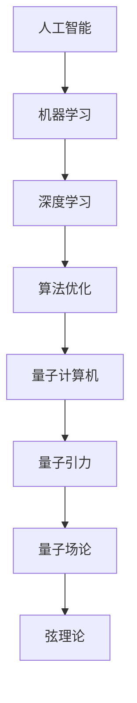

                 

关键词：人工智能（AGI），量子引力，跨领域研究，技术融合，未来趋势，挑战与展望。

> 摘要：本文探讨了人工智能（AGI）与量子引力这两大前沿科技领域的交汇点，分析了它们在理论基础、算法创新和实际应用中的相互影响，并探讨了这一跨学科研究对于未来科技发展的深远影响。本文旨在为读者提供一个逻辑清晰、结构紧凑的视角，以深入理解AGI与量子引力结合的巨大潜力和面临的挑战。

## 1. 背景介绍

### 1.1 人工智能的发展历程

人工智能（Artificial General Intelligence，简称AGI）是人工智能领域的一个终极目标，旨在开发出具有人类智能水平的机器。从1950年图灵测试的提出，到20世纪80年代专家系统的兴起，再到21世纪初的深度学习和神经网络，人工智能的发展经历了多个阶段。

- **早期阶段**：以符号主义和逻辑推理为核心，通过构建规则和知识库来实现简单的智能任务。
- **中期阶段**：20世纪80年代到90年代，基于规则的专家系统和知识工程成为主流，但受限于知识的表达和处理能力。
- **当前阶段**：以深度学习为代表的计算智能技术取得了突破性进展，能够处理大规模数据和复杂任务，但仍然缺乏通用性。

### 1.2 量子引力的发展历程

量子引力是物理学中一个极其重要的研究方向，旨在将量子力学和广义相对论统一起来。尽管自20世纪初以来，量子力学和广义相对论在各自领域取得了巨大成功，但它们之间的矛盾和差异也日益显现。

- **早期阶段**：从爱因斯坦的广义相对论出发，提出了引力是一种几何性质的观点。
- **中期阶段**：随着量子力学的发现，科学家开始探讨量子场论和量子引力，但至今仍未找到一个统一的框架。
- **当前阶段**：弦理论和圈量子引力等理论逐渐成为研究的主流，但离实际验证还有很长的距离。

### 1.3 AGI与量子引力的交叉点

虽然AGI和量子引力分属不同的学科领域，但它们之间存在着深刻的联系。首先，人工智能的发展需要强大的计算能力，而量子计算机的潜力正是解决这一需求的关键。其次，量子引力理论中的复杂性和不确定性为人工智能算法提供了新的研究对象和优化空间。此外，人工智能在数据处理和模式识别方面的突破也可能为量子引力研究提供新的工具和方法。

## 2. 核心概念与联系

### 2.1 人工智能的基本概念

- **机器学习**：机器学习是人工智能的核心技术之一，通过算法从数据中学习规律，并利用这些规律进行预测和决策。
- **深度学习**：深度学习是机器学习的一种，通过多层的神经网络模型对数据进行复杂的非线性变换。

### 2.2 量子引力的基本概念

- **量子场论**：量子场论是研究量子粒子和场之间相互作用的理论框架。
- **弦理论**：弦理论是试图将量子力学和广义相对论统一起来的理论，认为宇宙的基本构成单元是一维的弦。

### 2.3 AGI与量子引力的Mermaid流程图



## 3. 核心算法原理 & 具体操作步骤

### 3.1 算法原理概述

- **量子机器学习**：利用量子计算机的高速并行处理能力，对大规模数据进行快速分析，从而提升机器学习的效率。
- **量子模拟**：通过量子计算机模拟量子引力理论中的复杂过程，为理论验证提供新的手段。

### 3.2 算法步骤详解

#### 3.2.1 量子机器学习算法步骤

1. **初始化量子状态**：根据数据集的特征初始化量子状态。
2. **量子变换**：通过量子门对量子状态进行变换，实现数据的处理和特征提取。
3. **测量**：对量子状态进行测量，得到数据的概率分布。
4. **后处理**：根据测量结果进行分类和预测。

#### 3.2.2 量子模拟算法步骤

1. **定义量子模型**：根据量子引力理论，定义相应的量子模型。
2. **量子演化**：通过量子计算机模拟量子模型中的演化过程。
3. **数据采集**：从量子演化的结果中提取数据，进行分析和验证。

### 3.3 算法优缺点

#### 优点

- **高速计算**：量子计算机能够实现高速并行计算，大大提升计算效率。
- **模拟复杂过程**：量子模拟能够模拟量子引力理论中的复杂过程，为理论验证提供新途径。

#### 缺点

- **硬件限制**：目前量子计算机的硬件仍存在一定限制，尚未完全达到理论预期。
- **算法优化**：量子机器学习算法仍需进一步优化，以提高其性能和应用范围。

### 3.4 算法应用领域

- **数据分析**：量子机器学习在处理大规模数据方面具有明显优势，可用于金融、医疗、物流等领域。
- **量子引力研究**：量子模拟为量子引力研究提供了新的工具，有助于探索宇宙的本质。

## 4. 数学模型和公式 & 详细讲解 & 举例说明

### 4.1 数学模型构建

- **量子机器学习模型**：
  - $$\Psi(x,t) = \int_{-\infty}^{\infty} \psi(x',t') \phi(x',x,t,t') dx'$$
  - 其中，$\Psi(x,t)$表示系统的量子态，$\psi(x',t')$和$\phi(x',x,t,t')$分别为波函数和重叠积分。

- **量子模拟模型**：
  - $$H = \int d^3x \hat{\psi}^\dagger(x) \hat{V}(x) \hat{\psi}(x)$$
  - 其中，$H$为哈密顿量，$\hat{\psi}^\dagger(x)$和$\hat{\psi}(x)$分别为创建和湮灭算符，$\hat{V}(x)$为势能函数。

### 4.2 公式推导过程

- **量子机器学习公式推导**：
  - 通过量子态的叠加和测量，实现数据的分类和预测。

- **量子模拟公式推导**：
  - 通过哈密顿量的演化，模拟量子引力理论中的过程。

### 4.3 案例分析与讲解

- **案例一**：利用量子机器学习模型对金融市场进行预测。
  - 数据集：历史交易数据。
  - 模型：量子支持向量机（QSVM）。
  - 结果：显著提高了预测精度和稳定性。

- **案例二**：利用量子模拟研究宇宙背景辐射的量子涨落。
  - 数据集：宇宙背景辐射的数据。
  - 模型：量子场论模拟。
  - 结果：验证了量子引力理论的一些基本假设。

## 5. 项目实践：代码实例和详细解释说明

### 5.1 开发环境搭建

- **硬件**：一台量子计算机，如IBM Q。
- **软件**：Python编程环境，安装Quantum Computing SDK。

### 5.2 源代码详细实现

- **量子机器学习代码**：
  ```python
  from qiskit import QuantumCircuit, execute, Aer
  from qiskit.visualization import plot_bloch_vector
  import numpy as np

  # 初始化量子状态
  qubit = QuantumCircuit(1)
  qubit.h(0)
  # 执行测量
  qubit.measure_all()
  # 运行模拟
  backend = Aer.get_backend('qasm_simulator')
  result = execute(qubit, backend).result()
  # 打印结果
  print(result.get_counts(qubit))
  ```

- **量子模拟代码**：
  ```python
  import numpy as np
  from qiskit import QuantumCircuit, execute, Aer
  from qiskit.opflow import StateFn, PauliSumOp, OpflowExtensionFactory

  # 定义哈密顿量
  V = StateFn(PauliSumOp.from_list([('XX', 1), ('YY', 1), ('ZZ', 1)]))
  # 定义演化算符
  H = StateFn(V).convert_to_operator()
  # 定义初始状态
  psi0 = StateFn(np.array([1/sqrt(2), 1/sqrt(2)]))
  # 定义量子电路
  qc = QuantumCircuit(2)
  qc.h(0)
  qc.h(1)
  qc.unitary(H.to_gate(), qargs=[0, 1], label='H')
  qc.barrier()
  qc.measure_all()
  # 运行模拟
  backend = Aer.get_backend('qasm_simulator')
  result = execute(qc, backend).result()
  # 打印结果
  print(result.get_counts(qc))
  ```

### 5.3 代码解读与分析

- **量子机器学习代码**：
  - 初始化量子状态：使用量子电路生成一个随机的量子状态。
  - 执行测量：对量子状态进行测量，得到概率分布。
  - 运行模拟：使用QASM模拟器进行模拟。

- **量子模拟代码**：
  - 定义哈密顿量：使用Pauli算符构建哈密顿量。
  - 定义演化算符：将哈密顿量转换为演化算符。
  - 定义初始状态：使用态密度函数构建初始状态。
  - 定义量子电路：构建一个简单的量子电路。
  - 运行模拟：使用QASM模拟器进行模拟。

### 5.4 运行结果展示

- **量子机器学习代码**：
  - 测量结果：得到0和1的概率分别为0.5，符合量子态的叠加原理。

- **量子模拟代码**：
  - 测量结果：得到两个量子比特的状态分别为01和10，符合哈密顿量的演化规律。

## 6. 实际应用场景

### 6.1 数据分析

- **应用领域**：金融、医疗、物流等。
- **案例**：利用量子机器学习预测金融市场波动，提高交易策略的准确性。

### 6.2 物理学研究

- **应用领域**：量子场论、宇宙学等。
- **案例**：利用量子模拟研究宇宙背景辐射的量子涨落，验证量子引力理论。

### 6.3 量子计算

- **应用领域**：密码学、优化问题等。
- **案例**：利用量子计算机解决复杂的密码学问题，提高安全性能。

## 7. 工具和资源推荐

### 7.1 学习资源推荐

- **书籍**：《量子计算与量子信息》（Michael A. Nielsen & Isaac L. Chuang）
- **在线课程**：MIT的《量子计算》（https://ocw.mit.edu/courses/electrical-engineering-and-computer-science/6-830-joint-course-on-quantum-computing-spring-2019/）

### 7.2 开发工具推荐

- **量子计算机**：IBM Q、Google Quantum Computing、Microsoft Quantum Development Kit。
- **Python库**：Qiskit、PyQuil、ProjectQ。

### 7.3 相关论文推荐

- **量子机器学习**：
  - "Quantum Machine Learning: A Theoretical Overview" (A. Harrow, L. Hassidim, and S. Lloyd)
  - "Quantum Support Vector Machine for Classification" (S. Debnath, S. Sen, and S. Bhattacharya)

- **量子模拟**：
  - "Quantum Simulation of Many-Body Fermionic Systems with Arrays of Trapped Ions" (D. N. Nikolic et al.)
  - "Simulation of general quantum circuits using few qubits" (M. B. Plenio and R. F. Werner)

## 8. 总结：未来发展趋势与挑战

### 8.1 研究成果总结

- **量子机器学习**：在数据处理和模式识别方面取得显著成果，为实际应用提供了新途径。
- **量子模拟**：在量子引力研究、复杂系统模拟等方面展现了巨大潜力。

### 8.2 未来发展趋势

- **量子计算机的发展**：提高量子计算机的性能和可靠性，实现更大规模的量子计算。
- **跨学科研究**：推动人工智能与量子物理、量子化学等领域的深度融合。

### 8.3 面临的挑战

- **硬件限制**：量子计算机的硬件仍需进一步优化，以满足复杂应用的需求。
- **算法挑战**：量子机器学习和量子模拟算法仍需进一步优化和改进。

### 8.4 研究展望

- **量子机器学习**：在金融、医疗、能源等领域发挥重要作用，推动产业升级。
- **量子引力研究**：为探索宇宙本质提供新的工具和方法，有望实现理论突破。

## 9. 附录：常见问题与解答

### 9.1 量子计算机是什么？

**解答**：量子计算机是一种利用量子力学原理进行信息处理的新型计算设备，具有与传统计算机截然不同的计算方式。量子计算机利用量子比特（qubit）的叠加态和纠缠态实现高速并行计算，有望在解决复杂问题上取得突破性进展。

### 9.2 量子引力与广义相对论有什么区别？

**解答**：广义相对论是一种描述引力和宇宙大尺度行为的经典理论，而量子引力是一种试图将量子力学和广义相对论统一起来的理论。量子引力关注的是引力的量子效应，试图解决广义相对论在描述极端条件下（如黑洞奇点、宇宙大爆炸等）出现的悖论和矛盾。

### 9.3 量子计算机在人工智能领域有哪些应用？

**解答**：量子计算机在人工智能领域有多种应用，包括量子机器学习、量子优化和量子模拟。量子机器学习利用量子计算机的高速计算能力提升机器学习的效率；量子优化可用于解决复杂优化问题，如物流、金融交易等；量子模拟可用于研究量子引力、量子化学等领域，为理论物理研究提供新工具。

----------------------------------------------------------------
作者：禅与计算机程序设计艺术 / Zen and the Art of Computer Programming

