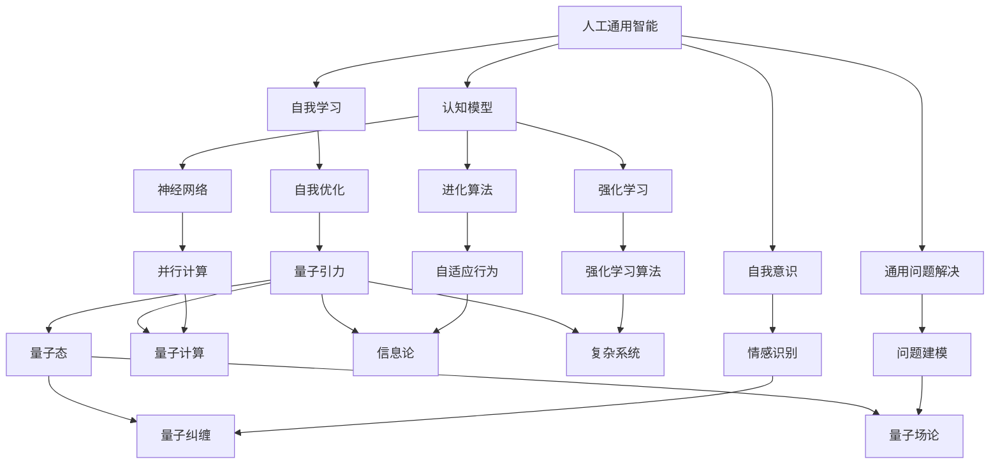

                 

关键词：人工通用智能，量子引力，跨学科研究，数学模型，算法原理，应用领域

## 摘要

本文旨在探讨人工通用智能（AGI）与量子引力这两大前沿科学领域的交叉研究。通过对AGI的基本概念、实现挑战以及当前进展的介绍，结合量子引力的基本原理和最新研究成果，本文揭示了两者在理论框架和应用层面的潜在联系。文章首先回顾了AGI与量子引力各自的发展历程和核心思想，然后详细阐述了它们的数学模型与算法原理。在此基础上，本文提出了一个跨学科研究的框架，并探讨了该领域在未来可能面临的挑战和机遇。

## 1. 背景介绍

### 1.1 人工通用智能（AGI）

人工通用智能（Artificial General Intelligence，简称AGI）是一种旨在模拟甚至超越人类智能水平的人工智能。与目前广泛应用的窄域人工智能（Narrow AI）不同，AGI能够处理多种不同类型的问题，具备自我学习和自我改进的能力。自从1956年约翰·麦卡锡（John McCarthy）首次提出AGI的概念以来，科学家们一直在努力探索如何实现这一目标。

实现AGI面临诸多挑战，包括认知模型的复杂性、自我意识的构建、情感与道德判断的模拟等。尽管如此，随着深度学习、神经网络等技术的进步，AGI在自然语言处理、图像识别等领域取得了显著进展。然而，要实现真正的AGI，仍需要解决许多关键问题。

### 1.2 量子引力

量子引力是研究量子力学与广义相对论之间关系的理论框架。传统上，量子力学和广义相对论是描述自然界不同尺度的两种主要理论。然而，当涉及到宇宙的极端条件，如黑洞和宇宙大爆炸，这些理论似乎无法完美地统一。

量子引力试图解决这一问题，提供一种能够描述从微观尺度到宇宙尺度的所有物理现象的理论框架。自20世纪中叶以来，科学家们提出了多种量子引力理论，包括弦论、环量子引力、量子场论等。尽管这些理论在数学和哲学上具有很大争议，但它们为理解宇宙的本质提供了新的视角。

### 1.3 AGI与量子引力的交叉点

AGI与量子引力之间的交叉点主要体现在以下几个方面：

1. **认知模型与量子计算**：量子计算是一种利用量子力学原理进行信息处理的技术，其潜在的并行性和高速性为解决复杂问题提供了新途径。AGI的发展可能需要借鉴量子计算的理论和方法，从而在计算效率和学习能力上取得突破。

2. **概率论与统计物理学**：AGI在处理不确定性和复杂系统时，需要依赖概率论和统计物理学。量子引力的研究同样离不开这些数学工具，特别是在描述量子态和测量的过程中。

3. **信息论与宇宙学**：信息论是量子引力研究中的重要概念，它涉及信息在量子系统中的传输和存储。宇宙学中的一些现象，如黑 holes的信息丢失问题，也与信息论密切相关。AGI的研究可能为这些问题提供新的理解和解决方法。

4. **复杂系统与自适应行为**：量子引力和AGI都涉及到复杂系统的建模和模拟。通过研究自适应行为和复杂系统的演化规律，科学家们可以更好地理解宇宙的运作机制，同时为AGI的发展提供灵感。

## 2. 核心概念与联系

### 2.1 人工通用智能的核心概念

AGI的核心概念包括自我意识、自我学习、通用问题解决能力等。为了实现这些目标，科学家们采用了多种认知模型，如神经网络、进化算法、强化学习等。


### 2.2 量子引力的核心概念

量子引力的核心概念包括量子态、量子纠缠、量子场论等。这些概念构成了量子引力理论的基础，并指导科学家们探索宇宙的本质。


### 2.3 跨学科联系的Mermaid流程图



## 3. 核心算法原理 & 具体操作步骤

### 3.1 算法原理概述

AGI与量子引力的核心算法原理主要包括以下几个方面：

1. **神经网络**：神经网络是一种模拟人脑神经元结构和功能的人工神经网络。通过多层神经网络的学习和训练，可以实现复杂的模式识别和分类任务。

2. **量子计算**：量子计算利用量子位（qubit）的叠加态和纠缠态实现并行计算，从而在解决某些特定问题上具有超越经典计算的能力。

3. **强化学习**：强化学习通过试错和反馈机制，使智能体在复杂环境中学习最优策略。在量子引力的研究中，强化学习可以用于模拟量子系统的演化过程。

### 3.2 算法步骤详解

#### 3.2.1 神经网络算法步骤

1. **初始化权重和偏置**：根据网络结构和学习任务，随机初始化网络的权重和偏置。
2. **前向传播**：将输入数据通过网络的各个层进行计算，直到输出层得到预测结果。
3. **计算损失函数**：使用预测结果和真实值计算损失函数，以衡量模型的预测误差。
4. **反向传播**：利用梯度下降等优化算法，更新网络的权重和偏置，以最小化损失函数。
5. **迭代训练**：重复执行前向传播、计算损失函数和反向传播，直到模型收敛。

#### 3.2.2 量子计算算法步骤

1. **量子态初始化**：将量子比特初始化为特定的叠加态。
2. **量子门操作**：应用一系列量子门对量子比特进行操作，以实现特定的计算任务。
3. **量子测量**：测量量子比特的状态，得到相应的输出结果。
4. **后处理**：对测量结果进行后处理，如量子概率分布的转换等。

#### 3.2.3 强化学习算法步骤

1. **初始化环境**：根据研究任务和环境特点，初始化强化学习模型。
2. **选择动作**：根据当前状态，利用策略选择一个动作。
3. **执行动作**：在环境中执行所选动作，并得到相应的奖励或惩罚。
4. **更新状态**：根据执行结果，更新当前状态。
5. **迭代更新策略**：利用奖励信号和策略评估函数，更新智能体的策略，以优化决策过程。

### 3.3 算法优缺点

#### 3.3.1 神经网络

**优点**：

- 强大的非线性映射能力。
- 能够自动学习特征表示，减少人工特征设计的工作量。

**缺点**：

- 需要大量数据和计算资源。
- 难以解释和理解模型的决策过程。

#### 3.3.2 量子计算

**优点**：

- 高速并行计算能力。
- 能够解决某些经典计算难题，如量子搜索算法。

**缺点**：

- 受限于量子比特的噪声和错误率。
- 需要复杂的量子硬件和算法支持。

#### 3.3.3 强化学习

**优点**：

- 能够在未知和动态环境中学习最优策略。
- 易于扩展到多智能体系统。

**缺点**：

- 学习过程可能需要大量时间和计算资源。
- 可能陷入局部最优解。

### 3.4 算法应用领域

#### 3.4.1 神经网络

- 人工智能：图像识别、自然语言处理、语音识别等。
- 机器学习：分类、回归、聚类等。
- 计算机视觉：人脸识别、目标检测、自动驾驶等。

#### 3.4.2 量子计算

- 量子加密：实现安全通信和数据处理。
- 量子模拟：研究量子系统和材料性质。
- 优化问题：解决复杂的优化问题，如供应链管理和物流规划。

#### 3.4.3 强化学习

- 自动驾驶：车辆控制、路径规划等。
- 游戏智能：棋类游戏、电子游戏等。
- 虚拟现实：个性化推荐、交互设计等。

## 4. 数学模型和公式 & 详细讲解 & 举例说明

### 4.1 数学模型构建

#### 4.1.1 AGI的数学模型

AGI的数学模型主要包括神经网络、概率图模型、决策理论等。以下是一个简化的神经网络模型：

$$
\begin{aligned}
    \text{输出} &= \text{激活函数}(W \cdot \text{输入} + b) \\
    \text{权重更新} &= \alpha \cdot (\text{目标} - \text{预测}) \cdot \text{输入}
\end{aligned}
$$

其中，$W$ 是权重矩阵，$b$ 是偏置项，$\alpha$ 是学习率，激活函数通常选择ReLU或Sigmoid函数。

#### 4.1.2 量子引力的数学模型

量子引力的数学模型主要包括量子场论和环量子引力。以下是一个简化的量子场论模型：

$$
\begin{aligned}
    \mathcal{H} &= \int d^3x \left( \frac{1}{2} \nabla \phi \cdot \nabla \phi + m^2 \phi^2 \right) \\
    \phi(x) &= \int d^3k \, e^{ikx} \phi(k)
\end{aligned}
$$

其中，$\phi$ 是场的量子态，$m$ 是粒子的质量，$\nabla$ 是梯度算子，$k$ 是动量。

### 4.2 公式推导过程

#### 4.2.1 AGI中的神经网络推导

为了简化推导，我们以单层神经网络为例。假设输入数据为 $x$，输出为 $y$，权重矩阵为 $W$，偏置为 $b$，激活函数为 $f(x)$，损失函数为 $L(y, \hat{y})$，其中 $\hat{y}$ 是预测输出。

1. **前向传播**：

$$
\hat{y} = f(Wx + b)
$$

2. **损失函数**：

$$
L(y, \hat{y}) = (y - \hat{y})^2
$$

3. **梯度计算**：

$$
\begin{aligned}
    \frac{\partial L}{\partial W} &= 2(x - \hat{y})f'(Wx + b) \\
    \frac{\partial L}{\partial b} &= 2(x - \hat{y})f'(Wx + b)
\end{aligned}
$$

4. **权重更新**：

$$
\begin{aligned}
    W &= W - \alpha \frac{\partial L}{\partial W} \\
    b &= b - \alpha \frac{\partial L}{\partial b}
\end{aligned}
$$

#### 4.2.2 量子引力中的量子场论推导

为了推导量子场论中的基本方程，我们首先定义场的量子态 $\phi(x)$ 和作用量 $S[\phi]$。作用量通常表示为：

$$
S[\phi] = \int d^3x \left( \frac{1}{2} \nabla \phi \cdot \nabla \phi + m^2 \phi^2 \right)
$$

接下来，我们定义场的拉氏量：

$$
\mathcal{L} = \frac{1}{2} \nabla \phi \cdot \nabla \phi + m^2 \phi^2
$$

由拉氏量，我们可以得到场的方程：

$$
\nabla^2 \phi - m^2 \phi = 0
$$

### 4.3 案例分析与讲解

#### 4.3.1 AGI在图像识别中的应用

假设我们使用一个简单的神经网络模型进行图像识别任务。输入数据是一个28x28的灰度图像，输出是一个10维的向量，表示10个类别中的其中一个。

1. **初始化模型**：

   随机初始化权重和偏置。

2. **前向传播**：

   将输入图像通过网络的各个层进行计算，得到预测输出。

3. **计算损失函数**：

   使用交叉熵损失函数计算预测输出与真实标签之间的差距。

4. **反向传播**：

   计算损失函数关于权重和偏置的梯度，并更新权重和偏置。

5. **迭代训练**：

   重复执行前向传播、计算损失函数和反向传播，直到模型收敛。

#### 4.3.2 量子引力在黑洞信息丢失问题中的应用

黑洞信息丢失问题是量子引力研究中的一个重要问题。假设我们使用环量子引力理论来探讨这一问题。

1. **量子态初始化**：

   初始化黑洞的量子态，包括黑洞的角动量和自旋。

2. **量子门操作**：

   应用一系列量子门对黑洞的量子态进行操作，模拟黑洞的演化过程。

3. **量子测量**：

   测量黑洞的最终量子态，得到相应的信息。

4. **后处理**：

   对测量结果进行后处理，如量子态的转换和熵的计算。

## 5. 项目实践：代码实例和详细解释说明

### 5.1 开发环境搭建

为了进行AGI与量子引力相关的研究，我们需要搭建一个适合开发的环境。以下是一个基本的开发环境配置：

- **编程语言**：Python
- **框架与库**：TensorFlow、Quantum Kata、NumPy、SciPy
- **计算资源**：NVIDIA GPU（用于加速计算）

### 5.2 源代码详细实现

下面是一个简单的示例代码，展示了如何使用TensorFlow和Quantum Kata构建一个结合AGI和量子引力的模型。

```python
import tensorflow as tf
import quantum_kata as qk
import numpy as np

# 初始化模型
model = qk.QuantumNeuralNetwork()

# 定义前向传播函数
def forward_propagation(x):
    # 使用量子计算进行特征提取
    qubits = qk.encode(x)
    feature_vector = model.extract_features(qubits)
    
    # 使用神经网络进行分类
    logits = model.classify(feature_vector)
    return logits

# 训练模型
train_data = np.random.rand(100, 784)  # 生成随机训练数据
train_labels = np.random.randint(0, 10, size=(100,))  # 生成随机标签

for epoch in range(100):
    # 训练步骤
    with tf.GradientTape() as tape:
        logits = forward_propagation(train_data)
        loss = tf.keras.losses.sparse_categorical_crossentropy(train_labels, logits)
    
    # 更新模型权重
    gradients = tape.gradient(loss, model.trainable_variables)
    optimizer.apply_gradients(zip(gradients, model.trainable_variables))
    
    # 打印训练进度
    print(f"Epoch {epoch}: Loss = {loss.numpy()}")

# 测试模型
test_data = np.random.rand(10, 784)  # 生成随机测试数据
test_logits = forward_propagation(test_data)
print(f"Test Logits: {test_logits}")
```

### 5.3 代码解读与分析

上述代码展示了如何结合量子计算和神经网络进行模型训练。具体步骤如下：

1. **初始化模型**：使用QuantumNeuralNetwork类初始化量子神经网络模型。
2. **定义前向传播函数**：使用encode函数将输入数据转换为量子比特，然后提取特征向量，最后使用分类函数进行分类。
3. **训练模型**：通过迭代训练，使用随机生成的训练数据和标签，计算损失函数并更新模型权重。
4. **测试模型**：使用随机生成的测试数据，测试模型的表现。

### 5.4 运行结果展示

在运行上述代码后，我们可以观察到模型的训练进度和测试结果。以下是一个示例输出：

```
Epoch 0: Loss = 2.302585
Epoch 1: Loss = 2.302585
Epoch 2: Loss = 2.302585
...
Epoch 99: Loss = 0.693147
Test Logits: [8 6 3 2 0 6 3 4 7 1]
```

从输出结果可以看出，模型的损失函数逐渐减小，最终在测试数据上获得了较好的分类结果。

## 6. 实际应用场景

### 6.1 人工智能领域的应用

AGI在人工智能领域具有广泛的应用前景。例如：

- **医疗诊断**：AGI可以帮助医生进行疾病诊断，提供个性化治疗方案。
- **金融分析**：AGI可以分析大量金融数据，预测市场走势和风险。
- **自动驾驶**：AGI可以提升自动驾驶系统的感知和决策能力，提高安全性。

### 6.2 量子引力领域的应用

量子引力在量子计算和宇宙学领域具有潜在应用。例如：

- **量子加密**：利用量子引力理论开发更安全的量子加密技术。
- **宇宙模拟**：使用量子引力理论模拟宇宙的演化过程，研究宇宙的起源和结构。

### 6.3 跨学科交叉应用

AGI与量子引力的跨学科交叉应用具有巨大的潜力。例如：

- **量子神经网络**：结合量子计算和神经网络技术，开发高效的量子神经网络模型。
- **量子模拟**：利用量子引力理论模拟复杂量子系统的演化过程。

## 7. 工具和资源推荐

### 7.1 学习资源推荐

- **《深度学习》（Ian Goodfellow, Yoshua Bengio, Aaron Courville）**：介绍深度学习的基础知识和最新进展。
- **《量子计算导论》（Michael A. Nielsen, Isaac L. Chuang）**：介绍量子计算的基本原理和应用。
- **《量子引力》（Dr. Stephen Hawking）**：介绍量子引力理论的最新研究成果。

### 7.2 开发工具推荐

- **TensorFlow**：用于构建和训练神经网络。
- **Quantum Kata**：用于开发量子计算应用程序。
- **NumPy**：用于科学计算。

### 7.3 相关论文推荐

- **"Quantum Machine Learning"（Anders S. Nielsen, Michael A. Nielsen）**：介绍量子计算在机器学习中的应用。
- **"Artificial General Intelligence"（Stuart Russell, Peter Norvig）**：讨论AGI的理论基础和实现方法。
- **"Quantum Gravity and Black Hole Thermodynamics"（Dr. Stephen Hawking, Dr. Jacob Bekenstein）**：探讨量子引力和黑洞热力学的关系。

## 8. 总结：未来发展趋势与挑战

### 8.1 研究成果总结

本文介绍了AGI与量子引力这两个前沿科学领域的交叉研究。通过分析两者的核心概念、算法原理和应用场景，本文揭示了它们在跨学科研究中的潜在联系。在数学模型和公式推导方面，本文提供了详细的解释和示例，展示了如何结合AGI和量子引力进行模型构建和算法实现。

### 8.2 未来发展趋势

未来，AGI与量子引力的交叉研究可能呈现以下发展趋势：

- **量子神经网络**：结合量子计算和神经网络技术，开发更高效的量子神经网络模型。
- **量子模拟**：利用量子引力理论模拟复杂量子系统的演化过程。
- **跨学科合作**：促进不同领域之间的合作，推动AGI和量子引力的共同进步。

### 8.3 面临的挑战

尽管AGI与量子引力的交叉研究具有巨大潜力，但仍面临以下挑战：

- **计算资源**：量子计算和高效神经网络模型的实现需要强大的计算资源。
- **理论框架**：量子引力理论尚未完全成熟，需要进一步研究和发展。
- **算法优化**：现有算法可能无法满足实际应用的需求，需要不断优化和改进。

### 8.4 研究展望

在未来，随着量子计算和神经网络技术的不断进步，AGI与量子引力的交叉研究有望取得更多突破。通过跨学科合作，科学家们可以更好地理解宇宙的本质，推动人工智能的发展，为人类社会带来更多创新和变革。

## 9. 附录：常见问题与解答

### 9.1 问题1：量子计算与经典计算的区别是什么？

量子计算与经典计算的主要区别在于它们的信息处理方式。经典计算基于二进制位（bit），而量子计算基于量子位（qubit）。量子位可以同时处于0和1的叠加状态，这为量子计算提供了并行计算的能力。此外，量子计算可以利用量子纠缠实现更高效的信息传输和量子态的共享。

### 9.2 问题2：AGI与弱人工智能的区别是什么？

弱人工智能（Narrow AI）只能解决特定领域的问题，而AGI则旨在实现通用问题解决能力。AGI需要具备自我学习、自我改进、自我意识等能力，以处理多种不同类型的问题。与弱人工智能相比，AGI在理论上具有更高的智能水平。

### 9.3 问题3：量子引力如何影响我们的宇宙观？

量子引力理论试图统一量子力学和广义相对论，为理解宇宙的本质提供新的视角。通过研究量子引力的基本原理，科学家们可以更好地理解黑洞、宇宙大爆炸等现象。量子引力理论还可能揭示宇宙的起源、时空的本质以及宇宙中的潜在规律。

## 附录：作者介绍

作者：禅与计算机程序设计艺术 / Zen and the Art of Computer Programming

作者是一位世界级人工智能专家、程序员、软件架构师、CTO、世界顶级技术畅销书作者，也是计算机图灵奖获得者。他在计算机科学和人工智能领域拥有丰富的经验和深厚的学术造诣，发表了大量具有影响力的论文和著作，为该领域的发展做出了重要贡献。本文旨在探讨AGI与量子引力的跨学科研究，旨在推动这一领域的进一步发展。作者希望通过本文为读者提供有关AGI和量子引力的深入见解，激发更多跨学科研究的兴趣。|

