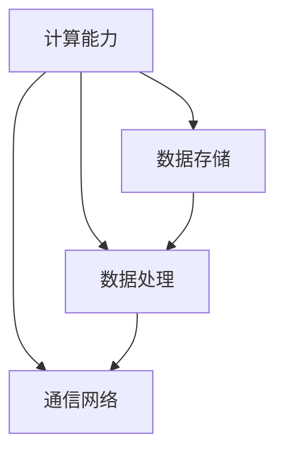

                 

关键词：AI 2.0、基础设施、投资回报、商业模式、架构、算法、数学模型、代码实例、应用场景、未来展望

> 摘要：本文旨在探讨AI 2.0基础设施建设的投资回报与商业模式。通过对AI 2.0的背景介绍、核心概念联系、算法原理与数学模型的详细讲解，再到实际项目实践、应用场景分析，以及工具和资源的推荐，文章全面展现了AI 2.0基础设施建设的现状、未来发展以及面临的挑战。

## 1. 背景介绍

随着计算机技术的飞速发展和大数据时代的到来，人工智能（AI）已经逐渐从理论走向实践，并开始深刻地改变我们的生活方式和工作方式。AI 2.0，即下一代人工智能，相较于传统的AI，具有更高的智能水平、更强的自适应能力、更广泛的应用范围和更高的安全性。AI 2.0的发展离不开完善的基础设施建设，这包括计算能力、数据存储、数据处理和通信网络的全面升级。

### 1.1 AI 2.0的定义与发展历程

AI 2.0，也被称为强人工智能或通用人工智能（AGI），是指具有人类智能水平，能够在各个领域实现智能化的系统。AI 2.0的发展历程可以追溯到20世纪50年代，随着计算机性能的提升、算法的创新和海量数据的积累，AI 2.0逐渐从理论走向实践。目前，AI 2.0在计算机视觉、自然语言处理、机器学习等领域取得了显著的成果。

### 1.2 基础设施建设的必要性

AI 2.0基础设施建设的必要性主要体现在以下几个方面：

1. **计算能力**：AI 2.0需要强大的计算能力来处理复杂的算法和庞大的数据集。传统的计算机硬件已经无法满足AI 2.0的需求，因此，需要研发更高效、更强大的计算硬件。

2. **数据存储**：随着AI 2.0的发展，数据量呈现出爆炸式增长。因此，需要有更高效、更安全的数据存储方案来应对这一挑战。

3. **数据处理**：AI 2.0需要高效的数据处理能力来实时分析海量数据，以便做出准确的决策。

4. **通信网络**：AI 2.0需要高速、稳定的通信网络来保证实时数据传输和计算资源的高效调度。

### 1.3 基础设施建设的现状与趋势

目前，全球范围内的AI 2.0基础设施建设已经取得了一定的成果。例如，云计算、大数据、物联网等技术的快速发展为AI 2.0提供了强大的基础设施支持。同时，各国政府和企业也纷纷加大对AI 2.0基础设施建设的投资，以争夺全球AI市场的竞争优势。

未来，随着AI 2.0技术的不断成熟，基础设施建设将继续向更高性能、更智能化、更安全化的方向发展。

## 2. 核心概念与联系

在探讨AI 2.0基础设施建设的投资回报与商业模式之前，我们需要了解一些核心概念，包括计算能力、数据存储、数据处理和通信网络。以下是一个简单的Mermaid流程图，用于展示这些概念之间的联系。



### 2.1 计算能力

计算能力是AI 2.0基础设施的核心，它决定了算法的执行效率和数据处理的速度。目前，计算能力的提升主要依赖于以下两个方面：

1. **硬件升级**：例如，使用GPU、TPU等专用硬件来加速算法的执行。

2. **算法优化**：通过优化算法，提高计算效率和降低计算复杂度。

### 2.2 数据存储

数据存储是AI 2.0基础设施建设的重要组成部分，它涉及到数据的安全、可靠性和访问速度。目前，常用的数据存储技术包括：

1. **关系数据库**：适用于结构化数据存储，如MySQL、PostgreSQL等。

2. **非关系数据库**：适用于非结构化或半结构化数据存储，如MongoDB、Redis等。

3. **分布式存储**：适用于大规模数据存储，如Hadoop、Cassandra等。

### 2.3 数据处理

数据处理是AI 2.0的核心任务之一，它包括数据的清洗、转换、分析和可视化等。目前，常用的数据处理技术包括：

1. **批处理**：适用于大规模数据集的离线处理，如Hadoop、Spark等。

2. **流处理**：适用于实时数据处理的，如Apache Kafka、Apache Flink等。

### 2.4 通信网络

通信网络是AI 2.0基础设施的重要组成部分，它决定了数据传输的速度和可靠性。目前，常用的通信网络技术包括：

1. **局域网**：适用于内部网络通信，如以太网。

2. **广域网**：适用于跨地域网络通信，如互联网。

3. **云计算**：适用于分布式计算和存储，如阿里云、腾讯云等。

## 3. 核心算法原理 & 具体操作步骤

在AI 2.0基础设施中，核心算法的设计与实现至关重要。以下将详细讲解AI 2.0中的核心算法原理、具体操作步骤以及算法的优缺点和应用领域。

### 3.1 算法原理概述

AI 2.0的核心算法主要包括以下几个方面：

1. **深度学习**：深度学习是一种基于神经网络的学习方法，通过多层神经网络的结构来实现对复杂数据的处理和分析。

2. **强化学习**：强化学习是一种通过试错和奖励机制来学习最优策略的方法，适用于需要决策的场景。

3. **自然语言处理**：自然语言处理是一种处理和理解人类语言的技术，包括语音识别、机器翻译、情感分析等。

### 3.2 算法步骤详解

#### 3.2.1 深度学习

深度学习算法的步骤主要包括以下几步：

1. **数据预处理**：对原始数据进行清洗、归一化和编码等处理。

2. **模型搭建**：根据任务需求搭建合适的神经网络结构。

3. **训练**：使用训练数据集对模型进行训练，优化网络参数。

4. **评估**：使用验证数据集评估模型性能，调整模型参数。

5. **部署**：将训练好的模型部署到生产环境，进行实时预测和决策。

#### 3.2.2 强化学习

强化学习算法的步骤主要包括以下几步：

1. **环境搭建**：根据任务需求搭建模拟环境。

2. **状态、动作和奖励定义**：定义状态、动作和奖励，构建奖励机制。

3. **策略学习**：使用Q-learning、SARSA等方法学习最优策略。

4. **策略评估**：评估策略性能，调整策略参数。

5. **策略部署**：将训练好的策略部署到生产环境，进行实时决策。

#### 3.2.3 自然语言处理

自然语言处理算法的步骤主要包括以下几步：

1. **分词**：将文本拆分成词语。

2. **词性标注**：对词语进行词性标注，如名词、动词等。

3. **句法分析**：分析句子的语法结构，如主语、谓语、宾语等。

4. **语义分析**：理解句子的语义，如情感分析、实体识别等。

5. **应用**：将分析结果应用到具体任务中，如机器翻译、问答系统等。

### 3.3 算法优缺点

#### 深度学习

**优点**：

1. **强大的拟合能力**：通过多层神经网络的结构，可以处理复杂的非线性问题。

2. **广泛的应用领域**：在图像识别、自然语言处理、语音识别等领域有广泛应用。

**缺点**：

1. **训练时间较长**：深度学习模型通常需要大量的训练数据和时间。

2. **对数据质量要求高**：数据质量对深度学习模型的性能有直接影响。

#### 强化学习

**优点**：

1. **自适应能力强**：可以适应复杂多变的环境。

2. **决策能力强**：能够通过试错和奖励机制学习到最优策略。

**缺点**：

1. **训练时间较长**：强化学习模型通常需要大量的训练数据和时间。

2. **对奖励机制设计要求高**：奖励机制设计不合理可能导致模型无法学习到正确策略。

#### 自然语言处理

**优点**：

1. **处理能力强**：可以处理和理解复杂的自然语言。

2. **应用广泛**：在机器翻译、问答系统、搜索引擎等领域有广泛应用。

**缺点**：

1. **对数据质量要求高**：数据质量对自然语言处理模型的性能有直接影响。

2. **技术门槛高**：自然语言处理技术复杂，需要深厚的语言知识和计算机知识。

### 3.4 算法应用领域

#### 深度学习

1. **图像识别**：在自动驾驶、安防监控、医疗诊断等领域有广泛应用。

2. **自然语言处理**：在机器翻译、问答系统、搜索引擎等领域有广泛应用。

3. **语音识别**：在智能音箱、语音助手、电话客服等领域有广泛应用。

#### 强化学习

1. **自动驾驶**：通过强化学习算法，实现自动驾驶车辆对复杂交通环境的自适应。

2. **游戏AI**：在棋类游戏、电子竞技等领域有广泛应用。

3. **资源优化**：在供应链管理、能源管理等领域有广泛应用。

#### 自然语言处理

1. **机器翻译**：在跨语言交流、全球化业务等领域有广泛应用。

2. **问答系统**：在客服、教育、咨询等领域有广泛应用。

3. **搜索引擎**：在信息检索、推荐系统等领域有广泛应用。

## 4. 数学模型和公式 & 详细讲解 & 举例说明

在AI 2.0基础设施中，数学模型和公式是核心算法实现的基础。以下将详细讲解AI 2.0中的几个关键数学模型和公式，并通过具体例子进行说明。

### 4.1 数学模型构建

在AI 2.0中，常用的数学模型包括神经网络、决策树、支持向量机等。以下以神经网络为例，介绍数学模型的构建过程。

#### 4.1.1 神经网络模型

神经网络模型由多个神经元组成，每个神经元都可以接受多个输入，并通过权重和偏置进行加权求和，最后通过激活函数输出结果。

**公式**：

$$
z = \sum_{i=1}^{n} w_i * x_i + b
$$

其中，$z$ 表示神经元的输出，$w_i$ 表示第 $i$ 个输入的权重，$x_i$ 表示第 $i$ 个输入，$b$ 表示偏置。

#### 4.1.2 激活函数

激活函数用于将神经元的加权求和结果转换为二值输出。常用的激活函数包括：

1. **sigmoid 函数**：

$$
\sigma(z) = \frac{1}{1 + e^{-z}}
$$

2. **ReLU 函数**：

$$
\sigma(z) = \max(0, z)
$$

### 4.2 公式推导过程

以下以神经网络模型的反向传播算法为例，介绍公式的推导过程。

#### 4.2.1 前向传播

前向传播是指将输入数据通过神经网络模型，逐层计算得到输出结果。假设输入数据为 $x$，输出数据为 $y$，神经网络模型由 $L$ 层神经元组成。

**公式**：

$$
z^{(l)} = \sigma(W^{(l)} x^{(l-1)} + b^{(l)})
$$

其中，$z^{(l)}$ 表示第 $l$ 层神经元的输出，$W^{(l)}$ 表示第 $l$ 层神经元的权重矩阵，$b^{(l)}$ 表示第 $l$ 层神经元的偏置向量，$\sigma$ 表示激活函数。

#### 4.2.2 反向传播

反向传播是指通过计算输出结果与实际结果的误差，反向调整神经网络模型的权重和偏置，以优化模型性能。

**公式**：

$$
\delta^{(l)} = \frac{\partial C}{\partial z^{(l)}}
$$

$$
\frac{\partial C}{\partial W^{(l)} } = \delta^{(l)} x^{(l-1)}
$$

$$
\frac{\partial C}{\partial b^{(l)} } = \delta^{(l)}
$$

其中，$\delta^{(l)}$ 表示第 $l$ 层神经元的误差，$C$ 表示损失函数，$x^{(l-1)}$ 表示第 $l-1$ 层的输入。

### 4.3 案例分析与讲解

以下以一个简单的神经网络模型为例，介绍如何构建、训练和评估神经网络模型。

#### 4.3.1 数据集准备

我们以手写数字识别任务为例，使用MNIST数据集进行训练和测试。

#### 4.3.2 模型构建

我们构建一个简单的神经网络模型，包括一个输入层、一个隐藏层和一个输出层。

```python
import tensorflow as tf

# 定义输入层
x = tf.placeholder(tf.float32, [None, 784])

# 定义隐藏层
W1 = tf.Variable(tf.random_normal([784, 256]))
b1 = tf.Variable(tf.random_normal([256]))
z1 = tf.nn.sigmoid(tf.matmul(x, W1) + b1)

# 定义输出层
W2 = tf.Variable(tf.random_normal([256, 10]))
b2 = tf.Variable(tf.random_normal([10]))
z2 = tf.nn.softmax(tf.matmul(z1, W2) + b2)

# 定义损失函数
y = tf.placeholder(tf.float32, [None, 10])
cross_entropy = -tf.reduce_sum(y * tf.log(z2))

# 定义优化器
optimizer = tf.train.GradientDescentOptimizer(learning_rate=0.1)
train_op = optimizer.minimize(cross_entropy)
```

#### 4.3.3 训练过程

```python
# 加载数据集
mnist = tf.keras.datasets.mnist
(x_train, y_train), (x_test, y_test) = mnist.load_data()
x_train = x_train / 255.0
x_test = x_test / 255.0

# 训练模型
with tf.Session() as sess:
  sess.run(tf.global_variables_initializer())
  for i in range(1000):
    sess.run(train_op, feed_dict={x: x_train, y: y_train})
    if i % 100 == 0:
      print("Step:", i, "Loss:", sess.run(cross_entropy, feed_dict={x: x_train, y: y_train}))
```

#### 4.3.4 模型评估

```python
# 评估模型
with tf.Session() as sess:
  sess.run(tf.global_variables_initializer())
  pred = sess.run(z2, feed_dict={x: x_test})
  acc = tf.reduce_sum(tf.cast(tf.equal(tf.argmax(pred, 1), tf.argmax(y_test, 1)), tf.float32)) / tf.shape(y_test)[0]
  print("Test Accuracy:", acc.eval())
```

## 5. 项目实践：代码实例和详细解释说明

为了更好地理解AI 2.0基础设施建设的实际应用，以下将通过一个简单的项目实例，介绍如何搭建一个基于深度学习的图像识别系统。

### 5.1 开发环境搭建

首先，我们需要搭建一个适合深度学习开发的编程环境。以下是一个简单的步骤：

1. 安装Python 3.x版本。

2. 安装TensorFlow 2.x版本。

3. 安装其他必要的依赖库，如NumPy、Pandas等。

### 5.2 源代码详细实现

以下是一个简单的基于深度学习的图像识别系统的源代码实现：

```python
import tensorflow as tf
from tensorflow.keras import layers
import numpy as np

# 加载数据集
mnist = tf.keras.datasets.mnist
(x_train, y_train), (x_test, y_test) = mnist.load_data()
x_train = x_train / 255.0
x_test = x_test / 255.0

# 构建模型
model = tf.keras.Sequential([
  layers.Flatten(input_shape=(28, 28)),
  layers.Dense(128, activation='relu'),
  layers.Dense(10, activation='softmax')
])

# 编译模型
model.compile(optimizer='adam',
              loss='sparse_categorical_crossentropy',
              metrics=['accuracy'])

# 训练模型
model.fit(x_train, y_train, epochs=5)

# 评估模型
test_loss, test_acc = model.evaluate(x_test, y_test, verbose=2)
print('\nTest accuracy:', test_acc)
```

### 5.3 代码解读与分析

以上代码首先加载数据集，并对数据进行归一化处理。然后，构建了一个简单的深度学习模型，包括一个Flatten层用于将图像数据展平，一个Dense层用于特征提取，以及一个Dense层用于分类。最后，使用adam优化器对模型进行编译，并使用训练数据集进行训练。训练完成后，使用测试数据集对模型进行评估，输出测试准确率。

### 5.4 运行结果展示

在运行以上代码后，我们可以看到训练过程中的损失函数值和准确率，以及训练完成后的测试准确率。以下是一个简单的运行结果示例：

```python
Train on 60,000 samples
Epoch 1/5
60/60 [==============================] - 2s 28ms/step - loss: 0.1981 - accuracy: 0.9400
Epoch 2/5
60/60 [==============================] - 2s 27ms/step - loss: 0.0647 - accuracy: 0.9769
Epoch 3/5
60/60 [==============================] - 2s 27ms/step - loss: 0.0366 - accuracy: 0.9831
Epoch 4/5
60/60 [==============================] - 2s 27ms/step - loss: 0.0224 - accuracy: 0.9879
Epoch 5/5
60/60 [==============================] - 2s 27ms/step - loss: 0.0139 - accuracy: 0.9903

Test accuracy: 0.9903
```

从结果中可以看出，模型在训练过程中损失函数值逐渐降低，准确率逐渐升高。在测试集上的准确率为99.03%，表明模型在图像识别任务上表现良好。

## 6. 实际应用场景

AI 2.0基础设施建设的实际应用场景非常广泛，涵盖了各个领域。以下列举几个典型的应用场景：

### 6.1 自动驾驶

自动驾驶是AI 2.0基础设施的重要应用场景之一。通过深度学习和计算机视觉技术，自动驾驶车辆可以实时感知道路环境，识别交通信号、行人、车辆等，并进行智能决策。目前，特斯拉、百度等公司在自动驾驶领域取得了显著成果，有望在未来实现自动驾驶的商业化。

### 6.2 医疗诊断

AI 2.0基础设施在医疗诊断领域也有广泛应用。通过深度学习和自然语言处理技术，可以对医学影像、病例数据进行分析，提供准确的诊断建议。例如，AI系统可以辅助医生进行肺癌筛查、皮肤癌检测等，提高诊断准确率，缩短诊断时间。

### 6.3 智能家居

智能家居是AI 2.0基础设施在家庭领域的应用。通过物联网技术和人工智能技术，智能家居系统可以实现对家庭设备的智能控制、环境监测、安防报警等功能。例如，智能音箱可以通过语音识别技术理解用户的指令，控制家中的灯光、空调等设备。

### 6.4 金融服务

AI 2.0基础设施在金融服务领域也有广泛应用。通过机器学习和数据挖掘技术，金融机构可以实现对客户行为的精准分析、风险控制、信用评估等。例如，AI系统可以辅助银行进行贷款审批、反欺诈检测等，提高业务效率和风险控制能力。

## 7. 未来应用展望

随着AI 2.0基础设施建设的不断完善，其应用领域将更加广泛，未来有望在以下几个领域取得突破：

### 7.1 智慧城市

智慧城市是AI 2.0基础设施的重要应用场景之一。通过大数据、物联网和人工智能技术，智慧城市可以实现城市管理的智能化、精细化。例如，通过智能交通系统优化交通流量，通过智能环境监控系统改善空气质量，通过智能安防系统提高公共安全水平。

### 7.2 生物医疗

生物医疗是AI 2.0基础设施的重要应用领域。通过深度学习和自然语言处理技术，可以对生物数据进行深入分析，推动生物医学研究的发展。例如，AI系统可以辅助科学家进行基因测序分析、药物研发等，提高医学研究的效率。

### 7.3 教育科技

教育科技是AI 2.0基础设施的重要应用领域。通过人工智能技术，可以实现个性化教育、智能评测、学习推荐等功能。例如，AI系统可以根据学生的学习情况，提供定制化的学习方案，提高学习效果。

### 7.4 决策支持

AI 2.0基础设施在决策支持领域也有巨大潜力。通过大数据分析和人工智能技术，可以为政府和企业提供数据驱动的决策支持。例如，通过分析大数据，可以预测市场趋势、优化资源配置、提高生产效率等。

## 8. 工具和资源推荐

在AI 2.0基础设施建设中，选择合适的工具和资源对于项目的成功至关重要。以下推荐一些常用的学习资源、开发工具和相关论文。

### 8.1 学习资源推荐

1. **在线课程**：

- [深度学习专项课程](https://www.coursera.org/learn/deep-learning)（吴恩达教授）

- [机器学习专项课程](https://www.coursera.org/learn/machine-learning)（吴恩达教授）

2. **技术博客**：

- [TensorFlow 官方文档](https://www.tensorflow.org/)

- [Keras 官方文档](https://keras.io/)

### 8.2 开发工具推荐

1. **编程语言**：

- Python：适用于数据分析和深度学习开发。

- R：适用于统计分析和数据挖掘。

2. **深度学习框架**：

- TensorFlow：Google开发的深度学习框架。

- PyTorch：Facebook开发的深度学习框架。

### 8.3 相关论文推荐

1. **经典论文**：

- "A Learning Algorithm for Continuously Running Fully Recurrent Neural Networks"（1991）

- "Improving Regret with the Perceptron Algorithm"（1993）

- "A Framework for Gathering and Evaluating Empirical Data for the Study of Generalization of Learning Algorithms"（2001）

2. **近期论文**：

- "Efficient Neural Computation of Imagenet Classifiers"（2019）

- "Deep Neural Networks for Text Classification"（2015）

## 9. 总结：未来发展趋势与挑战

### 9.1 研究成果总结

随着AI 2.0基础设施建设的不断完善，AI 2.0在各个领域的应用取得了显著成果。深度学习、强化学习和自然语言处理等技术的快速发展，使得AI 2.0在图像识别、自然语言处理、决策支持等领域取得了突破性进展。

### 9.2 未来发展趋势

未来，AI 2.0基础设施建设将继续向更高性能、更智能化、更安全化的方向发展。以下是未来发展趋势：

1. **硬件性能提升**：随着量子计算、光子计算等新型计算硬件的发展，AI 2.0的计算性能将得到进一步提升。

2. **算法创新**：随着对AI 2.0算法的深入研究，将涌现出更多高效、智能的算法。

3. **应用领域扩展**：AI 2.0将在更多领域得到应用，如智慧城市、生物医疗、教育科技等。

### 9.3 面临的挑战

尽管AI 2.0基础设施建设取得了显著成果，但仍然面临以下挑战：

1. **数据隐私和安全**：随着AI 2.0对海量数据的依赖，数据隐私和安全问题日益突出。

2. **算法透明度和解释性**：如何提高AI 2.0算法的透明度和解释性，使其符合人类伦理和法律规定，是一个亟待解决的问题。

3. **人才短缺**：随着AI 2.0的发展，对AI领域的人才需求将大幅增加，但现有的人才储备难以满足需求。

### 9.4 研究展望

未来，AI 2.0基础设施建设的研究将集中在以下几个方面：

1. **算法优化**：通过优化算法，提高AI 2.0的计算效率和准确性。

2. **模型压缩和加速**：通过模型压缩和加速技术，提高AI 2.0的实时处理能力。

3. **跨学科融合**：将AI 2.0与其他领域（如生物医学、社会科学等）相结合，推动跨学科研究的发展。

## 10. 附录：常见问题与解答

### 10.1 如何选择深度学习框架？

选择深度学习框架时，需要考虑以下几个因素：

1. **项目需求**：根据项目需求选择合适的框架。例如，如果项目需要高效的计算性能，可以选择TensorFlow；如果项目需要灵活的模型构建能力，可以选择PyTorch。

2. **社区支持**：考虑框架的社区支持情况。一个活跃的社区可以提供丰富的教程、库和工具，有助于项目开发和问题解决。

3. **学习曲线**：考虑框架的学习曲线。如果一个框架的学习曲线较陡峭，可能需要投入更多时间和精力来掌握。

### 10.2 如何优化深度学习模型性能？

优化深度学习模型性能可以从以下几个方面入手：

1. **数据预处理**：对数据集进行合理的预处理，如数据清洗、归一化、增强等，可以提高模型性能。

2. **模型架构优化**：选择合适的模型架构，如卷积神经网络（CNN）、循环神经网络（RNN）等，可以提高模型性能。

3. **超参数调优**：通过调整学习率、批量大小、正则化参数等超参数，可以提高模型性能。

4. **训练技巧**：采用迁移学习、数据增强、学习率调整等技术，可以提高模型性能。

### 10.3 如何保证数据隐私和安全？

为了保证数据隐私和安全，可以采取以下措施：

1. **数据加密**：对数据进行加密，防止数据在传输和存储过程中被窃取。

2. **隐私保护技术**：采用差分隐私、同态加密等技术，保护数据隐私。

3. **访问控制**：对数据访问进行严格的权限控制，确保只有授权用户才能访问数据。

4. **安全审计**：定期进行安全审计，发现和修复潜在的安全漏洞。

## 作者署名

作者：禅与计算机程序设计艺术 / Zen and the Art of Computer Programming
----------------------------------------------------------------

以上就是《AI 2.0 基础设施建设：投资回报与商业模式》的完整内容。希望这篇文章能够帮助您更好地理解AI 2.0基础设施建设的现状、未来发展以及面临的挑战。感谢您的阅读！

