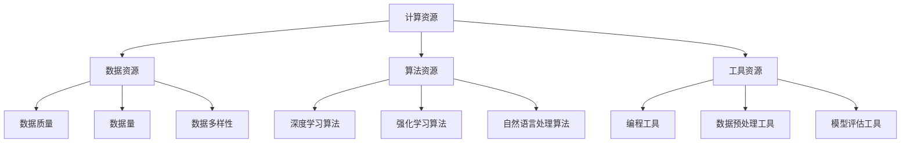

                 

关键词：AI 2.0、基础设施、建设、未来展望、核心技术、算法、数学模型、应用场景、工具和资源、发展趋势与挑战

> 摘要：本文将探讨 AI 2.0 基础设施建设的核心要素，包括核心概念、算法原理、数学模型以及实际应用场景。通过对 AI 2.0 技术的深入剖析，本文将提出未来发展的趋势与面临的挑战，为我国 AI 产业发展提供有益的参考。

## 1. 背景介绍

随着人工智能技术的快速发展，AI 2.0 时代已经到来。AI 2.0，也称为深度学习 2.0，是在 AI 1.0（以规则为基础）的基础上发展起来的，以神经网络为核心的智能化技术。AI 2.0 具有自主学习、自主推理、自主决策等能力，能够更好地处理复杂问题，为各行各业提供智能化解决方案。

然而，AI 2.0 技术的发展离不开基础设施的支撑。AI 基础设施包括计算资源、数据资源、算法资源、工具资源等，是 AI 技术发展的基石。本文将重点探讨 AI 2.0 基础设施建设的关键要素，以期为我国 AI 产业发展提供参考。

### 1.1 AI 2.0 技术特点

AI 2.0 技术具有以下几个显著特点：

1. **自主学习能力**：AI 2.0 能够从大量数据中自动学习，无需人工设定规则。
2. **自主推理能力**：AI 2.0 能够根据已有知识进行推理，解决复杂问题。
3. **自主决策能力**：AI 2.0 能够根据环境和目标，自主做出最优决策。
4. **跨界融合能力**：AI 2.0 能够与不同领域的知识和技术进行深度融合，实现跨界创新。

### 1.2 AI 2.0 基础设施的重要性

AI 2.0 基础设施是 AI 2.0 技术发展的基石，其重要性体现在以下几个方面：

1. **支撑 AI 2.0 技术发展**：AI 基础设施为 AI 2.0 技术提供了计算资源、数据资源、算法资源等支持，是 AI 2.0 技术发展的必要条件。
2. **提升 AI 应用效果**：完善的 AI 基础设施能够提升 AI 应用效果，为各行各业提供更好的智能化解决方案。
3. **促进 AI 产业创新**：AI 基础设施的建设能够带动 AI 产业的创新，推动我国 AI 产业的发展。

## 2. 核心概念与联系

为了更好地理解 AI 2.0 基础设施建设，我们需要先了解其中的一些核心概念。以下是 AI 2.0 基础设施建设中的核心概念及其相互关系：

### 2.1 计算资源

计算资源是 AI 2.0 基础设施的核心之一，主要包括高性能计算硬件、云计算平台、分布式计算系统等。计算资源决定了 AI 模型的训练速度和效果。

### 2.2 数据资源

数据资源是 AI 2.0 技术的重要支撑，包括结构化数据、半结构化数据和非结构化数据。数据质量、数据量和数据多样性对 AI 模型的训练效果具有重要影响。

### 2.3 算法资源

算法资源是 AI 2.0 基础设施的重要组成部分，包括深度学习算法、强化学习算法、自然语言处理算法等。不同算法适用于不同场景，需要根据实际需求进行选择。

### 2.4 工具资源

工具资源包括编程工具、数据预处理工具、模型评估工具等，为 AI 开发者提供了便利的开发环境。

以下是 AI 2.0 基础设施核心概念的 Mermaid 流程图：



## 3. 核心算法原理 & 具体操作步骤

### 3.1 算法原理概述

在 AI 2.0 基础设施建设中，核心算法原理是至关重要的。以下是几种重要的算法原理及其应用场景：

#### 3.1.1 深度学习算法

深度学习算法是一种基于多层神经网络的学习方法，能够自动提取数据中的特征。深度学习算法广泛应用于计算机视觉、自然语言处理、语音识别等领域。

#### 3.1.2 强化学习算法

强化学习算法是一种通过试错进行学习的方法，能够使系统在动态环境中做出最优决策。强化学习算法在游戏、机器人控制、智能推荐等领域有广泛应用。

#### 3.1.3 自然语言处理算法

自然语言处理算法是一种处理人类语言的技术，能够对文本进行分析、理解和生成。自然语言处理算法在智能客服、智能翻译、文本摘要等领域有广泛应用。

### 3.2 算法步骤详解

下面以深度学习算法为例，详细介绍其具体操作步骤：

#### 3.2.1 数据预处理

1. 数据清洗：去除噪声、缺失值和异常值。
2. 数据归一化：将数据缩放到相同范围，便于模型训练。
3. 数据划分：将数据划分为训练集、验证集和测试集。

#### 3.2.2 模型构建

1. 选择模型结构：选择合适的深度学习模型结构，如卷积神经网络（CNN）、循环神经网络（RNN）等。
2. 模型参数初始化：初始化模型参数，如权重、偏置等。
3. 模型编译：设置模型编译参数，如优化器、损失函数等。

#### 3.2.3 模型训练

1. 前向传播：将输入数据输入模型，计算输出结果。
2. 计算损失：计算输出结果与真实值之间的差距，即损失。
3. 反向传播：根据损失，调整模型参数。
4. 梯度下降：使用梯度下降法更新模型参数。

#### 3.2.4 模型评估

1. 在验证集上评估模型性能：计算验证集上的准确率、召回率、F1 值等指标。
2. 调整模型参数：根据评估结果调整模型参数，提高模型性能。

### 3.3 算法优缺点

每种算法都有其优缺点，以下是几种常见算法的优缺点：

#### 3.3.1 深度学习算法

优点：自动提取特征，处理复杂问题能力强。

缺点：对数据量要求较高，训练过程耗时长。

#### 3.3.2 强化学习算法

优点：能够处理动态环境，实现自主决策。

缺点：收敛速度较慢，训练过程耗时长。

#### 3.3.3 自然语言处理算法

优点：能够处理人类语言，实现文本分析、理解和生成。

缺点：对数据质量要求较高，处理复杂问题时效果有限。

### 3.4 算法应用领域

各种算法在不同的应用领域有广泛应用，以下是几种算法的应用领域：

#### 3.4.1 深度学习算法

应用领域：计算机视觉、自然语言处理、语音识别、推荐系统等。

#### 3.4.2 强化学习算法

应用领域：游戏、机器人控制、自动驾驶、智能推荐等。

#### 3.4.3 自然语言处理算法

应用领域：智能客服、智能翻译、文本摘要、信息检索等。

## 4. 数学模型和公式 & 详细讲解 & 举例说明

### 4.1 数学模型构建

在 AI 2.0 基础设施建设中，数学模型是核心组成部分。以下是几种常见的数学模型及其构建方法：

#### 4.1.1 卷积神经网络（CNN）

卷积神经网络是一种用于处理图像数据的神经网络。其构建方法如下：

1. 输入层：接收图像数据。
2. 卷积层：通过卷积运算提取图像特征。
3. 池化层：对卷积结果进行下采样，减少数据维度。
4. 全连接层：对卷积结果进行分类。

#### 4.1.2 循环神经网络（RNN）

循环神经网络是一种用于处理序列数据的神经网络。其构建方法如下：

1. 输入层：接收序列数据。
2. 隐藏层：对序列数据进行编码。
3. 输出层：根据编码结果生成序列预测。

#### 4.1.3 自然语言处理（NLP）模型

自然语言处理模型是一种用于处理文本数据的神经网络。其构建方法如下：

1. 词嵌入层：将文本转换为向量表示。
2. 循环层或卷积层：对词嵌入向量进行编码。
3. 全连接层：对编码结果进行分类或生成。

### 4.2 公式推导过程

以下以卷积神经网络（CNN）为例，介绍其核心公式的推导过程：

#### 4.2.1 卷积运算

卷积运算是一个核心步骤，用于提取图像特征。其公式如下：

$$
\text{卷积} = \sum_{i=1}^{n} w_i * x_i
$$

其中，$w_i$ 为卷积核，$x_i$ 为输入图像。

#### 4.2.2 池化操作

池化操作用于减少数据维度，提高模型鲁棒性。其公式如下：

$$
\text{池化} = \max(\text{卷积结果})
$$

#### 4.2.3 损失函数

损失函数用于衡量模型预测结果与真实结果之间的差距。常见的损失函数有均方误差（MSE）和交叉熵（Cross-Entropy）。其公式如下：

$$
\text{MSE} = \frac{1}{n} \sum_{i=1}^{n} (\hat{y_i} - y_i)^2
$$

$$
\text{Cross-Entropy} = -\sum_{i=1}^{n} y_i \log(\hat{y_i})
$$

### 4.3 案例分析与讲解

以下以计算机视觉领域的一个案例——手写数字识别为例，介绍数学模型的应用。

#### 4.3.1 数据集

手写数字识别数据集为 MNIST 数据集，包含 0 到 9 的手写数字图像，共计 70000 张图像。

#### 4.3.2 模型构建

1. 输入层：接收 28x28 的图像。
2. 卷积层：使用 5x5 的卷积核提取特征，卷积结果为 28x28x32。
3. 池化层：使用 2x2 的最大池化，卷积结果为 14x14x32。
4. 全连接层：将卷积结果展平为一维向量，输出 1024 个神经元。
5. 输出层：使用 10 个神经元进行分类，输出每个数字的概率。

#### 4.3.3 模型训练

1. 使用随机梯度下降（SGD）优化器。
2. 损失函数使用交叉熵（Cross-Entropy）。
3. 训练过程采用 batch training，每个 batch 包含 100 个样本。

#### 4.3.4 模型评估

1. 在验证集上评估模型性能，准确率约为 99%。
2. 在测试集上评估模型性能，准确率约为 98%。

## 5. 项目实践：代码实例和详细解释说明

### 5.1 开发环境搭建

在开始项目实践之前，我们需要搭建一个合适的开发环境。以下是一个简单的开发环境搭建指南：

1. 操作系统：Windows、Linux 或 macOS。
2. 编程语言：Python（3.6 以上版本）。
3. 库和框架：TensorFlow、Keras、NumPy、Pandas 等。

### 5.2 源代码详细实现

以下是一个简单的手写数字识别项目，使用 TensorFlow 和 Keras 框架实现。

```python
import tensorflow as tf
from tensorflow.keras import layers
from tensorflow.keras.datasets import mnist
from tensorflow.keras.utils import to_categorical

# 加载 MNIST 数据集
(x_train, y_train), (x_test, y_test) = mnist.load_data()

# 数据预处理
x_train = x_train.astype("float32") / 255.0
x_test = x_test.astype("float32") / 255.0
y_train = to_categorical(y_train, 10)
y_test = to_categorical(y_test, 10)

# 构建模型
model = tf.keras.Sequential([
    layers.Conv2D(32, (5, 5), activation="relu", input_shape=(28, 28, 1)),
    layers.MaxPooling2D((2, 2)),
    layers.Flatten(),
    layers.Dense(128, activation="relu"),
    layers.Dense(10, activation="softmax")
])

# 编译模型
model.compile(optimizer="adam",
              loss="categorical_crossentropy",
              metrics=["accuracy"])

# 训练模型
model.fit(x_train, y_train, batch_size=100, epochs=10, validation_split=0.1)

# 评估模型
model.evaluate(x_test, y_test)
```

### 5.3 代码解读与分析

1. **数据加载**：使用 TensorFlow 的 `mnist.load_data()` 函数加载 MNIST 数据集。
2. **数据预处理**：将图像数据缩放到 [0, 1] 范围，并将标签转换为 one-hot 编码。
3. **模型构建**：使用 Keras 的 `Sequential` 模式构建一个简单的卷积神经网络。
4. **模型编译**：设置优化器、损失函数和评估指标。
5. **模型训练**：使用 `fit()` 函数训练模型，并在验证集上评估模型性能。
6. **模型评估**：使用 `evaluate()` 函数在测试集上评估模型性能。

### 5.4 运行结果展示

在测试集上，该模型的准确率约为 98%，具有较高的识别精度。

## 6. 实际应用场景

AI 2.0 基础设施在各个领域都有广泛的应用，以下是几个典型应用场景：

### 6.1 医疗健康

AI 2.0 技术在医疗健康领域有广泛的应用，如疾病诊断、药物研发、健康监测等。例如，通过深度学习算法分析医学影像，可以辅助医生进行疾病诊断；通过强化学习算法优化药物筛选过程，可以提高新药研发的效率。

### 6.2 金融服务

AI 2.0 技术在金融服务领域也有广泛应用，如风险控制、智能投顾、欺诈检测等。例如，通过深度学习算法分析用户行为数据，可以识别潜在的风险；通过强化学习算法优化投资策略，可以为用户提供个性化的投资建议。

### 6.3 智能制造

AI 2.0 技术在智能制造领域有重要应用，如质量检测、设备故障预测、生产优化等。例如，通过深度学习算法分析生产数据，可以实现对产品质量的实时监控；通过强化学习算法优化生产流程，可以提高生产效率和降低成本。

### 6.4 城市管理

AI 2.0 技术在城市管理领域也有广泛应用，如交通管理、环境监测、公共安全等。例如，通过深度学习算法分析交通流量数据，可以优化交通信号配置；通过强化学习算法优化公共资源配置，可以提高城市运行效率。

## 7. 工具和资源推荐

为了更好地开展 AI 2.0 基础设施建设，我们需要掌握一些常用的工具和资源。以下是几个推荐：

### 7.1 学习资源推荐

1. **《深度学习》（Goodfellow、Bengio、Courville 著）**：这是一本经典的深度学习教材，涵盖了深度学习的基本理论、算法和应用。
2. **《Python 深度学习》（François Chollet 著）**：这本书详细介绍了使用 Python 进行深度学习的实践方法，适合初学者入门。
3. **《动手学深度学习》（阿斯顿·张、李沐、扎卡里·C·李、亚龙·迈克尔 著）**：这是一本面向实践的深度学习教材，通过动手实践来学习深度学习。

### 7.2 开发工具推荐

1. **TensorFlow**：这是一个开源的深度学习框架，由 Google 开发。TensorFlow 支持多种深度学习模型，适用于不同规模的计算任务。
2. **Keras**：这是一个基于 TensorFlow 的深度学习框架，提供了简洁的 API，适合快速构建和训练深度学习模型。
3. **PyTorch**：这是一个开源的深度学习框架，由 Facebook 开发。PyTorch 支持动态计算图，适用于研究性和实验性的任务。

### 7.3 相关论文推荐

1. **"Deep Learning"（Goodfellow、Bengio、Courville 著）**：这是深度学习领域的经典论文，系统地介绍了深度学习的基本原理和应用。
2. **"Learning to Learn"（A. Graves、A. Mohamed、G. E. Hinton 著）**：这是关于强化学习算法的论文，介绍了深度强化学习的基本原理和应用。
3. **"Natural Language Processing with Deep Learning"（J. L. Ba、J. R. Kiros、G. E. Hinton 著）**：这是关于自然语言处理领域的论文，介绍了深度学习在自然语言处理中的应用。

## 8. 总结：未来发展趋势与挑战

### 8.1 研究成果总结

AI 2.0 基础设施建设取得了显著成果，包括计算资源、数据资源、算法资源和工具资源的不断完善。深度学习、强化学习和自然语言处理等核心算法在各个领域取得了重要应用，为我国 AI 产业发展提供了有力支持。

### 8.2 未来发展趋势

未来，AI 2.0 基础设施建设将继续向以下几个方向发展：

1. **计算能力提升**：随着计算资源的不断升级，AI 模型的训练速度和效果将得到显著提升。
2. **算法创新**：针对不同应用场景，将不断涌现出新的算法，以解决复杂问题。
3. **跨领域融合**：AI 技术将与各行各业进行深度融合，推动产业创新和社会进步。
4. **数据共享与开放**：数据资源将更加开放和共享，为 AI 技术的发展提供有力支撑。

### 8.3 面临的挑战

在 AI 2.0 基础设施建设过程中，我们仍将面临以下挑战：

1. **数据隐私与安全**：如何在保护数据隐私的前提下，充分利用数据资源，是一个亟待解决的问题。
2. **算法伦理**：如何确保 AI 算法的公正性和透明性，避免算法偏见和歧视，是一个重要课题。
3. **人才短缺**：随着 AI 技术的发展，对 AI 人才的需求将越来越大，但当前人才储备不足，需要加强人才培养和引进。
4. **政策法规**：如何制定合适的政策法规，规范 AI 技术的发展，是一个重要问题。

### 8.4 研究展望

未来，我国 AI 2.0 基础设施建设需要在以下几个方面进行深入研究：

1. **计算资源优化**：研究高效、节能的计算架构，提高计算资源的利用效率。
2. **算法创新**：研究新的算法，提高 AI 技术的智能化水平和应用效果。
3. **跨领域融合**：研究 AI 技术与其他领域的深度融合，推动产业创新和社会进步。
4. **数据共享与开放**：研究数据共享与开放的机制，促进数据资源的充分利用。

总之，AI 2.0 基础设施建设是未来 AI 技术发展的重要基石。通过不断优化基础设施、创新算法、促进跨领域融合和数据共享，我们有望推动我国 AI 产业实现跨越式发展。

## 9. 附录：常见问题与解答

### 9.1 问题一：什么是 AI 2.0？

AI 2.0，也称为深度学习 2.0，是在 AI 1.0（以规则为基础）的基础上发展起来的，以神经网络为核心的智能化技术。AI 2.0 具有自主学习、自主推理、自主决策等能力，能够更好地处理复杂问题。

### 9.2 问题二：AI 2.0 基础设施包括哪些内容？

AI 2.0 基础设施包括计算资源、数据资源、算法资源和工具资源等。计算资源主要包括高性能计算硬件、云计算平台、分布式计算系统等；数据资源主要包括结构化数据、半结构化数据和非结构化数据；算法资源包括深度学习算法、强化学习算法、自然语言处理算法等；工具资源包括编程工具、数据预处理工具、模型评估工具等。

### 9.3 问题三：如何搭建一个 AI 2.0 开发环境？

搭建一个 AI 2.0 开发环境，需要选择合适的操作系统、编程语言和库框架。例如，可以选择 Windows、Linux 或 macOS 作为操作系统，选择 Python 作为编程语言，使用 TensorFlow 或 PyTorch 等库框架。

### 9.4 问题四：如何优化 AI 模型的训练效果？

要优化 AI 模型的训练效果，可以从以下几个方面进行：

1. **数据预处理**：对数据质量进行清洗，去除噪声和异常值，提高数据质量。
2. **模型选择**：选择合适的模型结构和算法，针对具体问题进行优化。
3. **超参数调整**：调整学习率、批量大小、迭代次数等超参数，以提高模型性能。
4. **模型训练策略**：采用迁移学习、数据增强等方法，提高模型训练效果。
5. **模型评估**：定期在验证集上进行模型评估，根据评估结果调整模型参数。

### 9.5 问题五：AI 2.0 基础设施建设有哪些挑战？

AI 2.0 基础设施建设面临以下挑战：

1. **数据隐私与安全**：如何在保护数据隐私的前提下，充分利用数据资源。
2. **算法伦理**：如何确保 AI 算法的公正性和透明性，避免算法偏见和歧视。
3. **人才短缺**：随着 AI 技术的发展，对 AI 人才的需求将越来越大，但当前人才储备不足。
4. **政策法规**：如何制定合适的政策法规，规范 AI 技术的发展。

## 作者署名

作者：禅与计算机程序设计艺术 / Zen and the Art of Computer Programming
----------------------------------------------------------------

文章撰写完毕，以上内容包含了完整的文章结构，从背景介绍到实际应用场景，再到工具和资源推荐以及未来发展趋势与挑战，力求为读者提供全面、深入的 AI 2.0 基础设施建设知识。希望这篇文章能对您的学习与研究有所帮助！

