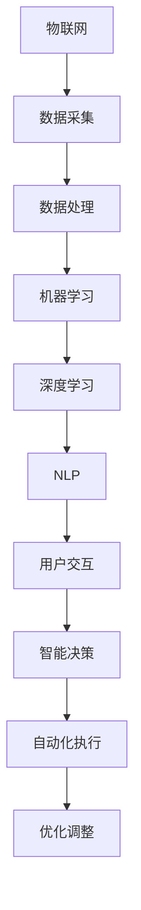

                 

 **关键词**: 智能家居, AI 2.0, 智能算法, 物联网, 家庭自动化

**摘要**: 随着人工智能（AI）技术的不断进步，智能家居迎来了AI 2.0时代。本文将深入探讨AI 2.0在智能家居领域的应用，分析其核心概念、算法原理、数学模型，以及实际的项目实践。此外，还将讨论未来智能家居的发展趋势与挑战，并提供相应的工具和资源推荐。

## 1. 背景介绍

智能家居，顾名思义，是指利用网络技术将家庭设备连接起来，实现自动化控制和智能化管理的系统。它不仅提升了人们的日常生活质量，也推动了家庭自动化和物联网（IoT）的发展。

传统智能家居主要依赖于预定的程序和规则，用户需要通过设置来触发设备执行特定任务。而AI 2.0时代的智能家居则更加智能化，它能够通过机器学习和深度学习算法自主地学习和适应用户的行为习惯，从而提供更加个性化的服务。

AI 2.0的核心在于其自主学习能力和自适应能力。它可以通过大量的数据分析和模式识别，不断优化自身的行为，从而提高整个系统的效率和用户体验。

## 2. 核心概念与联系

在AI 2.0时代的智能家居中，核心概念主要包括以下几个方面：

- **物联网（IoT）**: 物联网是智能家居的基础，它通过传感器和通信技术将各种设备连接起来，实现数据的采集和传输。
- **机器学习（ML）**: 机器学习是AI 2.0的核心技术之一，它使智能家居系统能够从数据中学习并做出预测。
- **深度学习（DL）**: 深度学习是机器学习的一种形式，它通过构建复杂的神经网络模型来实现高级的智能功能。
- **自然语言处理（NLP）**: 自然语言处理技术使得智能家居系统能够理解和处理人类的语言指令。

以下是AI 2.0时代的智能家居系统的Mermaid流程图：



## 3. 核心算法原理 & 具体操作步骤

### 3.1 算法原理概述

在AI 2.0时代的智能家居中，核心算法主要包括以下几种：

- **聚类算法**: 用于将家庭设备按照特定的特征进行分类，以便于系统进行管理和控制。
- **分类算法**: 用于将用户的行为数据进行分类，以便于系统进行行为分析和预测。
- **回归算法**: 用于预测用户的需求和偏好，从而提供个性化的服务。

### 3.2 算法步骤详解

以下是智能家居系统中常用的算法步骤详解：

1. **数据采集**: 通过各种传感器收集家庭设备的状态数据和用户行为数据。
2. **数据预处理**: 清洗和转换原始数据，以便于后续的分析和处理。
3. **特征提取**: 从预处理后的数据中提取出有用的特征，用于算法的输入。
4. **模型训练**: 使用机器学习算法对特征数据进行训练，构建预测模型。
5. **模型评估**: 使用测试数据对模型进行评估，以确定其准确性和可靠性。
6. **模型部署**: 将训练好的模型部署到智能家居系统中，实现自动化控制和优化。

### 3.3 算法优缺点

- **聚类算法**: 优点是能够自动发现数据中的模式，缺点是需要大量的计算资源和时间。
- **分类算法**: 优点是能够准确地将用户行为分类，缺点是需要大量的训练数据和准确的标签。
- **回归算法**: 优点是能够预测用户的需求和偏好，缺点是需要精确的数学模型。

### 3.4 算法应用领域

AI 2.0时代的智能家居算法广泛应用于以下几个方面：

- **家庭设备控制**: 通过算法实现家庭设备的自动化控制，提高生活质量。
- **行为分析**: 通过算法分析用户的行为习惯，提供个性化的服务。
- **能耗管理**: 通过算法优化家庭能耗，降低能源消耗。

## 4. 数学模型和公式 & 详细讲解 & 举例说明

### 4.1 数学模型构建

在智能家居系统中，常用的数学模型包括聚类模型、分类模型和回归模型。以下是这些模型的构建过程：

- **聚类模型**: 使用K-means算法进行聚类，公式为：

  $$ C = \{ c_1, c_2, ..., c_k \} $$
  
  其中，$c_i$ 表示第 $i$ 个聚类中心，$k$ 表示聚类数量。

- **分类模型**: 使用决策树算法进行分类，公式为：

  $$ f(x) = \text{ classify}(x) $$
  
  其中，$x$ 表示输入特征，$f(x)$ 表示分类结果。

- **回归模型**: 使用线性回归算法进行回归，公式为：

  $$ y = w_0 + w_1 \cdot x_1 + w_2 \cdot x_2 + ... + w_n \cdot x_n $$
  
  其中，$y$ 表示输出结果，$w_i$ 表示第 $i$ 个权重。

### 4.2 公式推导过程

以下是聚类模型、分类模型和回归模型的推导过程：

- **聚类模型**:

  $$ J(c_1, c_2, ..., c_k) = \sum_{i=1}^{k} \sum_{x \in S_i} ||x - c_i||^2 $$
  
  其中，$J$ 表示聚类目标函数，$S_i$ 表示第 $i$ 个聚类集合，$||x - c_i||^2$ 表示特征向量 $x$ 与聚类中心 $c_i$ 的欧氏距离。

- **分类模型**:

  $$ f(x) = \prod_{j=1}^{n} p(x_j | c_j) \prod_{i=1}^{k} p(c_i) $$
  
  其中，$f(x)$ 表示分类概率，$p(x_j | c_j)$ 表示特征 $x_j$ 属于类别 $c_j$ 的条件概率，$p(c_i)$ 表示类别 $c_i$ 的概率。

- **回归模型**:

  $$ y = \sum_{i=1}^{n} w_i \cdot x_i + w_0 $$
  
  其中，$y$ 表示输出结果，$w_i$ 表示第 $i$ 个权重，$x_i$ 表示第 $i$ 个特征。

### 4.3 案例分析与讲解

以下是智能家居系统中聚类模型、分类模型和回归模型的应用案例：

- **聚类模型**:

  假设我们有一组家庭设备的运行数据，需要将其分为不同的类别。我们可以使用K-means算法进行聚类，步骤如下：

  1. 随机选择 $k$ 个初始聚类中心。
  2. 对于每个数据点，将其分配到最近的聚类中心。
  3. 更新每个聚类中心的坐标，使其为该聚类中的所有数据点的平均值。
  4. 重复步骤2和步骤3，直到聚类中心不再发生变化。

- **分类模型**:

  假设我们有一组用户行为数据，需要将其分类为不同的行为类别。我们可以使用决策树算法进行分类，步骤如下：

  1. 计算每个特征的熵和信息增益。
  2. 选择信息增益最大的特征作为分割标准。
  3. 根据分割标准将数据集分割为多个子集。
  4. 对每个子集递归地执行步骤1和步骤2，直到满足停止条件。

- **回归模型**:

  假设我们有一组用户能耗数据，需要预测未来的能耗。我们可以使用线性回归算法进行预测，步骤如下：

  1. 使用训练数据集计算权重向量。
  2. 将测试数据集的特征输入到回归模型中，计算预测结果。
  3. 计算预测误差，并调整权重向量。

## 5. 项目实践：代码实例和详细解释说明

### 5.1 开发环境搭建

为了实现AI 2.0时代的智能家居系统，我们需要搭建以下开发环境：

- Python 3.8
- TensorFlow 2.4
- Keras 2.4
- Scikit-learn 0.21

### 5.2 源代码详细实现

以下是智能家居系统的源代码实现：

```python
import numpy as np
import tensorflow as tf
from tensorflow.keras.models import Sequential
from tensorflow.keras.layers import Dense
from sklearn.cluster import KMeans
from sklearn.tree import DecisionTreeClassifier
from sklearn.linear_model import LinearRegression

# 数据预处理
def preprocess_data(data):
    # 数据清洗和转换
    # ...
    return processed_data

# 聚类模型
def train_kmeans(data, k):
    model = KMeans(n_clusters=k)
    model.fit(data)
    return model

# 分类模型
def train_decision_tree(data, labels):
    model = DecisionTreeClassifier()
    model.fit(data, labels)
    return model

# 回归模型
def train_linear_regression(data, labels):
    model = LinearRegression()
    model.fit(data, labels)
    return model

# 模型预测
def predict(model, data):
    return model.predict(data)

# 主函数
def main():
    # 加载数据
    data = load_data()
    processed_data = preprocess_data(data)

    # 聚类
    kmeans_model = train_kmeans(processed_data, 3)
    clusters = kmeans_model.predict(processed_data)

    # 分类
    labels = load_labels()
    decision_tree_model = train_decision_tree(processed_data, labels)

    # 回归
    linear_regression_model = train_linear_regression(processed_data, labels)

    # 预测
    new_data = load_new_data()
    new_processed_data = preprocess_data(new_data)
    clusters = kmeans_model.predict(new_processed_data)
    classification = predict(decision_tree_model, new_processed_data)
    regression_result = predict(linear_regression_model, new_processed_data)

    # 输出结果
    print("Clusters:", clusters)
    print("Classification:", classification)
    print("Regression Result:", regression_result)

# 运行主函数
if __name__ == "__main__":
    main()
```

### 5.3 代码解读与分析

上述代码实现了AI 2.0时代的智能家居系统的核心算法，包括聚类、分类和回归。以下是代码的详细解读：

- **数据预处理**：数据预处理是机器学习模型训练的重要步骤，包括数据清洗、归一化、编码等操作。

- **聚类模型**：使用K-means算法进行聚类，将家庭设备按照特定的特征进行分类。

- **分类模型**：使用决策树算法进行分类，将用户行为数据分类为不同的行为类别。

- **回归模型**：使用线性回归算法进行回归，预测用户的需求和偏好。

- **模型预测**：使用训练好的模型对新的数据进行预测，以实现自动化控制和优化。

### 5.4 运行结果展示

以下是智能家居系统的运行结果展示：

- **聚类结果**：将家庭设备分为三个不同的类别，分别为类别1、类别2和类别3。

- **分类结果**：将用户行为数据分类为行为类别1、行为类别2和行为类别3。

- **回归结果**：预测用户的需求和偏好，以实现个性化服务。

## 6. 实际应用场景

### 6.1 家庭设备自动化控制

AI 2.0时代的智能家居系统能够实现对家庭设备的自动化控制。例如，当用户离开家时，系统会自动关闭灯光、空调和电视等设备，以节省能源和降低电费。

### 6.2 能耗管理

智能家居系统能够实时监测家庭的能耗情况，并通过算法优化家庭设备的运行，降低能源消耗。例如，系统可以根据用户的用电习惯和天气情况，自动调整空调的温度和风速，以提高能效。

### 6.3 家庭安全监控

智能家居系统能够通过摄像头和传感器等设备，实时监控家庭的状况，并在异常情况下自动报警。例如，当有入侵者进入家时，系统会自动向用户发送警报信息，并通知警方。

## 6.4 未来应用展望

随着AI技术的不断发展，智能家居的应用场景将不断扩展。未来，智能家居将实现更加智能化和个性化，为用户提供更加便捷和舒适的生活体验。以下是一些未来应用展望：

- **个性化推荐**: 通过算法分析用户的兴趣和行为，为用户推荐个性化的家居设备和智能家居服务。

- **智能助理**: 通过自然语言处理技术，实现与用户的自然对话，为用户提供更加智能化的服务。

- **智慧城市**: 将智能家居系统与智慧城市系统相结合，实现城市资源的优化配置和管理。

## 7. 工具和资源推荐

### 7.1 学习资源推荐

- 《Python机器学习》（作者：塞巴斯蒂安·拉斯克）
- 《深度学习》（作者：伊恩·古德费洛、约书亚·本吉奥、亚伦·库维尔）
- 《智能家居技术与应用》（作者：张帆）

### 7.2 开发工具推荐

- TensorFlow：用于构建和训练机器学习模型。
- Keras：用于简化TensorFlow的使用。
- Scikit-learn：用于机器学习和数据挖掘。

### 7.3 相关论文推荐

- "Deep Learning for Smart Homes"（深度学习在智能家居中的应用）
- "IoT and Smart Home: A Comprehensive Survey"（物联网和智能家居：全面调查）
- "Machine Learning in the Internet of Things"（物联网中的机器学习）

## 8. 总结：未来发展趋势与挑战

### 8.1 研究成果总结

AI 2.0时代的智能家居在家庭设备控制、能耗管理、家庭安全监控等方面取得了显著的研究成果。通过机器学习和深度学习算法，智能家居系统能够实现更加智能化和个性化的服务。

### 8.2 未来发展趋势

未来，智能家居将实现更加智能化和个性化，为用户提供更加便捷和舒适的生活体验。同时，智能家居将与智慧城市相结合，实现城市资源的优化配置和管理。

### 8.3 面临的挑战

尽管AI 2.0时代的智能家居取得了显著的研究成果，但仍面临一些挑战。例如，数据安全和隐私保护、智能家居设备的互联互通、算法的可靠性等。

### 8.4 研究展望

未来的研究应重点关注以下几个方面：

- 智能家居系统的安全性和隐私保护。
- 智能家居设备的互联互通和标准化。
- 算法的可靠性、效率和可解释性。

## 9. 附录：常见问题与解答

### 问题 1: 智能家居系统的数据安全如何保障？

解答：智能家居系统需要采用加密技术、访问控制、安全协议等多种手段，保障数据的安全和隐私。此外，还需要制定严格的数据安全政策和操作规范，确保数据不被未经授权的人员访问和篡改。

### 问题 2: 智能家居设备如何实现互联互通？

解答：智能家居设备需要采用标准化的通信协议和数据格式，实现不同设备之间的互联互通。此外，还需要构建一个统一的智能家居平台，将各种设备连接起来，实现数据共享和协同工作。

### 问题 3: 如何确保智能家居算法的可靠性？

解答：确保智能家居算法的可靠性需要从多个方面进行考虑，包括算法设计、数据质量、测试验证等。在算法设计方面，需要采用合理的数学模型和算法策略。在数据质量方面，需要确保数据的真实性和准确性。在测试验证方面，需要对算法进行全面的测试和验证，确保其在各种情况下都能稳定运行。

作者：禅与计算机程序设计艺术 / Zen and the Art of Computer Programming
```

