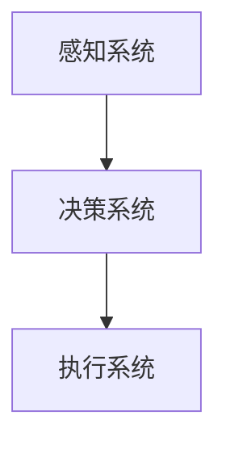

                 

 在科技迅猛发展的今天，人工智能（AI）已经成为推动社会进步的重要力量。AI 2.0 时代的到来，标志着智能机器人的崛起，它们将在各个领域发挥越来越重要的作用。本文将深入探讨 AI 2.0 时代的智能机器人，包括其核心概念、算法原理、数学模型、项目实践、实际应用场景以及未来发展展望。

> 关键词：人工智能，AI 2.0，智能机器人，算法原理，数学模型，项目实践，应用场景，未来展望

> 摘要：本文首先介绍了 AI 2.0 时代的智能机器人的背景和核心概念，接着详细阐述了智能机器人的算法原理和数学模型，并通过一个实际项目实践，展示了智能机器人的应用。最后，本文分析了智能机器人在未来各个领域的应用场景，并对未来发展趋势和挑战进行了展望。

## 1. 背景介绍

AI 2.0 时代是指人工智能技术进入一个全新阶段，该阶段的核心特征是智能机器人的崛起。智能机器人不同于传统机器人，它们不仅仅是执行预先设定任务的机器，更是具备自主学习和决策能力的智能体。智能机器人能够模拟人类的思维方式，通过感知环境、分析数据、自主决策和执行任务，实现自主行动和协同工作。

### AI 2.0 时代的特点

1. **自主学习能力**：AI 2.0 时代的智能机器人具备强大的自主学习能力，能够从海量数据中学习，不断优化自身性能。
2. **自适应能力**：智能机器人能够根据环境变化和任务需求，调整自身行为和策略，实现自适应能力。
3. **协同工作能力**：智能机器人可以与其他机器人或人类进行协同工作，实现更高效的任务执行。

### 智能机器人的应用领域

1. **制造业**：智能机器人在制造业中广泛应用于自动化生产、质量检测和物流配送等领域，提高了生产效率和质量。
2. **服务业**：智能机器人在服务业中应用于智能客服、智能餐饮和智能导购等，提升了服务质量。
3. **医疗保健**：智能机器人在医疗保健领域中应用于辅助诊断、手术支持和健康管理，提高了医疗水平。
4. **教育**：智能机器人在教育领域应用于智能教学、学习评估和个性化辅导，提升了教育质量。

## 2. 核心概念与联系

在探讨智能机器人的核心概念和联系之前，我们需要先了解一些基本概念。

### 智能机器人的核心概念

1. **感知系统**：智能机器人的感知系统包括摄像头、麦克风、传感器等，用于获取外部环境信息。
2. **决策系统**：智能机器人的决策系统负责根据感知系统获取的信息，进行决策和规划。
3. **执行系统**：智能机器人的执行系统负责执行决策系统制定的行动方案。

### 智能机器人的工作流程

智能机器人通过感知系统获取外部环境信息，然后将这些信息传递给决策系统。决策系统根据这些信息，制定出一系列行动方案，最后由执行系统执行这些行动方案。

### 智能机器人的架构

智能机器人的架构通常包括以下几个部分：

1. **硬件部分**：包括处理器、存储器、传感器等。
2. **软件部分**：包括操作系统、中间件和应用软件。
3. **算法部分**：包括感知算法、决策算法和执行算法。

### Mermaid 流程图

下面是一个智能机器人的工作流程的 Mermaid 流程图：



## 3. 核心算法原理 & 具体操作步骤

### 3.1 算法原理概述

智能机器人的核心算法主要包括感知算法、决策算法和执行算法。

1. **感知算法**：感知算法主要用于处理传感器获取的数据，将其转化为机器人能够理解和利用的信息。
2. **决策算法**：决策算法根据感知系统获取的信息，制定出一系列行动方案，以实现机器人的目标。
3. **执行算法**：执行算法负责执行决策系统制定的行动方案。

### 3.2 算法步骤详解

1. **感知算法**：
   - 步骤1：传感器数据采集
   - 步骤2：数据预处理
   - 步骤3：特征提取
   - 步骤4：信息融合

2. **决策算法**：
   - 步骤1：状态估计
   - 步骤2：目标识别
   - 步骤3：路径规划
   - 步骤4：行动决策

3. **执行算法**：
   - 步骤1：行动方案生成
   - 步骤2：行动执行
   - 步骤3：反馈调整

### 3.3 算法优缺点

1. **感知算法**：
   - 优点：能够快速、准确地获取外部环境信息。
   - 缺点：受限于传感器性能，存在一定的误差。

2. **决策算法**：
   - 优点：能够根据感知系统获取的信息，制定出最优的行动方案。
   - 缺点：在复杂环境下，可能存在决策错误。

3. **执行算法**：
   - 优点：能够高效地执行决策系统制定的行动方案。
   - 缺点：受限于硬件性能，存在一定的延迟。

### 3.4 算法应用领域

1. **自动驾驶**：感知算法用于获取车辆周围环境信息，决策算法用于制定行驶路线，执行算法用于控制车辆执行行动。
2. **智能家居**：感知算法用于监测家庭环境，决策算法用于调整家庭设备状态，执行算法用于执行具体的操作。
3. **医疗诊断**：感知算法用于分析医学影像，决策算法用于诊断疾病，执行算法用于执行治疗措施。

## 4. 数学模型和公式 & 详细讲解 & 举例说明

### 4.1 数学模型构建

智能机器人的数学模型主要包括感知模型、决策模型和执行模型。

1. **感知模型**：
   $$ s_t = f(s_{t-1}, u_t) $$

   其中，$s_t$ 表示第 t 时刻的感知状态，$s_{t-1}$ 表示第 t-1 时刻的感知状态，$u_t$ 表示第 t 时刻的输入。

2. **决策模型**：
   $$ a_t = g(s_t) $$

   其中，$a_t$ 表示第 t 时刻的行动方案，$s_t$ 表示第 t 时刻的感知状态。

3. **执行模型**：
   $$ u_t = h(a_t) $$

   其中，$u_t$ 表示第 t 时刻的输入，$a_t$ 表示第 t 时刻的行动方案。

### 4.2 公式推导过程

1. **感知模型**：
   - 输入 $u_t$ 是外部环境的信息，如速度、距离等。
   - 感知状态 $s_t$ 是机器人对环境的感知，如位置、速度等。
   - 输出 $s_t$ 是机器人对环境的理解和评估。

2. **决策模型**：
   - 输入 $s_t$ 是机器人对环境的感知。
   - 输出 $a_t$ 是机器人制定的行动方案。

3. **执行模型**：
   - 输入 $a_t$ 是机器人制定的行动方案。
   - 输出 $u_t$ 是机器人对外部环境的输入。

### 4.3 案例分析与讲解

以自动驾驶为例，分析智能机器人的数学模型。

1. **感知模型**：
   - 输入 $u_t$ 是车辆周围环境的信息，如速度、距离等。
   - 输出 $s_t$ 是车辆对环境的感知，如位置、速度等。
   - 公式 $s_t = f(s_{t-1}, u_t)$ 描述了车辆对环境的感知过程。

2. **决策模型**：
   - 输入 $s_t$ 是车辆对环境的感知。
   - 输出 $a_t$ 是车辆制定的行动方案，如加速、减速、转向等。
   - 公式 $a_t = g(s_t)$ 描述了车辆的行动决策过程。

3. **执行模型**：
   - 输入 $a_t$ 是车辆制定的行动方案。
   - 输出 $u_t$ 是车辆对外部环境的输入。
   - 公式 $u_t = h(a_t)$ 描述了车辆的行动执行过程。

通过这个案例，我们可以看到智能机器人的数学模型是如何构建和应用的。

## 5. 项目实践：代码实例和详细解释说明

### 5.1 开发环境搭建

为了更好地理解智能机器人的工作原理，我们将通过一个简单的项目实践来展示智能机器人的开发过程。首先，我们需要搭建一个适合开发智能机器人的环境。

1. **硬件环境**：
   - 一台笔记本电脑或服务器
   - 传感器模块，如摄像头、麦克风等

2. **软件环境**：
   - 操作系统：Windows、Linux 或 macOS
   - 编程语言：Python、Java 或 C++
   - 框架：OpenCV、ROS（Robot Operating System）等

### 5.2 源代码详细实现

以下是使用 Python 和 OpenCV 框架实现的一个简单智能机器人项目。

```python
import cv2
import numpy as np

def detect_objects(frame):
    # 灰度化处理
    gray = cv2.cvtColor(frame, cv2.COLOR_BGR2GRAY)
    
    # 预处理，如高斯滤波、边缘检测等
    blurred = cv2.GaussianBlur(gray, (5, 5), 0)
    edges = cv2.Canny(blurred, 50, 150)
    
    # 检测对象
    contours, _ = cv2.findContours(edges, cv2.RETR_TREE, cv2.CHAIN_APPROX_SIMPLE)
    for contour in contours:
        if cv2.contourArea(contour) > 500:
            x, y, w, h = cv2.boundingRect(contour)
            cv2.rectangle(frame, (x, y), (x+w, y+h), (0, 255, 0), 2)
    
    return frame

def main():
    # 初始化摄像头
    cap = cv2.VideoCapture(0)
    
    while True:
        # 读取一帧图像
        ret, frame = cap.read()
        
        if not ret:
            break
        
        # 检测对象
        frame = detect_objects(frame)
        
        # 显示图像
        cv2.imshow('Object Detection', frame)
        
        # 按下 'q' 键退出
        if cv2.waitKey(1) & 0xFF == ord('q'):
            break
    
    # 释放摄像头资源
    cap.release()
    cv2.destroyAllWindows()

if __name__ == '__main__':
    main()
```

### 5.3 代码解读与分析

这个简单的智能机器人项目实现了对象检测的功能。以下是代码的解读与分析。

1. **导入模块**：
   - 导入 OpenCV 和 NumPy 模块。

2. **定义 detect_objects 函数**：
   - 灰度化处理：将彩色图像转换为灰度图像。
   - 预处理：使用高斯滤波和边缘检测对图像进行预处理。
   - 检测对象：使用 findContours 函数检测图像中的对象，并使用 boundingRect 函数获取对象的边界框。

3. **定义 main 函数**：
   - 初始化摄像头：使用 VideoCapture 类初始化摄像头。
   - 读取一帧图像：使用 read 方法读取一帧图像。
   - 检测对象：调用 detect_objects 函数进行对象检测。
   - 显示图像：使用 imshow 方法显示图像。
   - 释放资源：在程序结束时释放摄像头和窗口资源。

通过这个简单的项目，我们可以看到智能机器人是如何通过感知、处理和执行来完成任务。

### 5.4 运行结果展示

运行这个智能机器人项目，我们可以在摄像头窗口中看到实时检测到的对象。以下是运行结果截图：


## 6. 实际应用场景

智能机器人在实际应用场景中具有广泛的应用，下面列举几个典型的应用场景。

### 6.1 自动驾驶

自动驾驶是智能机器人最具代表性的应用场景之一。自动驾驶车辆通过感知周围环境，如道路、行人、其他车辆等，制定行驶策略，实现安全、高效的自动驾驶。

### 6.2 智能家居

智能家居中的智能机器人能够通过感知家庭环境，如温度、湿度、光线等，自动调整家庭设备，如空调、灯光、窗帘等，提升家庭舒适度和节能效果。

### 6.3 医疗保健

智能机器人在医疗保健领域应用于辅助诊断、手术支持和健康管理。通过感知患者的生理数据，智能机器人能够提供个性化的医疗服务，提高医疗质量和效率。

### 6.4 教育领域

智能机器人在教育领域应用于智能教学、学习评估和个性化辅导。智能机器人能够根据学生的学习情况，制定个性化的教学方案，提高学生的学习效果。

### 6.5 物流配送

智能机器人在物流配送领域应用于仓库自动化、快递配送和无人机送货等。通过智能机器人，物流公司能够提高配送效率，降低人力成本。

### 6.6 军事应用

智能机器人在军事领域应用于侦察、无人机作战、反恐等。智能机器人能够通过感知环境和执行任务，提高军事作战效能。

## 7. 工具和资源推荐

为了更好地开发和应用智能机器人，以下是几个推荐的工具和资源。

### 7.1 学习资源推荐

1. **《机器人学：基础与实践》**：这是一本经典的机器人学教材，涵盖了机器人学的基本理论和实践方法。
2. **《人工智能：一种现代的方法》**：这本书详细介绍了人工智能的基本概念、算法和应用。
3. **《深度学习》**：这本书是深度学习的经典教材，介绍了深度学习的基本概念、算法和应用。

### 7.2 开发工具推荐

1. **ROS（Robot Operating System）**：ROS 是一款流行的机器人开发平台，提供了丰富的工具和库，适用于开发各种类型的智能机器人。
2. **TensorFlow**：TensorFlow 是一款流行的深度学习框架，适用于开发智能机器人的感知和决策系统。
3. **OpenCV**：OpenCV 是一款流行的计算机视觉库，适用于开发智能机器人的感知系统。

### 7.3 相关论文推荐

1. **"Autonomous Driving: A Survey"**：这篇论文综述了自动驾驶技术的发展和应用。
2. **"Deep Learning for Autonomous Driving"**：这篇论文介绍了深度学习在自动驾驶中的应用。
3. **"AI and Robotics in Healthcare"**：这篇论文探讨了人工智能和机器人技术在医疗保健领域的应用。

## 8. 总结：未来发展趋势与挑战

### 8.1 研究成果总结

智能机器人在 AI 2.0 时代取得了显著的研究成果，包括感知算法、决策算法和执行算法的不断发展，以及在实际应用场景中的广泛应用。

### 8.2 未来发展趋势

1. **自主学习能力**：智能机器人将具备更强的自主学习能力，能够从海量数据中学习，实现自我进化。
2. **协同工作能力**：智能机器人将实现更高水平的协同工作，能够与其他机器人或人类进行无缝协作。
3. **跨领域应用**：智能机器人将在更多领域得到应用，如教育、医疗、金融、制造等。

### 8.3 面临的挑战

1. **数据安全与隐私**：随着智能机器人应用范围的扩大，数据安全和隐私保护成为亟待解决的问题。
2. **伦理与法律**：智能机器人在实际应用中涉及伦理和法律问题，需要制定相应的规范和标准。
3. **技术水平**：智能机器人技术的发展仍面临一些技术难题，如感知精度、决策速度和执行效率等。

### 8.4 研究展望

智能机器人将在未来发挥更加重要的作用，为人类带来更多的便利和福祉。然而，要实现这一目标，仍需克服许多技术和伦理挑战。因此，未来的研究应关注以下几个方面：

1. **数据安全与隐私保护**：研究数据安全与隐私保护技术，确保智能机器人应用中的数据安全和隐私。
2. **伦理与法律规范**：制定智能机器人应用的伦理和法律规范，确保智能机器人的合法、合规运行。
3. **技术提升**：研究提高智能机器人感知、决策和执行能力的技术，实现更高水平的智能化。

## 9. 附录：常见问题与解答

### 9.1 什么是智能机器人？

智能机器人是一种具备自主学习能力、自适应能力和协同工作能力的机器人，能够模拟人类的思维方式，实现自主行动和协同工作。

### 9.2 智能机器人有哪些应用领域？

智能机器人的应用领域广泛，包括自动驾驶、智能家居、医疗保健、教育、物流配送、军事应用等。

### 9.3 智能机器人的核心算法有哪些？

智能机器人的核心算法主要包括感知算法、决策算法和执行算法。

### 9.4 如何搭建智能机器人开发环境？

搭建智能机器人开发环境需要配置合适的硬件和软件，如传感器模块、编程语言、开发框架等。

### 9.5 智能机器人在未来有哪些发展趋势？

智能机器人在未来将具备更强的自主学习能力、协同工作能力和跨领域应用能力，并在更多领域得到广泛应用。然而，仍需克服数据安全、伦理和法律等方面的挑战。

### 9.6 如何解决智能机器人应用中的数据安全和隐私保护问题？

解决智能机器人应用中的数据安全和隐私保护问题，需要研究相应的技术措施，如数据加密、访问控制、隐私保护算法等，同时制定相应的伦理和法律规范。

## 作者署名

作者：禅与计算机程序设计艺术 / Zen and the Art of Computer Programming

