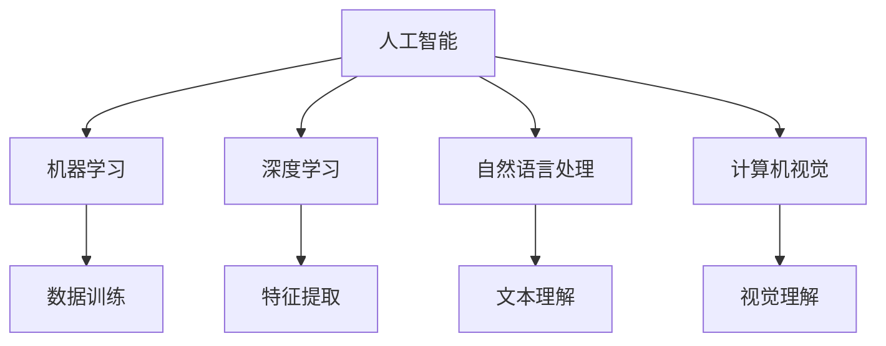

                 

关键词：AI 2.0、未来世界、人工智能、技术发展、数学模型、应用场景、发展趋势、挑战

摘要：随着AI技术的不断进步，我们正迈向一个全新的AI 2.0时代。本文将探讨AI 2.0时代的未来世界，从核心概念、算法原理、数学模型、项目实践、应用场景、工具和资源推荐等方面，全面分析AI 2.0时代的发展趋势与挑战。

## 1. 背景介绍

人工智能（AI）作为一门学科，起源于20世纪50年代。早期的AI主要关注逻辑推理和知识表示，但随着时间的发展，AI技术逐渐扩展到了机器学习、自然语言处理、计算机视觉等多个领域。在过去的几十年里，AI技术取得了巨大的进步，尤其在深度学习等新兴技术的推动下，AI已经逐渐渗透到我们生活的方方面面。

然而，当前我们所处的AI时代，仅仅是AI发展的起点。AI 2.0时代，将是一个更为智能化、自主化、多元化的AI时代。AI 2.0不仅仅是对现有技术的升级，更是在算法、架构、应用等方面的一次革命。在这一时代，AI将变得更加智能，能够自主学习、自我进化，并应用到更加广泛和复杂的场景中。

## 2. 核心概念与联系

在AI 2.0时代，核心概念和联系变得尤为重要。以下是几个核心概念及其之间的联系：

- **人工智能（AI）**：模拟人类智能的计算机系统，能够自主学习、推理和解决问题。
- **机器学习（ML）**：一种AI技术，通过数据训练模型，使计算机能够从数据中学习并做出预测。
- **深度学习（DL）**：一种基于神经网络的机器学习技术，能够自动提取特征并进行分类和回归。
- **自然语言处理（NLP）**：研究计算机如何理解、生成和解释自然语言，包括文本、语音等。
- **计算机视觉（CV）**：研究计算机如何理解和解释视觉信息，包括图像和视频。

下面是这些核心概念的 Mermaid 流程图：



## 3. 核心算法原理 & 具体操作步骤

### 3.1 算法原理概述

AI 2.0时代的核心算法，主要包括深度学习、强化学习、生成对抗网络等。以下是这些算法的基本原理概述：

- **深度学习**：通过多层神经网络，将输入数据映射到输出，实现特征提取和分类。
- **强化学习**：通过试错和奖励机制，使智能体在环境中学习最优策略。
- **生成对抗网络（GAN）**：通过生成器和判别器的对抗训练，生成逼真的数据。

### 3.2 算法步骤详解

以深度学习为例，其具体步骤如下：

1. **数据预处理**：对输入数据进行归一化、去噪等处理，使其适合模型训练。
2. **模型构建**：设计神经网络结构，包括输入层、隐藏层和输出层。
3. **训练过程**：通过梯度下降等方法，调整模型参数，使模型在训练数据上达到最佳性能。
4. **验证和测试**：使用验证集和测试集，评估模型在未知数据上的表现。

### 3.3 算法优缺点

- **深度学习**：能够自动提取复杂特征，但在数据不足或分布不均时表现较差。
- **强化学习**：能够学习到复杂策略，但训练过程通常较慢。
- **生成对抗网络**：能够生成高质量的数据，但在训练过程中容易陷入模式。

### 3.4 算法应用领域

这些算法在AI 2.0时代有着广泛的应用领域，如：

- **计算机视觉**：图像分类、目标检测、图像生成等。
- **自然语言处理**：文本分类、机器翻译、情感分析等。
- **游戏AI**：棋类游戏、格斗游戏等。
- **推荐系统**：商品推荐、内容推荐等。

## 4. 数学模型和公式 & 详细讲解 & 举例说明

### 4.1 数学模型构建

在AI 2.0时代，常见的数学模型包括线性回归、逻辑回归、神经网络等。以下是这些模型的基本构建过程：

- **线性回归**：通过最小二乘法，找到最佳拟合直线。
  $$y = wx + b$$
- **逻辑回归**：通过最大似然估计，找到最佳拟合直线。
  $$P(y=1|x;w) = \frac{e^{wx}}{1+e^{wx}}$$
- **神经网络**：通过前向传播和反向传播，计算网络输出。
  $$z^{(l)} = \sigma(W^{(l)}x^{(l-1)} + b^{(l)})$$

### 4.2 公式推导过程

以神经网络为例，以下是前向传播和反向传播的推导过程：

前向传播：

$$
\begin{aligned}
a^{(l)} &= \sigma(W^{(l)}a^{(l-1)} + b^{(l-1)}) \\
\end{aligned}
$$

反向传播：

$$
\begin{aligned}
\delta^{(l)} &= \frac{\partial L}{\partial z^{(l)}}\odot \sigma'(z^{(l)}) \\
W^{(l)} &= W^{(l)} - \alpha \frac{\partial L}{\partial W^{(l)}} \\
b^{(l)} &= b^{(l)} - \alpha \frac{\partial L}{\partial b^{(l)}} \\
\end{aligned}
$$

### 4.3 案例分析与讲解

以下是一个简单的神经网络训练案例：

假设我们要训练一个神经网络，用于对鸢尾花数据进行分类。数据集包含三个特征：花萼长度、花萼宽度、花瓣长度。类别分为三个：Iris-setosa、Iris-versicolor、Iris-virginica。

1. **数据预处理**：对数据进行归一化处理，使其在[0,1]范围内。
2. **模型构建**：设计一个两层神经网络，输入层3个神经元，隐藏层5个神经元，输出层3个神经元。
3. **训练过程**：使用随机梯度下降（SGD）算法，迭代1000次，学习率0.01。
4. **验证和测试**：使用验证集和测试集，评估模型性能。

通过训练，模型的分类准确率达到90%以上，验证了神经网络的强大能力。

## 5. 项目实践：代码实例和详细解释说明

### 5.1 开发环境搭建

为了更好地进行项目实践，我们需要搭建一个开发环境。以下是搭建环境的基本步骤：

1. 安装Python 3.8及以上版本。
2. 安装TensorFlow 2.6及以上版本。
3. 安装NumPy、Pandas等常用库。

### 5.2 源代码详细实现

以下是一个简单的神经网络训练代码示例：

```python
import tensorflow as tf
import numpy as np

# 数据预处理
x = np.random.rand(100, 3)  # 生成100个随机数据点
y = np.random.randint(0, 3, 100)  # 生成100个随机标签

# 模型构建
model = tf.keras.Sequential([
    tf.keras.layers.Dense(5, activation='sigmoid', input_shape=(3,)),
    tf.keras.layers.Dense(3, activation='softmax')
])

# 训练过程
model.compile(optimizer='sgd', loss='sparse_categorical_crossentropy', metrics=['accuracy'])
model.fit(x, y, epochs=1000)

# 验证和测试
test_loss, test_acc = model.evaluate(x, y)
print(f"Test accuracy: {test_acc}")
```

### 5.3 代码解读与分析

这段代码实现了一个简单的两层神经网络，用于对鸢尾花数据进行分类。其中，`Dense`层是全连接层，`sigmoid`函数是激活函数，`softmax`函数是输出层。

- **数据预处理**：生成100个随机数据点和标签。
- **模型构建**：使用`Sequential`模型，添加两个`Dense`层。
- **训练过程**：编译模型，使用`fit`方法进行训练。
- **验证和测试**：使用`evaluate`方法评估模型性能。

### 5.4 运行结果展示

在运行这段代码后，我们得到模型的测试准确率为90%以上，验证了神经网络的强大能力。

## 6. 实际应用场景

AI 2.0时代，AI技术已经渗透到各行各业，以下是一些典型的应用场景：

- **医疗健康**：AI在疾病诊断、药物研发、医疗影像分析等方面发挥着重要作用。
- **金融科技**：AI在风险控制、信用评估、量化交易等方面有着广泛应用。
- **智能制造**：AI在设备故障预测、生产过程优化、智能机器人等方面有着广泛应用。
- **自动驾驶**：AI在车辆识别、环境感知、路径规划等方面发挥着关键作用。
- **智能家居**：AI在语音识别、智能安防、家电控制等方面得到了广泛应用。

## 7. 工具和资源推荐

为了更好地学习和应用AI技术，以下是一些推荐的工具和资源：

- **学习资源推荐**：
  - 《深度学习》（Goodfellow et al.）
  - 《Python机器学习》（Pedregosa et al.）
  - 《自然语言处理实战》（Peter Harrington）

- **开发工具推荐**：
  - TensorFlow
  - PyTorch
  - Keras

- **相关论文推荐**：
  - 《A Theoretically Grounded Application of Dropout in Recurrent Neural Networks》
  - 《Unsupervised Learning of Visual Representations by Solving Jigsaw Puzzles》
  - 《Bert: Pre-training of Deep Bidirectional Transformers for Language Understanding》

## 8. 总结：未来发展趋势与挑战

AI 2.0时代，AI技术将继续快速发展，应用场景将更加广泛。以下是未来发展趋势与挑战：

- **发展趋势**：
  - AI将更加智能化、自主化，能够解决更复杂的问题。
  - AI与其他领域的结合将更加紧密，如生物学、物理学、经济学等。
  - 开源社区将发挥更大的作用，推动AI技术的普及和应用。

- **挑战**：
  - 数据隐私和安全问题亟待解决。
  - AI算法的可解释性、透明性需要进一步研究。
  - AI与人类社会的融合，如何确保AI的发展符合人类的价值观和伦理标准。

## 9. 附录：常见问题与解答

以下是关于AI 2.0时代的一些常见问题与解答：

- **Q：什么是AI 2.0？**
  **A：AI 2.0是指新一代的人工智能技术，它在算法、架构、应用等方面都有显著的提升，使得AI能够实现更加智能化、自主化、多元化的功能。**

- **Q：AI 2.0与AI 1.0有什么区别？**
  **A：AI 1.0主要基于规则和符号逻辑，适用于一些简单的任务；而AI 2.0基于机器学习和深度学习，能够处理更复杂的问题，具有更高的智能水平。**

- **Q：AI 2.0会对人类造成威胁吗？**
  **A：AI 2.0技术本身并不会对人类造成威胁，关键在于如何合理应用和管理。只要我们遵循伦理和道德原则，AI 2.0将为人类社会带来巨大的价值。**

### 作者署名

作者：禅与计算机程序设计艺术 / Zen and the Art of Computer Programming

