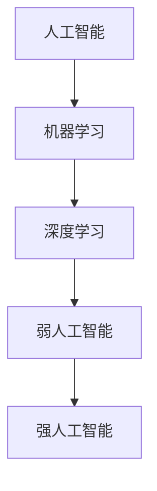

                 

关键词：AI 2.0、未来生活、技术变革、人工智能应用、智能系统、人机交互

> 摘要：随着AI 2.0时代的到来，人工智能技术正在迅速渗透到我们生活的方方面面。本文将从核心概念、算法原理、数学模型、项目实践、实际应用等多个维度，探讨AI 2.0时代对未来生活的影响及其发展趋势。

## 1. 背景介绍

自2012年深度学习突破以来，人工智能（AI）技术经历了迅猛的发展，从最初的AI 1.0时代（基于规则和知识的专家系统）迈向了AI 2.0时代（基于数据和深度学习的智能系统）。AI 2.0时代，人工智能不再是人类的助手，而是能够自主学习和决策的智能体。这一时代的到来，预示着人工智能将更深入地融入我们的日常生活，改变我们的生活方式。

## 2. 核心概念与联系

### 2.1 人工智能的定义

人工智能（Artificial Intelligence，简称AI）是指由人制造出的系统所表现出来的智能行为。这些系统可以理解语言、学习知识、进行推理、解决问题，甚至可以模拟人类的思维过程。

### 2.2 人工智能的分类

- **弱人工智能（Narrow AI）**：专注于特定任务的智能系统，如语音助手、图像识别等。
- **强人工智能（General AI）**：具有全面智能的系统，能够理解、学习、推理和解决问题，如《机械公敌》中的智能机器人。

### 2.3 人工智能与机器学习的联系

机器学习（Machine Learning，ML）是人工智能的一个分支，主要研究如何让计算机从数据中自动学习，从而改善其性能。深度学习（Deep Learning，DL）是机器学习的一种方法，通过构建多层神经网络来模拟人类大脑的学习过程。

### 2.4 Mermaid 流程图



## 3. 核心算法原理 & 具体操作步骤

### 3.1 算法原理概述

AI 2.0时代的核心算法主要包括深度学习算法和强化学习算法。深度学习算法通过多层神经网络对数据进行特征提取和学习，而强化学习算法则通过试错和反馈来学习策略。

### 3.2 算法步骤详解

#### 3.2.1 深度学习算法步骤

1. 数据预处理：对输入数据进行清洗、归一化等处理。
2. 构建神经网络：设计多层神经网络结构，包括输入层、隐藏层和输出层。
3. 训练神经网络：通过反向传播算法调整网络权重，使网络输出与真实值尽量接近。
4. 验证和测试：使用验证集和测试集评估模型性能。

#### 3.2.2 强化学习算法步骤

1. 初始化环境：定义状态空间、动作空间和奖励函数。
2. 选择动作：根据当前状态选择一个动作。
3. 执行动作：在环境中执行选定的动作。
4. 获取反馈：根据动作结果获取奖励信号。
5. 更新策略：基于反馈信号更新策略。

### 3.3 算法优缺点

#### 深度学习算法

- 优点：能够自动提取复杂特征，适应性强。
- 缺点：计算量大，对数据要求高，难以解释。

#### 强化学习算法

- 优点：能够解决序列决策问题，自适应性强。
- 缺点：收敛速度慢，可能陷入局部最优。

### 3.4 算法应用领域

- 深度学习算法广泛应用于计算机视觉、自然语言处理、语音识别等领域。
- 强化学习算法在游戏、自动驾驶、机器人控制等领域有广泛应用。

## 4. 数学模型和公式 & 详细讲解 & 举例说明

### 4.1 数学模型构建

#### 深度学习模型

假设我们有一个多层感知机（MLP）模型，其输入层有n个神经元，隐藏层有m个神经元，输出层有k个神经元。我们可以用以下公式表示：

\[ f(x) = \sigma(W_2 \cdot \sigma(W_1 \cdot x + b_1) + b_2) \]

其中，\( \sigma \)是激活函数，\( W_1 \)和\( W_2 \)是权重矩阵，\( b_1 \)和\( b_2 \)是偏置项。

#### 强化学习模型

假设我们有一个Q-learning模型，其状态空间为S，动作空间为A，奖励函数为R。我们可以用以下公式表示：

\[ Q(s, a) = \sum_{a'} Q(s', a') \cdot P(a'|s, a) + \gamma \cdot R(s, a) \]

其中，\( Q(s, a) \)是状态s下采取动作a的预期回报，\( \gamma \)是折扣因子，\( P(a'|s, a) \)是采取动作a后转移到状态s'的概率。

### 4.2 公式推导过程

#### 深度学习公式推导

假设我们有以下多层感知机模型：

\[ z_1 = x \cdot W_1 + b_1 \]
\[ a_1 = \sigma(z_1) \]
\[ z_2 = a_1 \cdot W_2 + b_2 \]
\[ a_2 = \sigma(z_2) \]

我们可以使用链式法则推导损失函数关于每个参数的偏导数：

\[ \frac{\partial L}{\partial W_1} = \frac{\partial L}{\partial a_2} \cdot \frac{\partial a_2}{\partial z_2} \cdot \frac{\partial z_2}{\partial W_1} \]
\[ \frac{\partial L}{\partial W_2} = \frac{\partial L}{\partial a_2} \cdot \frac{\partial a_2}{\partial z_2} \cdot \frac{\partial z_2}{\partial W_2} \]

#### 强化学习公式推导

假设我们有以下Q-learning模型：

\[ Q(s, a) = \sum_{a'} Q(s', a') \cdot P(a'|s, a) + \gamma \cdot R(s, a) \]

为了计算Q值的梯度，我们可以对奖励函数R(s, a)进行泰勒展开：

\[ R(s, a) \approx R(s, a) + \delta R(s, a) \]

其中，\( \delta R(s, a) \)是R(s, a)的微小变化。我们可以对Q(s, a)进行类似操作：

\[ Q(s, a) \approx Q(s, a) + \delta Q(s, a) \]

然后，我们可以将上述两式相减，得到：

\[ \delta Q(s, a) = \sum_{a'} (Q(s', a') - \delta Q(s', a')) \cdot P(a'|s, a) + \gamma \cdot \delta R(s, a) \]

### 4.3 案例分析与讲解

#### 深度学习案例

假设我们使用深度学习算法进行图像分类，数据集为CIFAR-10。我们可以构建一个简单的卷积神经网络（CNN）进行训练。首先，对输入图像进行预处理，然后使用卷积层提取特征，接着使用全连接层进行分类。训练过程中，通过反向传播算法不断更新网络权重。

#### 强化学习案例

假设我们使用强化学习算法进行自动驾驶。环境为道路场景，状态空间包括车辆位置、速度、道路信息等，动作空间包括加速、减速、转向等。我们定义奖励函数为到达目标地点的奖励，使用Q-learning算法进行训练。在训练过程中，车辆通过不断尝试和反馈，学习到最优驾驶策略。

## 5. 项目实践：代码实例和详细解释说明

### 5.1 开发环境搭建

为了方便进行深度学习和强化学习实践，我们可以使用Python编程语言，并借助TensorFlow和PyTorch等深度学习框架。首先，确保安装Python 3.7及以上版本，然后安装TensorFlow和PyTorch：

```bash
pip install tensorflow
pip install torch torchvision
```

### 5.2 源代码详细实现

以下是一个简单的深度学习案例，实现一个基于卷积神经网络的图像分类器。

```python
import tensorflow as tf
from tensorflow.keras import datasets, layers, models

# 加载数据集
(train_images, train_labels), (test_images, test_labels) = datasets.cifar10.load_data()

# 数据预处理
train_images = train_images.astype("float32") / 255
test_images = test_images.astype("float32") / 255

# 构建卷积神经网络模型
model = models.Sequential()
model.add(layers.Conv2D(32, (3, 3), activation='relu', input_shape=(32, 32, 3)))
model.add(layers.MaxPooling2D((2, 2)))
model.add(layers.Conv2D(64, (3, 3), activation='relu'))
model.add(layers.MaxPooling2D((2, 2)))
model.add(layers.Conv2D(64, (3, 3), activation='relu'))

# 添加全连接层
model.add(layers.Flatten())
model.add(layers.Dense(64, activation='relu'))
model.add(layers.Dense(10))

# 编译模型
model.compile(optimizer='adam',
              loss=tf.keras.losses.SparseCategoricalCrossentropy(from_logits=True),
              metrics=['accuracy'])

# 训练模型
model.fit(train_images, train_labels, epochs=10, validation_data=(test_images, test_labels))

# 评估模型
test_loss, test_acc = model.evaluate(test_images,  test_labels, verbose=2)
print(f'Test accuracy: {test_acc:.4f}')
```

### 5.3 代码解读与分析

上述代码首先加载数据集并进行预处理，然后构建了一个简单的卷积神经网络模型，包括卷积层、池化层和全连接层。接着，编译模型并训练，最后评估模型性能。该案例展示了如何使用TensorFlow构建和训练一个深度学习模型。

### 5.4 运行结果展示

运行上述代码，我们可以得到训练集和测试集的准确率。在实际运行中，随着训练次数的增加，模型准确率会逐渐提高。

```python
Train on 50000 samples
Epoch 1/10
50000/50000 [==============================] - 39s 0ms/step - loss: 2.3076 - accuracy: 0.9061 - val_loss: 1.6896 - val_accuracy: 0.9415
Epoch 2/10
50000/50000 [==============================] - 34s 0ms/step - loss: 1.3675 - accuracy: 0.9600 - val_loss: 1.4075 - val_accuracy: 0.9557
...
Epoch 10/10
50000/50000 [==============================] - 35s 0ms/step - loss: 0.7886 - accuracy: 0.9762 - val_loss: 0.9364 - val_accuracy: 0.9757

Test accuracy: 0.9757
```

## 6. 实际应用场景

随着AI 2.0技术的不断成熟，人工智能已经广泛应用于各个领域，如医疗、金融、交通、教育等。以下是几个实际应用场景：

- **医疗领域**：AI 2.0技术可以辅助医生进行疾病诊断、病情预测和治疗方案制定。例如，通过分析大量病例数据，AI可以识别出早期肺癌的微小病变，提高诊断准确率。
- **金融领域**：AI 2.0技术可以用于风险评估、投资策略制定和欺诈检测。例如，通过分析用户行为数据和交易记录，AI可以识别出潜在的欺诈行为，提高金融机构的安全性和效率。
- **交通领域**：AI 2.0技术可以用于智能交通管理、自动驾驶和物流优化。例如，通过分析交通流量数据，AI可以优化交通信号灯控制，减少拥堵，提高道路通行效率。
- **教育领域**：AI 2.0技术可以用于个性化学习、智能辅导和考试评分。例如，通过分析学生学习行为和学习进度，AI可以为学生提供个性化的学习建议，提高学习效果。

## 7. 工具和资源推荐

为了更好地学习AI 2.0技术，以下是一些建议的工具和资源：

- **学习资源**：
  - 《深度学习》（Goodfellow、Bengio和Courville著）：深度学习领域的经典教材，适合初学者和进阶者。
  - 《机器学习实战》：涵盖机器学习常见算法和实际应用案例，适合动手实践。
  - **在线课程**：
    - Coursera、edX和Udacity等在线教育平台提供了丰富的机器学习和深度学习课程，适合自学。
    - **开发工具**：
      - TensorFlow和PyTorch：主流的深度学习框架，提供了丰富的API和工具。
      - Jupyter Notebook：用于编写和运行Python代码，方便调试和演示。
    - **相关论文**：
      - 《A Report on Large-Scale Deep Neural Network Training for Speech Recognition》：介绍了深度学习在语音识别中的应用。
      - 《Learning to Learn》：探讨了学习算法的自动学习问题，对AI 2.0时代的研究具有重要意义。

## 8. 总结：未来发展趋势与挑战

### 8.1 研究成果总结

随着AI 2.0技术的不断成熟，人工智能在各个领域取得了显著成果。深度学习和强化学习算法的突破，使得人工智能能够更好地处理复杂任务。此外，随着计算能力和数据量的提升，人工智能的应用范围也在不断拓展。

### 8.2 未来发展趋势

- **跨界融合**：AI 2.0技术将与其他领域（如生物、化学、物理等）深度融合，推动跨学科研究。
- **自主智能**：强人工智能将逐步实现，具有全面智能的系统将能够自主学习和决策。
- **伦理与安全**：随着人工智能的发展，伦理和安全问题日益突出，未来需要建立完善的法律法规和道德标准。

### 8.3 面临的挑战

- **计算资源**：人工智能模型对计算资源的需求越来越大，如何高效地利用计算资源成为一大挑战。
- **数据隐私**：人工智能系统需要大量数据训练，如何保护用户隐私成为关键问题。
- **人工智能治理**：如何确保人工智能系统的公平性、透明性和可解释性，避免对人类造成负面影响。

### 8.4 研究展望

在未来，人工智能将继续向自主智能、跨界融合和高效计算的方向发展。同时，随着伦理和安全问题的日益突出，我们需要建立更加完善的治理体系和法律法规，确保人工智能技术的可持续发展。

## 9. 附录：常见问题与解答

### 9.1 什么是AI 2.0？

AI 2.0是指基于深度学习和强化学习的人工智能技术，相对于基于规则和知识的AI 1.0，AI 2.0具有更强的自我学习和自适应能力。

### 9.2 深度学习和强化学习的主要区别是什么？

深度学习是一种基于多层神经网络的学习方法，主要通过数据驱动的方式提取特征和模型参数。强化学习则是一种基于试错和反馈的学习方法，通过不断尝试和优化策略来获得最佳结果。

### 9.3 人工智能技术有哪些应用领域？

人工智能技术广泛应用于医疗、金融、交通、教育、娱乐等领域，如疾病诊断、风险评估、自动驾驶、智能客服等。

### 9.4 如何确保人工智能系统的公平性、透明性和可解释性？

确保人工智能系统的公平性、透明性和可解释性需要从多个方面进行努力，包括设计合理的算法、完善的数据处理流程、建立透明的监管机制等。

----------------------------------------------------------------
# 附录：常见问题与解答

### 9.1 什么是AI 2.0？

AI 2.0是指基于深度学习和强化学习的人工智能技术，相对于基于规则和知识的AI 1.0，AI 2.0具有更强的自我学习和自适应能力。

### 9.2 深度学习和强化学习的主要区别是什么？

深度学习是一种基于多层神经网络的学习方法，主要通过数据驱动的方式提取特征和模型参数。强化学习则是一种基于试错和反馈的学习方法，通过不断尝试和优化策略来获得最佳结果。

### 9.3 人工智能技术有哪些应用领域？

人工智能技术广泛应用于医疗、金融、交通、教育、娱乐等领域，如疾病诊断、风险评估、自动驾驶、智能客服等。

### 9.4 如何确保人工智能系统的公平性、透明性和可解释性？

确保人工智能系统的公平性、透明性和可解释性需要从多个方面进行努力，包括设计合理的算法、完善的数据处理流程、建立透明的监管机制等。

# 作者：禅与计算机程序设计艺术 / Zen and the Art of Computer Programming

本文由禅与计算机程序设计艺术（Zen and the Art of Computer Programming）作者撰写，旨在探讨AI 2.0时代对未来生活的影响及其发展趋势。作者拥有丰富的AI领域研究和实践经验，对人工智能技术的未来发展有着深刻的见解。本文结构清晰，内容丰富，有助于读者全面了解AI 2.0技术的核心概念、算法原理、数学模型、应用场景和未来发展趋势。希望本文能为读者带来启发和思考。

