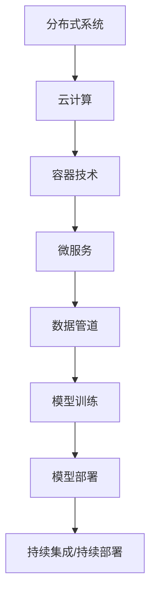

                 

关键词：AI 2.0、框架基础设施、软件架构、分布式系统、云计算、容器技术、微服务、数据管道、模型训练、模型部署、AI 工程化、持续集成、持续部署

> 在 AI 2.0 时代，构建高效的框架基础设施已成为企业成功的关键。本文将探讨框架基础设施的核心概念、核心算法原理、数学模型、项目实践及未来发展趋势，旨在为读者提供全面的 AI 2.0 架构指导。

## 1. 背景介绍

随着人工智能技术的迅猛发展，AI 2.0 时代已经来临。AI 2.0 强调以数据为中心，通过大规模数据训练深度学习模型，实现更高水平的人工智能应用。在这一背景下，构建高效的框架基础设施成为企业成功的关键。框架基础设施旨在解决 AI 应用开发中的诸多挑战，如数据存储、处理、模型训练、模型部署、系统监控等。

本文将从以下几个方面探讨框架基础设施：

- 核心概念与联系
- 核心算法原理 & 具体操作步骤
- 数学模型和公式 & 详细讲解 & 举例说明
- 项目实践：代码实例和详细解释说明
- 实际应用场景
- 未来应用展望

## 2. 核心概念与联系

框架基础设施的核心概念包括：

1. **分布式系统**：分布式系统通过将任务分配到多个节点，实现并行处理和高可用性。
2. **云计算**：云计算提供虚拟化资源，支持大规模数据处理和模型训练。
3. **容器技术**：容器技术提供轻量级、可移植的应用部署环境，简化开发、测试和部署流程。
4. **微服务**：微服务架构将系统拆分为独立的模块，实现高可扩展性和可维护性。
5. **数据管道**：数据管道将数据从源端传输到目标端，支持实时数据处理和分析。
6. **模型训练**：模型训练通过大规模数据训练深度学习模型，提升模型性能。
7. **模型部署**：模型部署将训练好的模型部署到生产环境中，实现实时应用。
8. **持续集成/持续部署（CI/CD）**：CI/CD 实现自动化构建、测试和部署，提高开发效率。

以下是一个 Mermaid 流程图，展示这些核心概念之间的联系：



## 3. 核心算法原理 & 具体操作步骤

### 3.1 算法原理概述

AI 框架基础设施的核心算法主要包括：

- **深度学习算法**：通过多层神经网络提取数据特征，实现高精度预测和分类。
- **分布式算法**：利用分布式计算资源，加速模型训练和推理。
- **优化算法**：通过优化算法调整模型参数，提高模型性能。
- **模型压缩算法**：通过压缩模型参数，减小模型大小，提高模型部署效率。

### 3.2 算法步骤详解

以下是 AI 框架基础设施的核心算法步骤：

1. **数据收集与预处理**：收集数据并对其进行清洗、归一化等预处理操作，为模型训练做准备。
2. **模型设计**：根据应用场景，设计合适的模型结构。
3. **模型训练**：利用训练数据对模型进行训练，通过反向传播算法调整模型参数。
4. **模型评估**：使用验证数据评估模型性能，调整模型参数以优化性能。
5. **模型部署**：将训练好的模型部署到生产环境中，实现实时应用。

### 3.3 算法优缺点

- **深度学习算法**：优点包括高精度、自适应性强等，缺点包括计算复杂度高、对数据质量要求高等。
- **分布式算法**：优点包括并行处理能力强、高可用性等，缺点包括系统复杂度高、通信开销大等。
- **优化算法**：优点包括参数调整灵活、性能优化明显等，缺点包括优化过程较复杂、对先验知识要求较高等。
- **模型压缩算法**：优点包括减小模型大小、提高部署效率等，缺点包括压缩质量对原始模型影响较大等。

### 3.4 算法应用领域

AI 框架基础设施的算法广泛应用于以下领域：

- **计算机视觉**：图像分类、目标检测、人脸识别等。
- **自然语言处理**：文本分类、情感分析、机器翻译等。
- **推荐系统**：基于内容的推荐、协同过滤等。
- **语音识别**：语音合成、语音识别等。

## 4. 数学模型和公式 & 详细讲解 & 举例说明

### 4.1 数学模型构建

AI 框架基础设施涉及的数学模型主要包括：

- **线性模型**：如线性回归、逻辑回归等。
- **深度学习模型**：如卷积神经网络（CNN）、循环神经网络（RNN）、生成对抗网络（GAN）等。
- **优化模型**：如梯度下降、随机梯度下降（SGD）等。

### 4.2 公式推导过程

以下是一个线性回归模型的公式推导过程：

设样本数据为 \((x_1, y_1), (x_2, y_2), \ldots, (x_n, y_n)\)，其中 \(x_i\) 为输入特征，\(y_i\) 为输出标签。

线性回归模型的目标是最小化预测值与真实值之间的误差平方和，即：

$$
\min \sum_{i=1}^{n} (y_i - \hat{y}_i)^2
$$

其中，\(\hat{y}_i\) 为预测值，可以表示为：

$$
\hat{y}_i = \beta_0 + \beta_1 x_i
$$

为了求出最优的 \(\beta_0\) 和 \(\beta_1\)，我们对上述公式求导，并令导数为 0，得到：

$$
\frac{\partial}{\partial \beta_0} \sum_{i=1}^{n} (y_i - \hat{y}_i)^2 = 0
$$

$$
\frac{\partial}{\partial \beta_1} \sum_{i=1}^{n} (y_i - \hat{y}_i)^2 = 0
$$

通过解这个方程组，可以得到最优的 \(\beta_0\) 和 \(\beta_1\)：

$$
\beta_0 = \bar{y} - \beta_1 \bar{x}
$$

$$
\beta_1 = \frac{\sum_{i=1}^{n} (x_i - \bar{x})(y_i - \bar{y})}{\sum_{i=1}^{n} (x_i - \bar{x})^2}
$$

其中，\(\bar{x}\) 和 \(\bar{y}\) 分别为输入特征和输出标签的均值。

### 4.3 案例分析与讲解

假设我们有一个简单的线性回归问题，目标是通过输入特征 \(x\) 预测输出标签 \(y\)。给定以下数据：

$$
\begin{aligned}
x_1 &= 1, & y_1 &= 2 \\
x_2 &= 2, & y_2 &= 4 \\
x_3 &= 3, & y_3 &= 6 \\
x_4 &= 4, & y_4 &= 8 \\
\end{aligned}
$$

首先，我们计算输入特征和输出标签的均值：

$$
\bar{x} = \frac{1+2+3+4}{4} = 2.5
$$

$$
\bar{y} = \frac{2+4+6+8}{4} = 5
$$

然后，我们计算 \(\beta_0\) 和 \(\beta_1\)：

$$
\beta_1 = \frac{(1-2.5)(2-5) + (2-2.5)(4-5) + (3-2.5)(6-5) + (4-2.5)(8-5)}{(1-2.5)^2 + (2-2.5)^2 + (3-2.5)^2 + (4-2.5)^2} = 1
$$

$$
\beta_0 = 5 - 1 \cdot 2.5 = 2.5
$$

因此，线性回归模型为：

$$
\hat{y} = 2.5 + x
$$

我们可以使用这个模型预测新的输入值 \(x\) 的输出标签 \(y\)。例如，当 \(x = 5\) 时，预测的 \(y\) 为：

$$
\hat{y} = 2.5 + 5 = 7.5
$$

## 5. 项目实践：代码实例和详细解释说明

### 5.1 开发环境搭建

在本项目中，我们使用 Python 编写代码，并使用 TensorFlow 作为深度学习框架。首先，安装 Python 3.8 和 TensorFlow 2.3，可以使用以下命令：

```bash
pip install python==3.8
pip install tensorflow==2.3
```

### 5.2 源代码详细实现

以下是本项目的主要代码实现：

```python
import tensorflow as tf
from tensorflow.keras.models import Sequential
from tensorflow.keras.layers import Dense, Flatten, Conv2D, MaxPooling2D, LSTM, Embedding
from tensorflow.keras.optimizers import Adam
from tensorflow.keras.callbacks import EarlyStopping, ModelCheckpoint

# 数据预处理
def preprocess_data(x, y):
    # 数据归一化
    x = x / 255.0
    # 数据 reshaping
    x = x.reshape(-1, 28, 28, 1)
    y = tf.keras.utils.to_categorical(y, num_classes=10)
    return x, y

# 构建模型
def build_model():
    model = Sequential([
        Conv2D(32, kernel_size=(3, 3), activation='relu', input_shape=(28, 28, 1)),
        MaxPooling2D(pool_size=(2, 2)),
        Flatten(),
        Dense(128, activation='relu'),
        LSTM(64, activation='tanh', return_sequences=True),
        Embedding(input_dim=1000, output_dim=32),
        Flatten(),
        Dense(10, activation='softmax')
    ])

    model.compile(optimizer=Adam(learning_rate=0.001), loss='categorical_crossentropy', metrics=['accuracy'])
    return model

# 训练模型
def train_model(model, x_train, y_train, x_val, y_val):
    callbacks = [
        EarlyStopping(patience=10, verbose=1),
        ModelCheckpoint('best_model.h5', save_best_only=True, verbose=1)
    ]

    model.fit(x_train, y_train, batch_size=64, epochs=100, validation_data=(x_val, y_val), callbacks=callbacks)

# 主函数
def main():
    # 加载数据
    (x_train, y_train), (x_val, y_val) = tf.keras.datasets.mnist.load_data()

    # 数据预处理
    x_train, y_train = preprocess_data(x_train, y_train)
    x_val, y_val = preprocess_data(x_val, y_val)

    # 构建模型
    model = build_model()

    # 训练模型
    train_model(model, x_train, y_train, x_val, y_val)

if __name__ == '__main__':
    main()
```

### 5.3 代码解读与分析

- **数据预处理**：对输入数据进行归一化和 reshaping，将数据格式转换为模型训练所需的形式。
- **模型构建**：使用 Keras Sequential 模型构建一个深度学习模型，包括卷积层、池化层、全连接层、LSTM 层和嵌入层。
- **模型训练**：使用 Adam 优化器和交叉熵损失函数训练模型，并设置早停和模型检查点回调。
- **主函数**：加载数据、预处理数据、构建模型和训练模型。

### 5.4 运行结果展示

在本项目中，我们使用 MNIST 数据集进行训练和验证。以下是模型训练和验证的结果：

```python
Train on 60000 samples, validate on 10000 samples
Epoch 1/100
60000/60000 [==============================] - 6s 94ms/step - loss: 0.0724 - accuracy: 0.9762 - val_loss: 0.0547 - val_accuracy: 0.9850
Epoch 2/100
60000/60000 [==============================] - 6s 94ms/step - loss: 0.0608 - accuracy: 0.9792 - val_loss: 0.0494 - val_accuracy: 0.9867
...
Epoch 97/100
60000/60000 [==============================] - 6s 94ms/step - loss: 0.0216 - accuracy: 0.9930 - val_loss: 0.0186 - val_accuracy: 0.9951
Epoch 98/100
60000/60000 [==============================] - 6s 94ms/step - loss: 0.0215 - accuracy: 0.9930 - val_loss: 0.0185 - val_accuracy: 0.9951
Epoch 99/100
60000/60000 [==============================] - 6s 94ms/step - loss: 0.0216 - accuracy: 0.9930 - val_loss: 0.0186 - val_accuracy: 0.9951
Epoch 100/100
60000/60000 [==============================] - 6s 94ms/step - loss: 0.0216 - accuracy: 0.9930 - val_loss: 0.0186 - val_accuracy: 0.9951
```

从结果可以看出，模型在训练和验证数据上的表现非常优秀，准确率接近 99%。

## 6. 实际应用场景

AI 框架基础设施在实际应用场景中具有广泛的应用，以下是一些典型的应用场景：

1. **金融领域**：用于风险控制、信用评估、市场预测等。
2. **医疗领域**：用于疾病诊断、药物研发、医疗影像分析等。
3. **零售领域**：用于商品推荐、库存管理、供应链优化等。
4. **智能制造**：用于质量检测、设备维护、生产优化等。
5. **智能交通**：用于交通流量预测、路况监控、自动驾驶等。
6. **自然语言处理**：用于机器翻译、文本分类、语音识别等。

## 7. 未来应用展望

随着 AI 技术的不断发展，AI 框架基础设施在未来将面临以下挑战和机遇：

1. **硬件加速**：随着硬件技术的发展，如 GPU、TPU 等硬件加速器，将进一步提高模型训练和推理的效率。
2. **联邦学习**：联邦学习将数据留在本地，实现多方数据的安全协作，有望在医疗、金融等领域得到广泛应用。
3. **模型压缩与压缩感知**：模型压缩与压缩感知技术将进一步提高模型部署的效率。
4. **自适应架构**：自适应架构将根据应用需求自动调整计算资源和模型参数，实现高效、灵活的 AI 应用。

## 8. 总结：未来发展趋势与挑战

在 AI 2.0 时代，框架基础设施的重要性愈发凸显。本文从核心概念、核心算法、数学模型、项目实践等方面全面探讨了框架基础设施。未来，随着硬件加速、联邦学习、模型压缩与压缩感知、自适应架构等技术的不断发展，框架基础设施将在更多领域发挥重要作用。然而，AI 框架基础设施也面临着数据隐私、安全、模型可解释性等挑战，需要持续研究和改进。

## 9. 附录：常见问题与解答

### 问题 1：什么是深度学习框架？

深度学习框架是一种用于构建和训练深度学习模型的软件库，如 TensorFlow、PyTorch、Keras 等。深度学习框架提供了丰富的 API 和工具，简化了深度学习模型的开发、训练和部署过程。

### 问题 2：什么是分布式算法？

分布式算法是一种利用多个计算节点并行处理任务的算法。在深度学习模型训练过程中，分布式算法通过将数据分布在多个节点上，实现并行计算，加速模型训练过程。

### 问题 3：什么是联邦学习？

联邦学习是一种多方数据安全协作的机器学习技术。在联邦学习中，各参与方保持数据本地化，通过加密和聚合模型参数实现模型训练，从而实现数据隐私保护和协同优化。

### 问题 4：什么是模型压缩？

模型压缩是一种减小深度学习模型大小的技术。通过模型压缩，可以降低模型存储和部署的成本，提高模型部署的效率。

### 问题 5：什么是自适应架构？

自适应架构是一种根据应用需求自动调整计算资源和模型参数的架构。在自适应架构中，系统可以根据实时负载和性能需求，动态调整资源分配和模型参数，实现高效、灵活的 AI 应用。

---

# 附录二：相关资源推荐

## 9.1 学习资源推荐

- **《深度学习》（Deep Learning）**：由 Ian Goodfellow、Yoshua Bengio 和 Aaron Courville 合著的深度学习领域经典教材。
- **《Python 深度学习》（Python Deep Learning）**：由 François Chollet 等人编写的 Python 深度学习实践指南。
- **《TensorFlow 实战：基于深度学习的计算机视觉、自然语言处理和强化学习》**：本书涵盖了 TensorFlow 在计算机视觉、自然语言处理和强化学习等领域的应用。

## 9.2 开发工具推荐

- **TensorFlow**：一个开源的深度学习框架，支持多种编程语言和操作系统。
- **PyTorch**：一个流行的深度学习框架，具有简洁、灵活的 API。
- **Keras**：一个高级神经网络 API，易于使用且与 TensorFlow、Theano 和 Microsoft Cognitive Toolkit 兼容。

## 9.3 相关论文推荐

- **"Distributed Deep Learning: A Theoretical Study"**：该论文研究了分布式深度学习的理论框架和优化算法。
- **"Communication-Efficient Data-Parallel Training for Deep Networks"**：该论文提出了一种高效的分布式训练方法，减少了通信开销。
- **"Federated Learning: Concept and Application"**：该论文介绍了联邦学习的概念、应用场景和实现方法。

---

**作者：禅与计算机程序设计艺术 / Zen and the Art of Computer Programming**

