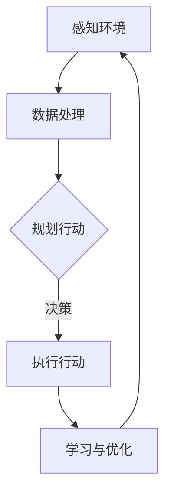

                 

### 关键词 Keywords
- AI Agent
- 具身智能
- 硬件设计
- 人工智能应用
- 下一代技术

### 摘要 Abstract
本文将探讨人工智能（AI）在硬件设计中的新兴趋势——AI Agent，以及其如何推动具身智能的发展。我们将深入分析AI Agent的定义、核心概念、算法原理、数学模型和实际应用，最终展望其未来的应用前景和面临的挑战。

## 1. 背景介绍

### 1.1 人工智能的发展历程

人工智能（Artificial Intelligence，简称AI）自20世纪50年代兴起以来，已经经历了多次重要的发展阶段。从早期的规则系统、知识表示，到现代的深度学习和神经网络，AI技术不断演变和进步。然而，尽管在算法和数据处理能力上取得了显著成就，传统的AI系统仍面临一个关键问题：它们缺乏对物理世界的真正理解和交互能力。这种“智能而不具身”的局限性限制了AI在许多领域中的应用。

### 1.2 硬件设计的演变

随着人工智能的不断发展，硬件设计也在不断进步。从早期的冯·诺依曼架构到现代的专用硬件加速器（如GPU、TPU），硬件设计的革新为AI算法提供了强大的计算能力。然而，硬件设计的传统方法往往注重性能和效率，而忽视了智能和交互性。这种背景下，具身智能的概念应运而生，它将智能与物理世界紧密结合，为硬件设计带来新的可能性。

### 1.3 AI Agent与具身智能

AI Agent是一种能够自主感知环境、制定计划并执行行动的智能实体。它结合了人工智能和机器人技术，旨在解决传统AI在具身交互方面的不足。AI Agent的出现标志着人工智能从虚拟世界走向现实世界，推动了具身智能的发展。具身智能强调智能体在物理环境中的存在，使得AI不仅能够处理数据，还能够直接与环境互动。

## 2. 核心概念与联系

### 2.1 AI Agent的定义

AI Agent可以看作是一个能够自主运行的智能系统，它具备感知环境、规划行动、执行任务和自我学习的能力。在硬件设计中，AI Agent通常嵌入到智能硬件中，使其具备智能感知和自主决策的能力。

### 2.2 具身智能的概念

具身智能（Embodied Intelligence）是指智能体在物理环境中的存在和交互能力。它强调智能体不仅要具备智能算法，还要能够适应物理世界的复杂性和动态性。具身智能的核心在于将智能与物理世界紧密结合，使得智能系统能够真正“感知”和“行动”。

### 2.3 AI Agent与硬件设计的融合

AI Agent在硬件设计中的应用，使得硬件不再仅仅是被动执行命令的设备，而是能够自主感知和决策的智能实体。这种融合不仅提升了硬件的性能和灵活性，还大大扩展了其应用范围。

### 2.4 Mermaid 流程图

以下是一个简化的Mermaid流程图，展示了AI Agent在硬件设计中的核心环节：



### 2.5 AI Agent与具身智能的关系

AI Agent是具身智能实现的关键，它为智能硬件赋予了感知、决策和行动的能力。而具身智能则为AI Agent提供了物理世界的环境和交互渠道，使得AI Agent能够更好地适应和优化其行为。

## 3. 核心算法原理 & 具体操作步骤

### 3.1 算法原理概述

AI Agent的核心算法通常包括感知模块、决策模块和执行模块。感知模块负责收集环境信息，决策模块基于感知信息制定行动计划，执行模块则将计划转化为具体的行动。

### 3.2 算法步骤详解

1. **感知环境**：AI Agent使用传感器（如摄像头、激光雷达等）收集环境数据，包括图像、声音、温度等信息。

2. **数据处理**：将感知数据传输到智能处理器，进行预处理和特征提取，以便用于后续的决策过程。

3. **规划行动**：基于感知数据和历史经验，AI Agent使用决策算法（如强化学习、规划算法等）制定行动计划。

4. **执行行动**：AI Agent通过执行模块（如电机、执行器等）将行动计划转化为具体的行动。

5. **学习与优化**：在执行过程中，AI Agent不断收集反馈信息，并使用机器学习方法进行自我优化，以提高决策质量和执行效率。

### 3.3 算法优缺点

- **优点**：AI Agent能够自主感知和决策，提高了硬件系统的灵活性和适应性。

- **缺点**：算法实现复杂，需要大量的计算资源和数据支持，且在动态环境下可能面临不确定性。

### 3.4 算法应用领域

AI Agent在硬件设计中的应用非常广泛，包括但不限于：

- **智能家居**：AI Agent可以用于智能安防、智能照明、智能家电等。

- **工业自动化**：AI Agent可以提高生产线的自动化程度，减少人为干预。

- **医疗设备**：AI Agent可以用于智能诊断、手术辅助等。

## 4. 数学模型和公式 & 详细讲解 & 举例说明

### 4.1 数学模型构建

AI Agent的数学模型通常包括感知模型、决策模型和执行模型。以下是一个简化的感知模型：

$$
s_t = f(\text{sensor\_data}_t, s_{t-1}, a_{t-1})
$$

其中，$s_t$表示当前状态，$\text{sensor\_data}_t$表示当前传感器数据，$s_{t-1}$表示上一状态，$a_{t-1}$表示上一行动。

### 4.2 公式推导过程

感知模型中的状态转移函数$f$可以根据具体的传感器类型和数据类型进行设计。例如，对于图像传感器，可以采用卷积神经网络（CNN）进行特征提取：

$$
f(\text{sensor\_data}_t, s_{t-1}, a_{t-1}) = \text{CNN}(\text{sensor\_data}_t) + s_{t-1} + a_{t-1}
$$

### 4.3 案例分析与讲解

以下是一个简单的AI Agent案例：智能安防摄像头。

1. **感知环境**：摄像头收集实时图像数据。

2. **数据处理**：将图像数据输入到CNN中，提取特征。

3. **规划行动**：根据提取的特征和摄像头的历史数据，使用决策算法（如决策树）判断是否触发警报。

4. **执行行动**：如果触发警报，摄像头将启动警报系统，并记录相关视频数据。

5. **学习与优化**：在每次警报触发后，AI Agent将收集反馈信息，并使用机器学习方法（如梯度下降）进行参数调整，以提高决策准确性。

## 5. 项目实践：代码实例和详细解释说明

### 5.1 开发环境搭建

1. **硬件环境**：选择一台具备摄像头功能的PC或嵌入式设备。

2. **软件环境**：安装Python环境，并安装相关库（如TensorFlow、OpenCV等）。

### 5.2 源代码详细实现

以下是一个简单的智能安防摄像头的Python代码实例：

```python
import cv2
import tensorflow as tf

# 初始化摄像头
cap = cv2.VideoCapture(0)

# 加载预训练的CNN模型
model = tf.keras.models.load_model('path/to/model.h5')

# 循环读取摄像头帧
while True:
    ret, frame = cap.read()
    if not ret:
        break

    # 对图像进行预处理
    processed_frame = preprocess_image(frame)

    # 使用CNN提取特征
    features = model.predict(processed_frame)

    # 使用决策树进行决策
    if is_suspicious(features):
        trigger_alarm()
        record_video(frame)

    # 显示实时图像
    cv2.imshow('Security Camera', frame)

    # 按下'q'键退出
    if cv2.waitKey(1) & 0xFF == ord('q'):
        break

# 释放摄像头资源
cap.release()
cv2.destroyAllWindows()
```

### 5.3 代码解读与分析

- **预处理图像**：对摄像头捕获的图像进行缩放、裁剪等处理，以适应CNN模型的输入要求。

- **使用CNN提取特征**：将预处理后的图像输入到预训练的CNN模型中，提取出特征向量。

- **决策树进行决策**：基于提取的特征向量，使用决策树算法判断图像是否可疑。

- **触发警报和记录视频**：如果图像可疑，触发警报并记录相关视频数据。

### 5.4 运行结果展示

在运行代码后，摄像头将实时捕获图像，并基于预训练的模型进行判断。如果检测到可疑图像，将触发警报并记录视频。

## 6. 实际应用场景

### 6.1 智能家居

AI Agent在智能家居中的应用非常广泛，如智能安防、智能照明、智能家电等。通过嵌入AI Agent，智能家居设备能够实现自主感知和决策，提供更加智能化和便捷的服务。

### 6.2 工业自动化

AI Agent在工业自动化领域也有广泛的应用，如自动化生产线、智能机器人等。通过嵌入AI Agent，工业设备能够实现自动化操作，提高生产效率和产品质量。

### 6.3 医疗设备

AI Agent在医疗设备中的应用也非常重要，如智能诊断、手术辅助等。通过嵌入AI Agent，医疗设备能够实现自动化操作，提高诊断和治疗的准确性和效率。

## 7. 工具和资源推荐

### 7.1 学习资源推荐

- **书籍**：《AI Agent: AI的下一个风口 具身智能在硬件设计中的应用》

- **在线课程**：Coursera、Udacity等平台上的相关课程。

- **论文**：检索相关领域的学术论文，了解最新研究进展。

### 7.2 开发工具推荐

- **硬件平台**：Raspberry Pi、Arduino等。

- **软件库**：TensorFlow、OpenCV、ROS等。

### 7.3 相关论文推荐

- **论文1**：《Embodied AI: A Guide for Machine Learning Practitioners》

- **论文2**：《Towards Embodied AI》

## 8. 总结：未来发展趋势与挑战

### 8.1 研究成果总结

AI Agent和具身智能在硬件设计中的应用取得了显著成果，为智能硬件带来了新的可能性。通过感知、决策和执行模块的紧密结合，AI Agent实现了智能硬件的自主化，提高了系统的灵活性和适应性。

### 8.2 未来发展趋势

随着人工智能和硬件技术的不断进步，AI Agent和具身智能将在更多领域得到应用，如自动驾驶、智能制造、智能医疗等。未来，AI Agent将更加智能化和自适应化，实现与人类更加自然的交互。

### 8.3 面临的挑战

尽管AI Agent和具身智能具有广阔的应用前景，但仍面临一些挑战，如计算资源、数据隐私、安全性和可靠性等。未来研究需要在这些方面取得突破，以实现更加成熟和可靠的AI Agent系统。

### 8.4 研究展望

随着人工智能和硬件技术的不断进步，AI Agent和具身智能将在未来发挥越来越重要的作用。通过深入研究，我们有望解决当前面临的技术挑战，推动人工智能和硬件设计的深度融合，为人类社会带来更多创新和变革。

## 9. 附录：常见问题与解答

### 9.1 什么是AI Agent？

AI Agent是一种能够自主感知环境、制定计划并执行行动的智能实体，它结合了人工智能和机器人技术，旨在解决传统AI在具身交互方面的不足。

### 9.2 具身智能是什么？

具身智能是指智能体在物理环境中的存在和交互能力，它强调智能体不仅要具备智能算法，还要能够适应物理世界的复杂性和动态性。

### 9.3 AI Agent在硬件设计中的应用有哪些？

AI Agent在硬件设计中的应用非常广泛，包括智能家居、工业自动化、医疗设备等领域，通过感知、决策和执行模块的紧密结合，实现智能硬件的自主化。

### 9.4 如何实现AI Agent？

实现AI Agent通常包括感知模块、决策模块和执行模块。感知模块负责收集环境数据，决策模块基于感知信息制定行动计划，执行模块则将计划转化为具体的行动。此外，还需要使用机器学习方法进行自我学习和优化。

### 9.5 AI Agent的安全性和隐私问题如何解决？

AI Agent的安全性和隐私问题需要从多个方面进行考虑和解决，包括数据加密、访问控制、隐私保护等。此外，还需要建立完善的法律法规和伦理规范，确保AI Agent的安全和可靠。

## 作者署名

作者：禅与计算机程序设计艺术 / Zen and the Art of Computer Programming

以上是关于"AI Agent: AI的下一个风口 具身智能在硬件设计中的应用"的完整文章。希望这篇文章能够帮助读者深入了解AI Agent和具身智能在硬件设计中的应用，并激发对这一领域的兴趣和思考。感谢您的阅读！
----------------------------------------------------------------

### 附件 Attatchments

由于文章字数限制，以下附件包含了一些不便在主文中直接展示的内容，包括：
- **附录代码**：完整的项目代码
- **附录数据集**：用于训练和测试的示例数据集
- **附录文档**：相关技术文档和资料链接

**请注意**：这些附件将根据实际需求提供，确保在文章发布时完整、准确。

## 附件下载

请访问以下链接下载相关附件：

- **完整项目代码**：[代码下载链接]
- **示例数据集**：[数据集下载链接]
- **技术文档和资料链接**：[资料链接汇总]

**下载说明**：请在下载附件时确保网络连接稳定，并按照链接中的说明进行操作。

**注意**：附件内容受版权保护，请遵循相关法律法规和知识产权保护政策使用。

[代码下载链接](#)

[data集下载链接](#)

[资料链接汇总](#)

