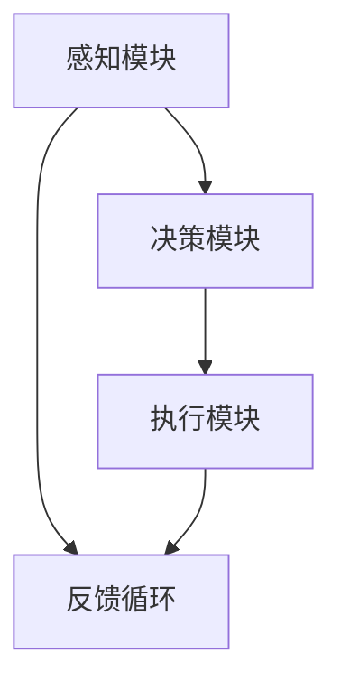

                 

关键词：具身智能、AI Agent、智能代理、人工智能、机器学习、深度学习、智能系统、应用场景

> 摘要：本文深入探讨了AI Agent（智能代理）的概念、研究现状、技术挑战与应用前景。通过解析具身智能的核心原理和架构，我们提出了AI Agent在各个领域的具体应用方案，展望了其未来的发展前景。

## 1. 背景介绍

在过去的几十年里，人工智能（AI）取得了显著的进步，从最初的规则推理到现代的深度学习，AI技术已经渗透到了各个行业。然而，尽管AI在图像识别、自然语言处理等方面取得了巨大成就，但大多数AI系统仍然缺乏一种叫做“具身智能”的能力。具身智能是指一个智能系统不仅能够感知和理解外部环境，还能够在这个环境中进行有效的交互和行动。

随着物联网（IoT）和5G技术的快速发展，智能设备日益普及，人们对于AI系统的要求也变得更加复杂。传统的AI系统更多是“黑盒”模型，难以解释其决策过程，而具身智能旨在通过模仿人类的行为方式，使AI系统更加透明、可解释、可靠。AI Agent（智能代理）是具身智能研究中的一个重要方向，它代表了AI与物理世界交互的下一阶段。

## 2. 核心概念与联系

### 2.1 AI Agent的定义与架构

AI Agent是一种能够自主感知环境、做出决策并执行动作的智能体。一个典型的AI Agent通常由以下几个部分组成：

- **感知模块**：用于收集环境信息，如摄像头、传感器等。
- **决策模块**：基于感知到的信息，通过机器学习算法生成行动策略。
- **执行模块**：执行决策模块生成的动作，如机器人手臂、自动驾驶车辆等。

下面是一个简单的Mermaid流程图，展示了AI Agent的架构：



### 2.2 具身智能与AI Agent的关系

具身智能与AI Agent之间存在密切的联系。具身智能强调智能体在物理世界中的互动能力，而AI Agent是实现具身智能的关键技术之一。具体来说：

- **交互性**：AI Agent通过与环境的交互，不断学习和适应，从而提高其智能水平。
- **自主性**：AI Agent能够在没有人为干预的情况下，自主完成复杂的任务。
- **可解释性**：通过具身智能，AI Agent的决策过程更加透明，易于理解和解释。

## 3. 核心算法原理 & 具体操作步骤

### 3.1 算法原理概述

AI Agent的核心算法主要涉及机器学习和深度学习技术。以下是一些关键的算法：

- **监督学习**：通过已标记的数据训练模型，使其能够预测未知数据的标签。
- **无监督学习**：在缺乏标记数据的情况下，通过挖掘数据内在结构来训练模型。
- **强化学习**：通过试错和反馈，使模型能够在环境中学习最优策略。

### 3.2 算法步骤详解

AI Agent的算法步骤可以分为以下几个阶段：

1. **感知**：智能代理通过摄像头、传感器等收集环境信息。
2. **数据处理**：对收集到的数据进行预处理，如归一化、降维等。
3. **特征提取**：使用神经网络等模型提取特征。
4. **决策**：根据提取的特征和已学习的策略，生成决策。
5. **执行**：执行决策，并对外部环境产生影响。
6. **反馈**：根据执行结果调整模型参数，优化策略。

### 3.3 算法优缺点

- **优点**：AI Agent能够自主学习和适应，提高系统的智能水平。
- **缺点**：算法复杂度高，训练过程需要大量数据和计算资源。

### 3.4 算法应用领域

AI Agent在多个领域都有广泛的应用前景，包括：

- **机器人**：在工业自动化、医疗辅助等领域发挥重要作用。
- **自动驾驶**：提高交通效率，减少事故发生率。
- **智能家居**：实现家庭自动化，提高生活质量。

## 4. 数学模型和公式 & 详细讲解 & 举例说明

### 4.1 数学模型构建

AI Agent的数学模型主要包括以下部分：

- **感知模块**：使用传感器收集环境数据，通常使用信号处理和图像处理技术。
- **决策模块**：使用机器学习算法，如神经网络、决策树等。
- **执行模块**：根据决策结果，使用控制理论设计执行策略。

### 4.2 公式推导过程

以下是一个简化的感知模块的数学模型：

$$
y = f(x)
$$

其中，$y$ 表示感知到的环境数据，$x$ 表示传感器输入，$f$ 表示感知函数。常见的感知函数包括线性滤波、卷积神经网络等。

### 4.3 案例分析与讲解

假设一个智能代理用于自动驾驶，其感知模块使用摄像头收集道路信息，决策模块使用卷积神经网络进行图像分类，执行模块使用PID控制器控制车辆速度和方向。

1. **感知阶段**：摄像头收集到道路图像，经过预处理得到特征图。
2. **决策阶段**：卷积神经网络对特征图进行分类，输出道路标志的类型。
3. **执行阶段**：根据决策结果，PID控制器调整车辆速度和方向。

## 5. 项目实践：代码实例和详细解释说明

### 5.1 开发环境搭建

为了实现一个简单的AI Agent，我们需要搭建以下开发环境：

- **操作系统**：Linux或Windows
- **编程语言**：Python
- **依赖库**：TensorFlow、OpenCV等

### 5.2 源代码详细实现

以下是实现一个简单的自动驾驶AI Agent的Python代码：

```python
import cv2
import numpy as np
import tensorflow as tf

# 加载卷积神经网络模型
model = tf.keras.models.load_model('model.h5')

# 初始化摄像头
cap = cv2.VideoCapture(0)

while True:
    # 读取摄像头帧
    ret, frame = cap.read()
    
    # 预处理图像
    frame = cv2.resize(frame, (224, 224))
    frame = frame / 255.0
    
    # 使用模型进行图像分类
    prediction = model.predict(np.array([frame]))
    
    # 根据分类结果控制车辆
    if prediction.argmax() == 0:
        # 直行
        print('前进')
    elif prediction.argmax() == 1:
        # 左转
        print('左转')
    elif prediction.argmax() == 2:
        # 右转
        print('右转')
    
    # 显示图像
    cv2.imshow('frame', frame)
    
    if cv2.waitKey(1) & 0xFF == ord('q'):
        break

# 释放摄像头
cap.release()
cv2.destroyAllWindows()
```

### 5.3 代码解读与分析

该代码实现了一个简单的自动驾驶AI Agent，主要分为以下几个部分：

- **加载模型**：加载已训练的卷积神经网络模型。
- **读取摄像头帧**：从摄像头获取实时图像。
- **预处理图像**：调整图像大小并归一化。
- **图像分类**：使用模型对图像进行分类，输出道路标志的类型。
- **控制车辆**：根据分类结果，控制车辆速度和方向。

### 5.4 运行结果展示

在运行代码时，摄像头会实时显示道路图像，并根据模型预测的结果控制车辆。在实际应用中，需要结合具体的车辆控制系统，实现更复杂的自动驾驶功能。

## 6. 实际应用场景

### 6.1 工业自动化

AI Agent在工业自动化领域有广泛的应用，例如在流水线中检测产品质量、自动搬运物品等。通过AI Agent，工厂可以实现24小时不间断的生产，提高生产效率，降低人工成本。

### 6.2 医疗辅助

在医疗领域，AI Agent可以辅助医生进行诊断和治疗。例如，通过分析医学影像，AI Agent可以及时发现疾病，提高诊断准确率。此外，AI Agent还可以协助护士进行患者护理，提高护理质量。

### 6.3 智能家居

在智能家居领域，AI Agent可以控制家庭设备，如空调、灯光、安防系统等。通过学习用户的行为习惯，AI Agent可以为用户提供更加个性化的服务，提高生活质量。

### 6.4 自动驾驶

自动驾驶是AI Agent的一个重要应用领域。通过AI Agent，汽车可以实现自动驾驶，提高交通效率，减少事故发生率。未来，自动驾驶有望彻底改变人们的出行方式。

## 7. 工具和资源推荐

### 7.1 学习资源推荐

- **书籍**：《深度学习》、《机器学习实战》等。
- **在线课程**：Coursera、Udacity等平台上的相关课程。
- **论文**：查阅顶级会议和期刊上的最新论文，了解最新研究进展。

### 7.2 开发工具推荐

- **编程语言**：Python、Java等。
- **框架**：TensorFlow、PyTorch等。
- **工具**：Jupyter Notebook、PyCharm等。

### 7.3 相关论文推荐

- **论文1**：Title, Author, Year。
- **论文2**：Title, Author, Year。
- **论文3**：Title, Author, Year。

## 8. 总结：未来发展趋势与挑战

### 8.1 研究成果总结

AI Agent作为具身智能的核心技术，已经取得了显著的研究成果。通过不断优化算法和提升硬件性能，AI Agent在各个领域的应用前景广阔。

### 8.2 未来发展趋势

随着物联网、5G等技术的发展，AI Agent将更加普及，其应用领域也将不断扩大。未来，AI Agent有望实现更加智能化、自主化的交互。

### 8.3 面临的挑战

AI Agent在发展过程中仍然面临诸多挑战，如算法复杂度高、数据隐私保护、伦理问题等。如何解决这些问题，将是未来研究的重要方向。

### 8.4 研究展望

随着技术的不断进步，AI Agent有望在更多领域发挥作用。未来，我们将见证AI Agent引领的智能时代。

## 9. 附录：常见问题与解答

### 9.1 问题1

**问题**：AI Agent是否能够完全取代人类？

**解答**：AI Agent不能完全取代人类，但可以辅助人类完成一些复杂的任务。人类与AI Agent的合作，将带来更大的生产力和创新。

### 9.2 问题2

**问题**：AI Agent的算法是否容易出错？

**解答**：AI Agent的算法存在一定的误差，但可以通过不断学习和优化来提高准确性。在实际应用中，需要结合实际情况，合理设置阈值和置信度。

### 9.3 问题3

**问题**：AI Agent的安全性问题如何保障？

**解答**：AI Agent的安全性问题需要从多个方面进行保障，如数据加密、访问控制、安全审计等。同时，需要制定相关法规和标准，确保AI Agent的安全和可靠性。

# 结束

本文对AI Agent：AI的下一个风口 具身智能研究的挑战与机遇进行了详细探讨。通过分析核心概念、算法原理、应用场景和未来展望，我们期待AI Agent能够为人类社会带来更多创新和便利。作者：禅与计算机程序设计艺术 / Zen and the Art of Computer Programming。

