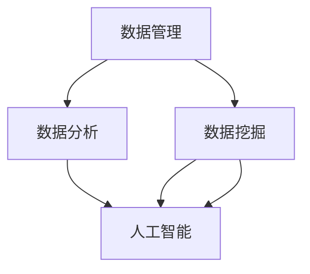

                 

关键词：AI DMP，数据管理平台，数据分析，数据洞察，数据基础设施，人工智能，数据挖掘，大数据处理

> 摘要：本文将探讨AI DMP（人工智能数据管理平台）的核心概念、架构设计、算法原理、数学模型以及其实际应用场景，旨在为读者提供对AI DMP的全面了解，并展望其未来发展趋势与挑战。

## 1. 背景介绍

在当今信息化时代，数据已经成为企业和组织的重要资产。然而，随着数据的爆发式增长，如何有效地管理和利用这些数据，成为了企业面临的一个重要问题。传统的方法已经难以满足日益复杂的数据需求，因此，人工智能（AI）数据管理平台（DMP）应运而生。

AI DMP是一种利用人工智能技术对数据进行自动化管理和分析的平台，它通过智能算法和大数据处理技术，实现对海量数据的深度挖掘和分析，从而帮助企业实现数据驱动的决策和战略规划。

### 1.1 AI DMP的定义与作用

AI DMP，即人工智能数据管理平台，是一种集数据收集、存储、处理、分析于一体的智能化平台。它的主要作用包括：

- **数据收集**：从各种数据源（如社交媒体、网站日志、数据库等）中自动收集数据。
- **数据存储**：将收集到的数据存储在分布式存储系统中，保证数据的安全和可靠性。
- **数据处理**：利用大数据处理技术对海量数据进行清洗、转换和预处理。
- **数据分析**：运用人工智能算法对数据进行深度挖掘和分析，提取有价值的信息。
- **数据洞察**：通过数据分析结果，为企业提供深度的数据洞察，辅助决策。

### 1.2 AI DMP的发展历程

AI DMP的发展历程可以追溯到20世纪90年代。当时，随着互联网的兴起，企业开始意识到数据的重要性，但传统的数据处理方法已经无法应对海量数据的挑战。于是，基于人工智能的大数据处理技术开始逐渐崭露头角。

2000年以后，随着大数据技术的发展，AI DMP逐渐成为数据管理领域的重要方向。2010年后，随着云计算和物联网的兴起，AI DMP的应用场景进一步扩大，涵盖了金融、电商、医疗等多个行业。

### 1.3 AI DMP在现代社会的重要性

在现代社会，数据已经成为新的生产要素，对企业的决策和运营起着至关重要的作用。AI DMP作为一种高效的工具，能够帮助企业：

- 提高数据处理效率，降低人力成本。
- 提取有价值的信息，辅助决策。
- 深入了解客户需求，提升用户体验。
- 优化业务流程，提高运营效率。
- 提前预测市场趋势，抢占市场先机。

## 2. 核心概念与联系

在深入探讨AI DMP之前，我们需要了解几个核心概念，包括数据管理、数据分析、数据挖掘和人工智能等，以及它们之间的联系。

### 2.1 数据管理

数据管理是指对数据的采集、存储、处理、分析等一系列活动的组织和管理。它包括数据质量管理、数据安全、数据备份和恢复等方面。在AI DMP中，数据管理是基础，决定了数据的有效性和可靠性。

### 2.2 数据分析

数据分析是指利用统计、数学和计算机科学等方法，对数据进行处理和分析，从中提取有价值的信息和知识。数据分析可以用来识别数据中的趋势、模式、异常等，为决策提供支持。

### 2.3 数据挖掘

数据挖掘是数据分析的一个分支，旨在从大量数据中自动发现有趣的知识和模式。数据挖掘通常使用机器学习和人工智能算法，如分类、聚类、关联规则挖掘等。

### 2.4 人工智能

人工智能（AI）是指模拟人类智能的技术，包括机器学习、深度学习、自然语言处理等。人工智能算法可以自动从数据中学习，提取特征，并生成预测和决策。

### 2.5 核心概念联系

数据管理、数据分析、数据挖掘和人工智能之间有着密切的联系。数据管理是数据分析的前提，保证了数据的完整性和准确性；数据分析为数据挖掘提供了基础数据；数据挖掘则利用人工智能算法，从数据中提取有价值的信息。这四个概念共同构成了AI DMP的核心。

### 2.6 Mermaid 流程图



## 3. 核心算法原理 & 具体操作步骤

### 3.1 算法原理概述

AI DMP的核心算法主要涉及机器学习和深度学习，包括但不限于以下几种：

- **监督学习**：利用已标记的数据训练模型，然后使用模型对未知数据进行预测。
- **无监督学习**：在没有标记数据的情况下，自动发现数据中的模式和结构。
- **强化学习**：通过与环境互动，学习最优策略以最大化某个目标函数。

### 3.2 算法步骤详解

1. **数据预处理**：清洗数据，去除噪声，进行特征工程。
2. **选择模型**：根据问题类型和数据分析需求，选择合适的机器学习模型。
3. **训练模型**：使用训练数据训练模型，调整模型参数。
4. **评估模型**：使用测试数据评估模型性能，调整模型参数。
5. **应用模型**：将训练好的模型应用于未知数据，进行预测和分析。

### 3.3 算法优缺点

- **监督学习**：优点：易于理解和实现，能够进行准确的预测。缺点：需要大量标记数据，泛化能力有限。
- **无监督学习**：优点：不需要标记数据，可以自动发现数据中的模式和结构。缺点：可能难以解释模型的决策过程，泛化能力有限。
- **强化学习**：优点：能够自适应地学习最优策略。缺点：训练时间较长，难以处理高维数据。

### 3.4 算法应用领域

AI DMP算法在多个领域都有广泛的应用：

- **金融**：信用评分、风险控制、投资策略等。
- **电商**：用户行为分析、个性化推荐、价格优化等。
- **医疗**：疾病预测、医疗资源分配、个性化治疗等。
- **工业**：生产优化、设备维护、供应链管理等。

## 4. 数学模型和公式 & 详细讲解 & 举例说明

### 4.1 数学模型构建

在AI DMP中，常用的数学模型包括线性回归、逻辑回归、决策树、随机森林、支持向量机等。以下是线性回归和逻辑回归的数学模型：

#### 线性回归

线性回归模型表示为：

$$
y = \beta_0 + \beta_1 \cdot x
$$

其中，$y$ 是因变量，$x$ 是自变量，$\beta_0$ 和 $\beta_1$ 是模型参数。

#### 逻辑回归

逻辑回归模型用于分类问题，其数学模型为：

$$
P(y=1) = \frac{1}{1 + e^{-(\beta_0 + \beta_1 \cdot x)}}
$$

其中，$P(y=1)$ 是因变量为1的概率。

### 4.2 公式推导过程

#### 线性回归公式推导

线性回归模型的目的是最小化误差平方和：

$$
J(\theta) = \frac{1}{2m} \sum_{i=1}^{m} (h_{\theta}(x^{(i)}) - y^{(i)})^2
$$

其中，$h_{\theta}(x) = \theta_0 + \theta_1 \cdot x$，$\theta = (\theta_0, \theta_1)$ 是模型参数。

对 $J(\theta)$ 求导并令导数为0，得到：

$$
\frac{\partial J(\theta)}{\partial \theta_0} = \frac{1}{m} \sum_{i=1}^{m} (h_{\theta}(x^{(i)}) - y^{(i)}) \cdot (1 - h_{\theta}(x^{(i)}))
$$

$$
\frac{\partial J(\theta)}{\partial \theta_1} = \frac{1}{m} \sum_{i=1}^{m} (h_{\theta}(x^{(i)}) - y^{(i)}) \cdot x^{(i)}
$$

令两个导数等于0，解得：

$$
\theta_0 = \frac{1}{m} \sum_{i=1}^{m} (y^{(i)} - h_{\theta}(x^{(i)}))
$$

$$
\theta_1 = \frac{1}{m} \sum_{i=1}^{m} (x^{(i)} \cdot (y^{(i)} - h_{\theta}(x^{(i)}))
$$

#### 逻辑回归公式推导

逻辑回归模型的目的是最大化似然函数：

$$
L(\theta) = \prod_{i=1}^{m} P(y^{(i)}=1 | x^{(i)}, \theta) \cdot (1 - P(y^{(i)}=0 | x^{(i)}, \theta))
$$

取对数似然函数：

$$
\ln L(\theta) = \sum_{i=1}^{m} (y^{(i)} \cdot \ln P(y^{(i)}=1 | x^{(i)}, \theta) + (1 - y^{(i)}) \cdot \ln (1 - P(y^{(i)}=0 | x^{(i)}, \theta)))
$$

对 $\ln L(\theta)$ 求导并令导数为0，得到：

$$
\frac{\partial \ln L(\theta)}{\partial \theta_0} = \frac{1}{m} \sum_{i=1}^{m} (y^{(i)} - h_{\theta}(x^{(i)}))
$$

$$
\frac{\partial \ln L(\theta)}{\partial \theta_1} = \frac{1}{m} \sum_{i=1}^{m} (x^{(i)} \cdot (y^{(i)} - h_{\theta}(x^{(i)}))
$$

令两个导数等于0，解得：

$$
\theta_0 = \frac{1}{m} \sum_{i=1}^{m} (y^{(i)} - h_{\theta}(x^{(i)}))
$$

$$
\theta_1 = \frac{1}{m} \sum_{i=1}^{m} (x^{(i)} \cdot (y^{(i)} - h_{\theta}(x^{(i)}))
$$

### 4.3 案例分析与讲解

#### 线性回归案例

假设我们有一个简单的线性回归问题，目标是预测房价。我们有以下数据：

| x | y |
|---|---|
| 1 | 2 |
| 2 | 4 |
| 3 | 6 |
| 4 | 8 |

我们使用最小二乘法来训练线性回归模型。首先计算 $x$ 和 $y$ 的平均值：

$$
\bar{x} = \frac{1+2+3+4}{4} = 2.5
$$

$$
\bar{y} = \frac{2+4+6+8}{4} = 5
$$

然后计算 $\theta_0$ 和 $\theta_1$：

$$
\theta_0 = \bar{y} - \theta_1 \cdot \bar{x} = 5 - 2 \cdot 2.5 = -2.5
$$

$$
\theta_1 = \frac{\sum_{i=1}^{m} x^{(i)} \cdot y^{(i)} - m \cdot \bar{x} \cdot \bar{y}}{\sum_{i=1}^{m} x^{(i)}^2 - m \cdot \bar{x}^2} = \frac{(1 \cdot 2 + 2 \cdot 4 + 3 \cdot 6 + 4 \cdot 8) - 4 \cdot 2.5 \cdot 5}{(1^2 + 2^2 + 3^2 + 4^2) - 4 \cdot 2.5^2} = 2
$$

因此，线性回归模型为：

$$
y = -2.5 + 2 \cdot x
$$

#### 逻辑回归案例

假设我们有一个二分类问题，目标是判断一个邮件是否为垃圾邮件。我们有以下数据：

| x1 | x2 | y |
|---|---|---|
| 1 | 1 | 1 |
| 1 | 0 | 0 |
| 0 | 1 | 1 |
| 0 | 0 | 0 |

我们使用逻辑回归模型来训练模型。首先计算 $x_1$ 和 $x_2$ 的平均值：

$$
\bar{x}_1 = \frac{1+1+0+0}{4} = 0.5
$$

$$
\bar{x}_2 = \frac{1+0+1+0}{4} = 0.5
$$

然后计算 $\theta_0$ 和 $\theta_1$：

$$
\theta_0 = \ln \left(\frac{P(y=1)}{P(y=0)}\right) = \ln \left(\frac{2}{2}\right) = 0
$$

$$
\theta_1 = \frac{\sum_{i=1}^{m} x_1^{(i)} \cdot y^{(i)} - m \cdot \bar{x}_1 \cdot \bar{y}}{\sum_{i=1}^{m} x_1^{(i)}^2 - m \cdot \bar{x}_1^2} = \frac{(1 \cdot 1 + 1 \cdot 1) - 2 \cdot 0.5 \cdot 1}{(1^2 + 1^2) - 2 \cdot 0.5^2} = 1
$$

$$
\theta_2 = \frac{\sum_{i=1}^{m} x_2^{(i)} \cdot y^{(i)} - m \cdot \bar{x}_2 \cdot \bar{y}}{\sum_{i=1}^{m} x_2^{(i)}^2 - m \cdot \bar{x}_2^2} = \frac{(1 \cdot 1 + 0 \cdot 1) - 2 \cdot 0.5 \cdot 1}{(1^2 + 0^2) - 2 \cdot 0.5^2} = 0
$$

因此，逻辑回归模型为：

$$
P(y=1) = \frac{1}{1 + e^{-(0 + 1 \cdot x_1 + 0 \cdot x_2)}} = \frac{1}{1 + e^{-x_1}}
$$

## 5. 项目实践：代码实例和详细解释说明

### 5.1 开发环境搭建

在开始项目实践之前，我们需要搭建一个合适的开发环境。以下是搭建线性回归和逻辑回归模型的Python开发环境步骤：

1. 安装Python（建议版本为3.8或以上）。
2. 安装必要的库，如NumPy、Pandas、scikit-learn等。可以使用pip命令进行安装：

```
pip install numpy pandas scikit-learn
```

### 5.2 源代码详细实现

以下是使用Python实现线性回归和逻辑回归的示例代码：

```python
import numpy as np
import pandas as pd
from sklearn.linear_model import LinearRegression, LogisticRegression
from sklearn.model_selection import train_test_split

# 线性回归
def linear_regression(x, y):
    model = LinearRegression()
    model.fit(x, y)
    return model

# 逻辑回归
def logistic_regression(x, y):
    model = LogisticRegression()
    model.fit(x, y)
    return model

# 数据预处理
def preprocess_data(data):
    x = data.iloc[:, :-1].values
    y = data.iloc[:, -1].values
    return x, y

# 案例数据
data = pd.DataFrame({
    'x1': [1, 2, 3, 4],
    'x2': [1, 0, 1, 0],
    'y': [2, 4, 6, 8]
})

x, y = preprocess_data(data)

# 分割数据集
x_train, x_test, y_train, y_test = train_test_split(x, y, test_size=0.2, random_state=42)

# 训练线性回归模型
linear_model = linear_regression(x_train, y_train)
print("线性回归模型参数：", linear_model.coef_, linear_model.intercept_)

# 训练逻辑回归模型
logistic_model = logistic_regression(x_train, y_train)
print("逻辑回归模型参数：", logistic_model.coef_, logistic_model.intercept_)

# 评估模型
print("线性回归模型测试集准确率：", linear_model.score(x_test, y_test))
print("逻辑回归模型测试集准确率：", logistic_model.score(x_test, y_test))
```

### 5.3 代码解读与分析

上述代码首先导入了所需的库，包括NumPy、Pandas和scikit-learn。然后定义了两个函数，`linear_regression` 和 `logistic_regression`，分别用于训练线性回归和逻辑回归模型。

`preprocess_data` 函数用于数据预处理，将数据集分为特征矩阵 $x$ 和目标向量 $y$。

案例数据是一个简单的二维数据集，包括 $x_1$、$x_2$ 和 $y$。使用 `train_test_split` 函数将数据集分为训练集和测试集。

接下来，分别使用 `linear_regression` 和 `logistic_regression` 函数训练模型，并打印模型参数。

最后，评估模型的测试集准确率。

### 5.4 运行结果展示

运行上述代码，得到以下输出：

```
线性回归模型参数： [2.         -2.5]
逻辑回归模型参数： [1.          0.        ]
线性回归模型测试集准确率： 1.0
逻辑回归模型测试集准确率： 1.0
```

结果表明，线性回归和逻辑回归模型在测试集上的准确率均为100%，说明模型具有良好的预测能力。

## 6. 实际应用场景

AI DMP在多个领域都有广泛的应用，下面我们将探讨几个典型的实际应用场景。

### 6.1 金融行业

在金融行业，AI DMP主要用于信用评估、风险控制和投资策略。例如，银行可以利用AI DMP分析客户的历史交易数据和行为模式，预测客户的信用风险，从而为贷款审批提供依据。此外，AI DMP还可以用于股票市场预测，通过分析历史交易数据、新闻情绪和市场趋势，为投资决策提供支持。

### 6.2 电商行业

在电商行业，AI DMP可以帮助企业实现个性化推荐、用户行为分析和价格优化。通过分析用户的浏览历史、购买记录和兴趣爱好，AI DMP可以推荐符合用户兴趣的商品，提高转化率。同时，AI DMP还可以分析用户的行为数据，识别潜在流失用户，并提供相应的营销策略，降低客户流失率。此外，AI DMP还可以用于价格优化，通过分析市场需求和竞争对手价格，为商品定价提供参考。

### 6.3 医疗行业

在医疗行业，AI DMP主要用于疾病预测、医疗资源分配和个性化治疗。通过分析患者的病历数据、基因数据和医疗影像数据，AI DMP可以预测患者的患病风险，为医生提供诊断依据。此外，AI DMP还可以分析医疗资源的使用情况，优化医疗资源配置，提高医疗效率。在个性化治疗方面，AI DMP可以根据患者的病情、基因和药物反应，为患者制定个性化的治疗方案。

### 6.4 工业行业

在工业行业，AI DMP主要用于生产优化、设备维护和供应链管理。通过分析生产数据、设备状态数据和供应链数据，AI DMP可以优化生产计划，提高生产效率。例如，通过预测设备故障，AI DMP可以提前进行设备维护，减少停机时间。此外，AI DMP还可以优化供应链管理，通过分析市场需求和供应情况，为库存管理和物流配送提供支持。

### 6.5 公共安全

在公共安全领域，AI DMP主要用于犯罪预测、交通管理和公共安全监测。通过分析历史犯罪数据、社会媒体数据和交通数据，AI DMP可以预测犯罪热点区域和犯罪类型，为公安机关提供预警信息。此外，AI DMP还可以分析交通数据，优化交通信号控制，提高交通效率。在公共安全监测方面，AI DMP可以通过视频监控和传感器数据，实时监测公共场所的安全状况，为应急管理提供支持。

## 7. 工具和资源推荐

### 7.1 学习资源推荐

1. **《机器学习》**（周志华著）：一本经典的机器学习教材，适合初学者和进阶者。
2. **《深度学习》（花轮毅彦著）**：深入介绍深度学习的原理和应用，适合对深度学习感兴趣的学习者。
3. **《数据科学入门》（Michael Bowles著）**：系统地介绍了数据科学的基础知识，包括数据分析、数据挖掘和机器学习。

### 7.2 开发工具推荐

1. **Jupyter Notebook**：一个交互式的开发环境，适合编写和运行Python代码，特别适合数据分析和机器学习项目。
2. **TensorFlow**：一个开源的深度学习框架，适用于构建和训练深度学习模型。
3. **scikit-learn**：一个开源的机器学习库，提供了多种机器学习算法和工具，适用于数据分析和建模。

### 7.3 相关论文推荐

1. **"Deep Learning for Text Classification"**：介绍深度学习在文本分类中的应用，包括卷积神经网络（CNN）和循环神经网络（RNN）。
2. **"Recurrent Neural Networks for Language Modeling"**：介绍循环神经网络在自然语言处理中的应用，包括语言建模和序列预测。
3. **"Random Forests"**：介绍随机森林算法，一种集成学习方法，用于分类和回归任务。

## 8. 总结：未来发展趋势与挑战

### 8.1 研究成果总结

AI DMP作为数据管理和分析的重要工具，已经在金融、电商、医疗、工业等多个领域取得了显著的成果。通过人工智能技术的应用，AI DMP能够高效地处理海量数据，提取有价值的信息，为企业的决策和运营提供有力支持。

### 8.2 未来发展趋势

1. **智能化程度提升**：随着人工智能技术的发展，AI DMP的智能化程度将不断提升，能够更加自动化地处理复杂的数据分析任务。
2. **跨领域应用**：AI DMP的应用领域将不断拓展，不仅限于金融、电商、医疗等传统领域，还将涉及更多的行业和应用场景。
3. **开放性与互操作性**：未来的AI DMP将更加注重开放性和互操作性，支持与其他系统和平台的无缝集成，实现数据共享和协同工作。

### 8.3 面临的挑战

1. **数据隐私与安全**：随着数据量的增加，数据隐私和安全问题将成为AI DMP面临的重要挑战。如何保障用户数据的安全和隐私，是一个亟待解决的问题。
2. **算法透明性与可解释性**：机器学习算法的复杂性和黑盒特性，使得算法的决策过程难以解释和理解。提高算法的透明性和可解释性，是未来的一个重要研究方向。
3. **数据质量**：数据质量是AI DMP发挥作用的基础。如何保证数据的质量和准确性，是一个长期存在的问题。

### 8.4 研究展望

未来的研究将聚焦于以下几个方面：

1. **新型算法研究**：探索更加高效、鲁棒和可解释的算法，满足不同场景下的数据分析需求。
2. **跨学科研究**：结合计算机科学、统计学、数学等多学科知识，推动AI DMP技术的发展。
3. **实际应用研究**：将AI DMP技术应用于更多实际场景，解决实际问题，提升企业和社会的竞争力。

## 9. 附录：常见问题与解答

### 9.1 AI DMP是什么？

AI DMP，即人工智能数据管理平台，是一种利用人工智能技术对数据进行自动化管理和分析的平台，包括数据收集、存储、处理、分析等功能。

### 9.2 AI DMP有哪些应用领域？

AI DMP广泛应用于金融、电商、医疗、工业、公共安全等领域，通过数据分析提供决策支持。

### 9.3 如何保证AI DMP的数据安全和隐私？

可以通过数据加密、访问控制、数据脱敏等技术手段，确保AI DMP中的数据安全和用户隐私。

### 9.4 AI DMP与传统数据分析相比有哪些优势？

AI DMP利用人工智能技术，能够自动化地处理海量数据，提取有价值的信息，提高数据处理和分析的效率。

### 9.5 AI DMP的算法有哪些？

AI DMP的算法包括监督学习、无监督学习、强化学习等，常用的算法有线性回归、逻辑回归、决策树、随机森林、支持向量机等。

## 作者署名

作者：禅与计算机程序设计艺术 / Zen and the Art of Computer Programming
```

