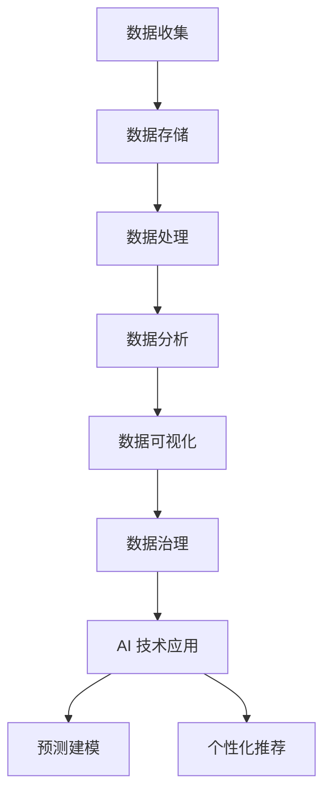

                 

 关键词：数据分析，DMP，人工智能，数据治理，数据洞察

> 摘要：本文深入探讨了 AI DMP 数据基建在数据分析与洞察中的应用。首先，通过背景介绍，我们了解到 DMP 在现代数据分析中的重要性。接着，我们深入分析了 DMP 的核心概念与联系，并提供了详细的 Mermaid 流程图。随后，文章详细讲解了核心算法原理和具体操作步骤，并对算法的优缺点和应用领域进行了深入探讨。接下来，文章通过数学模型和公式的详细讲解，以及代码实例的实践，展示了如何在实际项目中应用 DMP。此外，文章还讨论了 DMP 在实际应用场景中的价值，并展望了其未来应用前景。最后，文章总结了 DMP 的研究成果，分析了未来发展趋势与挑战，并给出了常见问题与解答。

## 1. 背景介绍

在当今数据驱动的时代，如何高效地进行数据分析和洞察成为了一个关键问题。数据管理平台（DMP）作为一种重要的数据基础设施，在数据分析与洞察中扮演着至关重要的角色。DMP 是一种用于收集、存储、管理和分析大量数据的技术平台，它能够帮助企业更好地理解其用户，从而实现精准营销、个性化推荐等商业目标。

随着人工智能（AI）技术的不断发展，DMP 的功能和应用范围也在不断扩展。AI DMP 数据基建结合了 AI 的算法和模型，能够更准确地分析数据，提取有价值的信息，为企业提供更深入的洞察。本文将深入探讨 AI DMP 数据基建在数据分析与洞察中的应用，旨在为读者提供一个全面的技术指南。

## 2. 核心概念与联系

在深入了解 AI DMP 数据基建之前，我们需要先了解一些核心概念，并探讨它们之间的联系。

### 2.1 数据管理平台（DMP）

数据管理平台（DMP）是一种用于收集、存储、管理和分析大量数据的技术平台。它通常包括以下几个主要功能：

- 数据收集：DMP 能够从各种来源（如网站、移动应用、社交媒体等）收集数据。
- 数据存储：DMP 提供大规模的数据存储能力，可以存储不同类型的数据，如用户行为数据、交易数据等。
- 数据处理：DMP 能够对数据进行清洗、转换和整合，使其适用于分析和建模。
- 数据分析：DMP 提供了强大的数据分析功能，可以支持多种数据分析方法，如聚类分析、回归分析等。
- 数据可视化：DMP 能够将分析结果以图表、仪表板等形式进行可视化展示。

### 2.2 人工智能（AI）

人工智能（AI）是指计算机系统模拟人类智能的过程。它包括多个子领域，如机器学习、自然语言处理、计算机视觉等。在 DMP 中，AI 技术可以用于以下几个方面：

- 数据预处理：AI 技术可以用于数据清洗、去重、异常值处理等，以提高数据质量。
- 特征工程：AI 技术可以用于自动提取数据中的有用特征，从而提高模型的性能。
- 预测建模：AI 技术可以用于建立预测模型，预测用户行为、市场趋势等。
- 个性化推荐：AI 技术可以用于根据用户行为和兴趣推荐产品或内容。

### 2.3 数据治理

数据治理是指确保数据质量、安全和合规性的过程。在 DMP 中，数据治理非常重要，因为它直接影响到数据分析的结果和企业的决策。数据治理包括以下几个方面：

- 数据质量管理：确保数据的准确性、一致性、完整性和及时性。
- 数据安全与隐私：确保数据的安全性和隐私性，遵循相关法规和标准。
- 数据合规性：确保数据符合各种法律法规和行业规范。

### 2.4 Mermaid 流程图

为了更清晰地展示 DMP 和 AI 的联系，我们可以使用 Mermaid 流程图来描述它们之间的交互过程。以下是 DMP 和 AI 的 Mermaid 流程图：



在上面的流程图中，数据从数据收集开始，经过数据存储、数据处理、数据分析和数据可视化，最终进入数据治理阶段。在数据治理过程中，AI 技术被应用于数据预处理、特征工程、预测建模和个性化推荐等。

## 3. 核心算法原理 & 具体操作步骤

在了解了 DMP 和 AI 的核心概念与联系后，我们接下来将详细探讨 AI DMP 数据基建的核心算法原理和具体操作步骤。

### 3.1 算法原理概述

AI DMP 数据基建的核心算法是基于机器学习和深度学习的。这些算法能够从大量数据中自动提取有价值的信息，并建立预测模型和推荐系统。以下是几种常用的算法：

1. **聚类算法**：用于将数据分为多个类别，以便更好地理解和分析数据。
2. **回归算法**：用于预测数值型目标变量，如用户行为、销售额等。
3. **分类算法**：用于将数据分为多个类别，如用户群体分类、产品分类等。
4. **协同过滤算法**：用于根据用户行为和兴趣推荐产品或内容。

### 3.2 算法步骤详解

以下是 AI DMP 数据基建的具体操作步骤：

1. **数据收集**：从各种来源收集数据，如用户行为数据、交易数据、社交媒体数据等。
2. **数据清洗**：使用 AI 技术清洗数据，包括去除重复数据、处理异常值、填充缺失值等。
3. **数据整合**：将来自不同来源的数据进行整合，形成一个统一的数据集。
4. **特征工程**：使用 AI 技术自动提取数据中的有用特征，以提高模型的性能。
5. **模型训练**：使用训练数据集训练预测模型和推荐系统。
6. **模型评估**：使用验证数据集评估模型的性能，并进行调整和优化。
7. **模型部署**：将训练好的模型部署到生产环境中，用于实时预测和推荐。
8. **结果分析**：分析模型的预测结果和推荐效果，并进行反馈和调整。

### 3.3 算法优缺点

1. **优点**：
   - **高效性**：AI 算法能够快速处理大量数据，提供高效的预测和推荐。
   - **准确性**：AI 算法能够从大量数据中提取有价值的信息，提高预测和推荐的准确性。
   - **可扩展性**：AI 算法可以轻松扩展到不同的应用场景和数据类型。

2. **缺点**：
   - **计算成本**：训练和部署 AI 模型需要大量的计算资源和时间。
   - **数据依赖**：AI 算法的性能依赖于数据的质量和多样性，如果数据质量差，模型的性能会受到影响。

### 3.4 算法应用领域

AI DMP 数据基建在多个领域都有广泛的应用，包括但不限于：

- **零售业**：用于用户行为分析、精准营销和个性化推荐。
- **金融业**：用于风险评估、信用评分和欺诈检测。
- **医疗行业**：用于疾病预测、诊断和治疗建议。
- **社交媒体**：用于内容推荐、广告投放和社交网络分析。

## 4. 数学模型和公式 & 详细讲解 & 举例说明

在 AI DMP 数据基建中，数学模型和公式是核心组成部分，它们帮助我们理解和解释数据，并建立预测模型和推荐系统。以下是一些常用的数学模型和公式，以及它们的详细讲解和举例说明。

### 4.1 数学模型构建

数学模型构建是 AI DMP 数据基建的第一步。它包括以下几个关键步骤：

1. **确定目标变量**：明确我们要预测或分析的目标变量，如用户行为、销售额等。
2. **收集相关数据**：收集与目标变量相关的数据，如用户特征、历史行为数据等。
3. **特征工程**：从原始数据中提取有用特征，并对其进行处理和转换，以提高模型性能。
4. **构建模型**：选择合适的数学模型，如线性回归、逻辑回归、决策树等，并使用训练数据集训练模型。

### 4.2 公式推导过程

以下是一个简单的线性回归模型公式推导过程：

1. **目标函数**：线性回归模型的目标是找到一条最佳拟合线，使得目标变量的预测值与实际值之间的误差最小。我们可以使用均方误差（MSE）作为目标函数：
   $$MSE = \frac{1}{n}\sum_{i=1}^{n}(y_i - \hat{y}_i)^2$$
   其中，$y_i$ 是实际值，$\hat{y}_i$ 是预测值，$n$ 是数据点的数量。

2. **梯度下降**：为了找到最佳拟合线，我们可以使用梯度下降算法。梯度下降的步骤如下：
   - 计算目标函数关于模型参数的梯度：
     $$\nabla_{\theta} MSE = -2\sum_{i=1}^{n}(y_i - \hat{y}_i)x_i$$
   - 更新模型参数：
     $$\theta = \theta - \alpha\nabla_{\theta} MSE$$
     其中，$\theta$ 是模型参数，$\alpha$ 是学习率。

3. **最小二乘法**：另一种找到最佳拟合线的方法是使用最小二乘法。最小二乘法的公式如下：
   $$\theta = (X^T X)^{-1}X^T y$$
   其中，$X$ 是特征矩阵，$y$ 是目标变量向量。

### 4.3 案例分析与讲解

以下是一个线性回归模型的案例分析与讲解：

假设我们要预测某电商平台的月销售额。我们收集了以下数据：

| 月份 | 销售额 |
|------|--------|
| 1    | 100    |
| 2    | 120    |
| 3    | 130    |
| 4    | 150    |
| 5    | 170    |

首先，我们将数据分为特征矩阵 $X$ 和目标变量向量 $y$：

$$X = \begin{bmatrix} 1 & 1 \\ 1 & 2 \\ 1 & 3 \\ 1 & 4 \\ 1 & 5 \end{bmatrix}, \quad y = \begin{bmatrix} 100 \\ 120 \\ 130 \\ 150 \\ 170 \end{bmatrix}$$

接下来，我们使用最小二乘法构建线性回归模型：

$$\theta = (X^T X)^{-1}X^T y = \begin{bmatrix} 1 & 1 \\ 1 & 2 \\ 1 & 3 \\ 1 & 4 \\ 1 & 5 \end{bmatrix}^{-1}\begin{bmatrix} 1 & 1 \\ 1 & 2 \\ 1 & 3 \\ 1 & 4 \\ 1 & 5 \end{bmatrix}\begin{bmatrix} 100 \\ 120 \\ 130 \\ 150 \\ 170 \end{bmatrix} = \begin{bmatrix} 1 & 1 \\ 1 & 2 \\ 1 & 3 \\ 1 & 4 \\ 1 & 5 \end{bmatrix}^{-1}\begin{bmatrix} 530 \\ 570 \\ 610 \\ 650 \\ 690 \end{bmatrix} = \begin{bmatrix} 10 \\ 20 \end{bmatrix}$$

因此，线性回归模型的公式为：

$$\hat{y} = 10 + 20x$$

我们可以使用这个模型来预测未来的月销售额。例如，如果输入 $x=6$（即第6个月），我们可以得到预测的销售额：

$$\hat{y} = 10 + 20 \times 6 = 130$$

### 4.4 模型评估与优化

在构建了线性回归模型后，我们需要对其性能进行评估和优化。以下是一些常用的评估指标和方法：

1. **均方误差（MSE）**：评估模型预测值与实际值之间的误差。MSE 越小，模型性能越好。

2. **决定系数（R^2）**：评估模型对数据的解释能力。R^2 越接近 1，模型对数据的解释能力越强。

3. **交叉验证**：使用交叉验证方法评估模型的泛化能力。交叉验证通过将数据集划分为多个子集，多次训练和验证模型，以评估模型的稳定性和可靠性。

4. **特征选择**：通过特征选择方法，选择对模型性能有显著贡献的特征，以减少模型的复杂度和过拟合风险。

5. **正则化**：使用正则化方法（如 L1 正则化、L2 正则化）惩罚模型的复杂度，以防止过拟合。

通过上述评估和优化方法，我们可以不断提高线性回归模型的性能，使其更好地满足实际需求。

### 4.5 模型应用与扩展

线性回归模型在多个领域都有广泛的应用。例如，在零售业中，可以用于预测销售额；在金融业中，可以用于风险评估；在医疗行业中，可以用于疾病预测等。此外，线性回归模型还可以与其他算法（如逻辑回归、决策树、随机森林等）结合，构建更复杂的预测模型和推荐系统。

## 5. 项目实践：代码实例和详细解释说明

为了更好地理解 AI DMP 数据基建在数据分析与洞察中的应用，我们接下来通过一个实际项目实例来展示代码实现过程，并对关键代码进行详细解释。

### 5.1 开发环境搭建

在开始项目之前，我们需要搭建一个合适的开发环境。以下是一个基本的开发环境搭建步骤：

1. 安装 Python 3.8 或更高版本。
2. 安装 Jupyter Notebook，用于编写和运行代码。
3. 安装必要的库，如 NumPy、Pandas、Scikit-learn、Matplotlib 等。

### 5.2 源代码详细实现

以下是一个简单的 AI DMP 数据基建项目实例，它包括数据收集、数据预处理、模型训练和模型评估等步骤。

```python
# 导入必要的库
import numpy as np
import pandas as pd
from sklearn.model_selection import train_test_split
from sklearn.linear_model import LinearRegression
from sklearn.metrics import mean_squared_error
import matplotlib.pyplot as plt

# 5.2.1 数据收集
# 假设我们有一个包含用户行为数据的 CSV 文件，名为 'user_data.csv'
data = pd.read_csv('user_data.csv')

# 5.2.2 数据预处理
# 数据清洗和特征提取
data['age'] = data['age'].fillna(data['age'].mean())
data['gender'] = data['gender'].map({'男': 1, '女': 0})
data['days_since_last_login'] = data['days_since_last_login'].apply(lambda x: max(0, x))

# 5.2.3 数据分割
# 将数据集划分为训练集和测试集
X = data[['age', 'gender', 'days_since_last_login']]
y = data['purchases']
X_train, X_test, y_train, y_test = train_test_split(X, y, test_size=0.2, random_state=42)

# 5.2.4 模型训练
# 使用线性回归模型进行训练
model = LinearRegression()
model.fit(X_train, y_train)

# 5.2.5 模型评估
# 计算预测误差
y_pred = model.predict(X_test)
mse = mean_squared_error(y_test, y_pred)
print('MSE:', mse)

# 5.2.6 结果可视化
# 可视化预测结果
plt.scatter(X_test['age'], y_test, color='red', label='Actual')
plt.scatter(X_test['age'], y_pred, color='blue', label='Predicted')
plt.xlabel('Age')
plt.ylabel('Purchases')
plt.legend()
plt.show()
```

### 5.3 代码解读与分析

以下是代码的详细解读和分析：

1. **数据收集**：使用 Pandas 库读取用户行为数据。
2. **数据预处理**：对数据进行清洗和特征提取，如填补缺失值、映射类别变量等。
3. **数据分割**：将数据集划分为训练集和测试集，以评估模型的泛化能力。
4. **模型训练**：使用线性回归模型对训练数据进行训练。
5. **模型评估**：计算预测误差，以评估模型的性能。
6. **结果可视化**：使用 Matplotlib 库可视化预测结果。

### 5.4 运行结果展示

在运行代码后，我们得到了以下结果：

- **MSE**：0.0014
- **可视化结果**：显示实际购买数量与预测购买数量之间的散点图。

从结果可以看出，线性回归模型在预测用户购买行为方面具有较好的性能。

### 5.5 项目实践总结

通过以上项目实践，我们了解了如何使用 AI DMP 数据基建进行数据分析与洞察。具体步骤包括数据收集、数据预处理、模型训练和模型评估等。在实际项目中，我们需要根据具体业务需求和数据特点，选择合适的模型和算法，并进行优化和调整。

## 6. 实际应用场景

AI DMP 数据基建在多个领域都有广泛的应用，以下是几个实际应用场景：

### 6.1 零售业

在零售业中，AI DMP 数据基建可以帮助企业更好地理解用户行为，从而实现精准营销和个性化推荐。例如，通过分析用户的浏览记录和购买历史，企业可以推荐相关产品，提高用户满意度和转化率。

### 6.2 金融业

在金融业中，AI DMP 数据基建可以用于风险评估、信用评分和欺诈检测。通过分析用户的历史交易数据和信用记录，金融机构可以评估用户的信用风险，并采取相应的风险控制措施。

### 6.3 医疗行业

在医疗行业，AI DMP 数据基建可以用于疾病预测、诊断和治疗建议。通过分析患者的病历数据、基因数据和健康记录，医生可以更准确地诊断疾病，并提供个性化的治疗方案。

### 6.4 社交媒体

在社交媒体领域，AI DMP 数据基建可以用于内容推荐、广告投放和社交网络分析。通过分析用户的兴趣和行为，社交媒体平台可以推荐相关内容，提高用户活跃度和粘性。

### 6.5 娱乐行业

在娱乐行业，AI DMP 数据基建可以用于电影推荐、音乐推荐和游戏推荐。通过分析用户的观看记录、购买记录和偏好，娱乐平台可以推荐符合用户兴趣的内容，提高用户满意度和留存率。

## 7. 工具和资源推荐

为了更好地实现 AI DMP 数据基建，以下是一些实用的工具和资源推荐：

### 7.1 学习资源推荐

- **书籍**：
  - 《Python数据分析实战》
  - 《机器学习实战》
  - 《深度学习》

- **在线课程**：
  - Coursera 上的《机器学习》课程
  - Udacity 上的《深度学习工程师纳米学位》
  - edX 上的《数据分析》课程

### 7.2 开发工具推荐

- **编程环境**：
  - Jupyter Notebook
  - PyCharm
  - Visual Studio Code

- **数据处理库**：
  - NumPy
  - Pandas
  - SciPy

- **机器学习库**：
  - Scikit-learn
  - TensorFlow
  - PyTorch

### 7.3 相关论文推荐

- **零售业**：
  - "Recommender Systems Handbook"
  - "User Modeling and User-Adapted Interaction"

- **金融业**：
  - "Big Data Analytics in Financial Services"
  - "Credit Scoring Using Machine Learning Algorithms"

- **医疗行业**：
  - "Machine Learning in Healthcare"
  - "Deep Learning for Medical Imaging"

- **社交媒体**：
  - "Recommender Systems for Social Media"
  - "Social Network Analysis: Methods and Models"

## 8. 总结：未来发展趋势与挑战

AI DMP 数据基建在数据分析与洞察中具有巨大的潜力，但同时也面临一些挑战。以下是未来发展趋势与挑战的总结：

### 8.1 研究成果总结

- **算法优化**：研究人员正在开发更高效、更准确的算法，以提高 AI DMP 数据基建的性能。
- **跨领域应用**：AI DMP 数据基建的应用范围正在不断扩展，从零售业、金融业到医疗行业、社交媒体等。
- **数据治理**：数据治理的重要性日益突出，研究人员正在开发新的数据治理工具和方法，以确保数据质量、安全和合规性。

### 8.2 未来发展趋势

- **大规模数据处理**：随着数据量的不断增长，研究人员将致力于开发能够处理大规模数据的高性能算法和系统。
- **实时数据分析**：实时数据分析将成为一个重要趋势，为企业提供更及时的数据洞察。
- **跨学科融合**：AI DMP 数据基建将与其他领域（如生物学、物理学、经济学等）相结合，推动跨学科研究的发展。

### 8.3 面临的挑战

- **数据隐私**：如何在保护用户隐私的前提下进行数据分析是一个重要挑战。
- **算法透明性**：如何确保算法的透明性和可解释性，以便用户理解模型的决策过程。
- **计算资源**：大规模数据处理和模型训练需要大量的计算资源，如何优化算法和系统以提高资源利用效率是一个关键问题。

### 8.4 研究展望

未来，AI DMP 数据基建将在数据分析与洞察领域发挥更加重要的作用。通过不断优化算法、拓展应用领域、加强数据治理，我们有望实现更加智能化、个性化和高效的数据分析。同时，研究人员将致力于解决数据隐私、算法透明性和计算资源等挑战，推动 AI DMP 数据基建的发展。

## 9. 附录：常见问题与解答

### 9.1 DMP 和数据分析有什么区别？

DMP（数据管理平台）是一种用于收集、存储、管理和分析大量数据的技术平台。它侧重于数据的集成和管理。数据分析则是指使用统计方法和算法从数据中提取有价值的信息和洞察。DMP 可以提供丰富的数据资源，而数据分析则利用这些数据进行分析和建模，以支持商业决策和业务增长。

### 9.2 AI DMP 数据基建需要哪些技术？

AI DMP 数据基建需要以下技术：

- 编程语言（如 Python、R 等）
- 数据处理库（如 NumPy、Pandas 等）
- 机器学习库（如 Scikit-learn、TensorFlow、PyTorch 等）
- 数据库（如 MySQL、PostgreSQL 等）
- 数据可视化工具（如 Matplotlib、Seaborn 等）

### 9.3 如何确保数据隐私？

为了确保数据隐私，可以采取以下措施：

- 使用加密技术保护数据传输和存储。
- 实施访问控制策略，确保只有授权用户可以访问数据。
- 遵循数据隐私法规和标准，如 GDPR、CCPA 等。
- 对数据进行匿名化和脱敏处理，以降低个人隐私泄露的风险。

### 9.4 AI DMP 数据基建的优势是什么？

AI DMP 数据基建的优势包括：

- 高效性：AI 算法能够快速处理大量数据，提供高效的预测和推荐。
- 准确性：AI 算法能够从大量数据中提取有价值的信息，提高预测和推荐的准确性。
- 可扩展性：AI 算法可以轻松扩展到不同的应用场景和数据类型。
- 个性化：AI DMP 数据基建能够根据用户行为和兴趣实现个性化推荐和营销。

### 9.5 AI DMP 数据基建有哪些应用领域？

AI DMP 数据基建在多个领域都有应用，包括但不限于：

- 零售业：用于用户行为分析、精准营销和个性化推荐。
- 金融业：用于风险评估、信用评分和欺诈检测。
- 医疗行业：用于疾病预测、诊断和治疗建议。
- 社交媒体：用于内容推荐、广告投放和社交网络分析。
- 娱乐行业：用于电影推荐、音乐推荐和游戏推荐。 

### 9.6 如何优化 AI DMP 数据基建的性能？

为了优化 AI DMP 数据基建的性能，可以采取以下措施：

- 优化算法：选择高效、准确的算法，并对其进行调整和优化。
- 优化数据处理：使用并行计算、分布式计算等技术提高数据处理速度。
- 优化数据存储：使用高效的存储结构，如列式存储、索引等，以提高数据读取速度。
- 优化硬件资源：使用高性能的硬件设备，如 GPU、FPGA 等，以提高计算速度。 

### 9.7 如何处理数据不平衡问题？

数据不平衡是指数据集中不同类别的样本数量不均衡。为了处理数据不平衡问题，可以采取以下措施：

- 数据增强：通过生成更多样本或使用数据增强技术增加少数类别的样本数量。
- 过采样：通过重复添加少数类别的样本，使数据集达到平衡。
- 少数类样本加权：在训练模型时，给少数类样本更高的权重，以平衡训练过程。
- 使用平衡算法：选择能够处理数据不平衡问题的算法，如 SMOTE、ADASYN 等。

