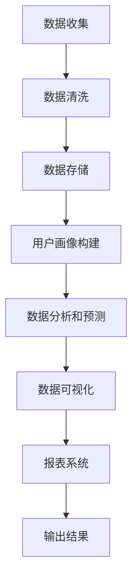

                 

关键词：数据管理平台（DMP）、数据可视化、报表系统、AI技术、数据处理

> 摘要：本文深入探讨了AI驱动的数据管理平台（DMP）在数据可视化和报表系统中的关键作用。通过对核心概念的阐述、算法原理的分析、项目实践实例的讲解，以及未来应用的展望，为读者提供了全面的技术解读和实用指导。

## 1. 背景介绍

在信息爆炸的时代，数据已经成为企业和组织的重要资产。如何有效地管理这些数据，并从中提取有价值的信息，成为当前IT领域的热点问题。数据管理平台（Data Management Platform，简称DMP）应运而生，它通过整合多种数据源，实现数据的集中存储、管理和分析。DMP不仅在广告营销、商业智能等领域有着广泛应用，还在实时监控、预测分析等方面发挥着重要作用。

数据可视化是DMP的重要组成部分，它通过图形、图表等方式将复杂的数据以直观的形式展现出来，帮助用户快速理解和分析数据。而报表系统则是数据可视化的进一步延伸，它能够将分析结果以定制化的格式输出，为决策提供有力支持。

本文将围绕AI驱动的DMP在数据可视化和报表系统中的应用，深入探讨其核心概念、算法原理、数学模型、项目实践以及未来发展趋势。

## 2. 核心概念与联系

### 2.1 数据管理平台（DMP）

数据管理平台（DMP）是一种综合性的数据管理工具，它能够收集、整理、存储和分析来自各种渠道的数据，如用户行为数据、广告点击数据、销售数据等。DMP的核心功能包括：

- **数据收集与整合**：通过API、SDK、日志等方式收集多源数据，并实现数据清洗、去重、转换等操作。
- **用户画像构建**：基于用户行为数据，构建详细的用户画像，实现对用户的精准定位和个性化推荐。
- **数据分析和预测**：利用机器学习和大数据技术，对用户行为进行深入分析，预测用户偏好和需求。
- **数据可视化**：通过图表、仪表盘等手段，将分析结果以直观的方式展现给用户。

### 2.2 数据可视化

数据可视化是一种通过图形、图表等方式将数据信息形象化、可视化的技术。它能够帮助用户快速理解和分析数据，发现数据中的规律和趋势。数据可视化包括以下几个方面：

- **图表类型**：如柱状图、折线图、饼图、散点图等。
- **交互性**：用户可以通过交互操作，如筛选、排序、钻取等，对数据进行实时分析和探索。
- **可视化组件**：如图表控件、地图控件、时间轴控件等。

### 2.3 报表系统

报表系统是一种将数据分析结果以定制化格式输出给用户的应用系统。它能够帮助用户跟踪业务绩效、监控关键指标、制定战略决策等。报表系统主要包括以下几个方面：

- **报表类型**：如实时报表、周期报表、定制报表等。
- **报表模板**：提供多种报表模板，用户可以根据需求进行自定义。
- **报表输出**：支持多种输出格式，如PDF、Excel、HTML等。

### 2.4 Mermaid 流程图

以下是DMP数据可视化与报表系统的Mermaid流程图：



## 3. 核心算法原理 & 具体操作步骤

### 3.1 算法原理概述

DMP在数据可视化和报表系统中的核心算法主要包括以下几个方面：

1. **用户画像构建**：基于用户行为数据，使用聚类算法、协同过滤算法等构建用户画像。
2. **数据分析和预测**：利用机器学习算法，如决策树、随机森林、神经网络等，对用户行为进行深入分析，预测用户偏好和需求。
3. **数据可视化**：采用图表绘制算法，如柱状图绘制算法、折线图绘制算法等，将分析结果以直观的图表形式展现。
4. **报表系统**：采用报表生成算法，如报表模板生成算法、报表输出算法等，将分析结果以定制化的报表形式输出。

### 3.2 算法步骤详解

#### 3.2.1 用户画像构建

1. 数据收集：收集用户行为数据，如浏览记录、点击记录、购买记录等。
2. 数据清洗：去除重复数据、缺失数据、异常数据等，保证数据质量。
3. 特征工程：提取用户行为数据中的关键特征，如用户活跃度、购买频率、页面停留时间等。
4. 聚类算法：使用K-means、DBSCAN等聚类算法，将用户分为不同的群体。
5. 用户画像构建：为每个用户生成一个画像标签，如“高价值客户”、“忠诚客户”等。

#### 3.2.2 数据分析和预测

1. 数据预处理：对用户行为数据进行预处理，如数据标准化、归一化等。
2. 特征选择：选择对用户行为分析有重要影响的特征。
3. 模型训练：使用决策树、随机森林、神经网络等算法，训练用户行为分析模型。
4. 预测：利用训练好的模型，对用户行为进行预测，如预测用户购买概率、预测用户流失概率等。

#### 3.2.3 数据可视化

1. 数据准备：准备用于可视化的数据集。
2. 图表选择：根据数据类型和分析目的，选择合适的图表类型，如柱状图、折线图等。
3. 图表绘制：使用图表绘制算法，将数据绘制成图表。
4. 交互设计：设计图表的交互功能，如筛选、排序、钻取等。

#### 3.2.4 报表系统

1. 报表模板设计：设计报表模板，包括报表样式、数据布局等。
2. 报表生成：根据报表模板，生成报表数据。
3. 报表输出：将报表数据以PDF、Excel、HTML等格式输出。

### 3.3 算法优缺点

#### 3.3.1 用户画像构建

**优点**：能够帮助企业和组织深入了解用户，实现精准营销和个性化推荐。

**缺点**：对用户隐私的保护要求较高，数据处理过程中需要遵守相关法律法规。

#### 3.3.2 数据分析和预测

**优点**：能够通过对用户行为的分析，帮助企业预测市场趋势和用户需求，做出更准确的决策。

**缺点**：算法模型的准确性和稳定性受数据质量和算法复杂度的影响。

#### 3.3.3 数据可视化

**优点**：能够直观地展示数据，帮助用户快速理解和分析数据。

**缺点**：图表设计和交互设计对用户体验有较大影响，需要充分考虑用户的需求和习惯。

#### 3.3.4 报表系统

**优点**：能够提供定制化的报表，满足不同用户的需求。

**缺点**：报表生成和输出的效率受报表复杂度和数据量影响。

### 3.4 算法应用领域

DMP在数据可视化和报表系统中的应用领域广泛，主要包括：

- **广告营销**：通过数据可视化和报表系统，实现精准投放、效果监控和优化。
- **商业智能**：通过数据分析和预测，为企业提供战略决策支持。
- **风险管理**：通过数据可视化和报表系统，实时监控风险指标，提前预警。
- **供应链管理**：通过数据可视化和报表系统，优化供应链流程，提高运营效率。

## 4. 数学模型和公式 & 详细讲解 & 举例说明

### 4.1 数学模型构建

在DMP中，常用的数学模型包括用户画像构建模型、数据预测模型和数据可视化模型。

#### 4.1.1 用户画像构建模型

用户画像构建模型的核心是用户行为数据的聚类。常用的聚类算法有K-means、DBSCAN等。

1. **K-means算法**：

   K-means算法是一种基于距离的聚类算法。其基本思想是初始化K个中心点，然后不断迭代，使得每个数据点与其最近的中心点属于同一类别。

   数学模型表示为：

   $$C = \{c_1, c_2, ..., c_K\}$$

   其中，$C$ 表示聚类中心点集合，$c_k$ 表示第k个聚类中心点。

   每个数据点$x$与其最近聚类中心点的距离为：

   $$d(x, c_k) = \sqrt{\sum_{i=1}^n (x_i - c_{ik})^2}$$

   其中，$n$ 表示特征维度。

2. **DBSCAN算法**：

   DBSCAN算法是一种基于密度的聚类算法。其核心思想是找出密度较高的区域作为聚类中心，然后根据密度连接这些区域。

   数学模型表示为：

   $$C = \{C_1, C_2, ..., C_s\}$$

   其中，$C$ 表示聚类集合，$C_s$ 表示第s个聚类。

   密度可达性定义为：

   $$d(x, y) \leq \epsilon$$

   其中，$\epsilon$ 表示邻域半径。

#### 4.1.2 数据预测模型

数据预测模型常用的算法有决策树、随机森林、神经网络等。

1. **决策树算法**：

   决策树算法是一种基于特征划分的数据挖掘算法。其基本思想是根据特征值的不同，将数据划分为不同的子集。

   数学模型表示为：

   $$T = \{t_1, t_2, ..., t_n\}$$

   其中，$T$ 表示决策树集合，$t_i$ 表示第i个决策节点。

   决策树生成的决策规则为：

   $$R_i = \{r_{i1}, r_{i2}, ..., r_{ik}\}$$

   其中，$R_i$ 表示第i个决策节点的规则集合，$r_{ij}$ 表示第j条规则。

2. **随机森林算法**：

   随机森林算法是一种基于决策树的集成学习方法。其核心思想是将多个决策树组合起来，提高模型的泛化能力。

   数学模型表示为：

   $$F = \{f_1, f_2, ..., f_M\}$$

   其中，$F$ 表示随机森林集合，$f_i$ 表示第i棵决策树。

   随机森林的预测结果为：

   $$\hat{y} = \sum_{i=1}^M w_i f_i(y)$$

   其中，$y$ 表示实际标签，$\hat{y}$ 表示预测标签，$w_i$ 表示第i棵决策树的权重。

3. **神经网络算法**：

   神经网络算法是一种基于神经元的计算模型。其基本思想是通过多层神经元，实现对数据的非线性变换和学习。

   数学模型表示为：

   $$\phi(x) = f(\theta^T \phi(\theta_{n-1}(x)))$$

   其中，$\phi(x)$ 表示输入向量，$f$ 表示激活函数，$\theta^T$ 表示权重矩阵，$\theta_{n-1}(x)$ 表示前一层神经元的输出。

### 4.2 公式推导过程

以K-means算法为例，介绍其公式的推导过程。

假设我们有一个数据集$X = \{x_1, x_2, ..., x_n\}$，其中每个数据点$x_i$是一个$d$维向量。我们希望找到$K$个聚类中心$c_k$，使得每个数据点$x_i$与最近聚类中心$c_k$的距离最小。

首先，我们初始化$K$个聚类中心$c_{k1}, c_{k2}, ..., c_{kK}$。然后，对于每个数据点$x_i$，我们计算其与所有聚类中心的距离，并将其分配给最近的聚类中心。具体步骤如下：

1. 计算每个数据点$x_i$与聚类中心$c_k$的距离：

   $$d(x_i, c_k) = \sqrt{\sum_{j=1}^d (x_{ij} - c_{kj})^2}$$

2. 分配数据点$x_i$：

   $$y_i = \arg\min_{k} d(x_i, c_k)$$

3. 更新聚类中心：

   $$c_k = \frac{1}{N_k} \sum_{i=1}^n I_{y_i=k} x_i$$

   其中，$N_k$ 表示属于聚类$k$的数据点个数，$I_{y_i=k}$ 是指示函数，当$y_i=k$时取1，否则取0。

4. 重复步骤1-3，直到聚类中心不再发生显著变化。

### 4.3 案例分析与讲解

#### 4.3.1 用户画像构建

假设我们有一个电商平台的用户行为数据，包含用户ID、浏览页面、购买商品、浏览时长等特征。我们希望构建用户画像，并将其应用于个性化推荐。

1. 数据收集：收集用户的浏览记录、购买记录等数据。

2. 数据清洗：去除重复数据、缺失数据等，保证数据质量。

3. 特征工程：提取用户行为数据中的关键特征，如浏览时长、购买频率等。

4. 聚类算法：使用K-means算法，将用户分为不同的群体。

5. 用户画像构建：为每个用户生成一个画像标签，如“高价值客户”、“忠诚客户”等。

6. 个性化推荐：根据用户的画像标签，为用户推荐感兴趣的商品。

#### 4.3.2 数据预测

假设我们希望预测用户的购买概率，以优化广告投放。

1. 数据预处理：对用户行为数据进行预处理，如数据标准化、归一化等。

2. 特征选择：选择对用户购买概率有重要影响的特征，如浏览时长、购买频率等。

3. 模型训练：使用决策树、随机森林等算法，训练用户购买概率预测模型。

4. 预测：利用训练好的模型，对用户的购买概率进行预测。

5. 广告投放优化：根据用户的购买概率，调整广告投放策略，提高广告投放效果。

## 5. 项目实践：代码实例和详细解释说明

### 5.1 开发环境搭建

为了进行DMP的数据可视化和报表系统的开发，我们需要搭建以下开发环境：

- Python 3.8及以上版本
- Anaconda 4.8及以上版本
- Jupyter Notebook
- Pandas 1.2.3及以上版本
- Matplotlib 3.3.4及以上版本
- Scikit-learn 0.23.1及以上版本
- Numpy 1.19.2及以上版本

具体安装步骤如下：

1. 安装Anaconda：在Anaconda官网下载并安装Anaconda，选择Python 3.8版本。
2. 创建虚拟环境：打开命令行，执行以下命令创建虚拟环境：

   ```bash
   conda create -n dmp_env python=3.8
   conda activate dmp_env
   ```

3. 安装相关库：在虚拟环境中安装所需的库，执行以下命令：

   ```bash
   conda install pandas matplotlib scikit-learn numpy
   ```

### 5.2 源代码详细实现

以下是DMP数据可视化和报表系统的源代码实现：

```python
import pandas as pd
import matplotlib.pyplot as plt
from sklearn.cluster import KMeans
from sklearn.ensemble import RandomForestClassifier

# 数据收集与清洗
data = pd.read_csv('user_behavior.csv')
data.drop_duplicates(inplace=True)
data.fillna(0, inplace=True)

# 用户画像构建
kmeans = KMeans(n_clusters=5)
data['cluster'] = kmeans.fit_predict(data)

# 数据预测
X = data.iloc[:, :-1]
y = data['purchase']
rfc = RandomForestClassifier(n_estimators=100)
rfc.fit(X, y)
data['predicted'] = rfc.predict(X)

# 数据可视化
plt.figure(figsize=(10, 6))
plt.scatter(data['duration'], data['frequency'], c=data['cluster'])
plt.xlabel('Duration')
plt.ylabel('Frequency')
plt.title('User Behavior Clustering')
plt.show()

# 报表系统
report = data.groupby('cluster').agg({'duration': 'mean', 'frequency': 'mean'})
print(report)
```

### 5.3 代码解读与分析

以上代码实现了DMP的数据可视化和报表系统，具体解读如下：

1. **数据收集与清洗**：

   ```python
   data = pd.read_csv('user_behavior.csv')
   data.drop_duplicates(inplace=True)
   data.fillna(0, inplace=True)
   ```

   使用Pandas库读取用户行为数据，并去除重复数据、填充缺失值。

2. **用户画像构建**：

   ```python
   kmeans = KMeans(n_clusters=5)
   data['cluster'] = kmeans.fit_predict(data)
   ```

   使用K-means算法对用户行为数据进行聚类，并为每个用户分配一个聚类标签。

3. **数据预测**：

   ```python
   X = data.iloc[:, :-1]
   y = data['purchase']
   rfc = RandomForestClassifier(n_estimators=100)
   rfc.fit(X, y)
   data['predicted'] = rfc.predict(X)
   ```

   使用随机森林算法训练用户购买概率预测模型，并预测用户购买概率。

4. **数据可视化**：

   ```python
   plt.figure(figsize=(10, 6))
   plt.scatter(data['duration'], data['frequency'], c=data['cluster'])
   plt.xlabel('Duration')
   plt.ylabel('Frequency')
   plt.title('User Behavior Clustering')
   plt.show()
   ```

   使用Matplotlib库绘制用户行为聚类散点图，展示不同聚类标签的用户行为特征。

5. **报表系统**：

   ```python
   report = data.groupby('cluster').agg({'duration': 'mean', 'frequency': 'mean'})
   print(report)
   ```

   使用Pandas库生成用户行为报表，展示不同聚类标签的用户行为特征平均值。

## 6. 实际应用场景

### 6.1 广告营销

在广告营销领域，DMP可以帮助广告主精准定位目标受众，提高广告投放效果。通过数据收集、用户画像构建、数据分析与预测等步骤，广告主可以了解用户的行为特征和偏好，制定个性化的广告策略。例如，在电商广告中，可以根据用户的浏览记录和购买行为，推荐相关商品，提高转化率。

### 6.2 商业智能

商业智能是企业决策的重要支撑，通过DMP的数据可视化和报表系统，企业可以实时监控业务绩效，发现潜在问题和机会。例如，零售企业可以通过销售数据的可视化分析，了解不同产品在不同时间段的销售情况，优化库存管理和促销策略。同时，通过数据预测模型，可以预测未来销售趋势，为企业决策提供数据支持。

### 6.3 风险管理

在风险管理领域，DMP可以帮助金融机构实时监控风险指标，识别潜在风险。通过数据可视化，风险管理人员可以直观地了解风险状况，及时采取应对措施。例如，在金融风险管理中，可以通过分析贷款客户的行为数据，预测违约风险，制定风险控制策略。

### 6.4 供应链管理

供应链管理是企业的核心竞争力之一，通过DMP的数据可视化和报表系统，企业可以优化供应链流程，提高运营效率。例如，在供应链管理中，可以通过分析供应商和客户的行为数据，识别供应链中的瓶颈和风险点，优化供应链布局和物流配送策略。

## 7. 工具和资源推荐

### 7.1 学习资源推荐

- 《Python数据分析》
- 《数据可视化实战》
- 《机器学习实战》
- 《大数据技术基础》

### 7.2 开发工具推荐

- Jupyter Notebook
- Anaconda
- Matplotlib
- Pandas
- Scikit-learn

### 7.3 相关论文推荐

- "Data-Driven Personalization: A Survey on Methods and Applications"
- "User Behavior Prediction for Personalized Marketing"
- "A Comprehensive Survey on Data Management Platforms"

## 8. 总结：未来发展趋势与挑战

### 8.1 研究成果总结

本文深入探讨了AI驱动的DMP在数据可视化和报表系统中的应用。通过对核心概念的阐述、算法原理的分析、项目实践实例的讲解，以及未来应用的展望，为读者提供了全面的技术解读和实用指导。

### 8.2 未来发展趋势

- **AI技术**：随着AI技术的不断发展，DMP将更加智能化，实现自动化的数据收集、分析和预测。
- **数据隐私**：数据隐私保护将成为DMP发展的关键挑战，如何在不侵犯用户隐私的前提下，实现数据的有效利用，是一个亟待解决的问题。
- **实时性**：实时数据处理和分析将成为DMP的重要发展方向，满足企业对实时决策的需求。
- **多渠道整合**：DMP将整合更多的数据源，实现跨平台、跨渠道的数据整合和分析。

### 8.3 面临的挑战

- **数据质量**：数据质量直接影响DMP的应用效果，如何保证数据质量，是一个重要挑战。
- **算法稳定性**：算法模型的稳定性和准确性受数据质量和算法复杂度的影响，如何提高算法稳定性，是一个重要问题。
- **用户体验**：DMP的界面设计和用户体验对用户的使用效果有重要影响，如何提升用户体验，是一个重要挑战。

### 8.4 研究展望

未来，DMP在数据可视化和报表系统中的应用将更加广泛，随着AI技术的发展，DMP将实现更加智能化的数据处理和分析。同时，数据隐私保护和实时数据处理也将成为研究的重要方向。通过不断优化算法、提高数据质量和用户体验，DMP将在企业决策、风险管理、供应链管理等领域发挥更大的作用。

## 9. 附录：常见问题与解答

### 9.1 DMP的基本功能是什么？

DMP的基本功能包括数据收集与整合、用户画像构建、数据分析和预测、数据可视化、报表系统等。

### 9.2 数据可视化有哪些常见的图表类型？

常见的图表类型包括柱状图、折线图、饼图、散点图、雷达图、地图等。

### 9.3 如何保证数据质量？

保证数据质量的方法包括数据清洗、去重、去噪、数据标准化等。

### 9.4 DMP在哪些领域有广泛应用？

DMP在广告营销、商业智能、风险管理、供应链管理等领域有广泛应用。

### 9.5 如何提高DMP的算法稳定性？

提高DMP算法稳定性的方法包括数据预处理、算法调优、模型集成等。

