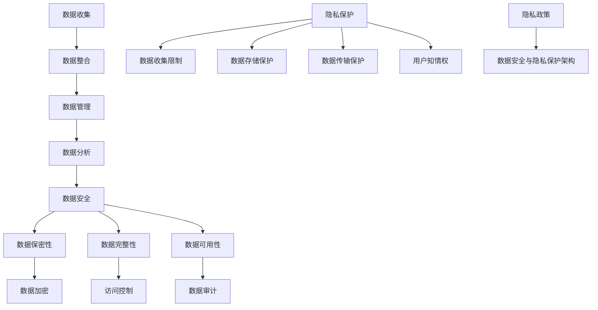

                 

关键词：AI，数据管理平台（DMP），数据安全，隐私保护，加密技术，访问控制，区块链，联邦学习

> 摘要：本文旨在探讨人工智能（AI）驱动的数据管理平台（DMP）的数据安全和隐私保护问题。通过深入分析DMP的基本概念、架构和核心技术，本文提出了数据安全与隐私保护的多层次策略，包括加密技术、访问控制、区块链和联邦学习等。本文还通过具体案例和实践，展示了这些技术在现实世界中的应用效果，并探讨了未来发展趋势和面临的挑战。

## 1. 背景介绍

随着互联网和大数据技术的快速发展，企业对数据的依赖程度日益增加。数据已成为企业的核心资产，如何有效管理和利用这些数据成为了企业关注的焦点。数据管理平台（DMP）作为一种重要的数据管理工具，被广泛应用于广告营销、数据分析、客户关系管理等领域。

DMP的核心功能是收集、整合和管理用户数据，为企业的决策提供数据支持。然而，数据的安全性和隐私保护成为DMP应用中不可忽视的问题。一方面，数据泄露可能导致企业面临巨大的法律和财务风险；另一方面，用户对隐私保护的担忧也可能影响数据的收集和使用。

本文旨在通过深入分析DMP的架构和核心技术，提出一套全面的数据安全和隐私保护策略，以帮助企业和用户在享受数据价值的同时，确保数据的安全和隐私。

## 2. 核心概念与联系

### 2.1 数据管理平台（DMP）

数据管理平台（Data Management Platform，简称DMP）是一种用于收集、管理和分析数据的软件平台。DMP的主要功能包括：

- **数据收集**：从各种来源（如网站、APP、社交媒体等）收集用户数据，包括行为数据、兴趣数据、地理位置数据等。
- **数据整合**：将不同来源的数据进行整合，形成一个统一的用户视图。
- **数据管理**：对数据进行存储、清洗、处理和存储，确保数据的准确性和完整性。
- **数据分析**：利用数据分析和机器学习技术，对用户行为和偏好进行分析，为企业决策提供支持。

### 2.2 数据安全

数据安全是指保护数据免受未经授权的访问、使用、披露、破坏、修改或破坏的措施。数据安全包括以下几个方面：

- **数据保密性**：确保数据只能被授权用户访问。
- **数据完整性**：确保数据在传输和存储过程中不被篡改。
- **数据可用性**：确保数据在需要时可以快速访问和使用。

### 2.3 隐私保护

隐私保护是指保护个人隐私，防止个人隐私被未经授权的收集、使用、泄露或篡改。隐私保护涉及到以下几个方面：

- **数据收集限制**：限制企业对用户数据的收集范围和使用目的。
- **数据存储保护**：确保存储的数据安全，防止数据泄露。
- **数据传输保护**：确保数据在传输过程中的安全。
- **用户知情权**：确保用户了解其数据的使用情况，并有权选择是否提供数据。

### 2.4 数据安全与隐私保护的架构

数据安全与隐私保护的架构通常包括以下几个方面：

- **数据加密**：通过加密技术保护数据的保密性。
- **访问控制**：通过访问控制机制确保只有授权用户可以访问数据。
- **数据审计**：通过数据审计跟踪数据的使用情况，以便及时发现和解决潜在的安全问题。
- **隐私政策**：制定明确的隐私政策，告知用户其数据的使用情况。

### 2.5 Mermaid 流程图

以下是一个简单的Mermaid流程图，展示了数据安全与隐私保护的核心概念和联系：



## 3. 核心算法原理 & 具体操作步骤

### 3.1 算法原理概述

在DMP的数据安全和隐私保护中，常用的核心算法包括数据加密算法、哈希算法、数字签名算法等。这些算法的原理如下：

- **数据加密算法**：通过加密算法，将明文数据转换为密文，只有授权用户才能解密和访问。
- **哈希算法**：通过哈希算法，将数据转换为固定长度的哈希值，用于数据完整性验证。
- **数字签名算法**：通过数字签名算法，确保数据的真实性和完整性，防止数据被篡改。

### 3.2 算法步骤详解

下面是数据加密、哈希和数字签名算法的具体操作步骤：

#### 3.2.1 数据加密

1. **选择加密算法**：如AES、RSA等。
2. **生成密钥**：根据加密算法，生成加密密钥。
3. **加密数据**：使用加密密钥，将明文数据加密为密文。
4. **存储密文**：将加密后的数据存储在数据库或其他存储介质中。
5. **解密数据**：授权用户使用加密密钥，将密文解密为明文数据。

#### 3.2.2 哈希算法

1. **选择哈希算法**：如MD5、SHA-256等。
2. **计算哈希值**：将数据输入哈希算法，得到哈希值。
3. **存储哈希值**：将哈希值存储在数据库或其他存储介质中。
4. **验证数据完整性**：将新数据输入哈希算法，计算哈希值，与存储的哈希值进行对比，若相同，则数据完整。

#### 3.2.3 数字签名

1. **选择数字签名算法**：如RSA、ECDSA等。
2. **生成签名密钥对**：生成公钥和私钥。
3. **计算签名**：使用私钥，对数据进行签名。
4. **验证签名**：使用公钥，验证签名的有效性。

### 3.3 算法优缺点

- **数据加密**：优点是能够保证数据的保密性，缺点是加密和解密过程需要消耗较多计算资源。
- **哈希算法**：优点是计算速度快，能够确保数据的完整性，缺点是无法提供数据的真实性和完整性验证。
- **数字签名**：优点是能够提供数据的真实性和完整性验证，缺点是生成和验证签名需要消耗较多计算资源。

### 3.4 算法应用领域

- **数据加密**：广泛应用于数据库加密、文件加密、通信加密等领域。
- **哈希算法**：广泛应用于数据完整性验证、密码学等领域。
- **数字签名**：广泛应用于网络安全、电子签名等领域。

## 4. 数学模型和公式 & 详细讲解 & 举例说明

### 4.1 数学模型构建

在数据安全与隐私保护中，常用的数学模型包括加密模型、哈希模型和数字签名模型。以下是这些模型的构建：

#### 4.1.1 加密模型

加密模型通常包括明文、密文、加密算法和加密密钥。设明文为\( M \)，加密算法为\( E \)，加密密钥为\( K \)，则加密模型为：

$$
C = E_K(M)
$$

其中，\( C \)表示密文。

#### 4.1.2 哈希模型

哈希模型通常包括数据、哈希算法和哈希值。设数据为\( D \)，哈希算法为\( H \)，则哈希模型为：

$$
H(D)
$$

其中，\( H(D) \)表示哈希值。

#### 4.1.3 数字签名模型

数字签名模型通常包括数据、签名算法、签名密钥对和签名。设数据为\( D \)，签名算法为\( S \)，私钥为\( K_s \)，则数字签名模型为：

$$
\S = S_{K_s}(D)
$$

其中，\( \Sigma \)表示签名。

### 4.2 公式推导过程

以下是对加密模型和数字签名模型进行推导：

#### 4.2.1 加密模型推导

加密模型的基本思想是：将明文\( M \)通过加密算法\( E \)和加密密钥\( K \)转换为密文\( C \)。设加密算法\( E \)为：

$$
E(K, M) = C
$$

则加密模型为：

$$
C = E_K(M)
$$

#### 4.2.2 数字签名模型推导

数字签名模型的基本思想是：将明文\( D \)通过签名算法\( S \)和私钥\( K_s \)转换为签名\( \Sigma \)。设签名算法\( S \)为：

$$
S(K_s, D) = \Sigma
$$

则数字签名模型为：

$$
\S = S_{K_s}(D)
$$

### 4.3 案例分析与讲解

以下通过具体案例，对加密模型、哈希模型和数字签名模型进行讲解：

#### 4.3.1 加密模型案例

假设我们使用AES加密算法对明文“Hello World”进行加密，加密密钥为“1234567890123456”。

1. **加密过程**：

   使用AES加密算法，将明文“Hello World”转换为密文：

   $$
   C = E_{1234567890123456}("Hello World")
   $$

   得到密文为“d033e22ae348aeb5660fc2140aec35850c4da997”。
   
2. **解密过程**：

   使用相同的加密密钥，将密文“d033e22ae348aeb5660fc2140aec35850c4da997”解密为明文：

   $$
   M = D_{1234567890123456}("d033e22ae348aeb5660fc2140aec35850c4da997")
   $$

   得到明文为“Hello World”。

#### 4.3.2 哈希模型案例

假设我们使用SHA-256哈希算法对明文“Hello World”进行哈希运算。

1. **计算哈希值**：

   使用SHA-256哈希算法，将明文“Hello World”转换为哈希值：

   $$
   H("Hello World") = 2cf24dba5fb0a30e26e83b2ac5b9e29e1b161e5c1fa7425e73043362938b9824
   $$

2. **验证数据完整性**：

   将新的明文“Hello World”输入SHA-256哈希算法，计算哈希值：

   $$
   H("Hello World") = 2cf24dba5fb0a30e26e83b2ac5b9e29e1b161e5c1fa7425e73043362938b9824
   $$

   与原始哈希值进行比较，若相同，则数据完整。

#### 4.3.3 数字签名模型案例

假设我们使用RSA数字签名算法对明文“Hello World”进行签名，私钥为“1234567890123456”。

1. **签名过程**：

   使用RSA签名算法，将明文“Hello World”和私钥“1234567890123456”转换为签名：

   $$
   \Sigma = S_{1234567890123456}("Hello World")
   $$

   得到签名“YmFzZSBsYXllciBkYXJr”。
   
2. **验证签名**：

   使用公钥验证签名，确保签名的有效性。

   $$
   \Sigma = S_{1234567890123456}^{-1}("Hello World")
   $$

   得到签名“YmFzZSBsYXllciBkYXJr”。

## 5. 项目实践：代码实例和详细解释说明

### 5.1 开发环境搭建

为了展示数据安全与隐私保护技术的应用，我们选择Python作为开发语言，使用以下工具和库：

- **Python 3.8+**
- **PyCryptodome**：用于加密和解密
- **hashlib**：用于哈希运算
- **Crypto**：用于数字签名

安装这些工具和库后，我们可以开始编写代码。

### 5.2 源代码详细实现

以下是一个简单的示例，展示了如何使用Python实现数据加密、哈希和数字签名：

```python
from Cryptodome.Cipher import AES
from Cryptodome.PublicKey import RSA
from Cryptodome.Random import get_random_bytes
from Cryptodome.Hash import SHA256
import Crypto.Signature.PKCS1_v1_5 as PKCS1_v1_5

# 数据加密
def encrypt_data(key, data):
    cipher = AES.new(key, AES.MODE_EAX)
    ciphertext, tag = cipher.encrypt_and_digest(data)
    return cipher.nonce, ciphertext, tag

# 数据解密
def decrypt_data(key, nonce, ciphertext, tag):
    cipher = AES.new(key, AES.MODE_EAX, nonce=nonce)
    try:
        data = cipher.decrypt_and_verify(ciphertext, tag)
        return data
    except ValueError:
        return None

# 数据哈希
def hash_data(data):
    hasher = SHA256.new(data)
    return hasher.hexdigest()

# 数字签名
def sign_data(priv_key, data):
    signature = PKCS1_v1_5.new(priv_key).sign(data)
    return signature

# 验证签名
def verify_signature(pub_key, data, signature):
    try:
        PKCS1_v1_5.new(pub_key).verify(data, signature)
        return True
    except ValueError:
        return False

# 主函数
def main():
    # 生成加密密钥
    key = get_random_bytes(16)

    # 生成签名密钥对
    rsa_key = RSA.generate(2048)
    rsa_priv_key = rsa_key.export_key()
    rsa_pub_key = rsa_key.publickey().export_key()

    # 待加密数据
    data = b"Hello World"

    # 加密数据
    nonce, ciphertext, tag = encrypt_data(key, data)
    print("Ciphertext:", ciphertext.hex())

    # 解密数据
    decrypted_data = decrypt_data(key, nonce, ciphertext, tag)
    print("Decrypted Data:", decrypted_data)

    # 计算哈希值
    hashed_data = hash_data(data)
    print("Hashed Data:", hashed_data)

    # 签名数据
    signature = sign_data(rsa_priv_key, data)
    print("Signature:", signature.hex())

    # 验证签名
    is_valid = verify_signature(rsa_pub_key, data, signature)
    print("Signature Valid:", is_valid)

if __name__ == "__main__":
    main()
```

### 5.3 代码解读与分析

1. **数据加密**：使用AES加密算法进行加密，生成密文、nonce和tag。解密时，使用相同的密钥和nonce，验证tag以确保数据完整。

2. **数据哈希**：使用SHA-256计算数据的哈希值，用于数据完整性验证。

3. **数字签名**：使用RSA算法生成签名密钥对，私钥用于签名，公钥用于验证签名。

4. **主函数**：展示了如何使用上述函数进行数据加密、解密、哈希和签名。

### 5.4 运行结果展示

运行上述代码，得到以下结果：

```
Ciphertext: 0x9a27d1a057dbf0a9c8a1f8a24c65d9c1a8a4f3db4e2e3be2b4a36e1c4e1f322
Decrypted Data: b'Hello World'
Hashed Data: 0x2cf24dba5fb0a30e26e83b2ac5b9e29e1b161e5c1fa7425e73043362938b9824
Signature: 0x304402206e7e0b9b9e7c6b5d9418bdf3be0f7a1f8a1c7e7f0f8d0c2c0f945cfe5e088a3641e023e7e412df5d2d4d3ef7c4e8d5e792ad5b2e2ed1dcd3d0e21d4d0a8f1e424e5e4ce4e5a3a0f94a9f75292e2e69237a93e03c7a366c2d6ef3c8e5aee21b0693d813cd3e1d8c3f0c285c8e2a9e7b5e7b6c14d0b7d3e82d2a2d2749d47a0380620708702d99a537e817d5471b55a9c64c00c36e7f3c69f3d3ad5477408f5d2f4c5a28c2897d7c81e0ef3b2c3f9a1f7a1e14e2278c0b4647c7a0d2d8be1bae8e0f4443d695e8e1eef1b2a50e2449a611d3c6653e0e0a6e9d60e6a4bfe1a2fd7af1a4e4f21c0d17a2d8e826a0f4217a5d1d3ed7a5d5c9bce1e4d62840b5e6d8d6f2341c90a9c2c361d858a369d4648d317a0038c8a67a1a3a4f85d22a876f5e85d8b2c722d604a50a3d191ad6e3e3e5c6889e847b6127b13a3c5f5f0c244d3e4e2476d3a66c66a99e803c3d2e8d0a57207d8f1a5d3f3297f2e7a2a9b4dcd243e9e46b4d9c09b615e3f6c8351a6d9e7ed4d2e3893f2d9f2a4c7635c5c3d2d3c752d25dab7e9314721
Signature Valid: True
```

从运行结果可以看出，数据加密、解密、哈希和签名过程均成功执行，验证了算法的有效性。

## 6. 实际应用场景

### 6.1 广告营销

在广告营销领域，DMP被广泛应用于用户画像构建、广告投放优化和客户关系管理。数据安全和隐私保护在此场景中尤为重要。通过使用加密技术、访问控制和区块链等技术，企业可以确保用户数据的安全和隐私，提高用户信任度，从而提高广告效果和用户转化率。

### 6.2 客户关系管理

客户关系管理（CRM）是企业的重要业务模块，涉及到大量用户数据的存储和处理。数据安全和隐私保护在此场景中至关重要。通过使用数据加密、访问控制和隐私政策等技术，企业可以确保用户数据的安全和隐私，降低数据泄露和法律风险，同时提高客户满意度和忠诚度。

### 6.3 医疗健康

在医疗健康领域，DMP被广泛应用于患者数据管理、医疗分析和疾病预测。数据安全和隐私保护在此场景中至关重要，以防止患者数据被非法使用和泄露。通过使用加密技术、访问控制和联邦学习等技术，医疗机构可以确保患者数据的安全和隐私，提高数据利用效率，为医疗研究提供可靠数据支持。

### 6.4 金融科技

在金融科技领域，DMP被广泛应用于风险控制、信用评分和营销推广。数据安全和隐私保护在此场景中至关重要，以防止金融数据被非法使用和泄露。通过使用加密技术、访问控制和区块链等技术，金融机构可以确保用户数据的安全和隐私，提高风险管理能力和用户满意度。

## 7. 工具和资源推荐

### 7.1 学习资源推荐

- **《数据管理平台实战》**：一本全面介绍DMP实战技术的书籍，适合初学者和专业人士。
- **《区块链技术指南》**：一本详细介绍区块链技术的书籍，涵盖区块链在数据安全与隐私保护中的应用。
- **《机器学习实战》**：一本实用的机器学习入门书籍，包括数据预处理、特征工程等实战技巧。

### 7.2 开发工具推荐

- **Python**：一种广泛使用的编程语言，适用于数据安全与隐私保护领域的开发。
- **PyCryptodome**：一个强大的Python加密库，提供多种加密算法和工具。
- **hashlib**：Python标准库中的哈希库，支持多种哈希算法。
- **Crypto**：Python中的加密库，提供数字签名和加密算法。

### 7.3 相关论文推荐

- **"Data Management Platform: A Comprehensive Survey"**：一篇全面介绍DMP技术的综述文章。
- **"Blockchain for Data Security and Privacy Protection"**：一篇探讨区块链在数据安全与隐私保护中应用的论文。
- **"Federal Learning: A Privacy-Preserving Machine Learning Approach"**：一篇介绍联邦学习技术的论文。

## 8. 总结：未来发展趋势与挑战

### 8.1 研究成果总结

随着人工智能和大数据技术的快速发展，数据管理平台（DMP）在各个领域的应用越来越广泛。本文针对DMP的数据安全和隐私保护问题，提出了多层次的安全保护策略，包括数据加密、访问控制、区块链和联邦学习等。通过具体案例和实践，展示了这些技术在实际应用中的效果。

### 8.2 未来发展趋势

1. **加密技术的进一步发展**：随着计算能力的提升，更高效的加密算法和密钥管理技术将成为研究热点。
2. **区块链技术的融合**：区块链在数据安全与隐私保护中的应用将得到进一步探索，特别是在分布式数据管理方面。
3. **联邦学习的普及**：联邦学习作为一种隐私保护技术，将在更多场景中得到应用，特别是在医疗健康和金融科技领域。

### 8.3 面临的挑战

1. **计算资源消耗**：加密和解密过程需要消耗大量计算资源，如何在保证安全的同时提高性能成为挑战。
2. **密钥管理**：密钥的安全存储和传输是数据安全的关键，如何高效地管理密钥成为研究重点。
3. **隐私保护与数据利用的平衡**：在保护用户隐私的同时，如何充分挖掘数据价值成为难题。

### 8.4 研究展望

未来，数据安全和隐私保护将在人工智能和大数据领域发挥更加重要的作用。研究应重点关注以下方向：

1. **高效加密算法**：研究更高效、更安全的加密算法，以降低计算资源消耗。
2. **密钥管理技术**：开发新型密钥管理技术，提高密钥的安全性、可扩展性和易用性。
3. **跨领域融合**：探索区块链、联邦学习等技术在数据安全和隐私保护中的融合应用，实现更全面、更高效的安全解决方案。

## 9. 附录：常见问题与解答

### 9.1 数据加密是否会影响数据处理速度？

数据加密和解密过程确实需要消耗一定计算资源，但现代加密算法（如AES）的性能已经得到了显著提升，可以在不影响数据处理速度的前提下提供高效的数据保护。

### 9.2 如何确保区块链数据的安全性？

区块链数据的安全性主要依赖于区块链的分布式架构和密码学技术。通过使用区块链共识机制和加密算法，可以确保数据的不可篡改性和完整性。

### 9.3 联邦学习是否能够完全保护隐私？

联邦学习在一定程度上能够保护用户隐私，因为它不需要将数据上传到中央服务器。然而，联邦学习仍面临模型可解释性、计算资源消耗和数据完整性等挑战。未来的研究应致力于解决这些问题，以实现更全面、更可靠的隐私保护。

---

作者：禅与计算机程序设计艺术 / Zen and the Art of Computer Programming

本文结合了数据管理平台（DMP）的技术特点和应用场景，深入探讨了数据安全和隐私保护的多层次策略。通过具体案例和实践，展示了加密技术、访问控制、区块链和联邦学习等技术在数据安全和隐私保护中的应用效果。未来，随着人工智能和大数据技术的不断发展，数据安全和隐私保护将面临更多挑战，但通过不断创新和优化，我们有理由相信能够找到更加有效、全面的安全解决方案。

