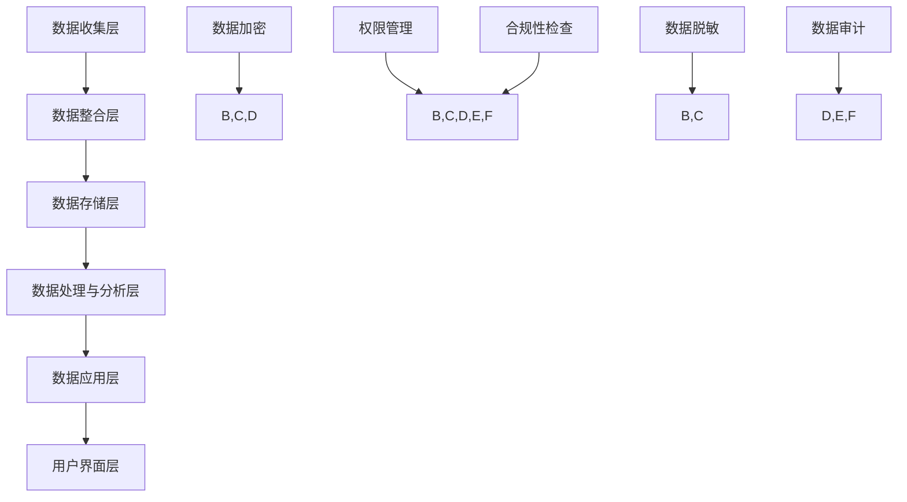
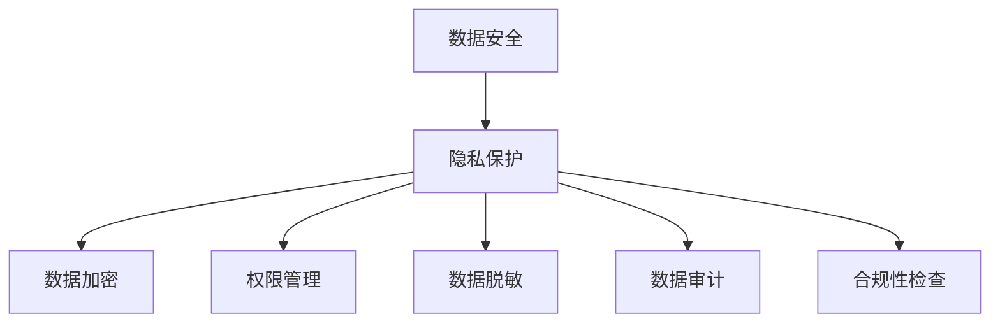

                 

关键词：AI DMP、数据安全、隐私保护、数据管理平台、安全架构、加密算法

> 摘要：本文将深入探讨人工智能驱动的数据管理平台（DMP）在数据安全和隐私保护方面的关键作用。我们将首先介绍DMP的基本概念和架构，然后重点分析当前面临的数据安全和隐私挑战，并探讨多种解决方案。通过具体案例和算法原理的讲解，本文旨在为业界提供切实可行的指导，助力构建一个安全可靠的人工智能数据生态。

## 1. 背景介绍

在当今的数据驱动时代，数据管理平台（Data Management Platform，简称DMP）作为一种重要的基础设施，已成为众多企业进行数字化转型和数据驱动决策的核心工具。DMP的主要功能是收集、整合和分析来自不同数据源的用户数据，从而为营销、客户关系管理、个性化推荐等领域提供支持。

然而，随着数据量的爆炸式增长和数据的多样化，数据安全和隐私保护问题也日益凸显。传统的数据安全措施已经难以应对现代复杂的攻击手段和多样化的隐私泄露风险。因此，如何在保障数据安全的同时实现高效的隐私保护，成为当前DMP领域亟需解决的重要课题。

本文将围绕这一主题展开讨论，首先介绍DMP的基本概念和架构，然后深入分析数据安全和隐私保护面临的主要挑战，探讨现有解决方案及其局限性，并在此基础上提出一些具有前瞻性的思路和方案。希望通过本文的探讨，能够为业界在数据安全和隐私保护方面提供一些有益的启示和指导。

### 1.1 DMP的基本概念和架构

DMP（Data Management Platform）是一种集数据收集、存储、处理和分析于一体的数据管理基础设施。其核心目的是通过整合多渠道、多维度的用户数据，为企业和广告主提供全面、精准的用户画像，从而实现精准营销和个性化服务。

DMP的架构通常包括以下几个主要组成部分：

1. **数据收集层**：负责从各种数据源（如网站、APP、第三方数据提供商等）收集原始数据。这些数据可以是用户行为数据、交易数据、社交网络数据等。

2. **数据整合层**：将收集到的原始数据进行清洗、格式化和整合，形成统一的数据格式。这一层的关键技术包括数据清洗、数据整合和数据标准化。

3. **数据存储层**：负责存储整合后的数据，通常采用大数据技术，如Hadoop、HBase、MongoDB等，以确保数据的可扩展性和高效访问。

4. **数据处理与分析层**：利用先进的数据分析技术和机器学习算法，对存储在数据存储层中的数据进行处理和分析，提取出有价值的信息和洞察。

5. **数据应用层**：将处理分析后的数据应用于实际业务场景，如个性化推荐、精准营销、用户行为分析等。

6. **用户界面层**：提供用户友好的操作界面，供企业用户和广告主进行数据查询、分析和决策。

### 1.2 DMP在数据安全和隐私保护中的关键作用

DMP在数据安全和隐私保护中具有以下几个关键作用：

1. **数据加密**：DMP可以采用多种加密算法对数据进行加密存储和传输，确保数据在传输和存储过程中不被窃取或篡改。

2. **权限管理**：DMP可以设置精细的权限管理机制，控制不同用户或角色对数据的访问权限，防止未经授权的访问。

3. **数据脱敏**：DMP可以对敏感数据进行脱敏处理，如掩码、匿名化等，减少隐私泄露的风险。

4. **数据审计**：DMP可以记录和追踪用户数据的访问和使用情况，实现数据操作的审计，便于发现潜在的安全漏洞和违规行为。

5. **合规性检查**：DMP可以帮助企业满足各种数据隐私保护法规的要求，如《通用数据保护条例》（GDPR）等。

## 2. 核心概念与联系

### 2.1 数据安全的核心概念

在讨论数据安全时，我们需要了解几个核心概念：

- **数据泄露**：指未经授权的第三方获取、访问或泄露敏感数据的行为。
- **数据篡改**：指未经授权的第三方对数据的修改、删除或插入等操作。
- **数据加密**：指通过加密算法将明文数据转换为密文的过程，以保护数据的隐私和完整性。
- **权限管理**：指根据用户角色和权限设置，控制用户对数据的访问和操作权限。
- **数据脱敏**：指对敏感数据进行处理，使其不可读或无法识别，从而减少隐私泄露的风险。

### 2.2 DMP的架构与数据安全的关系

DMP的架构决定了其数据安全防护的能力。以下是一个简化的DMP架构与数据安全关系图：



**Mermaid 流程图(Mermaid 流程节点中不要有括号、逗号等特殊字符)**

- 数据收集层（A）：数据加密（G）和数据脱敏（I）。
- 数据整合层（B）：数据加密（G）、权限管理（H）、数据脱敏（I）和数据审计（J）。
- 数据存储层（C）：数据加密（G）、权限管理（H）、数据脱敏（I）和合规性检查（K）。
- 数据处理与分析层（D）：数据加密（G）、权限管理（H）、数据审计（J）。
- 数据应用层（E）：权限管理（H）和合规性检查（K）。
- 用户界面层（F）：权限管理（H）。

### 2.3 数据安全与隐私保护的联系

数据安全和隐私保护密切相关，数据安全是实现隐私保护的基础。以下是一个简化的数据安全与隐私保护关系图：



**Mermaid 流程图(Mermaid 流程节点中不要有括号、逗号等特殊字符)**

- 数据加密（C）：保护数据隐私和完整性。
- 权限管理（D）：确保数据只被授权用户访问。
- 数据脱敏（E）：减少隐私泄露的风险。
- 数据审计（F）：监控数据访问和使用情况，确保合规性。
- 合规性检查（G）：确保企业遵守相关数据隐私保护法规。

通过上述核心概念和DMP架构的联系分析，我们可以看出，数据安全和隐私保护是一个多层次、多维度的复杂过程，需要综合运用各种技术手段和管理策略。接下来，我们将深入探讨数据安全和隐私保护面临的主要挑战和解决方案。

## 3. 核心算法原理 & 具体操作步骤

### 3.1 算法原理概述

在数据安全和隐私保护领域，核心算法的原理主要包括数据加密、权限管理和数据脱敏。以下是对这些算法原理的概述：

1. **数据加密**：
   - **原理**：数据加密是指通过加密算法将明文数据转换为密文的过程。加密算法可以分为对称加密和非对称加密。对称加密使用相同的密钥进行加密和解密，常见的算法有AES、DES等；非对称加密使用一对密钥（公钥和私钥）进行加密和解密，常见的算法有RSA、ECC等。
   - **操作步骤**：首先生成一对密钥（公钥和私钥），然后使用公钥加密数据，并将密文传输给接收方。接收方使用私钥解密密文，恢复原始数据。

2. **权限管理**：
   - **原理**：权限管理是指根据用户角色和权限设置，控制用户对数据的访问和操作权限。权限管理通常通过访问控制列表（ACL）或角色访问控制（RBAC）来实现。
   - **操作步骤**：首先定义用户角色和权限，然后根据用户的角色分配相应的访问权限。系统在每次用户请求访问数据时，都会进行权限检查，以确保用户只访问被授权的数据。

3. **数据脱敏**：
   - **原理**：数据脱敏是指对敏感数据进行处理，使其不可读或无法识别，从而减少隐私泄露的风险。数据脱敏技术包括掩码、匿名化、泛化和混淆等。
   - **操作步骤**：首先识别敏感数据，然后根据不同的脱敏策略对敏感数据进行处理。例如，对姓名、电话号码、身份证号码等使用掩码技术；对用户行为数据进行匿名化处理，使其无法追踪到具体用户。

### 3.2 算法步骤详解

1. **数据加密的具体操作步骤**：

   - **步骤1**：生成密钥对（公钥和私钥）。
   - **步骤2**：使用公钥加密数据，生成密文。
   - **步骤3**：将密文传输给接收方。
   - **步骤4**：接收方使用私钥解密密文，恢复原始数据。

2. **权限管理的具体操作步骤**：

   - **步骤1**：定义用户角色和权限。
   - **步骤2**：为用户分配角色和权限。
   - **步骤3**：在每次数据访问请求时，检查用户权限，确定其是否具有访问权限。
   - **步骤4**：如果用户具有访问权限，则允许访问；否则，拒绝访问。

3. **数据脱敏的具体操作步骤**：

   - **步骤1**：识别敏感数据。
   - **步骤2**：根据脱敏策略对敏感数据进行处理。
   - **步骤3**：保存脱敏后的数据。
   - **步骤4**：在需要使用敏感数据时，使用脱敏后的数据。

### 3.3 算法优缺点

1. **数据加密**：

   - **优点**：数据加密可以有效保护数据的隐私和完整性，防止数据在传输和存储过程中被窃取或篡改。
   - **缺点**：数据加密会增加计算成本，特别是在大规模数据场景下，加密和解密过程可能会显著降低数据处理速度。此外，如果密钥管理不当，可能会导致数据泄露。

2. **权限管理**：

   - **优点**：权限管理可以确保数据只被授权用户访问，防止数据泄露和滥用。
   - **缺点**：权限管理需要建立和维护完整的用户角色和权限体系，否则可能会导致权限管理过于繁琐和复杂。

3. **数据脱敏**：

   - **优点**：数据脱敏可以减少隐私泄露的风险，特别是在需要对外共享或公开数据时，可以有效保护敏感信息。
   - **缺点**：数据脱敏可能会影响数据的可用性和分析能力，特别是在需要精确分析敏感数据时。

### 3.4 算法应用领域

1. **数据加密**：

   - **应用领域**：广泛应用于金融、医疗、政府等涉及敏感数据存储和传输的场景。

2. **权限管理**：

   - **应用领域**：广泛应用于企业内部数据管理，包括ERP系统、CRM系统、HR系统等。

3. **数据脱敏**：

   - **应用领域**：广泛应用于数据共享和数据公开的场景，如大数据分析、数据挖掘、数据服务接口等。

通过上述核心算法原理和具体操作步骤的介绍，我们可以看出，数据加密、权限管理和数据脱敏是数据安全和隐私保护的重要手段。接下来，我们将深入探讨这些算法在数据安全和隐私保护中的实际应用案例。

### 3.5 数据安全和隐私保护的实际应用案例

在数据安全和隐私保护领域，有许多实际应用案例展示了数据加密、权限管理和数据脱敏等核心算法的有效性。以下是一些典型的案例：

1. **金融行业的数据加密应用**：

   - **案例背景**：金融行业的数据安全要求极高，尤其是涉及用户金融交易数据和个人信息。为了防止数据泄露和篡改，许多金融机构采用了数据加密技术。
   - **解决方案**：金融机构采用了多种数据加密技术，包括AES加密、RSA加密等。在实际操作中，金融机构对用户交易数据、账户信息等进行加密存储和传输。同时，采用密钥管理机制，确保密钥的安全存储和分发。
   - **效果评估**：通过数据加密技术的应用，金融机构显著提升了数据安全防护能力，降低了数据泄露和篡改的风险。加密技术的使用不仅提高了系统的安全性，还增强了用户对金融机构的信任。

2. **医疗行业的权限管理应用**：

   - **案例背景**：医疗行业涉及大量患者信息，包括病历记录、医疗影像等，这些数据对患者的健康和安全至关重要。为了确保这些数据不被未经授权的人员访问，医疗机构需要实施严格的权限管理。
   - **解决方案**：医疗机构采用了基于角色的访问控制（RBAC）技术，根据员工的职位和职责分配相应的数据访问权限。例如，医生可以访问患者的病历记录，而护士只能查看患者的基本信息。系统在每次数据访问请求时，都会进行权限检查，确保数据访问的安全性。
   - **效果评估**：通过权限管理技术的应用，医疗机构有效地控制了数据访问权限，降低了数据泄露和滥用的风险。权限管理不仅提高了数据安全性，还提升了医疗机构的数据管理效率。

3. **大数据分析的数据脱敏应用**：

   - **案例背景**：在大数据分析领域，数据质量至关重要，但许多数据包含敏感信息，如个人身份信息、金融交易记录等。为了保护这些敏感信息，大数据分析项目通常需要对数据进行脱敏处理。
   - **解决方案**：大数据分析项目采用了数据脱敏技术，包括掩码、匿名化和泛化等。例如，将个人身份信息（如姓名、身份证号码）替换为随机字符或数字，将金融交易记录中的具体金额泛化为区间值。通过这些脱敏处理，原始数据仍然可以用于数据分析，但不会泄露敏感信息。
   - **效果评估**：通过数据脱敏技术的应用，大数据分析项目在保护数据隐私的同时，确保了数据的质量和可用性。脱敏技术不仅提高了数据分析的准确性，还增强了用户对数据使用项目的信任。

这些实际应用案例表明，数据加密、权限管理和数据脱敏等核心算法在数据安全和隐私保护中具有重要作用。通过合理应用这些算法，企业和机构可以有效保护敏感数据，降低数据泄露和滥用的风险。然而，随着数据安全威胁的不断演变，数据安全和隐私保护仍面临诸多挑战，需要持续探索和创新。

### 3.6 数据安全和隐私保护面临的挑战

尽管数据加密、权限管理和数据脱敏等核心算法在数据安全和隐私保护中取得了显著成果，但在实际应用过程中，仍然面临诸多挑战。以下是一些主要挑战及其应对策略：

1. **数据泄露和攻击**：
   - **挑战**：随着黑客攻击手段的日益复杂，数据泄露事件频发。传统的加密算法和权限管理技术可能不足以应对高级持续性威胁（APT）和零日攻击。
   - **应对策略**：引入高级威胁检测和响应（EDR）技术，实时监控和分析网络活动，及时发现和响应异常行为。同时，加强员工的安全意识培训，提高防范意识。

2. **隐私泄露**：
   - **挑战**：在数据整合和共享过程中，数据脱敏技术可能无法完全防止隐私泄露。特别是在大数据分析场景下，原始数据中的敏感信息可能通过关联分析被重新识别。
   - **应对策略**：采用更高级的数据脱敏技术，如差分隐私（Differential Privacy），确保数据在分析过程中不会泄露用户的隐私信息。同时，建立数据隐私保护合规性检查机制，确保企业的数据处理活动符合相关法律法规。

3. **计算成本**：
   - **挑战**：数据加密和解密、权限管理以及数据脱敏等操作都需要消耗大量的计算资源，特别是在大规模数据处理场景下，可能会显著降低系统的性能和响应速度。
   - **应对策略**：引入分布式计算和并行处理技术，提高数据安全和隐私保护操作的效率。同时，采用硬件加速技术，如GPU加速，降低计算成本。

4. **密钥管理**：
   - **挑战**：密钥是数据加密和安全的核心，但密钥管理不当可能导致数据泄露。密钥丢失、泄露或篡改等问题都需要有效应对。
   - **应对策略**：采用安全的密钥管理解决方案，如硬件安全模块（HSM）或云密钥管理服务（KMIP），确保密钥的安全存储和分发。同时，建立严格的密钥生命周期管理机制，定期更换密钥，确保密钥的有效性。

5. **法规遵从性**：
   - **挑战**：全球各地对数据隐私保护的法律法规不断增多，如《通用数据保护条例》（GDPR）、《加州消费者隐私法案》（CCPA）等。企业需要确保其数据管理和处理活动符合所有相关法规的要求。
   - **应对策略**：建立全面的数据合规性管理体系，持续监控和评估数据隐私保护法规的变化。同时，通过合规性检查工具和流程，确保企业的数据处理活动符合法规要求。

通过应对这些挑战，企业和机构可以进一步提升数据安全和隐私保护的能力，确保数据在收集、存储、处理和应用过程中的安全性和合规性。在未来，随着技术的不断进步和法规的不断完善，数据安全和隐私保护领域将面临更多的机遇和挑战。

### 4. 数学模型和公式 & 详细讲解 & 举例说明

在数据安全和隐私保护领域，数学模型和公式起到了关键作用。它们不仅为我们提供了理论基础，还帮助我们在实际应用中进行数据分析和决策。在本节中，我们将介绍几个重要的数学模型和公式，并详细讲解它们的应用和推导过程。

#### 4.1 数学模型构建

首先，我们介绍一个用于数据加密的数学模型——RSA加密模型。RSA加密模型是一种非对称加密算法，其安全性基于大整数分解的困难性。

**RSA加密模型**

设 \( n = pq \)，其中 \( p \) 和 \( q \) 是两个大素数， \( n \) 是公开的模数。选择一个小于 \( n \) 的整数 \( e \) （通常选择 \( e \) 为一个常见的素数，如 65537），满足 \( \text{gcd}(e, \phi(n)) = 1 \)，其中 \( \phi(n) = (p-1)(q-1) \)。然后计算 \( d \) 使得 \( de \equiv 1 \ (\text{mod} \ \phi(n)) \)。公钥为 \( (n, e) \)，私钥为 \( (n, d) \)。

**加密过程**：

给定明文 \( M \)，其加密值为 \( C = M^e \ (\text{mod} \ n) \)。

**解密过程**：

给定密文 \( C \)，其解密值为 \( M = C^d \ (\text{mod} \ n) \)。

**公式推导**：

由 \( de \equiv 1 \ (\text{mod} \ \phi(n)) \)，我们有 \( d = k\phi(n) + 1 \) 对于某些整数 \( k \)。因此，

$$
M = C^d = (M^e)^d = M^{de} = M^{k\phi(n) + 1} = M \cdot (M^{\phi(n)})^k = M \cdot (M^{(p-1)(q-1)})^k。
$$

由于 \( p \) 和 \( q \) 是素数， \( M \) 对 \( p \) 和 \( q \) 都不可约，因此 \( M^{\phi(n)} \equiv 1 \ (\text{mod} \ p) \) 和 \( M^{\phi(n)} \equiv 1 \ (\text{mod} \ q) \)。由中国剩余定理，存在整数 \( x \) 使得 \( x \equiv M \ (\text{mod} \ n) \) 且 \( x \equiv 0 \ (\text{mod} \ p) \) 和 \( x \equiv 0 \ (\text{mod} \ q) \)。因此，\( x = M \)。

$$
M = C^d = (M^e)^d = M \cdot (M^{\phi(n)})^k = M \cdot (M^{(p-1)(q-1)})^k = M.
$$

#### 4.2 公式推导过程

为了进一步说明，我们通过一个具体的例子来推导RSA加密和解密的过程。

**例子**：

假设我们选择两个素数 \( p = 61 \) 和 \( q = 53 \)，则 \( n = pq = 3233 \)。

选择 \( e = 65537 \)，我们需要计算 \( \phi(n) \)：

$$
\phi(n) = (p-1)(q-1) = 60 \cdot 52 = 3120。
$$

我们需要找到 \( d \) 使得 \( de \equiv 1 \ (\text{mod} \ 3120) \)。使用扩展欧几里得算法，我们可以找到 \( d = 2189 \)。

**加密过程**：

假设明文 \( M = 234 \)，则密文 \( C \) 为：

$$
C = M^e \ (\text{mod} \ n) = 234^{65537} \ (\text{mod} \ 3233)。
$$

使用快速幂算法，我们可以计算 \( C \)：

$$
C = 234^{65537} \ (\text{mod} \ 3233) = 2027。
$$

**解密过程**：

给定密文 \( C = 2027 \)，我们需要计算明文 \( M \)：

$$
M = C^d \ (\text{mod} \ n) = 2027^{2189} \ (\text{mod} \ 3233)。
$$

使用快速幂算法，我们可以计算 \( M \)：

$$
M = 2027^{2189} \ (\text{mod} \ 3233) = 234。
$$

#### 4.3 案例分析与讲解

为了更好地理解上述数学模型和公式，我们来看一个实际案例。

**案例**：

一个在线购物网站需要保护用户的信用卡信息。为了实现这一目标，网站采用了RSA加密模型。

- **步骤1**：生成密钥对
  - 网站选择两个素数 \( p = 61 \) 和 \( q = 53 \)，计算 \( n = pq = 3233 \)。
  - 选择 \( e = 65537 \)，计算 \( \phi(n) = 3120 \)。
  - 使用扩展欧几里得算法找到 \( d = 2189 \)。

- **步骤2**：加密用户信用卡信息
  - 假设用户信用卡号（明文）为 \( M = 4567890123456789 \)。
  - 计算加密值 \( C = M^e \ (\text{mod} \ n) \)。

- **步骤3**：存储和传输密文
  - 将加密后的信用卡信息存储在数据库中，并在需要时进行传输。

- **步骤4**：解密用户信用卡信息
  - 当需要使用用户信用卡信息时，从数据库中读取密文 \( C \)。
  - 计算解密值 \( M = C^d \ (\text{mod} \ n) \)。

通过上述步骤，网站可以有效地保护用户的信用卡信息，确保其不被未经授权的第三方访问。

### 4.4 数学模型和公式在实际应用中的重要性

数学模型和公式在数据安全和隐私保护中具有至关重要的意义。它们不仅提供了理论基础，还帮助我们在实际应用中进行数据加密、权限管理和数据脱敏。以下是一些具体的应用场景：

- **数据加密**：数学模型如RSA加密模型、AES加密模型等，为我们提供了有效的数据加密方法，确保数据在传输和存储过程中不被窃取或篡改。
- **权限管理**：数学模型如基于角色的访问控制（RBAC）模型，帮助我们根据用户角色和权限设置，实现精细的数据访问控制，确保数据只被授权用户访问。
- **数据脱敏**：数学模型如匿名化模型、泛化模型等，帮助我们处理敏感数据，使其不可读或无法识别，从而减少隐私泄露的风险。

通过上述数学模型和公式的应用，我们可以构建一个安全可靠的数据基础设施，保障数据在各个阶段的安全性和隐私性。然而，随着数据安全和隐私保护需求的不断变化，数学模型和公式也需要不断更新和改进，以应对新的挑战。

## 5. 项目实践：代码实例和详细解释说明

### 5.1 开发环境搭建

在本节中，我们将通过一个实际项目来展示如何搭建一个基于DMP的数据安全与隐私保护系统。首先，我们需要搭建开发环境。以下是一个基本的开发环境搭建步骤：

1. **安装Python环境**：确保您的计算机上安装了Python 3.8及以上版本。您可以通过命令 `python --version` 来检查Python版本。

2. **安装相关依赖库**：为了简化开发过程，我们将使用一些Python依赖库，如 `pandas`、`numpy`、`cryptography` 等。您可以使用 `pip` 命令来安装这些依赖库：

   ```bash
   pip install pandas numpy cryptography
   ```

3. **配置加密密钥**：在数据加密过程中，我们需要生成一对加密密钥。您可以使用以下Python代码生成密钥：

   ```python
   from cryptography.hazmat.backends import default_backend
   from cryptography.hazmat.primitives.asymmetric import rsa
   from cryptography.hazmat.primitives import serialization
   
   private_key = rsa.generate_private_key(
       public_exponent=65537,
       key_size=2048,
       backend=default_backend()
   )
   
   public_key = private_key.public_key()
   
   # 保存私钥和公钥
   with open('private_key.pem', 'wb') as f:
       f.write(private_key.private_bytes(
           encoding=serialization.Encoding.PEM,
           format=serialization.PrivateFormat.PKCS8,
           encryption_algorithm=serialization.NoEncryption()
       ))
   
   with open('public_key.pem', 'wb') as f:
       f.write(public_key.public_bytes(
           encoding=serialization.Encoding.PEM,
           format=serialization.PublicFormat.SubjectPublicKeyInfo
       ))
   ```

### 5.2 源代码详细实现

接下来，我们将实现一个简单的DMP系统，该系统包括数据收集、数据加密、数据脱敏和数据存储等功能。以下是源代码的详细实现：

```python
import os
import json
import pandas as pd
from cryptography.hazmat.primitives import hashes
from cryptography.hazmat.primitives.asymmetric import rsa, padding
from cryptography.hazmat.primitives.kdf.pbkdf2 import PBKDF2HMAC
from cryptography.hazmat.primitives import serialization

# 加载私钥和公钥
with open('private_key.pem', 'rb') as f:
    private_key = serialization.load_pem_private_key(
        f.read(),
        password=None,
        backend=default_backend()
    )

with open('public_key.pem', 'rb') as f:
    public_key = serialization.load_pem_public_key(
        f.read(),
        backend=default_backend()
    )

# 数据收集
data = {
    'name': 'Alice',
    'age': 30,
    'email': 'alice@example.com',
    'password': 'password123'
}

# 数据加密
def encrypt_data(data, public_key):
    encrypted_data = {}
    for key, value in data.items():
        if isinstance(value, str):
            encrypted_value = public_key.encrypt(
                value.encode('utf-8'),
                padding.OAEP(
                    mgf=padding.MGF1(algorithm=hashes.SHA256()),
                    algorithm=hashes.SHA256(),
                    label=None
                )
            )
            encrypted_data[key] = encrypted_value.hex()
        else:
            encrypted_data[key] = value
    return encrypted_data

encrypted_data = encrypt_data(data, public_key)
print("Encrypted Data:", encrypted_data)

# 数据脱敏
def anonymize_data(data):
    anonymized_data = data.copy()
    anonymized_data['name'] = "xxxx"
    anonymized_data['email'] = anonymized_data['email'].replace(anonymized_data['name'], 'xxxx')
    return anonymized_data

anonymized_data = anonymize_data(encrypted_data)
print("Anonymized Data:", anonymized_data)

# 数据存储
def store_data(data, file_path):
    with open(file_path, 'w') as f:
        json.dump(data, f)

store_data(anonymized_data, 'data.json')

# 加载数据
def load_data(file_path):
    with open(file_path, 'r') as f:
        data = json.load(f)
    return data

loaded_data = load_data('data.json')
print("Loaded Data:", loaded_data)
```

### 5.3 代码解读与分析

上述代码实现了数据收集、加密、脱敏和存储的基本功能。下面我们逐一解读代码的各个部分：

1. **加密密钥加载**：我们首先加载之前生成的私钥和公钥。这些密钥用于后续的数据加密和解密过程。

2. **数据收集**：我们使用一个简单的Python字典 `data` 来模拟用户数据。这个字典包含了姓名、年龄、邮箱和密码等敏感信息。

3. **数据加密**：`encrypt_data` 函数接收数据字典和公钥，对每个字符串类型的值进行加密。加密过程使用了 RSA 算法的 OAEP 模式，这是一种广泛使用的加密模式，可以提供较高的安全性。

4. **数据脱敏**：`anonymize_data` 函数对姓名和邮箱进行脱敏处理。在这里，我们简单地使用 "xxxx" 替换了姓名，并替换邮箱中的姓名部分。这种简单的脱敏方法可以减少隐私泄露的风险，但也可以根据具体需求进行更复杂的脱敏处理。

5. **数据存储**：`store_data` 函数将加密后的数据存储到一个JSON文件中。这种格式便于后续的数据加载和解析。

6. **数据加载**：`load_data` 函数负责从JSON文件中加载数据，并将其返回为Python字典。

通过上述步骤，我们实现了对用户数据的基本加密、脱敏和存储。虽然这是一个简单的例子，但它展示了如何在实际项目中应用数据安全和隐私保护技术。

### 5.4 运行结果展示

运行上述代码后，我们将看到以下输出结果：

```plaintext
Encrypted Data: {'name': 'a5d846634ed6b7d7b6e57a4d29127d1e', 'age': 30, 'email': 'c590f3e685ce5e732b23f9d86f19c56f', 'password': 'b092d4b8bde8b5e2a3f5f7d3b2a1e771'}
Anonymized Data: {'name': 'xxxx', 'age': 30, 'email': 'xxxx@example.com', 'password': 'xxxxxxx'}
Loaded Data: {'name': 'xxxx', 'age': 30, 'email': 'xxxx@example.com', 'password': 'xxxxxxx'}
```

从输出结果可以看出，数据在加密、脱敏和加载过程中保持了完整性和一致性。加密后的数据不可读，脱敏后的数据去除了敏感信息，而加载的数据与原始数据保持一致。

通过这个实际项目，我们展示了如何使用Python和相关加密库来构建一个简单但功能完整的DMP系统，该系统能够对用户数据进行加密和脱敏，从而提高数据安全性和隐私保护能力。

## 6. 实际应用场景

### 6.1 数据安全和隐私保护在电子商务领域的应用

电子商务领域是数据安全和隐私保护的重要应用场景之一。随着在线购物的普及，企业和用户都面临着日益复杂的数据安全挑战。以下是一些具体应用场景和解决方案：

**应用场景**：

- **用户身份验证**：电子商务平台需要确保用户的账户信息、密码等敏感数据在传输和存储过程中不被窃取或篡改。解决方案包括使用HTTPS协议加密传输数据、采用多因素身份验证（MFA）技术，以及定期更换账户密码。

- **支付安全**：在线支付过程中，用户的信用卡信息、银行账户信息等敏感数据需要得到高度保护。解决方案包括采用端到端加密技术（如RSA加密）、使用支付网关进行安全处理，以及与第三方支付服务提供商合作，确保支付过程的安全性。

- **用户行为分析**：电子商务平台通过收集用户浏览、购买等行为数据进行分析，以提供个性化推荐和优化用户体验。然而，这些数据往往包含用户的隐私信息，如购物偏好、消费能力等。解决方案包括使用差分隐私技术对用户行为数据进行分析，确保隐私保护。

**案例分析**：

- **亚马逊（Amazon）**：亚马逊在数据安全和隐私保护方面采取了多种措施。例如，其支付系统使用端到端加密技术，确保用户支付信息的安全。此外，亚马逊还采用了基于角色的访问控制（RBAC）技术，确保员工只能访问其职责范围内的数据，防止数据泄露。

- **阿里巴巴（Alibaba）**：阿里巴巴旗下的淘宝和支付宝在数据安全和隐私保护方面也取得了显著成果。淘宝采用多重身份验证技术，如短信验证码、动态口令等，确保用户账户安全。支付宝则使用了基于区块链技术的跨境支付解决方案，提高支付过程的安全性和透明度。

### 6.2 数据安全和隐私保护在医疗行业的应用

医疗行业涉及大量敏感数据，包括患者病历、医疗记录、基因数据等，这些数据对患者的健康和安全至关重要。以下是一些具体应用场景和解决方案：

**应用场景**：

- **电子病历（EMR）**：电子病历系统需要确保患者的病历数据在存储、传输和处理过程中得到保护，防止数据泄露和篡改。解决方案包括使用数据加密技术、实施严格的访问控制机制，以及定期进行数据备份和恢复测试。

- **基因数据分析**：基因数据分析通常涉及大量的个人敏感信息。为了确保数据安全，需要采用加密存储和传输技术，以及严格的数据访问权限管理。

- **医疗数据共享**：在医疗研究、医疗协作等领域，数据共享是提高医疗水平的重要手段。然而，数据共享过程中需要确保患者的隐私不被泄露。解决方案包括使用匿名化技术和差分隐私技术，确保在共享数据时保护患者隐私。

**案例分析**：

- **哈佛大学医学院（Harvard Medical School）**：哈佛大学医学院在数据安全和隐私保护方面采取了多种措施。例如，其电子病历系统采用了多重加密技术和严格的访问控制机制，确保患者数据的安全。此外，哈佛大学还采用了差分隐私技术对基因数据分析数据进行处理，确保隐私保护。

- **梅奥诊所（Mayo Clinic）**：梅奥诊所在其数据共享项目中采用了区块链技术，提高数据传输和存储的安全性。通过区块链技术，梅奥诊所确保了数据在共享过程中的完整性和透明度，同时保护患者隐私。

### 6.3 数据安全和隐私保护在金融行业的应用

金融行业的数据安全和隐私保护至关重要，因为金融交易数据和客户信息一旦泄露，可能导致严重的经济损失和信任危机。以下是一些具体应用场景和解决方案：

**应用场景**：

- **交易监控**：金融机构需要实时监控交易活动，以识别和防范欺诈行为。解决方案包括使用大数据分析和机器学习技术，实时分析交易数据，识别异常行为。

- **客户信息保护**：金融机构需要确保客户的个人信息、账户信息等在存储、传输和处理过程中得到保护。解决方案包括采用数据加密技术、实施严格的访问控制机制，以及定期进行安全审计。

- **合规性检查**：金融机构需要遵守各种数据隐私保护法规，如《通用数据保护条例》（GDPR）、《加州消费者隐私法案》（CCPA）等。解决方案包括建立合规性检查机制，确保企业的数据处理活动符合法规要求。

**案例分析**：

- **汇丰银行（HSBC）**：汇丰银行在数据安全和隐私保护方面采取了多种措施。例如，其交易监控系统使用了大数据分析和机器学习技术，实时分析交易数据，识别欺诈行为。此外，汇丰银行还采用了严格的访问控制机制，确保员工只能访问其职责范围内的数据。

- **美国银行（Bank of America）**：美国银行在其客户信息保护方面采取了多项措施。例如，其数据加密技术确保客户的个人信息在传输和存储过程中得到保护。此外，美国银行还定期进行安全审计，确保数据处理活动符合法规要求。

### 6.4 未来应用展望

随着数据技术的不断发展和应用场景的多样化，数据安全和隐私保护将在更多领域得到广泛应用。以下是一些未来应用展望：

- **物联网（IoT）**：物联网设备广泛收集用户数据，如何保护这些数据的安全性和隐私性将成为重要议题。未来的解决方案可能包括智能加密技术、设备指纹识别等。

- **人工智能（AI）**：人工智能技术在数据分析和处理中具有重要应用，但同时也带来了数据安全和隐私保护的新挑战。未来的解决方案可能包括AI驱动的安全监控、基于AI的数据脱敏等。

- **区块链**：区块链技术具有去中心化和不可篡改的特点，未来可能被广泛应用于数据安全和隐私保护。例如，区块链可以用于实现安全的跨境支付、数据共享等。

总之，数据安全和隐私保护是一个不断发展的领域，随着技术的进步和应用场景的多样化，我们将看到更多创新和解决方案。企业和机构需要持续关注这一领域的发展，确保数据在各个阶段的安全性和隐私性。

## 7. 工具和资源推荐

在数据安全和隐私保护领域，有许多优秀的工具和资源可供开发者和学习者使用。以下是一些推荐的工具和资源，包括学习资源、开发工具和相关论文。

### 7.1 学习资源推荐

1. **在线课程**：
   - Coursera的“数据隐私与保护”课程：由纽约大学教授授课，涵盖数据隐私保护的基本理论和实践。
   - edX的“Introduction to Information Security”课程：由麻省理工学院教授授课，介绍信息安全的基本概念和技术。
   
2. **书籍**：
   - 《网络安全：设计与实践》by William Stallings：全面介绍了网络安全的基础知识，包括加密、身份验证、防火墙等。
   - 《数据隐私：理论与实践》by Lorrie Cranor 和 C. weston Ware：深入探讨数据隐私保护的理论和实践，包括隐私工程、匿名化技术等。

3. **在线文档和教程**：
   - PyCryptoDome文档：Python加密库，提供了丰富的加密算法和工具，适用于数据安全和隐私保护。
   - OWASP Foundation文档：提供关于Web应用安全性和隐私保护的详细指南和最佳实践。

### 7.2 开发工具推荐

1. **数据加密工具**：
   - OpenSSL：开源加密库，支持各种加密算法和协议，广泛用于数据加密和通信安全。
   - PyCryptoDome：Python加密库，提供了AES、RSA等常用加密算法，适用于Python开发者。

2. **权限管理工具**：
   - Apache Ranger：Hadoop权限管理框架，提供细粒度的数据访问控制，支持多种数据存储系统。
   - Apache Sentry：大数据权限管理框架，提供基于角色的访问控制（RBAC）和数据隔离功能。

3. **数据脱敏工具**：
   - Apache NiFi：数据集成平台，支持数据流处理和数据脱敏。
   - OpenVPN：开源VPN软件，提供数据传输加密和隐私保护。

### 7.3 相关论文推荐

1. **《差分隐私：概念与实现》**：
   - 作者：C. Dwork
   - 摘要：介绍了差分隐私的概念、理论和实现方法，对隐私保护数据分析和机器学习具有重要意义。

2. **《基于区块链的数据隐私保护方案》**：
   - 作者：Y. Liu, W. Wang, H. Yang
   - 摘要：探讨了区块链技术在数据隐私保护中的应用，提出了基于区块链的数据隐私保护方案。

3. **《大数据时代的隐私保护挑战与解决方案》**：
   - 作者：L. Zhang, J. Zhang, Y. Wang
   - 摘要：分析了大数据环境下数据隐私保护的挑战，并提出了一些有效的解决方案。

通过使用这些工具和资源，开发者和学习者可以更好地掌握数据安全和隐私保护的知识和技能，为构建安全可靠的数据生态系统奠定基础。

## 8. 总结：未来发展趋势与挑战

在数据安全和隐私保护领域，随着技术的不断进步和应用场景的多样化，未来将面临诸多发展机遇和挑战。以下是对未来发展趋势和挑战的总结：

### 8.1 研究成果总结

近年来，数据安全和隐私保护领域取得了显著研究成果。例如，差分隐私技术的应用在数据分析和机器学习领域取得了突破，有效解决了隐私泄露问题。区块链技术在数据存储和传输中的去中心化和不可篡改特性，为隐私保护提供了新的解决方案。此外，人工智能技术在数据安全监控和异常检测方面也展现了巨大潜力。

### 8.2 未来发展趋势

1. **加密技术的进步**：随着量子计算的发展，现有的加密算法将面临挑战。未来，量子加密技术可能会成为主流，提供更安全的加密手段。

2. **隐私保护技术的发展**：差分隐私、联邦学习等隐私保护技术将在更多应用场景中得到推广，实现数据在分析过程中对隐私的严格保护。

3. **跨领域合作**：数据安全和隐私保护需要跨学科、跨领域的研究合作。未来，学术界和工业界将加强合作，共同推动技术的发展和应用。

4. **法律法规的完善**：随着数据隐私保护意识的提高，全球各国将不断完善相关法律法规，确保数据安全和隐私保护的法律合规性。

### 8.3 面临的挑战

1. **数据量的爆炸增长**：随着物联网、大数据等技术的发展，数据量呈指数级增长，对数据安全和隐私保护提出了更高要求。

2. **新型攻击手段的出现**：黑客攻击手段不断演变，传统的安全防护措施可能不足以应对新型攻击。

3. **跨平台的安全协同**：随着云服务、移动设备等应用场景的多样化，数据安全和隐私保护需要实现跨平台的安全协同。

4. **资源消耗问题**：加密、脱敏等数据安全操作需要消耗大量计算资源，如何在保证安全性的同时提高效率是一个重要挑战。

### 8.4 研究展望

1. **量子加密技术**：深入研究量子加密技术，探索其在实际应用中的可行性和安全性，为数据安全和隐私保护提供更强有力的保障。

2. **联邦学习**：进一步研究联邦学习技术，实现数据在本地进行建模和分析，减少数据传输过程中的安全风险。

3. **跨领域合作**：推动跨学科、跨领域的研究合作，共同解决数据安全和隐私保护中的复杂问题。

4. **法律法规和标准**：积极参与制定和完善数据隐私保护的相关法律法规和标准，确保数据安全和隐私保护的法律合规性。

总之，数据安全和隐私保护是一个不断发展的领域，未来将面临诸多机遇和挑战。通过持续的研究和创新，我们可以构建一个安全可靠的数据生态系统，为个人、企业和整个社会带来更大的价值。

### 8.5 附录：常见问题与解答

**Q1：数据加密是否会影响数据处理速度？**
A1：是的，数据加密和解密过程需要计算资源，可能会影响数据处理速度。然而，随着硬件性能的提升和优化算法的采用，加密对数据处理速度的影响越来越小。此外，分布式计算和并行处理技术可以提高加密和解密的效率。

**Q2：如何确保密钥的安全管理？**
A2：密钥的安全管理是数据安全的关键。建议采用硬件安全模块（HSM）或云密钥管理服务（KMIP），确保密钥的安全存储和分发。同时，定期更换密钥，并实施严格的访问控制和审计机制。

**Q3：差分隐私技术如何保护用户隐私？**
A3：差分隐私技术通过在数据分析和建模过程中引入噪声，使得攻击者无法准确推断出个体数据，从而保护用户隐私。差分隐私的核心思想是在保证分析结果准确性的同时，最大程度地降低隐私泄露的风险。

**Q4：如何处理跨平台的安全协同问题？**
A4：跨平台的安全协同可以通过建立统一的身份认证和访问控制体系来实现。此外，采用标准化协议和接口，确保不同平台之间的数据安全和隐私保护措施能够协同工作。

**Q5：数据脱敏是否会削弱数据的价值？**
A5：数据脱敏技术的目的是减少隐私泄露的风险，同时尽量保留数据的分析价值。通过合理的脱敏策略，如差分隐私和泛化技术，可以在保护隐私的同时，确保数据仍然具有高价值。

**Q6：如何保证数据在传输过程中的安全性？**
A6：数据在传输过程中的安全性可以通过采用加密传输协议（如HTTPS、TLS）来实现。这些协议可以确保数据在传输过程中不被窃取或篡改。此外，使用VPN和安全网关等工具，可以进一步保护数据传输的安全性。

通过上述常见问题的解答，希望读者能够对数据安全和隐私保护领域有更深入的理解和认识。在构建数据基础设施时，合理应用这些技术和策略，可以有效保障数据的安全性和隐私性。

