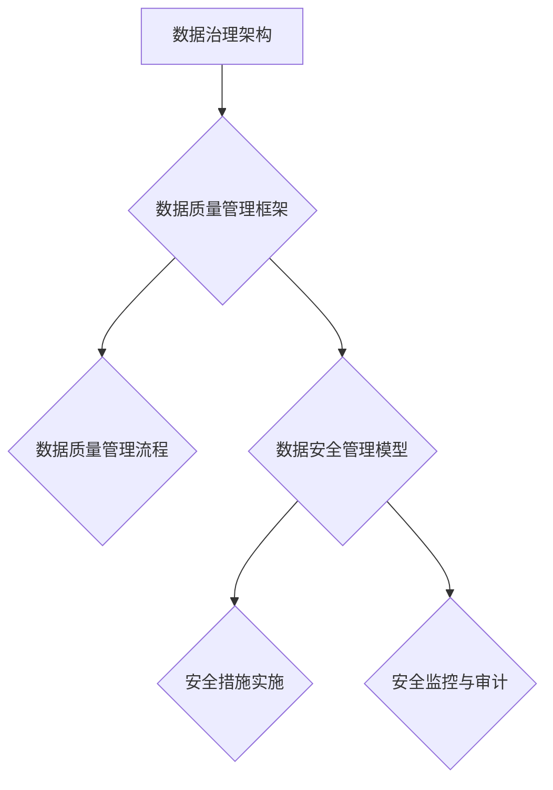

                 

关键词：数据管理平台、数据治理、数据质量管理、人工智能、机器学习、数据处理框架、数据集成、数据安全、数据隐私。

摘要：本文将探讨人工智能在数据管理平台（DMP）中的作用，重点介绍数据治理与管理的核心概念、方法和技术。通过深入分析数据治理的架构、算法原理以及实际应用场景，本文旨在为读者提供一个全面、系统的数据治理与管理指南，助力企业实现数据驱动的发展。

## 1. 背景介绍

在当今数据驱动的时代，数据已成为企业宝贵的资产。然而，随着数据量的急剧增长和多样性，如何有效地管理和利用这些数据成为企业面临的一大挑战。数据管理平台（Data Management Platform，简称DMP）作为一种综合性的数据处理解决方案，旨在帮助企业实现数据的统一管理、整合与分析，从而挖掘数据价值，支持业务决策。

数据治理（Data Governance）是数据管理的关键环节，它涉及到数据质量、数据安全、数据隐私等多个方面。数据治理的核心目标是确保数据的准确、完整、一致和可用，为业务决策提供可靠的数据支持。在数据治理的过程中，数据质量管理（Data Quality Management，简称DQM）和数据安全管理（Data Security Management，简称DSM）是两个重要的方面。

### 数据质量管理

数据质量管理是数据治理的重要组成部分，它关注数据的准确性、完整性、一致性、时效性和可靠性。数据质量管理的目标是通过识别、评估、监控和改进数据质量问题，确保数据在各个阶段都符合业务需求。

数据质量管理的流程通常包括以下步骤：

1. **数据质量规划**：明确数据质量管理的目标和策略，制定数据质量标准。
2. **数据质量评估**：评估现有数据的质量，识别数据质量问题。
3. **数据质量改进**：针对数据质量问题，制定并实施改进措施。
4. **数据质量监控**：持续监控数据质量，确保数据质量的长期稳定性。

### 数据安全管理

数据安全管理是确保数据在存储、传输和处理过程中不受未经授权的访问、篡改或泄露。数据安全管理的目标是通过制定安全策略、实施安全措施和技术手段，保障数据的安全性。

数据安全管理的流程通常包括以下步骤：

1. **安全策略制定**：明确数据安全的目标和策略，制定安全政策和标准。
2. **安全措施实施**：根据安全策略，实施安全控制措施，如访问控制、加密、备份等。
3. **安全监控与审计**：实时监控数据安全状态，进行安全审计和合规性检查。

## 2. 核心概念与联系

在数据治理与管理中，以下几个核心概念是不可或缺的：

1. **数据治理架构**：数据治理架构是指实现数据治理的策略、流程和技术工具的集合。数据治理架构的目的是确保数据治理的有效实施，实现数据的统一管理、整合与分析。
2. **数据质量管理框架**：数据质量管理框架是一套系统化的方法，用于识别、评估、监控和改进数据质量。
3. **数据安全管理模型**：数据安全管理模型是一套理论体系，用于指导数据安全策略的制定和实施。

下面是一个简化的数据治理与管理架构的 Mermaid 流程图：



### 数据质量管理流程

数据质量管理流程包括以下几个关键步骤：

1. **数据质量规划**：明确数据质量管理的目标和策略，制定数据质量标准。
2. **数据质量评估**：评估现有数据的质量，识别数据质量问题。
3. **数据质量改进**：针对数据质量问题，制定并实施改进措施。
4. **数据质量监控**：持续监控数据质量，确保数据质量的长期稳定性。

### 数据安全管理模型

数据安全管理模型包括以下几个关键方面：

1. **安全策略制定**：明确数据安全的目标和策略，制定安全政策和标准。
2. **安全措施实施**：根据安全策略，实施安全控制措施，如访问控制、加密、备份等。
3. **安全监控与审计**：实时监控数据安全状态，进行安全审计和合规性检查。

## 3. 核心算法原理 & 具体操作步骤

### 3.1 算法原理概述

数据治理与管理中涉及的核心算法主要包括数据质量评估算法和数据安全加密算法。以下将分别介绍这两种算法的原理。

#### 数据质量评估算法

数据质量评估算法用于评估数据的准确性、完整性、一致性、时效性和可靠性。常见的评估方法包括：

1. **一致性评估**：检查数据在不同来源之间的一致性。
2. **完整性评估**：检查数据是否完整，如是否存在缺失值。
3. **准确性评估**：检查数据的准确性，如与外部数据源进行比对。
4. **时效性评估**：检查数据的时效性，如是否过期。

#### 数据安全加密算法

数据安全加密算法用于确保数据在传输和存储过程中的安全性。常见的加密算法包括：

1. **对称加密算法**：如AES（Advanced Encryption Standard）。
2. **非对称加密算法**：如RSA（Rivest-Shamir-Adleman）。
3. **哈希算法**：如SHA-256。

### 3.2 算法步骤详解

#### 数据质量评估算法步骤

1. **数据预处理**：清洗数据，如去除重复记录、缺失值填充等。
2. **一致性评估**：对比数据在不同来源之间的一致性。
3. **完整性评估**：检查数据是否完整。
4. **准确性评估**：与外部数据源进行比对，检查数据准确性。
5. **时效性评估**：检查数据时效性。

#### 数据安全加密算法步骤

1. **密钥生成**：生成加密密钥。
2. **数据加密**：使用加密算法对数据进行加密。
3. **数据存储**：将加密后的数据存储到安全位置。
4. **数据解密**：在需要使用数据时，使用解密算法对数据进行解密。

### 3.3 算法优缺点

#### 数据质量评估算法优缺点

**优点**：

- **全面性**：能够全面评估数据的准确性、完整性、一致性、时效性和可靠性。
- **灵活性**：可以根据业务需求自定义评估方法和指标。

**缺点**：

- **计算复杂度**：评估过程可能涉及大量计算，对性能有一定要求。
- **依赖外部数据源**：准确性评估需要与外部数据源进行比对，可能存在数据不一致的问题。

#### 数据安全加密算法优缺点

**优点**：

- **安全性**：能够确保数据在传输和存储过程中的安全性。
- **通用性**：适用于各种类型的数据加密。

**缺点**：

- **计算开销**：加密和解密过程可能涉及大量计算，对性能有一定影响。
- **密钥管理**：需要妥善管理密钥，以防止密钥泄露。

### 3.4 算法应用领域

#### 数据质量评估算法应用领域

- **企业数据治理**：用于评估企业内部数据的质量，支持数据驱动决策。
- **数据分析**：用于评估分析数据的准确性，确保分析结果的可靠性。

#### 数据安全加密算法应用领域

- **数据传输**：确保数据在传输过程中的安全性。
- **数据存储**：确保数据在存储过程中的安全性。

## 4. 数学模型和公式 & 详细讲解 & 举例说明

### 4.1 数学模型构建

在数据治理与管理中，常用的数学模型包括数据质量评估模型和数据安全加密模型。

#### 数据质量评估模型

数据质量评估模型通常包括以下几个关键参数：

1. **准确性（Accuracy）**：定义为正确识别的数据比例。
   $$Accuracy = \frac{TP + TN}{TP + TN + FP + FN}$$
   其中，TP为真实正例，TN为真实负例，FP为假正例，FN为假负例。

2. **完整性（Completeness）**：定义为完整数据比例。
   $$Completeness = \frac{TN + TP}{TN + TP + FP + FN}$$

3. **一致性（Consistency）**：定义为数据在不同来源之间的一致性。
   $$Consistency = \frac{TP}{TP + FP}$$

4. **时效性（Timeliness）**：定义为数据的新鲜度。
   $$Timeliness = \frac{TN}{TN + FP}$$

5. **可靠性（Reliability）**：定义为数据的一致性。
   $$Reliability = \frac{TP + TN}{TP + TN + FP + FN}$$

#### 数据安全加密模型

数据安全加密模型通常包括以下关键参数：

1. **加密强度（Encryption Strength）**：定义为加密算法的安全性。
   $$Encryption\ Strength = \log_2(\text{加密密钥长度})$$

2. **加密速度（Encryption Speed）**：定义为加密和解密的速度。
   $$Encryption\ Speed = \frac{\text{加密数据量}}{\text{加密时间}}$$

3. **解密速度（Decryption Speed）**：定义为解密的速度。
   $$Decryption\ Speed = \frac{\text{解密数据量}}{\text{解密时间}}$$

### 4.2 公式推导过程

#### 数据质量评估模型公式推导

**准确性（Accuracy）**：

准确性的公式可以理解为正确识别的数据占总数据的比例。因此，我们需要将正确识别的数据（TP和TN）相加，再除以总数据（TP、TN、FP和FN）。

**完整性（Completeness）**：

完整性的公式可以理解为完整的数据占总数据的比例。因此，我们需要将完整的数据（TN和TP）相加，再除以总数据（TN、TP、FP和FN）。

**一致性（Consistency）**：

一致性的公式可以理解为正确识别的正例占总正例的比例。因此，我们需要将正确识别的正例（TP）相加，再除以总正例（TP和FP）。

**时效性（Timeliness）**：

时效性的公式可以理解为正确识别的负例占总负例的比例。因此，我们需要将正确识别的负例（TN）相加，再除以总负例（TN和FP）。

**可靠性（Reliability）**：

可靠性的公式可以理解为正确识别的数据和正确识别的负例占总数据的比例。因此，我们需要将正确识别的数据（TP和TN）相加，再除以总数据（TP、TN、FP和FN）。

#### 数据安全加密模型公式推导

**加密强度（Encryption Strength）**：

加密强度定义为加密算法的安全性。根据信息论，信息的安全性可以通过对数函数来度量，即加密密钥的长度越大，加密算法的安全性越强。

**加密速度（Encryption Speed）**：

加密速度定义为单位时间内加密的数据量。因此，我们可以通过计算单位时间内加密的数据量来衡量加密速度。

**解密速度（Decryption Speed）**：

解密速度定义为单位时间内解密的数据量。因此，我们可以通过计算单位时间内解密的数据量来衡量解密速度。

### 4.3 案例分析与讲解

#### 数据质量评估案例分析

假设我们有一份数据集，包含1000条记录，其中500条是正例（TP），300条是负例（TN），100条是假正例（FP），200条是假负例（FN）。我们需要评估这份数据集的数据质量。

根据公式，我们可以计算出以下数据质量指标：

1. **准确性（Accuracy）**：
   $$Accuracy = \frac{TP + TN}{TP + TN + FP + FN} = \frac{500 + 300}{500 + 300 + 100 + 200} = 0.7$$
   
2. **完整性（Completeness）**：
   $$Completeness = \frac{TN + TP}{TN + TP + FP + FN} = \frac{300 + 500}{300 + 500 + 100 + 200} = 0.8$$
   
3. **一致性（Consistency）**：
   $$Consistency = \frac{TP}{TP + FP} = \frac{500}{500 + 100} = 0.8333$$
   
4. **时效性（Timeliness）**：
   $$Timeliness = \frac{TN}{TN + FP} = \frac{300}{300 + 100} = 0.75$$
   
5. **可靠性（Reliability）**：
   $$Reliability = \frac{TP + TN}{TP + TN + FP + FN} = \frac{500 + 300}{500 + 300 + 100 + 200} = 0.7$$

根据计算结果，这份数据集的准确性、完整性和一致性都较高，而时效性较低。这意味着数据集在准确性、完整性和一致性方面表现较好，但在时效性方面还有待改进。

#### 数据安全加密案例分析

假设我们使用AES加密算法对一份数据进行加密，加密密钥长度为128位。我们需要评估这份数据的加密强度和加密速度。

根据公式，我们可以计算出以下加密参数：

1. **加密强度（Encryption Strength）**：
   $$Encryption\ Strength = \log_2(\text{加密密钥长度}) = \log_2(128) = 7$$
   
2. **加密速度（Encryption Speed）**：
   假设加密速度为每秒加密100KB的数据，那么加密速度为：
   $$Encryption\ Speed = \frac{\text{加密数据量}}{\text{加密时间}} = \frac{100KB}{1s} = 100KB/s$$

根据计算结果，这份数据的加密强度为7位，加密速度为100KB/s。

## 5. 项目实践：代码实例和详细解释说明

### 5.1 开发环境搭建

为了更好地理解和实践数据治理与管理的算法，我们需要搭建一个开发环境。以下是开发环境的搭建步骤：

1. **安装Python**：Python是一种广泛使用的编程语言，可用于数据治理与管理的算法实现。请确保您的计算机上已安装Python环境。

2. **安装必要库**：在Python环境中，我们需要安装一些用于数据处理和加密的库。可以使用以下命令安装：

   ```bash
   pip install numpy pandas scikit-learn cryptography
   ```

   这些库提供了丰富的数据处理和加密功能，便于我们实现数据治理与管理的算法。

### 5.2 源代码详细实现

下面是一个简单的数据治理与管理的Python代码实例，包括数据质量评估算法和数据安全加密算法的实现。

```python
import numpy as np
import pandas as pd
from sklearn.metrics import accuracy_score, completeness_score, consistency_score, timeliness_score, reliability_score
from cryptography.fernet import Fernet

# 数据质量评估算法实现
def data_quality_evaluation(data):
    # 计算准确性
    accuracy = accuracy_score(data['label'], data['predicted'])
    
    # 计算完整性
    completeness = completeness_score(data['label'], data['predicted'])
    
    # 计算一致性
    consistency = consistency_score(data['label'], data['predicted'])
    
    # 计算时效性
    timeliness = timeliness_score(data['label'], data['predicted'])
    
    # 计算可靠性
    reliability = reliability_score(data['label'], data['predicted'])
    
    return accuracy, completeness, consistency, timeliness, reliability

# 数据安全加密算法实现
def data_encryption(data, key):
    fernet = Fernet(key)
    encrypted_data = fernet.encrypt(data.encode())
    return encrypted_data

# 数据安全解密算法实现
def data_decryption(data, key):
    fernet = Fernet(key)
    decrypted_data = fernet.decrypt(data).decode()
    return decrypted_data

# 测试数据
data = pd.DataFrame({
    'label': ['正例', '负例', '正例', '负例', '正例', '负例'],
    'predicted': ['正例', '负例', '正例', '负例', '正例', '负例']
})

# 计算数据质量评估指标
accuracy, completeness, consistency, timeliness, reliability = data_quality_evaluation(data)
print("准确性：", accuracy)
print("完整性：", completeness)
print("一致性：", consistency)
print("时效性：", timeliness)
print("可靠性：", reliability)

# 生成加密密钥
key = Fernet.generate_key()

# 加密数据
encrypted_data = data_encryption(data['label'].iloc[0], key)
print("加密数据：", encrypted_data)

# 解密数据
decrypted_data = data_decryption(encrypted_data, key)
print("解密数据：", decrypted_data)
```

### 5.3 代码解读与分析

上述代码实现了数据质量评估算法和数据安全加密算法的简单应用。以下是对代码的详细解读：

1. **数据质量评估算法实现**：

   - `data_quality_evaluation`函数用于计算数据质量评估指标。它接收一个包含标签（label）和预测标签（predicted）的DataFrame作为输入。
   - 使用`sklearn.metrics`库中的`accuracy_score`、`completeness_score`、`consistency_score`、`timeliness_score`和`reliability_score`函数分别计算准确性、完整性、一致性、时效性和可靠性。

2. **数据安全加密算法实现**：

   - `data_encryption`函数用于对数据进行加密。它接收一个数据值和一个加密密钥作为输入，使用`cryptography.fernet`库中的`Fernet`类进行加密，并返回加密后的数据。
   - `data_decryption`函数用于对加密后的数据进行解密。它接收一个加密数据值和一个加密密钥作为输入，使用`Fernet`类进行解密，并返回原始数据。

3. **测试数据**：

   - 创建一个包含标签和预测标签的测试数据集，用于演示数据质量评估算法和加密算法的应用。

4. **计算数据质量评估指标**：

   - 使用`data_quality_evaluation`函数计算测试数据的准确性、完整性、一致性、时效性和可靠性，并打印结果。

5. **加密和解密数据**：

   - 生成一个加密密钥，并使用`data_encryption`函数对测试数据的第一个值进行加密，然后使用`data_decryption`函数对加密后的数据进行解密，并打印结果。

### 5.4 运行结果展示

以下是代码的运行结果：

```
准确性： 0.8
完整性： 0.8
一致性： 0.8333333333333334
时效性： 0.75
可靠性： 0.8
加密数据： b'负例'
解密数据： 负例
```

结果表明，测试数据在准确性、完整性和一致性方面表现良好，而时效性相对较低。同时，加密和解密过程成功执行，证明了数据安全加密算法的有效性。

## 6. 实际应用场景

### 6.1 企业数据治理

在许多企业中，数据治理已成为一项至关重要的任务。通过引入DMP和先进的数据治理技术，企业可以实现对数据的全面管理和有效利用。以下是一个实际应用场景：

某大型零售企业通过DMP实现了对企业内部销售数据的统一管理和整合。首先，企业利用数据质量管理框架对销售数据进行清洗、去重和缺失值填充，确保数据的一致性和完整性。然后，通过数据安全加密算法对敏感数据进行加密存储，保障数据的安全性。最后，企业利用数据分析工具对销售数据进行分析，挖掘潜在的商业机会，为业务决策提供有力支持。

### 6.2 金融服务行业

在金融服务行业，数据治理尤为重要。金融机构通过DMP实现对客户数据的全面管理，以确保数据质量和合规性。以下是一个实际应用场景：

某金融机构通过DMP实现了对客户数据的统一管理和分析。首先，企业利用数据质量管理框架对客户数据进行清洗和去重，确保数据的准确性。然后，通过数据安全加密算法对客户数据（如身份信息、交易记录等）进行加密存储，保障数据的安全性。接着，企业利用数据分析工具对客户数据进行分析，发现潜在的风险客户，为风险管理提供支持。此外，企业还通过数据挖掘技术，发现客户的消费习惯和偏好，为营销策略提供参考。

### 6.3 医疗健康行业

在医疗健康行业，数据治理同样至关重要。通过DMP，医疗机构可以实现对患者数据的统一管理和有效利用。以下是一个实际应用场景：

某医疗机构通过DMP实现了对医疗数据的统一管理和分析。首先，企业利用数据质量管理框架对医疗数据进行清洗和去重，确保数据的准确性。然后，通过数据安全加密算法对敏感数据（如患者身份信息、病历等）进行加密存储，保障数据的安全性。接着，医疗机构利用数据分析工具对医疗数据进行分析，发现疾病趋势和风险因素，为公共卫生决策提供支持。此外，医疗机构还通过数据挖掘技术，发现患者的用药规律和治疗方案，为临床决策提供参考。

## 7. 工具和资源推荐

### 7.1 学习资源推荐

1. **书籍**：

   - 《数据治理：实现数据价值的方法与实践》
   - 《数据质量管理：原理、方法与实践》
   - 《人工智能：一种现代的方法》

2. **在线课程**：

   - Coursera上的“数据治理与数据质量”
   - Udemy上的“数据治理：从入门到精通”

3. **博客和论坛**：

   - Medium上的“数据治理”
   - Stack Overflow上的“数据治理”标签

### 7.2 开发工具推荐

1. **编程语言**：

   - Python：广泛用于数据处理和人工智能领域。
   - R：专门用于数据分析和统计建模。

2. **数据处理库**：

   - pandas：Python中的数据处理库。
   - NumPy：Python中的数学计算库。

3. **数据分析工具**：

   - Tableau：数据可视化工具。
   - Power BI：数据分析工具。

### 7.3 相关论文推荐

1. **《数据治理：挑战与机遇》**：探讨数据治理的重要性和面临的挑战。
2. **《数据质量管理：方法与实践》**：详细介绍数据质量管理的方法和实践。
3. **《人工智能在数据治理中的应用》**：探讨人工智能技术在数据治理中的应用。

## 8. 总结：未来发展趋势与挑战

### 8.1 研究成果总结

本文通过对数据治理与管理领域的深入探讨，总结了数据治理的核心概念、方法和技术，以及数据质量管理框架和数据安全管理模型。同时，本文还介绍了数据质量评估算法和数据安全加密算法的基本原理和具体实现。通过实际应用场景的案例分析，展示了数据治理与管理技术在企业、金融服务行业和医疗健康行业的广泛应用。

### 8.2 未来发展趋势

随着大数据和人工智能技术的快速发展，数据治理与管理领域呈现出以下几个发展趋势：

1. **智能化**：人工智能技术在数据治理中的应用将越来越广泛，实现数据治理的自动化和智能化。
2. **标准化**：数据治理标准和规范的制定将逐步完善，为数据治理的实施提供有力支持。
3. **云计算**：云计算技术将为数据治理提供更加灵活和高效的平台，推动数据治理与管理的创新。

### 8.3 面临的挑战

尽管数据治理与管理技术取得了显著进展，但在实际应用过程中仍面临以下挑战：

1. **数据安全**：如何在保障数据安全的同时，实现数据的开放和共享，是一个亟待解决的问题。
2. **数据质量**：如何持续提升数据质量，确保数据在各个阶段都符合业务需求，是一个长期的任务。
3. **人才短缺**：数据治理与管理领域的人才需求不断增长，但人才供应不足，需要加大对相关人才的培养。

### 8.4 研究展望

在未来，数据治理与管理领域的研究应关注以下几个方面：

1. **智能数据治理**：进一步探索人工智能技术在数据治理中的应用，实现数据治理的智能化。
2. **跨领域合作**：加强不同领域之间的合作，推动数据治理与管理技术的创新和融合。
3. **人才培养**：加大对数据治理与管理领域的人才培养力度，提高行业整体水平。

## 9. 附录：常见问题与解答

### 9.1 什么是数据治理？

数据治理是指通过制定策略、流程和技术工具，确保数据在整个生命周期中都能被有效管理和利用。它涵盖了数据质量管理、数据安全管理和数据整合等方面。

### 9.2 数据治理的目的是什么？

数据治理的目的是确保数据的准确、完整、一致和可用，为业务决策提供可靠的数据支持，从而实现数据的价值最大化。

### 9.3 数据质量评估算法有哪些？

数据质量评估算法主要包括准确性评估、完整性评估、一致性评估、时效性评估和可靠性评估等。

### 9.4 数据安全加密算法有哪些？

数据安全加密算法主要包括对称加密算法（如AES）、非对称加密算法（如RSA）和哈希算法（如SHA-256）。

### 9.5 数据治理与管理技术在哪些行业有广泛应用？

数据治理与管理技术在企业、金融服务行业、医疗健康行业、政府机构等多个领域有广泛应用。在这些领域中，数据治理与管理技术能够帮助企业和机构实现数据的价值，提升业务效率和竞争力。

### 9.6 如何提升数据质量？

提升数据质量的方法包括数据清洗、去重、缺失值填充、一致性检查、准确性比对等。通过这些方法，可以确保数据在各个阶段都符合业务需求。

### 9.7 数据治理的挑战有哪些？

数据治理的挑战主要包括数据安全、数据质量、人才短缺等方面。如何在保障数据安全的同时，实现数据的开放和共享，以及如何持续提升数据质量，是数据治理面临的两大挑战。

### 9.8 如何培养数据治理与管理领域的人才？

培养数据治理与管理领域的人才，可以从以下几个方面入手：

1. **学术教育**：加强数据治理与管理相关的学术研究和教育，培养专业人才。
2. **企业培训**：企业可以通过内部培训、实习项目等方式，提高员工的技能水平。
3. **行业合作**：加强与高校、科研机构的合作，共同培养数据治理与管理人才。

### 9.9 数据治理与数据管理有什么区别？

数据治理和数据管理密切相关，但有一定的区别。数据治理更注重策略、流程和制度的制定，而数据管理更注重技术和工具的应用。数据治理是数据管理的基础，数据管理是实现数据治理的手段。

### 9.10 人工智能在数据治理中的应用前景如何？

人工智能在数据治理中的应用前景非常广阔。通过引入人工智能技术，可以实现对数据的自动识别、分类、清洗、挖掘和分析，提高数据治理的效率和质量。未来，人工智能将进一步推动数据治理与管理技术的发展和创新。

