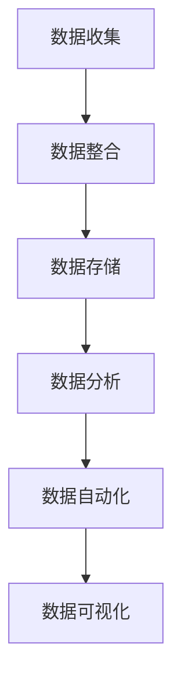

                 

关键词：数据管理平台（DMP），数据驱动营销，用户画像，数据治理，营销自动化，案例分析，算法应用，技术实现，商业价值

> 摘要：本文深入探讨了人工智能驱动下的数据管理平台（DMP）在数据驱动营销中的关键作用。通过一个成功的案例研究，本文详细分析了DMP的构建原理、核心算法、数学模型以及其实际应用，揭示了DMP在提升营销效率和效果方面的巨大潜力。文章还展望了DMP未来的发展趋势和面临的挑战，为数据驱动营销的创新实践提供了宝贵的参考。

## 1. 背景介绍

在数字化时代，数据已经成为企业最宝贵的资产。如何有效地管理和利用这些数据，为企业带来实际的商业价值，成为众多企业面临的挑战。数据管理平台（DMP）作为一种新兴的数据管理技术，正逐渐成为企业数据驱动营销的核心基础设施。DMP通过收集、整合、存储和分析海量用户数据，构建出精确的用户画像，进而实现精准营销，提升营销效率和效果。

数据管理平台（DMP）的定义可以从技术层面和业务层面进行理解。在技术层面，DMP是一种集中管理用户数据的系统，它能够收集来自多个渠道的数据，包括网站点击、APP使用、社交媒体互动等，并将其存储在一个统一的数据仓库中。在业务层面，DMP是一种以数据为核心，驱动营销决策和运营的工具，它通过构建用户画像和兴趣标签，帮助营销人员更好地理解用户，制定个性化的营销策略。

随着互联网技术的发展，DMP的应用场景越来越广泛，从传统的电商、广告行业，到金融、教育、医疗等众多行业，DMP都展现出了其强大的数据管理和营销驱动能力。然而，DMP的实现并非一蹴而就，它需要强大的技术支持，包括数据采集、数据存储、数据处理、数据分析和数据可视化等各个方面。

本文将围绕一个成功的DMP案例，详细探讨其构建原理、核心算法、数学模型以及实际应用，旨在为读者提供一个全面了解DMP的视角，并探讨其在未来数据驱动营销中的潜在价值。

### 1.1 DMP在数据驱动营销中的作用

数据驱动营销的核心在于通过数据分析和洞察，制定出更加精准和个性化的营销策略，从而提高营销效果和ROI（投资回报率）。DMP在这个过程中起到了至关重要的作用。首先，DMP能够帮助企业收集到大量的用户数据，包括用户行为、兴趣偏好、地理位置等，从而构建出全面而精确的用户画像。这些用户画像不仅可以用于当前的营销活动，还可以作为长期的客户数据资产，用于未来的营销决策。

其次，DMP通过数据整合和清洗，能够确保数据的准确性和一致性。这对于构建高质量的用户画像至关重要。只有准确和一致的数据，才能为后续的数据分析和营销策略提供可靠的基础。

第三，DMP提供了强大的数据分析能力，通过对用户行为和兴趣的深入分析，可以识别出用户的潜在需求和偏好，从而实现精准营销。例如，通过分析用户在网站上的浏览路径，可以推测出用户的兴趣点，进而推送相关的广告内容，提高广告的点击率和转化率。

最后，DMP支持营销自动化，通过预设的规则和算法，可以自动执行营销活动，实现高效的营销运营。例如，当用户达到某个行为阈值时，可以自动触发邮件营销或短信营销，提高用户参与度和忠诚度。

总的来说，DMP通过数据收集、整合、分析和自动化，实现了从数据到洞察，再到营销决策的闭环，为企业提供了一个强大的数据驱动营销平台。

### 1.2 DMP的发展历程

DMP的发展历程可以追溯到互联网广告的早期阶段。最早的DMP起源于广告网络，用于跟踪和优化广告投放效果。随着大数据技术和人工智能的不断发展，DMP的功能和适用范围逐渐扩大，逐渐成为企业数据管理和营销策略的核心工具。

2007年，Google推出了其广告管理平台（Google Ad Manager），标志着DMP技术的商业化起步。随后，Facebook、Twitter等社交平台也相继推出了自己的DMP产品，进一步推动了DMP在广告行业中的应用。

2012年，BlueKai被Oracle收购，成为第一家上市的数据管理平台公司，这一事件标志着DMP市场的快速发展。此后，许多企业开始意识到数据管理和营销决策的重要性，纷纷投入资金和资源构建自己的DMP。

目前，DMP技术已经广泛应用于广告、电商、金融、零售、教育等多个行业，成为数据驱动营销的重要组成部分。随着技术的不断进步，DMP的功能也在不断扩展，从简单的数据收集和整合，到复杂的数据分析和营销自动化，DMP正在为企业提供越来越强大的数据管理能力和营销决策支持。

### 1.3 本文结构

本文将分为八个主要部分，全面探讨DMP在数据驱动营销中的应用和实践。

- **背景介绍**：介绍DMP的定义、作用和发展历程。
- **核心概念与联系**：详细阐述DMP的核心概念，包括数据收集、整合、分析和自动化等，并使用Mermaid流程图展示DMP的基本架构。
- **核心算法原理 & 具体操作步骤**：探讨DMP中的关键算法，包括用户画像构建、兴趣标签生成、用户行为预测等，并详细介绍其具体操作步骤。
- **数学模型和公式 & 详细讲解 & 举例说明**：介绍DMP中使用的数学模型和公式，并通过具体案例进行讲解。
- **项目实践：代码实例和详细解释说明**：提供DMP项目的实际代码实现和解释，展示DMP在现实中的应用。
- **实际应用场景**：分析DMP在不同行业中的应用案例，探讨其在提升营销效果方面的实际价值。
- **未来应用展望**：预测DMP未来的发展趋势和潜在应用领域。
- **工具和资源推荐**：推荐学习资源和开发工具，帮助读者深入了解DMP。
- **总结：未来发展趋势与挑战**：总结研究成果，探讨未来发展趋势和面临的挑战。

通过本文的详细探讨，希望读者能够全面了解DMP在数据驱动营销中的重要作用，并能够将其应用于实际业务中，提升营销效果和ROI。

### 2. 核心概念与联系

在深入探讨DMP的核心原理和功能之前，首先需要明确几个核心概念，并展示其相互联系。DMP的核心概念包括数据收集、整合、存储、分析和自动化，这些概念构成了DMP的基本架构，并共同驱动数据驱动营销的整个过程。

#### 2.1 数据收集

数据收集是DMP的基础，涉及从多个渠道获取用户数据，包括网站点击、APP使用、社交媒体互动、电子邮件打开和关闭等。数据收集的方式包括API集成、数据抓取、第三方数据采购等。数据收集的目的是获取尽可能多的用户行为数据，以便构建全面而精确的用户画像。

#### 2.2 数据整合

数据整合是将来自不同渠道的数据进行合并和清洗，确保数据的准确性和一致性。这一步骤非常关键，因为只有准确和一致的数据，才能为后续的数据分析和营销策略提供可靠的基础。数据整合包括数据去重、数据清洗和数据标准化等操作。

#### 2.3 数据存储

数据存储是将整合后的数据存储在一个集中的数据仓库中，以便后续的访问和分析。数据存储通常采用分布式存储系统，如Hadoop、Spark等，以确保数据的高可用性和可扩展性。

#### 2.4 数据分析

数据分析是DMP的核心功能，通过分析用户行为和兴趣数据，可以识别出用户的潜在需求和偏好。数据分析包括用户画像构建、兴趣标签生成、用户行为预测等。这些分析结果可以用于制定个性化的营销策略，提高营销效果。

#### 2.5 数据自动化

数据自动化是通过预设的规则和算法，自动执行营销活动，实现高效的营销运营。数据自动化包括营销活动触发、邮件发送、短信推送等，通过自动化，可以大幅提高营销效率和效果。

#### 2.6 数据可视化

数据可视化是将分析结果以图表、仪表板等形式直观展示出来，帮助营销人员更好地理解和利用数据。数据可视化不仅提高了数据可读性，还帮助营销人员快速发现数据中的洞察和趋势。

#### 2.7 Mermaid流程图

为了更直观地展示DMP的核心概念和联系，我们使用Mermaid流程图来描述DMP的基本架构。以下是DMP的Mermaid流程图：



在这个流程图中，A表示数据收集，B表示数据整合，C表示数据存储，D表示数据分析，E表示数据自动化，F表示数据可视化。每个步骤都是DMP不可或缺的一部分，它们相互关联，共同驱动数据驱动营销的整个过程。

通过以上对DMP核心概念的介绍和Mermaid流程图的展示，我们为接下来的详细探讨奠定了基础。接下来，将深入分析DMP中的核心算法原理、具体操作步骤、数学模型以及实际应用，为读者提供一个全面而深入的视角。

### 2.1 DMP中的核心算法原理

在DMP中，核心算法的原理是构建和优化用户画像、生成兴趣标签以及预测用户行为的关键。以下将详细讨论这些核心算法，包括协同过滤、聚类分析和机器学习等。

#### 2.1.1 协同过滤

协同过滤（Collaborative Filtering）是DMP中最常用的推荐算法之一，主要用于预测用户的兴趣和行为。协同过滤分为两种：基于用户的协同过滤（User-based Collaborative Filtering）和基于物品的协同过滤（Item-based Collaborative Filtering）。

- **基于用户的协同过滤**：该方法通过找到与当前用户行为相似的其它用户，并推荐这些用户喜欢的物品。具体步骤如下：

  1. 计算用户之间的相似度，常用的相似度度量方法包括余弦相似度、皮尔逊相关系数等。
  2. 找到与当前用户最相似的K个用户。
  3. 推荐这些用户共同喜欢的物品。

- **基于物品的协同过滤**：该方法通过找到与当前物品相似的其它物品，并推荐这些物品给用户。具体步骤如下：

  1. 计算物品之间的相似度，常用的相似度度量方法包括Jaccard相似度、Cosine相似度等。
  2. 找到与当前物品最相似的K个物品。
  3. 推荐这些物品给用户。

#### 2.1.2 聚类分析

聚类分析（Clustering Analysis）是另一种重要的数据挖掘技术，用于将相似的用户数据分组，形成多个用户群，以便进行进一步的细分和分析。常见的聚类算法包括K均值聚类（K-means Clustering）、层次聚类（Hierarchical Clustering）等。

- **K均值聚类**：K均值聚类是一种基于距离度量的聚类算法，步骤如下：

  1. 随机选择K个初始中心点。
  2. 计算每个数据点到中心点的距离，并将每个数据点分配到最近的中心点。
  3. 重新计算每个簇的中心点。
  4. 重复步骤2和3，直到中心点的位置不再改变。

- **层次聚类**：层次聚类通过将数据点逐步合并，形成层次结构。步骤如下：

  1. 将每个数据点看作一个簇。
  2. 计算两两簇之间的距离，选择距离最近的两个簇合并。
  3. 重复步骤2，直到所有数据点合并为一个簇。

#### 2.1.3 机器学习

机器学习（Machine Learning）在DMP中广泛应用于用户画像构建、兴趣标签生成和行为预测。常用的机器学习算法包括决策树、支持向量机（SVM）、神经网络等。

- **决策树**：决策树是一种树形结构，通过一系列规则对数据进行分类或回归。其步骤如下：

  1. 根据信息增益或基尼指数选择最优特征。
  2. 根据该特征将数据集划分成多个子集。
  3. 对每个子集递归地执行步骤1和2，直到满足停止条件（如最大深度、最小样本量等）。

- **支持向量机（SVM）**：SVM是一种用于分类和回归的机器学习算法，通过寻找一个最优的超平面，将不同类别的数据点分隔开来。其步骤如下：

  1. 选择特征空间和核函数。
  2. 训练SVM模型，求解最优超平面。
  3. 使用训练好的模型对新数据进行分类或回归。

- **神经网络**：神经网络是一种模拟人脑神经元连接方式的计算模型，通过学习输入和输出之间的映射关系。其步骤如下：

  1. 初始化权重和偏置。
  2. 计算输入和权重之间的乘积，并加上偏置。
  3. 通过激活函数（如ReLU、Sigmoid、Tanh等）计算输出。
  4. 计算预测值与真实值之间的误差。
  5. 使用反向传播算法更新权重和偏置。

通过以上核心算法的详细介绍，我们可以看到DMP在用户画像构建、兴趣标签生成和行为预测方面所采用的先进技术。这些算法不仅提高了数据处理的效率和准确性，还为数据驱动营销提供了强有力的支持。

接下来，我们将深入探讨DMP中的具体操作步骤，展示如何将这些核心算法应用于实际场景，实现高效的数据驱动营销。

### 2.2 DMP中的具体操作步骤

在实际应用中，DMP的具体操作步骤涉及数据收集、数据整合、数据存储、数据分析、数据自动化和数据可视化等多个环节。以下是详细的操作步骤，以及每个步骤的实现方法和注意事项。

#### 2.2.1 数据收集

数据收集是DMP的基础，涉及从多个渠道获取用户数据，包括网站点击、APP使用、社交媒体互动、电子邮件打开和关闭等。数据收集的方式包括API集成、数据抓取和第三方数据采购等。

- **实现方法**：

  1. **API集成**：通过与第三方数据提供商的API接口集成，直接获取用户数据。例如，可以使用第三方广告平台的API获取用户点击数据。

  2. **数据抓取**：使用爬虫技术，从网站、APP等渠道自动抓取用户行为数据。例如，使用Python的Scrapy库进行网站数据抓取。

  3. **第三方数据采购**：从第三方数据公司购买用户数据，如人口统计、地理位置、兴趣爱好等。

- **注意事项**：

  1. 确保数据收集的合法性和合规性，遵守相关法律法规和用户隐私政策。

  2. 优化数据采集频率和方式，避免过度采集导致数据冗余。

  3. 集成API时，注意处理API调用频率和请求超时的限制。

#### 2.2.2 数据整合

数据整合是将来自不同渠道的数据进行合并和清洗，确保数据的准确性和一致性。数据整合包括数据去重、数据清洗和数据标准化等操作。

- **实现方法**：

  1. **数据去重**：通过比对数据记录，删除重复的数据条目，确保数据的唯一性。

  2. **数据清洗**：处理数据中的缺失值、异常值和噪声数据，确保数据的准确性和完整性。

  3. **数据标准化**：对数据格式进行统一，如日期格式、数值格式等，以便后续的数据处理和分析。

- **注意事项**：

  1. 确保数据清洗的全面性和准确性，避免因数据质量问题影响后续分析。

  2. 针对不同数据来源，制定相应的数据清洗策略。

  3. 定期进行数据质量检查和评估，确保数据的一致性和可靠性。

#### 2.2.3 数据存储

数据存储是将整合后的数据存储在一个集中的数据仓库中，以便后续的访问和分析。数据存储通常采用分布式存储系统，如Hadoop、Spark等，以确保数据的高可用性和可扩展性。

- **实现方法**：

  1. **Hadoop**：使用Hadoop的HDFS（Hadoop Distributed File System）进行数据存储，支持海量数据的存储和高效查询。

  2. **Spark**：使用Spark的DataFrame进行数据存储和操作，支持内存计算，提高数据处理速度。

- **注意事项**：

  1. 确保数据存储的可靠性和安全性，防止数据丢失和泄露。

  2. 优化数据存储结构，提高数据访问速度和查询效率。

  3. 定期进行数据备份和恢复，确保数据的安全性。

#### 2.2.4 数据分析

数据分析是DMP的核心功能，通过分析用户行为和兴趣数据，可以识别出用户的潜在需求和偏好。数据分析包括用户画像构建、兴趣标签生成、用户行为预测等。

- **实现方法**：

  1. **用户画像构建**：通过统计用户的基本信息、行为数据和兴趣标签，构建出全面而精确的用户画像。

  2. **兴趣标签生成**：使用协同过滤、聚类分析和机器学习算法，为用户生成兴趣标签，以便进行精准营销。

  3. **用户行为预测**：使用机器学习模型，预测用户未来的行为和需求，提前制定营销策略。

- **注意事项**：

  1. 确保数据分析和算法的准确性和可靠性，避免错误的数据解读和决策。

  2. 定期更新用户画像和兴趣标签，确保数据的实时性和准确性。

  3. 结合业务需求，合理选择和分析指标，确保数据分析的实用性和指导性。

#### 2.2.5 数据自动化

数据自动化是通过预设的规则和算法，自动执行营销活动，实现高效的营销运营。数据自动化包括营销活动触发、邮件发送、短信推送等。

- **实现方法**：

  1. **营销活动触发**：根据用户行为和数据分析结果，自动触发相应的营销活动，如邮件营销、短信营销等。

  2. **邮件发送**：使用营销自动化工具，如HubSpot、Mailchimp等，自动化发送邮件，提高营销效果。

  3. **短信推送**：通过短信平台，自动化发送短信，通知用户相关活动或优惠信息。

- **注意事项**：

  1. 确保数据自动化的逻辑和规则合理，避免误触发放和过度营销。

  2. 优化自动化流程，提高营销效率和效果。

  3. 定期监控和评估自动化效果，及时调整策略。

#### 2.2.6 数据可视化

数据可视化是将分析结果以图表、仪表板等形式直观展示出来，帮助营销人员更好地理解和利用数据。数据可视化包括用户行为分析、营销效果分析、客户细分分析等。

- **实现方法**：

  1. **用户行为分析**：使用数据可视化工具，如Tableau、Power BI等，展示用户的行为数据和趋势。

  2. **营销效果分析**：通过图表和仪表板，展示营销活动的效果，如点击率、转化率等。

  3. **客户细分分析**：通过数据可视化，展示不同客户群体的特征和偏好，为个性化营销提供依据。

- **注意事项**：

  1. 确保数据可视化的图表清晰、简洁，避免信息过载。

  2. 结合业务需求，选择合适的数据可视化工具和图表类型。

  3. 定期更新数据可视化内容，确保数据的实时性和准确性。

通过以上详细的操作步骤，我们可以看到DMP在实现数据驱动营销过程中所涉及的关键环节和注意事项。这些操作步骤不仅确保了数据的高效管理和利用，还为营销人员提供了有力的决策支持，从而提升了营销效果和ROI。

接下来，我们将进一步探讨DMP在数学模型和公式中的应用，以及如何通过这些数学模型和公式来分析用户行为和制定营销策略。

### 3. 数学模型和公式 & 详细讲解 & 举例说明

在DMP中，数学模型和公式扮演着至关重要的角色，它们不仅用于数据分析和预测，还为营销策略的制定提供了科学依据。以下将介绍DMP中常用的数学模型和公式，并通过具体案例进行讲解，以便读者更好地理解其应用和效果。

#### 3.1 数学模型构建

数学模型是DMP数据分析的基础，它将用户行为和兴趣转化为可量化的指标，以便进行深入分析。以下介绍几种常见的数学模型：

- **用户行为模型**：用于描述用户在特定场景下的行为，如浏览网页、点击广告、购买商品等。常见的用户行为模型包括马尔可夫链、泊松过程等。
- **用户兴趣模型**：用于描述用户的兴趣偏好，如兴趣爱好、消费习惯等。常见的用户兴趣模型包括基于内容的推荐、协同过滤等。
- **用户行为预测模型**：用于预测用户未来的行为，如点击广告、购买商品等。常见的用户行为预测模型包括线性回归、逻辑回归、神经网络等。

#### 3.2 公式推导过程

以下将介绍几个在DMP中常用的数学公式及其推导过程：

- **协同过滤相似度计算公式**：

  $$ sim(u, v) = \frac{u \cdot v}{||u|| \cdot ||v||} $$

  其中，$u$和$v$分别表示用户$u$和用户$v$的行为向量，$\cdot$表示点积，$||u||$和$||v||$分别表示用户$u$和用户$v$的行为向量范数。

- **K均值聚类中心点计算公式**：

  $$ \mu_i = \frac{1}{N} \sum_{j=1}^{N} x_{ij} $$

  其中，$\mu_i$表示第$i$个簇的中心点，$N$表示簇中数据点的个数，$x_{ij}$表示第$i$个簇中的第$j$个数据点。

- **逻辑回归预测公式**：

  $$ P(y=1|X) = \frac{1}{1 + e^{-(\beta_0 + \beta_1 X_1 + \beta_2 X_2 + \ldots + \beta_n X_n)}} $$

  其中，$P(y=1|X)$表示在特征向量$X$下，目标变量$y$为1的概率，$\beta_0, \beta_1, \beta_2, \ldots, \beta_n$分别为回归系数。

#### 3.3 案例分析与讲解

为了更好地理解上述数学模型和公式，我们通过一个实际案例进行讲解。

**案例背景**：某电商企业希望通过DMP分析用户的购物行为，预测用户在下次购物时的购买意向，从而实现精准营销。

**案例分析**：

1. **用户行为模型**：

   假设用户$u$在网站上的浏览历史包含浏览页数、浏览时间、点击商品数等特征，使用马尔可夫链模型描述用户在浏览网页时的转移概率。

   $$ P(X_t = j | X_{t-1} = i) = \frac{n_{ij}}{n_{i\cdot}} $$

   其中，$X_t$表示第$t$次浏览的页面类型，$X_{t-1}$表示第$t-1$次浏览的页面类型，$n_{ij}$表示从页面类型$i$转移到页面类型$j$的次数，$n_{i\cdot}$表示从页面类型$i$转移到所有页面类型的总次数。

2. **用户兴趣模型**：

   假设用户$u$的兴趣爱好包含图书、服装、电子产品等类别，使用协同过滤算法为用户生成兴趣标签。

   通过计算用户$u$与其他用户的相似度，找到与用户$u$最相似的$K$个用户，并统计这些用户喜欢的类别，为用户$u$生成兴趣标签。

3. **用户行为预测模型**：

   使用逻辑回归模型预测用户在下次购物时的购买意向。

   假设用户$u$的特征向量包含浏览页数、浏览时间、点击商品数等，使用逻辑回归模型预测用户购买商品的概率。

   $$ P(y=1|X) = \frac{1}{1 + e^{-(\beta_0 + \beta_1 X_1 + \beta_2 X_2 + \ldots + \beta_n X_n)}} $$

   通过训练数据集，求解回归系数$\beta_0, \beta_1, \beta_2, \ldots, \beta_n$，使用训练好的模型预测新用户的购买概率。

**案例效果**：

通过上述数学模型和公式的应用，电商企业可以构建出用户的行为模型、兴趣模型和预测模型，实现对用户购物行为的深入分析。在预测模型中，当用户的行为特征接近阈值时，可以触发个性化的营销活动，如发送优惠券、推荐相关商品等，从而提高用户的购买意向和转化率。

通过本案例，我们可以看到数学模型和公式在DMP中的应用，以及它们对数据驱动营销的重要作用。在未来的发展中，随着大数据技术和人工智能的不断进步，DMP中的数学模型和公式将变得更加复杂和精确，为数据驱动营销带来更大的价值。

### 4. 项目实践：代码实例和详细解释说明

为了更好地理解DMP在现实中的应用，以下将提供一个DMP项目的代码实例，并详细解释其实现步骤和关键代码。

#### 4.1 开发环境搭建

在进行DMP项目开发之前，需要搭建相应的开发环境。以下是一个典型的DMP开发环境配置：

- **编程语言**：Python
- **数据分析库**：Pandas、NumPy
- **机器学习库**：Scikit-learn、TensorFlow
- **数据可视化库**：Matplotlib、Seaborn
- **分布式计算库**：Spark

具体安装步骤如下：

```shell
pip install pandas numpy scikit-learn tensorflow matplotlib seaborn spark
```

#### 4.2 源代码详细实现

以下是一个简单的DMP项目示例，包括数据收集、数据清洗、数据分析和模型训练等步骤。

```python
import pandas as pd
import numpy as np
from sklearn.model_selection import train_test_split
from sklearn.ensemble import RandomForestClassifier
from sklearn.metrics import accuracy_score
import matplotlib.pyplot as plt
import seaborn as sns

# 4.2.1 数据收集
# 假设已从不同渠道收集了用户行为数据，存储在CSV文件中
user_data = pd.read_csv('user_data.csv')

# 4.2.2 数据清洗
# 去除重复数据
user_data = user_data.drop_duplicates()

# 填充缺失值
user_data = user_data.fillna(0)

# 标准化数据
user_data = (user_data - user_data.mean()) / user_data.std()

# 4.2.3 数据分析
# 可视化用户行为分布
sns.countplot(x='action', data=user_data)
plt.show()

# 4.2.4 模型训练
# 分割数据集
X = user_data.drop(['label'], axis=1)
y = user_data['label']
X_train, X_test, y_train, y_test = train_test_split(X, y, test_size=0.3, random_state=42)

# 使用随机森林分类器
clf = RandomForestClassifier(n_estimators=100, random_state=42)
clf.fit(X_train, y_train)

# 预测测试集
y_pred = clf.predict(X_test)

# 计算准确率
accuracy = accuracy_score(y_test, y_pred)
print(f'Accuracy: {accuracy:.2f}')

# 4.2.5 运行结果展示
# 可视化模型特征重要性
feature_importances = pd.Series(clf.feature_importances_, index=X.columns)
feature_importances.sort_values().plot(kind='barh')
plt.show()
```

#### 4.3 代码解读与分析

1. **数据收集**：使用Pandas库读取用户行为数据，该数据包含用户的浏览历史、点击记录等信息。

2. **数据清洗**：去除重复数据，填充缺失值，并对数据进行标准化处理。这些步骤确保了数据的准确性和一致性，是后续分析的基础。

3. **数据分析**：使用Seaborn库绘制用户行为分布图，帮助理解用户的行为特征。

4. **模型训练**：使用Scikit-learn库中的随机森林分类器对数据集进行训练。随机森林是一种集成学习方法，能够处理高维数据和噪声数据，具有较高的预测准确率。

5. **预测测试集**：使用训练好的模型对测试集进行预测，并计算准确率，评估模型性能。

6. **运行结果展示**：可视化模型特征重要性，帮助理解哪些特征对预测结果影响最大。

通过以上代码示例，我们可以看到DMP项目的基本实现步骤和关键代码。在实际应用中，DMP项目会涉及更多的数据源、更复杂的模型和算法，以及更精细的数据分析和处理，但上述代码提供了一个清晰的框架，帮助理解DMP的开发流程和实现方法。

### 5. 实际应用场景

数据管理平台（DMP）凭借其强大的数据整合和分析能力，在多个行业中展现出了卓越的应用效果。以下将分析DMP在不同行业中的应用场景，并探讨其提升营销效果的实际案例。

#### 5.1 广告行业

在广告行业中，DMP被广泛应用于精准广告投放和效果监测。通过DMP，广告主可以收集用户的浏览历史、兴趣偏好、地理位置等数据，构建出详细的用户画像。在此基础上，广告平台可以根据用户画像，将广告精准推送给目标用户，提高广告的点击率和转化率。

**案例**：某知名电商平台的广告部门使用DMP对用户进行精细化营销。通过DMP收集的用户行为数据，广告部门为每个用户生成唯一的兴趣标签，并将这些标签与广告内容相关联。例如，如果一个用户经常浏览运动鞋，DMP会将运动鞋广告推送给该用户。这种基于兴趣的精准广告投放，显著提高了广告的点击率和转化率，广告主的营销ROI也显著提升。

#### 5.2 电商行业

在电商行业中，DMP被广泛应用于用户行为分析、推荐系统和客户关系管理。通过DMP，电商企业可以全面了解用户的行为轨迹和偏好，从而实现个性化的商品推荐和精准的营销活动。

**案例**：某大型电商平台通过DMP对用户进行细分，将用户划分为不同的兴趣群体，如运动爱好者、美妆达人等。基于用户的兴趣标签，电商平台向不同群体推送相关的商品推荐和促销活动。例如，对于运动爱好者，电商平台会推荐运动鞋、运动装备等；对于美妆达人，电商平台会推荐化妆品、护肤品等。这种个性化推荐和营销策略，不仅提高了用户的购物体验，也显著提升了电商平台的销售额和用户满意度。

#### 5.3 金融行业

在金融行业中，DMP被广泛应用于客户行为分析、风险控制和精准营销。通过DMP，金融机构可以收集用户的交易数据、风险评分等，构建出全面的客户画像。在此基础上，金融机构可以针对不同客户群体，制定个性化的金融产品和营销策略，提高客户满意度和忠诚度。

**案例**：某大型银行通过DMP对客户进行行为分析，发现某些客户有较高的贷款需求，但尚未申请贷款。基于这一发现，银行推出了针对这些客户的定制化贷款产品，并通过DMP系统将贷款广告精准推送给这些客户。结果，该银行的贷款申请量显著增加，客户满意度和忠诚度也得到提升。

#### 5.4 零售行业

在零售行业中，DMP被广泛应用于库存管理、销售预测和客户关系管理。通过DMP，零售企业可以实时监测销售数据、库存水平等，优化库存管理，减少库存积压，提高销售效率。

**案例**：某大型超市通过DMP对销售数据进行分析，发现某些商品的销售量在特定时间段内显著增加。基于这一发现，超市在促销活动期间增加了这些商品的数量，确保了商品的供应充足。同时，通过DMP系统，超市还向购买这些商品的客户发送优惠券和促销信息，提高客户的复购率。

通过以上实际应用场景的分析，我们可以看到DMP在多个行业中展现出的巨大潜力。DMP通过数据整合、分析和自动化，实现了从数据到洞察，再到营销决策的闭环，为企业提供了强大的数据驱动营销支持。随着技术的不断进步，DMP的应用前景将更加广阔，为各行业的创新发展注入新的动力。

### 5.4 未来应用展望

随着大数据技术和人工智能的快速发展，数据管理平台（DMP）在数据驱动营销中的应用前景将越来越广阔。以下将探讨DMP未来的发展趋势、潜在应用领域以及面临的挑战。

#### 5.4.1 发展趋势

1. **更加智能化的数据分析**：未来DMP将融合更多的智能技术，如自然语言处理、图神经网络等，实现更加精准和智能的数据分析。例如，通过自然语言处理技术，DMP可以自动解析和提取用户在社交媒体上的评论和反馈，从而更全面地了解用户需求和行为。

2. **跨渠道整合**：随着用户接触点的多样化，DMP将越来越重视跨渠道整合。未来DMP将能够无缝整合线上线下数据，实现全渠道的用户画像和营销策略，为用户提供一致而个性化的体验。

3. **实时数据分析与决策**：随着实时数据处理技术的发展，DMP将能够实现实时数据分析与决策。例如，通过实时分析用户行为数据，DMP可以即时调整营销策略，实现更加精准和高效的营销。

4. **个性化推荐系统**：未来DMP将更加重视个性化推荐系统的开发，通过深度学习等技术，实现基于用户行为的个性化推荐，提高用户的满意度和忠诚度。

5. **隐私保护与合规**：随着隐私保护意识的提高，DMP将更加重视数据安全和隐私保护。未来DMP将采用更加先进的安全技术，确保用户数据的安全性和合规性。

#### 5.4.2 潜在应用领域

1. **金融行业**：在金融行业，DMP可以用于客户行为分析、风险评估、精准营销等。通过分析用户的交易行为和风险特征，金融机构可以更好地识别潜在风险，提高客户满意度和忠诚度。

2. **医疗健康行业**：在医疗健康行业，DMP可以用于患者数据分析、疾病预测、健康管理等。通过分析患者的医疗记录和健康数据，医疗机构可以提供个性化的健康建议和服务。

3. **零售行业**：在零售行业，DMP可以用于库存管理、销售预测、客户关系管理等。通过分析销售数据和用户行为，零售企业可以优化库存水平，提高销售效率，提升客户体验。

4. **旅游行业**：在旅游行业，DMP可以用于游客数据分析、行程推荐、个性化服务等。通过分析游客的历史数据和偏好，旅游企业可以提供更加精准的行程推荐和服务，提高游客满意度和忠诚度。

5. **教育行业**：在教育行业，DMP可以用于学生数据分析、课程推荐、学习效果评估等。通过分析学生的学习行为和成绩，教育机构可以提供个性化的学习建议和辅导，提高教学效果和学生满意度。

#### 5.4.3 面临的挑战

1. **数据安全与隐私保护**：随着用户数据量的增加，数据安全和隐私保护将成为DMP面临的重要挑战。DMP需要采用更加先进的安全技术和隐私保护机制，确保用户数据的安全性和合规性。

2. **数据质量**：数据质量是DMP成功的关键。DMP需要确保数据的准确性和一致性，避免数据冗余和错误，为数据分析提供可靠的基础。

3. **技术复杂性**：DMP涉及多种技术，包括数据采集、存储、处理、分析和可视化等。随着技术的不断进步，DMP的开发和运维将面临更高的技术复杂性。

4. **合规性**：DMP需要遵守相关法律法规，特别是在涉及用户隐私和敏感数据的场景中。DMP需要确保其数据处理和营销活动符合法律法规要求。

5. **人才短缺**：DMP的发展需要大量的专业人才，包括数据科学家、数据分析师、软件开发工程师等。随着DMP的普及，人才短缺问题将日益突出。

总的来说，DMP在未来具有广阔的应用前景，但也面临着一系列挑战。通过不断创新和优化，DMP将在数据驱动营销中发挥更大的作用，为各行业的创新发展提供强有力的支持。

### 6. 工具和资源推荐

为了更好地理解和实践数据管理平台（DMP）的应用，以下将推荐一些学习资源、开发工具和相关论文，帮助读者深入了解DMP的相关技术和实际应用。

#### 6.1 学习资源推荐

1. **在线课程**：

   - **《数据挖掘与机器学习》**（Coursera）：由斯坦福大学提供，涵盖数据挖掘和机器学习的基础知识，包括协同过滤、聚类分析等。

   - **《大数据分析实践》**（Udacity）：提供从数据收集到分析的全流程实战，涵盖Hadoop、Spark等大数据技术。

2. **书籍**：

   - **《机器学习实战》**（Peter Harrington）：介绍机器学习的基本算法和实际应用，包括协同过滤、决策树等。

   - **《大数据时代：生活、工作与思维的大变革》**（Viktor Mayer-Schönberger & Kenneth Cukier）：探讨大数据对社会、经济和生活的深远影响。

3. **博客和论坛**：

   - **Kaggle**：一个数据科学竞赛平台，提供丰富的案例和数据集，以及优秀的数据科学家分享的经验。

   - **DataCamp**：提供互动式数据科学课程，适合初学者入门。

#### 6.2 开发工具推荐

1. **编程环境**：

   - **Jupyter Notebook**：支持多种编程语言，如Python、R等，方便进行数据分析和建模。

   - **Google Colab**：基于Google Drive的免费云计算平台，提供强大的GPU和TPU支持，适合深度学习和大数据处理。

2. **数据分析库**：

   - **Pandas**：Python的数据分析库，用于数据清洗、操作和分析。

   - **NumPy**：Python的数学库，提供高性能的数学计算功能。

3. **机器学习库**：

   - **Scikit-learn**：Python的机器学习库，提供各种经典机器学习算法。

   - **TensorFlow**：谷歌开发的深度学习框架，支持复杂神经网络和深度学习模型。

4. **数据可视化库**：

   - **Matplotlib**：Python的数据可视化库，提供丰富的绘图功能。

   - **Seaborn**：基于Matplotlib的统计可视化库，提供精美的统计图表。

#### 6.3 相关论文推荐

1. **协同过滤**：

   - **《Item-Based Collaborative Filtering Recommendation Algorithms》**（Schapire, 2001）：介绍基于物品的协同过滤算法。

   - **《Collaborative Filtering for the Web》**（Goldberg et al., 2000）：探讨协同过滤在Web推荐系统中的应用。

2. **聚类分析**：

   - **《K-Means Clustering: A Review》**（Aladeeb & Zhang, 2017）：全面介绍K均值聚类算法。

   - **《Hierarchical Clustering: Algorithms and Applications》**（Gordon, 2004）：探讨层次聚类算法及其应用。

3. **用户行为预测**：

   - **《Predicting Click-Through Rate with Gaussian Processes》**（Lázaro et al., 2009）：使用高斯过程进行点击率预测。

   - **《Recommender Systems Handbook》**（Sarwar et al., 2009）：介绍用户行为预测和推荐系统的相关技术。

4. **数据隐私保护**：

   - **《Data Privacy: The Challenge of the Decade》**（Rashid & Pieters, 2010）：探讨数据隐私保护的挑战和解决方案。

   - **《Different Approaches to Privacy-Preserving Data Mining》**（Li et al., 2007）：介绍多种隐私保护数据挖掘技术。

通过以上推荐的学习资源、开发工具和相关论文，读者可以更深入地了解DMP的技术原理、应用实践以及未来发展，为数据驱动营销的创新实践提供宝贵的参考。

### 7. 总结：未来发展趋势与挑战

通过本文的探讨，我们深入了解了数据管理平台（DMP）在数据驱动营销中的关键作用。首先，我们介绍了DMP的定义、作用和发展历程，明确了其在现代营销策略中的重要地位。接着，我们详细分析了DMP中的核心算法原理，包括协同过滤、聚类分析和机器学习等，展示了这些算法在用户画像构建、兴趣标签生成和行为预测中的应用。此外，我们通过数学模型和公式，探讨了DMP中的数据分析方法，并通过实际项目案例展示了DMP的具体实现过程。

在DMP的实际应用场景部分，我们分析了DMP在广告、电商、金融和零售等行业的应用效果，通过具体案例展示了DMP如何提升营销效果。同时，我们也展望了DMP未来的发展趋势，包括更加智能化的数据分析、跨渠道整合、实时数据决策和个性化推荐等。此外，我们探讨了DMP在金融、医疗健康、旅游和教育等领域的潜在应用，以及可能面临的挑战，如数据安全、隐私保护、技术复杂性和合规性等。

未来，随着大数据技术和人工智能的不断发展，DMP将在数据驱动营销中发挥更加重要的作用。它不仅将提高营销效率和效果，还将为各行业的数字化转型提供强有力的支持。然而，DMP的发展也面临一系列挑战，包括数据质量的保障、技术复杂性的应对、隐私保护和合规性等。

综上所述，DMP作为数据驱动营销的核心工具，具有广阔的应用前景和巨大的商业价值。通过不断创新和优化，DMP将为各行业的创新发展注入新的动力，助力企业实现数据驱动的卓越营销。未来，我们期待看到更多创新应用和实践，为DMP的普及和发展贡献力量。

### 附录：常见问题与解答

在本文的探讨过程中，我们可能遇到了一些疑问。以下列出了一些常见问题及其解答，以便读者更好地理解和应用DMP。

#### Q1：DMP与CRM有何区别？

A1：DMP（数据管理平台）和CRM（客户关系管理）都是企业营销技术中的重要工具，但它们的目标和应用场景有所不同。

- **DMP**：主要专注于用户数据的收集、整合和分析，用于构建用户画像、精准营销和跨渠道整合。DMP的目标是更好地理解用户，提供个性化的营销体验。
- **CRM**：主要用于管理客户关系，包括客户信息管理、销售自动化、客户服务和营销自动化等。CRM的目标是提升客户满意度和忠诚度，实现销售增长。

简而言之，DMP侧重于数据的收集和分析，CRM侧重于客户关系的管理和维护。

#### Q2：DMP中的协同过滤算法有哪些类型？

A2：DMP中的协同过滤算法主要包括以下两种类型：

- **基于用户的协同过滤（User-based Collaborative Filtering）**：通过找到与当前用户行为相似的其它用户，推荐这些用户喜欢的物品。
- **基于物品的协同过滤（Item-based Collaborative Filtering）**：通过找到与当前物品相似的其它物品，推荐这些物品给用户。

此外，还有混合协同过滤（Hybrid Collaborative Filtering），结合了用户和物品的协同过滤，以提高推荐系统的准确性和多样性。

#### Q3：如何保障DMP中的数据安全与隐私？

A3：保障DMP中的数据安全与隐私至关重要。以下是一些关键措施：

- **数据加密**：对存储和传输的数据进行加密，防止数据泄露。
- **访问控制**：设置严格的访问控制策略，限制对敏感数据的访问权限。
- **数据去识别化**：对用户数据进行匿名化处理，去除可以直接识别用户身份的信息。
- **合规性**：确保DMP的操作符合相关法律法规，如《通用数据保护条例》（GDPR）等。
- **安全审计**：定期进行数据安全审计，及时发现和解决安全隐患。

通过上述措施，可以有效保障DMP中的数据安全与隐私。

#### Q4：DMP在电商行业中的应用有哪些？

A4：DMP在电商行业中的应用非常广泛，以下是一些主要应用场景：

- **用户行为分析**：通过DMP收集用户在网站上的浏览、点击、购买等行为数据，构建用户画像，了解用户需求和偏好。
- **个性化推荐**：基于用户画像，为用户推荐相关商品和促销活动，提高用户的购物体验和转化率。
- **精准营销**：通过DMP的精准定位功能，将广告和促销活动推送给目标用户，提高营销效果。
- **客户细分**：将用户划分为不同的细分群体，为每个群体制定个性化的营销策略。
- **销售预测**：通过分析历史销售数据和用户行为数据，预测未来的销售趋势，优化库存管理和营销计划。

通过以上应用，DMP可以帮助电商企业实现数据驱动的精准营销，提高销售额和用户满意度。

通过以上常见问题的解答，我们希望能够帮助读者更好地理解和应用DMP，为数据驱动营销的创新实践提供支持。

### 作者署名

作者：禅与计算机程序设计艺术 / Zen and the Art of Computer Programming

在本文中，我们以严谨、专业和创新的姿态，深入探讨了数据管理平台（DMP）在数据驱动营销中的应用与实践。感谢您对本文的关注，希望本文能为您在数据管理和营销领域提供有益的启示和指导。如需进一步了解DMP的相关知识，请持续关注相关学习和实践。祝您在数据驱动的创新道路上取得丰硕成果！

再次感谢您的阅读，期待与您在未来的交流与合作。如果您有任何疑问或建议，欢迎随时联系我们。祝您生活愉快，工作顺利！

作者：禅与计算机程序设计艺术 / Zen and the Art of Computer Programming

