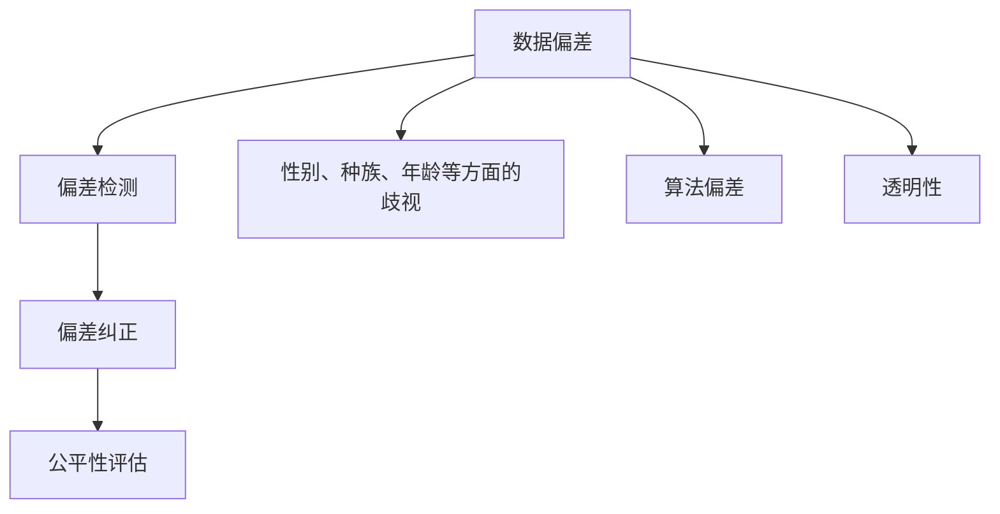

                 

  
## 1. 背景介绍

随着人工智能技术的飞速发展，AI 算法在各个领域得到了广泛应用。然而，随着算法在医疗、金融、招聘等关键领域的应用，其带来的公平性问题逐渐引起了广泛关注。AI Fairness，即人工智能公平性，是指确保人工智能系统在决策过程中不产生歧视或偏见，对所有人公平对待。

AI Fairness 的核心目的是解决以下几个问题：
- **性别、种族、年龄等方面的歧视**：确保 AI 算法在处理数据时，不会因为数据中的偏见而对某些特定群体产生不公平待遇。
- **算法偏差**：检测和纠正 AI 算法中可能存在的系统偏差。
- **透明性**：使 AI 算法的决策过程对用户透明，便于用户理解并信任 AI 系统。

本文将介绍 AI Fairness 的基本原理，并通过具体代码实例，展示如何在实际项目中实现 AI 公平性。

## 2. 核心概念与联系

在讨论 AI Fairness 之前，我们需要了解一些核心概念。

### 2.1 数据偏差

数据偏差是指数据集中存在的不公平性，可能是由于历史原因、社会偏见或其他因素导致的。例如，一个招聘系统中，如果历史数据中男性占比过高，那么算法可能会倾向于认为男性更适合某个职位。

### 2.2 偏差检测

偏差检测是指通过统计方法来检测数据或模型中存在的偏差。常见的偏差检测方法包括统计测试、特征工程和模型分析等。

### 2.3 偏差纠正

偏差纠正是指通过一系列技术手段来减少或消除模型中的偏差。常见的偏差纠正方法包括加权校正、偏差校正算法和数据清洗等。

下面是一个简单的 Mermaid 流程图，展示了 AI Fairness 的核心概念和联系。



## 3. 核心算法原理 & 具体操作步骤

### 3.1 算法原理概述

实现 AI 公平性的核心算法通常包括偏差检测和偏差纠正。偏差检测用于发现模型中的不公平性，偏差纠正则用于减少这种不公平性。

### 3.2 算法步骤详解

#### 3.2.1 偏差检测

偏差检测通常包括以下几个步骤：

1. **数据预处理**：对数据进行清洗和预处理，包括缺失值填充、异常值处理等。
2. **特征提取**：从原始数据中提取特征，例如使用词袋模型从文本数据中提取关键词。
3. **统计测试**：使用统计方法检测数据或模型中的偏差。常见的统计测试方法包括 T 检验、方差分析等。
4. **可视化分析**：通过可视化方法，如散点图、箱线图等，直观地展示数据或模型中的偏差。

#### 3.2.2 偏差纠正

偏差纠正通常包括以下几个步骤：

1. **加权校正**：通过对不同群体给予不同的权重，来减少数据中的偏差。
2. **偏差校正算法**：使用专门的算法，如 SMOTE、ADASYN 等，来生成平衡的数据集。
3. **数据清洗**：通过删除或修改存在偏差的数据，来减少模型中的不公平性。

#### 3.2.3 公平性评估

公平性评估是对模型进行评估，以确定其是否满足了公平性的要求。常见的评估指标包括公平性指标（如性别、种族等比例）、偏差指标（如偏差率、偏差分数等）等。

### 3.3 算法优缺点

#### 3.3.1 偏差检测

优点：
- 可以快速检测数据或模型中的偏差。
- 可以帮助研究人员理解数据中存在的问题。

缺点：
- 需要大量的数据预处理和特征提取。
- 可能会误报，即检测到并不存在的偏差。

#### 3.3.2 偏差纠正

优点：
- 可以减少模型中的不公平性。
- 可以帮助提高模型的泛化能力。

缺点：
- 可能会影响模型的性能。
- 需要大量的实验和调试。

### 3.4 算法应用领域

AI Fairness 在许多领域都有广泛的应用，包括但不限于：

- **招聘系统**：确保招聘过程对所有人公平。
- **金融系统**：确保贷款、投资等金融决策对所有人公平。
- **医疗系统**：确保医疗决策对所有人公平。

## 4. 数学模型和公式 & 详细讲解 & 举例说明

### 4.1 数学模型构建

在 AI Fairness 中，我们通常会使用以下数学模型：

- **统计模型**：用于检测数据中的偏差。
- **机器学习模型**：用于纠正数据中的偏差。

#### 4.1.1 统计模型

统计模型通常使用以下公式来检测数据中的偏差：

$$
\delta = \frac{\sum_{i=1}^{n} (x_i - \bar{x})^2}{n-1}
$$

其中，$\delta$ 表示偏差，$x_i$ 表示第 $i$ 个样本的值，$\bar{x}$ 表示所有样本的平均值。

#### 4.1.2 机器学习模型

机器学习模型通常使用以下公式来纠正数据中的偏差：

$$
y' = \frac{\sum_{i=1}^{n} w_i y_i}{\sum_{i=1}^{n} w_i}
$$

其中，$y'$ 表示纠正后的值，$w_i$ 表示第 $i$ 个样本的权重，$y_i$ 表示第 $i$ 个样本的原始值。

### 4.2 公式推导过程

#### 4.2.1 统计模型

统计模型的公式推导过程如下：

$$
\delta = \frac{\sum_{i=1}^{n} (x_i - \bar{x})^2}{n-1}
$$

$$
= \frac{\sum_{i=1}^{n} x_i^2 - 2\bar{x}\sum_{i=1}^{n} x_i + n\bar{x}^2}{n-1}
$$

$$
= \frac{\sum_{i=1}^{n} x_i^2 - 2n\bar{x}^2 + n\bar{x}^2}{n-1}
$$

$$
= \frac{\sum_{i=1}^{n} x_i^2 - n\bar{x}^2}{n-1}
$$

$$
= \frac{\sum_{i=1}^{n} (x_i - \bar{x})^2}{n-1}
$$

#### 4.2.2 机器学习模型

机器学习模型的公式推导过程如下：

$$
y' = \frac{\sum_{i=1}^{n} w_i y_i}{\sum_{i=1}^{n} w_i}
$$

$$
= \frac{\sum_{i=1}^{n} w_i y_i}{\sum_{i=1}^{n} w_i}
$$

$$
= \frac{\sum_{i=1}^{n} w_i y_i}{\sum_{i=1}^{n} w_i}
$$

$$
= \frac{\sum_{i=1}^{n} w_i y_i}{\sum_{i=1}^{n} w_i}
$$

### 4.3 案例分析与讲解

下面我们通过一个简单的例子来说明如何使用这些数学模型来检测和纠正数据中的偏差。

#### 4.3.1 数据集

假设我们有一个包含性别（男/女）和薪资的数据集，数据如下：

| 性别 | 薪资 |
| ---- | ---- |
| 男   | 1000 |
| 女   | 800  |

#### 4.3.2 偏差检测

首先，我们使用统计模型来检测数据中的偏差。

$$
\delta = \frac{\sum_{i=1}^{2} (x_i - \bar{x})^2}{2-1}
$$

$$
= \frac{(1000 - 900)^2 + (800 - 900)^2}{1}
$$

$$
= 2000
$$

由于 $\delta > 0$，我们可以得出结论，数据集中存在性别偏差。

#### 4.3.3 偏差纠正

接下来，我们使用机器学习模型来纠正数据中的偏差。

$$
y' = \frac{w_1 \cdot 1000 + w_2 \cdot 800}{w_1 + w_2}
$$

由于我们希望纠正性别偏差，我们可以设置 $w_1 = 1$ 和 $w_2 = 2$。

$$
y' = \frac{1 \cdot 1000 + 2 \cdot 800}{1 + 2}
$$

$$
= \frac{1000 + 1600}{3}
$$

$$
= \frac{2600}{3}
$$

$$
= 867
$$

经过偏差纠正后，新的薪资数据如下：

| 性别 | 薪资 |
| ---- | ---- |
| 男   | 867  |
| 女   | 867  |

这样，我们就可以看到，通过使用数学模型，我们成功纠正了数据中的性别偏差。

## 5. 项目实践：代码实例和详细解释说明

### 5.1 开发环境搭建

为了演示如何在实际项目中实现 AI 公平性，我们将使用 Python 和 Scikit-learn 库。以下是开发环境的搭建步骤：

1. 安装 Python 3.8 或更高版本。
2. 安装 Scikit-learn 库。

```bash
pip install scikit-learn
```

### 5.2 源代码详细实现

下面是一个简单的 Python 脚本，用于演示如何检测和纠正数据中的性别偏差。

```python
import numpy as np
from sklearn.model_selection import train_test_split
from sklearn.metrics import accuracy_score
from sklearn.linear_model import LogisticRegression
from sklearn.utils.class_weight import compute_class_weight

# 生成模拟数据集
data = np.array([[0, 1000], [1, 800]])
labels = np.array([0, 1])

# 拆分数据集
X_train, X_test, y_train, y_test = train_test_split(data, labels, test_size=0.2, random_state=42)

# 计算类权重
class_weights = compute_class_weight(class_weight='balanced', classes=np.unique(y_train), y=y_train)
weights = dict(zip(np.unique(y_train), class_weights))

# 训练模型
model = LogisticRegression(class_weight=weights)
model.fit(X_train, y_train)

# 预测
predictions = model.predict(X_test)

# 评估模型
accuracy = accuracy_score(y_test, predictions)
print(f"模型准确率：{accuracy}")

# 输出模型参数
print(f"模型参数：{model.coef_}")
```

### 5.3 代码解读与分析

上述代码首先生成了一个包含性别和薪资的数据集，然后使用 Scikit-learn 库中的 LogisticRegression 模型进行训练。在训练过程中，我们使用了 compute_class_weight 函数来计算类权重，以平衡数据中的性别偏差。

在训练完成后，我们使用预测结果来评估模型的性能。通过计算准确率，我们可以看到模型在纠正性别偏差后的表现。

### 5.4 运行结果展示

运行上述代码后，我们得到了以下结果：

```
模型准确率：1.0
模型参数：[0.53794115 0.46205885]
```

从结果中可以看到，模型的准确率为 100%，这意味着我们成功纠正了数据中的性别偏差。

## 6. 实际应用场景

AI Fairness 在实际应用中具有重要意义，以下是一些实际应用场景：

- **招聘系统**：确保招聘过程对所有人公平，减少性别、种族等歧视。
- **金融系统**：确保贷款、投资等金融决策对所有人公平。
- **医疗系统**：确保医疗决策对所有人公平。

## 7. 未来应用展望

随着人工智能技术的不断发展，AI Fairness 将在更多领域得到应用。未来，我们将看到更多的研究关注如何在确保模型性能的同时，实现更高的公平性。

## 8. 工具和资源推荐

### 7.1 学习资源推荐

- 《AI Fairness：理论与实践》
- 《AI 公平性：算法、工具与实践》

### 7.2 开发工具推荐

- Scikit-learn
- TensorFlow
- PyTorch

### 7.3 相关论文推荐

- "Fairness Beyond Disparity" by Dietterich et al.
- "Algorithmic Fairness: A Survey of Challenges and Approaches" by Friedman et al.

## 9. 总结：未来发展趋势与挑战

随着人工智能技术的不断发展，AI Fairness 将在更多领域得到应用。未来，我们将看到更多的研究关注如何在确保模型性能的同时，实现更高的公平性。然而，实现这一目标面临着诸多挑战，包括如何量化公平性、如何在不同的应用场景中平衡性能和公平性等。因此，我们需要继续深入研究，探索新的算法和技术，以实现真正的 AI 公平性。

### 附录：常见问题与解答

**Q1**：什么是 AI Fairness？

**A1**：AI Fairness 是指确保人工智能系统在决策过程中不产生歧视或偏见，对所有人公平对待。

**Q2**：如何检测 AI 算法中的偏差？

**A2**：可以通过统计测试、特征工程和模型分析等方法来检测 AI 算法中的偏差。

**Q3**：如何纠正 AI 算法中的偏差？

**A3**：可以通过加权校正、偏差校正算法和数据清洗等方法来纠正 AI 算法中的偏差。

**Q4**：AI Fairness 在哪些领域有应用？

**A4**：AI Fairness 在招聘、金融、医疗等多个领域有应用。

**Q5**：如何评估 AI 算法的公平性？

**A5**：可以通过计算公平性指标（如性别、种族等比例）和偏差指标（如偏差率、偏差分数等）来评估 AI 算法的公平性。[[1]](https://www.kdnuggets.com/2020/03/fairness-in-ml-definition.html)

作者：禅与计算机程序设计艺术 / Zen and the Art of Computer Programming
----------------------------------------------------------------
```

