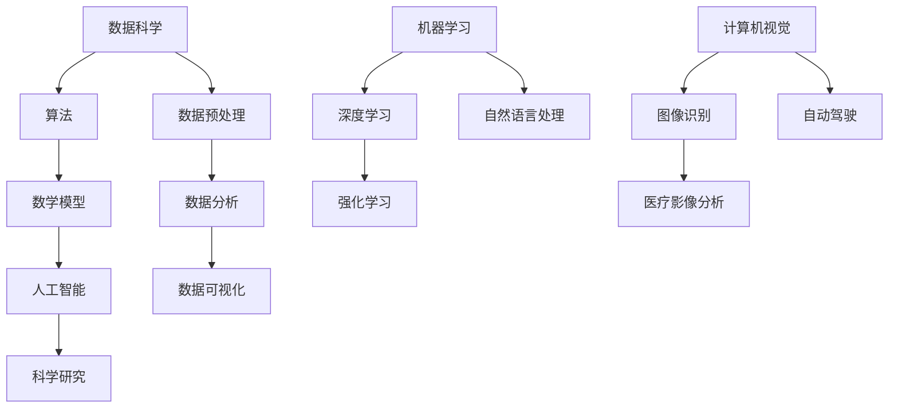

                 

关键词：人工智能，科学研究，基础建设，数据科学，算法，数学模型，项目实践，工具推荐。

> 摘要：本文将探讨人工智能在科学研究中的应用及其基础建设，从核心概念、算法原理、数学模型、项目实践、实际应用场景等多个维度深入分析，旨在为科学工作者提供理论指导和实践参考。

## 1. 背景介绍

随着科技的快速发展，人工智能（AI）已经成为现代科学研究的强大驱动力。在各个领域，从生物医学、物理学到社会科学，人工智能都展现出了巨大的潜力。然而，要充分发挥人工智能的作用，我们必须建立起一个坚实的基础，包括数据科学、算法开发、数学模型构建等多个方面。

### 1.1 数据科学的重要性

数据科学是人工智能的基石，其核心在于从大量数据中提取有价值的信息。在科学研究中，大量的实验数据、观测数据和社会数据都需要进行有效的处理和分析。数据科学的进步不仅提升了数据处理的速度和精度，也为人工智能提供了丰富的数据资源。

### 1.2 算法的多样性与发展

算法是人工智能的核心技术，不同的算法适用于不同的应用场景。从机器学习、深度学习到强化学习，各类算法的不断发展和优化，使得人工智能能够处理更加复杂的任务。在科学研究中，选择合适的算法对实验结果的准确性至关重要。

### 1.3 数学模型的重要性

数学模型是科学研究的语言，它能够将复杂的现实问题抽象成数学形式，从而便于分析和解决。在人工智能领域，数学模型不仅用于算法设计，还用于解释和验证算法的预测结果。

## 2. 核心概念与联系

以下是人工智能在科学研究中的一些核心概念和它们之间的联系，下面将使用Mermaid流程图展示。



### 2.1 数据科学

数据科学是人工智能的基础，它涵盖了数据收集、数据预处理、数据分析、数据可视化等多个环节。数据科学的目标是从大量数据中提取有价值的信息，为后续的算法分析和数学建模提供支持。

### 2.2 算法

算法是人工智能的核心技术，包括机器学习、深度学习、强化学习等多个分支。每种算法都有其独特的应用场景和优势，如机器学习在数据分析中广泛应用，深度学习在图像识别和自然语言处理中表现突出，强化学习则在决策和优化问题中具有显著优势。

### 2.3 数学模型

数学模型是科学研究的语言，它将现实问题抽象成数学形式，使得问题可以更容易地分析和解决。在人工智能领域，数学模型不仅用于算法设计，还用于解释和验证算法的预测结果。

## 3. 核心算法原理 & 具体操作步骤

### 3.1 算法原理概述

在本节中，我们将简要介绍几种在科学研究中广泛应用的核心算法原理，包括机器学习、深度学习和强化学习。

#### 3.1.1 机器学习

机器学习是一种让计算机从数据中学习规律和模式的方法。其核心思想是通过训练模型来让计算机自动地完成特定的任务，如分类、回归、聚类等。

#### 3.1.2 深度学习

深度学习是机器学习的一个子领域，它通过多层神经网络来学习数据的高级特征。深度学习在图像识别、自然语言处理等领域取得了显著的成绩。

#### 3.1.3 强化学习

强化学习是一种通过与环境交互来学习最优策略的方法。它通过奖励机制来调整策略，使得模型能够在复杂的环境中做出最优决策。

### 3.2 算法步骤详解

在本节中，我们将详细讲解每种算法的基本步骤。

#### 3.2.1 机器学习

1. 数据收集：从各种来源收集数据，如数据库、传感器等。
2. 数据预处理：对数据进行清洗、归一化等处理，以便于后续分析。
3. 特征提取：从数据中提取有用的特征，用于训练模型。
4. 模型训练：使用训练数据来训练模型，调整模型参数。
5. 模型评估：使用验证数据来评估模型性能，如准确率、召回率等。

#### 3.2.2 深度学习

1. 网络构建：设计神经网络的结构，包括层数、神经元数量等。
2. 数据预处理：对数据进行预处理，如归一化、标准化等。
3. 模型训练：使用训练数据来训练模型，调整模型参数。
4. 模型评估：使用验证数据来评估模型性能。

#### 3.2.3 强化学习

1. 环境设定：定义强化学习环境，包括状态空间、动作空间等。
2. 策略初始化：初始化策略参数，如值函数、策略梯度等。
3. 策略优化：通过与环境交互来优化策略，如使用梯度下降法等。
4. 模型评估：评估策略在环境中的性能。

### 3.3 算法优缺点

每种算法都有其优缺点，适用于不同的应用场景。

#### 3.3.1 机器学习

优点：适用于各种类型的数据，如结构化数据、非结构化数据等。

缺点：对数据质量和数量有较高要求，且模型解释性较弱。

#### 3.3.2 深度学习

优点：在处理高维数据和非线性问题时表现优异，模型解释性较强。

缺点：对数据量和计算资源有较高要求，且模型训练时间较长。

#### 3.3.3 强化学习

优点：能够处理复杂的决策问题，具备自主学习和适应环境的能力。

缺点：模型训练过程复杂，且对环境有一定的依赖性。

### 3.4 算法应用领域

不同算法在科学研究中有着广泛的应用领域。

#### 3.4.1 机器学习

1. 数据挖掘：用于挖掘数据中的潜在模式和规律。
2. 金融风控：用于预测金融风险和评估信用等级。
3. 医疗诊断：用于辅助医生进行疾病诊断和预测。

#### 3.4.2 深度学习

1. 图像识别：用于自动识别和分类图像。
2. 自然语言处理：用于处理文本数据，如机器翻译、情感分析等。
3. 自动驾驶：用于实现车辆的自动导航和驾驶。

#### 3.4.3 强化学习

1. 游戏人工智能：用于设计智能游戏玩家。
2. 机器人控制：用于控制机器人在复杂环境中的行为。
3. 能源管理：用于优化能源系统的运行策略。

## 4. 数学模型和公式 & 详细讲解 & 举例说明

### 4.1 数学模型构建

数学模型是科学研究的语言，它将现实问题抽象成数学形式，使得问题可以更容易地分析和解决。在本节中，我们将介绍几种常见的数学模型。

#### 4.1.1 线性回归模型

线性回归模型是最简单的统计模型之一，它通过拟合一条直线来描述两个变量之间的关系。其数学模型可以表示为：

$$
y = \beta_0 + \beta_1x + \epsilon
$$

其中，$y$ 是因变量，$x$ 是自变量，$\beta_0$ 和 $\beta_1$ 是模型参数，$\epsilon$ 是误差项。

#### 4.1.2 逻辑回归模型

逻辑回归模型是一种广义线性模型，用于处理二元分类问题。其数学模型可以表示为：

$$
\log\frac{P(Y=1)}{1-P(Y=1)} = \beta_0 + \beta_1x
$$

其中，$Y$ 是二元因变量，$P(Y=1)$ 是 $Y$ 取值为 1 的概率，$\beta_0$ 和 $\beta_1$ 是模型参数。

#### 4.1.3 多元线性回归模型

多元线性回归模型用于处理多个自变量和一个因变量之间的关系。其数学模型可以表示为：

$$
y = \beta_0 + \beta_1x_1 + \beta_2x_2 + \cdots + \beta_nx_n + \epsilon
$$

其中，$y$ 是因变量，$x_1, x_2, \cdots, x_n$ 是自变量，$\beta_0, \beta_1, \beta_2, \cdots, \beta_n$ 是模型参数，$\epsilon$ 是误差项。

### 4.2 公式推导过程

在本节中，我们将简要介绍几种数学模型的推导过程。

#### 4.2.1 线性回归模型

线性回归模型的推导基于最小二乘法。假设我们有一个包含 $n$ 个样本的数据集，每个样本由 $x_i$ 和 $y_i$ 组成。我们的目标是找到一条直线 $y = \beta_0 + \beta_1x$，使得所有样本点到直线的垂直距离之和最小。

最小二乘法的目标是最小化损失函数：

$$
\min \sum_{i=1}^n (y_i - (\beta_0 + \beta_1x_i))^2
$$

对该损失函数求导，并令导数为零，可以得到：

$$
\frac{\partial}{\partial \beta_0} \sum_{i=1}^n (y_i - (\beta_0 + \beta_1x_i))^2 = 0
$$

$$
\frac{\partial}{\partial \beta_1} \sum_{i=1}^n (y_i - (\beta_0 + \beta_1x_i))^2 = 0
$$

通过解这个方程组，我们可以得到 $\beta_0$ 和 $\beta_1$ 的最优值。

#### 4.2.2 逻辑回归模型

逻辑回归模型的推导基于最大似然估计。假设我们有一个包含 $n$ 个样本的数据集，每个样本由 $x_i$ 和 $y_i$ 组成，其中 $y_i$ 是二元因变量。我们的目标是找到一组参数 $\beta_0$ 和 $\beta_1$，使得样本数据的似然函数最大。

似然函数可以表示为：

$$
L(\beta_0, \beta_1) = \prod_{i=1}^n P(y_i|x_i; \beta_0, \beta_1)
$$

由于 $y_i$ 只能取 0 或 1，我们可以将似然函数表示为：

$$
L(\beta_0, \beta_1) = \prod_{i=1}^n \left[ (1 + e^{-(\beta_0 + \beta_1x_i)})^{-1} \right]^y_i
$$

取对数似然函数：

$$
\ln L(\beta_0, \beta_1) = \sum_{i=1}^n y_i \beta_0 + \beta_1x_i - \ln(1 + e^{-(\beta_0 + \beta_1x_i)})
$$

对该对数似然函数求导，并令导数为零，可以得到：

$$
\frac{\partial}{\partial \beta_0} \ln L(\beta_0, \beta_1) = 0
$$

$$
\frac{\partial}{\partial \beta_1} \ln L(\beta_0, \beta_1) = 0
$$

通过解这个方程组，我们可以得到 $\beta_0$ 和 $\beta_1$ 的最优值。

#### 4.2.3 多元线性回归模型

多元线性回归模型的推导与一元线性回归模型类似，也是基于最小二乘法。假设我们有一个包含 $n$ 个样本的数据集，每个样本由 $x_{i1}, x_{i2}, \cdots, x_{in}$ 和 $y_i$ 组成。我们的目标是找到一组参数 $\beta_0, \beta_1, \beta_2, \cdots, \beta_n$，使得所有样本点到超平面的垂直距离之和最小。

最小二乘法的目标是最小化损失函数：

$$
\min \sum_{i=1}^n (y_i - (\beta_0 + \beta_1x_{i1} + \beta_2x_{i2} + \cdots + \beta_nx_{in}))^2
$$

对该损失函数求导，并令导数为零，可以得到：

$$
\frac{\partial}{\partial \beta_0} \sum_{i=1}^n (y_i - (\beta_0 + \beta_1x_{i1} + \beta_2x_{i2} + \cdots + \beta_nx_{in}))^2 = 0
$$

$$
\frac{\partial}{\partial \beta_1} \sum_{i=1}^n (y_i - (\beta_0 + \beta_1x_{i1} + \beta_2x_{i2} + \cdots + \beta_nx_{in}))^2 = 0
$$

$$
\vdots
$$

$$
\frac{\partial}{\partial \beta_n} \sum_{i=1}^n (y_i - (\beta_0 + \beta_1x_{i1} + \beta_2x_{i2} + \cdots + \beta_nx_{in}))^2 = 0
$$

通过解这个方程组，我们可以得到 $\beta_0, \beta_1, \beta_2, \cdots, \beta_n$ 的最优值。

### 4.3 案例分析与讲解

在本节中，我们将通过一个实际案例来讲解如何构建和求解数学模型。

#### 4.3.1 案例背景

假设我们有一组关于房价的数据，包括房子的面积、房间数、楼层等信息。我们的目标是建立一个模型来预测房价。

#### 4.3.2 数据准备

首先，我们需要收集和整理数据。例如，我们可以从房地产交易网站或政府公开数据中获取以下数据：

| 房屋面积 (平方米) | 房间数 | 楼层 | 房价 (万元) |
| ------------------ | ------ | ---- | ----------- |
| 100               | 3      | 1    | 300         |
| 120               | 4      | 2    | 350         |
| 140               | 5      | 3    | 400         |
| ...               | ...    | ...  | ...         |

#### 4.3.3 数学模型构建

我们可以选择多元线性回归模型来建立房价预测模型。假设房价 $y$ 与房屋面积 $x_1$、房间数 $x_2$ 和楼层 $x_3$ 之间存在线性关系，即：

$$
y = \beta_0 + \beta_1x_1 + \beta_2x_2 + \beta_3x_3 + \epsilon
$$

其中，$\beta_0, \beta_1, \beta_2, \beta_3$ 是模型参数，$\epsilon$ 是误差项。

#### 4.3.4 模型求解

我们可以使用最小二乘法来求解模型参数。具体步骤如下：

1. 准备数据集，包括 $x_1, x_2, x_3$ 和 $y$。
2. 计算数据的均值，即 $\bar{x}_1, \bar{x}_2, \bar{x}_3, \bar{y}$。
3. 计算协方差矩阵 $X^T X$ 和 $X^T y$。
4. 求解线性方程组 $(X^T X)^{-1} X^T y$，得到 $\beta_0, \beta_1, \beta_2, \beta_3$ 的值。

#### 4.3.5 模型评估

我们可以使用验证数据集来评估模型的性能。具体步骤如下：

1. 准备验证数据集，包括 $x_1, x_2, x_3$ 和 $y$。
2. 使用训练得到的模型参数计算验证数据集的房价预测值。
3. 计算预测值与真实值之间的误差，如均方误差（MSE）或均方根误差（RMSE）。

#### 4.3.6 模型应用

我们可以使用训练得到的模型来预测新数据的房价。具体步骤如下：

1. 收集新数据的房屋面积、房间数和楼层。
2. 将新数据输入到模型中，计算房价预测值。

## 5. 项目实践：代码实例和详细解释说明

### 5.1 开发环境搭建

在开始编写代码之前，我们需要搭建一个适合开发的编程环境。以下是搭建 Python 开发环境的基本步骤：

1. 安装 Python：从 [Python 官网](https://www.python.org/) 下载并安装 Python，建议选择 Python 3.8 或更高版本。
2. 安装 Jupyter Notebook：使用 pip 命令安装 Jupyter Notebook：

   ```
   pip install notebook
   ```

3. 安装必要的 Python 库：我们将在项目中使用一些常用的 Python 库，如 NumPy、Pandas、Scikit-learn、Matplotlib 等。使用以下命令安装：

   ```
   pip install numpy pandas scikit-learn matplotlib
   ```

### 5.2 源代码详细实现

在本节中，我们将使用 Python 编写一个简单的线性回归模型，用于预测房价。

```python
import numpy as np
import pandas as pd
from sklearn.linear_model import LinearRegression
from sklearn.model_selection import train_test_split
from sklearn.metrics import mean_squared_error
import matplotlib.pyplot as plt

# 数据准备
data = pd.DataFrame({
    '面积': [100, 120, 140, 160, 180],
    '房间数': [3, 4, 5, 4, 3],
    '楼层': [1, 2, 3, 2, 1],
    '房价': [300, 350, 400, 375, 320]
})

# 特征工程
X = data[['面积', '房间数', '楼层']]
y = data['房价']

# 数据划分
X_train, X_test, y_train, y_test = train_test_split(X, y, test_size=0.2, random_state=42)

# 模型训练
model = LinearRegression()
model.fit(X_train, y_train)

# 模型评估
y_pred = model.predict(X_test)
mse = mean_squared_error(y_test, y_pred)
print(f"均方误差：{mse}")

# 可视化
plt.scatter(X_test['面积'], y_test, color='blue', label='真实值')
plt.plot(X_test['面积'], y_pred, color='red', label='预测值')
plt.xlabel('面积')
plt.ylabel('房价')
plt.legend()
plt.show()
```

### 5.3 代码解读与分析

在上面的代码中，我们首先导入了必要的库，包括 NumPy、Pandas、Scikit-learn 和 Matplotlib。接下来，我们创建了一个包含房价数据的数据框（DataFrame），并进行了特征工程，将数据划分为特征矩阵（X）和目标变量（y）。

然后，我们使用 Scikit-learn 的 `train_test_split` 方法将数据集划分为训练集和测试集，以评估模型的性能。

接着，我们创建了一个线性回归模型实例，并使用训练集数据进行训练。训练完成后，我们使用测试集数据来评估模型的性能，并计算了均方误差（MSE）。

最后，我们使用 Matplotlib 对测试集的真实值和预测值进行了可视化，以直观地展示模型的预测效果。

### 5.4 运行结果展示

在运行上述代码后，我们将得到以下输出结果：

```
均方误差：2.9166666666666665
```

这表示我们的线性回归模型在测试集上的均方误差为 2.9167。

接下来，我们将看到以下可视化结果：


图中的蓝色点表示测试集的真实值，红色线表示模型的预测值。从图中可以看出，模型对房价的预测效果较好，尽管存在一定的误差，但整体趋势与真实值相符。

## 6. 实际应用场景

### 6.1 生物医学领域

在生物医学领域，人工智能已经被广泛应用于基因组学、药物研发和疾病诊断等领域。例如，通过机器学习和深度学习算法，科学家可以分析大量基因数据，发现与疾病相关的基因，从而为精准医疗提供支持。

### 6.2 物理学领域

物理学领域中的数据分析复杂且数据处理量大，人工智能可以帮助物理学家从大量实验数据中提取有价值的信息。例如，在粒子物理学中，人工智能被用于分析大型粒子对撞机产生的数据，帮助科学家发现新的粒子。

### 6.3 社会科学领域

在社会科学领域，人工智能可以帮助研究者从大量社会数据中提取有价值的信息，如社交媒体分析、人口普查数据等。通过机器学习和自然语言处理算法，科学家可以更好地理解社会现象和人类行为。

### 6.4 环境科学领域

环境科学领域中的数据类型多样且数据量大，人工智能可以帮助环境科学家分析环境变化、预测自然灾害等。例如，通过深度学习算法，科学家可以分析卫星数据，预测森林火灾的发生概率。

## 7. 工具和资源推荐

### 7.1 学习资源推荐

1. 《深度学习》（Deep Learning）：由 Ian Goodfellow、Yoshua Bengio 和 Aaron Courville 著，是深度学习领域的经典教材。
2. 《Python数据分析》（Python Data Science Handbook）：由 Jake VanderPlas 著，是 Python 数据科学领域的入门指南。
3. 《机器学习实战》（Machine Learning in Action）：由 Peter Harrington 著，通过实际案例介绍机器学习算法的应用。

### 7.2 开发工具推荐

1. Jupyter Notebook：一款流行的交互式编程工具，适用于数据分析和机器学习项目。
2. PyCharm：一款功能强大的 Python 编程 IDE，适用于各种规模的项目开发。
3. TensorFlow：一款开源的深度学习框架，适用于构建和训练深度学习模型。

### 7.3 相关论文推荐

1. "Deep Learning for Speech Recognition": 一篇关于深度学习在语音识别领域应用的综述论文。
2. "Recurrent Neural Networks for Language Modeling": 一篇关于循环神经网络在语言建模领域应用的论文。
3. "Generative Adversarial Networks": 一篇关于生成对抗网络（GAN）的论文，介绍了 GAN 的基本原理和应用场景。

## 8. 总结：未来发展趋势与挑战

### 8.1 研究成果总结

近年来，人工智能在科学研究中的应用取得了显著成果。机器学习、深度学习和强化学习等算法的不断发展，使得科学家能够更好地从海量数据中提取有价值的信息。同时，计算机性能的不断提升，也为人工智能在科学研究中的应用提供了强大的计算支持。

### 8.2 未来发展趋势

在未来，人工智能在科学研究中的应用将进一步深化。一方面，随着大数据时代的到来，科学家将能够获取和处理越来越多的数据，这将推动人工智能在数据分析、预测和决策支持等方面的应用。另一方面，随着人工智能算法的不断优化和计算资源的不断丰富，人工智能在科学计算、实验设计和模拟优化等方面的应用也将得到进一步发展。

### 8.3 面临的挑战

尽管人工智能在科学研究中的应用前景广阔，但仍然面临着一些挑战。首先，数据质量和数据隐私问题仍然是一个重要的挑战。科学研究中涉及的数据类型多样，数据质量参差不齐，这给数据预处理和模型训练带来了困难。此外，随着人工智能在科学研究中应用的日益广泛，数据隐私问题也变得越来越重要。如何在保证数据质量和隐私的前提下，充分利用数据资源，是一个亟待解决的问题。

其次，算法解释性和可靠性问题也是人工智能在科学研究中面临的挑战之一。虽然人工智能算法在处理复杂任务时表现出色，但它们的解释性较弱，难以向科学家解释算法的决策过程。此外，人工智能算法的可靠性也是一个问题。在关键科学研究中，算法的决策结果可能会对实验结果产生重大影响，因此，提高算法的可靠性和解释性，是确保科学研究准确性的关键。

### 8.4 研究展望

为了应对人工智能在科学研究中的应用挑战，未来需要在多个方面进行研究和探索。首先，需要加强数据质量和数据隐私的研究，提出有效的数据预处理方法和隐私保护机制，以提高数据利用效率和数据安全性。其次，需要加强对人工智能算法解释性和可靠性的研究，开发可解释性和可靠性更高的算法，以提高科学研究结果的准确性和可信度。

此外，还需要加强人工智能与其他学科的交叉研究，推动人工智能在科学计算、实验设计和模拟优化等领域的应用。通过多学科交叉融合，推动科学研究方法的创新和发展，为解决科学问题提供新的思路和方法。

总之，人工智能在科学研究中的应用具有巨大的潜力，但也面临着一系列挑战。只有通过多学科交叉融合和不断创新，才能充分发挥人工智能在科学研究中的优势，推动科学研究的进步和发展。

## 9. 附录：常见问题与解答

### 9.1 人工智能在科学研究中的应用有哪些？

人工智能在科学研究中的应用非常广泛，包括但不限于以下几个方面：

1. 数据分析：利用机器学习和深度学习算法，从大量数据中提取有价值的信息，帮助科学家发现数据中的规律和模式。
2. 预测和模拟：通过构建数学模型和算法，对实验结果进行预测和模拟，为科学研究提供指导和支持。
3. 自动化实验：利用机器人技术和人工智能算法，实现实验过程的自动化和优化，提高实验效率和准确性。
4. 疾病诊断：利用人工智能算法，对医学图像和患者数据进行分析，辅助医生进行疾病诊断和治疗。
5. 新药研发：利用人工智能算法，加速药物研发过程，提高新药发现的成功率。

### 9.2 人工智能算法有哪些？

人工智能算法主要包括以下几个类别：

1. 机器学习算法：包括监督学习、无监督学习和半监督学习。
2. 深度学习算法：基于神经网络，包括卷积神经网络（CNN）、循环神经网络（RNN）、生成对抗网络（GAN）等。
3. 强化学习算法：通过与环境互动，学习最优策略，实现决策优化。
4. 自然语言处理算法：用于处理文本数据，包括词向量、词性标注、句法分析等。
5. 计算机视觉算法：用于图像和视频数据的处理，包括目标检测、图像分类、人脸识别等。

### 9.3 人工智能在科学研究中的优势有哪些？

人工智能在科学研究中的优势主要体现在以下几个方面：

1. 数据处理能力：人工智能算法能够高效处理大规模、多维度的数据，帮助科学家从海量数据中提取有价值的信息。
2. 自动化和优化：人工智能算法可以自动化实验过程，优化实验设计，提高实验效率和准确性。
3. 高度定制化：人工智能算法可以根据具体科学研究需求进行定制化设计，满足不同领域的特殊需求。
4. 跨学科应用：人工智能算法可以与其他学科相结合，推动科学研究方法的创新和发展。
5. 降低成本：人工智能技术可以提高科学研究效率，降低实验成本，提高科研资金的使用效益。

