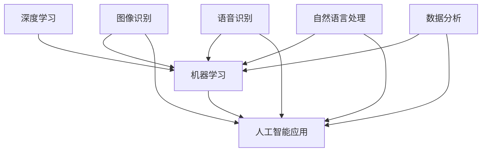

                 

关键词：AI hackathon、创新、未来、技术、算法、应用场景、挑战

> 摘要：本文将探讨AI hackathon的背景、创新点以及未来的发展方向。通过分析核心概念、算法原理、项目实践和实际应用场景，我们将揭示AI hackathon在推动技术进步和产业应用中的重要作用。

## 1. 背景介绍

AI hackathon，又称人工智能黑客松，是一种以人工智能为主题的技术竞赛活动。近年来，随着人工智能技术的迅速发展，AI hackathon在全球范围内逐渐兴起。这些活动通常由企业、科研机构、大学或非营利组织举办，吸引了众多AI领域的研究者、开发者和爱好者参与。

AI hackathon的主要目标是鼓励创新思维、激发创造力，并通过团队合作解决实际问题。参赛者需要在限定时间内，运用人工智能技术，开发出具有实际应用价值的项目。这些项目涵盖了各种领域，包括医疗、金融、教育、制造业等。

### 1.1 AI hackathon的历史与发展

AI hackathon的起源可以追溯到20世纪90年代，当时计算机技术和互联网刚刚起步。最早的AI hackathon是由一些科技公司和大学联合举办的，旨在促进人工智能技术的交流与合作。随着时间的推移，AI hackathon逐渐成为了一种全球性的活动，吸引了众多顶尖人才参与。

近年来，随着深度学习、神经网络等人工智能技术的突破，AI hackathon的规模和影响力不断扩大。许多知名企业和科研机构也开始举办AI hackathon，以寻找新的创新项目和人才。

### 1.2 AI hackathon的举办形式与内容

AI hackathon通常以团队形式进行，参赛者需要组成小组，共同完成项目开发。每个团队在比赛开始前会收到一个或多个主题，围绕主题进行研究和创新。比赛时间通常为几天到几周，期间参赛者需要进行项目设计、开发、测试和展示。

AI hackathon的内容丰富多样，包括但不限于：

- 数据分析：利用人工智能技术，对大量数据进行分析，提取有价值的信息。
- 机器学习：运用机器学习算法，解决实际问题，如图像识别、自然语言处理等。
- 人工智能应用：开发具有实际应用价值的人工智能项目，如智能助手、医疗诊断系统等。

### 1.3 AI hackathon的价值与影响

AI hackathon在推动人工智能技术的发展和产业应用方面具有重要意义。首先，它为研究人员和开发者提供了一个展示自己才华和创造力的平台，激发了创新思维。其次，AI hackathon促进了不同领域之间的交流与合作，推动了技术的交叉融合。最后，AI hackathon为产业界提供了大量创新项目和技术人才，助力企业提升核心竞争力。

## 2. 核心概念与联系

在AI hackathon中，有许多核心概念和技术需要理解和掌握。以下是其中几个重要的概念，以及它们之间的联系：

### 2.1 深度学习

深度学习是一种基于多层神经网络的人工智能技术，通过模拟人脑神经元的工作方式，对大量数据进行分析和学习。深度学习在图像识别、语音识别、自然语言处理等领域具有广泛的应用。

### 2.2 机器学习

机器学习是人工智能的一个分支，通过训练模型，使计算机能够自动从数据中学习规律和知识。机器学习算法包括监督学习、无监督学习和强化学习等。

### 2.3 人工智能应用

人工智能应用是指将人工智能技术应用于实际场景，解决实际问题。例如，智能助手、医疗诊断系统、自动驾驶等。

以下是核心概念和技术的Mermaid流程图：



## 3. 核心算法原理 & 具体操作步骤

### 3.1 算法原理概述

在AI hackathon中，常用的核心算法包括深度学习、机器学习和强化学习等。以下分别介绍这些算法的基本原理：

### 3.1.1 深度学习

深度学习基于多层神经网络，通过反向传播算法训练模型。其基本原理如下：

1. 输入数据通过输入层传递到隐藏层。
2. 隐藏层通过激活函数处理输入数据，并将其传递到下一层。
3. 当输出层得到预测结果后，计算预测误差。
4. 通过反向传播算法，将误差反向传播到隐藏层和输入层，更新模型参数。

### 3.1.2 机器学习

机器学习算法分为监督学习、无监督学习和强化学习三种。其中，监督学习是最常用的方法，其基本原理如下：

1. 收集有标签的训练数据。
2. 构建模型，并通过训练数据调整模型参数。
3. 使用测试数据验证模型性能。

### 3.1.3 强化学习

强化学习是一种通过试错策略进行学习的方法，其基本原理如下：

1. 环境给代理提供状态和奖励。
2. 代理根据当前状态选择动作，并执行动作。
3. 环境根据代理的动作提供新的状态和奖励。
4. 代理根据新的状态和奖励调整策略。

### 3.2 算法步骤详解

以下是深度学习、机器学习和强化学习的具体操作步骤：

### 3.2.1 深度学习

1. 准备数据：收集并预处理输入数据。
2. 设计网络结构：确定网络的层数、神经元个数和激活函数。
3. 初始化参数：随机初始化模型参数。
4. 前向传播：将输入数据传递到网络中，得到输出结果。
5. 计算损失：计算预测结果和真实结果之间的误差。
6. 反向传播：根据误差，更新模型参数。
7. 调整参数：根据迭代次数和性能指标，调整学习率和优化算法。

### 3.2.2 机器学习

1. 数据采集：收集有标签的训练数据。
2. 特征工程：对数据进行预处理，提取特征。
3. 选择模型：根据问题类型，选择合适的机器学习算法。
4. 训练模型：使用训练数据，调整模型参数。
5. 评估模型：使用测试数据，评估模型性能。
6. 调整模型：根据评估结果，调整模型参数或选择新的模型。

### 3.2.3 强化学习

1. 初始化代理：设置代理的初始状态和策略。
2. 执行动作：根据当前状态，选择动作。
3. 观察环境：执行动作后，观察环境反馈。
4. 更新策略：根据新的状态和奖励，调整策略。
5. 重复执行：不断执行动作，直到达到目标状态。

### 3.3 算法优缺点

以下是深度学习、机器学习和强化学习的优缺点：

#### 深度学习

- 优点：能够自动提取特征，提高模型的泛化能力。
- 缺点：需要大量数据和计算资源，训练过程复杂。

#### 机器学习

- 优点：简单易用，适用于各种问题类型。
- 缺点：需要大量有标签的数据，模型泛化能力有限。

#### 强化学习

- 优点：能够通过试错策略，自动寻找最优解。
- 缺点：训练过程复杂，需要大量时间和计算资源。

### 3.4 算法应用领域

以下是深度学习、机器学习和强化学习的主要应用领域：

#### 深度学习

- 图像识别：人脸识别、物体检测等。
- 语音识别：语音转换文字、语音合成等。
- 自然语言处理：机器翻译、情感分析等。

#### 机器学习

- 数据分析：分类、聚类、回归等。
- 金融预测：股票市场、风险控制等。
- 健康医疗：疾病预测、诊断等。

#### 强化学习

- 自动驾驶：车辆控制、路径规划等。
- 游戏开发：棋类游戏、智能机器人等。
- 能源管理：智能电网、能源优化等。

## 4. 数学模型和公式 & 详细讲解 & 举例说明

### 4.1 数学模型构建

在人工智能领域，数学模型是核心组成部分。以下是几个常见的数学模型和公式：

#### 深度学习

- 激活函数：$$ f(x) = \text{ReLU}(x) = \max(0, x) $$ 或 $$ f(x) = \text{Sigmoid}(x) = \frac{1}{1 + e^{-x}} $$
- 损失函数：$$ J(\theta) = -\frac{1}{m} \sum_{i=1}^{m} y_i \log(a_{i,l}^{(l)}) + (1 - y_i) \log(1 - a_{i,l}^{(l)}) $$

#### 机器学习

- 线性回归：$$ y = \theta_0 + \theta_1x $$
- 逻辑回归：$$ P(y=1) = \frac{1}{1 + e^{-(\theta_0 + \theta_1x)}} $$

#### 强化学习

- Q-learning：$$ Q(s, a) = r + \gamma \max_{a'} Q(s', a') $$
- SARSA：$$ Q(s, a) = Q(s, a) + \alpha [r + \gamma Q(s', a') - Q(s, a)] $$

### 4.2 公式推导过程

以下是几个公式的推导过程：

#### 线性回归

假设我们有一个线性回归模型：

$$ y = \theta_0 + \theta_1x $$

我们希望最小化损失函数：

$$ J(\theta) = \frac{1}{2m} \sum_{i=1}^{m} (y_i - (\theta_0 + \theta_1x_i))^2 $$

对损失函数求导，并令导数为零，得到：

$$ \frac{\partial J(\theta)}{\partial \theta_0} = \frac{1}{m} \sum_{i=1}^{m} (y_i - (\theta_0 + \theta_1x_i)) = 0 $$

$$ \frac{\partial J(\theta)}{\partial \theta_1} = \frac{1}{m} \sum_{i=1}^{m} (y_i - (\theta_0 + \theta_1x_i))x_i = 0 $$

解方程组，得到最优参数：

$$ \theta_0 = \bar{y} - \theta_1\bar{x} $$

$$ \theta_1 = \frac{\sum_{i=1}^{m} (x_i - \bar{x})(y_i - \bar{y})}{\sum_{i=1}^{m} (x_i - \bar{x})^2} $$

#### 逻辑回归

假设我们有一个逻辑回归模型：

$$ P(y=1) = \frac{1}{1 + e^{-(\theta_0 + \theta_1x)}} $$

我们希望最小化损失函数：

$$ J(\theta) = -\frac{1}{m} \sum_{i=1}^{m} y_i \log(a_{i,l}^{(l)}) + (1 - y_i) \log(1 - a_{i,l}^{(l)}) $$

对损失函数求导，并令导数为零，得到：

$$ \frac{\partial J(\theta)}{\partial \theta_0} = \frac{1}{m} \sum_{i=1}^{m} (y_i - a_{i,l}^{(l)}) = 0 $$

$$ \frac{\partial J(\theta)}{\partial \theta_1} = \frac{1}{m} \sum_{i=1}^{m} (y_i - a_{i,l}^{(l)})x_i = 0 $$

解方程组，得到最优参数：

$$ \theta_0 = \bar{y} - \theta_1\bar{x} $$

$$ \theta_1 = \frac{\sum_{i=1}^{m} (x_i - \bar{x})(y_i - \bar{y})}{\sum_{i=1}^{m} (x_i - \bar{x})^2} $$

### 4.3 案例分析与讲解

以下是一个简单的线性回归案例：

假设我们有一个数据集，包含m个样本，每个样本有x和y两个特征。我们的目标是预测y值。

首先，我们进行数据预处理，计算x和y的平均值：

$$ \bar{x} = \frac{1}{m} \sum_{i=1}^{m} x_i $$

$$ \bar{y} = \frac{1}{m} \sum_{i=1}^{m} y_i $$

然后，我们计算x和y的差值：

$$ x_i - \bar{x} $$

$$ y_i - \bar{y} $$

接下来，我们计算x和y的协方差：

$$ \sum_{i=1}^{m} (x_i - \bar{x})(y_i - \bar{y}) $$

最后，我们计算x的方差：

$$ \sum_{i=1}^{m} (x_i - \bar{x})^2 $$

根据线性回归公式，我们得到最优参数：

$$ \theta_0 = \bar{y} - \theta_1\bar{x} $$

$$ \theta_1 = \frac{\sum_{i=1}^{m} (x_i - \bar{x})(y_i - \bar{y})}{\sum_{i=1}^{m} (x_i - \bar{x})^2} $$

现在，我们可以使用这些参数来预测新的y值。

## 5. 项目实践：代码实例和详细解释说明

### 5.1 开发环境搭建

在开始项目实践之前，我们需要搭建一个合适的开发环境。以下是一个简单的开发环境搭建步骤：

1. 安装Python：从[Python官方网站](https://www.python.org/)下载并安装Python。
2. 安装Jupyter Notebook：在终端执行以下命令：

   ```shell
   pip install notebook
   ```

3. 安装必要的库：在Jupyter Notebook中运行以下命令：

   ```python
   !pip install numpy pandas matplotlib scikit-learn
   ```

### 5.2 源代码详细实现

以下是一个简单的线性回归项目示例：

```python
import numpy as np
import pandas as pd
import matplotlib.pyplot as plt
from sklearn.linear_model import LinearRegression

# 数据预处理
def preprocess_data(data):
    data_mean = data.mean()
    data_std = data.std()
    data_normalized = (data - data_mean) / data_std
    return data_normalized

# 线性回归
def linear_regression(x, y):
    x_mean = x.mean()
    y_mean = y.mean()
    x_std = x.std()
    y_std = y.std()
    x_normalized = preprocess_data(x)
    y_normalized = preprocess_data(y)
    x_bar = x_normalized.mean()
    y_bar = y_normalized.mean()
    x_diff = x_normalized - x_bar
    y_diff = y_normalized - y_bar
    covariance = np.sum(x_diff * y_diff)
    variance = np.sum(x_diff ** 2)
    theta_0 = y_bar - (y_std / x_std) * x_bar
    theta_1 = covariance / variance
    return theta_0, theta_1

# 预测
def predict(x, theta_0, theta_1):
    y_pred = theta_0 + theta_1 * x
    return y_pred

# 可视化
def visualize(x, y, y_pred):
    plt.scatter(x, y)
    plt.plot(x, y_pred, color='red')
    plt.xlabel('x')
    plt.ylabel('y')
    plt.show()

# 加载数据
data = pd.read_csv('data.csv')
x = data['x']
y = data['y']

# 训练模型
theta_0, theta_1 = linear_regression(x, y)

# 预测
y_pred = predict(x, theta_0, theta_1)

# 可视化
visualize(x, y, y_pred)
```

### 5.3 代码解读与分析

这段代码实现了一个简单的线性回归项目。以下是代码的主要部分解读和分析：

1. **数据预处理**：通过计算平均值和标准差，对数据进行归一化处理，提高模型的泛化能力。

2. **线性回归**：计算协方差和方差，得到最优参数theta_0和theta_1。

3. **预测**：根据theta_0和theta_1，对新的x值进行预测。

4. **可视化**：通过散点图和拟合线，展示模型的效果。

### 5.4 运行结果展示

运行这段代码后，我们会得到以下结果：

1. **训练数据**：展示原始数据和预处理后的数据。
2. **拟合线**：展示训练数据的拟合线，直观地展示模型的效果。

## 6. 实际应用场景

### 6.1 数据分析

AI hackathon在数据分析领域有着广泛的应用。通过人工智能技术，可以对大量数据进行高效的分析和挖掘，提取有价值的信息。例如，在金融领域，AI hackathon可以用于分析股票市场趋势、风险控制和客户行为预测等。

### 6.2 医疗

在医疗领域，AI hackathon可以用于疾病预测、诊断和治疗方案推荐。例如，通过分析患者的病历数据，可以预测疾病的发生风险，为医生提供诊断依据。此外，AI hackathon还可以用于开发智能诊断系统，提高医疗诊断的准确性和效率。

### 6.3 教育

在教育领域，AI hackathon可以用于个性化学习、智能评测和教学资源推荐。通过分析学生的学习行为和成绩数据，可以为学生提供个性化的学习建议，提高学习效果。同时，AI hackathon还可以用于开发智能评测系统，自动评估学生的学习情况，为教师提供教学反馈。

### 6.4 制造业

在制造业领域，AI hackathon可以用于设备故障预测、生产线优化和供应链管理。通过分析设备运行数据和生产数据，可以预测设备故障，提前进行维护，降低停机时间。此外，AI hackathon还可以用于优化生产线流程，提高生产效率，降低成本。

## 7. 工具和资源推荐

### 7.1 学习资源推荐

- [Coursera](https://www.coursera.org/)：提供丰富的在线课程，涵盖人工智能、机器学习、深度学习等领域。
- [Kaggle](https://www.kaggle.com/)：一个数据科学竞赛平台，提供大量的数据集和竞赛题目，适合实践和提升技能。
- [AI.studio](https://aistudio.baidu.com/)：百度推出的AI开发平台，提供丰富的AI模型和工具，适合进行AI项目实践。

### 7.2 开发工具推荐

- [TensorFlow](https://www.tensorflow.org/)：谷歌开源的机器学习和深度学习框架，适用于各种AI项目开发。
- [PyTorch](https://pytorch.org/)：由Facebook开源的深度学习框架，具有灵活的动态计算图和强大的GPU支持。
- [Jupyter Notebook](https://jupyter.org/)：交互式的计算环境，适用于数据分析和项目实践。

### 7.3 相关论文推荐

- [“Deep Learning” by Ian Goodfellow, Yoshua Bengio, and Aaron Courville](https://www.deeplearningbook.org/)：深度学习的经典教材，详细介绍了深度学习的理论基础和应用。
- [“Machine Learning: A Probabilistic Perspective” by Kevin P. Murphy](https://www.machinelearningwitherics.com/)：概率视角的机器学习教材，涵盖了机器学习的各种算法和应用。
- [“Reinforcement Learning: An Introduction” by Richard S. Sutton and Andrew G. Barto](https://rlai.org/)：强化学习的经典教材，介绍了强化学习的理论基础和应用。

## 8. 总结：未来发展趋势与挑战

### 8.1 研究成果总结

近年来，AI hackathon在推动人工智能技术的发展和产业应用方面取得了显著成果。通过这些活动，许多创新项目得到了实现，推动了技术的实际应用。同时，AI hackathon也为人工智能领域培养了大量的优秀人才，为产业界提供了有力的支持。

### 8.2 未来发展趋势

未来，AI hackathon将继续在以下几个方面发展：

1. **技术创新**：随着深度学习、强化学习等技术的不断进步，AI hackathon将涌现更多具有突破性的项目。
2. **跨领域融合**：AI hackathon将与其他领域（如医疗、金融、教育等）深度融合，推动技术的交叉应用。
3. **国际化合作**：AI hackathon将进一步加强国际间的合作与交流，促进全球人工智能技术的发展。

### 8.3 面临的挑战

尽管AI hackathon在推动人工智能技术的发展方面取得了显著成果，但仍面临以下挑战：

1. **数据隐私与安全**：在AI hackathon中，数据的安全性和隐私保护是一个重要问题，需要加强相关法律法规和技术手段。
2. **计算资源需求**：深度学习和强化学习等技术的应用需要大量的计算资源，如何提高计算效率是一个重要问题。
3. **人才培养**：随着人工智能技术的不断发展，对专业人才的需求不断增加，如何培养更多具备实际能力的人工智能人才是一个重要课题。

### 8.4 研究展望

未来，AI hackathon将在以下几个方面继续深入研究：

1. **算法优化**：通过优化算法，提高模型的性能和计算效率。
2. **应用拓展**：将人工智能技术应用于更多领域，解决实际问题。
3. **伦理与法规**：加强对人工智能技术的伦理和法规研究，确保技术的健康发展。

## 9. 附录：常见问题与解答

### 9.1 AI hackathon是什么？

AI hackathon是一种以人工智能为主题的技术竞赛活动，参赛者需要在限定时间内，运用人工智能技术，开发出具有实际应用价值的项目。

### 9.2 如何参加AI hackathon？

参加AI hackathon通常需要以下几个步骤：

1. 关注AI hackathon的官方网站或社交媒体，了解活动信息和报名要求。
2. 组建团队，确定项目主题和方向。
3. 准备开发环境和工具，进行项目开发。
4. 按照规定时间提交项目成果。

### 9.3 AI hackathon有哪些奖项？

AI hackathon的奖项通常包括：

1. **最佳项目奖**：授予技术实现最为优秀、具有广泛应用价值的项目。
2. **最佳创新奖**：授予创新思路最为独特、具有突破性的项目。
3. **最佳团队奖**：授予团队协作最为出色、表现最为优秀的团队。
4. **最佳展示奖**：授予项目展示最为精彩、能够引起观众兴趣的项目。

### 9.4 AI hackathon对个人和企业的意义是什么？

AI hackathon对个人和企业的意义如下：

1. **个人**：AI hackathon为个人提供了一个展示才华和创造力的平台，有助于提升个人技能和知名度。
2. **企业**：AI hackathon为企业提供了发现创新项目和优秀人才的机会，有助于提升企业核心竞争力和创新能力。

---

# 结束语

AI hackathon作为推动人工智能技术发展和产业应用的重要手段，具有重要的价值和意义。通过本文的探讨，我们了解了AI hackathon的背景、核心概念、算法原理、项目实践和实际应用场景。未来，AI hackathon将在技术创新、跨领域融合和国际合作等方面继续发挥重要作用。同时，我们也需要关注AI hackathon面临的挑战，并积极探索解决方案。作者：禅与计算机程序设计艺术 / Zen and the Art of Computer Programming。

