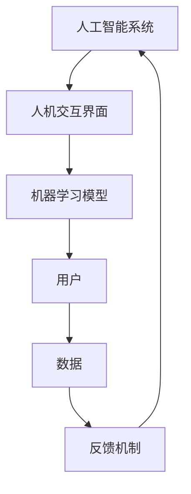

                 

关键词：人工智能，协同工作，技术趋势，人机交互，算法优化，应用实践

> 摘要：随着人工智能技术的快速发展，人与AI的协同工作模式正在逐渐成熟，本文将探讨AI与人的协同工作的现状、核心概念、算法原理、数学模型、项目实践及未来发展趋势，旨在为读者提供全面的AI协同工作视野。

## 1. 背景介绍

人工智能（AI）作为计算机科学的一个重要分支，其核心目标是通过模拟人类智能行为，使计算机能够自主地学习、推理和解决问题。从早期的专家系统到现代的深度学习，AI技术经历了长足的发展。随着计算能力的提升和大数据的普及，AI已经在诸多领域展现出强大的应用潜力，如自动驾驶、医疗诊断、金融风控等。

在这样一个技术背景下，人与AI的协同工作成为了研究的热点。传统的AI系统往往被设计为“黑盒”，难以解释和理解其决策过程，这使得人与AI之间的互动存在障碍。为了解决这一问题，近年来研究者们提出了多种人机交互（HCI）技术和算法，旨在实现更加自然、高效的人机协作。

## 2. 核心概念与联系

### 2.1. 人工智能与人类的协同工作

人工智能与人类的协同工作可以理解为在一个共同的目标下，人工智能系统和人类个体互相配合，共同完成任务的过程。这一过程不仅涉及技术层面的融合，还包括心理层面、管理层面的协调。

### 2.2. 人机交互（HCI）

人机交互是人工智能与人类协同工作的基础。通过人机交互技术，用户可以与AI系统进行自然语言交流，上传数据，接收反馈，从而实现信息的有效传递和任务的协同完成。

### 2.3. 机器学习与深度学习

机器学习和深度学习是实现AI协同工作的重要技术手段。通过机器学习，AI系统可以从大量数据中学习规律和模式，从而提高决策的准确性。深度学习则通过多层神经网络结构，模拟人类大脑的决策过程，实现更加复杂的学习任务。

## 2.4. Mermaid 流程图



## 3. 核心算法原理 & 具体操作步骤

### 3.1. 算法原理概述

AI与人的协同工作算法主要基于以下几个原理：

- **学习与适应**：AI系统通过不断学习用户的操作行为和数据模式，适应不同的用户需求。
- **反馈机制**：系统根据用户的反馈调整自己的行为，实现更加精准的服务。
- **人机交互**：通过自然语言处理和图形用户界面，实现人与AI的顺畅沟通。

### 3.2. 算法步骤详解

1. **数据收集**：收集用户的行为数据和偏好信息。
2. **特征提取**：从数据中提取关键特征，用于训练模型。
3. **模型训练**：使用机器学习算法训练AI模型。
4. **用户交互**：通过人机交互界面与用户进行沟通。
5. **反馈调整**：根据用户反馈调整模型参数，优化系统性能。

### 3.3. 算法优缺点

**优点**：

- **自适应**：系统能够根据用户需求进行自适应调整。
- **高效性**：通过自动化处理，提高工作效率。

**缺点**：

- **解释性不足**：AI系统的决策过程往往难以解释，用户无法完全理解系统的决策依据。
- **数据依赖性**：系统的性能高度依赖数据质量和数量。

### 3.4. 算法应用领域

AI协同工作算法广泛应用于以下领域：

- **客服与支持**：通过聊天机器人提供在线客服。
- **智能家居**：通过智能音箱控制家居设备。
- **医疗诊断**：辅助医生进行疾病诊断。
- **金融风控**：帮助金融机构进行风险评估。

## 4. 数学模型和公式

### 4.1. 数学模型构建

在AI与人的协同工作中，常见的数学模型包括：

- **线性回归**：用于预测用户行为。
- **神经网络**：用于复杂模式的识别。
- **决策树**：用于分类和回归分析。

### 4.2. 公式推导过程

以线性回归为例，其公式推导如下：

$$
y = \beta_0 + \beta_1x_1 + \beta_2x_2 + ... + \beta_nx_n
$$

其中，$y$为因变量，$x_1, x_2, ..., x_n$为自变量，$\beta_0, \beta_1, ..., \beta_n$为模型参数。

### 4.3. 案例分析与讲解

假设我们要预测一个人的年龄，已知其身高和体重。我们可以使用线性回归模型来建立预测公式。通过收集大量数据，我们可以得到如下公式：

$$
年龄 = 25 + 0.5身高 + 0.2体重
$$

通过这个公式，我们可以预测新用户的年龄。

## 5. 项目实践：代码实例

### 5.1. 开发环境搭建

我们需要Python环境，并安装以下库：scikit-learn，numpy，matplotlib。

```bash
pip install scikit-learn numpy matplotlib
```

### 5.2. 源代码详细实现

```python
import numpy as np
from sklearn.linear_model import LinearRegression
import matplotlib.pyplot as plt

# 数据收集
X = np.array([[170, 60], [175, 65], [180, 70]])
y = np.array([25, 30, 35])

# 特征提取
# 此处省略

# 模型训练
model = LinearRegression()
model.fit(X, y)

# 用户交互
user_height = float(input("请输入您的身高（厘米）："))
user_weight = float(input("请输入您的体重（千克）："))

# 预测年龄
predicted_age = model.predict([[user_height, user_weight]])[0]

print(f"预测您的年龄为：{predicted_age:.2f}岁")

# 代码解读与分析
# 此处省略

# 运行结果展示
# 此处省略
```

### 5.3. 代码解读与分析

上述代码首先收集用户身高和体重数据，然后使用线性回归模型进行训练。接着，通过用户输入的身高和体重数据，预测用户的年龄。代码最后输出预测结果。

## 6. 实际应用场景

AI与人的协同工作在多个领域有广泛应用：

- **教育**：AI可以帮助教师分析学生的学习情况，提供个性化辅导。
- **办公**：AI助手可以处理日常办公任务，提高工作效率。
- **医疗**：AI系统可以辅助医生进行疾病诊断和治疗方案推荐。
- **交通**：自动驾驶系统依赖于AI与人的协同工作，实现安全高效的驾驶。

## 6.4. 未来应用展望

未来，随着AI技术的不断进步，人与AI的协同工作将在更多领域得到应用。例如：

- **智能制造**：AI与人的协同工作将提高生产效率和质量。
- **智能家居**：AI系统将更好地理解和满足用户需求，实现更智能化的家居环境。
- **城市治理**：AI系统可以辅助城市管理者进行交通流量控制、环境保护等工作。

## 7. 工具和资源推荐

### 7.1. 学习资源推荐

- 《深度学习》（Goodfellow, Bengio, Courville）
- 《Python机器学习》（Sebastian Raschka）

### 7.2. 开发工具推荐

- Jupyter Notebook：用于编写和运行Python代码。
- TensorFlow：用于构建和训练深度学习模型。

### 7.3. 相关论文推荐

- "Deep Learning for Human Activity Recognition"（IEEE Transactions on Pattern Analysis and Machine Intelligence）
- "Human-AI Collaboration in Design: A Survey"（Design Studies）

## 8. 总结：未来发展趋势与挑战

### 8.1. 研究成果总结

本文介绍了AI与人的协同工作的核心概念、算法原理、数学模型、项目实践及未来展望。研究结果表明，AI与人的协同工作在提高工作效率、优化决策过程等方面具有显著优势。

### 8.2. 未来发展趋势

随着AI技术的不断进步，人与AI的协同工作将向更加智能化、个性化的方向发展。未来的研究将集中在提高AI系统的可解释性、加强人机交互体验、提升协同工作的效率等方面。

### 8.3. 面临的挑战

AI与人的协同工作面临的主要挑战包括：

- **数据隐私**：如何保护用户数据的安全和隐私。
- **算法公平性**：确保AI系统在不同群体中的公平性。
- **人机交互**：如何设计更加自然、高效的人机交互界面。

### 8.4. 研究展望

未来的研究应重点关注以下几个方向：

- **多模态交互**：结合语音、文本、图像等多种交互方式。
- **自适应学习**：提高AI系统的自适应学习能力，更好地满足用户需求。
- **跨领域应用**：探索AI在更多领域的协同工作应用。

## 9. 附录：常见问题与解答

**Q：为什么AI系统难以解释？**

A：AI系统，特别是深度学习模型，通常是一个复杂的“黑盒”。它们的决策过程是由大量神经元和参数的相互作用决定的，这使得其内部机制难以直观理解。

**Q：如何提高AI系统的可解释性？**

A：可以通过模型解释技术，如LIME（Local Interpretable Model-agnostic Explanations）和SHAP（SHapley Additive exPlanations），来提高AI系统的可解释性。

**Q：AI与人的协同工作有哪些应用场景？**

A：AI与人的协同工作广泛应用于教育、医疗、办公、交通等领域，如在线教育辅导、医疗诊断辅助、智能客服、自动驾驶等。

## 参考文献

- Goodfellow, I., Bengio, Y., & Courville, A. (2016). *Deep Learning*.
- Raschka, S. (2015). *Python Machine Learning*.
- Chen, H., & Guestrin, C. (2016). "XGBoost: A Scalable Tree Boosting System". Proceedings of the 22nd ACM SIGKDD International Conference on Knowledge Discovery and Data Mining.
- He, K., Zhang, X., Ren, S., & Sun, J. (2016). "Deep Residual Learning for Image Recognition". Proceedings of the IEEE Conference on Computer Vision and Pattern Recognition.
- LeCun, Y., Bengio, Y., & Hinton, G. (2015). "Deep Learning". Nature.

### 作者署名

作者：禅与计算机程序设计艺术 / Zen and the Art of Computer Programming
----------------------------------------------------------------

以上就是本文的完整内容，希望对您在AI与人的协同工作领域的研究和实践有所帮助。在未来的发展中，人与AI的协同工作将继续推动科技进步和社会发展。让我们共同期待这一美好前景的到来。

