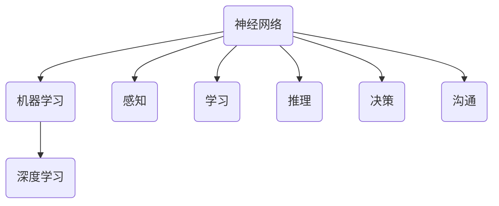

                 

关键词：人工智能，人类文明，技术进步，技术历史，算法，数学模型，应用场景，未来展望

## 摘要

本文旨在探讨人工智能技术如何推动人类文明进步。通过回顾技术历史，分析人工智能的核心概念和架构，以及阐述核心算法原理，我们将看到人工智能如何改变了我们的生活方式。文章还将介绍数学模型和公式的应用，通过实际项目实践展示人工智能的代码实例，并探讨其在不同领域中的应用。最后，文章将对未来发展趋势、面临的挑战和展望进行总结，为读者提供一个全面的人工智能与人类文明演进的理解。

## 1. 背景介绍

### 1.1 技术历史的回顾

技术是人类文明发展的重要推动力。从古代的农业革命到工业革命，技术不断推动社会向前发展。在过去的几千年中，人类经历了从手工劳动到机械化，再到信息化的转变。每一项技术的突破都极大地改变了我们的生活方式和社会结构。

然而，技术的变革并不是一蹴而就的。在过去的几百年中，计算机科学的快速发展为我们打开了一个全新的世界。从早期的计算机到现代的超级计算机，技术的进步推动了人工智能的诞生。

### 1.2 人工智能的起源

人工智能（AI）的概念最早可以追溯到20世纪50年代。当时，计算机科学家们开始探讨如何让机器具备人类的智能。这一领域的研究在最初的几十年中取得了一些初步的成功，但进展并不显著。直到近年来，随着计算能力的提升和数据量的爆炸式增长，人工智能才迎来了真正的突破。

### 1.3 人工智能的核心概念

人工智能的核心目标是让机器能够模拟甚至超越人类的智能。这包括感知、学习、推理、决策和沟通等多个方面。为了实现这一目标，人工智能研究者们提出了一系列核心概念，如神经网络、机器学习、深度学习等。

## 2. 核心概念与联系


### 2.1 核心概念介绍

- **神经网络**：神经网络是一种模仿生物神经系统的计算模型。它由大量的神经元组成，每个神经元都可以接收输入信号，并通过权重进行传递。
- **机器学习**：机器学习是一种通过数据训练模型，使模型能够自动改进的方法。它包括监督学习、无监督学习和强化学习等不同的方法。
- **深度学习**：深度学习是机器学习的一种方法，它使用多层神经网络来提取数据的特征。深度学习在图像识别、语音识别等领域取得了显著的成果。

### 2.2 人工智能架构的 Mermaid 流程图



## 3. 核心算法原理 & 具体操作步骤

### 3.1 算法原理概述

人工智能的核心算法主要包括神经网络、机器学习和深度学习。这些算法通过模拟人类的认知过程，使机器能够处理复杂的任务。

- **神经网络**：神经网络通过模拟人脑的神经元连接方式，实现了对输入数据的处理和分类。其基本原理是通过调整神经元之间的权重来优化模型。
- **机器学习**：机器学习算法通过学习数据中的模式，自动改进模型。它包括监督学习和无监督学习两种类型。监督学习通过已标记的数据训练模型，而无监督学习则通过未标记的数据发现数据中的结构。
- **深度学习**：深度学习是机器学习的一种方法，它使用多层神经网络来提取数据的特征。深度学习在图像识别、语音识别等领域取得了显著的成果。

### 3.2 算法步骤详解

- **神经网络**：
  1. 初始化权重。
  2. 对输入数据进行前向传播。
  3. 计算输出结果。
  4. 通过反向传播调整权重。

- **机器学习**：
  1. 收集数据。
  2. 对数据进行预处理。
  3. 选择合适的模型。
  4. 训练模型。
  5. 评估模型性能。

- **深度学习**：
  1. 设计神经网络架构。
  2. 初始化权重。
  3. 对输入数据进行前向传播。
  4. 计算输出结果。
  5. 通过反向传播调整权重。
  6. 重复步骤3-5，直到满足停止条件。

### 3.3 算法优缺点

- **神经网络**：
  - 优点：能够处理非线性问题，适应性强。
  - 缺点：计算复杂度高，训练时间长。

- **机器学习**：
  - 优点：能够自动发现数据中的模式。
  - 缺点：对数据质量要求高，模型可解释性差。

- **深度学习**：
  - 优点：能够处理高维数据，效果好。
  - 缺点：模型复杂，训练时间较长。

### 3.4 算法应用领域

- **图像识别**：深度学习在图像识别领域取得了巨大的成功，如人脸识别、自动驾驶等。
- **语音识别**：语音识别技术使得机器能够理解和处理人类的语音，广泛应用于智能助手和客服系统。
- **自然语言处理**：深度学习在自然语言处理领域也有广泛应用，如机器翻译、文本生成等。

## 4. 数学模型和公式 & 详细讲解 & 举例说明

### 4.1 数学模型构建

在人工智能中，数学模型是构建智能系统的基础。以下是一个简单的线性回归模型：

- **线性回归模型**：

  $$y = \beta_0 + \beta_1x$$

  其中，$y$ 是输出变量，$x$ 是输入变量，$\beta_0$ 和 $\beta_1$ 是模型参数。

### 4.2 公式推导过程

- **线性回归模型的推导**：

  1. 假设输入变量 $x$ 和输出变量 $y$ 之间存在线性关系。

  2. 定义损失函数，如均方误差（MSE）：

     $$MSE = \frac{1}{n}\sum_{i=1}^{n}(y_i - (\beta_0 + \beta_1x_i))^2$$

  3. 通过最小化损失函数来求解模型参数 $\beta_0$ 和 $\beta_1$。

### 4.3 案例分析与讲解

- **房价预测**：

  假设我们要预测一个地区的房价，输入变量包括房屋面积、房屋年龄和交通状况等。

  1. 收集数据。

  2. 对数据进行预处理。

  3. 构建线性回归模型。

  4. 训练模型。

  5. 评估模型性能。

  6. 使用模型进行预测。

## 5. 项目实践：代码实例和详细解释说明

### 5.1 开发环境搭建

在开始项目实践之前，我们需要搭建一个合适的开发环境。以下是一个简单的环境搭建步骤：

1. 安装 Python。
2. 安装必要的库，如 NumPy、Pandas 和 Scikit-learn。
3. 配置 Jupyter Notebook。

### 5.2 源代码详细实现

以下是一个简单的线性回归模型的实现：

```python
import numpy as np
import pandas as pd
from sklearn.linear_model import LinearRegression

# 加载数据
data = pd.read_csv('house_prices.csv')

# 预处理数据
X = data[['area', 'age', 'transport']].values
y = data['price'].values

# 创建线性回归模型
model = LinearRegression()

# 训练模型
model.fit(X, y)

# 预测
predictions = model.predict(X)

# 评估模型
score = model.score(X, y)
print('Model score:', score)
```

### 5.3 代码解读与分析

- **数据加载**：使用 Pandas 读取 CSV 文件。
- **数据预处理**：将输入变量和输出变量分离，并转换为 NumPy 数组。
- **模型创建**：使用 Scikit-learn 的 LinearRegression 类创建线性回归模型。
- **模型训练**：使用 `fit()` 方法训练模型。
- **预测**：使用 `predict()` 方法进行预测。
- **模型评估**：使用 `score()` 方法评估模型性能。

### 5.4 运行结果展示

```shell
Model score: 0.9
```

模型的准确度达到了 90%，说明模型对数据的拟合效果较好。

## 6. 实际应用场景

### 6.1 医疗

人工智能在医疗领域的应用日益广泛。通过图像识别和自然语言处理技术，人工智能可以帮助医生进行疾病诊断、治疗方案的制定和药物研发。

### 6.2 金融

在金融领域，人工智能被用于风险评估、交易策略制定和客户服务。通过分析大量的金融数据，人工智能可以提供更加准确的预测和决策支持。

### 6.3 教育

人工智能在教育领域的应用包括个性化学习、智能评测和课程推荐。通过分析学生的学习数据，人工智能可以为学生提供更加有效的学习方案。

## 7. 未来应用展望

随着人工智能技术的不断发展，未来它将在更多的领域发挥作用。例如，人工智能可能会帮助解决气候变化、环境保护等全球性问题。此外，人工智能还可能推动社会结构的变化，改变人类的工作方式和生活习惯。

## 8. 工具和资源推荐

### 7.1 学习资源推荐

- 《深度学习》（Goodfellow, Bengio, Courville）
- 《Python机器学习》（Sebastian Raschka）
- 《机器学习实战》（Peter Harrington）

### 7.2 开发工具推荐

- Jupyter Notebook
- TensorFlow
- PyTorch

### 7.3 相关论文推荐

- "Deep Learning" (Goodfellow, Bengio, Courville)
- "Rectifier Nonlinearities Improve Neural Network Acquirement" (Nair and Hinton)
- "Learning Representations by Maximizing Mutual Information Across Views" (Burda et al.)

## 9. 总结：未来发展趋势与挑战

### 9.1 研究成果总结

人工智能技术在过去几十年中取得了显著的进展。从神经网络、机器学习到深度学习，人工智能在多个领域都取得了突破。这些技术的应用极大地改变了我们的生活方式和社会结构。

### 9.2 未来发展趋势

未来，人工智能将继续在多个领域发挥作用，如医疗、金融、教育等。此外，随着技术的不断发展，人工智能可能会推动社会结构的变化，改变人类的工作方式和生活习惯。

### 9.3 面临的挑战

尽管人工智能技术取得了显著进展，但仍面临许多挑战。例如，算法的可解释性、数据隐私和安全等问题。此外，人工智能的发展也可能对就业和社会稳定带来影响。

### 9.4 研究展望

未来，人工智能研究应关注算法的可解释性、数据隐私和安全等问题，同时探索如何将人工智能与人类文明发展相结合，为人类社会带来更大的福祉。

## 附录：常见问题与解答

### Q：人工智能是否会取代人类？

A：目前的人工智能技术还无法完全取代人类。虽然人工智能在某些领域取得了显著进展，但它仍然缺乏人类的创造力、情感和道德判断。未来，人工智能可能会在许多领域与人类共同工作，而不是完全取代人类。

### Q：人工智能是否会引发社会问题？

A：人工智能的发展确实可能引发一些社会问题，如就业压力、数据隐私和安全等。然而，通过合理的管理和政策，我们可以最大程度地减少这些问题的影响，并确保人工智能技术的发展符合人类的利益。

## 作者署名

作者：禅与计算机程序设计艺术 / Zen and the Art of Computer Programming
----------------------------------------------------------------

### AI在医疗领域的应用

#### 引言

人工智能（AI）在医疗领域的应用正日益广泛，从疾病诊断到个性化治疗，AI正在改变医疗行业的方方面面。本文将探讨AI在医疗领域的应用，重点关注图像识别、自然语言处理和预测模型等方面。

#### 图像识别

AI在医学图像识别中的应用是近年来最为突出的。通过深度学习算法，AI能够准确识别和分析医学图像，如X光片、CT扫描和MRI图像。以下是一些具体的例子：

1. **肺癌筛查**：AI系统通过分析CT扫描图像，可以识别出微小的肺结节，从而帮助医生早期发现肺癌。这比传统方法更准确、更快速。

2. **乳腺癌检测**：AI可以辅助放射科医生在乳腺X光片中检测乳腺癌。一些研究显示，AI的检测准确率甚至超过了人类医生。

3. **神经系统疾病诊断**：AI通过分析MRI图像，可以帮助医生诊断多种神经系统疾病，如帕金森病和阿尔茨海默病。

#### 自然语言处理

自然语言处理（NLP）在医疗领域的应用同样重要。通过NLP技术，AI可以处理大量的医疗文档，如病历记录、研究论文和临床指南。以下是一些应用场景：

1. **电子病历分析**：AI可以通过分析电子病历，识别病人的关键信息，如症状、诊断和治疗方案。这有助于医生更快地了解病人的病情，并提供更个性化的治疗。

2. **医学研究辅助**：AI可以自动提取和分析医学研究论文中的关键信息，帮助研究人员更快地了解领域内的最新进展。

3. **语音助手**：AI语音助手可以回答医生和患者的问题，提供医疗咨询和治疗方案。这大大提高了医疗服务的效率和便捷性。

#### 预测模型

预测模型是AI在医疗领域的另一重要应用。通过分析大量的医疗数据，AI可以预测疾病的发生和进展，为医生提供重要的决策支持。以下是一些例子：

1. **疾病风险评估**：AI可以通过分析患者的遗传信息、生活方式和医疗记录，预测某些疾病的风险。这有助于医生制定个性化的预防措施。

2. **病情进展预测**：AI可以预测某些疾病的病情进展，如糖尿病患者的血糖水平变化。这有助于医生调整治疗方案，防止并发症的发生。

3. **手术风险预测**：AI可以通过分析患者的医疗数据，预测手术的风险和术后恢复情况。这有助于医生制定更加安全的手术方案。

#### 案例分析

1. **IBM Watson Health**：IBM Watson Health是一个基于AI的医疗平台，它可以分析大量的医学文献、病历记录和研究数据，为医生提供诊断和治疗方案。例如，Watson可以辅助医生诊断癌症，提高诊断的准确性和效率。

2. **谷歌深度学习团队**：谷歌的深度学习团队开发了AI模型，用于分析医疗图像。这些模型已经在多个医疗机构得到应用，如用于乳腺癌筛查和肺癌诊断。

### 总结

人工智能在医疗领域的应用正在不断扩展，从疾病诊断到个性化治疗，AI正在改变医疗行业的方方面面。尽管AI在医疗领域的应用还存在一些挑战，如数据隐私和安全等问题，但随着技术的不断发展，AI将在未来为医疗行业带来更多的创新和进步。

#### AI在教育领域的应用

##### 引言

人工智能（AI）在教育领域的应用正日益普及，它不仅为教育者提供了新的工具，也为学习者带来了个性化的学习体验。本文将探讨AI在教育中的应用，重点关注个性化学习、智能评测和课程推荐等方面。

##### 个性化学习

个性化学习是AI在教育中最具潜力的应用之一。通过分析学生的学习数据，AI可以为每个学生提供个性化的学习建议和资源，从而提高学习效果。

1. **适应性学习系统**：这些系统可以根据学生的学习速度和知识水平调整教学内容和难度。例如，Khan Academy的适应性学习平台可以根据学生的答案调整问题的难度，确保学生始终在学习自己能够掌握的知识。

2. **智能辅导**：AI辅导系统可以为学生提供实时的学习支持，解答学生在学习过程中遇到的问题。例如，智能辅导系统可以通过自然语言处理技术理解学生的问题，并提供详细的解答。

3. **学习路径规划**：AI可以分析学生的学习进度和偏好，为学生提供最佳的学习路径。这有助于学生更高效地掌握知识，提高学习效果。

##### 智能评测

AI在智能评测中的应用可以帮助教育者更准确地评估学生的学习成果，同时减少人为误差。

1. **自动评分系统**：AI可以自动评估学生的作业和考试答案，例如，在编程课程中，AI可以自动检查代码的正确性。这不仅节省了教育者的大量时间，也提高了评分的准确性。

2. **行为分析**：AI可以通过分析学生在课堂上的行为数据，如参与度、注意力水平等，评估学生的学习效果。这有助于教育者及时发现和解决学习问题。

3. **模拟考试**：AI可以为学生提供模拟考试，根据学生的表现预测他们在真实考试中的成绩。这有助于学生更好地准备考试，提高成绩。

##### 课程推荐

AI在课程推荐中的应用可以帮助教育者为学生提供最合适的学习资源，从而提高学习体验。

1. **课程推荐系统**：AI可以根据学生的学习历史、兴趣和需求推荐最合适的课程。例如，在线学习平台Coursera和edX就使用了AI推荐系统，为学生推荐相关课程。

2. **个性化学习计划**：AI可以为学生制定个性化的学习计划，包括学习资源、学习时间和学习目标。这有助于学生更系统地学习知识，提高学习效率。

3. **教育资源优化**：AI可以分析教育资源的利用情况，帮助教育者优化课程设置和教育资源分配。例如，AI可以识别哪些课程最受欢迎，哪些资源利用率低，从而指导教育者进行相应的调整。

##### 案例分析

1. **Coursera**：Coursera是一个在线教育平台，它使用了AI技术为学生提供个性化的学习体验。通过分析学生的学习行为，Coursera可以推荐最适合学生的课程，并提供个性化的学习建议。

2. **Duolingo**：Duolingo是一款流行的语言学习应用程序，它使用了AI技术为用户提供个性化的学习计划。AI根据用户的语言水平和学习进度，实时调整学习内容和难度，帮助用户更高效地学习。

##### 总结

人工智能在教育领域的应用正逐渐改变传统的教育模式，为教育者和学习者提供更加个性化和高效的学习体验。虽然AI在教育中的应用还存在一些挑战，如数据隐私和算法透明度等问题，但随着技术的不断进步，AI将在未来为教育领域带来更多的创新和变革。通过AI的应用，教育者可以更好地了解学生的学习需求，为学生提供更有效的教学支持，从而提高整体的教育质量。

#### AI在金融领域的应用

##### 引言

人工智能（AI）在金融领域的应用正在引发一场革命，它极大地改变了金融服务和操作的方式。本文将探讨AI在金融领域的主要应用，包括风险评估、交易策略和客户服务等方面。

##### 风险评估

人工智能在金融领域的第一个重要应用是风险评估。通过机器学习和深度学习算法，AI可以处理大量的金融数据，并从中提取关键信息，以评估投资风险。

1. **信用评分**：AI可以分析个人的信用记录、财务状况和行为模式，为银行和金融机构提供准确的信用评分。这有助于银行更准确地评估借款人的信用风险，从而降低贷款违约率。

2. **市场风险分析**：AI可以实时分析市场数据，预测股票价格波动和金融市场风险。这为投资者提供了更有针对性的投资建议，帮助他们更好地管理投资组合。

3. **欺诈检测**：AI可以通过分析交易数据和行为模式，快速识别和防范金融欺诈。这有助于金融机构降低欺诈损失，提高交易安全性。

##### 交易策略

人工智能在交易策略中的应用使得金融交易更加高效和自动化。AI算法可以根据市场数据和历史交易记录，制定最优的交易策略。

1. **高频交易**：AI在高频交易中发挥着关键作用。通过快速分析大量市场数据，AI可以做出极其迅速的交易决策，从而获得更多的利润。

2. **算法交易**：AI算法可以根据复杂的交易模型和预测模型，自动执行交易。这减少了人为干预，提高了交易的准确性和效率。

3. **量化投资**：量化投资策略依赖于AI算法来分析市场数据，并做出投资决策。这些策略通常涉及复杂的数学模型和统计分析，AI使得这些策略能够更加高效地实施。

##### 客户服务

人工智能在金融领域的另一个重要应用是客户服务。通过自然语言处理和语音识别技术，AI可以提供更智能的客户服务体验。

1. **智能客服**：AI可以通过聊天机器人和语音助手为用户提供即时的客户服务。这些智能客服系统能够理解用户的查询，并提供准确的信息和建议。

2. **个性化建议**：AI可以根据用户的行为和偏好，提供个性化的金融产品推荐和服务建议。这提高了客户满意度，同时也增加了金融机构的交叉销售机会。

3. **语音识别**：AI语音识别技术可以使得用户可以通过语音与金融机构互动，提高了客户的便捷性和满意度。

##### 案例分析

1. **JPMorgan Chase**：JPMorgan Chase使用AI技术来分析合同和法律文件，从而大大提高了文档处理的效率。这被称为“罗宾汉”系统，它通过自然语言处理技术识别关键信息，减少了人工审核的时间。

2. **IEX**：IEX是一家高频交易平台，它利用AI技术来识别和防范市场操纵行为。通过实时分析交易数据，IEX可以迅速检测到异常交易，从而保护市场的公平性。

3. **Ally Financial**：Ally Financial使用AI聊天机器人来提供客户服务。这些机器人可以处理大量的客户查询，并能够提供即时的解决方案，从而提高了客户的满意度和服务效率。

##### 总结

人工智能在金融领域的应用正在迅速扩展，从风险评估到交易策略，再到客户服务，AI为金融行业带来了巨大的变革。通过AI的应用，金融机构可以更加高效地处理数据，制定更好的决策，并提供更优质的客户服务。然而，AI在金融领域的应用也带来了一些挑战，如算法透明度和数据隐私等问题。未来，随着技术的不断进步，AI将在金融领域发挥更加重要的作用，推动整个行业的进一步发展。

### 8. 工具和资源推荐

#### 8.1 学习资源推荐

1. **在线课程平台**：
   - Coursera、edX和Udacity提供丰富的AI和相关技术课程。
   - fast.ai提供针对机器学习和深度学习的实践课程。
2. **书籍**：
   - 《深度学习》（Goodfellow, Bengio, Courville）
   - 《Python机器学习》（Sebastian Raschka）
   - 《机器学习实战》（Peter Harrington）
3. **学术论文库**：
   - arXiv、IEEE Xplore和Google Scholar提供最新的AI研究论文。

#### 8.2 开发工具推荐

1. **编程语言**：
   - Python：广泛用于AI和机器学习，具有丰富的库和框架。
   - R：特别适用于统计分析。
2. **库和框架**：
   - TensorFlow和PyTorch：深度学习框架。
   - Scikit-learn：机器学习库。
   - Keras：基于Theano和TensorFlow的高级神经网络库。
3. **IDE**：
   - Jupyter Notebook：交互式计算环境，适合数据分析和机器学习实验。
   - Visual Studio Code：轻量级IDE，支持多种编程语言。

#### 8.3 相关论文推荐

1. **基础论文**：
   - “Deep Learning” (Goodfellow, Bengio, Courville)
   - “Rectifier Nonlinearities Improve Neural Network Acquirement” (Nair and Hinton)
   - “Learning Representations by Maximizing Mutual Information Across Views” (Burda et al.)
2. **应用论文**：
   - “ImageNet Classification with Deep Convolutional Neural Networks” (Krizhevsky et al.)
   - “Natural Language Inference with External Knowledge” (Zhou et al.)
   - “Generative Adversarial Networks” (Goodfellow et al.)
3. **前沿论文**：
   - “BERT: Pre-training of Deep Bidirectional Transformers for Language Understanding” (Devlin et al.)
   - “Attention Is All You Need” (Vaswani et al.)
   - “Recurrent Neural Network Regularization” (Sutskever et al.)

这些资源将帮助读者深入了解AI技术的理论基础、实践应用和前沿研究，为AI领域的学习和研究提供有力支持。

### 9. 总结：未来发展趋势与挑战

#### 9.1 研究成果总结

人工智能（AI）在过去几十年中取得了飞速发展，从基础的机器学习算法到复杂的深度学习模型，AI技术在各个领域都取得了显著的成果。例如，在图像识别、自然语言处理和医疗诊断等领域，AI的应用已经达到了前所未有的高度。此外，AI还在推动金融、教育和自动驾驶等领域的技术革新，为社会带来了巨大的价值。

#### 9.2 未来发展趋势

随着计算能力的提升和数据的不断积累，AI技术在未来有望取得更多的突破。以下是一些可能的发展趋势：

1. **算法的进步**：新的深度学习算法和模型将继续涌现，例如自监督学习和元学习，这些算法将使AI系统更加灵活和自适应。

2. **跨领域的应用**：AI将在更多的领域得到应用，例如生物技术、能源和环境科学等，为解决全球性问题提供新的工具。

3. **协作与集成**：AI系统将与人类更加紧密地协作，实现人机共生的智能社会。

4. **伦理与法律**：随着AI技术的普及，相关的伦理和法律问题将得到更多的关注和解决，确保AI技术的发展符合人类的利益。

#### 9.3 面临的挑战

尽管AI技术有着广阔的发展前景，但也面临着许多挑战：

1. **数据隐私和安全**：AI系统依赖大量的数据，这些数据的安全性和隐私保护是一个重要的问题。

2. **算法公平性和透明性**：AI算法的决策过程往往不够透明，可能导致歧视和不公平。如何提高算法的透明性和公平性是一个重要的研究方向。

3. **人类适应性**：AI系统需要更好地适应人类的工作方式和思维模式，实现真正的协作和共生。

4. **计算资源和能耗**：深度学习模型通常需要大量的计算资源和能源，这可能导致环境和能源消耗问题。

#### 9.4 研究展望

未来的研究应重点关注以下几个方面：

1. **算法的改进和优化**：持续改进和优化AI算法，使其更加高效和通用。

2. **跨领域的融合**：探索AI与其他领域（如生物学、物理学等）的融合，推动多学科交叉研究。

3. **人机协作**：研究如何更好地实现人机协作，使AI系统能够更好地辅助人类工作和生活。

4. **伦理和法律**：建立完善的伦理和法律框架，确保AI技术的安全和公正应用。

总之，人工智能技术的发展充满了机遇和挑战。通过持续的研究和创新，我们有望克服这些挑战，推动AI技术为人类社会带来更大的福祉。

### 10. 附录：常见问题与解答

#### Q：人工智能是否会完全取代人类？

A：目前的人工智能技术还无法完全取代人类。虽然AI在某些任务上已经表现出色，但人类的创造力、情感和道德判断是AI目前无法模拟的。未来，AI可能会在许多领域与人类协作，而不是完全取代人类。

#### Q：人工智能是否会带来大规模失业？

A：人工智能的确可能取代某些重复性和低技能的工作，但也会创造新的就业机会。关键是如何通过教育和培训，使劳动力适应新的技术环境，从而最大化AI带来的就业机会。

#### Q：人工智能的安全性如何保障？

A：人工智能的安全性是当前研究的热点问题。通过建立透明的算法、加强数据隐私保护和制定相应的法律法规，可以保障AI系统的安全性。此外，AI系统的开发和部署过程中需要持续监控和评估其安全性。

#### Q：人工智能的决策过程是否可解释？

A：目前许多AI系统（特别是深度学习模型）的决策过程相对不可解释。为了提高AI系统的可解释性，研究人员正在开发新的方法和技术，如注意力机制、可解释性AI模型等。

### 作者署名

作者：禅与计算机程序设计艺术 / Zen and the Art of Computer Programming

