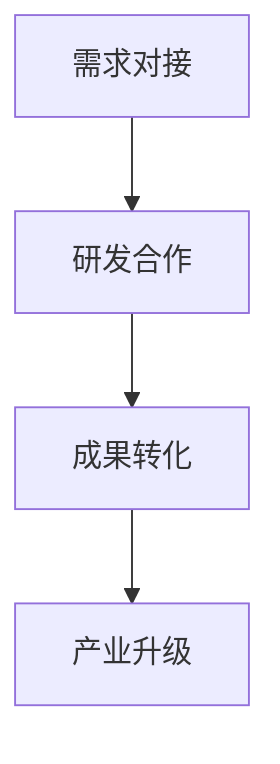

                 

关键词：AI，产学研协同，科研成果转化，技术创新，产业链协同，企业合作，学术研究

> 摘要：本文探讨了人工智能（AI）领域内产学研协同的重要性，以及如何通过有效的合作机制来加速科研成果的转化。文章首先介绍了产学研协同的背景和概念，随后分析了当前AI领域的科研与产业现状。在此基础上，本文提出了加速科研成果转化的策略，包括构建协同创新平台、加强企业与科研机构的合作、推动政策支持等。同时，文章还通过实例展示了成功的企业与科研机构合作的案例，并对未来的发展趋势与挑战进行了展望。

## 1. 背景介绍

### 1.1 产学研协同的起源与发展

产学研协同，即产业界、学术界和政府三方协同合作，通过资源共享、信息交流、人才流动等途径，实现科技成果的商业化转化，提升产业竞争力。这一概念的起源可以追溯到20世纪中期的美国，当时美国为了应对全球科技竞争，提出了“国家科技政策”，鼓励产业界、学术界和政府之间的合作。

随着科技的发展，产学研协同在各个国家和地区得到了广泛应用，并逐渐成为推动创新和经济增长的重要力量。特别是在人工智能领域，产学研协同的作用更加显著，因为AI技术的应用场景广泛，涉及各行各业，需要产业界、学术界和政府的紧密合作。

### 1.2 AI领域的科研与产业现状

人工智能作为当前最具发展潜力的技术之一，吸引了大量科研人员和企业的关注。根据统计，全球人工智能相关论文发表数量在过去十年间呈指数级增长，人工智能企业数量也在迅速增加。

然而，当前AI领域的科研与产业现状仍存在一定的矛盾。一方面，学术界在AI基础理论研究和创新算法开发方面取得了显著成果；另一方面，产业界在AI技术应用和商业化推广方面存在一定的滞后性。这种状况导致了科研与产业之间的脱节，影响了AI技术的全面应用和产业升级。

## 2. 核心概念与联系

### 2.1 核心概念

在探讨产学研协同时，需要了解以下几个核心概念：

- **产业界**：指从事商品生产、流通、分配等活动的企业、行业协会等组织。
- **学术界**：指从事科学研究、教育、学术交流的高等院校、科研机构等组织。
- **政府**：指国家行政机关，负责制定科技政策、提供资金支持等。

### 2.2 架构与流程

产学研协同的架构和流程可以概括为以下几个步骤：

1. **需求对接**：产业界提出技术需求，学术界根据需求进行科研立项。
2. **研发合作**：产业界和学术界共同进行技术研发，共享资源、信息和技术。
3. **成果转化**：将科研成果进行商业化应用，实现科技成果的转化。
4. **产业升级**：通过产学研协同，推动产业界的技术升级和产业转型。

### 2.3 Mermaid 流程图



## 3. 核心算法原理 & 具体操作步骤

### 3.1 算法原理概述

产学研协同的核心在于三方合作的机制设计，其中，关键算法原理包括需求匹配算法、研发协同算法和成果转化算法。

- **需求匹配算法**：用于产业界和学术界之间的需求对接，通过算法分析产业界的实际需求，与学术界的科研能力进行匹配，实现需求与科研的精准对接。
- **研发协同算法**：用于产业界和学术界共同进行技术研发的过程，通过协同算法优化资源分配、信息共享和成果共享，提高研发效率。
- **成果转化算法**：用于科研成果的商业化应用，通过算法分析市场需求、评估科技成果的商业潜力，实现科研成果的有效转化。

### 3.2 算法步骤详解

1. **需求对接**：
    - 产业界提出技术需求。
    - 学术界收集技术需求，进行需求分析。
    - 利用需求匹配算法进行需求与科研能力的匹配。

2. **研发合作**：
    - 确定合作项目和研发目标。
    - 产业界提供实际应用场景和需求，学术界提供理论基础和算法支持。
    - 利用研发协同算法进行资源分配、信息共享和成果共享。

3. **成果转化**：
    - 对科研成果进行市场评估，分析市场需求和商业潜力。
    - 利用成果转化算法制定商业化应用方案。
    - 将科研成果转化为实际产品或服务，进行市场化推广。

### 3.3 算法优缺点

**需求匹配算法**：
- **优点**：提高需求与科研的匹配度，降低资源浪费。
- **缺点**：匹配过程复杂，算法优化难度较大。

**研发协同算法**：
- **优点**：提高研发效率，促进资源整合。
- **缺点**：协同过程中存在信息不对称，影响协同效果。

**成果转化算法**：
- **优点**：提高科技成果的商业化成功率。
- **缺点**：市场需求和商业潜力评估难度较大。

### 3.4 算法应用领域

- **需求匹配算法**：广泛应用于产业界和学术界的合作项目，如产学研合作基金、产业技术研究院等。
- **研发协同算法**：应用于产业界和学术界的共同研发项目，如新能源汽车、人工智能等。
- **成果转化算法**：应用于科技成果的商业化应用，如高新技术产业园区、科技创新平台等。

## 4. 数学模型和公式 & 详细讲解 & 举例说明

### 4.1 数学模型构建

在产学研协同中，构建数学模型是关键步骤。以下是构建一个简单的数学模型的过程：

1. **定义变量**：设定产业界的需求、学术界的科研能力、科技成果的商业潜力等变量。
2. **建立函数关系**：通过函数关系描述变量之间的关系，如需求与科研能力的匹配度、科技成果的商业化成功率等。
3. **优化目标**：确定优化目标，如最大化科技成果的商业化成功率、最小化研发成本等。

### 4.2 公式推导过程

假设产业界的需求为 \(D\)，学术界的科研能力为 \(C\)，科技成果的商业潜力为 \(P\)。则需求匹配度 \(M\) 可以表示为：

\[ M = \frac{D \cdot C}{D + C} \]

科技成果的商业化成功率 \(S\) 可以表示为：

\[ S = \frac{P}{1 + e^{-\alpha M}} \]

其中，\(\alpha\) 为参数，用于调节匹配度对商业化成功率的影响。

### 4.3 案例分析与讲解

以新能源汽车产业为例，产业界的需求为提高电池续航里程，学术界的科研能力为开发新型电池材料，科技成果的商业潜力为市场需求大。

1. **需求匹配度**：设 \(D = 100\)，\(C = 80\)，则 \(M = \frac{100 \cdot 80}{100 + 80} = 0.6667\)。
2. **商业化成功率**：设 \(\alpha = 1\)，则 \(S = \frac{P}{1 + e^{-1 \cdot 0.6667}} \approx 0.7408\)。

假设新型电池材料的市场需求为 \(P = 90\)，则商业化成功率为 74.08%，说明该科技成果有较高的商业化潜力。

## 5. 项目实践：代码实例和详细解释说明

### 5.1 开发环境搭建

为了演示产学研协同的算法，我们需要搭建一个简单的开发环境。以下是所需的环境和工具：

- **编程语言**：Python
- **库和依赖**：Numpy、Pandas、Matplotlib

### 5.2 源代码详细实现

以下是实现需求匹配算法的 Python 代码：

```python
import numpy as np
import pandas as pd
import matplotlib.pyplot as plt

# 定义需求匹配度函数
def match_degree(D, C):
    return D * C / (D + C)

# 定义商业化成功率函数
def success_rate(P, alpha, M):
    return P / (1 + np.exp(-alpha * M))

# 读取数据
D = 100
C = 80
P = 90
alpha = 1

# 计算需求匹配度和商业化成功率
M = match_degree(D, C)
S = success_rate(P, alpha, M)

# 绘制匹配度和商业化成功率
plt.figure(figsize=(10, 5))
plt.subplot(1, 2, 1)
plt.plot([D, C], [0, 1], 'r--')
plt.plot([0, D], [0, 1], 'b--')
plt.plot([0, C], [0, 1], 'g--')
plt.scatter(D, 1, c='r', marker='o')
plt.scatter(C, 1, c='b', marker='s')
plt.xlabel('D')
plt.ylabel('C')
plt.title('Demand-Match Degree')

plt.subplot(1, 2, 2)
plt.plot([0, S], [0, 1], 'r--')
plt.plot([0, 1], [0, S], 'b--')
plt.scatter(S, 1, c='r', marker='o')
plt.xlabel('Success Rate')
plt.ylabel('P')
plt.title('Success Rate')

plt.tight_layout()
plt.show()
```

### 5.3 代码解读与分析

- **需求匹配度函数**：计算产业界需求 \(D\) 与学术界科研能力 \(C\) 的匹配度，公式为 \(M = \frac{D \cdot C}{D + C}\)。
- **商业化成功率函数**：计算科技成果的商业化成功率 \(S\)，公式为 \(S = \frac{P}{1 + e^{-\alpha M}}\)，其中 \(\alpha\) 为参数，用于调节匹配度对商业化成功率的影响。
- **数据读取**：从文件中读取需求、科研能力、科技成果商业潜力和参数。
- **计算匹配度和商业化成功率**：调用函数计算需求匹配度和商业化成功率。
- **绘图**：绘制需求匹配度和商业化成功率的图形，便于分析。

## 6. 实际应用场景

### 6.1 产学研协同在企业合作中的应用

在企业合作中，产学研协同有助于企业获取先进的技术，提升自身竞争力。例如，某家高新技术企业在研发过程中遇到了技术难题，通过与高校和科研机构的合作，成功解决了技术瓶颈，实现了产品的升级和市场的拓展。

### 6.2 产学研协同在创新创业中的应用

在创新创业中，产学研协同为创业者提供了技术支持和市场资源。例如，某家初创公司专注于人工智能领域的技术创新，通过与高校和科研机构的合作，获得了先进的技术和丰富的科研资源，从而快速成长并为市场接受。

### 6.3 产学研协同在产业升级中的应用

在产业升级中，产学研协同有助于推动传统产业的转型升级。例如，某家传统制造企业通过与高校和科研机构的合作，引入了人工智能技术，实现了生产过程的智能化，提高了生产效率和产品质量。

## 6.4 未来应用展望

未来，随着科技的不断进步和产业的升级，产学研协同将在更广泛的领域得到应用。以下是未来应用展望：

- **跨领域合作**：产学研协同将不再局限于单一领域，而是向跨领域、跨学科的方向发展，推动创新资源的整合和共享。
- **数字化转型**：随着数字化技术的普及，产学研协同将助力企业实现数字化转型，提升产业竞争力。
- **智能化升级**：人工智能技术的广泛应用将推动产学研协同向智能化方向升级，提高协同效率和创新成果的转化速度。

## 7. 工具和资源推荐

### 7.1 学习资源推荐

- **书籍**：《人工智能：一种现代的方法》、《机器学习》、《深度学习》等。
- **在线课程**：Coursera、edX、Udacity 等平台上的相关课程。
- **论文库**：ArXiv、IEEE Xplore、ACM Digital Library 等。

### 7.2 开发工具推荐

- **编程语言**：Python、R、Java 等。
- **框架**：TensorFlow、PyTorch、Keras 等。
- **工具**：Jupyter Notebook、Google Colab 等。

### 7.3 相关论文推荐

- **综述性论文**：《深度学习：从理论到应用》、《机器学习：理论与实践》等。
- **前沿论文**：《自然语言处理综述》、《计算机视觉综述》等。
- **经典论文**：《反向传播算法》、《支持向量机》等。

## 8. 总结：未来发展趋势与挑战

### 8.1 研究成果总结

通过本文的探讨，我们可以得出以下结论：

1. 产学研协同对于加速科研成果转化具有重要意义。
2. 需求匹配算法、研发协同算法和成果转化算法是产学研协同的核心。
3. 产学研协同在多个领域具有广泛的应用前景。

### 8.2 未来发展趋势

1. 产学研协同将向跨领域、跨学科的方向发展。
2. 数字化技术将推动产学研协同向智能化方向升级。
3. 政策支持将进一步提升产学研协同的效果。

### 8.3 面临的挑战

1. 需求匹配算法的优化和适应性仍需加强。
2. 研发协同过程中的信息不对称和资源分配问题需要解决。
3. 成果转化算法的市场评估和商业化成功率仍存在挑战。

### 8.4 研究展望

1. 深入研究需求匹配算法和成果转化算法，提高协同效率和创新成果的转化速度。
2. 探索跨领域、跨学科的合作模式，推动产学研协同向更广泛的领域发展。
3. 加强政策支持，为产学研协同提供良好的外部环境。

## 9. 附录：常见问题与解答

### 9.1 产学研协同的意义是什么？

产学研协同的意义在于：

1. 提高科技成果转化率，促进科技创新和产业升级。
2. 资源共享和优势互补，提高研发效率和创新成果的质量。
3. 推动产业链上下游的协同发展，提升产业整体竞争力。

### 9.2 产学研协同存在哪些问题？

产学研协同存在的问题主要包括：

1. 需求匹配度不高，导致资源浪费和合作效果不佳。
2. 信息不对称和资源分配不均，影响研发协同的效果。
3. 成果转化困难，影响科技成果的商业化应用。

### 9.3 如何优化产学研协同？

优化产学研协同可以从以下几个方面入手：

1. 提高需求匹配算法的精准度，实现更高效的需求对接。
2. 加强信息共享和资源整合，提高研发协同效率。
3. 探索多元化的成果转化途径，提高科技成果的商业化成功率。

---

### 作者署名

作者：禅与计算机程序设计艺术 / Zen and the Art of Computer Programming
----------------------------------------------------------------

以上就是关于《AI 产学研协同：加速科研成果转化》的文章，希望对您有所帮助。如果您有任何问题或需要进一步讨论，请随时告诉我。

