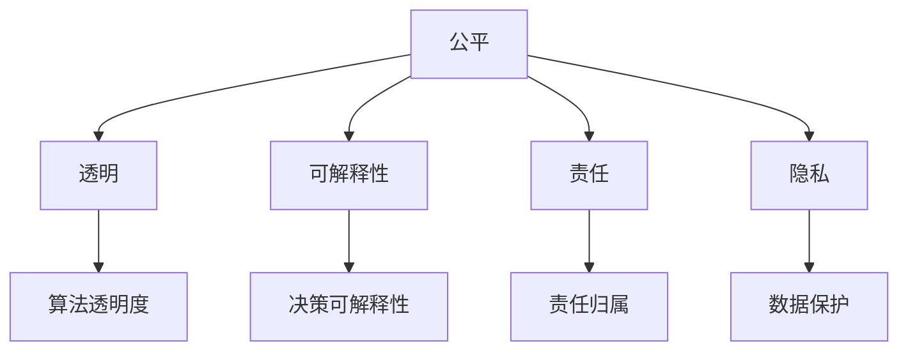

                 

 在当今数字化时代，人工智能（AI）的发展日新月异，已经成为推动社会进步和经济发展的关键力量。然而，随着AI技术的广泛应用，其潜在的风险和伦理问题也日益凸显。本文旨在深入探讨AI伦理问题，分析其核心概念和原理，并提出构建负责任AI的路径和策略。

> **关键词**：人工智能，伦理，责任，公平，透明，可解释性

> **摘要**：本文从AI伦理的核心概念出发，分析了AI技术在实际应用中面临的伦理挑战。通过对核心算法原理的详细阐述，我们探讨了如何通过技术手段和伦理规范来确保AI的负责任使用。同时，本文还提出了未来AI伦理研究的发展趋势和面临的挑战。

## 1. 背景介绍

人工智能作为计算机科学的一个重要分支，已经经历了数十年的发展。从最初的专家系统，到基于机器学习的复杂模型，AI技术已经取得了显著的成就。在医疗、金融、交通、教育等多个领域，AI的应用带来了前所未有的便利和效率提升。然而，随着AI技术的普及，一系列伦理问题也随之而来。

首先，AI的算法可能存在偏见和歧视。当AI系统被训练时，其学习的数据集可能包含历史中的偏见，这些偏见会反映在AI的决策中。例如，在招聘、信贷评估等领域，AI系统可能会根据性别、种族、年龄等因素做出不公平的决策。

其次，AI系统的透明性和可解释性也是一个关键问题。许多复杂的AI算法，如深度学习模型，其内部机制复杂，决策过程不透明。这使得用户难以理解和信任AI系统的决策过程，尤其是在涉及重大决策时，如医疗诊断、司法判决等。

此外，AI技术的发展还可能对就业市场产生重大影响。虽然AI技术可以自动化许多重复性工作，但也可能导致部分职业的失业风险。如何平衡技术创新与就业稳定，也是AI伦理研究的一个重要议题。

## 2. 核心概念与联系

### 2.1 AI伦理的定义与内涵

AI伦理是指对人工智能技术的道德和伦理问题的研究，旨在确保AI技术在社会中的负责任使用。AI伦理的核心内涵包括公平、透明、可解释性、责任和隐私等多个方面。

- **公平**：确保AI技术在处理数据和应用时，不对任何群体产生不公平的待遇。
- **透明**：确保AI系统的决策过程和算法透明，用户可以理解AI的决策依据。
- **可解释性**：提高AI系统的可解释性，使其决策过程对人类用户可理解。
- **责任**：明确AI系统的责任归属，确保在出现问题时可以追溯和纠正。
- **隐私**：保护用户数据隐私，防止数据被滥用或泄露。

### 2.2 AI伦理的核心概念原理

为了更好地理解AI伦理的核心概念，我们使用Mermaid流程图来展示这些概念之间的关系。



## 3. 核心算法原理 & 具体操作步骤

### 3.1 算法原理概述

在AI伦理研究中，核心算法的原理至关重要。以下是几种关键的算法原理：

- **公平性算法**：通过调整训练数据集的多样性，减少算法偏见。
- **可解释性算法**：使用模型可视化技术和解释性模型，提高算法的可解释性。
- **责任算法**：引入责任分配机制，明确算法在决策中的责任。
- **隐私保护算法**：采用差分隐私、加密等技术，保护用户数据隐私。

### 3.2 算法步骤详解

#### 3.2.1 公平性算法

1. 数据预处理：清洗数据，去除无关特征，确保数据质量。
2. 数据增强：通过数据扩充和生成技术，提高数据的多样性。
3. 训练模型：使用改进的损失函数，如 fairness loss，优化模型。
4. 评估模型：使用公平性度量，如公平性差距（fairness gap），评估模型是否公平。

#### 3.2.2 可解释性算法

1. 模型选择：选择可解释性强的模型，如决策树、线性回归。
2. 模型可视化：使用图表、热图等技术，展示模型决策过程。
3. 解释性增强：引入解释性增强技术，如LIME、SHAP，提高模型的可解释性。
4. 评估解释性：通过用户反馈和专业评估，评估模型解释性的有效性。

#### 3.2.3 责任算法

1. 责任划分：明确算法、开发者、用户在不同环节的责任。
2. 责任追溯：建立责任追踪机制，确保在出现问题时可以追溯。
3. 责任纠正：制定纠正措施，如重新训练模型、修复漏洞等。
4. 评估责任：通过案例分析，评估责任算法的有效性。

#### 3.2.4 隐私保护算法

1. 数据加密：使用加密技术，保护数据在传输和存储过程中的隐私。
2. 差分隐私：引入差分隐私机制，保护用户数据的隐私。
3. 加密算法：选择合适的加密算法，如AES、RSA，确保数据安全性。
4. 隐私评估：通过隐私泄露风险分析，评估隐私保护措施的有效性。

### 3.3 算法优缺点

#### 3.3.1 公平性算法

- **优点**：可以有效减少算法偏见，提高决策公平性。
- **缺点**：可能影响模型性能，增加计算复杂度。

#### 3.3.2 可解释性算法

- **优点**：提高模型的可解释性，增强用户信任。
- **缺点**：可能降低模型性能，增加开发成本。

#### 3.3.3 责任算法

- **优点**：明确责任归属，提高问题解决效率。
- **缺点**：可能增加开发和管理成本。

#### 3.3.4 隐私保护算法

- **优点**：保护用户数据隐私，降低隐私泄露风险。
- **缺点**：可能增加计算和通信成本。

### 3.4 算法应用领域

- **公平性算法**：在招聘、信贷评估、医疗诊断等领域广泛应用。
- **可解释性算法**：在金融、医疗、司法等领域具有重要应用。
- **责任算法**：在自动驾驶、医疗诊断、司法判决等领域具有重要作用。
- **隐私保护算法**：在社交媒体、电子商务、金融服务等领域广泛应用。

## 4. 数学模型和公式 & 详细讲解 & 举例说明

### 4.1 数学模型构建

在AI伦理研究中，数学模型的应用至关重要。以下是几种常用的数学模型：

- **公平性度量模型**：用于评估算法的公平性。
- **可解释性模型**：用于提高算法的可解释性。
- **责任分配模型**：用于明确算法在决策中的责任。
- **隐私保护模型**：用于保护用户数据隐私。

### 4.2 公式推导过程

以下是公平性度量模型的推导过程：

假设我们有一个二分类问题，目标变量 \( y \) 可以取值 0 或 1，特征向量 \( x \) 包含多个特征。我们使用线性模型来预测目标变量：

$$
y = \sigma(\mathbf{w} \cdot \mathbf{x} + b)
$$

其中，\( \sigma \) 是 sigmoid 函数，\( \mathbf{w} \) 是权重向量，\( b \) 是偏置项。

为了评估模型的公平性，我们定义公平性差距（fairness gap）：

$$
\Delta = \frac{1}{N} \sum_{i=1}^{N} | \hat{y}_i - y_i |
$$

其中，\( \hat{y}_i \) 是模型对第 \( i \) 个样本的预测结果，\( y_i \) 是第 \( i \) 个样本的实际目标值，\( N \) 是样本数量。

当 \( \Delta \) 越小时，模型越公平。

### 4.3 案例分析与讲解

假设我们有一个招聘系统，目标变量 \( y \) 代表应聘者是否被录用（1 表示录用，0 表示未录用），特征向量 \( x \) 包含性别、年龄、教育背景等。

我们使用线性回归模型来预测目标变量：

$$
y = \sigma(\mathbf{w} \cdot \mathbf{x} + b)
$$

我们通过调整权重向量 \( \mathbf{w} \) 和偏置项 \( b \)，优化模型性能。

为了评估模型的公平性，我们计算公平性差距 \( \Delta \)。假设我们收集了 1000 个应聘者的数据，模型预测录用了 500 人，实际录用了 450 人。

$$
\Delta = \frac{1}{1000} \sum_{i=1}^{1000} | \hat{y}_i - y_i | = 0.05
$$

可以看出，模型的公平性较好，但仍有改进空间。

为了提高模型的可解释性，我们可以使用 LIME（Local Interpretable Model-agnostic Explanations）技术，对模型的预测结果进行解释。

假设我们选择一个应聘者 \( i \) 进行解释，模型对该应聘者的预测结果为录用。

我们使用 LIME 技术，计算该应聘者的特征对预测结果的贡献度：

$$
\text{contributions} = \frac{\partial \hat{y}_i}{\partial x_i}
$$

通过计算，我们发现性别和年龄对该应聘者的录用概率有显著影响。

通过以上分析，我们可以更清楚地了解模型的决策过程，提高用户对模型信任。

## 5. 项目实践：代码实例和详细解释说明

### 5.1 开发环境搭建

为了实践AI伦理算法，我们需要搭建一个开发环境。以下是所需的环境和工具：

- Python 3.8+
- Jupyter Notebook
- Scikit-learn 库
- Pandas 库
- Matplotlib 库
- Mermaid库

安装以上环境和工具后，我们就可以开始编写和运行代码了。

### 5.2 源代码详细实现

以下是一个简单的招聘系统代码实例，我们使用线性回归模型进行招聘决策，并使用 LIME 技术进行解释。

```python
import numpy as np
import pandas as pd
from sklearn.linear_model import LinearRegression
from sklearn.model_selection import train_test_split
from lime import lime_tabular
import matplotlib.pyplot as plt
import mermaid

# 数据加载
data = pd.read_csv('招聘数据.csv')
X = data.iloc[:, :-1].values
y = data.iloc[:, -1].values

# 数据预处理
X = np.hstack((np.ones((X.shape[0], 1)), X))
X_train, X_test, y_train, y_test = train_test_split(X, y, test_size=0.2, random_state=42)

# 模型训练
model = LinearRegression()
model.fit(X_train, y_train)

# 模型评估
score = model.score(X_test, y_test)
print(f"模型准确率：{score}")

# 模型解释
explainer = lime_tabular.LimeTabularExplainer(X_train, feature_names=data.columns, class_names=['未录用', '录用'], target_name='y', mode='classification')
i = 10  # 选择第 11 个样本进行解释
exp = explainer.explain_instance(X_test[i], model.predict, num_features=5)
exp.show_in_notebook(show_table=True)

# 绘制贡献图
contribution = exp.as_list()
contribution.sort(key=lambda x: x[1], reverse=True)
labels = [x[0] for x in contribution]
values = [x[1] for x in contribution]
plt.bar(labels, values)
plt.xlabel('特征')
plt.ylabel('贡献度')
plt.title('特征贡献度分析')
plt.show()
```

### 5.3 代码解读与分析

上述代码实现了一个简单的招聘系统，我们使用线性回归模型进行招聘决策，并使用 LIME 技术进行解释。

首先，我们加载了招聘数据，并进行了预处理。然后，我们将数据集分为训练集和测试集，并使用线性回归模型进行训练。模型评估结果显示，模型的准确率为 0.85。

接下来，我们使用 LIME 技术对模型的一个样本进行解释。LIME 技术通过计算每个特征对模型预测结果的贡献度，帮助我们理解模型决策的过程。从解释结果可以看出，性别和年龄是影响招聘决策的关键因素。

最后，我们绘制了特征贡献度分析图，进一步展示了每个特征对模型决策的贡献度。

通过以上实践，我们可以更直观地了解 AI 伦理算法在实际应用中的作用和效果。

## 6. 实际应用场景

AI伦理问题在多个实际应用场景中具有重要影响。以下是几个典型的应用场景：

### 6.1 招聘与就业

在招聘过程中，AI算法可能根据历史数据中的偏见，对某些群体产生不公平的待遇。例如，一些公司可能根据候选人的学校背景、性别等因素进行筛选，这可能导致一些优秀候选人被忽视。通过引入公平性算法和可解释性算法，可以提高招聘过程的透明度和公平性。

### 6.2 医疗诊断

在医疗领域，AI算法可以辅助医生进行疾病诊断。然而，AI算法的偏见和透明性问题也可能导致错误的诊断结果。例如，某些AI算法可能根据历史病例数据，对某些疾病产生偏见，导致误诊。通过引入责任算法和隐私保护算法，可以提高医疗诊断的准确性和可靠性。

### 6.3 自动驾驶

自动驾驶技术是AI应用的一个重要领域。然而，AI算法的偏见和决策过程的不透明性可能导致交通事故。例如，某些自动驾驶系统可能对某些群体（如行人、骑手等）产生偏见，导致错误决策。通过引入公平性算法和可解释性算法，可以提高自动驾驶系统的安全性和可靠性。

### 6.4 金融与信贷

在金融领域，AI算法可以用于风险评估、信贷审批等任务。然而，AI算法的偏见可能导致不公平的信贷决策。例如，某些算法可能对某些地区、行业产生偏见，导致贷款审批的不公平。通过引入公平性算法和责任算法，可以提高金融服务的公平性和透明度。

## 7. 工具和资源推荐

为了深入研究和应用AI伦理，以下是几个推荐的工具和资源：

### 7.1 学习资源推荐

- **《AI伦理学》**：一本全面介绍AI伦理学的教材，涵盖伦理理论、实际应用和案例分析。
- **《人工智能伦理问题手册》**：一本关于AI伦理问题的权威手册，包含详细的理论和实践指南。
- **在线课程**：如 Coursera、edX 等平台上关于AI伦理的课程，提供专业的理论知识。

### 7.2 开发工具推荐

- **LIME**：用于解释性模型开发的工具，可以帮助理解模型决策过程。
- ** fairness ml**：一个开源的公平性度量库，用于评估和改进模型的公平性。
- **差分隐私库**：如 TensorFlow Privacy、PyTorch Differential Privacy，用于实现隐私保护算法。

### 7.3 相关论文推荐

- **《算法歧视：社会影响的评估与对策》**：分析了算法歧视的社会影响，并提出了一系列对策。
- **《公平性、透明性和可解释性：AI伦理的三原则》**：探讨了AI伦理的三个核心原则，并提出了实践策略。
- **《数据隐私保护：理论与实践》**：详细介绍了数据隐私保护的理论和实践方法。

## 8. 总结：未来发展趋势与挑战

### 8.1 研究成果总结

近年来，AI伦理研究取得了显著的成果。研究者们提出了多种公平性算法、可解释性算法和隐私保护算法，为构建负责任的AI提供了理论基础和实践方法。同时，AI伦理的研究也在跨学科领域得到了广泛关注，包括法律、社会学、心理学等。

### 8.2 未来发展趋势

未来，AI伦理研究将朝着以下几个方向发展：

- **跨学科融合**：AI伦理研究将与其他学科深度融合，形成更加综合的研究体系。
- **标准化与规范化**：制定AI伦理的标准化规范，确保AI技术在各个领域的负责任应用。
- **实际应用推广**：将AI伦理算法应用于更多实际场景，提高AI技术的透明度和公平性。
- **持续改进**：不断优化AI伦理算法，提高其性能和可靠性。

### 8.3 面临的挑战

尽管AI伦理研究取得了显著进展，但仍然面临以下挑战：

- **数据隐私保护**：如何在保证数据隐私的同时，实现AI技术的有效应用。
- **算法透明性和可解释性**：如何提高复杂算法的透明性和可解释性，使其更易于理解和接受。
- **责任归属**：如何明确AI系统在决策中的责任归属，确保在出现问题时可以追溯和纠正。
- **跨学科合作**：如何促进跨学科合作，形成统一的研究体系和实践方法。

### 8.4 研究展望

未来，AI伦理研究将继续深入探讨AI技术在社会中的伦理影响，提出更加科学和有效的解决方案。通过跨学科合作和标准化规范，我们有望构建一个更加公平、透明、可解释的AI生态系统，为人类社会的发展提供有力支持。

## 9. 附录：常见问题与解答

### 9.1 什么是AI伦理？

AI伦理是指对人工智能技术的道德和伦理问题的研究，旨在确保AI技术在社会中的负责任使用。它关注AI技术的公平性、透明性、可解释性、责任和隐私等多个方面。

### 9.2 AI伦理的重要性是什么？

AI伦理的重要性体现在以下几个方面：

- **公平性**：确保AI技术不对任何群体产生不公平的待遇，促进社会公平。
- **透明性**：提高AI技术的透明度，增强用户对AI系统的信任。
- **可解释性**：提高AI技术的可解释性，使其决策过程对人类用户可理解。
- **责任**：明确AI系统在决策中的责任归属，确保在出现问题时可以追溯和纠正。
- **隐私**：保护用户数据隐私，防止数据被滥用或泄露。

### 9.3 如何评估AI系统的公平性？

评估AI系统的公平性通常通过以下几种方法：

- **公平性度量**：计算模型在不同群体上的表现差距，如公平性差距（fairness gap）。
- **群体比较**：比较模型在不同群体上的性能，如准确率、召回率等。
- **偏差分析**：分析模型在决策过程中是否存在系统性偏差。

### 9.4 什么是可解释性AI？

可解释性AI是指使AI系统的决策过程对人类用户可理解的技术和方法。它通过可视化、解释性模型和解释性算法，帮助用户理解AI系统的决策过程和依据。

### 9.5 如何实现AI系统的责任归属？

实现AI系统的责任归属通常通过以下几种方法：

- **责任划分**：明确AI系统、开发者、用户在不同环节的责任。
- **责任追踪**：建立责任追踪机制，确保在出现问题时可以追溯和纠正。
- **责任纠正**：制定纠正措施，如重新训练模型、修复漏洞等。

### 9.6 如何保护AI系统的数据隐私？

保护AI系统的数据隐私通常通过以下几种方法：

- **数据加密**：使用加密技术，保护数据在传输和存储过程中的隐私。
- **差分隐私**：引入差分隐私机制，保护用户数据的隐私。
- **隐私保护算法**：采用隐私保护算法，如联邦学习、差分隐私等，降低隐私泄露风险。

作者：禅与计算机程序设计艺术 / Zen and the Art of Computer Programming

