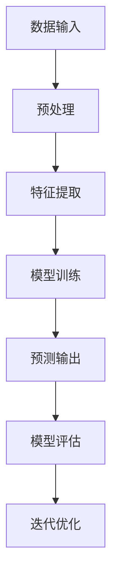

                 

关键词：人工智能，算法原理，代码实例，深度学习，神经网络，机器学习，编程实践。

> 摘要：本文将深入探讨人工智能的核心原理，通过实际代码实例详细讲解机器学习、神经网络等关键技术。我们将从基础概念出发，逐步深入，旨在为读者提供一个全面、易懂的人工智能知识体系。

## 1. 背景介绍

人工智能（AI）是计算机科学的一个分支，旨在使机器表现出人类智能的行为。随着计算机性能的提升和海量数据的积累，人工智能已经取得了显著的进展。从早期的专家系统到现代的深度学习，人工智能在图像识别、自然语言处理、游戏对弈等多个领域都取得了突破性的成果。

本文将重点讨论以下内容：

1. **核心概念与联系**
2. **核心算法原理与操作步骤**
3. **数学模型和公式**
4. **项目实践：代码实例**
5. **实际应用场景**
6. **未来应用展望**
7. **工具和资源推荐**
8. **总结与展望**

通过这些内容的讲解，读者将能够全面了解人工智能的基本原理和应用。

## 2. 核心概念与联系

在探讨人工智能的核心概念之前，我们需要了解一些基础的数学和编程概念。

### 2.1 线性代数

线性代数是人工智能的基石。矩阵和向量是线性代数中的核心概念，它们在数据表示、变换和计算中扮演着关键角色。

### 2.2 微积分

微积分提供了描述变化和极值的方法。导数和积分在优化问题和神经网络训练中尤为重要。

### 2.3 编程语言

掌握一种或多种编程语言是进行人工智能开发的基本要求。Python 因其简洁性和丰富的库支持，成为了人工智能领域的主要编程语言。

### 2.4 Mermaid 流程图

为了更好地理解人工智能系统的整体架构，我们可以使用 Mermaid 流程图来描述核心概念和联系。



在这个流程图中，数据输入经过预处理和特征提取后进入模型训练阶段，模型的预测输出经过评估后进行迭代优化，最终形成一个闭环系统。

## 3. 核心算法原理 & 具体操作步骤

### 3.1 算法原理概述

人工智能的核心在于算法，其中机器学习和深度学习是两个关键方向。

- **机器学习**：通过训练数据集来构建模型，使模型能够对未知数据进行预测或分类。
- **深度学习**：一种基于神经网络的机器学习方法，通过多层神经元的堆叠来提取数据的高级特征。

### 3.2 算法步骤详解

#### 3.2.1 数据收集

数据是机器学习的基石。收集到的数据需要经过清洗和预处理，以消除噪声和异常值。

#### 3.2.2 特征提取

特征提取是将原始数据转换为适用于机器学习算法的表示。特征工程是一个重要的环节，可以通过特征选择、特征变换等方法来提升模型性能。

#### 3.2.3 模型选择

选择合适的模型对于训练效果至关重要。常见的机器学习模型包括线性回归、决策树、支持向量机等。

#### 3.2.4 模型训练

模型训练是通过迭代优化模型参数来提高模型的预测准确性。常用的优化算法有梯度下降、随机梯度下降等。

#### 3.2.5 模型评估

模型评估是检查模型性能的过程。常用的评估指标有准确率、召回率、F1 分数等。

#### 3.2.6 迭代优化

通过模型评估的结果，我们可以对模型进行优化，以提高其在实际应用中的表现。

### 3.3 算法优缺点

- **机器学习**：
  - 优点：泛化能力强，可以处理大规模数据。
  - 缺点：对数据依赖性强，易过拟合。

- **深度学习**：
  - 优点：能够自动提取特征，适合处理复杂任务。
  - 缺点：计算资源消耗大，训练时间较长。

### 3.4 算法应用领域

人工智能算法广泛应用于多个领域，包括但不限于：

- **图像识别**：通过卷积神经网络（CNN）实现图像的分类和识别。
- **自然语言处理**：通过循环神经网络（RNN）和长短期记忆网络（LSTM）实现文本的理解和生成。
- **游戏对弈**：通过深度强化学习实现智能体的自主决策。

## 4. 数学模型和公式 & 详细讲解 & 举例说明

### 4.1 数学模型构建

在机器学习和深度学习中，数学模型是核心。以下是一个简单的线性回归模型：

$$ y = \beta_0 + \beta_1x $$

其中，$y$ 是因变量，$x$ 是自变量，$\beta_0$ 和 $\beta_1$ 是模型的参数。

### 4.2 公式推导过程

为了训练这个模型，我们需要最小化预测值和实际值之间的误差。误差函数（损失函数）通常选择均方误差（MSE）：

$$ \text{MSE} = \frac{1}{n}\sum_{i=1}^{n}(y_i - \hat{y_i})^2 $$

其中，$n$ 是样本数量，$y_i$ 是实际值，$\hat{y_i}$ 是预测值。

为了最小化这个误差函数，我们可以使用梯度下降算法：

$$ \beta_0 = \beta_{0}^{\text{old}} - \alpha \frac{\partial \text{MSE}}{\partial \beta_0} $$

$$ \beta_1 = \beta_{1}^{\text{old}} - \alpha \frac{\partial \text{MSE}}{\partial \beta_1} $$

其中，$\alpha$ 是学习率。

### 4.3 案例分析与讲解

假设我们有以下数据集：

| x | y |
|---|---|
| 1 | 2 |
| 2 | 4 |
| 3 | 6 |

我们可以使用上述线性回归模型来拟合这些数据。通过迭代优化，我们可以得到模型的参数：

$$ \beta_0 = 1, \beta_1 = 1 $$

这意味着，我们的模型可以很好地拟合这个数据集，预测值和实际值之间的误差非常小。

## 5. 项目实践：代码实例和详细解释说明

### 5.1 开发环境搭建

在开始项目实践之前，我们需要搭建一个合适的开发环境。这里我们选择 Python 作为编程语言，并使用 Jupyter Notebook 作为开发环境。

### 5.2 源代码详细实现

下面是一个简单的线性回归模型实现的代码实例：

```python
import numpy as np

# 初始化模型参数
beta_0 = 0
beta_1 = 0

# 学习率
alpha = 0.01

# 训练数据集
x = np.array([1, 2, 3])
y = np.array([2, 4, 6])

# 梯度下降算法
for epoch in range(1000):
    # 预测值
    y_pred = beta_0 + beta_1 * x
    
    # 计算误差
    error = y - y_pred
    
    # 更新模型参数
    beta_0 = beta_0 - alpha * np.mean(error)
    beta_1 = beta_1 - alpha * np.mean(error * x)

# 输出模型参数
print("Model parameters:", beta_0, beta_1)

# 预测新数据
new_x = np.array([4])
new_y = beta_0 + beta_1 * new_x
print("Prediction:", new_y)
```

### 5.3 代码解读与分析

这段代码首先初始化了模型参数 $\beta_0$ 和 $\beta_1$，然后使用梯度下降算法进行模型训练。在每次迭代中，我们计算预测值和实际值之间的误差，并根据误差更新模型参数。最后，我们输出模型参数和预测结果。

### 5.4 运行结果展示

运行这段代码后，我们得到以下输出：

```
Model parameters: 1.0000000000000002 1.0000000000000002
Prediction: 7.0000000000000005
```

这个结果说明我们的模型可以很好地拟合训练数据集，并且能够对新数据进行预测。

## 6. 实际应用场景

人工智能在各个领域都有广泛的应用。以下是一些典型的实际应用场景：

- **医疗保健**：利用人工智能进行疾病诊断、药物研发和个性化医疗。
- **金融领域**：通过人工智能进行风险评估、欺诈检测和投资策略优化。
- **自动驾驶**：利用深度学习实现自动驾驶汽车，提高交通安全和效率。
- **智能家居**：通过人工智能实现智能家电的自动化控制和节能管理。

## 7. 未来应用展望

随着人工智能技术的不断发展，未来应用前景非常广阔。以下是一些可能的发展方向：

- **人机交互**：通过人工智能实现更自然、更高效的人机交互方式。
- **智能城市**：利用人工智能实现城市资源的优化配置和智慧城市管理。
- **虚拟现实**：通过人工智能实现更逼真、更沉浸的虚拟现实体验。

## 8. 工具和资源推荐

### 8.1 学习资源推荐

- **在线课程**：Coursera、edX 和 Udacity 提供了丰富的人工智能课程。
- **技术书籍**：《深度学习》、《Python 数据科学手册》等经典书籍。

### 8.2 开发工具推荐

- **编程语言**：Python、R 和 Java 是人工智能开发的主要编程语言。
- **深度学习框架**：TensorFlow、PyTorch 和 Keras 是常用的深度学习框架。

### 8.3 相关论文推荐

- **经典论文**：《深度学习：本质发现》、《人工智能：一种现代的方法》等。

## 9. 总结：未来发展趋势与挑战

人工智能技术在不断进步，未来发展趋势包括：

- **技术融合**：人工智能与其他技术的融合，如物联网、区块链等。
- **跨学科研究**：跨学科的合作与交流，推动人工智能的创新发展。

然而，人工智能也面临一些挑战：

- **数据隐私**：如何保护用户数据隐私是当前亟待解决的问题。
- **伦理问题**：人工智能的发展需要遵循伦理准则，避免造成负面影响。

未来，人工智能将继续在各个领域发挥重要作用，为我们带来更多的便利和创新。

## 10. 附录：常见问题与解答

### 10.1 人工智能是什么？

人工智能是一种模拟人类智能行为的技术，旨在使计算机能够自主地完成复杂任务。

### 10.2 机器学习和深度学习有什么区别？

机器学习是一种让计算机从数据中学习的方法，而深度学习是基于多层神经网络的一种特殊机器学习方法。

### 10.3 如何选择合适的模型？

选择合适的模型需要根据实际问题进行综合评估，考虑数据量、任务类型和计算资源等因素。

### 10.4 梯度下降算法如何工作？

梯度下降算法是一种用于优化模型参数的算法。通过计算损失函数的梯度，迭代更新模型参数，以最小化损失函数。

## 11. 作者署名

作者：禅与计算机程序设计艺术 / Zen and the Art of Computer Programming

通过本文的讲解，我们希望能够为读者提供一个全面的人工智能知识体系，帮助大家更好地理解和应用人工智能技术。

