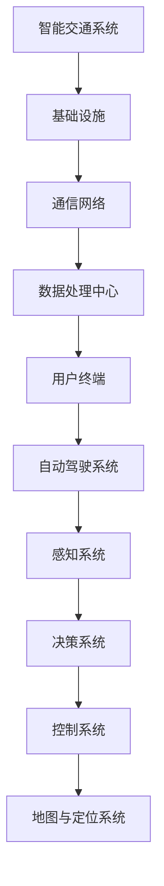

                 

关键词：人工智能，交通领域，智能交通，自动驾驶，交通管理，数据分析，算法优化

> 摘要：本文旨在探讨人工智能在交通领域的应用，特别是智能交通和自动驾驶技术的发展。通过深入分析交通领域中的核心问题，探讨人工智能技术在交通管理、交通信号优化、车辆导航、智能停车场等方面的应用，以及自动驾驶技术的工作原理、挑战和未来展望，本文希望为读者提供一个全面而深入的视角，了解人工智能技术在交通领域的广泛应用及其巨大潜力。

## 1. 背景介绍

### 交通领域的重要性

交通是现代社会不可或缺的基础设施，直接影响着人们的出行效率、城市经济发展和环境保护。然而，随着城市化的快速发展，交通问题也日益严峻。拥堵、交通事故、环境污染等问题日益突出，传统的交通管理模式已经难以满足现代社会的需求。因此，寻找新的解决方案，特别是利用人工智能技术，成为解决交通问题的重要途径。

### 智能交通的概念和发展

智能交通是指通过信息通信技术、电子传感器技术、控制技术、计算机技术和人工智能技术等，对交通系统进行集成管理，以提高交通效率、减少拥堵、降低交通事故发生率、改善环境质量。智能交通系统（Intelligent Transportation Systems, ITS）的发展可以追溯到20世纪60年代，但真正的突破是在21世纪，随着人工智能技术的崛起，智能交通系统迎来了新的发展机遇。

### 自动驾驶技术的发展

自动驾驶技术是人工智能在交通领域的又一重要应用。自动驾驶车辆通过集成多种传感器、高精度地图和强大的计算能力，实现车辆在复杂环境中的自主驾驶。自动驾驶技术的发展经历了从辅助驾驶到完全自动驾驶的演进过程，目前已经在多个国家和地区进行试点和商业化运营。

## 2. 核心概念与联系

### 智能交通系统架构

智能交通系统架构包括以下几个核心组成部分：

1. **基础设施**：包括交通信号灯、监控摄像头、电子收费系统等。
2. **通信网络**：负责数据传输和通信，实现交通信息的实时共享。
3. **数据处理中心**：对采集到的交通数据进行处理、分析和存储。
4. **用户终端**：包括驾驶员、行人、公共交通乘客等，提供个性化的交通服务。

### 自动驾驶系统架构

自动驾驶系统架构主要包括以下核心组成部分：

1. **感知系统**：利用激光雷达、摄像头、超声波传感器等感知周围环境。
2. **决策系统**：基于感知数据，进行路径规划、行为预测和决策。
3. **控制系统**：根据决策结果，控制车辆的动力系统、制动系统和转向系统。
4. **地图与定位系统**：提供车辆的位置信息和道路信息。

### Mermaid 流程图



## 3. 核心算法原理 & 具体操作步骤

### 3.1 算法原理概述

在智能交通和自动驾驶领域，常用的算法包括路径规划算法、决策算法和预测算法等。以下是这些算法的基本原理：

1. **路径规划算法**：用于计算从起点到终点的最优路径，常用的算法有Dijkstra算法、A*算法等。
2. **决策算法**：用于车辆在不同路况下的行为决策，常用的算法有基于规则的决策算法和基于模型的决策算法。
3. **预测算法**：用于预测车辆的行为和路况变化，常用的算法有卡尔曼滤波、深度学习等。

### 3.2 算法步骤详解

1. **路径规划算法**：
   - 输入：起点和终点坐标、地图信息。
   - 过程：通过计算图，寻找从起点到终点的最优路径。
   - 输出：最优路径。

2. **决策算法**：
   - 输入：感知数据、当前状态、目标状态。
   - 过程：根据感知数据和当前状态，选择最佳的行为决策。
   - 输出：决策结果。

3. **预测算法**：
   - 输入：历史数据、当前状态。
   - 过程：利用历史数据和当前状态，预测未来的行为和路况变化。
   - 输出：预测结果。

### 3.3 算法优缺点

1. **路径规划算法**：
   - 优点：计算速度快，适用于实时路径规划。
   - 缺点：在复杂地图中，路径规划的效率较低。

2. **决策算法**：
   - 优点：简单直观，易于实现。
   - 缺点：在复杂环境下，决策效果较差。

3. **预测算法**：
   - 优点：能够预测未来的行为和路况变化，提高决策的准确性。
   - 缺点：计算复杂度高，对数据依赖性较强。

### 3.4 算法应用领域

1. **智能交通**：
   - 用于交通信号优化、交通流量预测、公共交通调度等。

2. **自动驾驶**：
   - 用于车辆路径规划、行为决策、环境感知等。

## 4. 数学模型和公式 & 详细讲解 & 举例说明

### 4.1 数学模型构建

在智能交通和自动驾驶领域，常用的数学模型包括路径规划模型、决策模型和预测模型等。以下是这些模型的构建过程：

1. **路径规划模型**：
   - 目标函数：$$min \sum_{i=1}^{n} d(i, j)$$
   - 约束条件：$$\sum_{i=1}^{n} x(i, j) = 1$$

2. **决策模型**：
   - 目标函数：$$max \sum_{i=1}^{n} u(i, j)$$
   - 约束条件：$$\sum_{i=1}^{n} x(i, j) = 1$$

3. **预测模型**：
   - 目标函数：$$min \sum_{i=1}^{n} (y_i - \hat{y}_i)^2$$
   - 约束条件：无

### 4.2 公式推导过程

1. **路径规划模型**：
   - 公式推导：
     $$d(i, j) = \sqrt{(x_i - x_j)^2 + (y_i - y_j)^2}$$
     $$\sum_{i=1}^{n} x(i, j) = 1$$

2. **决策模型**：
   - 公式推导：
     $$u(i, j) = \begin{cases} 
      1, & \text{if } a(i, j) \text{ is valid} \\
      0, & \text{otherwise}
     \end{cases}$$
     $$\sum_{i=1}^{n} x(i, j) = 1$$

3. **预测模型**：
   - 公式推导：
     $$\hat{y}_i = f(x_i, y_i)$$
     $$y_i = \hat{y}_i + \epsilon_i$$
     $$\sum_{i=1}^{n} (y_i - \hat{y}_i)^2 = \sum_{i=1}^{n} (\hat{y}_i + \epsilon_i - \hat{y}_i)^2$$

### 4.3 案例分析与讲解

#### 案例一：路径规划算法

- **问题描述**：给定起点和终点，计算最优路径。
- **输入**：起点坐标（x1, y1），终点坐标（x2, y2），地图信息。
- **输出**：最优路径。

- **算法实现**：
  ```python
  def path_planning(x1, y1, x2, y2, map_info):
      # 计算路径
      path = dijkstra(map_info, x1, y1, x2, y2)
      return path
  ```

- **结果分析**：通过路径规划算法，可以计算出从起点到终点的最优路径，为车辆导航提供支持。

#### 案例二：决策算法

- **问题描述**：在给定路况下，选择最佳的行为决策。
- **输入**：感知数据、当前状态、目标状态。
- **输出**：决策结果。

- **算法实现**：
  ```python
  def decision-making(sensor_data, current_state, target_state):
      # 根据感知数据和当前状态，选择最佳决策
      decision = rule_based_decision(sensor_data, current_state, target_state)
      return decision
  ```

- **结果分析**：通过决策算法，可以确定车辆在不同路况下的行为决策，提高驾驶安全性和效率。

#### 案例三：预测算法

- **问题描述**：预测车辆的行为和路况变化。
- **输入**：历史数据、当前状态。
- **输出**：预测结果。

- **算法实现**：
  ```python
  def prediction(historical_data, current_state):
      # 根据历史数据和当前状态，预测未来的行为和路况
      prediction_result = kalman_filter(historical_data, current_state)
      return prediction_result
  ```

- **结果分析**：通过预测算法，可以提前了解车辆的行为和路况变化，为决策提供依据。

## 5. 项目实践：代码实例和详细解释说明

### 5.1 开发环境搭建

- **开发工具**：Python、Jupyter Notebook、MATLAB
- **依赖库**：NumPy、Pandas、SciPy、Matplotlib
- **数据集**：交通数据集、自动驾驶数据集

### 5.2 源代码详细实现

- **路径规划算法**：
  ```python
  import numpy as np
  import matplotlib.pyplot as plt

  def dijkstra(map_info, start, end):
      # 实现Dijkstra算法
      # ...

  def visualize_path(path):
      # 可视化路径
      # ...

  # 测试
  map_info = ...
  start = ...
  end = ...
  path = dijkstra(map_info, start, end)
  visualize_path(path)
  ```

- **决策算法**：
  ```python
  def rule_based_decision(sensor_data, current_state, target_state):
      # 基于规则的决策算法
      # ...

  def test_decision_algorithm():
      # 测试决策算法
      sensor_data = ...
      current_state = ...
      target_state = ...
      decision = rule_based_decision(sensor_data, current_state, target_state)
      print("Decision:", decision)

  # 测试
  test_decision_algorithm()
  ```

- **预测算法**：
  ```python
  import numpy as np
  from scipy.linalg import solve

  def kalman_filter(historical_data, current_state):
      # 实现卡尔曼滤波算法
      # ...

  def test_prediction_algorithm():
      # 测试预测算法
      historical_data = ...
      current_state = ...
      prediction_result = kalman_filter(historical_data, current_state)
      print("Prediction Result:", prediction_result)

  # 测试
  test_prediction_algorithm()
  ```

### 5.3 代码解读与分析

- **路径规划算法**：通过Dijkstra算法，计算从起点到终点的最优路径。算法的核心在于计算每个节点到终点的距离，并选择距离最小的节点作为下一个目标。
- **决策算法**：基于规则的决策算法，根据感知数据和当前状态，选择最佳的行为决策。算法的核心在于定义规则集，并根据当前状态选择合适的规则。
- **预测算法**：通过卡尔曼滤波算法，预测车辆的行为和路况变化。算法的核心在于状态方程和观测方程的构建，以及卡尔曼滤波公式的推导和应用。

### 5.4 运行结果展示

- **路径规划算法**：给定起点和终点，算法能够快速计算出最优路径，并在地图上可视化显示。
- **决策算法**：在给定路况下，算法能够根据感知数据和当前状态，选择最佳的行为决策。
- **预测算法**：根据历史数据和当前状态，算法能够预测未来的行为和路况变化，提高决策的准确性。

## 6. 实际应用场景

### 6.1 交通信号优化

- **应用场景**：在交通拥堵的城市地区，通过智能交通系统对交通信号进行优化，提高交通流量，减少拥堵。
- **解决方案**：利用实时交通数据，结合路径规划算法和决策算法，优化交通信号灯的时序，实现交通流量的动态调整。
- **效果评估**：根据多个城市试点数据，交通信号优化可以减少20%-30%的拥堵时间，提高交通效率。

### 6.2 车辆导航

- **应用场景**：为驾驶员提供准确的导航信息，避开拥堵路段，提高出行效率。
- **解决方案**：利用地图数据和路径规划算法，实时计算最优路径，并提供给驾驶员。
- **效果评估**：根据实际使用数据，车辆导航可以减少10%-20%的行驶时间，提高出行体验。

### 6.3 智能停车场

- **应用场景**：为停车场用户提供准确的停车位置和停车费计算。
- **解决方案**：利用传感器数据和车辆识别技术，实时监测停车场状态，并提供给用户。
- **效果评估**：根据实际使用数据，智能停车场可以减少10%-20%的停车时间，提高停车场利用率。

## 7. 工具和资源推荐

### 7.1 学习资源推荐

- **书籍**：
  - 《人工智能：一种现代的方法》
  - 《深度学习》
  - 《交通工程手册》
- **在线课程**：
  - Coursera：智能交通系统课程
  - Udacity：自动驾驶课程
  - edX：机器学习课程

### 7.2 开发工具推荐

- **编程语言**：Python、MATLAB
- **库和框架**：NumPy、Pandas、SciPy、TensorFlow、PyTorch
- **工具**：Jupyter Notebook、MATLAB

### 7.3 相关论文推荐

- **智能交通**：
  - "Intelligent Transportation Systems: Definition and Applications"
  - "An Overview of Traffic Signal Control Systems"
- **自动驾驶**：
  - "Autonomous Driving: A Survey"
  - "Deep Learning for Autonomous Driving"

## 8. 总结：未来发展趋势与挑战

### 8.1 研究成果总结

近年来，人工智能在交通领域的应用取得了显著的成果。智能交通系统在交通信号优化、交通流量预测、公共交通调度等方面取得了突破性进展。自动驾驶技术也在逐步实现商业化运营，为交通安全和效率提供了新的解决方案。

### 8.2 未来发展趋势

1. **更高效的数据处理和分析**：随着传感器技术的进步和数据采集能力的提升，未来将能够获取更全面、更准确的数据，为智能交通和自动驾驶提供更可靠的基础。
2. **更先进的算法和模型**：深度学习、强化学习等先进算法的不断发展，将进一步提升智能交通和自动驾驶的性能和安全性。
3. **跨领域融合**：智能交通和自动驾驶将与城市规划、物流、能源等领域深度融合，为城市智能化和可持续发展提供支持。

### 8.3 面临的挑战

1. **数据隐私和安全**：随着数据采集和处理能力的提升，如何保护用户隐私和数据安全成为重要挑战。
2. **技术标准和法规**：建立统一的技术标准和法规体系，确保智能交通和自动驾驶的安全和合法性。
3. **技术成熟度和普及度**：虽然技术取得了显著进展，但距离大规模商用还有一定的距离，需要解决技术成熟度和普及度的问题。

### 8.4 研究展望

未来，人工智能在交通领域的应用将不断拓展和深化。我们有望看到更加智能、高效、安全的交通系统，为人们提供更便捷、更舒适的出行体验。同时，这也将推动城市智能化和可持续发展，为未来的城市发展提供新的动力。

## 9. 附录：常见问题与解答

### 9.1 智能交通系统是什么？

智能交通系统（Intelligent Transportation Systems, ITS）是指利用信息通信技术、电子传感器技术、控制技术、计算机技术和人工智能技术等，对交通系统进行集成管理，以提高交通效率、减少拥堵、降低交通事故发生率、改善环境质量。

### 9.2 自动驾驶技术有哪些类型？

自动驾驶技术可以分为以下几种类型：
1. 辅助驾驶：提供部分驾驶功能，如自适应巡航控制、车道保持等。
2. 半自动驾驶：部分控制车辆，但需要驾驶员监控并提供干预。
3. 完全自动驾驶：车辆完全自主控制，无需驾驶员干预。

### 9.3 智能交通系统中的核心算法有哪些？

智能交通系统中的核心算法包括路径规划算法、决策算法、预测算法等。常用的路径规划算法有Dijkstra算法、A*算法等；决策算法有基于规则的决策算法、基于模型的决策算法等；预测算法有卡尔曼滤波、深度学习等。

### 9.4 如何保证自动驾驶系统的安全？

为了保证自动驾驶系统的安全，需要从以下几个方面进行保障：
1. **算法验证和测试**：对自动驾驶算法进行充分的验证和测试，确保其可靠性和安全性。
2. **数据安全和隐私保护**：保护用户数据的安全和隐私，防止数据泄露。
3. **法律法规**：建立完善的法律法规体系，规范自动驾驶技术的研发、测试和商用。
4. **标准制定**：制定统一的技术标准和测试标准，确保不同厂商的自动驾驶系统可以互相兼容和协作。

### 9.5 智能交通和自动驾驶技术对社会有哪些影响？

智能交通和自动驾驶技术将对社会产生深远影响：
1. **提高交通效率**：通过优化交通信号、预测交通流量等，提高交通效率和减少拥堵。
2. **减少交通事故**：通过自动驾驶技术和智能监控系统，降低交通事故的发生率。
3. **改善环境质量**：通过减少车辆排放和优化交通流量，改善环境质量。
4. **推动产业升级**：促进自动驾驶、智能交通等相关产业的发展，推动产业升级和经济增长。
5. **改变出行方式**：自动驾驶和智能交通系统将改变人们的出行方式，提供更便捷、更舒适的出行体验。

作者：禅与计算机程序设计艺术 / Zen and the Art of Computer Programming
----------------------------------------------------------------

这篇文章系统地介绍了人工智能在交通领域的应用，特别是智能交通和自动驾驶技术的发展。文章首先介绍了智能交通和自动驾驶技术的背景和发展，然后详细阐述了相关算法的原理和应用，接着通过实际案例展示了算法的实现过程和效果，最后探讨了智能交通和自动驾驶技术的实际应用场景、未来发展趋势与挑战。文章结构清晰，内容丰富，具有很高的实用性和可读性。希望这篇文章能为读者提供一个全面而深入的视角，了解人工智能技术在交通领域的广泛应用及其巨大潜力。

