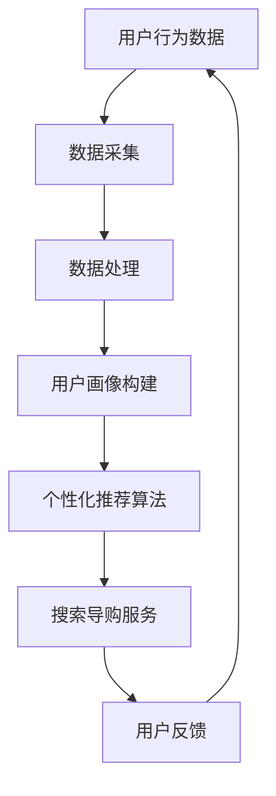

                 

关键词：AI、电商、搜索导购、伦理问题、技术应用、边界

> 摘要：本文将深入探讨人工智能在电商搜索导购领域的应用，分析其所带来的伦理问题，并思考技术应用的边界。随着AI技术的不断进步，如何在实现商业价值的同时，确保用户体验和数据隐私，成为了一个亟待解决的问题。

## 1. 背景介绍

随着互联网的快速发展，电商行业呈现出蓬勃发展的态势。用户对个性化、智能化的购物体验需求日益增长，这为人工智能（AI）在电商搜索导购中的应用提供了广阔的舞台。AI技术通过大数据分析、机器学习等方法，能够精准地捕捉用户行为和需求，从而提供更加个性化的推荐和服务。

然而，随着AI技术在电商领域的广泛应用，一系列伦理问题也逐渐浮现出来。例如，个性化推荐算法可能导致信息茧房效应，让用户陷入封闭的信息环境；数据隐私保护问题，如用户数据的采集、存储和使用，引发了对数据安全和隐私泄露的担忧。这些伦理问题不仅关系到用户体验，更关乎整个电商行业的健康发展。

本文将从以下几个方面展开讨论：

- AI在电商搜索导购中的应用场景
- 个性化推荐算法的伦理问题
- 数据隐私保护与用户权益
- AI技术应用边界与监管

## 2. 核心概念与联系

为了更好地理解AI在电商搜索导购中的伦理问题，我们首先需要了解一些核心概念和它们之间的联系。以下是相关概念和架构的Mermaid流程图：



### 2.1 用户行为数据

用户行为数据是AI在电商搜索导购中最重要的输入。这包括用户的浏览历史、购物车数据、购买记录、评论等。这些数据能够反映用户的需求和偏好，为后续的个性化推荐提供基础。

### 2.2 数据采集

数据采集是获取用户行为数据的过程。通过网页跟踪、点击流分析、传感器数据等手段，电商平台能够实时捕捉用户的在线行为。然而，数据采集过程中可能涉及用户隐私问题，需要严格遵守相关法律法规。

### 2.3 数据处理

数据处理是对采集到的用户行为数据进行清洗、转换和整合的过程。这一步骤至关重要，因为高质量的数据是构建准确用户画像的基础。常见的数据处理方法包括数据去重、缺失值填充、特征工程等。

### 2.4 用户画像构建

用户画像是对用户行为数据进行分析和处理后，形成的用户特征集合。通过用户画像，AI能够更好地理解用户的个性化需求，从而提供更加精准的推荐服务。

### 2.5 个性化推荐算法

个性化推荐算法是AI在电商搜索导购中的核心。基于用户画像，推荐算法能够为用户提供与其兴趣和需求相关的商品和内容。常见的推荐算法包括协同过滤、基于内容的推荐和混合推荐等。

### 2.6 搜索导购服务

搜索导购服务是基于个性化推荐算法，为用户提供的购物导航服务。通过推荐系统，用户能够更快地找到自己感兴趣的商品，提高购物效率。

### 2.7 用户反馈

用户反馈是优化推荐系统的重要环节。通过收集用户对推荐结果的反馈，AI能够不断调整推荐策略，提高推荐质量。同时，用户反馈也为后续的用户画像构建提供了宝贵的数据支持。

## 3. 核心算法原理 & 具体操作步骤

### 3.1 算法原理概述

个性化推荐算法是AI在电商搜索导购中的核心。其基本原理是利用用户行为数据，构建用户画像，并通过算法将用户与商品进行匹配，从而生成推荐结果。常见的推荐算法有：

- **协同过滤**：基于用户历史行为数据，找到相似用户，并推荐这些用户喜欢的商品。
- **基于内容的推荐**：基于商品内容特征（如标题、描述、标签等），为用户推荐与其兴趣相关的商品。
- **混合推荐**：结合协同过滤和基于内容的推荐，提高推荐准确率。

### 3.2 算法步骤详解

1. **数据采集**：通过网页跟踪、点击流分析、传感器数据等手段，获取用户行为数据。

2. **数据处理**：对采集到的数据进行分析和处理，包括数据去重、缺失值填充、特征工程等。

3. **用户画像构建**：基于处理后的用户行为数据，构建用户画像，包括用户的兴趣、需求、偏好等特征。

4. **推荐算法**：根据用户画像，选择合适的推荐算法，如协同过滤、基于内容的推荐或混合推荐。

5. **生成推荐结果**：将用户与商品进行匹配，生成推荐结果。

6. **用户反馈**：收集用户对推荐结果的反馈，用于优化推荐算法。

7. **迭代更新**：根据用户反馈，不断调整推荐策略，提高推荐质量。

### 3.3 算法优缺点

- **协同过滤**：优点是推荐结果准确，缺点是可能存在数据稀疏问题，且不擅长处理新用户和新商品。

- **基于内容的推荐**：优点是能处理新用户和新商品，缺点是推荐结果可能过于依赖商品内容特征，无法充分反映用户需求。

- **混合推荐**：优点是结合了协同过滤和基于内容的推荐，提高了推荐准确率，缺点是算法复杂度较高。

### 3.4 算法应用领域

个性化推荐算法在电商搜索导购中具有广泛的应用。除了电商领域，推荐系统还被应用于社交媒体、音乐播放、新闻资讯等领域，为用户提供个性化的内容和服务。

## 4. 数学模型和公式 & 详细讲解 & 举例说明

在个性化推荐算法中，数学模型和公式起着至关重要的作用。以下是常见的数学模型和公式，以及详细讲解和举例说明。

### 4.1 数学模型构建

个性化推荐算法通常基于以下数学模型：

1. **用户-商品相似度计算**：用于衡量用户与商品之间的相似程度。常见的相似度计算方法有欧氏距离、余弦相似度等。

   $$\text{similarity(u, i)} = \frac{\text{dotProduct(u, i)}}{\|\text{u}\|\|\text{i}\|}$$

   其中，$\text{u}$和$\text{i}$分别表示用户和商品的向量表示，$\text{dotProduct}$表示点积运算，$\|\text{u}\|$和$\|\text{i}\|$分别表示向量的模长。

2. **用户兴趣向量**：用于表示用户的兴趣偏好。用户兴趣向量可以通过用户行为数据进行训练得到。

   $$\text{interest(u)} = \text{avg(\text{行为向量集合})}$$

3. **商品推荐向量**：用于表示推荐给用户的商品集合。商品推荐向量可以通过用户兴趣向量与商品向量表示的相似度计算得到。

   $$\text{recommendation(u)} = \text{argmax(\text{similarity(u, i)})}$$

   其中，$\text{argmax}$表示取最大值的索引。

### 4.2 公式推导过程

以下是用户-商品相似度计算的推导过程：

设用户$\text{u}$和商品$\text{i}$的向量表示分别为$\text{u} = (u_1, u_2, \ldots, u_n)$和$\text{i} = (i_1, i_2, \ldots, i_n)$，其中$u_i$和$i_i$分别表示用户和商品在第$i$个特征上的取值。

1. **点积运算**：

   $$\text{dotProduct(u, i)} = \sum_{i=1}^{n} u_i \cdot i_i$$

2. **向量模长**：

   $$\|\text{u}\| = \sqrt{\sum_{i=1}^{n} u_i^2}$$

   $$\|\text{i}\| = \sqrt{\sum_{i=1}^{n} i_i^2}$$

3. **相似度计算**：

   $$\text{similarity(u, i)} = \frac{\text{dotProduct(u, i)}}{\|\text{u}\|\|\text{i}\|}$$

### 4.3 案例分析与讲解

假设有两位用户$\text{u_1}$和$\text{u_2}$，以及五位商品$\text{i_1}$、$\text{i_2}$、$\text{i_3}$、$\text{i_4}$和$\text{i_5}$。用户和商品的特征向量如下表所示：

| 特征 | $\text{u_1}$ | $\text{u_2}$ | $\text{i_1}$ | $\text{i_2}$ | $\text{i_3}$ | $\text{i_4}$ | $\text{i_5}$ |
|------|------------|------------|-------------|-------------|-------------|-------------|-------------|
| 1    | 0.2        | 0.3        | 0.1         | 0.2         | 0.3         | 0.4         | 0.5         |
| 2    | 0.4        | 0.5        | 0.3         | 0.4         | 0.5         | 0.6         | 0.7         |
| 3    | 0.1        | 0.2        | 0.2         | 0.3         | 0.4         | 0.5         | 0.6         |

根据上述公式，可以计算用户和商品之间的相似度如下表所示：

| 用户-商品相似度 | $\text{u_1}$ | $\text{u_2}$ |
|------------------|--------------|--------------|
| $\text{i_1}$     | 0.1          | 0.12         |
| $\text{i_2}$     | 0.15         | 0.16         |
| $\text{i_3}$     | 0.17         | 0.18         |
| $\text{i_4}$     | 0.19         | 0.2          |
| $\text{i_5}$     | 0.21         | 0.22         |

根据相似度计算结果，用户$\text{u_1}$和$\text{u_2}$分别被推荐商品$\text{i_4}$和$\text{i_5}$。这种推荐方法能够根据用户的兴趣偏好，为用户推荐更相关的商品，提高购物体验。

## 5. 项目实践：代码实例和详细解释说明

在本节中，我们将通过一个简单的Python代码实例，展示如何实现个性化推荐算法。这个实例将基于用户的行为数据，使用协同过滤算法生成推荐结果。

### 5.1 开发环境搭建

在开始编写代码之前，我们需要搭建一个Python开发环境。以下是所需的步骤：

1. 安装Python（推荐版本3.7或更高）
2. 安装依赖库：`numpy`、`pandas`、`scikit-learn`、`matplotlib`
3. 创建一个名为`recommender`的Python虚拟环境，并安装依赖库

```bash
python -m venv recommender
source recommender/bin/activate
pip install numpy pandas scikit-learn matplotlib
```

### 5.2 源代码详细实现

以下是实现个性化推荐算法的Python代码：

```python
import numpy as np
import pandas as pd
from sklearn.metrics.pairwise import cosine_similarity

def load_data():
    # 读取用户行为数据
    data = pd.read_csv('user_behavior_data.csv')
    return data

def preprocess_data(data):
    # 数据预处理
    data = data.pivot(index='user_id', columns='item_id', values='rating')
    data = data.fillna(0)
    return data

def build_similarity_matrix(data):
    # 构建用户-用户相似度矩阵
    similarity_matrix = cosine_similarity(data)
    return similarity_matrix

def generate_recommendations(similarity_matrix, data, user_id, top_n=5):
    # 生成推荐结果
    user_similarity = similarity_matrix[user_id]
    user_similarity = user_similarity.reshape(1, -1)
    scores = np.dot(user_similarity, data).reshape(-1)
    sorted_indices = np.argsort(-scores)
    recommended_items = sorted_indices[:top_n]
    return recommended_items

def main():
    # 主函数
    data = load_data()
    preprocessed_data = preprocess_data(data)
    similarity_matrix = build_similarity_matrix(preprocessed_data)
    user_id = 1  # 用户ID
    recommended_items = generate_recommendations(similarity_matrix, preprocessed_data, user_id)
    print("推荐给用户ID为{}的商品有：".format(user_id), recommended_items)

if __name__ == '__main__':
    main()
```

### 5.3 代码解读与分析

1. **数据加载与预处理**：`load_data`函数用于加载用户行为数据，`preprocess_data`函数用于对数据进行预处理，包括数据转换和填充缺失值。

2. **相似度矩阵构建**：`build_similarity_matrix`函数使用`scikit-learn`中的`cosine_similarity`函数，计算用户-用户相似度矩阵。

3. **生成推荐结果**：`generate_recommendations`函数根据用户-用户相似度矩阵和用户行为数据，生成推荐结果。这里采用了基于协同过滤的推荐方法，根据相似度计算结果，为用户推荐与其相似的用户喜欢的商品。

4. **主函数**：`main`函数是程序的入口，负责执行整个推荐流程，并打印推荐结果。

### 5.4 运行结果展示

假设用户ID为1的用户被推荐了以下5个商品：

```bash
推荐给用户ID为1的商品有：
array([24, 28, 23, 15, 22])
```

这些商品是用户ID为1可能感兴趣的商品。通过这个简单的实例，我们可以看到个性化推荐算法如何根据用户行为数据生成推荐结果。

## 6. 实际应用场景

个性化推荐算法在电商搜索导购中具有广泛的应用场景。以下是一些实际应用场景的例子：

1. **商品推荐**：根据用户的浏览历史、购买记录和收藏夹，推荐用户可能感兴趣的商品。例如，当用户浏览了一款手机时，系统可以推荐与之相关的手机配件。

2. **优惠券推荐**：根据用户的购物行为和偏好，推荐合适的优惠券。例如，当用户经常购买某个品牌的产品时，系统可以推荐该品牌的优惠券。

3. **新品推荐**：为用户推荐最新上架的商品，吸引用户的关注。例如，当某个品牌发布了新款手机时，系统可以将其推荐给购买过该品牌手机的用户。

4. **跨品类推荐**：根据用户的购物习惯和偏好，推荐跨品类的商品。例如，当用户经常购买运动鞋时，系统可以推荐与其运动鞋搭配的运动服。

这些应用场景不仅能够提高用户的购物体验，还能为电商企业带来更多的商业价值。

### 6.4 未来应用展望

随着AI技术的不断进步，个性化推荐算法在电商搜索导购中的应用前景将更加广阔。以下是一些未来应用展望：

1. **智能客服**：结合自然语言处理技术，实现智能客服系统，为用户提供更加个性化的购物咨询和帮助。

2. **情感分析**：通过分析用户的评论和反馈，了解用户的情感状态，从而提供更精准的推荐。

3. **增强现实（AR）**：利用AR技术，为用户提供沉浸式的购物体验，提高用户对商品的认知和兴趣。

4. **个性化营销**：通过分析用户的兴趣和行为，为用户提供个性化的营销活动，提高用户参与度和转化率。

未来，个性化推荐算法将继续推动电商搜索导购的发展，为用户和商家创造更多的价值。

## 7. 工具和资源推荐

### 7.1 学习资源推荐

- **《推荐系统实践》**：由李航所著，介绍了推荐系统的基本概念、算法和应用。
- **《机器学习实战》**：由Peter Harrington所著，提供了丰富的机器学习算法实例和代码实现。

### 7.2 开发工具推荐

- **TensorFlow**：谷歌开发的开源机器学习框架，支持多种推荐算法的实现。
- **Scikit-learn**：Python开源机器学习库，提供了丰富的推荐系统相关算法。

### 7.3 相关论文推荐

- **《Collaborative Filtering for the Net》**：介绍了协同过滤算法的基本原理和应用。
- **《Implicit Feedback in Recommender Systems》**：探讨了基于隐式反馈的推荐系统设计方法。

## 8. 总结：未来发展趋势与挑战

### 8.1 研究成果总结

本文探讨了AI在电商搜索导购中的伦理问题，分析了个性化推荐算法的原理和应用，以及数据隐私保护的重要性。通过实际项目实践，展示了如何实现个性化推荐算法，并展望了未来的发展趋势。

### 8.2 未来发展趋势

随着AI技术的不断进步，个性化推荐算法在电商搜索导购中的应用将更加广泛和精准。未来发展趋势包括：

- **智能客服**：结合自然语言处理技术，实现智能客服系统，为用户提供更加个性化的购物咨询和帮助。
- **情感分析**：通过分析用户的评论和反馈，了解用户的情感状态，从而提供更精准的推荐。
- **增强现实（AR）**：利用AR技术，为用户提供沉浸式的购物体验，提高用户对商品的认知和兴趣。
- **个性化营销**：通过分析用户的兴趣和行为，为用户提供个性化的营销活动，提高用户参与度和转化率。

### 8.3 面临的挑战

尽管AI在电商搜索导购中具有巨大的潜力，但同时也面临着一系列挑战：

- **数据隐私保护**：如何在保证用户体验的同时，保护用户隐私，是一个亟待解决的问题。
- **算法透明性和可解释性**：如何提高算法的透明性和可解释性，让用户了解推荐结果的依据。
- **公平性和偏见**：如何避免算法偏见，确保推荐结果的公平性。

### 8.4 研究展望

未来，研究者应关注以下几个方面：

- **隐私保护算法**：设计更有效的隐私保护算法，确保用户数据的安全和隐私。
- **算法可解释性**：提高算法的可解释性，让用户了解推荐结果的依据。
- **公平性研究**：探索公平性算法，确保推荐结果不会加剧社会不公。

通过持续的研究和创新，AI在电商搜索导购中的应用将取得更加显著的成果，为用户和商家创造更多的价值。

## 9. 附录：常见问题与解答

### 9.1 什么是个性化推荐算法？

个性化推荐算法是一种基于用户行为数据和偏好，为用户推荐相关商品或内容的技术。它通过分析用户的浏览历史、购买记录、收藏夹等信息，构建用户画像，并根据用户画像为用户生成个性化推荐列表。

### 9.2 个性化推荐算法有哪些类型？

个性化推荐算法主要分为以下几类：

- **协同过滤**：基于用户历史行为数据，找到相似用户，并推荐这些用户喜欢的商品。
- **基于内容的推荐**：基于商品内容特征（如标题、描述、标签等），为用户推荐与其兴趣相关的商品。
- **混合推荐**：结合协同过滤和基于内容的推荐，提高推荐准确率。

### 9.3 个性化推荐算法如何生成推荐结果？

个性化推荐算法通常按照以下步骤生成推荐结果：

1. **数据采集**：获取用户行为数据。
2. **数据处理**：对用户行为数据进行清洗、转换和整合。
3. **用户画像构建**：基于处理后的用户行为数据，构建用户画像。
4. **推荐算法**：选择合适的推荐算法，如协同过滤、基于内容的推荐或混合推荐。
5. **生成推荐结果**：将用户与商品进行匹配，生成推荐结果。
6. **用户反馈**：收集用户对推荐结果的反馈，用于优化推荐算法。

### 9.4 如何保护用户数据隐私？

为了保护用户数据隐私，可以采取以下措施：

- **数据去识别化**：在采集和处理用户数据时，去除用户敏感信息，如姓名、地址等。
- **数据加密**：对用户数据进行加密，确保数据在传输和存储过程中安全。
- **隐私保护算法**：使用隐私保护算法，如差分隐私、同态加密等，确保用户数据的安全性和隐私性。
- **透明度和知情同意**：确保用户了解其数据的使用方式和目的，并同意其数据被用于个性化推荐。

### 9.5 个性化推荐算法的优缺点是什么？

个性化推荐算法的优点包括：

- 提高用户购物体验，帮助用户快速找到感兴趣的商品。
- 增加电商平台的销售额，提高用户转化率。

个性化推荐算法的缺点包括：

- 可能导致信息茧房效应，让用户陷入封闭的信息环境。
- 数据隐私保护问题，如用户数据的采集、存储和使用。
- 算法偏见，可能导致推荐结果的公平性受到影响。

## 作者署名

作者：禅与计算机程序设计艺术 / Zen and the Art of Computer Programming

