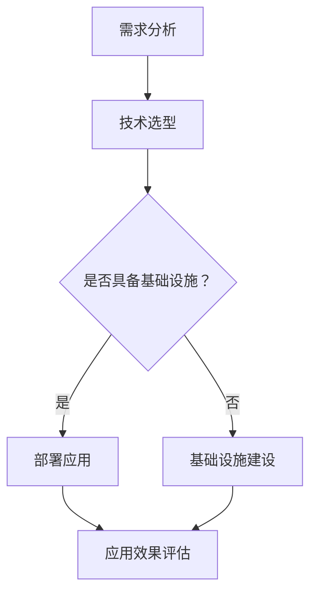

                 

关键词：人工智能，基础设施，乡村振兴，数字鸿沟，技术赋能，乡村振兴战略，信息技术，智慧农业，教育科技，医疗健康，经济发展

> 摘要：本文深入探讨了人工智能（AI）基础设施在乡村振兴战略中的应用，强调了通过技术手段缩小数字鸿沟的重要性。文章首先介绍了乡村振兴的背景和目标，然后详细分析了AI基础设施在农业、教育、医疗和经济发展等领域的作用。接着，文章提出了具体的项目实践和未来展望，并总结了对AI基础设施发展的建议和展望。

## 1. 背景介绍

### 1.1 乡村振兴战略

乡村振兴战略是中国政府为了解决城乡发展不平衡问题，推动农村经济转型升级，实现全体人民共同富裕的一项重要战略。该战略于2017年提出，旨在通过改革和创新，加强农村基础设施建设，提升农业现代化水平，促进农村一二三产业融合发展，改善农村居民生活条件。

### 1.2 数字鸿沟

数字鸿沟是指由于技术、经济、社会等因素导致的数字资源获取能力的不平等。在城乡之间，数字鸿沟表现为农村地区在信息技术基础设施、数字素养、数字应用等方面的落后。这导致了农村地区在经济发展、社会进步、公共服务等方面的滞后。

## 2. 核心概念与联系

### 2.1 人工智能基础设施

人工智能基础设施是指支持人工智能技术研发、应用和服务的软硬件基础设施，包括计算资源、数据资源、网络资源、算法资源等。在乡村振兴中，人工智能基础设施是实现技术赋能、缩小数字鸿沟的关键。

### 2.2 人工智能与乡村振兴的关系

人工智能与乡村振兴密切相关。通过人工智能技术的应用，可以实现农业生产智能化、教育均衡化、医疗普惠化、服务便捷化，从而推动乡村振兴。

### 2.3 Mermaid 流程图

下面是一个描述人工智能基础设施在乡村振兴中应用流程的Mermaid流程图：



## 3. 核心算法原理 & 具体操作步骤

### 3.1 算法原理概述

在乡村振兴中，常用的AI算法包括深度学习、机器学习、大数据分析等。这些算法通过数据的输入和处理，能够实现对农业生产、教育、医疗等方面的智能决策和优化。

### 3.2 算法步骤详解

#### 3.2.1 数据采集与处理

- 数据采集：通过传感器、无人机、互联网等手段获取农业生产、教育、医疗等数据。
- 数据处理：对采集到的数据进行清洗、去噪、归一化等预处理。

#### 3.2.2 模型训练

- 模型选择：根据应用场景选择合适的机器学习模型。
- 模型训练：使用预处理后的数据对模型进行训练，调整模型参数。

#### 3.2.3 模型评估

- 模型评估：使用测试数据对模型进行评估，判断模型的准确性和可靠性。

#### 3.2.4 模型部署

- 模型部署：将训练好的模型部署到生产环境中，实现对实际问题的智能决策。

### 3.3 算法优缺点

- 优点：能够实现数据驱动的智能决策，提高生产效率，优化资源配置。
- 缺点：对数据质量和计算资源要求较高，模型解释性较差。

### 3.4 算法应用领域

- 农业生产：通过精准农业、智能灌溉等技术提高农业生产效率。
- 教育：通过在线教育、智能教学等提高教育均衡化水平。
- 医疗：通过远程医疗、智能诊断等提高医疗服务普惠性。
- 经济发展：通过智能分析、预测等手段优化经济发展决策。

## 4. 数学模型和公式 & 详细讲解 & 举例说明

### 4.1 数学模型构建

在乡村振兴中，常用的数学模型包括线性回归、逻辑回归、神经网络等。以下是一个简单的线性回归模型：

$$
y = \beta_0 + \beta_1x
$$

其中，$y$ 是因变量，$x$ 是自变量，$\beta_0$ 和 $\beta_1$ 是模型参数。

### 4.2 公式推导过程

线性回归模型的推导过程如下：

1. 假设自变量 $x$ 和因变量 $y$ 存在线性关系。
2. 对 $x$ 和 $y$ 进行数据采集和预处理。
3. 使用最小二乘法求解线性回归模型参数 $\beta_0$ 和 $\beta_1$。

### 4.3 案例分析与讲解

假设我们有一个关于农作物产量 $y$ 和施肥量 $x$ 的数据集，通过线性回归模型分析施肥量对农作物产量的影响。

1. 数据采集与预处理：采集农作物产量和施肥量的数据，进行数据清洗和归一化处理。
2. 模型训练：使用预处理后的数据对线性回归模型进行训练。
3. 模型评估：使用测试数据对模型进行评估，计算模型的准确率和均方误差。
4. 模型部署：将训练好的模型部署到生产环境中，实现对农作物产量的预测。

## 5. 项目实践：代码实例和详细解释说明

### 5.1 开发环境搭建

- 硬件环境：计算机、传感器、无人机等。
- 软件环境：Python、TensorFlow、Keras 等。

### 5.2 源代码详细实现

以下是使用 TensorFlow 和 Keras 实现线性回归模型的 Python 代码：

```python
import numpy as np
import tensorflow as tf
from tensorflow.keras.models import Sequential
from tensorflow.keras.layers import Dense

# 数据采集与预处理
x_train = np.array([1, 2, 3, 4, 5]).reshape(-1, 1)
y_train = np.array([2, 4, 5, 4, 5])

# 模型构建
model = Sequential()
model.add(Dense(units=1, input_shape=(1,), activation='linear'))

# 模型编译
model.compile(optimizer='sgd', loss='mean_squared_error')

# 模型训练
model.fit(x_train, y_train, epochs=1000)

# 模型评估
mse = model.evaluate(x_train, y_train)
print(f"均方误差: {mse}")

# 模型部署
predictions = model.predict(x_train)
print(f"预测结果: {predictions}")
```

### 5.3 代码解读与分析

- 数据采集与预处理：使用 NumPy 库生成训练数据，并进行归一化处理。
- 模型构建：使用 Keras 库构建线性回归模型，使用 `Sequential` 类和 `Dense` 层。
- 模型编译：使用 `compile` 方法设置优化器和损失函数。
- 模型训练：使用 `fit` 方法对模型进行训练。
- 模型评估：使用 `evaluate` 方法计算模型的均方误差。
- 模型部署：使用 `predict` 方法对训练数据进行预测。

## 6. 实际应用场景

### 6.1 农业生产

- 应用：通过AI技术实现精准农业，提高农作物产量。
- 场景：农田管理、病虫害监测、智能灌溉等。

### 6.2 教育

- 应用：通过在线教育平台，实现教育资源均衡分配。
- 场景：远程教育、个性化教学、学习数据分析。

### 6.3 医疗

- 应用：通过AI技术实现远程医疗，提高医疗服务质量。
- 场景：疾病预测、诊断辅助、医疗数据分析。

### 6.4 经济发展

- 应用：通过大数据分析，优化经济发展决策。
- 场景：市场需求预测、政策制定、产业布局。

## 7. 未来应用展望

### 7.1 智慧农业

- 发展趋势：智能种植、智能养殖、智能农机等。
- 应用场景：农业生产自动化、智能化。

### 7.2 教育科技

- 发展趋势：在线教育、虚拟现实、人工智能助教等。
- 应用场景：教育信息化、教育个性化。

### 7.3 医疗健康

- 发展趋势：远程医疗、智能诊断、健康大数据等。
- 应用场景：医疗服务智能化、健康监测精准化。

## 8. 工具和资源推荐

### 8.1 学习资源推荐

- 书籍：《深度学习》、《Python机器学习》等。
- 在线课程：Coursera、edX等在线学习平台上的相关课程。

### 8.2 开发工具推荐

- 编程语言：Python、Java等。
- 开发框架：TensorFlow、Keras等。

### 8.3 相关论文推荐

- 《深度学习在农业中的应用》、《教育科技的未来发展趋势》等。

## 9. 总结：未来发展趋势与挑战

### 9.1 研究成果总结

- 人工智能基础设施在乡村振兴中发挥着重要作用，能够推动农业现代化、教育均衡化、医疗普惠化、经济发展。
- 通过AI技术，能够实现数据的智能处理、智能决策和优化。

### 9.2 未来发展趋势

- AI技术在乡村振兴中的应用将更加广泛和深入。
- 智慧农业、教育科技、医疗健康等领域将迎来快速发展。

### 9.3 面临的挑战

- 数据质量和计算资源的限制。
- AI技术的普及和人才培养。

### 9.4 研究展望

- 加强AI技术与乡村振兴的融合研究。
- 探索AI技术在乡村振兴中的创新应用。

## 附录：常见问题与解答

### 9.1 什么是人工智能基础设施？

人工智能基础设施是指支持人工智能技术研发、应用和服务的软硬件基础设施，包括计算资源、数据资源、网络资源、算法资源等。

### 9.2 人工智能如何促进乡村振兴？

人工智能可以通过精准农业、教育科技、医疗健康、经济发展等方面促进乡村振兴，提高生产效率、优化资源配置、提升公共服务质量。

### 9.3 人工智能在乡村振兴中面临哪些挑战？

人工智能在乡村振兴中面临数据质量和计算资源的限制、AI技术的普及和人才培养等挑战。

### 9.4 如何加强人工智能基础设施在乡村振兴中的应用？

加强人工智能基础设施在乡村振兴中的应用，可以从政策支持、技术研发、人才培养、数据共享等方面入手。

