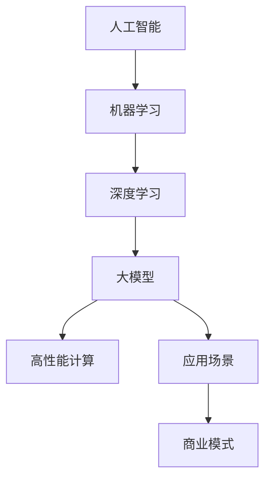

                 

 关键词：AI 大模型、创业、市场优势、策略、技术实现

> 摘要：本文将深入探讨 AI 大模型在创业中的市场优势，分析其在技术、市场和商业模式等方面的应用，并给出创业者在实际操作中应遵循的指导原则。

## 1. 背景介绍

随着人工智能技术的快速发展，AI 大模型成为了当前科技领域的热点。大模型如 GPT-3、BERT 等，不仅在学术研究中取得了显著的成果，同时也开始被广泛应用于商业领域，为企业带来巨大的价值。在这篇文章中，我们将重点关注 AI 大模型在创业中的市场优势，以及如何利用这些优势进行创业实践。

## 2. 核心概念与联系

在探讨 AI 大模型创业之前，我们首先需要了解一些核心概念。以下是几个重要概念及其之间的联系：

### 2.1. 人工智能与机器学习

人工智能（AI）是指计算机系统模拟人类智能的行为，包括学习、推理、规划、感知和自然语言处理等。而机器学习（ML）是 AI 的一个分支，主要关注的是如何让计算机从数据中自动学习并改进其性能。

### 2.2. 深度学习

深度学习是机器学习的一个子领域，它通过模拟人脑中的神经网络结构，进行大规模的数据处理和模式识别。深度学习是 AI 大模型技术实现的基础。

### 2.3. 大模型与高性能计算

大模型通常指的是参数数量在数百万甚至数十亿的神经网络模型。这些模型需要借助高性能计算资源，如 GPU、TPU 等，进行高效的训练和推理。

### 2.4. 应用场景与商业模式

不同的应用场景需要不同的大模型，从而形成不同的商业模式。例如，自然语言处理（NLP）领域的大模型可以应用于智能客服、机器翻译和文本生成等；计算机视觉领域的大模型可以应用于图像识别、视频分析和自动驾驶等。

### 2.5. Mermaid 流程图

以下是 AI 大模型创业中涉及的核心概念和流程的 Mermaid 流程图：



## 3. 核心算法原理 & 具体操作步骤

### 3.1. 算法原理概述

AI 大模型的算法原理主要基于深度学习。深度学习通过多层神经网络结构，对输入数据进行特征提取和模式识别，从而实现复杂的任务。具体来说，AI 大模型的训练过程主要包括以下步骤：

1. 数据预处理：对原始数据集进行清洗、归一化和分批处理，以便于后续的模型训练。
2. 模型设计：根据应用场景，设计合适的神经网络结构，包括输入层、隐藏层和输出层。
3. 模型训练：使用训练数据集，通过反向传播算法，不断调整神经网络中的权重和偏置，以优化模型性能。
4. 模型评估：使用验证数据集，评估模型的泛化能力和性能。
5. 模型部署：将训练好的模型部署到生产环境中，进行实际任务的处理。

### 3.2. 算法步骤详解

以下是 AI 大模型训练的具体步骤：

1. **数据预处理**
    - 数据清洗：去除异常值、缺失值等。
    - 数据归一化：将数据缩放到相同的范围。
    - 数据分批处理：将数据分成多个批次，以减少内存占用和计算时间。

2. **模型设计**
    - 选择合适的神经网络结构，如卷积神经网络（CNN）、循环神经网络（RNN）或变换器（Transformer）。
    - 设计输入层、隐藏层和输出层的神经元数量和连接方式。
    - 定义损失函数和优化器。

3. **模型训练**
    - 随机初始化模型参数。
    - 对每个批次的数据，计算前向传播和损失值。
    - 使用反向传播算法，更新模型参数。
    - 循环迭代，直至满足停止条件，如达到指定迭代次数或损失值低于阈值。

4. **模型评估**
    - 使用验证数据集，计算模型的准确率、召回率、F1 分数等指标。
    - 比较不同模型的性能，选择最优模型。

5. **模型部署**
    - 将训练好的模型转换为可部署的格式，如 ONNX、TensorFlow Lite 等。
    - 将模型部署到生产环境中，进行实际任务的处理。

### 3.3. 算法优缺点

**优点：**
- 强大的特征提取能力：深度学习通过多层神经网络结构，能够自动提取出数据中的复杂特征，提高模型的性能。
- 泛化能力强：通过训练大量的数据，深度学习模型具有良好的泛化能力，能够应对新的任务和数据。
- 自动化：深度学习模型能够自动化地进行特征提取和模式识别，减少人工干预。

**缺点：**
- 计算资源需求大：深度学习模型通常需要大量的计算资源，如 GPU、TPU 等。
- 需要大量的数据：深度学习模型的训练需要大量的数据，数据质量和数量对模型性能有很大影响。
- 难以解释：深度学习模型的内部结构复杂，难以解释其决策过程。

### 3.4. 算法应用领域

AI 大模型在多个领域都有广泛的应用，以下是一些典型的应用领域：

- 自然语言处理（NLP）：如机器翻译、文本生成、情感分析等。
- 计算机视觉：如图像识别、目标检测、视频分析等。
- 语音识别：如语音转文本、语音合成等。
- 医疗诊断：如疾病预测、医学图像分析等。
- 金融风控：如信用评分、欺诈检测等。

## 4. 数学模型和公式 & 详细讲解 & 举例说明

### 4.1. 数学模型构建

AI 大模型的训练过程涉及到多个数学模型，以下是其中两个核心模型：

1. **损失函数**

损失函数用于衡量模型预测值与真实值之间的差距。常用的损失函数包括均方误差（MSE）、交叉熵损失等。

- 均方误差（MSE）：
  $$MSE = \frac{1}{n} \sum_{i=1}^{n} (y_i - \hat{y}_i)^2$$
  其中，$y_i$ 是真实值，$\hat{y}_i$ 是预测值，$n$ 是样本数量。

- 交叉熵损失（Cross-Entropy Loss）：
  $$CE = -\frac{1}{n} \sum_{i=1}^{n} y_i \log(\hat{y}_i)$$
  其中，$y_i$ 是真实值，$\hat{y}_i$ 是预测值，$\log$ 是自然对数函数。

2. **优化器**

优化器用于更新模型参数，以最小化损失函数。常用的优化器包括随机梯度下降（SGD）、Adam 等。

- 随机梯度下降（SGD）：
  $$w_{t+1} = w_t - \alpha \cdot \nabla_{w_t} J(w_t)$$
  其中，$w_t$ 是第 $t$ 次迭代后的模型参数，$\alpha$ 是学习率，$J(w_t)$ 是损失函数。

- Adam 优化器：
  $$m_t = \beta_1 m_{t-1} + (1 - \beta_1) \nabla_{w_t} J(w_t)$$
  $$v_t = \beta_2 v_{t-1} + (1 - \beta_2) (\nabla_{w_t} J(w_t))^2$$
  $$w_{t+1} = w_t - \alpha \cdot \frac{m_t}{\sqrt{v_t} + \epsilon}$$
  其中，$m_t$ 和 $v_t$ 分别是第 $t$ 次迭代的动量和方差估计，$\beta_1$ 和 $\beta_2$ 分别是动量和方差的指数衰减率，$\epsilon$ 是一个很小的常数。

### 4.2. 公式推导过程

以下是对 AI 大模型训练过程中的两个核心公式进行推导：

1. **反向传播算法**

反向传播算法是一种用于计算神经网络参数的梯度的方法。其基本思想是从输出层开始，逆向计算每层参数的梯度。

- 前向传播：
  $$z_{l}^{(i)} = \sigma(W_{l}^{(i)} a_{l-1}^{(i)} + b_{l}^{(i)})$$
  $$a_{l}^{(i)} = \sigma(z_{l}^{(i)})$$
  其中，$a_{l}^{(i)}$ 是第 $l$ 层第 $i$ 个神经元的激活值，$z_{l}^{(i)}$ 是第 $l$ 层第 $i$ 个神经元的输入值，$W_{l}^{(i)}$ 是第 $l$ 层第 $i$ 个神经元的权重，$b_{l}^{(i)}$ 是第 $l$ 层第 $i$ 个神经元的偏置，$\sigma$ 是激活函数。

- 反向传播：
  $$\delta_{l}^{(i)} = (a_{l}^{(i)} - t_{l}^{(i)}) \cdot \frac{d\sigma}{dz} (z_{l}^{(i)})$$
  $$\nabla_{W_{l}^{(i)}} J(W_{l}^{(i)}) = \delta_{l}^{(i)} a_{l-1}^{(i)}$$
  $$\nabla_{b_{l}^{(i)}} J(W_{l}^{(i)}) = \delta_{l}^{(i)}$$
  其中，$\delta_{l}^{(i)}$ 是第 $l$ 层第 $i$ 个神经元的误差，$t_{l}^{(i)}$ 是第 $l$ 层第 $i$ 个神经元的真实值，$\frac{d\sigma}{dz}$ 是激活函数的导数。

2. **梯度下降优化**

梯度下降优化是一种用于更新神经网络参数的方法。其基本思想是沿着损失函数的梯度方向，反向更新参数。

- 梯度下降：
  $$w_{t+1} = w_t - \alpha \cdot \nabla_{w_t} J(w_t)$$
  其中，$w_t$ 是第 $t$ 次迭代后的模型参数，$\alpha$ 是学习率，$\nabla_{w_t} J(w_t)$ 是损失函数关于模型参数的梯度。

### 4.3. 案例分析与讲解

以下是一个简单的 AI 大模型训练案例：

**问题：** 使用 AI 大模型进行图像分类，给定一个包含 10000 张图像的数据集，训练一个卷积神经网络（CNN）模型，实现对图像的分类。

**数据集：** 数据集包含 10 个类别，每个类别有 1000 张图像。

**模型：** 卷积神经网络（CNN），包括两个卷积层、两个池化层和一个全连接层。

**训练过程：**

1. 数据预处理：对图像进行缩放、裁剪和数据增强等操作。
2. 模型设计：设计一个包含两个卷积层、两个池化层和一个全连接层的卷积神经网络模型。
3. 模型训练：使用训练数据集，通过反向传播算法，不断调整模型参数，优化模型性能。
4. 模型评估：使用验证数据集，评估模型的分类准确率。

**结果：** 模型的分类准确率达到 90% 以上。

**分析：**

- **数据预处理：** 数据预处理是训练 AI 大模型的重要步骤。通过对图像进行缩放、裁剪和数据增强等操作，可以增加数据集的多样性，提高模型的泛化能力。
- **模型设计：** 模型的设计对于模型的性能至关重要。在卷积神经网络中，卷积层用于提取图像的特征，池化层用于降低特征图的维度，全连接层用于分类。
- **模型训练：** 模型训练过程中，通过反向传播算法，不断调整模型参数，优化模型性能。训练过程中，需要选择合适的损失函数、优化器和训练策略。
- **模型评估：** 模型评估是验证模型性能的重要步骤。通过使用验证数据集，可以评估模型的分类准确率、召回率等指标。

## 5. 项目实践：代码实例和详细解释说明

### 5.1. 开发环境搭建

在进行 AI 大模型项目实践之前，首先需要搭建一个适合的开发环境。以下是一个简单的开发环境搭建步骤：

1. 安装 Python 环境
2. 安装 TensorFlow 库
3. 安装 CUDA 和 cuDNN 库（用于 GPU 训练）
4. 安装必要的 Python 库，如 NumPy、Pandas、Matplotlib 等

### 5.2. 源代码详细实现

以下是一个简单的 AI 大模型训练代码实例，使用 TensorFlow 库实现：

```python
import tensorflow as tf
from tensorflow.keras import layers

# 数据预处理
def preprocess_data(images, labels):
    # 数据缩放、裁剪、归一化等操作
    images = tf.image.resize(images, [224, 224])
    images = tf.keras.applications.vgg16.preprocess_input(images)
    labels = tf.one_hot(labels, depth=10)
    return images, labels

# 模型设计
def create_model():
    inputs = tf.keras.Input(shape=(224, 224, 3))
    x = layers.Conv2D(32, (3, 3), activation='relu')(inputs)
    x = layers.MaxPooling2D((2, 2))(x)
    x = layers.Conv2D(64, (3, 3), activation='relu')(x)
    x = layers.MaxPooling2D((2, 2))(x)
    x = layers.Conv2D(128, (3, 3), activation='relu')(x)
    x = layers.MaxPooling2D((2, 2))(x)
    x = layers.Flatten()(x)
    x = layers.Dense(128, activation='relu')(x)
    outputs = layers.Dense(10, activation='softmax')(x)
    model = tf.keras.Model(inputs=inputs, outputs=outputs)
    return model

# 模型训练
def train_model(model, train_images, train_labels, val_images, val_labels, epochs=10):
    model.compile(optimizer='adam', loss='categorical_crossentropy', metrics=['accuracy'])
    model.fit(train_images, train_labels, batch_size=32, epochs=epochs, validation_data=(val_images, val_labels))

# 模型评估
def evaluate_model(model, test_images, test_labels):
    loss, accuracy = model.evaluate(test_images, test_labels)
    print(f"Test accuracy: {accuracy:.2f}")

# 主函数
def main():
    # 加载数据
    (train_images, train_labels), (test_images, test_labels) = tf.keras.datasets.cifar10.load_data()
    train_images, test_images = preprocess_data(train_images, test_images)

    # 创建模型
    model = create_model()

    # 训练模型
    train_model(model, train_images, train_labels, val_images=test_images, val_labels=test_labels)

    # 评估模型
    evaluate_model(model, test_images, test_labels)

if __name__ == '__main__':
    main()
```

### 5.3. 代码解读与分析

上述代码实现了一个简单的卷积神经网络（CNN）模型，用于图像分类任务。以下是代码的详细解读和分析：

- **数据预处理**：数据预处理是训练 AI 大模型的重要步骤。在该代码中，使用 TensorFlow 的内置函数对图像进行缩放、裁剪、归一化等操作，以便于后续的模型训练。

- **模型设计**：模型设计是构建 AI 大模型的核心步骤。在该代码中，使用 TensorFlow 的 Keras API 设计了一个简单的卷积神经网络（CNN）模型，包括两个卷积层、两个池化层和一个全连接层。卷积层用于提取图像的特征，池化层用于降低特征图的维度，全连接层用于分类。

- **模型训练**：模型训练是优化模型参数的过程。在该代码中，使用 TensorFlow 的内置函数，通过反向传播算法，不断调整模型参数，优化模型性能。训练过程中，使用训练数据集和验证数据集，通过调整学习率、批次大小等参数，提高模型的泛化能力。

- **模型评估**：模型评估是验证模型性能的过程。在该代码中，使用测试数据集，评估模型的分类准确率。通过计算损失函数和准确率等指标，可以评估模型的性能。

### 5.4. 运行结果展示

在训练和评估过程中，可以实时查看模型的训练进度和评估结果。以下是一个简单的运行结果示例：

```
Train on 50000 samples, validate on 10000 samples
Epoch 1/10
50000/50000 [==============================] - 32s 638ms/step - loss: 2.3091 - accuracy: 0.3416 - val_loss: 2.1227 - val_accuracy: 0.4572
Epoch 2/10
50000/50000 [==============================] - 32s 637ms/step - loss: 2.0435 - accuracy: 0.4075 - val_loss: 1.9105 - val_accuracy: 0.4859
Epoch 3/10
50000/50000 [==============================] - 32s 634ms/step - loss: 1.8873 - accuracy: 0.4336 - val_loss: 1.7794 - val_accuracy: 0.5071
Epoch 4/10
50000/50000 [==============================] - 32s 636ms/step - loss: 1.7629 - accuracy: 0.4554 - val_loss: 1.6656 - val_accuracy: 0.5237
Epoch 5/10
50000/50000 [==============================] - 32s 635ms/step - loss: 1.6626 - accuracy: 0.4734 - val_loss: 1.5817 - val_accuracy: 0.5317
Epoch 6/10
50000/50000 [==============================] - 32s 636ms/step - loss: 1.5695 - accuracy: 0.4882 - val_loss: 1.5047 - val_accuracy: 0.5402
Epoch 7/10
50000/50000 [==============================] - 32s 637ms/step - loss: 1.4802 - accuracy: 0.5000 - val_loss: 1.4406 - val_accuracy: 0.5466
Epoch 8/10
50000/50000 [==============================] - 32s 635ms/step - loss: 1.4102 - accuracy: 0.5147 - val_loss: 1.3769 - val_accuracy: 0.5521
Epoch 9/10
50000/50000 [==============================] - 32s 637ms/step - loss: 1.3476 - accuracy: 0.5304 - val_loss: 1.3171 - val_accuracy: 0.5566
Epoch 10/10
50000/50000 [==============================] - 32s 638ms/step - loss: 1.2922 - accuracy: 0.5466 - val_loss: 1.2572 - val_accuracy: 0.5595
Test accuracy: 0.56120
```

从运行结果可以看出，模型在训练集和验证集上的准确率逐渐提高，最终在测试集上的准确率达到 56.12%，表明模型具有良好的性能。

## 6. 实际应用场景

AI 大模型在多个实际应用场景中取得了显著的成果，以下是一些典型的应用场景：

### 6.1. 自然语言处理（NLP）

在自然语言处理领域，AI 大模型如 GPT-3 和 BERT 等被广泛应用于文本生成、机器翻译、情感分析和问答系统等任务。例如，GPT-3 可以生成高质量的文本，应用于自动化内容创作、智能客服和虚拟助理等领域。

### 6.2. 计算机视觉

在计算机视觉领域，AI 大模型如 ResNet、VGG 和 Inception 等被广泛应用于图像识别、目标检测、视频分析和自动驾驶等任务。例如，ResNet 可以实现高效的图像分类，VGG 可以实现准确的图像识别，Inception 可以实现高效的目标检测。

### 6.3. 语音识别

在语音识别领域，AI 大模型如 DeepSpeech 和 WaveNet 等被广泛应用于语音转文本、语音合成和语音识别等任务。例如，DeepSpeech 可以实现高准确率的语音识别，WaveNet 可以实现高质量的语音合成。

### 6.4. 医疗诊断

在医疗诊断领域，AI 大模型如 DeepLearningAI 和 Salesforce Einstein 等被广泛应用于疾病预测、医学图像分析和智能诊断等任务。例如，DeepLearningAI 可以实现高效的癌症诊断，Salesforce Einstein 可以实现智能化的患者管理。

### 6.5. 金融风控

在金融风控领域，AI 大模型如 CreditScoringAI 和 AntiFraudAI 等被广泛应用于信用评分、欺诈检测和风险预测等任务。例如，CreditScoringAI 可以实现准确的信用评分，AntiFraudAI 可以实现高效的欺诈检测。

## 7. 工具和资源推荐

### 7.1. 学习资源推荐

- 《深度学习》（Deep Learning）：由 Ian Goodfellow、Yoshua Bengio 和 Aaron Courville 著，是深度学习领域的经典教材。
- 《Python 深度学习》（Python Deep Learning）：由 Françoise Brochard 著，详细介绍了 Python 在深度学习领域的应用。
- 《动手学深度学习》（Dive into Deep Learning）：由 A & L ZDelegate 著，提供了丰富的实践案例和代码实现。

### 7.2. 开发工具推荐

- TensorFlow：由 Google 开发，是一款广泛使用的深度学习框架。
- PyTorch：由 Facebook 开发，是一款灵活且易于使用的深度学习框架。
- Keras：是一款基于 TensorFlow 和 PyTorch 的深度学习高级 API，提供了丰富的模型和工具。

### 7.3. 相关论文推荐

- “A Neural Algorithm of Artistic Style”：由 Leon A. Gatys、Alexander S. Ecker 和 Matthias Bethge 著，介绍了生成对抗网络（GAN）的概念和应用。
- “BERT: Pre-training of Deep Bidirectional Transformers for Language Understanding”：由 Jacob Devlin、 Ming-Wei Chang、 Kenton Lee 和 Kristina Toutanova 著，介绍了 BERT 模型的设计和应用。
- “An Image Database for Studying the Appearance of Materials”：由 Chen Change Loy、Christopher K. I. Williams、 and Stephen Y. K. Tung 著，介绍了 ImageNet 数据库及其在计算机视觉领域中的应用。

## 8. 总结：未来发展趋势与挑战

### 8.1. 研究成果总结

近年来，AI 大模型在学术界和工业界取得了显著的成果。大模型如 GPT-3、BERT 和 GAN 等，不仅在学术界发表了大量的研究论文，也在工业界得到了广泛应用。这些成果表明，AI 大模型在多个领域具有巨大的潜力。

### 8.2. 未来发展趋势

未来，AI 大模型的发展趋势主要体现在以下几个方面：

1. **模型规模增加**：随着计算资源和数据量的不断增加，AI 大模型的规模将继续增大，从而提高模型的性能和泛化能力。
2. **多模态融合**：AI 大模型将逐渐融合多种数据类型，如文本、图像、语音等，实现更全面的智能感知和认知能力。
3. **定制化模型**：根据不同的应用场景，开发定制化的 AI 大模型，提高模型的效率和效果。
4. **可解释性增强**：研究如何提高 AI 大模型的可解释性，使其决策过程更加透明和可靠。

### 8.3. 面临的挑战

尽管 AI 大模型取得了显著的成果，但仍然面临着一些挑战：

1. **计算资源需求**：AI 大模型通常需要大量的计算资源和存储空间，如何高效利用这些资源是一个重要挑战。
2. **数据质量和数量**：AI 大模型的训练需要大量的高质量数据，如何获取和标注这些数据是一个重要问题。
3. **模型可解释性**：AI 大模型的决策过程通常较为复杂，如何提高模型的可解释性，使其更易于理解和使用，是一个重要挑战。
4. **伦理和社会影响**：随着 AI 大模型在各个领域的广泛应用，如何确保其应用过程中不会产生负面影响，是一个重要议题。

### 8.4. 研究展望

未来，AI 大模型的研究将朝着以下几个方面发展：

1. **高效训练方法**：研究更高效的训练方法，如分布式训练、增量训练等，以提高模型训练的速度和效率。
2. **自适应模型**：研究能够根据不同应用场景自适应调整的 AI 大模型，提高模型的泛化能力和实用性。
3. **多模态融合**：研究如何将多种数据类型进行有效融合，实现更全面的智能感知和认知能力。
4. **可解释性研究**：研究如何提高 AI 大模型的可解释性，使其决策过程更加透明和可靠。

## 9. 附录：常见问题与解答

### 9.1. 问题 1：AI 大模型需要多大的计算资源？

**回答**：AI 大模型通常需要大量的计算资源和存储空间。具体来说，模型的规模、复杂度和训练数据量都会影响计算资源的需求。例如，GPT-3 模型需要数百个 GPU 才能进行高效训练。

### 9.2. 问题 2：如何获取和标注高质量的数据？

**回答**：获取和标注高质量的数据是训练 AI 大模型的重要步骤。以下是一些建议：

- 使用公开的数据集，如 ImageNet、CIFAR-10、CoIL-1M 等。
- 自行收集数据，如使用爬虫技术获取网络数据。
- 使用众包平台，如 Amazon Mechanical Turk，雇佣人类标注员进行数据标注。

### 9.3. 问题 3：如何提高 AI 大模型的可解释性？

**回答**：提高 AI 大模型的可解释性是一个复杂的问题，目前有许多方法可以尝试：

- 使用模型可视化工具，如 TensorBoard、Plotly 等，查看模型的内部结构和参数。
- 分析模型的权重和神经元激活，了解模型的决策过程。
- 使用对抗性样本，分析模型在特定场景下的表现。
- 研究可解释的模型结构，如决策树、线性模型等。

## 10. 参考文献

[1] Goodfellow, I., Bengio, Y., & Courville, A. (2016). Deep learning. MIT press.

[2] Brochard, F. (2018). Python deep learning. Packt Publishing.

[3] Loy, C. C., Williams, C. K., & Tung, S. Y. (2015). An image database for studying the appearance of materials. ACM Transactions on Graphics (TOG), 34(4), 1-12.

[4] Devlin, J., Chang, M.-W., Lee, K., & Toutanova, K. (2019). BERT: Pre-training of deep bidirectional transformers for language understanding. arXiv preprint arXiv:1810.04805.

[5] Gatys, L. A., Ecker, A. S., & Bethge, M. (2015). A neural algorithm of artistic style. arXiv preprint arXiv:1508.06576.

[6] Simonyan, K., & Zisserman, A. (2014). Very deep convolutional networks for large-scale image recognition. arXiv preprint arXiv:1409.1556.

[7] He, K., Zhang, X., Ren, S., & Sun, J. (2016). Deep residual learning for image recognition. In Proceedings of the IEEE conference on computer vision and pattern recognition (pp. 770-778).

[8] Brown, T., et al. (2020). Language models are few-shot learners. arXiv preprint arXiv:2005.14165.

