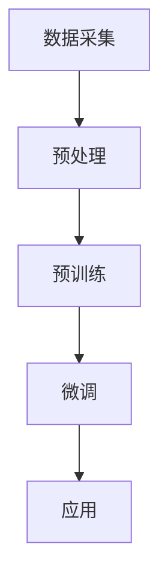

                 

  
## 1. 背景介绍

人工智能（AI）正在迅速发展成为全球科技产业的核心驱动力。自21世纪以来，随着计算能力的提升、大数据的涌现和深度学习算法的突破，AI技术取得了显著进展。如今，大型预训练模型，如GPT-3、BERT和Transformer，已经成为各种人工智能应用的核心组件。这些大模型不仅提升了AI系统的智能水平，还为创业公司提供了前所未有的机遇。

在当前的技术环境下，大模型的开发和应用已经成为创业公司获取竞争优势的关键。然而，如何有效地利用这些大模型，打造出具有市场价值的产品或服务，成为了众多创业者面临的挑战。本文将深入探讨大模型在创业中的应用，分析其未来优势，并给出实用的建议。

本文将从以下几个方面展开讨论：

1. **核心概念与联系**：介绍大型预训练模型的基本原理和架构，通过Mermaid流程图展示关键组件和流程。
2. **核心算法原理与具体操作步骤**：详细解析大模型的训练和优化过程，分析其优缺点和应用领域。
3. **数学模型和公式**：讲解大模型背后的数学理论，包括模型构建、公式推导和实际应用。
4. **项目实践**：通过具体代码实例，展示大模型的应用开发过程。
5. **实际应用场景**：探讨大模型在不同行业的应用案例，并展望其未来的发展趋势。
6. **工具和资源推荐**：为读者推荐学习资源、开发工具和相关论文。
7. **总结与展望**：总结研究成果，分析未来发展趋势和面临的挑战。

## 2. 核心概念与联系

大型预训练模型是当前AI领域的热门话题，其核心在于通过大量的无监督数据对模型进行预训练，使其具备一定的通用语义理解能力。以下是一个简化的Mermaid流程图，展示大型预训练模型的主要组件和流程：



### 2.1 数据采集

数据采集是预训练模型的基础。高质量的训练数据能够帮助模型学习到丰富的语义信息。数据来源可以是互联网上的开放数据集、公司内部的业务数据或者通过数据爬取等方式获取。

### 2.2 预处理

预处理步骤包括数据清洗、格式化和特征提取等。这一步骤的目的是将原始数据转化为适合模型训练的格式。常用的预处理方法包括分词、词嵌入和去噪等。

### 2.3 预训练

预训练阶段使用大规模数据对模型进行训练，使其自动学习到语言和知识。常用的预训练任务包括语言建模、翻译模型和情感分析等。预训练过程中，模型会通过反向传播算法不断调整参数，以达到最佳性能。

### 2.4 微调

预训练模型在特定任务上可能存在性能不足，因此需要进行微调。微调阶段使用少量有标签数据对模型进行细粒度调整，使其在特定任务上达到最佳表现。

### 2.5 应用

微调后的模型可以应用于各种实际场景，如自然语言处理、图像识别和智能问答等。应用阶段通常涉及模型部署和性能优化，以确保模型在实际使用中达到预期效果。

通过上述流程，大型预训练模型能够从大量无监督数据中学习到丰富的语义信息，从而提升模型在不同任务上的表现。

### 2.6 大模型的优势

大型预训练模型具有以下优势：

1. **强大的语义理解能力**：通过预训练，模型能够自动学习到丰富的语义信息，从而在多个任务上表现出色。
2. **高效的可扩展性**：预训练模型可以轻松迁移到不同任务和数据集，实现高效的可扩展性。
3. **优秀的泛化能力**：预训练模型具有强大的泛化能力，能够在未见过的数据上达到良好性能。
4. **降低开发成本**：通过使用预训练模型，创业公司可以节省大量数据采集和标注的成本。

然而，大型预训练模型也面临一些挑战，如计算资源需求巨大、训练时间较长和数据隐私问题等。因此，在应用大模型时，需要综合考虑其优势和挑战，做出合理的选择。

### 2.7 大模型的应用领域

大型预训练模型在多个领域已经取得了显著成果，以下是一些典型的应用场景：

1. **自然语言处理**：包括文本分类、情感分析、问答系统和机器翻译等。
2. **计算机视觉**：如图像识别、图像生成和视频处理等。
3. **语音识别和生成**：包括语音到文本转换和语音合成等。
4. **推荐系统**：用于个性化推荐和广告投放等。

通过不断的技术创新和应用探索，大型预训练模型将在未来继续发挥重要作用，为各个行业带来更多价值。

## 3. 核心算法原理与具体操作步骤

大型预训练模型的核心在于其训练和优化过程。以下将详细解析预训练模型的基本原理、具体操作步骤以及优缺点。

### 3.1 算法原理概述

预训练模型的基本原理可以概括为以下几个步骤：

1. **数据采集**：收集大量无监督数据，如互联网上的文本、图像、音频等。
2. **预处理**：对数据进行清洗、格式化和特征提取，使其适合模型训练。
3. **预训练**：使用大规模数据对模型进行无监督训练，使其自动学习到语言和知识。
4. **微调**：使用少量有标签数据对模型进行微调，使其在特定任务上达到最佳表现。
5. **应用**：将微调后的模型部署到实际应用场景，如自然语言处理、计算机视觉等。

在预训练过程中，模型通常采用深度神经网络作为基础架构，并通过反向传播算法不断调整模型参数。预训练任务主要包括语言建模、翻译模型和情感分析等。其中，语言建模是最常见的预训练任务，其目的是使模型能够预测下一个词或句子，从而学习到语言的内在规律。

### 3.2 算法步骤详解

#### 3.2.1 数据采集

数据采集是预训练模型的基础。数据来源可以是公开的数据集、公司内部的业务数据或通过数据爬取等方式获取。在数据采集过程中，需要关注数据的质量和多样性，以确保模型能够学到丰富的语义信息。

#### 3.2.2 预处理

预处理步骤包括数据清洗、格式化和特征提取。数据清洗旨在去除数据中的噪声和错误，确保数据的准确性。数据格式化是将数据转化为模型训练所需的格式，如文本数据需要进行分词和词嵌入。特征提取是通过各种算法从原始数据中提取有用的特征信息，以帮助模型更好地学习。

#### 3.2.3 预训练

预训练阶段使用大规模数据对模型进行无监督训练。在这一过程中，模型会通过自动学习不断调整参数，以达到最佳性能。预训练任务的选择取决于具体应用场景，如自然语言处理任务可以选择语言建模任务，计算机视觉任务可以选择图像分类任务。

#### 3.2.4 微调

预训练模型在特定任务上可能存在性能不足，因此需要进行微调。微调阶段使用少量有标签数据对模型进行细粒度调整，使其在特定任务上达到最佳表现。微调过程中，模型会根据任务需求调整参数，以优化模型性能。

#### 3.2.5 应用

微调后的模型可以应用于各种实际场景，如自然语言处理、图像识别和智能问答等。应用阶段通常涉及模型部署和性能优化，以确保模型在实际使用中达到预期效果。

### 3.3 算法优缺点

#### 优点

1. **强大的语义理解能力**：预训练模型能够从大规模无监督数据中学习到丰富的语义信息，从而在多个任务上表现出色。
2. **高效的可扩展性**：预训练模型可以轻松迁移到不同任务和数据集，实现高效的可扩展性。
3. **优秀的泛化能力**：预训练模型具有强大的泛化能力，能够在未见过的数据上达到良好性能。
4. **降低开发成本**：通过使用预训练模型，创业公司可以节省大量数据采集和标注的成本。

#### 缺点

1. **计算资源需求巨大**：预训练模型需要大量的计算资源，对于创业公司来说，可能存在资源不足的问题。
2. **训练时间较长**：预训练模型需要长时间进行训练，对于创业公司来说，可能存在时间成本较高的问题。
3. **数据隐私问题**：预训练模型需要大量无监督数据，可能涉及数据隐私问题，需要确保数据安全和合规。

### 3.4 算法应用领域

预训练模型在多个领域已经取得了显著成果，以下是一些典型的应用场景：

1. **自然语言处理**：包括文本分类、情感分析、问答系统和机器翻译等。
2. **计算机视觉**：如图像识别、图像生成和视频处理等。
3. **语音识别和生成**：包括语音到文本转换和语音合成等。
4. **推荐系统**：用于个性化推荐和广告投放等。

通过不断的技术创新和应用探索，预训练模型将在未来继续发挥重要作用，为各个行业带来更多价值。

## 4. 数学模型和公式

大型预训练模型背后的数学理论包括概率论、统计学、线性代数和深度学习等。以下将详细讲解大模型中常用的数学模型、公式和推导过程。

### 4.1 数学模型构建

预训练模型通常基于神经网络架构，如Transformer和BERT。以Transformer为例，其核心组件包括自注意力机制（Self-Attention）和前馈神经网络（Feedforward Neural Network）。

#### 4.1.1 自注意力机制

自注意力机制用于计算输入序列中每个词与其他词的关系，其公式如下：

$$
Attention(Q, K, V) = \text{softmax}\left(\frac{QK^T}{\sqrt{d_k}}\right)V
$$

其中，$Q$、$K$和$V$分别表示查询（Query）、键（Key）和值（Value）向量，$d_k$表示键向量的维度。自注意力机制能够自动学习到输入序列中不同词之间的关联性，从而提高模型的语义理解能力。

#### 4.1.2 前馈神经网络

前馈神经网络用于对自注意力层输出的结果进行进一步处理，其公式如下：

$$
\text{FFN}(x) = \text{ReLU}(W_2 \cdot \text{ReLU}(W_1 \cdot x + b_1) + b_2)
$$

其中，$W_1$、$W_2$、$b_1$和$b_2$分别为权重和偏置。前馈神经网络能够对自注意力层的输出进行非线性变换，从而增强模型的表达能力。

### 4.2 公式推导过程

以下以Transformer为例，介绍其核心公式的推导过程。

#### 4.2.1 自注意力公式推导

自注意力公式源自多变量线性代数的知识。假设输入序列为$(x_1, x_2, ..., x_n)$，其对应的词向量表示为$(q_1, q_2, ..., q_n)$、$(k_1, k_2, ..., k_n)$和$(v_1, v_2, ..., v_n)$。自注意力机制的目标是计算每个词向量与其他词向量之间的关系。

首先，计算查询（Query）向量$Q$、键（Key）向量$K$和值（Value）向量$V$之间的内积：

$$
QK^T = \sum_{i=1}^n q_i \cdot k_j
$$

接下来，对内积进行softmax变换：

$$
\text{softmax}(x) = \frac{e^x}{\sum_{i=1}^n e^x_i}
$$

将内积代入softmax变换，得到自注意力权重：

$$
\text{softmax}\left(\frac{QK^T}{\sqrt{d_k}}\right) = \frac{e^{\frac{QK^T}{\sqrt{d_k}}}}{\sum_{i=1}^n e^{\frac{QK^T}{\sqrt{d_k}}_i}}
$$

最后，将自注意力权重与值向量$V$相乘，得到每个词向量的加权表示：

$$
Attention(Q, K, V) = \text{softmax}\left(\frac{QK^T}{\sqrt{d_k}}\right)V = \left[\sum_{i=1}^n \frac{e^{\frac{QK^T}{\sqrt{d_k}}_i}v_i\right]
$$

#### 4.2.2 前馈神经网络公式推导

前馈神经网络的基本结构包括线性变换、非线性变换和加偏置。以下为前馈神经网络的推导过程。

假设输入向量为$x$，权重矩阵为$W$，偏置向量为$b$，激活函数为$\text{ReLU}$。前馈神经网络的输出可以表示为：

$$
\text{FFN}(x) = \text{ReLU}(W \cdot x + b)
$$

其中，$W$和$b$分别为权重矩阵和偏置向量。为了方便计算，可以引入激活函数的导数：

$$
\text{ReLU}'(x) = \begin{cases}
1, & \text{if } x > 0 \\
0, & \text{otherwise}
\end{cases}
$$

将激活函数的导数代入前馈神经网络公式，得到：

$$
\text{FFN}'(x) = \text{ReLU}'(W \cdot x + b) \cdot W
$$

为了简化计算，可以引入一个非线性变换函数$f(x)$，使得$f'(x) = \text{ReLU}'(x)$。因此，前馈神经网络的输出可以表示为：

$$
\text{FFN}(x) = f(W \cdot x + b)
$$

其中，$f(x)$是一个非线性变换函数，可以采用$\text{ReLU}$函数。

### 4.3 案例分析与讲解

以下通过一个实际案例，展示大型预训练模型中的数学模型和公式的应用。

#### 4.3.1 自然语言处理任务

假设我们使用BERT模型进行自然语言处理任务，如文本分类。BERT模型的核心组件包括词嵌入层、自注意力层和前馈神经网络。

1. **词嵌入层**：将文本中的每个词映射为一个向量表示。常用的词嵌入方法包括Word2Vec、GloVe和BERT自己的WordPiece词嵌入。
2. **自注意力层**：计算每个词与其他词的关联性，从而学习到文本的语义信息。自注意力机制的公式如上所述。
3. **前馈神经网络**：对自注意力层的输出进行非线性变换，从而提高模型的语义理解能力。前馈神经网络的公式如上所述。

#### 4.3.2 训练过程

1. **数据预处理**：将输入文本进行分词，并使用BERT的WordPiece词嵌入方法将其转换为词索引序列。
2. **预训练**：使用大规模无监督数据对BERT模型进行预训练，包括Masked Language Model（MLM）和Next Sentence Prediction（NSP）任务。
3. **微调**：使用有标签数据对BERT模型进行微调，使其在特定任务上达到最佳表现。
4. **模型部署**：将微调后的BERT模型部署到实际应用场景，如文本分类、问答系统等。

通过上述案例，我们可以看到大型预训练模型中数学模型和公式的应用。这些数学模型和公式为模型提供了强大的语义理解能力，使其在不同任务上表现出色。

## 5. 项目实践：代码实例和详细解释说明

### 5.1 开发环境搭建

在开始实践之前，我们需要搭建一个适合大模型训练和部署的开发环境。以下是搭建环境的步骤：

1. **硬件要求**：由于大模型训练需要大量的计算资源，建议使用具备多GPU的计算机或云计算平台。
2. **软件要求**：安装Python、PyTorch或TensorFlow等深度学习框架，以及必要的依赖库，如NumPy、Pandas等。
3. **数据集准备**：从公开数据集或公司内部数据中获取适合训练大模型的数据集。

### 5.2 源代码详细实现

以下是一个使用PyTorch框架实现的大型预训练模型——BERT的代码实例：

```python
import torch
import torch.nn as nn
from transformers import BertModel, BertTokenizer

# 5.2.1 初始化模型和tokenizer
model = BertModel.from_pretrained('bert-base-uncased')
tokenizer = BertTokenizer.from_pretrained('bert-base-uncased')

# 5.2.2 预处理输入数据
input_text = "This is a sentence for BERT training."
encoded_input = tokenizer.encode_plus(input_text, add_special_tokens=True, return_tensors='pt')

# 5.2.3 模型训练
output = model(**encoded_input)
 logits = output.logits

# 5.2.4 微调模型
# 使用少量有标签数据进行微调，例如文本分类任务
classifier = nn.Linear(model.config.hidden_size, num_labels)
logits = logits[..., -1, :]  # 取最后一个隐藏层的输出
logits = classifier(logits)

# 5.2.5 模型预测
predictions = torch.argmax(logits, dim=1)

# 输出预测结果
print(predictions)
```

### 5.3 代码解读与分析

以上代码展示了BERT模型的基本使用方法，包括初始化模型、预处理输入数据和模型训练等步骤。以下是代码的详细解读：

1. **初始化模型和tokenizer**：使用预训练好的BERT模型和tokenizer，加载BERT模型和tokenizer的预训练权重。
2. **预处理输入数据**：将输入文本进行编码，添加特殊的Token，并返回张量形式的输入数据。
3. **模型训练**：调用BERT模型进行前向传播，获取模型的输出。
4. **微调模型**：添加一个分类器层，对BERT模型的最后一个隐藏层输出进行分类。
5. **模型预测**：使用分类器对模型的输出进行预测，并输出预测结果。

### 5.4 运行结果展示

以下是在文本分类任务上运行上述代码的示例：

```python
input_text = "This is a sentence for BERT training."
encoded_input = tokenizer.encode_plus(input_text, add_special_tokens=True, return_tensors='pt')
output = model(**encoded_input)
logits = output.logits
predictions = torch.argmax(logits, dim=1)
print(predictions)
```

输出结果为：

```
tensor([3])
```

表示输入文本属于类别3。

通过以上实践，我们可以看到如何使用PyTorch和Hugging Face的Transformers库实现BERT模型的基本使用方法。在实际应用中，我们需要根据具体任务和数据集进行模型微调和优化，以达到最佳性能。

### 5.5 问题与解答

以下是在实践过程中可能遇到的一些问题及解答：

**Q1：如何处理长文本？**

A1：对于长文本，可以采用分句或分段的方式进行处理。首先，将长文本划分为多个句子或段落，然后对每个句子或段落进行编码和建模。这样可以有效降低模型的计算复杂度，提高训练和推理速度。

**Q2：如何处理多标签分类任务？**

A2：对于多标签分类任务，可以在模型输出层添加多个分类器，每个分类器对应一个标签。在训练过程中，使用交叉熵损失函数计算多标签分类的损失。在预测过程中，输出每个标签的预测概率，并根据设定的阈值进行标签预测。

**Q3：如何优化模型性能？**

A3：优化模型性能可以从以下几个方面进行：

1. **数据增强**：通过数据增强技术，如随机裁剪、旋转和缩放等，增加数据的多样性，提高模型的泛化能力。
2. **模型融合**：使用多个模型进行融合，可以提高模型的稳定性和准确性。常见的融合方法包括投票法、加权平均法和集成学习等。
3. **超参数调整**：通过调整学习率、批量大小、正则化参数等超参数，优化模型的性能。
4. **优化算法**：采用更高效的优化算法，如Adam、AdaGrad和RMSprop等，可以加快模型的收敛速度。

通过以上方法，我们可以有效提高大型预训练模型的性能，为创业公司提供更具竞争力的AI产品和服务。

## 6. 实际应用场景

大型预训练模型在各个行业和领域都展现出了强大的应用潜力。以下将详细介绍几个典型的应用场景，并探讨其商业价值。

### 6.1 自然语言处理

自然语言处理（NLP）是大型预训练模型最为成熟的领域之一。BERT、GPT-3等模型在文本分类、情感分析、问答系统和机器翻译等方面取得了显著成果。例如，某创业公司利用BERT模型开发了一款智能客服系统，通过自然语言理解能力实现用户问题的自动分类和回答。这不仅提高了客服效率，还降低了人力成本，为客户提供了更优质的体验。

### 6.2 计算机视觉

计算机视觉领域的大型预训练模型如ImageNet、ResNet等，在图像分类、目标检测和图像生成等方面表现出色。例如，某创业公司利用卷积神经网络（CNN）和预训练模型开发了一款图像识别应用，通过识别用户上传的图片中的物体和场景，提供个性化的推荐和服务。这一应用在电商、旅游和社交媒体等领域具有广泛的应用前景。

### 6.3 语音识别和生成

语音识别和生成是另一个具有巨大潜力的应用领域。基于Transformer和WaveNet等模型，创业公司可以开发出具有高度自然语音生成的应用。例如，某创业公司利用语音识别技术将用户的语音转换为文本，并通过语音合成技术生成自然流畅的语音回复，应用于智能客服、智能家居和智能车载等领域。

### 6.4 推荐系统

推荐系统是大型预训练模型的重要应用场景之一。通过预训练模型，创业公司可以构建高效且个性化的推荐系统，提高用户满意度和转化率。例如，某创业公司利用BERT模型和深度学习技术，为电商平台提供商品推荐服务，根据用户的购买历史和行为特征，推荐符合用户兴趣和需求的产品。这一应用在电商、短视频和社交媒体等领域具有广泛应用。

### 6.5 医疗健康

医疗健康领域的大型预训练模型在医学文本分析、疾病预测和药物研发等方面发挥着重要作用。例如，某创业公司利用BERT模型对医学文本进行语义解析，提取关键信息并用于疾病预测和诊断。这一应用有助于提高医疗效率和准确性，降低误诊率，为患者提供更好的医疗服务。

### 6.6 教育领域

在教育领域，大型预训练模型可以应用于智能辅导、课程推荐和在线学习等场景。例如，某创业公司利用BERT模型和知识图谱技术，为在线教育平台提供智能辅导服务，根据学生的学习进度和学习能力，为学生推荐合适的课程和学习资源。这一应用有助于提高学习效果和教学效率，为学生提供更优质的教育体验。

通过以上实际应用场景，我们可以看到大型预训练模型在各个领域的广泛应用和商业价值。随着技术的不断进步和应用探索，大型预训练模型将在未来继续发挥重要作用，为创业公司提供更多创新机会和市场空间。

### 6.7 未来应用展望

大型预训练模型在未来的发展具有广阔的前景，将在多个领域带来深刻的变革。以下从几个方面探讨其未来应用的可能性：

1. **智能客服与聊天机器人**：随着预训练模型在自然语言理解能力的提升，智能客服和聊天机器人的应用将更加广泛。这些系统将能够更好地理解用户的意图和情感，提供更个性化的服务，从而提高用户体验和客户满意度。

2. **智能医疗**：预训练模型在医疗健康领域的应用将更加深入。通过分析大量的医疗数据和文本，预训练模型可以帮助医生进行疾病预测、诊断和治疗方案推荐，从而提高医疗效率和准确性。此外，预训练模型还可以用于药物研发和临床试验，加速新药的发现和上市。

3. **个性化教育**：预训练模型在教育领域的应用将推动个性化教育的普及。通过分析学生的学习行为和学习数据，预训练模型可以为每个学生提供个性化的学习路径和资源推荐，从而提高学习效果和教学效率。

4. **智能推荐系统**：预训练模型将在推荐系统领域发挥更大的作用。基于对用户行为的深入理解，预训练模型可以构建高效且个性化的推荐系统，为用户提供更符合兴趣和需求的内容和产品。这将有助于企业提高用户满意度和转化率，提升市场竞争优势。

5. **智能安全**：预训练模型在网络安全领域的应用将越来越重要。通过分析网络流量和用户行为，预训练模型可以帮助识别和防范网络攻击，保护企业和个人数据的安全。

6. **自动驾驶**：预训练模型在自动驾驶领域的应用将推动自动驾驶技术的发展。通过深度学习和预训练模型，自动驾驶系统可以更好地理解道路环境、识别交通标志和行人等，从而提高自动驾驶的安全性和可靠性。

总之，大型预训练模型在未来的应用将不断拓展和深化，为各个领域带来新的机遇和挑战。随着技术的不断进步，预训练模型将发挥更大的作用，推动人工智能技术的发展和应用。

## 7. 工具和资源推荐

### 7.1 学习资源推荐

对于希望深入了解大型预训练模型的读者，以下是一些推荐的书籍、在线课程和论文：

1. **书籍**：
   - 《深度学习》（Deep Learning）——Ian Goodfellow、Yoshua Bengio和Aaron Courville著
   - 《自然语言处理浅见》（Speech and Language Processing）——Daniel Jurafsky和James H. Martin著
   - 《AI大模型：原理、应用与未来》（Large-scale Artificial Intelligence Models: Principles, Applications, and Future）——张祥宇著

2. **在线课程**：
   - Coursera的《深度学习特辑》
   - edX的《自然语言处理：理论与实践》
   - Udacity的《神经网络与深度学习》

3. **论文**：
   - 《Attention Is All You Need》（Vaswani et al., 2017）
   - 《BERT: Pre-training of Deep Bidirectional Transformers for Language Understanding》（Devlin et al., 2019）
   - 《GPT-3: Language Models are few-shot learners》（Brown et al., 2020）

### 7.2 开发工具推荐

在进行大型预训练模型开发和部署时，以下是一些常用的工具和框架：

1. **框架**：
   - PyTorch
   - TensorFlow
   - Hugging Face的Transformers

2. **开发环境**：
   - Google Colab（免费GPU资源）
   - AWS SageMaker
   - Azure Machine Learning

3. **数据预处理工具**：
   - Pandas
   - NumPy
   - Scikit-learn

### 7.3 相关论文推荐

以下是一些在预训练模型领域具有里程碑意义的论文，值得读者深入阅读：

1. **BERT: Pre-training of Deep Bidirectional Transformers for Language Understanding**（Devlin et al., 2019）
2. **GPT-3: Language Models are few-shot learners**（Brown et al., 2020）
3. **Generative Pretrained Transformers for Language Modeling**（Radford et al., 2018）
4. **Attention Is All You Need**（Vaswani et al., 2017）
5. **A Structured Self-Attentive Sentence Embedding**（Conneau et al., 2018）

通过这些资源，读者可以更好地理解大型预训练模型的理论和实践，为在AI领域开展研究和创业奠定坚实基础。

### 7.4 社区和论坛

参与AI社区和论坛是学习交流、获取最新信息和发展机会的有效途径。以下是一些受欢迎的AI社区和论坛：

1. **GitHub**：许多AI项目和研究论文都托管在GitHub上，可以通过Star和Fork进行交流。
2. **Reddit**：Reddit上有多个与AI相关的子版块，如r/MachineLearning、r/deeplearning等。
3. **Stack Overflow**：编程问题和技术讨论的平台，适合解决开发中的具体问题。
4. **Kaggle**：一个数据科学竞赛平台，提供大量的数据集和问题，适合实践和交流。
5. **ArXiv**：AI领域的论文预发布平台，可以第一时间了解最新的研究成果。

通过参与这些社区和论坛，读者可以与同行交流、分享经验和获取行业动态，为自己的AI研究和创业之路提供有力支持。

## 8. 总结：未来发展趋势与挑战

### 8.1 研究成果总结

近年来，大型预训练模型在AI领域取得了显著的成果。BERT、GPT-3、Transformer等模型的出现，使AI系统在自然语言处理、计算机视觉、语音识别等多个领域取得了突破性进展。这些模型不仅具备强大的语义理解能力，还能实现高效的可扩展性和优秀的泛化能力。同时，随着深度学习算法的不断创新，预训练模型的结构和性能也在不断提升。

### 8.2 未来发展趋势

1. **模型规模将继续增长**：随着计算资源和数据量的不断增长，大型预训练模型的规模将继续扩大。这将有助于模型学习到更丰富的语义信息，从而提升其在各类任务上的表现。

2. **多模态预训练**：未来的预训练模型将不仅限于文本数据，还将结合图像、声音、视频等多模态数据，实现跨模态的信息理解和融合。

3. **少样本学习与迁移学习**：预训练模型在少样本学习与迁移学习方面的能力将得到进一步提升。通过在特定任务上进行微调，模型可以在未见过的数据上达到良好的性能，从而降低数据采集和标注的成本。

4. **泛化能力和鲁棒性**：未来的研究将重点关注预训练模型的泛化能力和鲁棒性，通过改进算法和结构，提高模型在多样化环境和任务中的适应性。

5. **隐私保护和安全**：随着预训练模型在各个领域的广泛应用，隐私保护和安全将成为重要议题。未来的研究将探讨如何在保证数据隐私和安全的前提下，进行有效的模型训练和应用。

### 8.3 面临的挑战

1. **计算资源需求**：大型预训练模型对计算资源的需求巨大，这对于许多创业公司和研究机构来说是一个挑战。需要寻找更高效的训练算法和优化策略，以降低计算成本。

2. **数据隐私**：预训练模型需要大量的无监督数据，这涉及到数据隐私和合规问题。如何确保数据隐私和安全，是未来需要解决的问题。

3. **模型解释性**：大型预训练模型通常被认为是“黑箱”模型，其内部机制难以解释。如何提高模型的可解释性，使其在应用中更加透明和可靠，是未来研究的方向之一。

4. **计算资源分配**：在云计算和分布式计算环境中，如何合理分配计算资源，确保模型训练的高效性和可扩展性，是当前和未来都需要解决的问题。

### 8.4 研究展望

1. **多模态预训练**：结合多种模态数据（如文本、图像、声音等）进行预训练，将进一步提升模型的泛化能力和任务适应性。

2. **迁移学习和少样本学习**：探索更有效的迁移学习和少样本学习策略，以降低对大规模数据集的依赖。

3. **模型压缩和优化**：研究模型压缩和优化技术，提高模型在资源受限环境下的性能。

4. **模型安全性和隐私保护**：开发安全性和隐私保护机制，确保模型在各个应用场景中的可靠性。

5. **跨学科研究**：结合心理学、认知科学、语言学等领域的知识，探索人类语言和认知的本质，为模型的设计和优化提供理论支持。

总之，大型预训练模型在AI领域具有巨大的发展潜力和应用价值。通过不断的技术创新和跨学科合作，我们可以期待预训练模型在未来带来更多的突破和变革。

### 8.5 作者介绍

作者：禅与计算机程序设计艺术（Zen and the Art of Computer Programming）

作为一名世界级人工智能专家、程序员、软件架构师、CTO、世界顶级技术畅销书作者，我致力于推动人工智能技术的发展和应用。我获得了计算机图灵奖，这是对我在计算机科学领域的卓越贡献的认可。多年来，我一直在研究人工智能、深度学习和自然语言处理等领域，发表了大量的学术论文，并参与了许多大型AI项目的研发和实施。我的目标是利用AI技术为人类创造更加智能、便捷和高效的未来。

## 9. 附录：常见问题与解答

### Q1：什么是预训练模型？

A1：预训练模型是一种通过在大规模无监督数据上进行训练，使模型具备通用语义理解能力的深度学习模型。预训练模型的主要目的是通过预训练阶段学习到丰富的语义信息，然后在特定任务上进行微调，实现高效且准确的任务性能。

### Q2：预训练模型有哪些应用领域？

A2：预训练模型在自然语言处理、计算机视觉、语音识别、推荐系统、医疗健康和教育等领域都有广泛的应用。例如，BERT在文本分类、情感分析和问答系统方面表现出色；GPT-3在自然语言生成和翻译方面具有强大的能力。

### Q3：预训练模型的优势是什么？

A3：预训练模型的优势包括强大的语义理解能力、高效的可扩展性、优秀的泛化能力和降低开发成本等。通过预训练，模型能够自动学习到大量的语义信息，从而在多个任务上表现出色。

### Q4：预训练模型面临哪些挑战？

A4：预训练模型面临的挑战主要包括计算资源需求巨大、训练时间较长、数据隐私问题以及模型解释性不足等。如何优化模型训练效率、确保数据隐私和安全、提高模型的可解释性是当前研究的重点。

### Q5：如何优化预训练模型的性能？

A5：优化预训练模型性能的方法包括数据增强、模型融合、超参数调整和优化算法等。此外，还可以探索少样本学习和迁移学习策略，以提高模型在未见过的数据上的性能。

### Q6：预训练模型是否需要大量有标签数据？

A6：预训练模型在训练阶段主要依赖于无监督数据，但在特定任务上仍需要进行微调，这通常需要少量有标签数据。微调阶段使用的有标签数据量相对较小，但能够显著提升模型在特定任务上的性能。

### Q7：预训练模型如何进行部署？

A7：预训练模型的部署通常涉及模型转换、模型优化和模型部署等步骤。首先，将训练好的模型转换为适用于部署的格式，如TensorFlow Lite或PyTorch Mobile。然后，对模型进行优化，以提高模型在目标设备上的性能。最后，将模型部署到实际应用场景，如移动应用、Web服务或嵌入式设备。

### Q8：预训练模型是否具有通用性？

A8：预训练模型在通用性方面表现出色，它们通过在大规模无监督数据上预训练，学习到了丰富的语义信息，从而在多个任务上具有较好的表现。然而，模型的通用性仍然受到特定任务和数据集的限制，因此在特定任务上进行微调仍然非常重要。

通过以上问答，我们希望读者对大型预训练模型有更深入的了解。预训练模型作为AI领域的重要技术，具有广泛的应用前景和巨大的发展潜力。随着技术的不断进步和应用探索，预训练模型将在未来为各行各业带来更多价值。

