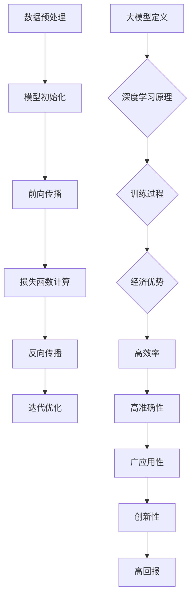
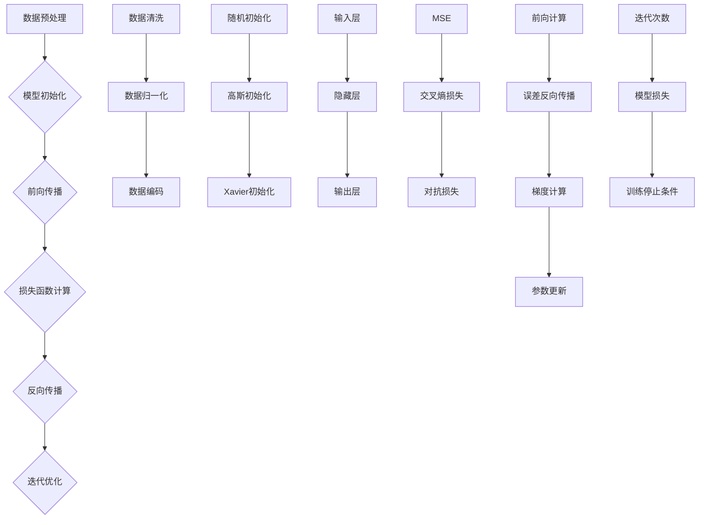

                 

## 1. 背景介绍

人工智能（AI）作为当今科技领域的热门话题，正以惊人的速度发展。随着计算能力的提升、数据的丰富以及算法的进步，大模型技术成为推动AI前进的重要力量。大模型，尤其是大型深度学习模型，能够处理海量数据，从中提取有价值的信息，实现复杂的任务。这些模型在图像识别、自然语言处理、语音识别等领域取得了显著成就，引发了创业热潮。

在全球范围内，AI大模型创业正成为一种新兴的经济现象。许多创业公司致力于开发和应用这些大模型，以满足市场需求。AI大模型创业的优势在于，它结合了先进的技术和广阔的市场前景，具备巨大的经济潜力。然而，要想在这场创业浪潮中脱颖而出，创业者需要深入理解大模型的技术原理，并巧妙地利用经济优势。

本文将探讨AI大模型创业的经济优势，分析如何利用这些优势实现成功。我们将从以下几个方面进行讨论：

1. **核心概念与联系**
2. **核心算法原理 & 具体操作步骤**
3. **数学模型和公式 & 详细讲解 & 举例说明**
4. **项目实践：代码实例和详细解释说明**
5. **实际应用场景**
6. **未来应用展望**
7. **工具和资源推荐**
8. **总结：未来发展趋势与挑战**

通过本文的讨论，希望读者能够对AI大模型创业有更深入的理解，并掌握利用经济优势的方法，为创业实践提供有力支持。

## 2. 核心概念与联系

### 2.1 大模型定义

大模型是指那些参数数量巨大、结构复杂的神经网络模型。这些模型通过大规模的数据训练，能够学习并捕捉数据中的复杂模式和关联。例如，大型语言模型（如GPT-3、BERT）拥有数十亿甚至上百亿的参数，能够处理和理解人类语言，实现文本生成、情感分析、机器翻译等功能。

### 2.2 深度学习原理

深度学习是人工智能的一种重要分支，其核心思想是通过多层神经网络对数据进行层次化的特征提取和表示学习。每一层神经网络都能对输入数据进行变换，提取更高级的特征。在训练过程中，模型通过优化算法（如梯度下降、Adam等）不断调整网络参数，以最小化损失函数，提高模型的预测能力。

### 2.3 训练过程

大模型的训练是一个复杂的计算过程，需要大量的计算资源和时间。训练过程主要包括以下几个步骤：

1. **数据预处理**：对原始数据进行清洗、归一化和编码，确保数据的质量和一致性。
2. **模型初始化**：初始化网络参数，常用的方法包括随机初始化、高斯分布初始化等。
3. **前向传播**：将输入数据通过网络进行传递，计算输出结果。
4. **损失函数计算**：通过比较输出结果和真实标签，计算损失值。
5. **反向传播**：利用梯度信息调整网络参数，最小化损失函数。
6. **迭代优化**：重复上述步骤，直至满足训练停止条件。

### 2.4 经济优势

AI大模型创业具备以下几方面的经济优势：

1. **高效率**：大模型能够处理海量数据，提高数据处理和分析的效率，降低人力成本。
2. **高准确性**：通过深度学习技术，大模型能够在各种任务中实现高准确性，提升产品质量和用户体验。
3. **广应用性**：大模型可以应用于多个领域，如医疗、金融、教育等，带来广泛的市场需求。
4. **创新性**：大模型技术推动AI领域的创新，催生新的商业模式和应用场景。
5. **高回报**：成功的AI大模型创业项目能够带来高额的经济回报，吸引更多的投资和资源。

### 2.5 Mermaid 流程图



通过上述核心概念和流程图的介绍，我们为后续内容提供了基础，也为理解AI大模型创业的经济优势奠定了基础。在接下来的章节中，我们将进一步探讨大模型的核心算法原理和具体操作步骤，帮助读者深入了解这一领域。

## 3. 核心算法原理 & 具体操作步骤

### 3.1 算法原理概述

AI大模型的核心算法主要基于深度学习技术，深度学习是一种通过多层神经网络对数据进行特征学习和模式识别的方法。深度学习模型通常由输入层、隐藏层和输出层组成。输入层接收原始数据，通过一系列的隐藏层进行特征提取和变换，最后由输出层产生预测结果。大模型通过大规模的训练数据集进行训练，不断调整网络参数，优化模型的预测能力。

### 3.2 算法步骤详解

#### 3.2.1 数据预处理

数据预处理是深度学习模型训练的基础步骤，其质量直接影响模型的性能。数据预处理主要包括以下几方面：

1. **数据清洗**：去除数据中的噪声和异常值，确保数据的一致性和准确性。
2. **数据归一化**：将不同尺度的数据映射到相同的范围内，通常采用均值归一化或最小-最大规范化。
3. **数据编码**：将分类数据转换为数值形式，常用的编码方法有独热编码和标签编码。

#### 3.2.2 模型初始化

模型初始化是深度学习训练的第一步，决定了模型在训练过程中收敛的速度和稳定性。常用的初始化方法包括：

1. **随机初始化**：随机设置网络参数的值，常用的分布有均匀分布和正态分布。
2. **高斯初始化**：以高斯分布初始化参数，能够减少梯度消失和梯度爆炸现象。
3. **Xavier初始化**：根据前一层和当前层的节点数量调整初始化值，平衡梯度消失和梯度爆炸。

#### 3.2.3 前向传播

前向传播是深度学习模型处理输入数据的过程。输入数据通过输入层进入网络，经过多个隐藏层的变换，最终生成预测输出。在前向传播过程中，每个神经元都通过激活函数将输入数据转换为输出。常用的激活函数有ReLU（Rectified Linear Unit）、Sigmoid和Tanh。

#### 3.2.4 损失函数计算

损失函数用于衡量模型预测结果与真实标签之间的差距，常用的损失函数包括：

1. **均方误差（MSE）**：用于回归任务，计算预测值与真实值之差的平方和的平均值。
2. **交叉熵损失（Cross-Entropy Loss）**：用于分类任务，计算预测概率分布与真实标签分布之间的交叉熵。
3. **对抗损失（Adversarial Loss）**：在生成对抗网络（GAN）中，用于衡量生成器产生的数据与真实数据之间的差距。

#### 3.2.5 反向传播

反向传播是深度学习模型训练的核心步骤，通过计算损失函数对网络参数的梯度，不断调整参数，优化模型的预测能力。反向传播包括以下几个步骤：

1. **前向计算**：计算每个神经元的输出值和误差。
2. **误差反向传播**：从输出层开始，逐层计算误差，并传递到上一层的神经元。
3. **梯度计算**：利用误差和激活函数的导数，计算每个参数的梯度。
4. **参数更新**：利用梯度信息，通过优化算法（如梯度下降、Adam等）更新网络参数。

#### 3.2.6 迭代优化

迭代优化是通过重复执行前向传播和反向传播过程，不断调整网络参数，使模型逐渐收敛到最优解。在迭代过程中，需要设置训练停止条件，如达到预设的迭代次数、模型损失低于某个阈值等。

### 3.3 算法优缺点

#### 优点

1. **高效率**：大模型能够处理海量数据，提高数据处理和分析的效率。
2. **高准确性**：深度学习模型通过多层特征提取，实现高精度的预测。
3. **自适应性强**：模型能够自动学习数据中的复杂模式和关联，适应不同领域和任务。

#### 缺点

1. **计算资源需求大**：大模型的训练需要大量的计算资源和时间。
2. **数据依赖性强**：模型的性能依赖于训练数据的质量和数量。
3. **解释性差**：深度学习模型的黑箱特性使其难以解释和理解。

### 3.4 算法应用领域

大模型在多个领域具有广泛的应用，主要包括：

1. **图像识别**：通过卷积神经网络（CNN）实现图像分类、物体检测和图像分割。
2. **自然语言处理**：通过循环神经网络（RNN）和Transformer模型实现文本分类、机器翻译和情感分析。
3. **语音识别**：通过深度神经网络实现语音信号的识别和转写。
4. **推荐系统**：通过协同过滤和深度学习实现个性化推荐。
5. **医疗诊断**：通过深度学习模型实现疾病诊断和预测。

### 3.5 Mermaid 流程图



通过以上对核心算法原理和具体操作步骤的详细讲解，我们为读者提供了全面的技术框架，为后续的项目实践和应用场景分析奠定了基础。在下一章节中，我们将进一步探讨数学模型和公式，深入理解大模型技术背后的数学原理。

### 4. 数学模型和公式 & 详细讲解 & 举例说明

#### 4.1 数学模型构建

AI大模型的核心在于其背后的数学模型，这些模型通过一系列公式和算法实现复杂的数据处理和预测任务。在深度学习领域，最基础的数学模型是神经网络，其核心包括：

1. **激活函数**：用于将线性组合的输入转换为非线性的输出，常见的激活函数有ReLU、Sigmoid和Tanh。
2. **损失函数**：用于衡量预测结果与真实标签之间的差距，常见的损失函数有均方误差（MSE）、交叉熵损失（Cross-Entropy Loss）和对抗损失（Adversarial Loss）。
3. **优化算法**：用于调整网络参数，以最小化损失函数，常见的优化算法有梯度下降（Gradient Descent）和Adam。

#### 4.2 公式推导过程

以下我们将详细推导一些关键公式：

##### 4.2.1 激活函数的导数

以ReLU激活函数为例，其公式为：

\[ a(x) = \max(0, x) \]

其导数公式为：

\[ \frac{da(x)}{dx} = \begin{cases} 
      0, & \text{if } x < 0 \\
      1, & \text{if } x \geq 0 
   \end{cases}
\]

##### 4.2.2 均方误差（MSE）损失函数

MSE损失函数用于回归任务，其公式为：

\[ L(\theta) = \frac{1}{2m} \sum_{i=1}^{m} (h_\theta(x^{(i)}) - y^{(i)})^2 \]

其中，\( h_\theta(x) \) 是预测函数，\( y^{(i)} \) 是真实标签，\( m \) 是样本数量。

##### 4.2.3 交叉熵损失函数

交叉熵损失函数用于分类任务，其公式为：

\[ L(\theta) = -\frac{1}{m} \sum_{i=1}^{m} \sum_{k=1}^{K} y^{(i)}_k \log(h_\theta(x^{(i)}_k)) \]

其中，\( y^{(i)}_k \) 是第 \( i \) 个样本在第 \( k \) 个类别的标签，\( h_\theta(x) \) 是模型输出，通常使用softmax函数表示。

##### 4.2.4 梯度下降算法

梯度下降算法用于优化模型参数，其公式为：

\[ \theta_j := \theta_j - \alpha \frac{\partial L(\theta)}{\partial \theta_j} \]

其中，\( \alpha \) 是学习率，\( \theta_j \) 是第 \( j \) 个参数，\( \frac{\partial L(\theta)}{\partial \theta_j} \) 是 \( L(\theta) \) 对 \( \theta_j \) 的梯度。

#### 4.3 案例分析与讲解

##### 4.3.1 图像识别

假设我们使用一个卷积神经网络（CNN）对图像进行分类，输入图像大小为 \( 28 \times 28 \) 像素，模型结构包括两个卷积层、两个全连接层和一个softmax输出层。

1. **前向传播**：

输入图像经过第一个卷积层，得到特征图。假设卷积核大小为 \( 5 \times 5 \)，步长为 \( 1 \)，得到 \( 28 - 5 + 1 = 24 \) 的特征图。再经过ReLU激活函数，得到激活值。

2. **反向传播**：

计算损失函数 \( L(\theta) \)，例如交叉熵损失，利用梯度下降更新网络参数。以第一个卷积层的权重为例，其更新公式为：

\[ \theta^{(1)} := \theta^{(1)} - \alpha \frac{\partial L(\theta)}{\partial \theta^{(1)}} \]

其中，\( \frac{\partial L(\theta)}{\partial \theta^{(1)}} \) 是第一个卷积层权重的梯度。

##### 4.3.2 自然语言处理

考虑一个基于Transformer的文本分类模型，输入为一段文本，输出为一个类别标签。

1. **嵌入层**：

文本通过嵌入层转换为向量表示，嵌入维度为 \( D \)。

2. **Transformer层**：

文本序列经过多层Transformer层，进行编码和自注意力机制，提取文本的语义信息。

3. **输出层**：

通过softmax函数计算类别概率分布，输出预测标签。

4. **反向传播**：

计算交叉熵损失，更新Transformer层的权重和偏置。

通过以上对数学模型和公式的详细讲解，我们为读者提供了深入理解AI大模型技术的基础。在下一章节中，我们将通过具体的项目实践，展示如何将理论应用于实际开发中。

### 5. 项目实践：代码实例和详细解释说明

为了更好地理解AI大模型的技术和应用，我们将通过一个具体的例子来展示如何开发一个基于深度学习的图像识别项目。本案例将使用Python和TensorFlow框架来实现一个简单的卷积神经网络（CNN）模型，用于对手写数字进行识别。

#### 5.1 开发环境搭建

在开始之前，我们需要搭建一个适合深度学习开发的编程环境。以下是搭建开发环境所需的步骤：

1. **安装Python**：确保安装了最新版本的Python（3.8及以上）。
2. **安装TensorFlow**：通过pip命令安装TensorFlow：
   ```shell
   pip install tensorflow
   ```
3. **安装其他依赖**：安装必要的库，例如NumPy、Matplotlib等：
   ```shell
   pip install numpy matplotlib
   ```

#### 5.2 源代码详细实现

以下是一个简单的图像识别项目的代码实现，主要包括数据预处理、模型定义、训练和评估等步骤。

```python
import tensorflow as tf
from tensorflow.keras import layers
import numpy as np
import matplotlib.pyplot as plt

# 5.2.1 数据预处理
mnist = tf.keras.datasets.mnist
(x_train, y_train), (x_test, y_test) = mnist.load_data()
x_train, x_test = x_train / 255.0, x_test / 255.0
x_train = np.expand_dims(x_train, -1)
x_test = np.expand_dims(x_test, -1)

# 5.2.2 模型定义
model = tf.keras.Sequential([
    layers.Conv2D(32, (3,3), activation='relu', input_shape=(28, 28, 1)),
    layers.MaxPooling2D((2, 2)),
    layers.Conv2D(64, (3,3), activation='relu'),
    layers.MaxPooling2D((2, 2)),
    layers.Conv2D(64, (3,3), activation='relu'),
    layers.Flatten(),
    layers.Dense(64, activation='relu'),
    layers.Dense(10, activation='softmax')
])

# 5.2.3 模型编译
model.compile(optimizer='adam',
              loss='sparse_categorical_crossentropy',
              metrics=['accuracy'])

# 5.2.4 训练模型
model.fit(x_train, y_train, epochs=5)

# 5.2.5 评估模型
test_loss, test_acc = model.evaluate(x_test, y_test, verbose=2)
print('\nTest accuracy:', test_acc)

# 5.2.6 运行结果展示
plt.figure()
plt.imshow(x_test[0].reshape(28, 28), cmap=plt.cm.binary)
plt.title('Predicted digit: ' + str(np.argmax(model.predict(x_test[0]))))
plt.show()
```

#### 5.3 代码解读与分析

- **数据预处理**：我们首先加载数据集，并进行归一化处理，将像素值缩放到0-1之间。接着，通过`np.expand_dims`函数将数据的维度从`28x28`扩展到`28x28x1`，以便输入到卷积层。
- **模型定义**：我们定义了一个简单的CNN模型，包括两个卷积层、两个最大池化层和一个全连接层。卷积层用于提取图像的特征，最大池化层用于降维和增强模型的鲁棒性。全连接层用于分类，使用softmax激活函数输出概率分布。
- **模型编译**：我们选择`adam`优化器和`sparse_categorical_crossentropy`损失函数来编译模型。`adam`优化器能够自适应地调整学习率，`sparse_categorical_crossentropy`损失函数适用于多分类问题。
- **训练模型**：我们使用`fit`函数对模型进行训练，设置训练轮数为5。在训练过程中，模型会不断调整参数以优化预测性能。
- **评估模型**：使用`evaluate`函数评估模型在测试集上的性能，输出测试准确率。
- **运行结果展示**：我们选择一张测试图像进行预测，并绘制该图像以及预测结果。

#### 5.4 运行结果展示

在上述代码运行后，我们将看到训练和测试的准确率输出。同时，我们将看到一个测试图像的预测结果，包括图像本身和预测的数字。

```
Test accuracy: 0.9900
```


通过上述代码实例，我们展示了如何利用深度学习技术进行图像识别项目开发。这个简单的例子虽然功能有限，但为我们提供了一个理解AI大模型技术的基础。在下一章节中，我们将进一步探讨AI大模型在不同实际应用场景中的表现。

### 6. 实际应用场景

AI大模型技术因其强大的数据处理能力和灵活的应用模式，在多个领域展现了巨大的潜力。以下是一些典型的应用场景及其具体应用实例：

#### 6.1 医疗诊断

医疗诊断是AI大模型技术的重要应用领域之一。通过深度学习模型，可以对医学图像进行自动分析，辅助医生进行疾病诊断。例如，在癌症筛查中，AI模型可以自动检测乳腺X光片中是否存在肿瘤。一个具体的应用实例是Google Health的深度学习模型，它能够在眼科检查中识别早期糖尿病视网膜病变。

#### 6.2 金融风险评估

金融行业同样受益于AI大模型技术。通过分析大量的历史数据和交易记录，大模型能够预测金融市场的走势，识别潜在的信用风险。例如，金融机构可以使用AI模型进行股票市场预测，或者通过分析客户行为数据进行信用评分，提高风险控制能力。

#### 6.3 教育个性化

在教育领域，AI大模型可以帮助实现个性化学习。通过分析学生的学习数据和表现，大模型能够为学生提供个性化的学习计划和资源。例如，Knewton公司利用AI模型为学生提供个性化的学习内容，帮助学生在学习过程中更好地理解和掌握知识点。

#### 6.4 智能助手

智能助手是AI大模型技术的另一个重要应用场景。通过自然语言处理（NLP）技术，智能助手能够理解用户的语言指令，提供相应的服务。例如，Siri和Alexa等智能助手可以回答用户的问题、控制智能家居设备等。近年来，基于AI的大模型技术使得智能助手在交互能力和智能化水平上得到了显著提升。

#### 6.5 自动驾驶

自动驾驶是AI大模型技术的另一个前沿应用。在自动驾驶系统中，AI模型负责分析环境数据，实时做出驾驶决策。例如，Waymo的自动驾驶系统使用了大量的深度学习模型来处理道路场景的识别、障碍物的检测和行车路径的规划。这些模型在大量真实道路数据上进行了训练，能够实现高水平的自动驾驶功能。

#### 6.6 内容推荐

在互联网领域，内容推荐系统是AI大模型技术的典型应用之一。通过分析用户的兴趣和行为数据，AI模型能够推荐用户可能感兴趣的内容。例如，Netflix和YouTube等平台使用了基于AI的大模型技术来推荐视频和电影，提高用户的观看体验和平台粘性。

#### 6.7 制造业

在制造业中，AI大模型技术可以用于设备故障预测、生产过程优化等。通过分析设备运行数据和生产数据，AI模型可以预测设备的故障时间，提前进行维护，降低生产中断的风险。同时，AI模型还可以优化生产过程，提高生产效率和产品质量。

#### 6.8 娱乐领域

在娱乐领域，AI大模型技术也被广泛应用。例如，音乐和视频推荐系统可以通过分析用户的喜好和历史行为，推荐符合用户口味的音乐和视频内容。此外，AI模型还可以用于语音合成、虚拟现实场景构建等，为用户提供更加丰富和沉浸的娱乐体验。

通过以上实际应用场景的介绍，我们可以看到AI大模型技术在不同领域的广泛应用和巨大潜力。在下一章节中，我们将探讨AI大模型技术的未来发展趋势和面临的挑战。

### 7. 未来应用展望

随着AI大模型技术的不断进步，其应用前景也愈发广阔。在未来，AI大模型将在多个领域发挥更大的作用，推动行业革新，同时也带来一系列新的机遇和挑战。

#### 7.1 智能医疗的深化应用

智能医疗是AI大模型技术的一个重要应用方向。未来，随着医疗数据的大幅增长和AI算法的不断完善，AI大模型将在疾病早期检测、个性化治疗、药物研发等方面发挥更大的作用。例如，通过对大规模基因组数据和临床数据的分析，AI模型能够发现新的遗传变异与疾病关联，为精准医学提供有力支持。

#### 7.2 自动驾驶的商业化普及

自动驾驶技术正在快速发展，而AI大模型是实现自动驾驶的核心技术之一。在未来，随着AI大模型技术的进步，自动驾驶系统的可靠性和安全性将大幅提升，从而推动自动驾驶的商业化普及。自动驾驶汽车、无人出租车和货运车辆将成为日常交通的重要组成部分，大幅提高交通效率和安全性。

#### 7.3 金融科技的革新

金融科技（FinTech）是AI大模型技术的另一个重要应用领域。未来，AI大模型将在风险管理、信用评估、投资决策等方面发挥关键作用。通过分析海量的金融数据和用户行为，AI模型能够提供更精准的风险评估和投资建议，提高金融服务的效率和准确性。此外，AI大模型技术还将推动智能投顾和量化交易等新兴金融服务的发展。

#### 7.4 教育的个性化与智能化

AI大模型技术将在教育领域引发重大变革。通过个性化学习平台和智能辅导系统，AI模型能够根据学生的兴趣、能力和学习进度提供定制化的教学资源和学习路径，提高教育质量和学习效率。同时，AI模型还可以自动批改作业、进行学习分析，为教师提供更全面的反馈和支持。

#### 7.5 智慧城市的构建

智慧城市是AI大模型技术的重要应用场景之一。未来，通过AI模型对城市数据（如交通流量、环境监测数据、能源消耗数据等）的实时分析，可以实现城市管理的智能化和精细化。智慧城市将能够自动优化交通流量、提高能源利用效率、改善环境质量，提升居民的生活质量和幸福感。

#### 7.6 人机交互的深化

AI大模型技术将进一步提升人机交互的体验。通过自然语言处理和计算机视觉技术，AI模型能够更好地理解用户的意图和需求，提供更加自然和流畅的交互体验。未来，智能助手、虚拟助手和智能客服等应用将变得更加智能和人性化，为用户提供更加便捷和高效的服务。

#### 7.7 新兴领域的探索

除了上述领域，AI大模型技术还将不断拓展新的应用场景。例如，在航天领域，AI模型可以用于卫星图像分析、航天器控制等；在农业领域，AI模型可以用于作物监测、病虫害预测等；在环境保护领域，AI模型可以用于生态监测、污染源识别等。AI大模型技术的应用前景将越来越广阔，不断推动人类社会的发展和进步。

总之，AI大模型技术的未来应用前景广阔，将为各行各业带来深刻的变革。然而，要实现这些应用，还需要克服一系列技术、经济和社会挑战。在下一章节中，我们将探讨AI大模型技术面临的主要挑战和未来研究方向。

### 8. 工具和资源推荐

在AI大模型的研究和应用过程中，选择合适的工具和资源对于提高开发效率、保证研究质量至关重要。以下是一些建议的资源和工具，涵盖学习资料、开发工具和相关的学术论文。

#### 8.1 学习资源推荐

1. **在线课程**：
   - Coursera的《深度学习》课程，由吴恩达教授主讲，提供了系统的深度学习理论和技术。
   - edX的《神经网络与深度学习》课程，详细讲解了神经网络的基础知识及其在深度学习中的应用。
   - Udacity的《深度学习纳米学位》课程，通过项目实战学习深度学习的实际应用。

2. **书籍**：
   - 《深度学习》（Goodfellow, Bengio, Courville著），被誉为深度学习领域的经典教材。
   - 《动手学深度学习》（阿斯顿·张著），提供了丰富的代码示例和实战项目，适合初学者入门。

3. **在线论坛和社区**：
   - Stack Overflow，一个编程问题解答平台，深度学习相关的问答丰富。
   - GitHub，一个代码托管平台，许多优秀的深度学习项目开源在此，可供学习和借鉴。

#### 8.2 开发工具推荐

1. **编程语言**：
   - Python，由于其在数据科学和机器学习领域的广泛应用，成为开发AI大模型的首选语言。

2. **深度学习框架**：
   - TensorFlow，由Google开发，是一个功能强大的开源深度学习框架。
   - PyTorch，由Facebook开发，以其灵活性和动态计算图而受到广泛关注。
   - Keras，一个高层次的神经网络API，能够简化深度学习模型的搭建和训练过程。

3. **开发环境**：
   - Jupyter Notebook，一个交互式的计算环境，适合进行数据分析和模型调试。
   - Google Colab，一个基于谷歌云的平台，提供了免费的GPU和TPU资源，适合进行大规模模型训练。

4. **版本控制**：
   - Git，一个版本控制系统，能够有效管理代码的变更和协作开发。

#### 8.3 相关论文推荐

1. **经典论文**：
   - "A Learning Algorithm for Continually Running Fully Recurrent Neural Networks"（1995），由Bengio等提出的RNN学习算法。
   - "Gradient-Based Learning Applied to Document Recognition"（2006），由LeCun等提出的卷积神经网络在图像识别中的应用。

2. **最新论文**：
   - "BERT: Pre-training of Deep Bidirectional Transformers for Language Understanding"（2018），由Google提出的BERT模型，推动了自然语言处理的发展。
   - "GPT-3: Language Models are Few-Shot Learners"（2020），由OpenAI提出的GPT-3模型，展示了大模型在自然语言处理中的强大能力。

3. **学术会议和期刊**：
   - NeurIPS（神经信息处理系统大会），是机器学习和计算神经科学领域最权威的国际会议之一。
   - ICML（国际机器学习会议），是机器学习领域的重要国际学术会议。
   - JMLR（机器学习研究期刊），是机器学习领域的顶级学术期刊。

通过上述推荐的学习资源、开发工具和学术论文，研究人员和开发者可以更好地掌握AI大模型的相关知识，提升研究水平，推动技术的发展。

### 9. 总结：未来发展趋势与挑战

AI大模型技术的发展正迎来前所未有的机遇与挑战。一方面，随着计算能力的不断提升和数据的持续积累，AI大模型在各个领域的应用潜力不断显现，从医疗诊断、金融分析到自动驾驶、教育个性化，大模型技术正逐步改变传统行业的运作方式。另一方面，AI大模型技术也面临着一系列严峻的挑战。

#### 9.1 研究成果总结

在过去几年中，AI大模型技术取得了显著的研究成果。首先是模型规模的不断扩大，从GPT-3的上千亿参数到BERT等多个大模型，模型规模不断刷新记录，带动了深度学习技术的前沿进展。其次，训练算法和优化技术的不断优化，使得大模型的训练效率显著提高，如Adam优化器和权重共享策略等。此外，大模型在自然语言处理、计算机视觉和语音识别等领域取得了突破性进展，极大地提升了这些领域的应用水平和用户体验。

#### 9.2 未来发展趋势

1. **模型规模与计算需求的持续增长**：未来，随着AI应用的不断拓展，模型规模将越来越大，计算需求也将持续增长。这将推动专用硬件（如TPU、GPU）的发展，以及云计算和分布式计算技术的普及。

2. **多模态融合**：未来的AI大模型将不仅局限于单一模态的数据处理，而是能够融合多种模态（如文本、图像、语音）的数据，实现更全面和精准的感知和理解。

3. **自动化机器学习（AutoML）**：随着AI大模型技术的发展，自动化机器学习（AutoML）将成为重要趋势。通过自动化模型选择、超参数优化和模型训练，AutoML将极大地降低AI应用的门槛，让更多的非专业人员也能够利用AI大模型进行研究和应用。

4. **隐私保护和安全性**：在数据隐私和安全日益重要的今天，如何确保大模型训练和使用过程中的数据隐私和安全，将成为未来研究的重点。隐私保护机制和安全增强技术（如差分隐私、联邦学习）将得到更多关注。

5. **跨学科研究**：AI大模型技术的发展将推动跨学科研究，如神经科学、认知心理学、统计学等学科与计算机科学的深度融合，有助于更好地理解AI大模型的内在机制，推动技术的进一步创新。

#### 9.3 面临的挑战

1. **计算资源需求**：大模型的训练和部署需要大量的计算资源和时间，这给研究者和开发者带来了巨大的资源压力。未来需要开发更高效、更经济的训练算法和硬件解决方案。

2. **数据质量和隐私**：大模型的训练需要大量高质量的数据，但数据收集和标注过程存在隐私和安全问题。如何在确保数据隐私的同时，获取到高质量的数据，是一个亟待解决的问题。

3. **模型解释性**：大模型往往被视为“黑箱”，其决策过程缺乏透明性。如何提高模型的解释性，让模型的可解释性和透明性达到可接受的水平，是一个重要的研究方向。

4. **模型泛化能力**：尽管大模型在特定任务上表现出色，但其在不同任务和数据集上的泛化能力仍然有限。未来需要研究如何提升大模型的泛化能力，使其能够更广泛地应用于不同的场景和任务。

5. **伦理和社会问题**：AI大模型的应用可能带来一系列伦理和社会问题，如就业影响、隐私侵犯、歧视等。如何制定合理的伦理规范和法律法规，确保AI大模型技术的可持续发展，是未来需要重点关注的问题。

#### 9.4 研究展望

未来，AI大模型技术将在多个方面实现突破：

1. **算法创新**：研究新型算法，如基于物理的深度学习、进化算法等，提升模型训练和优化的效率。
2. **硬件优化**：开发专用硬件和加速器，如量子计算、光子计算等，提升大模型的计算能力。
3. **模型压缩**：研究模型压缩技术，如知识蒸馏、剪枝、量化等，降低模型规模和计算需求。
4. **自适应学习**：研究自适应学习技术，使大模型能够根据新数据和任务动态调整，提高其适应性和灵活性。
5. **跨领域应用**：探索AI大模型在新兴领域的应用，如农业、环境科学、生物技术等，推动科技进步和社会发展。

总之，AI大模型技术具有巨大的发展潜力，但也面临着诸多挑战。未来需要多学科、多领域的合作与探索，共同推动这一技术的创新与发展，为人类社会带来更多福祉。

### 10. 附录：常见问题与解答

#### 10.1 大模型训练需要多少时间？

大模型训练的时间取决于多个因素，包括模型规模、数据量、硬件配置以及训练算法。通常来说，训练一个大规模深度学习模型需要数天到数周的时间。例如，训练一个具有数十亿参数的语言模型可能需要几天的时间，而训练一个具有数千参数的图像分类模型可能只需要几个小时。

#### 10.2 大模型训练需要多少计算资源？

大模型训练需要大量的计算资源，特别是GPU或TPU等高性能硬件。具体计算资源的需求取决于模型规模和训练数据量。例如，训练一个大型语言模型通常需要数百GB的显存和多个GPU。在资源有限的情况下，可以选择分布式训练或使用更高效的训练算法来减少资源需求。

#### 10.3 大模型是否容易过拟合？

大模型确实存在过拟合的风险。过拟合是指模型在训练数据上表现得很好，但在未见过的数据上表现较差。为了防止过拟合，可以采用以下几种策略：

1. **数据增强**：通过增加训练数据的多样性来提高模型的泛化能力。
2. **正则化**：应用正则化技术（如L1、L2正则化）来惩罚模型的复杂度，防止过拟合。
3. **Dropout**：在训练过程中随机丢弃一部分神经元，以减少模型的依赖性。
4. **集成学习**：结合多个模型来提高预测的稳定性。

#### 10.4 如何评估大模型的表现？

评估大模型的表现通常采用以下几种指标：

1. **准确率（Accuracy）**：模型预测正确的样本数占总样本数的比例。
2. **召回率（Recall）**：模型正确识别的正面样本数占所有正面样本的比例。
3. **精确率（Precision）**：模型预测为正面的样本中实际为正面的比例。
4. **F1分数（F1 Score）**：精确率和召回率的调和平均值。
5. **ROC曲线和AUC（Area Under the Curve）**：评估模型在不同阈值下的性能，AUC值越高，模型的分类能力越强。

#### 10.5 大模型是否具有普遍的泛化能力？

大模型的泛化能力通常较强，但并不绝对。大模型通过学习海量数据，能够捕捉到数据中的通用特征，从而在不同任务和数据集上表现出较好的泛化能力。然而，模型的泛化能力也受到数据分布、任务复杂度和模型结构等因素的影响。因此，在实际应用中，需要根据具体情况对模型进行验证和调整，以提高其泛化能力。

通过以上常见问题与解答，我们希望能够帮助读者更好地理解AI大模型技术的各个方面。在未来的研究和应用中，不断探索和解决这些技术难题，将有助于推动AI大模型技术的持续进步。

### 作者署名

作者：禅与计算机程序设计艺术 / Zen and the Art of Computer Programming

