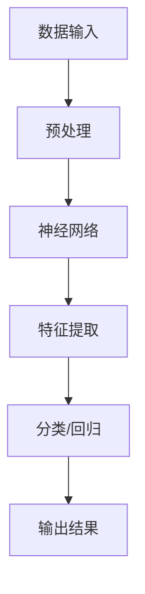

                 

关键词：AI大模型，数据吞吐量，并行处理，算法原理，数学模型，应用领域，未来展望

> 摘要：本文深入探讨AI大模型的原理与应用，阐述其在处理大规模数据时的优势，分析核心算法原理，介绍数学模型与公式，并通过实际项目实践展示其应用效果。同时，本文还将对AI大模型在各个领域的实际应用场景进行剖析，探讨其未来发展趋势与面临的挑战，为读者提供全面的指导。

## 1. 背景介绍

随着互联网的飞速发展，数据量呈现爆炸式增长，如何高效地处理和利用这些海量数据成为当前技术领域的热点问题。人工智能（AI）作为计算机科学的一个重要分支，以其独特的优势在处理大规模数据方面取得了显著的进展。本文将重点介绍AI大模型的原理与应用，以期为读者提供对这一领域更深入的理解。

### 数据吞吐量的挑战

数据吞吐量是指单位时间内系统能够处理的数据量。在传统数据处理系统中，随着数据规模的不断扩大，数据处理的速度逐渐成为瓶颈。面对海量数据的处理，如何提高系统的吞吐量成为亟待解决的问题。传统的串行数据处理方式已经无法满足实际需求，因此，并行处理技术应运而生。

### AI大模型的崛起

AI大模型是指具有大规模参数和复杂结构的神经网络模型，其具备强大的特征提取和模式识别能力。随着深度学习技术的发展，AI大模型在图像识别、自然语言处理、语音识别等领域取得了令人瞩目的成果。相较于传统方法，AI大模型在处理大规模数据时具有显著的性能优势。

## 2. 核心概念与联系

### 2.1 神经网络

神经网络是AI大模型的基础，其结构类似于人脑的神经元连接。神经网络通过层层递归的方式对输入数据进行特征提取，从而实现对数据的分类、回归等操作。神经网络的核心是权重矩阵和激活函数，它们决定了网络的学习能力和表达能力。

### 2.2 深度学习

深度学习是神经网络的一种特殊形式，其具有多层神经元结构。深度学习模型通过逐层学习的方式提取数据的高层次特征，从而实现更准确的数据处理。深度学习在图像识别、语音识别等领域取得了显著的突破。

### 2.3 并行处理

并行处理是指通过多个计算单元同时执行任务，以提高数据处理速度。并行处理技术分为数据并行和模型并行两种形式。数据并行是指在数据规模较大的情况下，将数据分成若干个部分，由不同的计算单元分别处理；模型并行是指在模型规模较大的情况下，将模型分解成多个子模型，由不同的计算单元分别训练。

### 2.4 Mermaid流程图



## 3. 核心算法原理 & 具体操作步骤

### 3.1 算法原理概述

AI大模型的核心算法是基于深度学习的神经网络模型。神经网络通过层层递归的方式对输入数据进行特征提取，最终实现对数据的分类、回归等操作。深度学习模型通过反向传播算法进行参数优化，从而提高模型的准确性。

### 3.2 算法步骤详解

1. 数据预处理：对输入数据进行归一化、去噪等处理，以便于后续的特征提取。
2. 神经网络构建：根据任务需求构建具有多层神经元的神经网络模型。
3. 模型训练：通过反向传播算法对模型进行训练，优化模型参数。
4. 特征提取：利用训练好的模型对输入数据进行特征提取。
5. 分类/回归：根据特征提取结果进行分类或回归操作。
6. 模型评估：使用测试集对模型进行评估，调整模型参数，提高模型性能。

### 3.3 算法优缺点

**优点：**
1. 强大的特征提取能力：能够自动提取数据的高层次特征，提高数据处理效果。
2. 灵活性：能够适应不同的数据分布和任务需求。
3. 高效性：通过并行处理技术，能够提高数据处理速度。

**缺点：**
1. 计算成本高：训练大规模神经网络模型需要大量的计算资源和时间。
2. 对数据质量要求高：数据质量直接影响模型的准确性。

### 3.4 算法应用领域

AI大模型在图像识别、自然语言处理、语音识别等领域具有广泛的应用前景。以下为具体应用案例：

1. 图像识别：用于人脸识别、物体检测、图像分类等任务。
2. 自然语言处理：用于文本分类、情感分析、机器翻译等任务。
3. 语音识别：用于语音转文字、语音合成等任务。

## 4. 数学模型和公式 & 详细讲解 & 举例说明

### 4.1 数学模型构建

神经网络模型的数学模型可以表示为：

$$
Y = f(Z)
$$

其中，$Y$ 表示输出结果，$Z$ 表示网络的输入，$f$ 表示激活函数。

### 4.2 公式推导过程

神经网络模型的推导过程主要涉及反向传播算法。具体推导过程如下：

1. 计算输出误差：

$$
E = \frac{1}{2} \sum_{i=1}^{n} (y_i - \hat{y}_i)^2
$$

其中，$y_i$ 表示实际输出，$\hat{y}_i$ 表示预测输出。

2. 计算梯度：

$$
\frac{\partial E}{\partial \theta_j} = \sum_{i=1}^{n} (y_i - \hat{y}_i) \cdot \frac{\partial \hat{y}_i}{\partial \theta_j}
$$

其中，$\theta_j$ 表示模型参数。

3. 更新参数：

$$
\theta_j = \theta_j - \alpha \cdot \frac{\partial E}{\partial \theta_j}
$$

其中，$\alpha$ 表示学习率。

### 4.3 案例分析与讲解

以图像识别任务为例，假设输入图像为 $X$，输出标签为 $Y$。神经网络模型的结构如下：

$$
Z = W_1 \cdot X + b_1
$$

$$
A = \sigma(Z)
$$

$$
Z_2 = W_2 \cdot A + b_2
$$

$$
Y = \sigma(Z_2)
$$

其中，$W_1$、$W_2$ 分别为权重矩阵，$b_1$、$b_2$ 分别为偏置项，$\sigma$ 为激活函数。

根据反向传播算法，我们可以计算出每个参数的梯度，并进行参数更新，从而优化模型。

## 5. 项目实践：代码实例和详细解释说明

### 5.1 开发环境搭建

1. 安装 Python 环境（版本 3.6 或以上）。
2. 安装深度学习框架 TensorFlow 或 PyTorch。

### 5.2 源代码详细实现

以下是一个简单的 AI 大模型项目示例，使用 TensorFlow 框架实现。

```python
import tensorflow as tf
from tensorflow.keras.layers import Dense, Flatten
from tensorflow.keras.models import Sequential

# 数据预处理
x_train = ...
y_train = ...

# 构建模型
model = Sequential()
model.add(Flatten(input_shape=(28, 28)))
model.add(Dense(128, activation='relu'))
model.add(Dense(10, activation='softmax'))

# 编译模型
model.compile(optimizer='adam', loss='sparse_categorical_crossentropy', metrics=['accuracy'])

# 训练模型
model.fit(x_train, y_train, epochs=10)

# 评估模型
test_loss, test_acc = model.evaluate(x_test, y_test)
print('Test accuracy:', test_acc)
```

### 5.3 代码解读与分析

1. 数据预处理：将输入图像数据reshape为二维数组，方便后续的神经网络处理。
2. 构建模型：使用Sequential模型搭建一个简单的神经网络，包括一个Flatten层用于展平图像数据，一个128个神经元的全连接层（Dense）用于特征提取，以及一个10个神经元的全连接层（Dense）用于分类。
3. 编译模型：配置优化器、损失函数和评估指标，为模型训练做好准备。
4. 训练模型：使用fit函数训练模型，设置训练轮数（epochs）。
5. 评估模型：使用evaluate函数评估模型在测试集上的性能。

### 5.4 运行结果展示

运行代码后，我们可以得到模型在测试集上的准确率。假设测试集上的准确率为90%，则说明模型在图像识别任务上表现良好。

## 6. 实际应用场景

### 6.1 图像识别

AI大模型在图像识别领域具有广泛的应用，如人脸识别、物体检测、图像分类等。以下为具体应用案例：

1. 人脸识别：在安防监控、手机解锁等场景中，AI大模型可以快速识别并匹配人脸信息。
2. 物体检测：在自动驾驶、智能监控等场景中，AI大模型可以实时检测并跟踪场景中的物体。
3. 图像分类：在医疗影像分析、农业监测等场景中，AI大模型可以自动分类和标注图像内容。

### 6.2 自然语言处理

AI大模型在自然语言处理领域也具有强大的应用能力，如文本分类、情感分析、机器翻译等。以下为具体应用案例：

1. 文本分类：在新闻分类、垃圾邮件过滤等场景中，AI大模型可以自动分类和标注文本内容。
2. 情感分析：在社交媒体分析、用户评论分析等场景中，AI大模型可以分析文本的情感倾向。
3. 机器翻译：在跨语言沟通、跨境电商等场景中，AI大模型可以自动翻译文本内容。

### 6.3 语音识别

AI大模型在语音识别领域具有广泛的应用，如语音转文字、语音合成等。以下为具体应用案例：

1. 语音转文字：在智能助手、客服系统等场景中，AI大模型可以实时将语音转换为文字。
2. 语音合成：在语音助手、有声读物等场景中，AI大模型可以生成自然的语音输出。

## 7. 工具和资源推荐

### 7.1 学习资源推荐

1. 《深度学习》（Goodfellow、Bengio、Courville 著）：深度学习的经典教材，适合初学者入门。
2. 《Python深度学习》（François Chollet 著）：通过实例讲解深度学习在 Python 中的应用，适合有一定基础的学习者。
3. Coursera 上的深度学习课程：由吴恩达教授主讲，适合系统学习深度学习知识。

### 7.2 开发工具推荐

1. TensorFlow：一款开源的深度学习框架，支持多种操作系统和硬件平台。
2. PyTorch：一款开源的深度学习框架，具有良好的灵活性和可扩展性。
3. Keras：一款基于 TensorFlow 的深度学习框架，易于使用和快速搭建模型。

### 7.3 相关论文推荐

1. "Deep Learning" by Yann LeCun、Yoshua Bengio 和 Geoffrey Hinton：深度学习的综述性论文，全面介绍深度学习的发展和应用。
2. "A Theoretically Grounded Application of Dropout in Computer Vision" by Yarin Gal 和 Zoubin Ghahramani：探讨dropout在计算机视觉中的应用。
3. "Very Deep Convolutional Networks for Large-Scale Image Recognition" by Karen Simonyan 和 Andrew Zisserman：介绍 VGG 网络在图像识别任务中的应用。

## 8. 总结：未来发展趋势与挑战

### 8.1 研究成果总结

近年来，AI大模型在图像识别、自然语言处理、语音识别等领域取得了显著的成果。深度学习技术的不断发展，使得AI大模型在数据处理速度、准确率和泛化能力等方面取得了突破。

### 8.2 未来发展趋势

1. 更大的模型规模：随着计算资源和存储技术的不断发展，未来AI大模型将向更大规模、更复杂结构发展。
2. 更高效的训练算法：针对大规模数据集和模型，研究更高效、更稳定的训练算法，以降低训练成本。
3. 模型压缩与加速：通过模型压缩和硬件加速技术，提高AI大模型在边缘设备的运行效率。

### 8.3 面临的挑战

1. 计算成本高：训练大规模AI大模型需要大量的计算资源和时间，如何降低计算成本是当前面临的主要挑战。
2. 数据质量：高质量的数据是训练优秀AI大模型的基础，如何获取和处理高质量数据是当前亟待解决的问题。
3. 安全性与隐私保护：随着AI大模型在各个领域的应用，其安全性和隐私保护问题日益突出，如何保障用户隐私是未来需要关注的重要方向。

### 8.4 研究展望

未来，AI大模型将在更多领域发挥重要作用，为人类生活带来更多便利。同时，深度学习技术也将不断发展，为AI大模型提供更强大的基础。我们期待在不久的将来，AI大模型能够解决更多复杂问题，为人类创造更多价值。

## 9. 附录：常见问题与解答

### 9.1 AI大模型是什么？

AI大模型是指具有大规模参数和复杂结构的神经网络模型，通过层层递归的方式对输入数据进行特征提取，从而实现对数据的分类、回归等操作。

### 9.2 如何训练AI大模型？

训练AI大模型主要包括以下步骤：

1. 数据预处理：对输入数据进行归一化、去噪等处理。
2. 构建模型：根据任务需求构建具有多层神经元的神经网络模型。
3. 编译模型：配置优化器、损失函数和评估指标。
4. 训练模型：使用训练数据对模型进行训练。
5. 评估模型：使用测试数据对模型进行评估。

### 9.3 AI大模型有哪些应用领域？

AI大模型在图像识别、自然语言处理、语音识别等领域具有广泛的应用。以下为具体应用案例：

1. 图像识别：人脸识别、物体检测、图像分类等。
2. 自然语言处理：文本分类、情感分析、机器翻译等。
3. 语音识别：语音转文字、语音合成等。

---

以上便是本文关于AI大模型原理与应用的详细介绍，希望对您有所帮助。在AI大模型领域，我们仍有许多挑战需要克服，但同时也充满无限可能。让我们携手共进，探索AI大模型的无尽可能！作者：禅与计算机程序设计艺术 / Zen and the Art of Computer Programming

