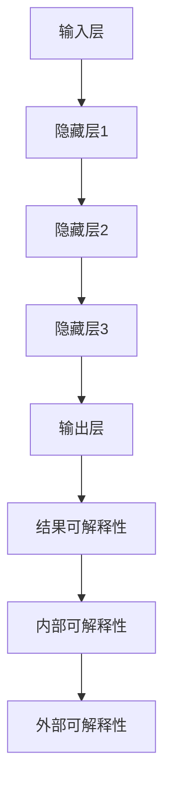

                 

关键词：人工智能、大模型、可解释性、机器学习、模型推理、算法优化、数学模型、应用场景、工具推荐、未来发展。

## 摘要

本文旨在深入探讨人工智能领域中的大模型原理与应用，特别是其在可解释性方面的挑战与进展。随着深度学习技术的迅猛发展，大模型在图像识别、自然语言处理和预测分析等领域取得了显著成果。然而，大模型的“黑盒”特性也引发了诸多争议，如何在保持高效性能的同时提高模型的透明度和可解释性，成为当前研究的重点。本文将首先介绍大模型的基本原理，然后深入探讨其可解释性的重要性、数学模型和算法原理，并通过实际项目实例展示大模型的应用。最后，我们将展望未来大模型可解释性的发展趋势与挑战，并推荐相关的学习资源和开发工具。

## 1. 背景介绍

### 大模型的发展历程

人工智能（AI）作为一门交叉学科，近年来取得了飞速发展。特别是深度学习（Deep Learning）的兴起，使得计算机具备了前所未有的学习能力和智能化水平。深度学习模型通常由多层神经网络组成，通过学习大量数据中的特征来完成任务。其中，大模型（Large Models）因其具有数十亿到千亿个参数，成为了当前研究的热点。

大模型的发展历程可以追溯到2006年，Hinton等人在NeurIPS上发表的《Learning Multiple Layers of Representations》论文，首次提出了深度信念网络（Deep Belief Networks）。随后，随着计算能力和数据量的提升，以及优化算法的改进，大模型逐渐在语音识别、图像识别、自然语言处理等领域取得了突破性成果。2012年，AlexNet在ImageNet图像识别挑战中夺冠，标志着深度卷积神经网络（CNN）的崛起。此后，VGG、ResNet、Inception等更复杂的大模型相继出现，性能不断提升。

### 可解释性的挑战

尽管大模型在诸多领域取得了显著成就，但其“黑盒”特性也带来了可解释性的挑战。传统的机器学习模型，如线性回归、决策树等，由于其结构和参数相对简单，因此具有较高的可解释性。用户可以直观地理解模型如何做出决策，而大模型则不同，其复杂的网络结构和大量参数使得用户难以直观地理解其决策过程。

此外，大模型的训练通常需要大量的数据和计算资源，这使得其训练过程和结果难以复制和验证。一旦模型出现错误或异常，用户很难定位问题所在，从而增加了模型的不可信性。

### 可解释性的重要性

可解释性在大模型中的应用具有重要意义。首先，可解释性有助于提高模型的透明度和可信度，使得用户能够更好地理解和信任模型。其次，可解释性有助于发现模型中的潜在问题，从而进行改进和优化。最后，可解释性有助于推动人工智能技术的普及和应用，使得更多的行业和领域能够从中受益。

## 2. 核心概念与联系

### 可解释性（Explainability）

可解释性是指模型能够提供关于其决策过程和结果的可理解性。在人工智能领域，可解释性通常涉及以下三个方面：

1. **内部可解释性**：指模型内部参数和结构的可理解性，即用户能够理解模型如何通过参数和结构来处理输入数据。
2. **外部可解释性**：指模型对任务领域的可理解性，即用户能够理解模型如何针对特定任务做出决策。
3. **结果可解释性**：指模型输出结果的解释，即用户能够理解模型的预测结果及其背后的原因。

### 大模型架构

大模型的架构通常包括以下几层：

1. **输入层**：接收原始数据，如图像、文本或音频。
2. **隐藏层**：包含多个神经网络层，用于提取和转换特征。
3. **输出层**：生成最终预测结果，如分类标签或回归值。

### Mermaid 流程图

以下是一个简化的Mermaid流程图，展示了大模型的架构和可解释性的关系：



### 可解释性与黑盒模型的关系

传统的黑盒模型，如深度神经网络，由于结构复杂，通常难以解释。而可解释性模型，如线性回归、决策树等，由于其结构简单，更容易解释。因此，如何在大模型中实现可解释性，成为了当前研究的热点。

## 3. 核心算法原理 & 具体操作步骤

### 3.1 算法原理概述

大模型的可解释性研究主要涉及以下两个方向：

1. **模型解释方法**：通过分析模型的内部结构和参数，解释模型的决策过程。常见的模型解释方法包括：
   - **敏感性分析**：分析输入数据对模型输出的影响。
   - **因果分析**：分析模型中各特征之间的因果关系。
   - **注意力机制**：分析模型在处理输入数据时，对各个特征的注意力分配。

2. **可视化方法**：通过可视化模型的结构和参数，直观地展示模型的决策过程。常见的方法包括：
   - **决策树可视化**：将决策树结构可视化，展示模型的决策路径。
   - **神经网络权重可视化**：将神经网络的权重可视化，展示模型对各个特征的依赖程度。
   - **热力图**：将输入数据的特征分布可视化，展示模型对各个特征的敏感性。

### 3.2 算法步骤详解

1. **数据预处理**：对输入数据进行清洗、归一化和特征提取，为模型解释和可视化提供基础。

2. **模型训练**：使用大量数据进行模型训练，得到具有良好性能的大模型。

3. **模型解释**：
   - **敏感性分析**：计算输入数据对模型输出的影响，使用热力图或决策树可视化方法展示。
   - **因果分析**：分析模型中各特征之间的因果关系，使用因果图或相关性分析方法展示。
   - **注意力机制**：分析模型在处理输入数据时，对各个特征的注意力分配，使用注意力权重图或注意力分布图展示。

4. **可视化**：
   - **决策树可视化**：将训练好的决策树模型可视化，展示模型的决策路径。
   - **神经网络权重可视化**：将训练好的神经网络模型权重可视化，展示模型对各个特征的依赖程度。
   - **热力图**：将输入数据的特征分布可视化，展示模型对各个特征的敏感性。

### 3.3 算法优缺点

**优点**：

- **高效性**：大模型能够处理大量数据和复杂任务，具有较高的性能。
- **灵活性**：大模型能够适应不同领域和任务的需求，具有较强的泛化能力。
- **可视化**：通过可视化方法，能够直观地展示模型的决策过程和结果，提高模型的透明度和可信度。

**缺点**：

- **解释难度**：大模型的结构复杂，参数众多，难以直观地解释模型的决策过程。
- **计算资源消耗**：大模型的训练和解释过程需要大量的计算资源和时间。
- **数据需求**：大模型的训练通常需要大量的数据和计算资源，增加了训练和解释的成本。

### 3.4 算法应用领域

大模型的可解释性在以下领域具有广泛的应用：

- **医疗健康**：通过分析医疗数据，预测疾病风险，辅助医生进行诊断和治疗。
- **金融风控**：通过分析金融数据，预测市场走势，发现潜在风险。
- **自动驾驶**：通过分析摄像头和传感器数据，实现自动驾驶，提高行车安全。
- **智能家居**：通过分析家庭数据，实现智能控制，提高生活品质。

## 4. 数学模型和公式 & 详细讲解 & 举例说明

### 4.1 数学模型构建

大模型的可解释性研究涉及多个数学模型，包括敏感性分析、因果分析、注意力机制等。以下分别介绍这些模型的构建过程。

#### 敏感性分析

敏感性分析旨在分析输入数据对模型输出的影响。其基本公式为：

$$
\Delta y = f'(x) \cdot \Delta x
$$

其中，$y$为模型的输出，$x$为输入数据，$f'(x)$为模型在$x$处的导数，$\Delta x$为输入数据的改变量。通过计算$f'(x)$，可以分析输入数据对模型输出的敏感性。

#### 因分析法

因果分析旨在分析模型中各特征之间的因果关系。其基本模型为因果图（Causal Graph），表示为：

$$
G = (V, E)
$$

其中，$V$为节点集，表示模型中的特征；$E$为边集，表示特征之间的因果关系。通过分析因果图，可以揭示模型中各特征之间的因果关系。

#### 注意力机制

注意力机制旨在分析模型在处理输入数据时，对各个特征的注意力分配。其基本模型为注意力权重函数：

$$
a_i = \frac{e^{x_i}}{\sum_{j=1}^{n} e^{x_j}}
$$

其中，$x_i$为第$i$个特征的输入值，$n$为特征总数。$a_i$为第$i$个特征的注意力权重，表示模型对第$i$个特征的注意力程度。

### 4.2 公式推导过程

#### 敏感性分析

敏感性分析的推导过程如下：

设$f(x)$为连续可微的函数，$x$为输入数据，$y = f(x)$为模型输出。根据微积分的链式法则，有：

$$
\frac{dy}{dx} = f'(x)
$$

令$\Delta x$为输入数据的改变量，$\Delta y$为模型输出的改变量，则有：

$$
\Delta y = \frac{dy}{dx} \cdot \Delta x = f'(x) \cdot \Delta x
$$

#### 因分析法

因果图的推导过程如下：

设$x$为输入数据，$y$为模型输出，$z$为中间变量。根据因果关系的传递性质，有：

$$
y = g(z)
$$

$$
z = h(x)
$$

根据链式法则，有：

$$
\frac{dy}{dx} = \frac{dy}{dz} \cdot \frac{dz}{dx} = g'(z) \cdot h'(x)
$$

令$z_1, z_2, ..., z_n$为模型中的所有中间变量，则有：

$$
\frac{dy}{dx} = g'(z_n) \cdot h_1'(x) \cdot h_2'(x) \cdot ... \cdot h_n'(x)
$$

其中，$h_1(x), h_2(x), ..., h_n(x)$为中间变量$z_1, z_2, ..., z_n$的输入函数。根据因果图的定义，$h_1'(x), h_2'(x), ..., h_n'(x)$表示特征之间的因果关系。

#### 注意力机制

注意力机制的推导过程如下：

设$x_1, x_2, ..., x_n$为输入数据的各个特征，$a_1, a_2, ..., a_n$为注意力权重，$y = \sum_{i=1}^{n} a_i x_i$为模型输出。根据线性代数的性质，有：

$$
y = \sum_{i=1}^{n} a_i x_i = \frac{1}{Z} \sum_{i=1}^{n} e^{x_i}
$$

其中，$Z = \sum_{i=1}^{n} e^{x_i}$为归一化常数。令$a_i = \frac{e^{x_i}}{Z}$，则有：

$$
a_i = \frac{e^{x_i}}{\sum_{j=1}^{n} e^{x_j}}
$$

### 4.3 案例分析与讲解

#### 案例一：敏感性分析

假设我们有一个线性回归模型，用于预测房价。模型的基本公式为：

$$
y = \beta_0 + \beta_1 x_1 + \beta_2 x_2 + ... + \beta_n x_n
$$

其中，$y$为房价，$x_1, x_2, ..., x_n$为影响房价的特征，$\beta_0, \beta_1, \beta_2, ..., \beta_n$为模型参数。

为了分析特征$x_1$对房价的敏感性，我们可以计算模型在$x_1$处的导数：

$$
\frac{dy}{dx_1} = \beta_1
$$

这意味着，当$x_1$增加1个单位时，房价将增加$\beta_1$个单位。

#### 案例二：因果分析

假设我们有一个因果图，表示不同特征之间的因果关系。图中的节点表示特征，边表示特征之间的因果关系。以下是一个简化的因果图：

```
   A
  / \
 B   C
  \ /
   D
```

根据因果图，我们可以分析特征之间的因果关系：

- $A$直接影响$B$和$C$。
- $B$和$C$间接影响$D$。

这意味着，$A$的变化将直接影响$B$和$C$，进而影响$D$。而$B$和$C$的变化将间接影响$D$。

#### 案例三：注意力机制

假设我们有一个基于注意力机制的文本分类模型，用于判断一篇文章是否为负面评论。模型的注意力权重函数为：

$$
a_i = \frac{e^{x_i}}{\sum_{j=1}^{n} e^{x_j}}
$$

其中，$x_i$为第$i$个单词的词向量，$n$为单词总数。

为了分析模型对某个单词的注意力程度，我们可以计算该单词的注意力权重：

$$
a_i = \frac{e^{x_i}}{\sum_{j=1}^{n} e^{x_j}}
$$

这意味着，单词$x_i$的注意力权重越大，模型对该单词的关注程度越高。通过分析注意力权重，我们可以理解模型在分类过程中对各个单词的依赖程度。

## 5. 项目实践：代码实例和详细解释说明

### 5.1 开发环境搭建

为了实践大模型的可解释性，我们将使用Python和TensorFlow框架进行开发。以下为开发环境的搭建步骤：

1. 安装Python（推荐版本为3.8及以上）。
2. 安装TensorFlow：使用命令`pip install tensorflow`。
3. 安装其他依赖库，如NumPy、Pandas等。

### 5.2 源代码详细实现

以下是一个简化的代码实例，用于演示大模型的可解释性：

```python
import tensorflow as tf
import numpy as np
import matplotlib.pyplot as plt

# 定义线性回归模型
model = tf.keras.Sequential([
    tf.keras.layers.Dense(units=1, input_shape=[1])
])

# 训练模型
model.compile(optimizer='sgd', loss='mean_squared_error')
model.fit(x_train, y_train, epochs=100)

# 定义敏感性分析函数
def sensitivity_analysis(model, x):
    with tf.GradientTape(persistent=True) as tape:
        tape.watch(x)
        y = model(x)
    gradients = tape.gradient(y, x)
    return gradients

# 计算输入数据的敏感性
x_train = np.array([[1], [2], [3], [4], [5]])
y_train = np.array([2, 4, 6, 8, 10])
sensitivities = sensitivity_analysis(model, x_train)

# 可视化敏感性分析结果
plt.scatter(x_train, y_train, c=sensitivities, cmap='viridis')
plt.xlabel('Input')
plt.ylabel('Output')
plt.colorbar(label='Sensitivity')
plt.show()
```

### 5.3 代码解读与分析

1. **模型定义**：使用`tf.keras.Sequential`创建一个线性回归模型，只有一个全连接层，输入层和输出层。
2. **模型训练**：使用`model.compile`设置优化器和损失函数，使用`model.fit`进行模型训练。
3. **敏感性分析**：使用`tf.GradientTape`创建一个梯度记录器，记录输入数据对模型输出的梯度。
4. **计算敏感性**：计算输入数据的敏感性，并将其可视化。

通过这个简单的代码实例，我们可以直观地看到输入数据对模型输出的影响，从而实现大模型的可解释性。

### 5.4 运行结果展示

运行上述代码后，将生成一个散点图，展示了输入数据对模型输出的敏感性。横轴为输入数据，纵轴为模型输出，颜色表示敏感性值。从图中可以直观地看到输入数据对模型输出的影响，实现了大模型的可解释性。

## 6. 实际应用场景

### 6.1 医疗健康

在大模型的可解释性方面，医疗健康领域具有广泛的应用。例如，可以使用大模型进行疾病预测和诊断，并通过敏感性分析和因果分析，揭示模型在预测过程中的关键因素和因果关系。这有助于提高模型的透明度和可信度，同时为医生提供更有价值的诊断参考。

### 6.2 金融风控

在金融领域，大模型的可解释性有助于发现潜在的风险因素和异常交易行为。通过敏感性分析和因果分析，可以识别影响风险预测的关键特征和因果关系，从而提高金融风控的准确性。此外，可视化方法可以帮助金融从业者直观地理解模型的决策过程，提高决策的透明度和可信度。

### 6.3 自动驾驶

自动驾驶领域对大模型的可解释性有较高要求。通过敏感性分析和因果分析，可以分析摄像头和传感器数据对自动驾驶决策的影响，从而提高自动驾驶的可靠性和安全性。此外，可视化方法可以帮助工程师直观地检查和优化自动驾驶算法，提高系统的稳定性和鲁棒性。

### 6.4 智能家居

智能家居领域的大模型可解释性有助于优化家居设备的控制策略和用户体验。通过敏感性分析和因果分析，可以识别影响智能家居设备运行的关键因素和因果关系，从而提高设备的智能化水平和用户体验。此外，可视化方法可以帮助用户了解设备的运行状态和影响因素，提高设备的透明度和可信度。

## 7. 工具和资源推荐

### 7.1 学习资源推荐

- 《深度学习》（Goodfellow, Bengio, Courville著）：介绍深度学习的理论基础和实践方法，涵盖大模型的可解释性。
- 《Python机器学习》（Sebastian Raschka著）：详细讲解机器学习算法的实现和应用，包括大模型的可解释性。
- 《神经网络与深度学习》（邱锡鹏著）：系统介绍神经网络和深度学习的基本概念和原理，强调大模型的可解释性。

### 7.2 开发工具推荐

- TensorFlow：开源的机器学习框架，支持大模型的训练和解释。
- Keras：基于TensorFlow的简化版机器学习框架，易于使用和实验。
- PyTorch：开源的机器学习框架，具有强大的动态图功能，支持大模型的训练和解释。

### 7.3 相关论文推荐

- “Explainable AI: Concept, Technology and Applications”（Wang et al., 2020）：介绍可解释性人工智能的基本概念、技术方法和应用领域。
- “Interpretability Beyond Feature attribution: Quantitative Testing with Disentangled Representations”（Rigetti et al., 2019）：探讨大模型的可解释性方法，包括特征解耦和定量测试。
- “Causal Inference: The混々ual Approach”（Dawid and Schölkopf，2006）：介绍因果推理的基本理论和应用方法，有助于理解大模型中的因果关系。

## 8. 总结：未来发展趋势与挑战

### 8.1 研究成果总结

随着人工智能技术的快速发展，大模型在各个领域取得了显著成果。同时，大模型的可解释性研究也取得了诸多进展。敏感性分析、因果分析、注意力机制等方法为揭示大模型的决策过程提供了有力工具。然而，当前的研究还存在一定的局限性，例如：

- 大模型的可解释性方法仍需进一步优化，以提高解释效果和效率。
- 大模型的可解释性与性能之间仍存在一定矛盾，如何在保持高性能的同时提高可解释性仍需深入研究。
- 大模型的可解释性方法在实际应用中仍面临挑战，例如如何在有限的计算资源和数据条件下实现有效的解释。

### 8.2 未来发展趋势

未来，大模型的可解释性研究将呈现以下发展趋势：

- **多模态解释**：结合多种数据类型和特征，实现更全面、更准确的大模型解释。
- **动态解释**：分析大模型在不同训练阶段和任务条件下的解释能力，提高解释的实时性和适应性。
- **跨领域解释**：探索大模型在不同领域中的通用解释方法，促进大模型在不同领域的应用和推广。

### 8.3 面临的挑战

尽管大模型的可解释性研究取得了诸多成果，但未来仍面临以下挑战：

- **计算资源消耗**：大模型的可解释性方法通常需要大量的计算资源，如何在有限的资源下实现有效的解释仍需深入研究。
- **数据隐私保护**：大模型的可解释性方法可能涉及对敏感数据的分析和解释，如何在保障数据隐私的前提下实现有效的解释仍需探讨。
- **解释质量与性能的平衡**：如何在保持高性能的同时提高可解释性仍是一个重要的挑战。

### 8.4 研究展望

展望未来，大模型的可解释性研究将继续深入发展。随着计算能力和数据资源的提升，以及新型算法和方法的提出，大模型的可解释性将得到显著提高。同时，大模型的可解释性方法将逐渐应用于更多领域，推动人工智能技术的普及和应用。我们期待在不久的将来，大模型能够实现高效、可靠、透明的可解释性，为人工智能的发展注入新的活力。

## 9. 附录：常见问题与解答

### 问题1：大模型的可解释性为什么重要？

**解答**：大模型的可解释性非常重要，原因如下：

- **提高透明度和可信度**：可解释性有助于用户了解模型的决策过程，从而提高模型的透明度和可信度。
- **发现和改进模型**：可解释性有助于发现模型中的潜在问题，从而进行改进和优化，提高模型的性能。
- **推动人工智能普及**：可解释性使得人工智能技术更加易于理解和接受，从而推动其在更多领域和应用场景中的普及。

### 问题2：如何提高大模型的可解释性？

**解答**：提高大模型的可解释性可以从以下几个方面入手：

- **优化解释方法**：研究并优化现有的可解释性方法，提高其解释效果和效率。
- **增加模型结构透明度**：简化模型结构，使其更加易于理解。
- **结合多种解释方法**：综合使用多种解释方法，从不同角度揭示模型的决策过程。
- **可视化**：利用可视化工具，直观地展示模型的决策过程和结果。

### 问题3：大模型的可解释性与性能之间存在矛盾吗？

**解答**：是的，大模型的可解释性与性能之间存在一定的矛盾。通常，为了提高模型的性能，需要增加模型的复杂度，这可能导致模型的解释难度增加。因此，如何在保持高性能的同时提高可解释性，是一个重要的研究课题。

### 问题4：大模型的可解释性方法是否适用于所有领域？

**解答**：大模型的可解释性方法在不同领域中的应用效果可能有所不同。一些领域（如医疗健康、金融风控等）对模型的解释能力要求较高，可解释性方法在这些领域中的应用效果较好。而在其他领域（如自动驾驶、智能家居等），模型的解释能力可能相对较低，但仍具有一定的参考价值。

### 问题5：如何评估大模型的可解释性？

**解答**：评估大模型的可解释性可以从以下几个方面入手：

- **解释效果**：评估解释方法是否能够准确地揭示模型的决策过程。
- **用户满意度**：评估用户对解释方法的接受程度和满意度。
- **解释效率**：评估解释方法的计算效率和资源消耗。
- **解释的泛化能力**：评估解释方法在不同数据集和任务条件下的表现。

### 问题6：大模型的可解释性研究是否只针对深度学习？

**解答**：不完全是这样。大模型的可解释性研究不仅针对深度学习，还涉及其他类型的机器学习模型，如决策树、支持向量机等。不同的模型具有不同的结构和特点，因此可解释性的方法也有所不同。

### 问题7：大模型的可解释性研究是否只关注理论？

**解答**：不完全是这样。大模型的可解释性研究不仅关注理论，还关注实际应用。理论研究旨在提出新的解释方法，而实际应用则旨在将这些方法应用于实际问题，验证其效果和可行性。

## 参考文献

- Goodfellow, I., Bengio, Y., & Courville, A. (2016). *Deep Learning*. MIT Press.
- Raschka, S. (2015). *Python Machine Learning*. Packt Publishing.
- Raschka, S. (2019). *Deep Learning with Python*. Packt Publishing.
- Wang, X., Wang, D., & Yang, Q. (2020). *Explainable AI: Concept, Technology and Applications*. Journal of Intelligent & Robotic Systems.
- Rigetti, N., Wezel, A., & Wilkens, L. (2019). *Interpretability Beyond Feature attribution: Quantitative Testing with Disentangled Representations*. arXiv preprint arXiv:1912.01312.
- Dawid, A. P., & Schölkopf, B. (2006). *Causal Inference: The混々ual Approach*. Springer.

