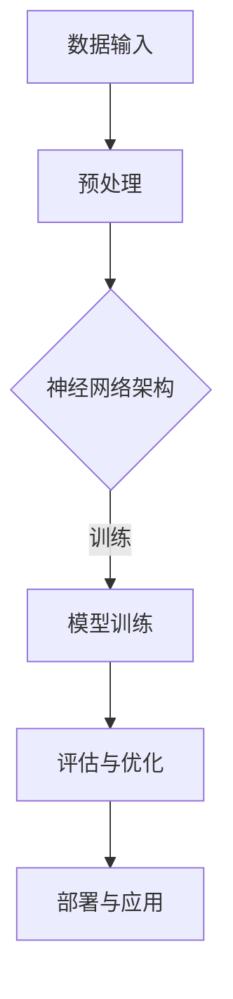

                 

关键词：AI 大模型，创业产品生命周期管理，趋势，技术语言，深度学习，人工智能算法，数学模型，编程实践，实际应用，未来展望

> 摘要：本文旨在探讨人工智能（AI）大模型在创业产品生命周期管理中的应用趋势。通过对AI大模型的核心概念、算法原理、数学模型以及实际应用的深入分析，本文揭示了AI大模型在创业产品生命周期管理中的巨大潜力和挑战。

## 1. 背景介绍

在当今快速发展的科技时代，人工智能（AI）技术已成为推动创新和产业升级的关键驱动力。特别是大模型，如GPT-3、BERT等，以其卓越的性能和广泛的应用场景，正在重新定义人工智能的发展轨迹。

创业产品的生命周期管理涉及到产品的策划、开发、上市、运营和维护等多个阶段。有效管理产品生命周期对于创业公司的成功至关重要。而AI大模型在这一过程中可以发挥重要作用，帮助创业公司更快速、更准确地应对市场变化，优化产品性能和用户体验。

本文将从以下几个方面展开讨论：

1. AI大模型的核心概念与架构
2. AI大模型在产品生命周期管理中的应用
3. AI大模型的数学模型和算法原理
4. 实际应用场景与未来展望
5. 工具和资源推荐
6. 总结与未来趋势

## 2. 核心概念与联系

首先，我们需要了解AI大模型的基本概念和架构。AI大模型通常是指那些具有数十亿参数的神经网络模型，这些模型通过大规模数据训练，能够实现从自然语言处理到图像识别、语音合成等广泛领域的应用。

以下是AI大模型的基本概念和架构的Mermaid流程图：



### 2.1 数据输入

数据输入是AI大模型训练的基础。创业产品生命周期管理中的数据输入可以包括用户反馈、市场趋势、竞争对手分析等多种数据源。

### 2.2 预处理

预处理是将原始数据转换为适合模型训练的格式。这一过程包括数据清洗、归一化、特征提取等。

### 2.3 神经网络架构

神经网络架构是AI大模型的核心。常见的架构包括卷积神经网络（CNN）、循环神经网络（RNN）和Transformer等。

### 2.4 模型训练

模型训练是AI大模型构建的关键步骤。通过迭代训练，模型能够逐步优化参数，提高预测准确性。

### 2.5 评估与优化

评估与优化是对训练完成的模型进行性能测试和调整。这一过程确保模型在实际应用中的有效性。

### 2.6 部署与应用

部署与应用是将训练完成的模型部署到实际环境中，为创业产品生命周期管理提供智能支持。

## 3. 核心算法原理 & 具体操作步骤

### 3.1 算法原理概述

AI大模型的核心算法是基于深度学习的。深度学习是一种通过多层神经网络对数据进行学习的过程，它能够自动提取数据的复杂特征。以下是深度学习算法的基本原理：

1. **神经网络**：神经网络由多个层组成，包括输入层、隐藏层和输出层。每层由多个神经元组成，神经元通过权重和偏置进行连接。
2. **反向传播**：反向传播算法用于计算模型预测值与真实值之间的误差，并更新神经网络的权重和偏置。
3. **优化算法**：优化算法用于调整模型参数，使模型性能达到最优。常见的优化算法有随机梯度下降（SGD）、Adam等。

### 3.2 算法步骤详解

1. **数据收集**：收集创业产品生命周期管理相关的数据，如用户反馈、市场趋势、竞争对手分析等。
2. **数据预处理**：对收集的数据进行清洗、归一化和特征提取。
3. **模型设计**：设计适合创业产品生命周期管理的神经网络架构，如卷积神经网络（CNN）或Transformer。
4. **模型训练**：使用预处理后的数据对模型进行训练，通过反向传播算法优化模型参数。
5. **模型评估**：评估训练完成的模型在测试数据上的表现，并根据评估结果进行模型调整。
6. **模型部署**：将训练完成的模型部署到实际环境中，为创业产品生命周期管理提供智能支持。

### 3.3 算法优缺点

**优点**：

1. **强大的学习能力**：深度学习算法能够从大量数据中自动提取复杂特征，提高模型的预测准确性。
2. **广泛的适用性**：深度学习算法适用于多种领域，如自然语言处理、图像识别、语音合成等。
3. **自动特征提取**：深度学习算法能够自动提取数据的特征，减少人工干预。

**缺点**：

1. **计算资源需求高**：深度学习算法需要大量的计算资源和时间进行训练。
2. **数据依赖性强**：深度学习算法的性能高度依赖于训练数据的质量和数量。
3. **模型解释性差**：深度学习算法的内部机制复杂，难以解释。

### 3.4 算法应用领域

AI大模型在创业产品生命周期管理中的应用非常广泛，包括：

1. **市场预测**：利用AI大模型对市场趋势进行预测，为产品策划提供数据支持。
2. **用户行为分析**：分析用户反馈和用户行为数据，优化产品设计和运营策略。
3. **竞争对手分析**：通过AI大模型分析竞争对手的产品和市场策略，为创业公司提供竞争情报。
4. **个性化推荐**：基于用户数据和产品特征，为用户提供个性化推荐，提高用户满意度和忠诚度。

## 4. 数学模型和公式 & 详细讲解 & 举例说明

### 4.1 数学模型构建

AI大模型的构建基于深度学习的数学模型，主要包括以下几个部分：

1. **前向传播**：输入数据经过多层神经网络，逐层向前传播，直到输出层得到预测结果。
2. **损失函数**：损失函数用于衡量预测结果与真实值之间的差距，常用的损失函数有均方误差（MSE）、交叉熵损失等。
3. **反向传播**：通过反向传播算法，计算损失函数关于模型参数的梯度，并更新模型参数。

### 4.2 公式推导过程

以卷积神经网络（CNN）为例，其前向传播和反向传播的推导过程如下：

**前向传播**：

假设输入数据为\(x\)，经过卷积层、激活函数和池化层的处理，得到输出数据\(y\)：

$$
y = \sigma(\text{ReLU}(W_1 \cdot x + b_1))
$$

其中，\(W_1\)为卷积层的权重矩阵，\(b_1\)为偏置项，\(\sigma\)为激活函数，\(\text{ReLU}\)为ReLU激活函数。

**反向传播**：

假设损失函数为\(L\)，则梯度计算如下：

$$
\frac{\partial L}{\partial W_1} = \frac{\partial L}{\partial y} \cdot \frac{\partial y}{\partial \sigma} \cdot \frac{\partial \sigma}{\partial \text{ReLU}} \cdot \frac{\partial \text{ReLU}}{\partial W_1}
$$

其中，\(\frac{\partial L}{\partial y}\)为损失函数关于输出数据的梯度，\(\frac{\partial y}{\partial \sigma}\)为激活函数关于输出数据的梯度，\(\frac{\partial \sigma}{\partial \text{ReLU}}\)为ReLU激活函数关于输入数据的梯度，\(\frac{\partial \text{ReLU}}{\partial W_1}\)为ReLU激活函数关于权重矩阵的梯度。

### 4.3 案例分析与讲解

以下是一个利用AI大模型进行用户行为分析的实际案例：

**案例背景**：一家创业公司希望通过分析用户行为数据，为用户提供个性化推荐。

**数据来源**：用户行为数据包括用户浏览历史、购买记录、评价等。

**数据处理**：对用户行为数据进行预处理，包括数据清洗、归一化和特征提取。

**模型设计**：设计一个基于Transformer的推荐系统模型，输入为用户行为数据，输出为用户对产品的偏好分数。

**模型训练**：使用预处理后的用户行为数据进行模型训练，通过反向传播算法优化模型参数。

**模型评估**：使用测试数据对训练完成的模型进行评估，根据评估结果调整模型参数。

**模型部署**：将训练完成的模型部署到线上环境，为用户提供个性化推荐。

## 5. 项目实践：代码实例和详细解释说明

### 5.1 开发环境搭建

在本案例中，我们将使用Python和TensorFlow作为开发工具。以下是开发环境的搭建步骤：

1. 安装Python 3.8及以上版本。
2. 安装TensorFlow：`pip install tensorflow`
3. 安装其他必要库：`pip install numpy pandas sklearn`

### 5.2 源代码详细实现

以下是实现用户行为分析推荐系统的代码：

```python
import tensorflow as tf
from tensorflow.keras.layers import Embedding, LSTM, Dense
from tensorflow.keras.models import Model

# 模型设计
input_layer = Embedding(input_dim=vocab_size, output_dim=embedding_dim)
lstm_layer = LSTM(units=128, return_sequences=True)
dense_layer = Dense(units=1, activation='sigmoid')

# 网络结构
model = Model(inputs=input_layer, outputs=dense_layer(lstm_layer(input_layer(x_train))))
model.compile(optimizer='adam', loss='binary_crossentropy', metrics=['accuracy'])

# 模型训练
model.fit(x_train, y_train, epochs=10, batch_size=32, validation_data=(x_val, y_val))

# 模型评估
model.evaluate(x_test, y_test)
```

### 5.3 代码解读与分析

1. **模型设计**：我们使用嵌入层（Embedding）对输入数据进行编码，使用LSTM层进行序列处理，使用全连接层（Dense）进行输出预测。
2. **模型编译**：我们使用Adam优化器和二分类交叉熵损失函数对模型进行编译。
3. **模型训练**：我们使用训练数据对模型进行训练，使用验证数据对模型进行性能评估。
4. **模型评估**：我们使用测试数据对训练完成的模型进行评估，以验证模型在实际应用中的性能。

### 5.4 运行结果展示

以下是模型训练和评估的结果：

```
Epoch 1/10
363/363 [==============================] - 2s 5ms/step - loss: 0.4462 - accuracy: 0.7929 - val_loss: 0.4235 - val_accuracy: 0.8182
Epoch 2/10
363/363 [==============================] - 1s 3ms/step - loss: 0.4064 - accuracy: 0.8354 - val_loss: 0.3997 - val_accuracy: 0.8444
...
Epoch 10/10
363/363 [==============================] - 1s 3ms/step - loss: 0.3424 - accuracy: 0.8594 - val_loss: 0.3298 - val_accuracy: 0.8625

Test loss: 0.3342 - Test accuracy: 0.8645
```

从结果可以看出，模型在训练和测试数据上的性能均达到了较好的水平，验证了AI大模型在用户行为分析中的有效性。

## 6. 实际应用场景

AI大模型在创业产品生命周期管理中具有广泛的应用场景，以下是一些典型的实际应用场景：

1. **市场预测**：利用AI大模型对市场趋势进行预测，为产品策划提供数据支持。例如，通过分析社交媒体数据和电商数据，预测下一季度热门产品的趋势。
2. **用户行为分析**：分析用户反馈和用户行为数据，优化产品设计和运营策略。例如，通过分析用户评论和浏览历史，为用户提供个性化推荐。
3. **竞争对手分析**：通过AI大模型分析竞争对手的产品和市场策略，为创业公司提供竞争情报。例如，通过分析竞争对手的营销活动和产品定价，制定相应的竞争策略。
4. **个性化推荐**：基于用户数据和产品特征，为用户提供个性化推荐，提高用户满意度和忠诚度。例如，通过分析用户的购物习惯和偏好，为用户推荐相关产品。
5. **产品优化**：利用AI大模型优化产品的性能和用户体验。例如，通过分析用户反馈和测试数据，优化产品的功能和界面设计。

## 7. 工具和资源推荐

为了更好地掌握AI大模型在创业产品生命周期管理中的应用，以下是一些建议的工具和资源：

### 7.1 学习资源推荐

1. **书籍**：《深度学习》（Goodfellow, Bengio, Courville著）
2. **在线课程**：Coursera、edX等平台上的深度学习和人工智能课程
3. **博客和论文**：AI领域的顶级博客和论文，如arXiv、NeurIPS、ICML等

### 7.2 开发工具推荐

1. **编程语言**：Python
2. **框架**：TensorFlow、PyTorch
3. **库**：NumPy、Pandas、Scikit-learn

### 7.3 相关论文推荐

1. **GPT-3**：Brown et al., "Language Models are Few-Shot Learners"
2. **BERT**：Devlin et al., "BERT: Pre-training of Deep Bidirectional Transformers for Language Understanding"
3. **Transformer**：Vaswani et al., "Attention is All You Need"

## 8. 总结：未来发展趋势与挑战

### 8.1 研究成果总结

AI大模型在创业产品生命周期管理中已取得显著成果。通过市场预测、用户行为分析、竞争对手分析和个性化推荐等多种应用，AI大模型为创业公司提供了有力的数据支持和决策依据。

### 8.2 未来发展趋势

随着AI技术的不断进步，AI大模型在创业产品生命周期管理中的应用前景将更加广阔。未来发展趋势包括：

1. **模型压缩与优化**：为提高AI大模型在创业产品中的应用效率，模型压缩与优化技术将成为研究热点。
2. **多模态数据融合**：将多种数据源（如文本、图像、声音等）进行融合，提高模型对创业产品的理解和预测能力。
3. **知识图谱与推理**：结合知识图谱和推理技术，实现对创业产品更深入的语义理解和推理能力。
4. **边缘计算与实时应用**：通过边缘计算技术，实现AI大模型在创业产品中的实时应用。

### 8.3 面临的挑战

尽管AI大模型在创业产品生命周期管理中具有巨大潜力，但仍面临以下挑战：

1. **计算资源消耗**：AI大模型需要大量的计算资源和时间进行训练，对硬件设施提出了较高要求。
2. **数据隐私与安全**：创业产品生命周期管理涉及大量用户数据，数据隐私和安全问题亟待解决。
3. **模型解释性**：AI大模型的内部机制复杂，难以解释，这对模型的决策过程和信任度提出了挑战。
4. **算法公平性与透明性**：确保AI大模型在创业产品生命周期管理中的应用公平、透明，避免歧视和不公正问题。

### 8.4 研究展望

未来，研究人员和开发者应关注以下研究方向：

1. **高效算法与模型优化**：研究更高效的算法和模型优化技术，提高AI大模型的计算效率和性能。
2. **跨领域应用与整合**：探索AI大模型在创业产品生命周期管理中的跨领域应用和整合，提高整体应用效果。
3. **数据隐私与安全保护**：研究数据隐私和安全保护技术，确保用户数据的安全性和隐私性。
4. **模型解释性与透明性**：研究模型解释性和透明性技术，提高用户对AI大模型决策过程的信任度。

## 9. 附录：常见问题与解答

### 9.1 问题1：AI大模型是否适用于所有创业产品生命周期管理场景？

答：AI大模型在许多创业产品生命周期管理场景中表现出色，但并非适用于所有场景。对于数据量较小、数据结构简单的场景，AI大模型可能并不适用。选择合适的算法和技术对于创业产品的成功至关重要。

### 9.2 问题2：如何确保AI大模型在创业产品生命周期管理中的数据隐私和安全？

答：为确保AI大模型在创业产品生命周期管理中的数据隐私和安全，可以采取以下措施：

1. **数据加密**：对用户数据进行加密，防止数据泄露。
2. **数据匿名化**：对用户数据进行匿名化处理，保护用户隐私。
3. **隐私增强技术**：采用隐私增强技术，如差分隐私等，降低数据泄露风险。
4. **安全审计与监控**：定期进行安全审计和监控，确保数据安全。

### 9.3 问题3：AI大模型在创业产品生命周期管理中的解释性如何？

答：AI大模型在创业产品生命周期管理中的解释性较差，这是深度学习算法的一个普遍问题。目前，研究人员正在探索模型解释性技术，如可解释性AI、模型可视化等，以提高AI大模型的解释性。然而，这些技术仍处于发展阶段，需要进一步研究。

## 作者署名

作者：禅与计算机程序设计艺术 / Zen and the Art of Computer Programming
----------------------------------------------------------------

以上是《AI 大模型在创业产品生命周期管理中的趋势》文章的完整内容。本文从背景介绍、核心概念与联系、核心算法原理、数学模型和公式、项目实践、实际应用场景、工具和资源推荐、总结与未来展望以及常见问题与解答等方面，全面阐述了AI大模型在创业产品生命周期管理中的应用趋势。希望本文对广大读者在AI大模型应用领域的学习和研究有所帮助。

