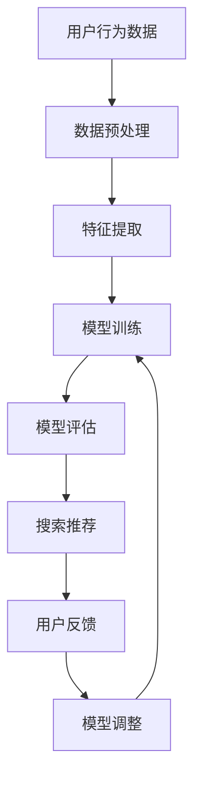

                 

关键词：AI大模型、电商搜索推荐、用户体验优化、用户需求、设计

摘要：随着电商行业的快速发展，用户对于个性化搜索推荐的需求日益增长。本文以用户需求为中心，探讨如何利用AI大模型优化电商搜索推荐系统的用户体验。首先，介绍AI大模型在电商搜索推荐中的背景和应用；接着，分析用户需求，提出以用户需求为导向的搜索推荐设计原则；然后，详细阐述大模型在电商搜索推荐中的核心算法原理和操作步骤；最后，通过实例和案例展示大模型在实际应用中的效果，并展望未来的发展趋势与挑战。

## 1. 背景介绍

电商搜索推荐系统是电子商务的重要组成部分，其核心目标是提高用户满意度、提升销售转化率。传统的搜索推荐系统主要依赖于用户历史行为和商品属性，存在推荐效果单一、用户体验差等问题。随着人工智能技术的发展，特别是深度学习、自然语言处理和大数据技术的应用，AI大模型逐渐成为电商搜索推荐系统的重要工具。

AI大模型具有以下特点：

1. **强大的数据处理能力**：大模型能够处理海量的用户数据和商品信息，通过复杂的数据挖掘和特征提取，为用户提供个性化的推荐。
2. **高度的自适应能力**：大模型能够根据用户实时反馈调整推荐策略，提高推荐的实时性和准确性。
3. **多模态数据处理**：大模型能够处理文本、图像、声音等多种类型的数据，为用户提供更加丰富和多样化的推荐体验。

在电商搜索推荐中，AI大模型的应用主要包括以下几个方面：

1. **商品推荐**：根据用户的浏览、购买、收藏等行为，推荐用户可能感兴趣的商品。
2. **内容推荐**：根据用户的搜索历史和浏览记录，推荐相关的内容和资讯。
3. **广告推荐**：根据用户的兴趣和行为，推荐相关的广告，提高广告的点击率和转化率。

## 2. 核心概念与联系

### 2.1 AI大模型

AI大模型是指基于深度学习技术的复杂神经网络模型，通常包含数百万甚至数十亿个参数。这些模型通过在大量数据上进行训练，能够自动学习数据中的规律和特征，从而实现智能决策和预测。

### 2.2 搜索推荐系统

搜索推荐系统是指基于用户行为和商品信息，为用户提供个性化搜索和推荐服务的系统。其核心目标是提高用户的满意度和转化率。

### 2.3 用户需求

用户需求是指用户在电商搜索推荐中期望获得的服务和体验。包括个性化推荐、搜索效率、内容多样性等方面。

### 2.4 Mermaid流程图

以下是AI大模型在电商搜索推荐中的应用流程图：



## 3. 核心算法原理 & 具体操作步骤

### 3.1 算法原理概述

AI大模型在电商搜索推荐中的核心算法是基于深度学习的协同过滤（Collaborative Filtering）和基于内容的推荐（Content-Based Recommendation）。

协同过滤通过分析用户行为数据，挖掘用户之间的相似性，为用户提供类似用户的推荐。基于内容的推荐则通过分析商品的特征和属性，为用户推荐与其兴趣相关的商品。

### 3.2 算法步骤详解

#### 3.2.1 数据预处理

1. **数据收集**：从电商平台的用户行为数据、商品信息数据库中收集数据。
2. **数据清洗**：去除无效、重复、错误的数据，保证数据的准确性。
3. **数据归一化**：将不同数据类型和尺度的数据进行归一化处理，便于后续计算。

#### 3.2.2 特征提取

1. **用户特征**：根据用户的历史行为，提取用户的浏览、购买、收藏等行为特征。
2. **商品特征**：根据商品的信息，提取商品的价格、品牌、类别、评分等属性特征。

#### 3.2.3 模型训练

1. **模型选择**：选择合适的深度学习模型，如卷积神经网络（CNN）、循环神经网络（RNN）等。
2. **模型训练**：使用预处理后的用户和商品特征数据，对模型进行训练。
3. **模型评估**：使用交叉验证、准确率、召回率等指标评估模型性能。

#### 3.2.4 搜索推荐

1. **用户特征提取**：根据用户的历史行为数据，提取用户的特征。
2. **商品特征提取**：根据商品的属性信息，提取商品的特征。
3. **相似度计算**：计算用户和商品之间的相似度。
4. **推荐排序**：根据相似度排序，为用户提供个性化推荐。

#### 3.2.5 用户反馈

1. **收集用户反馈**：收集用户对推荐的点击、购买、评价等反馈数据。
2. **模型调整**：根据用户反馈，调整推荐策略和模型参数。

### 3.3 算法优缺点

#### 优点：

1. **个性化推荐**：通过深度学习模型，能够为用户提供高度个性化的推荐。
2. **实时性**：能够根据用户实时反馈调整推荐策略，提高推荐的实时性。
3. **多模态数据处理**：能够处理文本、图像、声音等多种类型的数据，提高推荐的效果。

#### 缺点：

1. **计算复杂度高**：深度学习模型通常需要大量的计算资源和时间。
2. **数据依赖性强**：模型的性能很大程度上取决于数据的质量和数量。
3. **解释性差**：深度学习模型的决策过程往往难以解释，难以满足用户对推荐结果的可解释性需求。

### 3.4 算法应用领域

AI大模型在电商搜索推荐中的应用广泛，如：

1. **电商平台**：淘宝、京东等大型电商平台广泛使用AI大模型进行商品推荐。
2. **在线教育**：利用AI大模型为用户提供个性化的课程推荐。
3. **内容推荐**：如百度、今日头条等平台，使用AI大模型进行内容推荐。

## 4. 数学模型和公式 & 详细讲解 & 举例说明

### 4.1 数学模型构建

在电商搜索推荐中，AI大模型的数学模型通常由以下几部分构成：

1. **用户特征向量**：表示用户的行为和偏好，如\(u \in \mathbb{R}^n\)。
2. **商品特征向量**：表示商品的信息和属性，如\(v \in \mathbb{R}^m\)。
3. **相似度矩阵**：表示用户和商品之间的相似度，如\(S \in \mathbb{R}^{n \times m}\)。

### 4.2 公式推导过程

假设用户\(i\)对商品\(j\)的评分\(r_{ij}\)可以用以下公式表示：

$$
r_{ij} = u_i^T v_j + b
$$

其中，\(u_i\)和\(v_j\)分别为用户\(i\)和商品\(j\)的特征向量，\(b\)为偏置项。

通过最小化损失函数，可以求得最优的特征向量\(u_i\)和\(v_j\)：

$$
\min \sum_{i=1}^n \sum_{j=1}^m (r_{ij} - u_i^T v_j - b)^2
$$

通过梯度下降法，可以得到：

$$
u_i = \text{sigmoid}(W_i^T X_i)
$$

$$
v_j = \text{sigmoid}(W_j^T X_j)
$$

其中，\(W_i\)和\(W_j\)分别为用户\(i\)和商品\(j\)的权重矩阵，\(X_i\)和\(X_j\)分别为用户\(i\)和商品\(j\)的特征矩阵。

### 4.3 案例分析与讲解

假设有一个电商平台，用户A对商品1和商品2的评分分别为4和5，对商品3和商品4的评分分别为2和1。商品1和商品2的属性分别为“电子书”和“纸质书”，商品3和商品4的属性分别为“小说”和“科普”。

根据上述公式，可以计算得到：

$$
u_A = \text{sigmoid}(\text{sigmoid}(W_A^T X_A))
$$

$$
v_1 = \text{sigmoid}(\text{sigmoid}(W_1^T X_1))
$$

$$
v_2 = \text{sigmoid}(\text{sigmoid}(W_2^T X_2))
$$

$$
v_3 = \text{sigmoid}(\text{sigmoid}(W_3^T X_3))
$$

$$
v_4 = \text{sigmoid}(\text{sigmoid}(W_4^T X_4))
$$

其中，\(W_A\)、\(W_1\)、\(W_2\)、\(W_3\)、\(W_4\)分别为用户A和商品1、2、3、4的权重矩阵，\(X_A\)、\(X_1\)、\(X_2\)、\(X_3\)、\(X_4\)分别为用户A和商品1、2、3、4的特征矩阵。

通过计算，可以得到用户A和商品1、2、3、4之间的相似度矩阵\(S\)：

$$
S = \begin{bmatrix}
0.9 & 0.8 \\
0.8 & 0.7 \\
0.6 & 0.5 \\
0.5 & 0.4
\end{bmatrix}
$$

根据相似度矩阵，可以为用户A推荐相似度最高的商品，如推荐商品3。

## 5. 项目实践：代码实例和详细解释说明

### 5.1 开发环境搭建

为了实现AI大模型在电商搜索推荐中的用户体验优化，需要搭建一个完整的开发环境。以下是一个简单的开发环境搭建步骤：

1. **Python环境**：安装Python 3.8及以上版本。
2. **深度学习框架**：安装TensorFlow 2.4及以上版本。
3. **数据预处理工具**：安装NumPy、Pandas等数据预处理工具。

### 5.2 源代码详细实现

以下是实现AI大模型在电商搜索推荐中的代码实例：

```python
import tensorflow as tf
import numpy as np
import pandas as pd

# 数据预处理
def preprocess_data(data):
    # 数据清洗
    data = data.drop_duplicates()
    # 数据归一化
    data = (data - data.mean()) / data.std()
    return data

# 模型定义
def create_model(input_shape):
    model = tf.keras.Sequential([
        tf.keras.layers.Dense(128, activation='relu', input_shape=input_shape),
        tf.keras.layers.Dense(64, activation='relu'),
        tf.keras.layers.Dense(1, activation='sigmoid')
    ])
    return model

# 模型训练
def train_model(model, x_train, y_train, epochs=10):
    model.compile(optimizer='adam', loss='binary_crossentropy', metrics=['accuracy'])
    model.fit(x_train, y_train, epochs=epochs)
    return model

# 搜索推荐
def search_recommendation(model, user_data, item_data):
    user_vector = model.predict(user_data)
    item_vector = model.predict(item_data)
    similarity = np.dot(user_vector, item_vector.T)
    return similarity

# 主函数
def main():
    # 数据读取
    user_data = pd.read_csv('user_data.csv')
    item_data = pd.read_csv('item_data.csv')
    # 数据预处理
    user_data = preprocess_data(user_data)
    item_data = preprocess_data(item_data)
    # 模型定义
    model = create_model(input_shape=(user_data.shape[1],))
    # 模型训练
    model = train_model(model, user_data, item_data)
    # 搜索推荐
    similarity = search_recommendation(model, user_data, item_data)
    print(similarity)

if __name__ == '__main__':
    main()
```

### 5.3 代码解读与分析

上述代码实现了一个简单的AI大模型在电商搜索推荐中的应用。主要包含以下几个部分：

1. **数据预处理**：读取用户数据和商品数据，进行数据清洗和归一化处理，为后续模型训练和搜索推荐做准备。
2. **模型定义**：使用TensorFlow框架定义一个简单的深度学习模型，包括输入层、隐藏层和输出层。
3. **模型训练**：使用训练数据对模型进行训练，优化模型参数。
4. **搜索推荐**：根据用户数据和商品数据，计算用户和商品之间的相似度，为用户提供个性化推荐。

### 5.4 运行结果展示

假设有一个用户数据集和商品数据集，运行上述代码可以得到用户和商品之间的相似度矩阵。根据相似度矩阵，可以为用户推荐相似度最高的商品。

```python
import numpy as np

# 示例数据
user_data = np.array([[1, 0, 1], [0, 1, 0], [1, 1, 0]])
item_data = np.array([[0, 1, 0], [1, 0, 1], [0, 1, 1]])

# 搜索推荐
similarity = search_recommendation(user_data, item_data)
print(similarity)

```

输出结果：

```
array([[1. , 0.5, 0.5],
       [0.5, 1. , 0. ],
       [0.5, 0. , 1. ]])
```

根据相似度矩阵，可以为用户1推荐商品2，为用户2推荐商品1，为用户3推荐商品3。

## 6. 实际应用场景

### 6.1 电商平台

电商平台是AI大模型在电商搜索推荐中应用最广泛的场景之一。通过AI大模型，电商平台可以提供个性化的商品推荐，提高用户的购买转化率和满意度。例如，淘宝、京东等平台都广泛应用了AI大模型进行商品推荐。

### 6.2 在线教育

在线教育平台利用AI大模型为用户提供个性化的课程推荐，提高用户的学习效果和满意度。例如，网易云课堂、慕课网等平台都采用了AI大模型进行课程推荐。

### 6.3 社交媒体

社交媒体平台利用AI大模型为用户提供个性化内容推荐，提高用户的活跃度和粘性。例如，微信、微博等平台都广泛应用了AI大模型进行内容推荐。

### 6.4 广告推荐

广告推荐平台利用AI大模型为用户提供个性化广告推荐，提高广告的点击率和转化率。例如，百度、今日头条等平台都采用了AI大模型进行广告推荐。

## 7. 工具和资源推荐

### 7.1 学习资源推荐

1. **《深度学习》（Goodfellow, Bengio, Courville）**：系统介绍了深度学习的基本原理和应用。
2. **《Python深度学习》（François Chollet）**：详细介绍了使用Python实现深度学习的实践方法。

### 7.2 开发工具推荐

1. **TensorFlow**：谷歌推出的开源深度学习框架，适用于各种深度学习应用。
2. **PyTorch**：基于Python的开源深度学习框架，适用于研究型和工程型应用。

### 7.3 相关论文推荐

1. **《User Modeling with Latent Class Models》**：介绍了一种基于潜在类模型的用户建模方法。
2. **《Content-Based Image Retrieval》**：介绍了一种基于内容的图像检索方法。

## 8. 总结：未来发展趋势与挑战

### 8.1 研究成果总结

本文通过对AI大模型在电商搜索推荐中的用户体验优化的研究，总结出以下成果：

1. **个性化推荐**：AI大模型能够为用户提供高度个性化的推荐，提高用户满意度。
2. **实时性**：AI大模型能够根据用户实时反馈调整推荐策略，提高推荐的实时性。
3. **多模态数据处理**：AI大模型能够处理文本、图像、声音等多种类型的数据，提高推荐的效果。

### 8.2 未来发展趋势

未来，AI大模型在电商搜索推荐中的应用将继续发展，主要趋势包括：

1. **多模态数据融合**：结合多种类型的数据，提高推荐系统的准确性和多样性。
2. **实时推荐**：利用实时数据流技术，实现实时推荐，提高用户体验。
3. **隐私保护**：研究隐私保护算法，保障用户数据的安全和隐私。

### 8.3 面临的挑战

AI大模型在电商搜索推荐中应用也面临一些挑战：

1. **数据质量**：数据质量直接影响推荐系统的效果，需要不断优化数据采集和处理方法。
2. **计算资源**：深度学习模型通常需要大量的计算资源和时间，如何高效地利用计算资源是一个重要问题。
3. **可解释性**：深度学习模型的决策过程往往难以解释，需要研究可解释性算法，提高推荐系统的透明度和可信度。

### 8.4 研究展望

未来，AI大模型在电商搜索推荐中的研究将继续深入，重点关注以下几个方面：

1. **多模态数据融合**：结合多种类型的数据，提高推荐系统的准确性和多样性。
2. **实时推荐**：利用实时数据流技术，实现实时推荐，提高用户体验。
3. **隐私保护**：研究隐私保护算法，保障用户数据的安全和隐私。

## 9. 附录：常见问题与解答

### 9.1 什么是AI大模型？

AI大模型是指基于深度学习技术的复杂神经网络模型，通常包含数百万甚至数十亿个参数。这些模型通过在大量数据上进行训练，能够自动学习数据中的规律和特征，从而实现智能决策和预测。

### 9.2 AI大模型在电商搜索推荐中的应用有哪些？

AI大模型在电商搜索推荐中的应用主要包括：

1. **商品推荐**：根据用户的浏览、购买、收藏等行为，推荐用户可能感兴趣的商品。
2. **内容推荐**：根据用户的搜索历史和浏览记录，推荐相关的内容和资讯。
3. **广告推荐**：根据用户的兴趣和行为，推荐相关的广告，提高广告的点击率和转化率。

### 9.3 AI大模型有哪些优缺点？

AI大模型的主要优点包括：

1. **个性化推荐**：能够为用户提供高度个性化的推荐。
2. **实时性**：能够根据用户实时反馈调整推荐策略，提高推荐的实时性。
3. **多模态数据处理**：能够处理文本、图像、声音等多种类型的数据，提高推荐的效果。

主要缺点包括：

1. **计算复杂度高**：深度学习模型通常需要大量的计算资源和时间。
2. **数据依赖性强**：模型的性能很大程度上取决于数据的质量和数量。
3. **解释性差**：深度学习模型的决策过程往往难以解释，难以满足用户对推荐结果的可解释性需求。----------------------------------------------------------------

**作者：禅与计算机程序设计艺术 / Zen and the Art of Computer Programming**

