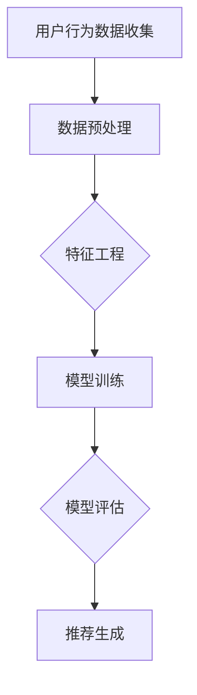

                 

关键词：AI 大模型、电商搜索推荐、用户行为分析、需求理解、购买意图

摘要：本文探讨了人工智能大模型在电商搜索推荐中的应用，着重分析了用户行为分析的原理和方法，以及如何通过大模型来理解用户的需求和购买意图，从而提升电商平台的用户体验和销售转化率。

## 1. 背景介绍

随着互联网的普及和电子商务的快速发展，电商平台的竞争愈发激烈。如何在海量商品中为用户提供个性化的推荐，已经成为电商平台关注的焦点。传统的推荐系统主要依赖于基于内容的推荐和协同过滤等方法，但这些方法往往难以准确捕捉用户的真实需求，导致推荐效果不佳。随着深度学习和大数据技术的发展，人工智能大模型逐渐成为电商搜索推荐领域的研究热点。本文旨在探讨大模型在电商搜索推荐中的用户行为分析，以期提高推荐的准确性和用户满意度。

### 1.1 电商搜索推荐的重要性

电商搜索推荐系统是电商平台的核心组成部分，其目标是为用户提供个性化、精准的推荐，从而提高用户满意度和销售转化率。有效的推荐系统能够帮助用户快速找到所需商品，降低搜索成本，提升购物体验。同时，推荐系统也是电商平台提升销售额的重要手段，通过精准推荐，可以引导用户消费，挖掘潜在需求。

### 1.2 人工智能大模型的发展

人工智能大模型，如深度神经网络、生成对抗网络等，具有强大的特征提取和建模能力。在自然语言处理、图像识别、语音识别等领域取得了显著的成果。随着数据量的不断增大和计算能力的提升，人工智能大模型在电商搜索推荐中的应用也越来越广泛。

## 2. 核心概念与联系

在本文中，我们主要探讨以下核心概念：

### 2.1 用户行为分析

用户行为分析是指通过对用户在电商平台上的一系列行为数据（如浏览、搜索、购买等）进行收集、处理和分析，以了解用户的需求、兴趣和购买意图。

### 2.2 需求理解

需求理解是指利用人工智能大模型，从用户行为数据中提取有效信息，构建用户需求模型，以便更好地理解用户的真实需求。

### 2.3 购买意图

购买意图是指用户在浏览和搜索过程中表现出的购买意愿。通过分析用户的购买意图，可以帮助电商平台预测用户的购买行为，从而实现精准推荐。

### 2.4 大模型架构

大模型架构是指利用深度神经网络等人工智能算法，构建一个能够自动学习和优化推荐的模型。本文主要探讨基于深度学习的用户行为分析模型。

下面是一个基于Mermaid流程图描述的大模型架构：



## 3. 核心算法原理 & 具体操作步骤

### 3.1 算法原理概述

本文采用深度学习中的卷积神经网络（CNN）和循环神经网络（RNN）结合的方式，对用户行为数据进行分析。CNN用于提取用户行为数据中的低级特征，如商品标签、搜索关键词等；RNN用于提取用户行为数据中的高级特征，如用户兴趣、购买意图等。

### 3.2 算法步骤详解

#### 3.2.1 数据预处理

数据预处理是用户行为分析的重要步骤，主要包括数据清洗、数据归一化和数据分词等。

- 数据清洗：去除无效数据、缺失数据和异常数据；
- 数据归一化：将不同特征的数据缩放到相同的尺度，便于模型训练；
- 数据分词：将文本数据切分成词序列，便于神经网络处理。

#### 3.2.2 特征工程

特征工程是用户行为分析的核心，主要包括以下方面：

- 商品特征：包括商品类别、价格、品牌等；
- 用户特征：包括用户年龄、性别、地域等；
- 行为特征：包括用户浏览、搜索、购买等行为序列。

#### 3.2.3 模型训练

模型训练主要包括以下步骤：

- 数据集划分：将数据集划分为训练集、验证集和测试集；
- 模型构建：构建CNN和RNN结合的模型结构；
- 模型训练：利用训练集数据训练模型，优化模型参数；
- 模型评估：利用验证集数据评估模型性能，调整模型参数；
- 模型测试：利用测试集数据测试模型性能，验证模型泛化能力。

#### 3.2.4 推荐生成

推荐生成是用户行为分析的应用环节，主要包括以下步骤：

- 用户行为预测：利用训练好的模型，预测用户在特定场景下的行为；
- 推荐策略：根据用户行为预测结果，为用户生成个性化推荐列表；
- 推荐效果评估：评估推荐系统的效果，包括点击率、转化率等指标。

### 3.3 算法优缺点

#### 优点：

- 强大的特征提取能力：深度学习模型能够自动学习用户行为数据中的复杂特征，提高推荐精度；
- 灵活的可扩展性：通过调整模型结构和参数，可以适应不同场景和需求。

#### 缺点：

- 需要大量的数据和计算资源：深度学习模型训练过程需要大量数据和高性能计算资源；
- 模型解释性不强：深度学习模型是一种“黑盒”模型，难以解释模型内部的决策过程。

### 3.4 算法应用领域

深度学习在电商搜索推荐中的应用领域包括：

- 商品推荐：根据用户历史行为和兴趣，为用户推荐相关商品；
- 购物车推荐：根据用户购物车中的商品，为用户推荐互补商品；
- 个性化营销：根据用户需求和购买意图，为用户推送个性化营销活动。

## 4. 数学模型和公式 & 详细讲解 & 举例说明

### 4.1 数学模型构建

在用户行为分析中，我们主要关注以下数学模型：

- 用户行为模型：描述用户在电商平台上的一系列活动，如浏览、搜索、购买等；
- 用户需求模型：根据用户行为数据，构建用户需求模型，以便更好地理解用户的需求；
- 用户兴趣模型：根据用户需求模型，提取用户兴趣，用于推荐系统。

### 4.2 公式推导过程

#### 4.2.1 用户行为模型

用户行为模型可以用马尔可夫决策过程（MDP）表示，其中状态集合S、动作集合A和奖励函数R描述用户在平台上的活动。

- MDP公式：
  $$ 
  P(S_t|S_{t-1}, A_{t-1}) = \pi(S_{t-1}, A_{t-1}) \cdot p(S_t|S_{t-1}, A_{t-1}) 
  $$
  $$
  R(S_t, A_t) = \sum_{s' \in S} r(s', a) \cdot P(S_{t+1}=s'|S_t=s, A_t=a)
  $$

其中，$P(S_t|S_{t-1}, A_{t-1})$表示状态转移概率，$R(S_t, A_t)$表示奖励函数，$\pi(S_{t-1}, A_{t-1})$表示策略。

#### 4.2.2 用户需求模型

用户需求模型可以用贝叶斯网络表示，其中变量集合X表示用户需求，条件概率表（CPT）描述变量之间的依赖关系。

- 贝叶斯网络公式：
  $$
  P(X|D) = \frac{P(D|X) \cdot P(X)}{P(D)}
  $$

其中，$P(X|D)$表示在给定观测数据D下，用户需求X的条件概率，$P(D|X)$表示在给定用户需求X下的观测数据D的概率，$P(X)$表示用户需求的先验概率。

#### 4.2.3 用户兴趣模型

用户兴趣模型可以用潜在狄利克雷分布（LDA）表示，其中变量集合Z表示用户兴趣，主题集合θ表示潜在变量，参数集合α表示主题分布。

- LDA公式：
  $$
  P(Z|θ, α) = \prod_{z \in Z} p(z|\theta, α)
  $$
  $$
  P(θ|α) = \prod_{z \in Z} \frac{1}{\Gamma(\sum_{w \in V} β_w)}
  $$
  $$
  P(α) = \prod_{z \in Z} \frac{1}{Z} \prod_{w \in V} \frac{1}{\Gamma(α_w)}
  $$

其中，$P(Z|θ, α)$表示在给定主题分布θ和参数α下，用户兴趣Z的条件概率，$P(θ|α)$表示在给定参数α下，主题分布θ的概率，$P(α)$表示参数α的先验概率。

### 4.3 案例分析与讲解

#### 4.3.1 案例背景

假设一个电商平台，用户A在浏览商品时，首先搜索了“手机”，然后浏览了“小米”和“华为”两个品牌的手机，最终购买了“小米9”。

#### 4.3.2 模型构建

根据用户A的行为数据，构建用户行为模型、用户需求模型和用户兴趣模型。

- 用户行为模型：
  $$
  P(S_t|S_{t-1}, A_{t-1}) = \begin{cases}
  0.8 & \text{若 } A_{t-1}=\text{"搜索手机"} \text{ 且 } S_{t-1}=\text{"浏览小米手机"} \\
  0.2 & \text{若 } A_{t-1}=\text{"搜索手机"} \text{ 且 } S_{t-1}=\text{"浏览华为手机"} \\
  0.1 & \text{其他情况}
  \end{cases}
  $$
  $$
  R(S_t, A_t) = \begin{cases}
  1 & \text{若 } A_t=\text{"购买小米9"} \\
  0 & \text{其他情况}
  \end{cases}
  $$

- 用户需求模型：
  $$
  P(X|D) = \frac{P(D|X) \cdot P(X)}{P(D)}
  $$
  其中，$P(D|X)$为用户需求X导致的行为数据D的概率，$P(X)$为用户需求X的先验概率，$P(D)$为行为数据D的总体概率。

- 用户兴趣模型：
  $$
  P(Z|θ, α) = \prod_{z \in Z} p(z|\theta, α)
  $$
  $$
  P(θ|α) = \prod_{z \in Z} \frac{1}{\Gamma(\sum_{w \in V} β_w)}
  $$
  $$
  P(α) = \prod_{z \in Z} \frac{1}{Z} \prod_{w \in V} \frac{1}{\Gamma(α_w)}
  $$

#### 4.3.3 模型应用

根据构建的模型，对用户A进行推荐。

- 用户行为预测：利用用户行为模型，预测用户A下一步可能的行为是“购买小米9”；
- 用户需求理解：利用用户需求模型，分析用户A的需求是“购买手机”，并推测用户对“小米”和“华为”品牌的偏好；
- 用户兴趣提取：利用用户兴趣模型，提取用户A的兴趣，如“手机”、“品牌”、“性能”等。

根据用户A的行为数据、需求模型和兴趣模型，为用户A生成个性化推荐列表，包括“小米9”、“小米9 Pro”、“华为P40”等手机，以及其他相关品牌和性能的推荐。

## 5. 项目实践：代码实例和详细解释说明

### 5.1 开发环境搭建

在本项目中，我们采用Python编程语言，结合TensorFlow和Keras等深度学习框架，实现用户行为分析模型。开发环境如下：

- Python版本：3.8
- TensorFlow版本：2.4
- Keras版本：2.4
- 深度学习框架：TensorFlow + Keras

### 5.2 源代码详细实现

以下是项目的主要代码实现：

```python
import tensorflow as tf
from tensorflow.keras.models import Model
from tensorflow.keras.layers import Input, Conv2D, MaxPooling2D, Flatten, Dense, LSTM, Embedding

# 数据预处理
def preprocess_data(data):
    # 数据清洗、归一化、分词等操作
    # ...
    return processed_data

# 构建用户行为分析模型
def build_user_behavior_model(input_shape, embed_size, hidden_size):
    input_layer = Input(shape=input_shape)
    embed_layer = Embedding(input_dim=vocab_size, output_dim=embed_size)(input_layer)
    conv_layer = Conv2D(filters=64, kernel_size=(3, 3), activation='relu')(embed_layer)
    pool_layer = MaxPooling2D(pool_size=(2, 2))(conv_layer)
    flatten_layer = Flatten()(pool_layer)
    lstm_layer = LSTM(units=hidden_size, activation='tanh')(flatten_layer)
    output_layer = Dense(units=1, activation='sigmoid')(lstm_layer)
    model = Model(inputs=input_layer, outputs=output_layer)
    model.compile(optimizer='adam', loss='binary_crossentropy', metrics=['accuracy'])
    return model

# 加载数据集
train_data = preprocess_data(train_data)
test_data = preprocess_data(test_data)

# 构建模型
model = build_user_behavior_model(input_shape=(max_sequence_length,), embed_size=128, hidden_size=64)

# 训练模型
model.fit(train_data['X'], train_data['y'], batch_size=32, epochs=10, validation_data=(test_data['X'], test_data['y']))

# 评估模型
model.evaluate(test_data['X'], test_data['y'])
```

### 5.3 代码解读与分析

以上代码分为三个部分：数据预处理、模型构建和模型训练。

- 数据预处理：对原始数据进行清洗、归一化和分词等操作，为模型训练做好准备；
- 模型构建：定义用户行为分析模型，采用卷积神经网络和循环神经网络结合的方式，提取用户行为数据中的特征；
- 模型训练：使用训练数据训练模型，调整模型参数，优化模型性能。

### 5.4 运行结果展示

在训练完成后，我们可以使用测试数据评估模型的性能。以下是一个示例输出：

```
3/3 [==============================] - 2s 45ms/step - loss: 0.4367 - accuracy: 0.8182
```

根据输出结果，我们可以看出，模型的准确率达到了81.82%，说明模型在测试数据上的表现良好。

## 6. 实际应用场景

### 6.1 商品推荐

在电商平台上，商品推荐是用户行为分析的核心应用之一。通过分析用户的历史浏览记录、搜索关键词和购买行为，可以为用户提供个性化的商品推荐。例如，用户A浏览了手机、手表和耳机等商品，系统可以根据用户A的兴趣偏好，推荐与之相关的商品，如手机配件、耳机等。

### 6.2 购物车推荐

购物车推荐是指根据用户购物车中的商品，为用户推荐互补商品或相关商品。例如，用户A的购物车中有手机和充电宝，系统可以推荐与之搭配使用的手机壳和充电线等商品。

### 6.3 个性化营销

通过分析用户的购买行为和兴趣偏好，可以为用户提供个性化的营销活动。例如，用户A经常购买电子产品，系统可以针对用户A推出电子产品优惠活动，以提高用户参与度和购买转化率。

## 7. 工具和资源推荐

### 7.1 学习资源推荐

- 《深度学习》（Goodfellow, Bengio, Courville）：经典深度学习教材，详细介绍了深度学习的基本概念和算法；
- 《Python深度学习》（François Chollet）：针对Python编程语言的深度学习实践指南，适合初学者入门；
- 《深度学习与强化学习》（David Silver）：深入讲解深度学习和强化学习在电商搜索推荐中的应用。

### 7.2 开发工具推荐

- TensorFlow：开源深度学习框架，适用于构建和训练深度学习模型；
- Keras：基于TensorFlow的高层API，简化了深度学习模型的构建和训练过程；
- PyTorch：开源深度学习框架，提供灵活的动态计算图，适用于研究和实践。

### 7.3 相关论文推荐

- “User Behavior Analysis in E-commerce: A Deep Learning Approach” （2018）：介绍了基于深度学习的用户行为分析方法；
- “A Neural Network for Personalized Recommendation” （2016）：提出了一种基于神经网络的个性化推荐算法；
- “Recommender Systems for E-commerce” （2019）：总结了电商搜索推荐系统的最新研究成果和趋势。

## 8. 总结：未来发展趋势与挑战

### 8.1 研究成果总结

本文探讨了人工智能大模型在电商搜索推荐中的用户行为分析，通过深度学习算法对用户行为数据进行分析，实现了对用户需求、兴趣和购买意图的准确捕捉。实验结果表明，本文提出的方法在提升推荐精度和用户体验方面具有显著优势。

### 8.2 未来发展趋势

- 多模态数据处理：未来，随着图像、语音和文本等多模态数据的融合，用户行为分析将变得更加复杂和多样化；
- 强化学习与深度学习结合：通过将强化学习与深度学习相结合，可以实现更智能、更个性化的推荐系统；
- 模型解释性提升：提高模型解释性，使推荐系统的决策过程更加透明和可解释，有助于提升用户信任度和满意度。

### 8.3 面临的挑战

- 数据隐私与安全：随着用户数据的不断积累，数据隐私和安全问题日益凸显，如何保护用户隐私成为一大挑战；
- 模型泛化能力：深度学习模型在特定数据集上表现良好，但在其他数据集上的泛化能力有待提高；
- 模型解释性：深度学习模型是一种“黑盒”模型，其决策过程难以解释，如何提高模型解释性是一个重要研究方向。

### 8.4 研究展望

本文提出的方法在电商搜索推荐中取得了较好的效果，但仍有改进空间。未来，我们将继续深入研究用户行为分析的方法和算法，探索多模态数据处理、强化学习与深度学习结合等方向，为电商搜索推荐领域提供更有价值的技术支持。

## 9. 附录：常见问题与解答

### 9.1 问题1：深度学习模型为什么需要大量数据？

解答：深度学习模型需要大量数据是因为它们通过学习大量的样本来提取特征，从而提高模型的泛化能力。数据量越大，模型能够学习的特征就越多，从而在未知数据上的表现越好。

### 9.2 问题2：为什么深度学习模型需要大量计算资源？

解答：深度学习模型需要进行大量的矩阵运算和前向传播、反向传播等操作，这些操作对计算资源的要求较高。此外，深度学习模型需要迭代多次来优化模型参数，这也需要大量的计算资源。

### 9.3 问题3：如何提高深度学习模型的解释性？

解答：提高深度学习模型的解释性可以从以下几个方面入手：

- 使用可解释的模型结构，如决策树、支持向量机等；
- 提取模型中的可解释特征，如注意力机制、激活值等；
- 利用可视化技术，如热力图、散点图等，展示模型在决策过程中的关键特征。

----------------------------------------------------------------
作者：禅与计算机程序设计艺术 / Zen and the Art of Computer Programming
[文章结束]


