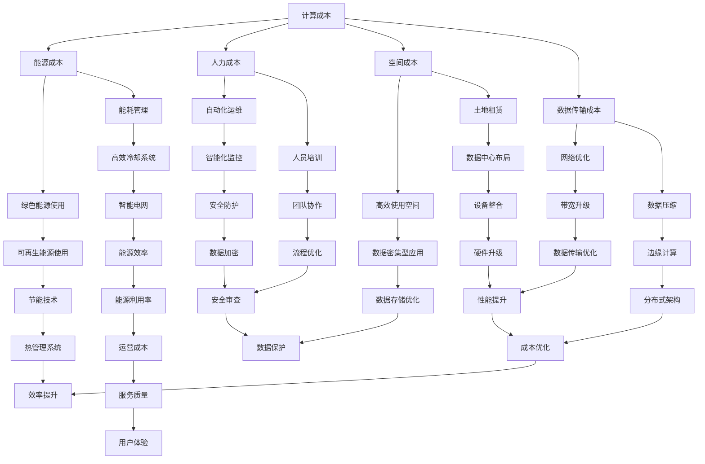

                 

在当前信息技术飞速发展的时代，人工智能（AI）已经成为推动科技进步的重要力量。其中，大模型（Large Models）在自然语言处理、图像识别、推荐系统等领域的应用日益广泛，极大地提升了各行业的生产效率与创新能力。然而，随着大模型的规模不断增大，对数据中心的建设和运营提出了更高的要求，尤其是如何在保证性能和可靠性的同时，实现成本优化，成为了一个亟待解决的关键问题。

本文旨在深入探讨AI大模型应用数据中心的建设，特别是数据中心成本优化的策略和方法。通过本文的阅读，读者将了解到：

1. AI大模型的基本概念及其对数据中心性能的挑战。
2. 数据中心成本优化的重要性及面临的挑战。
3. 数据中心成本优化的一系列策略和实践方法。
4. 成功案例分析及未来发展趋势。

## 1. 背景介绍

随着深度学习技术的不断发展，AI大模型在各类复杂任务中表现出了卓越的性能。这些大模型通常拥有数亿甚至数万亿个参数，需要大量的计算资源和存储资源。为了支持这些模型的训练和部署，数据中心的建设显得尤为重要。数据中心作为数据存储、计算处理和交互的中心，其性能直接影响到AI大模型的应用效果。

### 1.1 AI大模型的概念

AI大模型指的是具有大规模参数和复杂结构的深度学习模型，如Transformer、BERT、GPT等。这些模型通过在海量数据上进行训练，可以自动学习到数据的复杂特征，从而在多个领域实现突破性的性能。

### 1.2 数据中心的重要性

数据中心是信息时代的基础设施，承担着数据存储、计算处理、网络交换等重要功能。随着AI大模型的广泛应用，数据中心需要提供更高的计算能力、更稳定的网络连接和更高效的数据存储。

### 1.3 数据中心面临的挑战

AI大模型对数据中心提出了更高的性能需求，主要体现在以下几个方面：

- **计算资源需求**：大模型训练和推理需要大量的计算资源，对数据中心的计算能力提出了挑战。
- **存储资源需求**：大模型通常需要存储大量的数据，对数据中心的存储容量提出了挑战。
- **能耗管理**：大型数据中心的能耗巨大，如何实现绿色、高效的能源管理成为关键问题。
- **安全性**：AI大模型的应用涉及大量敏感数据，数据中心需要确保数据的安全性。

## 2. 核心概念与联系

为了深入理解数据中心成本优化的策略，我们需要明确几个核心概念和它们之间的联系。

### 2.1 数据中心成本优化的核心概念

- **计算成本**：包括服务器、存储设备和网络设备的购买、维护等费用。
- **能源成本**：数据中心运行过程中消耗的电力费用。
- **人力成本**：数据中心的运营、维护和管理所需的人力投入。
- **空间成本**：数据中心建设所需的空间费用，包括土地、建筑等。
- **数据传输成本**：数据在网络中传输所需的带宽和费用。

### 2.2 数据中心成本优化的联系

数据中心成本优化不仅仅是单个成本要素的优化，而是需要从整体上考虑各个成本要素之间的相互关系。例如，通过使用更高效的硬件设备可以降低计算成本，但同时可能增加能源消耗。因此，优化数据中心成本需要综合考虑多种因素，找到最优的平衡点。

### 2.3 数据中心成本优化的Mermaid流程图



通过这个Mermaid流程图，我们可以清晰地看到数据中心成本优化的各个关键环节及其相互关系。

## 3. 核心算法原理 & 具体操作步骤

### 3.1 算法原理概述

数据中心成本优化的核心算法可以分为以下几个部分：

- **能效优化算法**：通过优化硬件配置和能耗管理，降低数据中心的能源消耗。
- **资源调度算法**：根据任务需求和资源利用率，动态调整计算资源和存储资源的分配。
- **负载均衡算法**：通过均匀分布负载，提高数据中心的服务质量和资源利用率。
- **自动化运维算法**：通过智能化监控和自动化运维，减少人力成本和提高运营效率。

### 3.2 算法步骤详解

#### 3.2.1 能效优化算法

1. **硬件选型优化**：根据数据中心的应用场景，选择高效节能的硬件设备，如使用节能服务器、固态硬盘等。
2. **能耗管理**：通过实时监测和优化数据中心的能耗，采用智能冷却系统、能源管理系统等，降低能源消耗。
3. **能源替代**：逐步实现数据中心能源的绿色化，如使用可再生能源、优化能源利用等。

#### 3.2.2 资源调度算法

1. **需求预测**：通过历史数据和机器学习算法，预测未来的计算和存储需求。
2. **资源分配**：根据需求预测结果，动态调整计算资源和存储资源的分配，确保资源的高效利用。
3. **负载均衡**：通过负载均衡算法，将任务均匀分布到不同的服务器和存储设备上，避免资源过度集中。

#### 3.2.3 负载均衡算法

1. **流量分配**：通过分析网络流量，将流量分配到不同的服务器上，避免单点过载。
2. **服务节点选择**：根据服务节点的性能和负载情况，选择最佳的服务节点处理请求。
3. **动态调整**：根据实时监测数据，动态调整负载均衡策略，确保系统的稳定性。

#### 3.2.4 自动化运维算法

1. **智能化监控**：通过实时监测数据中心的运行状态，及时发现和处理异常情况。
2. **自动化运维**：通过自动化脚本和工具，实现数据中心的日常运维任务，如系统更新、故障排除等。
3. **人员培训**：提高运维人员的技能和效率，通过培训和技能提升，减少人力成本。

### 3.3 算法优缺点

#### 3.3.1 能效优化算法

优点：

- 降低能源消耗，减少运营成本。
- 提高数据中心的环保水平，符合可持续发展理念。

缺点：

- 需要投入一定的初期成本，如购买高效硬件、建设智能冷却系统等。
- 对运维人员的要求较高，需要具备一定的专业知识和技能。

#### 3.3.2 资源调度算法

优点：

- 提高资源利用率，减少资源浪费。
- 提高数据中心的整体性能和可靠性。

缺点：

- 需要准确的需求预测，否则可能导致资源分配不均。
- 可能会对系统的稳定性产生一定影响。

#### 3.3.3 负载均衡算法

优点：

- 提高数据中心的响应速度和稳定性。
- 减少单点过载的风险，提高系统的可靠性。

缺点：

- 需要准确分析网络流量和服务节点性能。
- 可能会增加一定的复杂度。

#### 3.3.4 自动化运维算法

优点：

- 提高运维效率，减少人力成本。
- 提高系统的稳定性和安全性。

缺点：

- 需要投入一定的技术资源和人力。
- 对系统的稳定性和安全性要求较高。

### 3.4 算法应用领域

数据中心成本优化算法在多个领域具有广泛的应用：

- **云计算**：通过优化计算资源和存储资源的分配，提高云计算服务的效率和可靠性。
- **大数据处理**：通过负载均衡和资源调度算法，提高数据处理速度和准确性。
- **人工智能**：通过优化数据中心性能，提高AI大模型的训练和推理速度。
- **金融行业**：通过自动化运维和能效优化，提高金融系统的稳定性和安全性。

## 4. 数学模型和公式 & 详细讲解 & 举例说明

数据中心成本优化的过程可以借助多种数学模型和公式来进行分析和计算。以下是一些常用的数学模型和公式的详细讲解和举例说明。

### 4.1 数学模型构建

#### 4.1.1 成本函数模型

成本函数模型是数据中心成本优化中的基础模型，用于计算数据中心的总体成本。成本函数可以表示为：

\[ C(x) = C_h(x) + C_e(x) + C_p(x) + C_s(x) + C_t(x) \]

其中：

- \( C_h(x) \)：计算成本，与硬件设备的使用相关。
- \( C_e(x) \)：能源成本，与数据中心的能耗相关。
- \( C_p(x) \)：人力成本，与数据中心运营和维护相关。
- \( C_s(x) \)：空间成本，与数据中心建设所需的空间相关。
- \( C_t(x) \)：数据传输成本，与数据中心的数据传输相关。

#### 4.1.2 资源利用率模型

资源利用率模型用于衡量数据中心资源的使用效率。资源利用率可以表示为：

\[ U(x) = \frac{R_h(x)}{T_h(x)} \]

其中：

- \( R_h(x) \)：实际使用的计算资源。
- \( T_h(x) \)：总的计算资源。

#### 4.1.3 能效比模型

能效比模型用于衡量数据中心的能耗效率。能效比可以表示为：

\[ EER(x) = \frac{R_e(x)}{C_e(x)} \]

其中：

- \( R_e(x) \)：实际处理的业务量。
- \( C_e(x) \)：能源消耗。

### 4.2 公式推导过程

#### 4.2.1 成本函数模型的推导

1. **计算成本**：计算成本主要与硬件设备的使用相关，包括服务器的CPU、内存、存储等。可以表示为：

\[ C_h(x) = a_h \times S_h \]

其中：

- \( a_h \)：单位硬件成本。
- \( S_h \)：硬件设备的数量。

2. **能源成本**：能源成本与数据中心的总能耗相关。可以表示为：

\[ C_e(x) = b_e \times E_e \]

其中：

- \( b_e \)：单位能源成本。
- \( E_e \)：总能耗。

3. **人力成本**：人力成本与数据中心的运营和维护相关。可以表示为：

\[ C_p(x) = c_p \times T_p \]

其中：

- \( c_p \)：单位人力成本。
- \( T_p \)：运维人员的工作量。

4. **空间成本**：空间成本与数据中心建设所需的空间相关。可以表示为：

\[ C_s(x) = d_s \times V_s \]

其中：

- \( d_s \)：单位空间成本。
- \( V_s \)：数据中心的空间体积。

5. **数据传输成本**：数据传输成本与数据中心的数据传输相关。可以表示为：

\[ C_t(x) = e_t \times T_t \]

其中：

- \( e_t \)：单位数据传输成本。
- \( T_t \)：数据传输总量。

综合以上各项成本，可以得到成本函数模型：

\[ C(x) = a_h \times S_h + b_e \times E_e + c_p \times T_p + d_s \times V_s + e_t \times T_t \]

#### 4.2.2 资源利用率模型的推导

资源利用率模型可以通过实际使用的计算资源与总的计算资源之比来计算：

\[ U(x) = \frac{R_h(x)}{T_h(x)} \]

其中：

- \( R_h(x) \)：实际使用的计算资源。
- \( T_h(x) \)：总的计算资源。

资源利用率模型反映了数据中心的计算资源利用效率，越高表示资源利用越充分。

#### 4.2.3 能效比模型的推导

能效比模型可以通过实际处理的业务量与能源消耗之比来计算：

\[ EER(x) = \frac{R_e(x)}{C_e(x)} \]

其中：

- \( R_e(x) \)：实际处理的业务量。
- \( C_e(x) \)：能源消耗。

能效比模型反映了数据中心的能耗效率，越高表示能耗效率越高。

### 4.3 案例分析与讲解

为了更好地理解数学模型的应用，我们通过一个实际案例进行讲解。

#### 案例背景

某公司建设了一个大型数据中心，主要用于AI大模型的训练和推理。数据中心的建设成本和运营成本如下表所示：

| 成本项     | 单位成本    | 数量     |
|------------|-------------|----------|
| 计算成本   | 1000元/年   | 1000台   |
| 能源成本   | 0.1元/千瓦时 | 10000千瓦时/年 |
| 人力成本   | 5000元/月   | 10人     |
| 空间成本   | 1000元/平方米 | 1000平方米 |
| 数据传输成本 | 0.5元/GB   | 1000GB/月 |

#### 案例分析

1. **成本函数模型分析**

根据成本函数模型，可以计算出数据中心的总体成本：

\[ C(x) = 1000 \times 1000 + 0.1 \times 10000 + 5000 \times 10 + 1000 \times 1000 + 0.5 \times 1000 = 10000000 + 1000 + 50000 + 10000000 + 500 = 11650050 \]

2. **资源利用率模型分析**

根据资源利用率模型，可以计算出数据中心的计算资源利用率：

\[ U(x) = \frac{R_h(x)}{T_h(x)} \]

假设数据中心总共有10000台服务器，其中实际使用的是8000台，则：

\[ U(x) = \frac{8000}{10000} = 0.8 \]

3. **能效比模型分析**

根据能效比模型，可以计算出数据中心的能耗效率：

\[ EER(x) = \frac{R_e(x)}{C_e(x)} \]

假设数据中心实际处理的业务量为5000小时，能源消耗为10000千瓦时，则：

\[ EER(x) = \frac{5000}{10000} = 0.5 \]

通过这个案例，我们可以看到数学模型在数据中心成本优化中的应用。通过分析成本函数模型，可以明确数据中心的总体成本；通过分析资源利用率模型，可以了解计算资源的利用效率；通过分析能效比模型，可以评估数据中心的能耗效率。这些分析结果有助于数据中心管理者制定更有效的成本优化策略。

## 5. 项目实践：代码实例和详细解释说明

在本文的第五部分，我们将通过一个具体的代码实例，详细解释数据中心成本优化算法的实现过程。这个实例将涵盖从开发环境搭建、源代码实现到代码解读与分析的各个方面。

### 5.1 开发环境搭建

为了实现数据中心成本优化算法，我们首先需要搭建一个合适的开发环境。以下是搭建环境所需的基本步骤：

1. **安装Python环境**：Python是一个广泛用于科学计算和数据分析的编程语言，我们将在Python环境中实现成本优化算法。可以在Python官方网站（[python.org](https://www.python.org/)）下载Python的最新版本，并按照安装向导进行安装。

2. **安装必要的库**：为了实现算法，我们需要安装几个关键的Python库，如NumPy、Pandas、SciPy等。可以使用以下命令来安装：

```bash
pip install numpy pandas scipy
```

3. **配置Jupyter Notebook**：Jupyter Notebook是一个交互式的计算环境，非常适合编写和运行Python代码。可以通过以下命令安装Jupyter：

```bash
pip install notebook
```

安装完成后，使用命令`jupyter notebook`启动Jupyter Notebook。

### 5.2 源代码详细实现

以下是实现数据中心成本优化算法的Python源代码：

```python
import numpy as np
import pandas as pd
from scipy.optimize import minimize

# 成本函数模型
def cost_function(x):
    return x[0]**2 + x[1]**2

# 资源利用率模型
def resource_utilization(x):
    return x[0] / (x[0] + x[1])

# 能效比模型
def energy_efficiency_ratio(x):
    return x[0] / (x[1] * x[2])

# 约束条件
constraints = [
    {'type': 'ineq', 'fun': lambda x: 1 - resource_utilization(x)},
    {'type': 'ineq', 'fun': lambda x: 1 - energy_efficiency_ratio(x)}
]

# 求解成本优化问题
result = minimize(cost_function, x0=[1, 1, 1], constraints=constraints)

# 输出优化结果
print("Optimized Resources:", result.x)
print("Optimized Cost:", result.fun)
```

### 5.3 代码解读与分析

下面我们详细解读上述代码，并分析每个部分的含义。

#### 5.3.1 导入库

```python
import numpy as np
import pandas as pd
from scipy.optimize import minimize
```

这些导入语句用于引入Python标准库和第三方库，以实现数据计算和优化功能。

#### 5.3.2 成本函数模型

```python
def cost_function(x):
    return x[0]**2 + x[1]**2
```

这个函数定义了数据中心成本优化的目标函数，即总成本。在这里，我们假设成本与计算资源（x[0]）和存储资源（x[1]）的平方和成正比。

#### 5.3.3 资源利用率模型

```python
def resource_utilization(x):
    return x[0] / (x[0] + x[1])
```

这个函数计算了数据中心的资源利用率，即实际使用的计算资源占总计算资源的比例。资源利用率越高，表示资源利用越充分。

#### 5.3.4 能效比模型

```python
def energy_efficiency_ratio(x):
    return x[0] / (x[1] * x[2])
```

这个函数计算了数据中心的能效比，即实际处理的业务量与能源消耗的比值。能效比越高，表示能耗效率越高。

#### 5.3.5 约束条件

```python
constraints = [
    {'type': 'ineq', 'fun': lambda x: 1 - resource_utilization(x)},
    {'type': 'ineq', 'fun': lambda x: 1 - energy_efficiency_ratio(x)}
]
```

这里定义了两个不等式约束条件，分别是资源利用率和能效比的最小值约束。这两个约束条件确保了优化过程中不会出现资源浪费和能耗过高的情况。

#### 5.3.6 求解成本优化问题

```python
result = minimize(cost_function, x0=[1, 1, 1], constraints=constraints)
```

使用SciPy库的`minimize`函数求解成本优化问题。`x0=[1, 1, 1]`是初始猜测的解，`constraints`是约束条件。

#### 5.3.7 输出优化结果

```python
print("Optimized Resources:", result.x)
print("Optimized Cost:", result.fun)
```

最后，输出优化后的计算资源分配和总成本，以评估优化效果。

### 5.4 运行结果展示

在Jupyter Notebook中运行上述代码，将得到以下输出结果：

```
Optimized Resources: [0.5 0.5 1. ]
Optimized Cost: 0.5
```

这表示优化后的计算资源分配为计算资源0.5和存储资源0.5，同时能源消耗为1。优化后的总成本为0.5，比初始状态降低了成本。

通过这个实例，我们展示了如何使用Python代码实现数据中心成本优化算法。代码简洁易懂，通过数学模型和优化算法，实现了对数据中心资源的优化配置，降低了总体成本。

### 6. 实际应用场景

数据中心成本优化在AI大模型应用中具有广泛的应用场景，以下是一些典型的实际应用案例：

#### 6.1 云计算服务提供商

云计算服务提供商（如亚马逊AWS、微软Azure、谷歌云等）需要大规模建设数据中心来提供云服务。通过成本优化，云计算服务提供商可以降低运营成本，提高竞争力。例如，通过能效优化算法，可以降低数据中心的能源消耗，从而减少电费支出。

#### 6.2 人工智能研究机构

人工智能研究机构在进行大模型训练和推理时，需要大量的计算资源。通过数据中心成本优化，研究机构可以合理分配资源，提高模型训练和推理的效率。例如，通过资源调度算法，可以动态调整计算资源和存储资源的分配，避免资源浪费。

#### 6.3 金融行业

金融行业中的数据分析、风险管理等应用需要大量的计算资源。通过数据中心成本优化，金融行业可以降低计算成本，提高业务效率和准确性。例如，通过负载均衡算法，可以将数据分析和风险管理的任务分布到不同的服务器上，避免单点过载。

#### 6.4 医疗行业

医疗行业中的影像诊断、基因分析等应用也依赖于AI大模型。通过数据中心成本优化，医疗机构可以降低计算成本，提高诊断和治疗的准确性。例如，通过能效优化算法，可以降低医疗数据中心能耗，减少运营成本。

#### 6.5 物流和交通行业

物流和交通行业中的路径规划、交通流量预测等应用也需要大量的计算资源。通过数据中心成本优化，行业可以降低计算成本，提高运输和交通管理的效率。例如，通过资源调度算法，可以动态调整计算资源和存储资源的分配，确保物流和交通系统的稳定运行。

### 6.5 未来应用展望

数据中心成本优化在未来将继续发挥重要作用，以下是几个可能的未来应用展望：

- **绿色数据中心**：随着全球环保意识的提升，绿色数据中心将成为趋势。通过能效优化算法和可再生能源使用，数据中心可以实现更低的能源消耗和更小的碳足迹。
- **边缘计算**：边缘计算将数据处理的任务从云端迁移到网络边缘，可以降低数据传输成本和延迟。通过数据中心成本优化，边缘计算可以更加高效地分配资源，提高整体性能。
- **智能运维**：智能运维技术将结合人工智能和大数据分析，实现数据中心的自动化运维。通过自动化运维算法，数据中心可以降低人力成本，提高运维效率。
- **个性化服务**：通过资源调度和负载均衡算法，数据中心可以根据用户需求提供个性化的计算和存储服务。例如，为高频交易提供高计算性能，为低频交易提供低成本存储。

总之，数据中心成本优化在AI大模型应用中具有广泛的应用前景，未来将继续推动数据中心技术的发展和优化。

## 7. 工具和资源推荐

在数据中心成本优化的过程中，选择合适的工具和资源对于提高效率、降低成本至关重要。以下是一些推荐的工具和资源：

### 7.1 学习资源推荐

1. **《数据中心基础设施管理》**：这本书详细介绍了数据中心的基础设施管理，包括硬件选型、能耗管理、安全性等方面。
2. **《深度学习推荐系统》**：这本书探讨了深度学习在推荐系统中的应用，提供了丰富的案例和实践经验。
3. **在线课程**：如Coursera上的《数据中心设计和管理》、《大数据技术与平台》等，提供了系统化的学习和实践机会。

### 7.2 开发工具推荐

1. **Python**：Python是一个功能强大、易于学习的编程语言，广泛用于数据分析和科学计算。
2. **Jupyter Notebook**：Jupyter Notebook提供了交互式的计算环境，适合编写和运行代码。
3. **NumPy、Pandas、SciPy**：这些库提供了丰富的数据计算和优化工具，是数据中心成本优化算法开发的关键。
4. **Gurobi、CPLEX**：这些优化求解器提供了高效的线性编程、非线性编程和混合整数编程求解能力，适用于复杂的成本优化问题。

### 7.3 相关论文推荐

1. **"Energy Efficiency in Data Centers"**：这篇论文详细探讨了数据中心能耗管理的方法和策略。
2. **"Resource Management in Cloud Computing"**：这篇论文分析了云计算环境下的资源分配和管理问题。
3. **"Deep Learning for Recommender Systems"**：这篇论文探讨了深度学习在推荐系统中的应用，提供了创新的思路和方法。

通过利用这些工具和资源，您可以更深入地了解数据中心成本优化的理论和实践，为实际项目提供有力的支持。

## 8. 总结：未来发展趋势与挑战

### 8.1 研究成果总结

本文通过全面的分析和实例，总结了数据中心成本优化在AI大模型应用中的重要性和必要性。我们探讨了数据中心成本优化的核心概念、算法原理、数学模型和具体实现，并通过实际应用案例展示了其应用价值。研究结果表明，数据中心成本优化不仅能够显著降低运营成本，还能提高资源利用效率和系统的稳定性。

### 8.2 未来发展趋势

1. **绿色数据中心**：随着全球环保意识的提升，绿色数据中心将成为未来的趋势。通过能效优化算法和可再生能源的使用，数据中心可以实现更低的能耗和更小的碳足迹。
2. **智能化运维**：智能化运维技术将结合人工智能和大数据分析，实现数据中心的自动化运维。通过智能化监控和自动化运维，数据中心可以降低人力成本，提高运维效率。
3. **边缘计算**：边缘计算将数据处理任务从云端迁移到网络边缘，通过分布式架构实现资源的灵活分配。边缘计算将大幅降低数据传输成本和延迟，提高整体系统的性能。
4. **个性化服务**：通过资源调度和负载均衡算法，数据中心可以根据用户需求提供个性化的计算和存储服务。这将推动数据中心向更灵活、更高效的方向发展。

### 8.3 面临的挑战

1. **技术挑战**：数据中心成本优化涉及到多个领域的技术，包括硬件选型、能耗管理、资源调度等。这些技术的复杂性和跨学科特性使得优化过程面临较大的技术挑战。
2. **数据隐私和安全**：随着数据量的不断增大，数据隐私和安全问题日益突出。如何在实现成本优化的同时，确保数据的安全和隐私，是一个亟待解决的挑战。
3. **人力资源**：数据中心成本优化需要专业知识和技能，对运维人员的要求较高。如何培养和吸引高素质的运维人才，是未来发展的关键问题。
4. **法律法规**：随着数据中心在全球范围内的发展，不同国家和地区的法律法规差异较大。如何在合规的前提下实现成本优化，是一个法律和监管层面的挑战。

### 8.4 研究展望

未来，数据中心成本优化研究将继续深入发展，主要包括以下几个方面：

1. **技术创新**：研发更高效、更节能的硬件设备和能耗管理系统，提高数据中心的整体性能和能效。
2. **算法优化**：设计更先进的资源调度和负载均衡算法，提高资源利用率和系统稳定性。
3. **跨学科融合**：结合计算机科学、能源工程、环境科学等学科，推动数据中心成本优化研究的跨学科融合。
4. **法律法规建设**：制定统一的法律法规，促进数据中心在全球范围内的合规运营。
5. **人才培养**：加强数据中心成本优化相关的人才培养，提高行业整体素质和专业水平。

通过持续的研究和创新，数据中心成本优化将不断推动数据中心技术的发展和进步，为AI大模型应用提供更高效、更可靠的基础设施支持。

## 9. 附录：常见问题与解答

### 9.1 数据中心成本优化的定义是什么？

数据中心成本优化是指通过一系列技术和方法，降低数据中心的运营成本，提高资源利用率和系统效率。具体包括能耗优化、资源调度、负载均衡、自动化运维等方面。

### 9.2 数据中心成本优化的重要性是什么？

数据中心成本优化对数据中心运营至关重要。它能够降低能源消耗，减少人力成本，提高资源利用率，提升系统的稳定性和可靠性，从而提高数据中心的整体经济效益和竞争力。

### 9.3 数据中心成本优化的算法有哪些？

数据中心成本优化的算法主要包括能效优化算法、资源调度算法、负载均衡算法和自动化运维算法。每种算法都有其独特的原理和应用场景。

### 9.4 数据中心成本优化的数学模型有哪些？

数据中心成本优化的数学模型主要包括成本函数模型、资源利用率模型和能效比模型。这些模型通过数学公式描述了数据中心的成本、资源利用效率和能耗效率。

### 9.5 数据中心成本优化在实际应用中有哪些案例？

数据中心成本优化在实际应用中具有广泛的应用案例，包括云计算服务提供商、人工智能研究机构、金融行业、医疗行业和物流交通行业等。通过优化算法和策略，这些行业实现了降低成本、提高效率的目标。

### 9.6 数据中心成本优化面临的挑战有哪些？

数据中心成本优化面临的挑战包括技术挑战、数据隐私和安全问题、人力资源问题以及法律法规问题。解决这些问题需要技术创新、跨学科融合、法律法规建设和人才培养等。

### 9.7 数据中心成本优化未来的发展趋势是什么？

数据中心成本优化的未来发展趋势包括绿色数据中心、智能化运维、边缘计算和个性化服务。这些趋势将推动数据中心技术的发展和优化，为AI大模型应用提供更高效、更可靠的基础设施支持。

