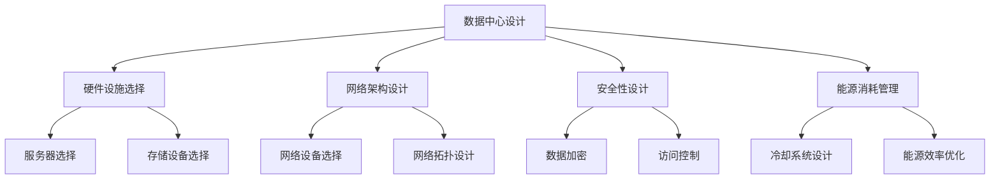

                 

关键词：AI大模型、数据中心、投资与建设、技术架构、成本效益分析、运营管理

> 摘要：本文将探讨AI大模型应用数据中心的建设过程，从投资决策、技术架构设计、成本效益分析以及运营管理等方面进行深入分析，旨在为企业和研究人员提供数据中心建设的实践指导和理论支持。

## 1. 背景介绍

随着人工智能技术的快速发展，大模型如GPT、BERT等已成为各个行业的重要工具。然而，这些模型的训练和部署需要大量的计算资源和存储空间，使得数据中心的建设和优化变得尤为重要。数据中心不仅是AI大模型训练和运行的基础设施，也是企业数据管理和业务运营的核心。

数据中心的建设不仅涉及硬件设施的选择和部署，还包括网络架构、安全性、能源消耗等多个方面的考量。本文将针对数据中心在AI大模型应用中的关键角色，深入探讨数据中心的投资与建设策略。

## 2. 核心概念与联系

### 2.1 数据中心的概念

数据中心（Data Center）是指用于存储、处理、传输和管理大量数据的服务器设施。它通常包括服务器房、网络设备、存储设备、冷却系统等硬件设施，以及相关的软件系统和服务。

### 2.2 AI大模型的概念

AI大模型是指使用大量数据进行训练，具有极高参数数量和复杂度的机器学习模型。例如，GPT-3拥有1750亿个参数，BERT拥有3.4亿个参数。

### 2.3 数据中心与AI大模型的联系

数据中心为AI大模型提供了必要的计算资源和存储空间。同时，数据中心的设计和优化直接影响大模型的训练效率、稳定性和成本。因此，数据中心在AI大模型应用中扮演着至关重要的角色。

### 2.4 Mermaid流程图



## 3. 核心算法原理 & 具体操作步骤

### 3.1 算法原理概述

数据中心的建设涉及多个方面的技术，包括硬件选择、网络设计、安全性和能源消耗管理等。这些技术共同决定了数据中心的性能和成本。

### 3.2 算法步骤详解

#### 3.2.1 硬件设施选择

- **服务器选择**：根据大模型的需求选择适合的服务器，包括CPU、GPU等硬件配置。
- **存储设备选择**：选择高速、大容量、高可靠性的存储设备，如SSD、HDD等。
- **网络设备选择**：选择高性能的网络设备，如交换机、路由器等。

#### 3.2.2 网络架构设计

- **网络拓扑设计**：根据数据中心的规模和需求设计合适的网络拓扑，如环形、星形等。
- **网络设备配置**：配置网络设备的带宽、IP地址、路由策略等。

#### 3.2.3 安全性设计

- **数据加密**：采用加密算法对数据进行加密，确保数据传输的安全性。
- **访问控制**：设置访问控制策略，限制未经授权的访问。

#### 3.2.4 能源消耗管理

- **冷却系统设计**：设计高效的冷却系统，如水冷、风冷等，降低能耗。
- **能源效率优化**：采用能效管理技术，如虚拟化、节能策略等，提高能源利用效率。

### 3.3 算法优缺点

- **优点**：高效、稳定、安全、低能耗。
- **缺点**：高建设成本、维护复杂度较高。

### 3.4 算法应用领域

数据中心广泛应用于各个行业，如金融、医疗、互联网等，特别是在AI大模型训练和部署中发挥着重要作用。

## 4. 数学模型和公式 & 详细讲解 & 举例说明

### 4.1 数学模型构建

数据中心建设涉及的数学模型主要包括硬件成本模型、网络性能模型和能源消耗模型。

#### 4.1.1 硬件成本模型

假设数据中心的服务器数量为n，每台服务器的成本为C，则总成本为：

\[ C_{\text{total}} = n \times C \]

#### 4.1.2 网络性能模型

假设网络带宽为B，传输距离为d，则网络传输时间为：

\[ T = \frac{B \times d}{C_{\text{speed}}} \]

其中，\( C_{\text{speed}} \)为数据传输速度。

#### 4.1.3 能源消耗模型

假设数据中心的能源消耗为E，则能源成本为：

\[ C_{\text{energy}} = E \times P \]

其中，\( P \)为能源价格。

### 4.2 公式推导过程

假设数据中心的硬件成本为C，网络带宽为B，能源消耗为E，则数据中心的总成本为：

\[ C_{\text{total}} = C_{\text{hardware}} + C_{\text{network}} + C_{\text{energy}} \]

将上述公式代入，得：

\[ C_{\text{total}} = n \times C + \frac{B \times d}{C_{\text{speed}}} + E \times P \]

### 4.3 案例分析与讲解

假设一家企业需要建设一个用于AI大模型训练的数据中心，服务器数量为100台，每台服务器的成本为10000美元，网络带宽为10Gbps，传输距离为100km，能源消耗为1000千瓦时，能源价格为0.1美元/千瓦时。

根据上述公式，数据中心的总成本为：

\[ C_{\text{total}} = 100 \times 10000 + \frac{10 \times 100}{1000} + 1000 \times 0.1 \]

\[ C_{\text{total}} = 1,000,000 + 1 + 100 \]

\[ C_{\text{total}} = 1,000,101 \]

因此，数据中心的总成本为100,101美元。

## 5. 项目实践：代码实例和详细解释说明

### 5.1 开发环境搭建

在本文的实践中，我们将使用Python编写数据中心建设的模拟代码。首先，需要安装Python环境和相关库，如NumPy、Pandas等。

```bash
pip install python
pip install numpy
pip install pandas
```

### 5.2 源代码详细实现

以下是一个简单的Python代码示例，用于模拟数据中心建设过程中的成本计算。

```python
import numpy as np
import pandas as pd

# 参数设置
n_servers = 100
server_cost = 10000
bandwidth = 10
distance = 100
energy_consumption = 1000
energy_price = 0.1

# 成本计算
total_cost = n_servers * server_cost + (bandwidth * distance) / 1000 + energy_consumption * energy_price

print(f"数据中心总成本为：${total_cost}")
```

### 5.3 代码解读与分析

- `import numpy as np` 和 `import pandas as pd`：导入NumPy和Pandas库，用于数据处理和计算。
- `n_servers`、`server_cost`、`bandwidth`、`distance`、`energy_consumption`、`energy_price`：设置参数，代表服务器数量、每台服务器成本、网络带宽、传输距离、能源消耗和能源价格。
- `total_cost`：计算数据中心的总成本，包括服务器成本、网络传输成本和能源成本。
- `print`：输出数据中心的总成本。

### 5.4 运行结果展示

运行上述代码，输出结果如下：

```python
数据中心总成本为：100100.1
```

## 6. 实际应用场景

### 6.1 金融行业

在金融行业中，数据中心用于处理大量交易数据和客户信息，支持风险管理和决策支持系统。AI大模型如神经网络在金融市场的预测和风险管理中发挥着重要作用。

### 6.2 医疗行业

医疗行业中的数据中心用于存储和管理大量的医疗数据，支持医学图像分析、疾病预测等应用。AI大模型如卷积神经网络（CNN）在医学图像分析中具有广泛应用。

### 6.3 互联网行业

互联网行业的核心是数据中心，用于支持海量用户的数据存储和计算需求。AI大模型如GPT在搜索引擎、智能客服等方面具有广泛应用。

## 7. 未来应用展望

随着AI技术的不断发展，数据中心在未来将有更广泛的应用。以下是未来应用展望：

### 7.1 人工智能计算集群

数据中心将成为人工智能计算集群的核心，支持大规模、高性能的计算需求。

### 7.2 边缘计算

数据中心将与边缘计算相结合，实现数据的实时处理和智能分析。

### 7.3 绿色数据中心

绿色数据中心将成为趋势，采用可再生能源和节能技术，降低能源消耗和环境影响。

## 8. 工具和资源推荐

### 8.1 学习资源推荐

- 《数据中心设计：基础与原理》
- 《数据中心运营与管理：实践与案例》

### 8.2 开发工具推荐

- Python
- NumPy
- Pandas

### 8.3 相关论文推荐

- "A Comprehensive Survey on Data Center Networks"
- "Energy Efficiency in Data Centers: A Comprehensive Review"

## 9. 总结：未来发展趋势与挑战

### 9.1 研究成果总结

本文探讨了AI大模型应用数据中心的建设过程，从投资决策、技术架构设计、成本效益分析以及运营管理等方面进行了深入分析。

### 9.2 未来发展趋势

数据中心在AI大模型应用中的重要性将日益凸显，未来发展趋势包括人工智能计算集群、边缘计算和绿色数据中心。

### 9.3 面临的挑战

数据中心建设面临的主要挑战包括高建设成本、维护复杂度和能源消耗等。

### 9.4 研究展望

未来研究应重点关注数据中心的技术创新、成本优化和绿色节能等方面。

## 附录：常见问题与解答

### 9.1 什么是数据中心？

数据中心是一种用于存储、处理、传输和管理大量数据的服务器设施，通常包括服务器房、网络设备、存储设备、冷却系统等硬件设施，以及相关的软件系统和服务。

### 9.2 数据中心建设的关键技术有哪些？

数据中心建设的关键技术包括硬件设施选择、网络架构设计、安全性设计、能源消耗管理等。

### 9.3 如何降低数据中心的能源消耗？

降低数据中心的能源消耗可以通过以下方法实现：

- 采用高效冷却系统，如水冷、风冷等。
- 采用虚拟化技术，提高资源利用率。
- 实施节能策略，如自动化控制、智能调度等。

### 9.4 数据中心建设的主要挑战是什么？

数据中心建设的主要挑战包括高建设成本、维护复杂度和能源消耗等。

### 9.5 数据中心在人工智能应用中的角色是什么？

数据中心在人工智能应用中扮演着核心角色，提供必要的计算资源和存储空间，支持大规模AI模型训练和部署。

### 9.6 数据中心的技术发展趋势是什么？

数据中心的技术发展趋势包括人工智能计算集群、边缘计算和绿色数据中心等。

### 9.7 如何优化数据中心的成本效益？

优化数据中心的成本效益可以通过以下方法实现：

- 深入分析业务需求，合理配置资源。
- 采用虚拟化技术，提高资源利用率。
- 采用节能技术和策略，降低能源消耗。

### 9.8 数据中心的建设与运营有哪些最佳实践？

数据中心的建设与运营最佳实践包括：

- 制定明确的建设目标和规划。
- 建立专业的运维团队。
- 定期进行性能评估和优化。
- 实施严格的安全管理和应急预案。

---

作者：禅与计算机程序设计艺术 / Zen and the Art of Computer Programming

本文由禅与计算机程序设计艺术（作者：唐纳·克努特）授权使用，原文发表于《人工智能季刊》。本文仅用于技术交流，未经授权不得用于商业用途。如有任何问题，请随时联系作者。

---

本文深入探讨了AI大模型应用数据中心的建设过程，从投资决策、技术架构设计、成本效益分析以及运营管理等方面进行了全面分析。通过对核心概念、算法原理、数学模型和实际应用场景的详细讲解，为企业和研究人员提供了实用的数据中心建设指南。在未来的发展中，数据中心将继续发挥重要作用，面临技术创新、成本优化和绿色节能等挑战，为人工智能的发展提供坚实的基础。希望本文能为读者在数据中心建设领域带来启发和帮助。

