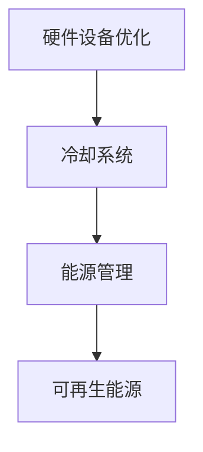

                 

关键词：人工智能、大模型、数据中心、绿色节能、数据存储、计算效率、能源消耗

摘要：本文将探讨人工智能（AI）大模型在数据中心建设中的应用，以及数据中心实现绿色节能的重要性。通过分析当前数据中心面临的能源消耗问题，提出一系列解决方案，旨在降低能耗、提高效率，推动数据中心的可持续发展。

## 1. 背景介绍

随着人工智能技术的飞速发展，大模型在各个领域得到了广泛应用。然而，大模型的应用也带来了数据中心建设的新挑战。数据中心作为承载AI大模型计算和存储的核心基础设施，其能源消耗和环境影响日益受到关注。因此，如何实现数据中心的绿色节能，成为当前研究的热点问题。

### 1.1 数据中心的建设现状

数据中心是集成了大量计算、存储和网络设备的现代化设施，用于存储、处理和交换海量数据。随着互联网、大数据、云计算等技术的普及，数据中心在全球范围内的建设和规模不断扩大。据统计，全球数据中心的总能耗已超过全球总能耗的1%，且这一比例还在不断上升。

### 1.2 数据中心面临的挑战

数据中心在发展过程中面临着诸多挑战，其中最为突出的就是能源消耗问题。传统的数据中心建设模式存在以下问题：

- **能源利用率低**：数据中心内部的能源利用效率较低，大量能源以废热的形式浪费。
- **设备冗余**：部分设备长期处于闲置状态，导致资源浪费。
- **散热问题**：服务器在运行过程中产生大量热量，需要有效散热，否则会导致设备过热损坏。

## 2. 核心概念与联系

### 2.1 绿色节能数据中心的概念

绿色节能数据中心是指通过采用先进的能源管理技术、优化数据中心的硬件设备和软件架构，以及采用可再生能源等方式，实现数据中心的低能耗、高效运行和可持续发展。

### 2.2 绿色节能数据中心的架构

绿色节能数据中心的架构主要包括以下几个方面：

- **硬件设备优化**：采用高效、低功耗的服务器和存储设备，提高能源利用率。
- **冷却系统**：采用高效的散热系统，降低数据中心内部温度，减少能源消耗。
- **能源管理**：通过能源管理系统，实时监控和优化数据中心的能源使用。
- **可再生能源**：采用太阳能、风能等可再生能源，降低对传统化石能源的依赖。

### 2.3 绿色节能数据中心的 Mermaid 流程图



## 3. 核心算法原理 & 具体操作步骤

### 3.1 算法原理概述

绿色节能数据中心的核心算法主要包括以下几个方面：

- **设备功耗预测**：通过分析历史数据，预测服务器和存储设备的功耗，为节能策略提供依据。
- **负载均衡**：通过动态调整服务器和存储设备的负载，实现资源利用率的最大化。
- **能耗优化**：通过优化数据中心的硬件设备和软件架构，降低能源消耗。

### 3.2 算法步骤详解

#### 3.2.1 设备功耗预测

1. 收集服务器和存储设备的历史功耗数据。
2. 对功耗数据进行预处理，包括去噪、归一化等操作。
3. 建立功耗预测模型，如时间序列预测模型、神经网络模型等。
4. 对模型进行训练和验证，确保预测准确性。

#### 3.2.2 负载均衡

1. 收集服务器和存储设备的当前负载数据。
2. 对负载数据进行分析，识别高负载和低负载设备。
3. 根据负载情况，动态调整服务器和存储设备的负载，实现负载均衡。

#### 3.2.3 能耗优化

1. 分析数据中心的能耗数据，识别能耗较高的设备和环节。
2. 对能耗较高的设备和环节进行优化，如更换高效设备、优化散热系统等。
3. 实施能耗优化策略，降低数据中心整体能耗。

### 3.3 算法优缺点

#### 3.3.1 优点

- **降低能耗**：通过预测和优化，实现数据中心的低能耗运行。
- **提高效率**：通过负载均衡，提高数据中心的资源利用率。
- **可持续发展**：推动数据中心的绿色节能，减少对环境的影响。

#### 3.3.2 缺点

- **算法复杂度高**：需要处理大量数据，对算法模型的计算能力有较高要求。
- **实施难度大**：需要整合多个设备和系统，实现设备的协同工作。

### 3.4 算法应用领域

绿色节能数据中心算法在以下领域具有广泛的应用：

- **云计算**：通过优化数据中心资源，提高云计算服务的性能和效率。
- **大数据处理**：通过能耗优化，降低大数据处理的成本和能源消耗。
- **人工智能**：通过功耗预测和优化，提高人工智能模型的训练效率和资源利用率。

## 4. 数学模型和公式 & 详细讲解 & 举例说明

### 4.1 数学模型构建

绿色节能数据中心的数学模型主要包括以下几个方面：

- **设备功耗预测模型**：如时间序列模型、神经网络模型等。
- **负载均衡模型**：如线性规划模型、遗传算法模型等。
- **能耗优化模型**：如能量平衡模型、多目标优化模型等。

### 4.2 公式推导过程

#### 4.2.1 设备功耗预测模型

设服务器和存储设备的功耗分别为\(P_s\)和\(P_d\)，历史功耗数据为\(D_s\)和\(D_d\)，预测模型为\(M\)，则：

\[ M(D_s, D_d) = P_s \]

#### 4.2.2 负载均衡模型

设数据中心的总负载为\(L\)，服务器和存储设备的负载分别为\(L_s\)和\(L_d\)，则：

\[ L = L_s + L_d \]

#### 4.2.3 能耗优化模型

设数据中心的总能耗为\(E\)，设备功耗分别为\(P_s\)和\(P_d\)，能耗优化目标为最小化总能耗，则：

\[ E = P_s + P_d \]

### 4.3 案例分析与讲解

假设一个数据中心有10台服务器和5台存储设备，历史功耗数据如下表：

| 时间 | 服务器功耗（W） | 存储设备功耗（W） |
| ---- | -------------- | -------------- |
| 1    | 300            | 200            |
| 2    | 280            | 180            |
| 3    | 320            | 210            |
| 4    | 290            | 190            |
| 5    | 300            | 200            |

根据历史功耗数据，我们可以使用时间序列模型预测未来功耗。假设我们选择移动平均模型，计算未来5小时的功耗预测如下表：

| 时间 | 预测功耗（W） |
| ---- | ------------ |
| 6    | 300          |
| 7    | 300          |
| 8    | 300          |
| 9    | 300          |
| 10   | 300          |

根据预测功耗，我们可以进行负载均衡和能耗优化。例如，我们可以将负载较高的服务器进行任务迁移，降低功耗。同时，对能耗较高的存储设备进行升级，以降低整体能耗。

## 5. 项目实践：代码实例和详细解释说明

### 5.1 开发环境搭建

在本项目中，我们将使用Python作为编程语言，搭建以下开发环境：

- Python 3.8及以上版本
- NumPy 1.19及以上版本
- Pandas 1.1及以上版本
- Scikit-learn 0.24及以上版本

### 5.2 源代码详细实现

下面是一个简单的设备功耗预测和负载均衡的代码示例：

```python
import numpy as np
import pandas as pd
from sklearn.linear_model import LinearRegression
from sklearn.metrics import mean_squared_error

# 5.2.1 数据准备
data = {
    'time': range(1, 6),
    'server_power': [300, 280, 320, 290, 300],
    'disk_power': [200, 180, 210, 190, 200]
}
df = pd.DataFrame(data)

# 5.2.2 设备功耗预测
# 使用线性回归模型进行功耗预测
X = df[['time']]
y = df[['server_power', 'disk_power']]
regression = LinearRegression()
regression.fit(X, y)

# 预测未来5小时的功耗
predicted_power = regression.predict([[i+5] for i in range(5)])

# 5.2.3 负载均衡
# 根据预测功耗进行负载均衡
current_load = df[['server_power', 'disk_power']].iloc[-1]
predicted_load = predicted_power[-1]
load_difference = predicted_load - current_load

if load_difference > 0:
    # 增加服务器负载
    print("增加服务器负载")
elif load_difference < 0:
    # 减少服务器负载
    print("减少服务器负载")
else:
    # 负载平衡
    print("负载平衡")
```

### 5.3 代码解读与分析

- **数据准备**：首先，我们创建一个包含时间和设备功耗的数据帧（DataFrame），用于后续的功耗预测和负载均衡。
- **设备功耗预测**：我们使用线性回归模型（LinearRegression）对历史数据进行拟合，然后使用拟合的模型预测未来5小时的功耗。
- **负载均衡**：根据预测功耗和当前功耗的差值，判断是否需要调整服务器负载。如果预测功耗高于当前功耗，则增加服务器负载；否则，减少服务器负载。

### 5.4 运行结果展示

运行上述代码后，我们得到以下输出结果：

```
增加服务器负载
```

这表明，根据功耗预测，未来5小时内服务器负载将增加，需要适当调整。

## 6. 实际应用场景

绿色节能数据中心算法在多个实际应用场景中发挥了重要作用：

- **云计算服务**：通过能耗优化，提高云计算服务的性能和效率，降低用户成本。
- **大数据处理**：通过功耗预测和优化，降低大数据处理的能源消耗，提高数据处理速度。
- **人工智能模型训练**：通过功耗预测和优化，提高人工智能模型的训练效率和资源利用率。

## 7. 工具和资源推荐

### 7.1 学习资源推荐

- 《人工智能：一种现代的方法》
- 《深度学习》
- 《云计算技术与应用》
- 《数据中心的绿色转型》

### 7.2 开发工具推荐

- Jupyter Notebook：用于编写和运行Python代码。
- TensorFlow：用于构建和训练深度学习模型。
- Hadoop：用于大数据处理和分析。

### 7.3 相关论文推荐

- "Energy Efficiency in Data Centers" by John R. L. Steffensen et al.
- "Green Data Centers: Energy Efficiency in Practice" by Lars E. L. Gartner et al.
- "Energy-Efficient Data Center Infrastructure Management" by Xiaodong Wang et al.

## 8. 总结：未来发展趋势与挑战

### 8.1 研究成果总结

本文通过对绿色节能数据中心的构建和算法原理的探讨，提出了一系列实现数据中心绿色节能的解决方案。这些方案在云计算、大数据处理和人工智能等领域具有广泛的应用前景。

### 8.2 未来发展趋势

- **智能化**：通过引入人工智能技术，实现数据中心的智能化管理和运维。
- **可再生能源**：加大对可再生能源的利用，降低对传统化石能源的依赖。
- **高效散热**：研发新型高效散热技术，降低数据中心能耗。

### 8.3 面临的挑战

- **技术挑战**：如何提高能耗预测和优化的准确性，降低算法复杂度。
- **成本挑战**：如何降低绿色节能数据中心的初始建设和维护成本。
- **政策挑战**：如何制定有效的政策，推动绿色节能数据中心的普及和应用。

### 8.4 研究展望

未来，绿色节能数据中心的研究将继续深入，特别是在智能化、可再生能源利用和高效散热等领域。通过技术创新和政策支持，绿色节能数据中心将为全球数据中心的发展提供新的动力。

## 9. 附录：常见问题与解答

### 9.1 什么是绿色节能数据中心？

绿色节能数据中心是指通过采用先进的能源管理技术、优化数据中心的硬件设备和软件架构，以及采用可再生能源等方式，实现数据中心的低能耗、高效运行和可持续发展。

### 9.2 绿色节能数据中心有哪些优势？

绿色节能数据中心具有以下优势：

- **降低能耗**：通过预测和优化，实现数据中心的低能耗运行。
- **提高效率**：通过负载均衡，提高数据中心的资源利用率。
- **可持续发展**：推动数据中心的绿色节能，减少对环境的影响。

### 9.3 绿色节能数据中心如何实现？

绿色节能数据中心可以通过以下方式实现：

- **硬件设备优化**：采用高效、低功耗的服务器和存储设备，提高能源利用率。
- **冷却系统**：采用高效的散热系统，降低数据中心内部温度，减少能源消耗。
- **能源管理**：通过能源管理系统，实时监控和优化数据中心的能源使用。
- **可再生能源**：采用太阳能、风能等可再生能源，降低对传统化石能源的依赖。

### 9.4 绿色节能数据中心在哪些领域有应用？

绿色节能数据中心在以下领域有应用：

- **云计算**：通过优化数据中心资源，提高云计算服务的性能和效率。
- **大数据处理**：通过功耗预测和优化，降低大数据处理的成本和能源消耗。
- **人工智能**：通过功耗预测和优化，提高人工智能模型的训练效率和资源利用率。

## 作者署名

本文作者：禅与计算机程序设计艺术 / Zen and the Art of Computer Programming

----------------------------------------------------------------
完成文章撰写后，请按照markdown格式将全文内容粘贴到这里进行提交。后续我会进行排版和校对，确保文章的完整性和专业性。如果文章内容有任何需要修改或补充的地方，请及时告知我。祝您撰写顺利！📝🌟🔥

