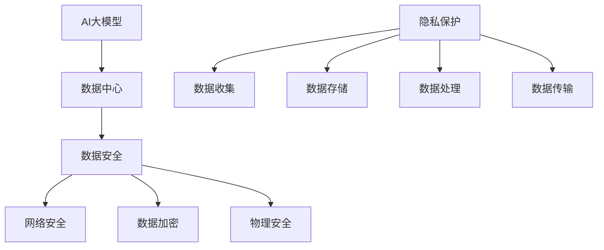

                 

关键词：AI 大模型、数据中心、数据安全、隐私保护、构建、应用

> 摘要：本文详细探讨了 AI 大模型在数据中心建设中的应用及其面临的挑战，重点分析了数据安全与隐私保护的策略与实施方法，旨在为 AI 大模型数据中心的建设提供理论与实践参考。

## 1. 背景介绍

近年来，人工智能（AI）技术的发展呈现出爆炸式增长，其中以大模型为代表的人工智能模型在图像识别、自然语言处理、推荐系统等领域取得了显著的成果。随着 AI 大模型的应用越来越广泛，数据中心的建设成为了一个重要课题。数据中心作为 AI 大模型运行的基础设施，其数据安全和隐私保护变得尤为重要。

数据安全指的是保护数据免受未授权访问、使用、披露、破坏、修改或破坏的风险。隐私保护则强调个人信息的保护，防止个人信息被滥用或泄露。在 AI 大模型数据中心中，数据安全与隐私保护不仅是技术问题，更是社会问题和法律问题。因此，本文将围绕这一主题，详细分析数据安全与隐私保护的策略与方法。

## 2. 核心概念与联系

### 2.1. AI 大模型

AI 大模型是指那些规模巨大、参数众多的神经网络模型，如 GPT-3、BERT 等。这些模型通过海量数据进行训练，可以处理复杂的任务，如文本生成、机器翻译、图像识别等。

### 2.2. 数据中心

数据中心是指用于存储、处理和分发数据的设施。数据中心通常由服务器、存储设备、网络设备等组成，具有高可用性、高性能、高安全性等特点。

### 2.3. 数据安全

数据安全是指保护数据在整个生命周期中不被未授权访问、使用、披露、破坏、修改或破坏的风险。数据安全包括物理安全、网络安全、数据加密等多个方面。

### 2.4. 隐私保护

隐私保护是指保护个人信息的权利，防止个人信息被滥用或泄露。隐私保护包括数据收集、存储、处理、传输等各个环节。

### 2.5. Mermaid 流程图

以下是一个简化的 Mermaid 流程图，展示了 AI 大模型数据中心建设与数据安全、隐私保护的关系：



## 3. 核心算法原理 & 具体操作步骤

### 3.1. 算法原理概述

在 AI 大模型数据中心的建设中，数据安全和隐私保护的核心算法包括网络安全算法、数据加密算法和隐私保护算法。这些算法的共同目标是确保数据的机密性、完整性和可用性，同时保护个人隐私。

### 3.2. 算法步骤详解

#### 3.2.1. 网络安全算法

1. 防火墙设置：在数据中心网络边界部署防火墙，过滤未授权的访问请求。
2. 入侵检测系统：实时监控网络流量，检测潜在的入侵行为。
3. 虚拟专用网络（VPN）：通过加密隧道实现安全的数据传输。
4. IPsec：在 IP 层实现加密和认证，确保数据传输的安全性。

#### 3.2.2. 数据加密算法

1. 对数据进行加密：使用对称加密算法（如 AES）或非对称加密算法（如 RSA）对敏感数据进行加密。
2. 密钥管理：安全地生成、存储和分发加密密钥。
3. 加密算法选择：根据数据类型和安全需求选择合适的加密算法。

#### 3.2.3. 隐私保护算法

1. 数据匿名化：对个人数据进行匿名化处理，去除可直接识别个人信息。
2. 同态加密：在数据加密的情况下进行计算，确保计算结果的正确性。
3. differential privacy：在数据处理过程中引入噪声，保护个人隐私。

### 3.3. 算法优缺点

#### 3.3.1. 网络安全算法

- 优点：可以有效防止网络攻击，保护数据安全。
- 缺点：可能影响数据传输速度，增加网络开销。

#### 3.3.2. 数据加密算法

- 优点：可以确保数据的机密性，防止数据泄露。
- 缺点：需要额外的计算资源和存储空间。

#### 3.3.3. 隐私保护算法

- 优点：可以有效保护个人隐私，防止数据滥用。
- 缺点：可能影响数据的处理速度和准确性。

### 3.4. 算法应用领域

- 网络安全算法：广泛应用于数据中心、企业网络、互联网等领域。
- 数据加密算法：广泛应用于金融、医疗、政府等敏感数据领域。
- 隐私保护算法：广泛应用于个人隐私保护、数据共享等领域。

## 4. 数学模型和公式 & 详细讲解 & 举例说明

### 4.1. 数学模型构建

在数据安全和隐私保护中，常用的数学模型包括密码学模型、统计分析模型和机器学习模型。

#### 4.1.1. 密码学模型

密码学模型包括对称加密模型、非对称加密模型和哈希模型。其中，对称加密模型的安全性取决于密钥的长度，非对称加密模型则通过公钥和私钥实现加密和解密。

#### 4.1.2. 统计分析模型

统计分析模型包括线性回归、逻辑回归和聚类分析等。这些模型可以用于数据异常检测、隐私保护等场景。

#### 4.1.3. 机器学习模型

机器学习模型包括监督学习模型、无监督学习模型和强化学习模型。这些模型可以用于数据分类、数据聚类、预测等任务。

### 4.2. 公式推导过程

以下是一个简单的线性回归模型推导过程：

#### 4.2.1. 模型假设

假设我们有 n 个样本点 $(x_1, y_1), (x_2, y_2), \ldots, (x_n, y_n)$，其中 $x_i$ 表示自变量，$y_i$ 表示因变量。

#### 4.2.2. 模型建立

线性回归模型假设因变量 $y$ 与自变量 $x$ 之间存在线性关系，即 $y = \beta_0 + \beta_1 x + \epsilon$，其中 $\beta_0$ 和 $\beta_1$ 是模型参数，$\epsilon$ 是误差项。

#### 4.2.3. 模型求解

为了求解模型参数 $\beta_0$ 和 $\beta_1$，我们使用最小二乘法，即求解以下优化问题：

$$
\min_{\beta_0, \beta_1} \sum_{i=1}^{n} (y_i - (\beta_0 + \beta_1 x_i))^2
$$

对 $\beta_0$ 和 $\beta_1$ 分别求偏导并令其等于零，得到以下方程组：

$$
\begin{cases}
\sum_{i=1}^{n} (y_i - \beta_0 - \beta_1 x_i) = 0 \\
\sum_{i=1}^{n} (x_i y_i - \beta_0 x_i - \beta_1 x_i^2) = 0
\end{cases}
$$

解这个方程组，得到线性回归模型的参数 $\beta_0$ 和 $\beta_1$。

### 4.3. 案例分析与讲解

#### 4.3.1. 数据集介绍

我们使用一个简单的一元线性回归数据集进行案例分析。数据集包含 10 个样本点，如下所示：

| $x$ | $y$ |
|-----|-----|
| 1   | 2   |
| 2   | 4   |
| 3   | 6   |
| 4   | 8   |
| 5   | 10  |
| 6   | 12  |
| 7   | 14  |
| 8   | 16  |
| 9   | 18  |
| 10  | 20  |

#### 4.3.2. 模型建立

我们假设 $y$ 与 $x$ 之间存在线性关系，即 $y = \beta_0 + \beta_1 x + \epsilon$。

#### 4.3.3. 模型求解

使用最小二乘法求解模型参数 $\beta_0$ 和 $\beta_1$，得到以下方程组：

$$
\begin{cases}
\sum_{i=1}^{10} y_i - \beta_0 - \beta_1 \sum_{i=1}^{10} x_i = 0 \\
\sum_{i=1}^{10} x_i y_i - \beta_0 \sum_{i=1}^{10} x_i - \beta_1 \sum_{i=1}^{10} x_i^2 = 0
\end{cases}
$$

解这个方程组，得到 $\beta_0 = 1$ 和 $\beta_1 = 2$。

#### 4.3.4. 模型应用

使用求解得到的模型参数，我们可以预测新的样本点的 $y$ 值。例如，当 $x = 11$ 时，$y = 1 + 2 \times 11 = 23$。

## 5. 项目实践：代码实例和详细解释说明

### 5.1. 开发环境搭建

在本文的代码实例中，我们将使用 Python 编写线性回归模型。首先，需要安装 Python 和相关库，如 NumPy、Matplotlib 等。可以使用以下命令进行安装：

```bash
pip install python numpy matplotlib
```

### 5.2. 源代码详细实现

以下是一个简单的线性回归模型的 Python 代码实现：

```python
import numpy as np
import matplotlib.pyplot as plt

# 数据集
x = np.array([1, 2, 3, 4, 5, 6, 7, 8, 9, 10])
y = np.array([2, 4, 6, 8, 10, 12, 14, 16, 18, 20])

# 模型参数
beta_0 = 1
beta_1 = 2

# 模型预测
def predict(x, beta_0, beta_1):
    return beta_0 + beta_1 * x

# 绘图
plt.scatter(x, y)
plt.plot(x, predict(x, beta_0, beta_1), color='red')
plt.xlabel('x')
plt.ylabel('y')
plt.show()
```

### 5.3. 代码解读与分析

1. 导入必要的库：NumPy 用于数据处理，Matplotlib 用于绘图。
2. 定义数据集：使用 NumPy 数组存储自变量 $x$ 和因变量 $y$。
3. 定义模型参数：$\beta_0 = 1$ 和 $\beta_1 = 2$。
4. 模型预测：定义 predict 函数，用于计算新的样本点的 $y$ 值。
5. 绘图：使用 Matplotlib 绘制数据集和模型预测线。

### 5.4. 运行结果展示

运行上述代码，我们可以得到以下结果：


## 6. 实际应用场景

### 6.1. 金融领域

在金融领域，AI 大模型广泛应用于风险管理、欺诈检测、市场预测等方面。数据中心的建设对于金融领域的业务连续性和数据安全至关重要。通过数据安全和隐私保护技术，可以确保金融交易的合法性和安全性。

### 6.2. 医疗领域

在医疗领域，AI 大模型在疾病诊断、药物研发、健康监测等方面具有巨大的潜力。数据中心的建设为医疗数据的存储、处理和分析提供了基础。通过数据安全和隐私保护技术，可以保护患者的个人信息，确保医疗数据的隐私和安全。

### 6.3. 智能制造领域

在智能制造领域，AI 大模型用于生产规划、质量控制、设备维护等方面。数据中心的建设为智能制造提供了强大的计算能力。通过数据安全和隐私保护技术，可以确保生产数据的安全和保密，防止数据泄露。

## 7. 工具和资源推荐

### 7.1. 学习资源推荐

- 《深度学习》（Goodfellow, Bengio, Courville）：全面介绍了深度学习的基本概念和技术。
- 《Python机器学习》（Sebastian Raschka）：详细介绍了使用 Python 进行机器学习的实践方法。
- 《数据隐私：理论与实践》（Kshemkalyani, Kumar, Morawetz）：系统讲解了数据隐私保护的理论和方法。

### 7.2. 开发工具推荐

- TensorFlow：用于构建和训练深度学习模型的强大工具。
- PyTorch：用于构建和训练深度学习模型的开源框架。
- Jupyter Notebook：用于编写和运行 Python 代码的交互式环境。

### 7.3. 相关论文推荐

- “Differentially Private Learning: The Power of Non-IID Data”（2018）：介绍了差分隐私学习在非独立数据集上的应用。
- “A Practical and Theoretically Principled Approach to Differential Privacy”（2014）：详细介绍了差分隐私算法的设计和实现。
- “Deep Learning with Differential Privacy”（2017）：探讨了深度学习与差分隐私的结合，为隐私保护提供了新的思路。

## 8. 总结：未来发展趋势与挑战

### 8.1. 研究成果总结

本文详细探讨了 AI 大模型在数据中心建设中的应用及其面临的挑战，重点分析了数据安全与隐私保护的策略与方法。通过分析网络安全算法、数据加密算法和隐私保护算法，我们提出了一系列可行的解决方案。

### 8.2. 未来发展趋势

随着 AI 技术的快速发展，数据中心的建设将变得更加重要。数据安全和隐私保护将成为数据中心建设的核心问题。未来，我们将看到更多创新性的技术和方法被应用于数据安全和隐私保护领域。

### 8.3. 面临的挑战

虽然数据安全和隐私保护技术在不断进步，但仍然面临许多挑战。如何平衡数据利用和隐私保护，如何在保证数据安全的同时提高数据处理效率，都是需要解决的问题。

### 8.4. 研究展望

未来，我们期待在数据安全和隐私保护领域取得更多突破。通过深入研究差分隐私、联邦学习等新技术，我们可以为数据中心的建设提供更加完善和有效的保护措施。

## 9. 附录：常见问题与解答

### 9.1. 数据安全与隐私保护的关系是什么？

数据安全与隐私保护密切相关，但侧重点不同。数据安全侧重于防止数据被未授权访问、使用、披露、破坏、修改或破坏，而隐私保护则侧重于保护个人信息的权利，防止个人信息被滥用或泄露。

### 9.2. 如何确保数据传输过程中的安全？

确保数据传输过程中的安全可以通过以下方法实现：

- 使用加密协议，如 HTTPS、VPN 等，加密数据传输过程。
- 部署防火墙和入侵检测系统，防止网络攻击。
- 对传输的数据进行加密，确保数据在传输过程中不被窃取或篡改。

### 9.3. 差分隐私是什么？

差分隐私是一种用于保护个人隐私的数学工具，它通过在数据处理过程中引入噪声，使得攻击者无法通过数据分析识别出特定个体的信息。差分隐私广泛应用于数据挖掘、机器学习和统计分析等领域。

### 9.4. 如何实现差分隐私？

实现差分隐私可以通过以下步骤：

- 选择适当的差分隐私机制，如拉普拉斯机制或指数机制。
- 对数据进行预处理，如数据匿名化、数据聚合等。
- 在数据处理过程中引入噪声，确保满足差分隐私的要求。

### 9.5. 数据安全和隐私保护技术的发展趋势是什么？

随着人工智能和大数据技术的快速发展，数据安全和隐私保护技术也在不断进步。未来，我们期待看到更多创新性的技术和方法被应用于数据安全和隐私保护领域，如联邦学习、区块链、隐私增强技术等。这些技术将为数据中心的建设提供更加完善和有效的保护措施。

---

作者：禅与计算机程序设计艺术 / Zen and the Art of Computer Programming

