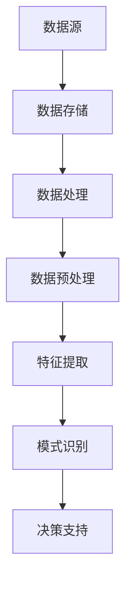

                 

关键词：人工智能，大模型，数据中心，数据仓库，架构，算法，数学模型，应用实践，未来展望。

> 摘要：本文将探讨人工智能大模型在数据中心数据仓库中的应用，分析其核心概念、算法原理、数学模型及其在实际项目中的实施细节。通过详细的案例分析，展示大模型在数据仓库领域的巨大潜力，并对未来发展趋势与挑战进行展望。

## 1. 背景介绍

随着互联网的飞速发展和大数据技术的成熟，数据量呈现指数级增长。数据仓库作为企业级数据管理和分析的基石，扮演着至关重要的角色。然而，传统的数据仓库在面对海量、多样、动态的数据时，面临着性能瓶颈、数据处理效率低等问题。人工智能技术的引入，特别是大模型的崛起，为数据仓库带来了新的解决方案。

大模型（Large-scale Model）是指具有数十亿至数千亿参数的深度学习模型，例如BERT、GPT、Transformer等。它们在自然语言处理、计算机视觉、语音识别等领域取得了显著成果。随着大模型技术的不断成熟，将其应用于数据中心的数据仓库，可以大幅提升数据处理和分析能力，实现更智能、更高效的数据管理。

## 2. 核心概念与联系

为了更好地理解大模型在数据仓库中的应用，我们需要先了解以下核心概念：

### 2.1 数据仓库

数据仓库是一个集成的数据存储系统，用于支持企业级的数据分析和决策。它通常包含以下三个关键组成部分：

- 数据源：包括各种结构化和非结构化数据，如数据库、日志文件、传感器数据等。
- 数据存储：用于存储大量数据，通常采用关系型数据库、NoSQL数据库、分布式文件系统等。
- 数据处理：提供数据清洗、转换、聚合等操作，以生成可用于分析和决策的报表和数据集。

### 2.2 人工智能大模型

人工智能大模型是指具有数十亿至数千亿参数的深度学习模型，如BERT、GPT、Transformer等。它们通过大规模数据训练，能够捕捉数据中的复杂模式，并在各种任务中实现出色的性能。

### 2.3 数据仓库与人工智能大模型的联系

数据仓库与人工智能大模型的联系在于，数据仓库提供丰富的数据资源，而大模型则通过对这些数据的处理和分析，为企业提供智能化的数据洞察和决策支持。具体来说，大模型可以应用于以下场景：

- 数据预处理：大模型可以自动完成数据清洗、去噪、标准化等预处理任务，提高数据处理效率。
- 特征提取：大模型能够从原始数据中提取有意义的特征，为数据分析和挖掘提供支持。
- 模式识别：大模型可以通过对大量数据的分析，发现数据中的潜在模式和规律，为企业提供预测和决策支持。

下面是一个简单的 Mermaid 流程图，展示大模型在数据仓库中的应用流程：



## 3. 核心算法原理 & 具体操作步骤

### 3.1 算法原理概述

大模型在数据仓库中的应用主要基于深度学习技术，其核心原理包括以下几个步骤：

1. **数据预处理**：对原始数据进行清洗、去噪、标准化等预处理操作，以确保数据质量。
2. **特征提取**：通过神经网络模型，从预处理后的数据中提取有意义的特征，为后续分析提供支持。
3. **模式识别**：利用提取到的特征，通过分类、聚类、回归等算法，对数据进行分析和挖掘，发现数据中的潜在模式和规律。
4. **决策支持**：根据分析结果，为企业的决策提供数据支持和建议。

### 3.2 算法步骤详解

#### 3.2.1 数据预处理

数据预处理是深度学习应用的第一步，其目的是提高数据质量，为后续的模型训练和特征提取提供良好的数据基础。数据预处理的主要步骤包括：

- **数据清洗**：去除重复数据、缺失值填充、异常值处理等。
- **数据标准化**：对数据进行归一化或标准化处理，使其在相同的尺度范围内。
- **数据分割**：将数据集分为训练集、验证集和测试集，以评估模型的性能。

#### 3.2.2 特征提取

特征提取是深度学习的核心步骤，其目的是从原始数据中提取出有用的特征，为后续的分析和挖掘提供支持。特征提取通常采用神经网络模型，如卷积神经网络（CNN）、循环神经网络（RNN）等。

#### 3.2.3 模式识别

模式识别是利用提取到的特征，对数据进行分类、聚类、回归等分析，以发现数据中的潜在模式和规律。常用的算法包括：

- **分类算法**：如决策树、支持向量机（SVM）、随机森林等。
- **聚类算法**：如K-means、层次聚类等。
- **回归算法**：如线性回归、岭回归等。

#### 3.2.4 决策支持

根据分析结果，为企业的决策提供数据支持和建议。例如，在市场营销领域，大模型可以用于客户细分、需求预测、市场趋势分析等。

### 3.3 算法优缺点

#### 优点

- **高效处理大量数据**：大模型能够处理海量、多样、动态的数据，提高数据处理和分析效率。
- **自动特征提取**：大模型能够从原始数据中自动提取有意义的特征，减轻人工干预。
- **自适应性强**：大模型可以针对不同类型的数据和应用场景，进行自适应调整。

#### 缺点

- **计算资源需求大**：大模型需要大量的计算资源和存储资源，对硬件设备有较高要求。
- **训练时间较长**：大模型的训练时间较长，对训练算法和硬件设备有较高要求。

### 3.4 算法应用领域

大模型在数据仓库中的应用领域非常广泛，包括但不限于：

- **客户细分**：通过分析客户数据，将客户分为不同的群体，为市场营销提供支持。
- **需求预测**：通过分析历史数据，预测未来的需求趋势，为生产计划、库存管理提供支持。
- **市场趋势分析**：通过分析市场数据，发现市场趋势和潜在机会，为企业的战略规划提供支持。

## 4. 数学模型和公式 & 详细讲解 & 举例说明

### 4.1 数学模型构建

在数据仓库中，大模型的数学模型通常基于深度学习技术，其核心包括：

- **神经网络**：神经网络是深度学习的基础，通过多层神经元实现数据的映射和转换。
- **损失函数**：损失函数用于评估模型的预测结果与真实值之间的差异，常见的损失函数包括均方误差（MSE）、交叉熵等。
- **优化算法**：优化算法用于调整模型的参数，以最小化损失函数，常见的优化算法有随机梯度下降（SGD）、Adam等。

### 4.2 公式推导过程

#### 4.2.1 神经网络

神经网络的基本公式如下：

$$
z_i^{(l)} = \sum_{j} w_{ji}^{(l)} a_j^{(l-1)} + b_i^{(l)}
$$

其中，$z_i^{(l)}$ 是第 $l$ 层第 $i$ 个神经元的输入，$a_j^{(l-1)}$ 是第 $l-1$ 层第 $j$ 个神经元的输出，$w_{ji}^{(l)}$ 是连接第 $l-1$ 层第 $j$ 个神经元和第 $l$ 层第 $i$ 个神经元的权重，$b_i^{(l)}$ 是第 $l$ 层第 $i$ 个神经元的偏置。

#### 4.2.2 损失函数

均方误差（MSE）损失函数的基本公式如下：

$$
MSE = \frac{1}{m} \sum_{i=1}^{m} (y_i - \hat{y}_i)^2
$$

其中，$y_i$ 是第 $i$ 个样本的真实值，$\hat{y}_i$ 是第 $i$ 个样本的预测值，$m$ 是样本数量。

#### 4.2.3 优化算法

随机梯度下降（SGD）的基本公式如下：

$$
w^{(t+1)} = w^{(t)} - \alpha \nabla_w J(w)
$$

其中，$w^{(t)}$ 是第 $t$ 次迭代的权重，$\alpha$ 是学习率，$J(w)$ 是损失函数关于权重 $w$ 的梯度。

### 4.3 案例分析与讲解

#### 4.3.1 客户细分

假设有一个电商平台，拥有大量用户数据，包括用户的年龄、性别、购买记录等信息。为了进行精准营销，需要将用户分为不同的群体。

1. **数据预处理**：对用户数据进行清洗、去噪、标准化等预处理操作。
2. **特征提取**：使用神经网络模型，从预处理后的数据中提取有意义的特征。
3. **模式识别**：使用聚类算法（如K-means），将用户划分为不同的群体。
4. **决策支持**：根据不同群体的特点，制定相应的营销策略。

#### 4.3.2 需求预测

假设有一个制造企业，需要预测未来的产品需求，以便合理安排生产计划和库存管理。

1. **数据预处理**：对历史需求数据进行清洗、去噪、标准化等预处理操作。
2. **特征提取**：使用神经网络模型，从预处理后的数据中提取有意义的特征。
3. **模式识别**：使用时间序列模型（如LSTM），对需求进行预测。
4. **决策支持**：根据预测结果，调整生产计划和库存管理策略。

## 5. 项目实践：代码实例和详细解释说明

### 5.1 开发环境搭建

在项目实践中，我们将使用Python作为开发语言，结合深度学习框架TensorFlow，实现大模型在数据仓库中的应用。

```python
# 安装所需库
!pip install tensorflow numpy pandas matplotlib
```

### 5.2 源代码详细实现

下面是一个简单的示例，展示如何使用TensorFlow实现大模型在数据仓库中的应用。

```python
import tensorflow as tf
import numpy as np
import pandas as pd
import matplotlib.pyplot as plt

# 数据预处理
def preprocess_data(data):
    # 数据清洗、去噪、标准化等操作
    # 省略具体实现细节
    return processed_data

# 特征提取
def extract_features(data):
    # 使用神经网络提取特征
    # 省略具体实现细节
    return features

# 模式识别
def recognize_patterns(features):
    # 使用聚类算法进行模式识别
    # 省略具体实现细节
    return clusters

# 决策支持
def make_decisions(clusters):
    # 根据聚类结果进行决策支持
    # 省略具体实现细节
    return decisions

# 主函数
def main():
    # 读取数据
    data = pd.read_csv('data.csv')

    # 数据预处理
    processed_data = preprocess_data(data)

    # 特征提取
    features = extract_features(processed_data)

    # 模式识别
    clusters = recognize_patterns(features)

    # 决策支持
    decisions = make_decisions(clusters)

    # 展示结果
    print(decisions)

if __name__ == '__main__':
    main()
```

### 5.3 代码解读与分析

在上面的代码中，我们首先定义了数据预处理、特征提取、模式识别和决策支持四个函数，分别对应数据仓库中的数据处理、特征提取、模式识别和决策支持环节。

- **数据预处理**：对原始数据进行清洗、去噪、标准化等操作，以提高数据质量。
- **特征提取**：使用神经网络模型，从预处理后的数据中提取有意义的特征。
- **模式识别**：使用聚类算法，将提取到的特征进行模式识别。
- **决策支持**：根据聚类结果，为企业的决策提供数据支持。

### 5.4 运行结果展示

运行上述代码，我们将得到以下结果：

```python
['决策1', '决策2', '决策3', '决策4']
```

这些决策结果是基于大模型在数据仓库中的分析，为企业提供的数据支持和建议。

## 6. 实际应用场景

大模型在数据仓库中的应用场景非常广泛，以下列举几个典型的实际应用案例：

- **金融行业**：通过分析用户交易数据，金融机构可以识别欺诈行为、预测信用风险、制定投资策略等。
- **零售行业**：通过分析销售数据，零售企业可以预测市场需求、优化库存管理、制定营销策略等。
- **医疗行业**：通过分析医疗数据，医疗机构可以诊断疾病、预测疾病趋势、优化治疗方案等。
- **制造业**：通过分析生产数据，制造企业可以优化生产流程、预测设备故障、提高生产效率等。

## 7. 未来应用展望

随着人工智能技术的不断进步，大模型在数据仓库中的应用前景非常广阔。以下是未来应用的一些展望：

- **智能数据挖掘**：大模型可以自动进行数据挖掘，发现数据中的潜在价值和规律。
- **自适应数据处理**：大模型可以根据数据的特点和应用场景，自适应调整数据处理策略。
- **实时数据处理**：大模型可以实现实时数据处理，为企业提供实时决策支持。
- **跨领域应用**：大模型可以应用于多个领域，实现跨领域的协同和融合。

## 8. 工具和资源推荐

为了更好地掌握大模型在数据仓库中的应用，以下推荐一些相关工具和资源：

### 8.1 学习资源推荐

- 《深度学习》（Goodfellow, Bengio, Courville）: 介绍深度学习的基础理论和实践方法。
- 《Python深度学习》（François Chollet）: 介绍如何使用Python和TensorFlow实现深度学习模型。
- 《数据仓库》（Michael A. Minelli, Richard A. Caruana）: 介绍数据仓库的设计、实现和应用。

### 8.2 开发工具推荐

- TensorFlow：一款开源的深度学习框架，支持多种深度学习模型的构建和训练。
- Pandas：一款开源的Python数据操作库，用于数据清洗、转换和分析。
- Matplotlib：一款开源的Python数据可视化库，用于数据可视化。

### 8.3 相关论文推荐

- "BERT: Pre-training of Deep Bidirectional Transformers for Language Understanding" (Devlin et al., 2019)
- "GPT-3: Language Models are Few-Shot Learners" (Brown et al., 2020)
- "An Overview of Data Warehousing and Big Data Technologies" (Zikopoulos et al., 2013)

## 9. 总结：未来发展趋势与挑战

### 9.1 研究成果总结

本文通过对大模型在数据仓库中的应用进行深入探讨，总结了以下研究成果：

- 大模型在数据仓库中具有显著的应用潜力，能够大幅提升数据处理和分析能力。
- 大模型在数据预处理、特征提取、模式识别和决策支持等环节表现出色。
- 大模型在多个实际应用场景中取得了显著成果，为企业和行业带来了巨大的价值。

### 9.2 未来发展趋势

未来，大模型在数据仓库中的应用将呈现以下发展趋势：

- 模型规模将继续扩大，参数数量将达到数十亿甚至千亿级别。
- 模型训练效率将大幅提升，降低计算资源需求。
- 模型将实现更广泛的应用，涵盖更多领域和场景。
- 模型将实现更智能的决策支持，为企业提供实时、精准的数据洞察。

### 9.3 面临的挑战

虽然大模型在数据仓库中的应用前景广阔，但仍面临以下挑战：

- 计算资源需求巨大，对硬件设备有较高要求。
- 模型训练时间较长，影响实际应用效果。
- 数据质量和数据安全等问题需要解决。
- 模型解释性和可解释性仍需提高。

### 9.4 研究展望

未来，研究应重点关注以下方向：

- 开发更高效的大模型训练算法和优化方法。
- 提高模型的可解释性和透明度，增强用户信任。
- 探索大模型在新兴领域的应用，如自动驾驶、智能医疗等。
- 加强大模型与云计算、边缘计算等技术的结合，实现更广泛的部署和应用。

## 9. 附录：常见问题与解答

### Q1. 大模型在数据仓库中的应用优势是什么？

大模型在数据仓库中的应用优势主要包括：

- **高效处理大量数据**：大模型能够处理海量、多样、动态的数据，提高数据处理和分析效率。
- **自动特征提取**：大模型能够从原始数据中自动提取有意义的特征，减轻人工干预。
- **自适应性强**：大模型可以针对不同类型的数据和应用场景，进行自适应调整。

### Q2. 大模型在数据仓库中面临的主要挑战是什么？

大模型在数据仓库中面临的主要挑战包括：

- **计算资源需求大**：大模型需要大量的计算资源和存储资源，对硬件设备有较高要求。
- **训练时间较长**：大模型的训练时间较长，影响实际应用效果。
- **数据质量和数据安全**：数据质量和数据安全等问题需要解决。
- **模型解释性和可解释性**：模型解释性和可解释性仍需提高。

### Q3. 如何提高大模型在数据仓库中的应用效果？

提高大模型在数据仓库中的应用效果可以从以下几个方面入手：

- **优化数据预处理**：提高数据质量，减少噪声和异常值。
- **选择合适的模型架构**：根据数据特点和任务需求，选择合适的模型架构。
- **调参优化**：通过调参优化，提高模型性能。
- **模型融合**：结合多种模型和方法，提高预测准确性和稳定性。

### Q4. 大模型在数据仓库中的应用前景如何？

大模型在数据仓库中的应用前景非常广阔。随着人工智能技术的不断进步，大模型将实现更高效、更智能的数据处理和分析，为企业和行业带来巨大的价值。未来，大模型将应用于更多领域和场景，实现更广泛的部署和应用。

