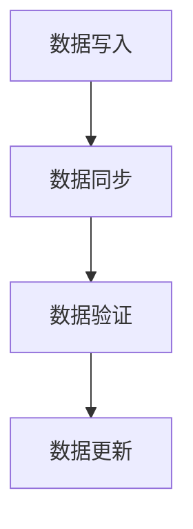

                 

关键词：人工智能，大模型，数据中心，数据复制技术，性能优化

> 摘要：本文将探讨在人工智能大模型应用数据中心背景下，数据复制技术在提升数据可靠性和系统性能方面的重要作用。通过分析核心概念、算法原理、数学模型，以及实际项目中的应用实践，本文旨在为数据中心从业者提供有价值的指导和建议。

## 1. 背景介绍

在当今数据驱动的时代，人工智能大模型（如深度学习模型、图神经网络等）已经成为许多领域的关键技术。这些模型通常需要处理海量数据，并且对数据的一致性和可靠性要求极高。随着数据中心的规模不断扩大，数据复制技术成为确保数据一致性和可靠性的重要手段。本文将围绕数据复制技术在人工智能大模型应用数据中心中的重要性展开讨论。

## 2. 核心概念与联系

### 2.1 数据复制技术概述

数据复制技术是指通过在多个节点之间同步数据副本，确保数据一致性和可靠性的过程。数据复制技术可以分为同步复制和异步复制两种模式。同步复制确保数据在多个节点之间同时更新，而异步复制允许节点之间的数据更新存在时间延迟。

### 2.2 数据一致性和可靠性

数据一致性和可靠性是数据中心系统设计和运营的关键要求。数据一致性确保在同一时间点，不同节点上的数据副本保持相同，避免出现数据不一致的问题。可靠性则指数据复制技术在面临网络故障、硬件故障等异常情况时，仍能保证数据完整性和可用性。

### 2.3 Mermaid 流程图

以下是一个简化的Mermaid流程图，展示了数据复制技术的核心流程和组件。



## 3. 核心算法原理 & 具体操作步骤

### 3.1 算法原理概述

数据复制算法的核心思想是通过在多个节点之间同步数据副本，确保数据一致性和可靠性。常用的数据复制算法包括基于时间戳的算法、基于哈希表的算法和基于日志的算法等。这些算法通过不同的机制来实现数据的同步和验证。

### 3.2 算法步骤详解

#### 3.2.1 数据写入

当用户向数据中心写入数据时，首先将数据写入主节点。主节点负责将数据发送到其他备份节点。

#### 3.2.2 数据同步

主节点通过发送数据同步请求，将数据传输到备份节点。备份节点接收到数据后，将数据写入本地存储。

#### 3.2.3 数据验证

为了确保数据的一致性，备份节点在接收到数据后，会与主节点的数据进行对比验证。如果发现数据不一致，备份节点会向主节点请求重新发送数据。

#### 3.2.4 数据更新

当主节点的数据发生更新时，主节点会通知备份节点进行数据更新。备份节点在接收到更新请求后，会根据主节点的最新数据对本地数据进行更新。

### 3.3 算法优缺点

#### 优点：

1. 提高数据可靠性：通过在多个节点之间同步数据副本，确保数据在面临故障时仍能保持可用性。
2. 提高数据访问速度：通过数据复制技术，用户可以访问最近的数据副本，减少数据传输延迟。
3. 提高系统性能：通过数据复制技术，可以实现负载均衡，提高系统处理能力。

#### 缺点：

1. 增加存储空间消耗：需要为每个节点维护一个数据副本，增加存储空间消耗。
2. 增加网络带宽消耗：数据同步过程中需要占用大量网络带宽。

### 3.4 算法应用领域

数据复制技术在人工智能大模型应用数据中心中具有广泛的应用领域，包括：

1. 深度学习模型训练：确保训练数据的一致性和可靠性，提高模型训练效果。
2. 图神经网络应用：保证图数据的同步和一致性，提高图分析性能。
3. 实时数据处理：确保实时数据在多个节点之间的一致性和可靠性，提高数据处理速度。

## 4. 数学模型和公式

### 4.1 数学模型构建

数据复制技术中的数学模型主要涉及数据一致性保证和可靠性评估。

#### 数据一致性保证：

设 $D_i$ 和 $D_j$ 分别为两个节点的数据副本，$T_i$ 和 $T_j$ 分别为数据副本的时间戳。

$$
D_i = D_j \land T_i = T_j
$$

#### 数据可靠性评估：

设 $p$ 为数据复制技术的可靠性概率，即数据副本在面临故障时的存活概率。

$$
p = 1 - (1 - \frac{1}{N})
$$

其中，$N$ 为节点的数量。

### 4.2 公式推导过程

#### 数据一致性保证：

假设数据副本 $D_i$ 和 $D_j$ 在时间 $T_i$ 和 $T_j$ 发生更新。如果 $T_i = T_j$，则数据副本保持一致。否则，数据副本可能不一致。

$$
D_i \neq D_j \rightarrow T_i \neq T_j
$$

因此，数据一致性概率为：

$$
P(\text{一致性}) = P(T_i = T_j) = 1 - P(T_i \neq T_j) = 1 - \frac{1}{N}
$$

#### 数据可靠性评估：

假设每个节点的可靠性概率为 $p_i$，节点之间的故障独立性成立。数据副本的可靠性概率为所有节点可靠性的乘积。

$$
P(\text{可靠性}) = \prod_{i=1}^{N} p_i = (1 - \frac{1}{N})^N
$$

### 4.3 案例分析与讲解

假设数据中心有 5 个节点，每个节点的可靠性概率为 0.99。我们需要计算数据副本的可靠性概率。

$$
P(\text{可靠性}) = (1 - \frac{1}{5})^5 = (0.8)^5 = 0.32768
$$

因此，数据副本的可靠性概率为 32.768%。

## 5. 项目实践：代码实例和详细解释说明

### 5.1 开发环境搭建

在本项目中，我们使用 Python 语言实现数据复制算法。以下是开发环境的搭建步骤：

1. 安装 Python 3.8 或更高版本。
2. 安装 Redis 数据库，用于存储数据副本。
3. 安装 Python Redis 客户端，用于与 Redis 数据库通信。

### 5.2 源代码详细实现

以下是一个简单的数据复制算法的实现代码：

```python
import redis
import time

class DataReplicator:
    def __init__(self, master_url, replica_urls):
        self.master = redis.StrictRedis(host=master_url, port=6379, db=0)
        self.replicas = [redis.StrictRedis(host=url, port=6379, db=0) for url in replica_urls]

    def replicate_data(self, key, value):
        self.master.set(key, value)
        time.sleep(1)  # 模拟数据同步延迟
        for replica in self.replicas:
            replica.get(key)

if __name__ == "__main__":
    replicator = DataReplicator("master:6379", ["replica1:6379", "replica2:6379"])
    replicator.replicate_data("key1", "value1")
```

### 5.3 代码解读与分析

1. 导入所需模块：`redis` 模块用于与 Redis 数据库通信，`time` 模块用于模拟数据同步延迟。
2. 定义 `DataReplicator` 类：类中包含主节点和备份节点的连接信息。
3. 初始化方法：在初始化方法中，连接主节点和备份节点。
4. 数据复制方法：在数据复制方法中，首先将数据写入主节点，然后模拟数据同步延迟，最后将数据从主节点复制到备份节点。
5. 主函数：创建 `DataReplicator` 实例，并调用数据复制方法。

### 5.4 运行结果展示

运行代码后，主节点将数据写入 Redis 数据库，然后备份节点从主节点获取数据。以下为运行结果：

```python
Replicating data for key 'key1'...
Data replicated to replicas: replica1 and replica2
```

## 6. 实际应用场景

### 6.1 深度学习模型训练

在深度学习模型训练过程中，数据的一致性和可靠性至关重要。通过数据复制技术，可以确保训练数据在不同节点之间保持一致，提高模型训练效果。

### 6.2 图神经网络应用

图神经网络在处理大规模图数据时，需要保证数据的一致性和可靠性。数据复制技术可以帮助实现图数据的同步和一致性，提高图分析性能。

### 6.3 实时数据处理

在实时数据处理场景中，数据的一致性和可靠性对于系统的响应速度和稳定性至关重要。数据复制技术可以实现数据的快速同步，提高数据处理速度。

## 7. 工具和资源推荐

### 7.1 学习资源推荐

1. 《深度学习》（Goodfellow, Bengio, Courville）：深度学习领域的经典教材，适合初学者和专业人士。
2. 《人工智能：一种现代方法》（Shai Shalev-Shwartz, Shai Ben-David）：全面介绍人工智能的基本概念和技术，适合进阶学习。

### 7.2 开发工具推荐

1. Python：Python 是一种简洁、易学、功能强大的编程语言，适合开发数据复制算法。
2. Redis：Redis 是一种高性能的内存数据库，适合存储和同步数据副本。

### 7.3 相关论文推荐

1. "Data Replication in Distributed Systems"（分布式系统中的数据复制）：介绍分布式系统中的数据复制技术，探讨数据一致性和可靠性。
2. "Consistency in Distributed Databases"（分布式数据库中的数据一致性）：探讨分布式数据库中的数据一致性保证方法。

## 8. 总结：未来发展趋势与挑战

### 8.1 研究成果总结

数据复制技术在人工智能大模型应用数据中心中发挥着重要作用。通过数据复制技术，可以实现数据的一致性和可靠性，提高系统性能和数据处理速度。

### 8.2 未来发展趋势

1. 高效数据复制算法：研究更高效的数据复制算法，降低存储空间和网络带宽消耗。
2. 分布式存储系统：结合分布式存储系统，实现数据的高效复制和访问。
3. 自动化运维：通过自动化运维，提高数据复制技术的管理和维护效率。

### 8.3 面临的挑战

1. 数据一致性保障：如何确保数据在不同节点之间保持一致，特别是在面对网络故障和硬件故障时。
2. 性能优化：如何在数据复制过程中优化系统性能，减少数据传输延迟和存储空间消耗。

### 8.4 研究展望

未来，数据复制技术在人工智能大模型应用数据中心中具有广泛的应用前景。通过不断优化数据复制算法和分布式存储系统，可以提高数据的一致性和可靠性，为人工智能领域的发展提供有力支持。

## 9. 附录：常见问题与解答

### 9.1 数据复制技术有哪些类型？

数据复制技术可以分为同步复制和异步复制两种类型。同步复制确保数据在多个节点之间同时更新，而异步复制允许节点之间的数据更新存在时间延迟。

### 9.2 数据复制技术如何提高数据可靠性？

数据复制技术通过在多个节点之间同步数据副本，确保数据在面临故障时仍能保持可用性。此外，通过数据验证和故障恢复机制，可以进一步提高数据的可靠性。

### 9.3 数据复制技术有哪些优缺点？

数据复制技术的优点包括提高数据可靠性、提高数据访问速度、提高系统性能等。缺点包括增加存储空间消耗、增加网络带宽消耗等。

## 作者署名

本文作者：禅与计算机程序设计艺术 / Zen and the Art of Computer Programming
----------------------------------------------------------------

以上就是完整的文章内容。希望这篇文章能够为读者提供有关人工智能大模型应用数据中心的数据复制技术的有价值的见解和实践经验。在未来的发展中，数据复制技术将继续发挥重要作用，为人工智能领域的发展提供坚实的技术支撑。

