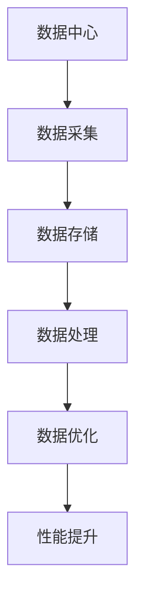

                 

关键词：AI 大模型、数据中心、数据管理、性能优化、安全性、分布式架构、机器学习、深度学习

> 摘要：本文旨在探讨 AI 大模型在数据中心的数据管理方法，包括数据采集、存储、处理和优化等方面。通过介绍当前主流的技术手段和解决方案，分析其在性能、安全性和扩展性等方面的优缺点，为 AI 大模型的数据管理提供参考和指导。

## 1. 背景介绍

随着人工智能技术的快速发展，AI 大模型的应用越来越广泛。从自然语言处理、计算机视觉到推荐系统，AI 大模型已经成为了推动各行业进步的重要力量。然而，AI 大模型的训练和应用需要大量的数据支持，这就对数据中心的数据管理提出了更高的要求。

数据中心的数据管理包括数据的采集、存储、处理和优化等多个环节。在 AI 大模型的应用中，数据的质量和完整性对模型的性能和效果有着至关重要的影响。因此，如何有效地管理数据中心的数据，提高数据的可用性和可靠性，成为了当前 AI 领域研究的热点问题。

## 2. 核心概念与联系

为了更好地理解 AI 大模型在数据中心的数据管理，我们首先需要了解一些核心概念和它们之间的联系。

### 2.1 数据中心

数据中心（Data Center）是一个专门用于存储、处理和交换数据的建筑或设施。它通常包括服务器、存储设备、网络设备和冷却系统等。数据中心是实现 AI 大模型数据管理的基础设施。

### 2.2 数据采集

数据采集（Data Collection）是指从各种数据源（如传感器、数据库、互联网等）收集数据的过程。在 AI 大模型训练过程中，数据采集是至关重要的，因为数据的多样性、质量和完整性直接影响模型的性能。

### 2.3 数据存储

数据存储（Data Storage）是指将数据保存在持久性存储介质（如硬盘、磁盘阵列、云存储等）中的过程。数据存储不仅要保证数据的可靠性，还要考虑存储空间的利用率和访问速度。

### 2.4 数据处理

数据处理（Data Processing）是指对采集到的数据进行清洗、转换、分析等操作的过程。数据处理是数据管理的重要环节，它直接影响到数据的可用性和模型的性能。

### 2.5 数据优化

数据优化（Data Optimization）是指通过压缩、去重、分片等技术手段提高数据的存储效率和访问速度。数据优化是提升数据中心性能的重要手段。

### 2.6 Mermaid 流程图



## 3. 核心算法原理 & 具体操作步骤

### 3.1 算法原理概述

数据管理算法的核心目标是提高数据的可用性、可靠性和性能。常见的数据管理算法包括数据压缩、去重、分片、缓存等。

- **数据压缩**：通过将相同或相似的数据进行压缩，减少存储空间和提高访问速度。
- **去重**：检测并删除重复的数据，提高数据的准确性和利用率。
- **分片**：将大量数据划分成多个小数据块，分布存储在不同的节点上，提高数据访问速度和系统扩展性。
- **缓存**：将频繁访问的数据存储在内存中，加快数据访问速度。

### 3.2 算法步骤详解

1. **数据采集**：使用传感器、爬虫、API 等方式从各种数据源采集数据。
2. **数据清洗**：对采集到的数据进行去噪、去重、格式转换等处理，保证数据的质量。
3. **数据存储**：将处理后的数据存储到数据库、文件系统、云存储等介质中。
4. **数据压缩**：对存储的数据进行压缩，提高存储空间的利用率。
5. **数据分片**：将大量数据进行分片，分布存储在不同的节点上。
6. **数据缓存**：将频繁访问的数据存储在缓存中，加快数据访问速度。

### 3.3 算法优缺点

- **数据压缩**：优点是降低存储空间和提高访问速度，缺点是对数据处理时间和存储设备的要求较高。
- **去重**：优点是提高数据的准确性和利用率，缺点是可能误删除重要数据。
- **分片**：优点是提高数据访问速度和系统扩展性，缺点是分片算法的设计和实现较为复杂。
- **缓存**：优点是加快数据访问速度，缺点是缓存策略的设计和缓存数据的更新需要考虑。

### 3.4 算法应用领域

数据管理算法广泛应用于各个领域，如自然语言处理、计算机视觉、推荐系统、金融风控等。在 AI 大模型训练过程中，数据管理算法对于提升模型性能和效率具有重要意义。

## 4. 数学模型和公式 & 详细讲解 & 举例说明

### 4.1 数学模型构建

数据管理中的常见数学模型包括信息熵、贝叶斯公式、线性回归等。以下以信息熵为例进行说明。

$$
H(X) = -\sum_{i=1}^{n} p(x_i) \log_2 p(x_i)
$$

其中，$H(X)$ 表示随机变量 $X$ 的信息熵，$p(x_i)$ 表示 $X$ 取值为 $x_i$ 的概率。

### 4.2 公式推导过程

信息熵的推导基于以下两个原则：

1. **非负性**：信息熵是非负的，即 $H(X) \geq 0$。
2. **最大值**：当 $X$ 是均匀分布时，信息熵达到最大值。

假设 $X$ 是一个离散随机变量，它的取值为 $x_1, x_2, ..., x_n$，且 $p(x_i)$ 表示 $X$ 取值为 $x_i$ 的概率。则 $X$ 的信息熵可以表示为：

$$
H(X) = -\sum_{i=1}^{n} p(x_i) \log_2 p(x_i)
$$

### 4.3 案例分析与讲解

假设有一个随机变量 $X$，表示某个事件的发生概率。根据统计数据，$X$ 的取值为 0 和 1，且 $P(X=0) = 0.5$，$P(X=1) = 0.5$。则 $X$ 的信息熵为：

$$
H(X) = -0.5 \log_2 0.5 - 0.5 \log_2 0.5 = 1
$$

这个结果表明，当 $X$ 是均匀分布时，信息熵达到最大值 1。这意味着事件的发生概率越接近 0.5，其不确定性越大。

## 5. 项目实践：代码实例和详细解释说明

### 5.1 开发环境搭建

在本节中，我们将使用 Python 语言实现一个简单的数据管理算法。首先，确保已安装 Python 3.7 及以上版本，并安装以下依赖库：

```bash
pip install numpy pandas
```

### 5.2 源代码详细实现

以下是一个简单的数据压缩算法的实现：

```python
import numpy as np
import pandas as pd

def compress_data(data):
    # 将数据转换为二进制格式
    binary_data = data.applymap(np.base_repr)

    # 计算二进制数据的位数
    max_bits = len(binary_data.iloc[0])

    # 压缩数据
    compressed_data = binary_data.applymap(lambda x: x.zfill(max_bits))

    # 计算压缩前后的数据大小
    original_size = data.memory_usage(deep=True).sum()
    compressed_size = compressed_data.memory_usage(deep=True).sum()

    print(f"Original Size: {original_size} bytes")
    print(f"Compressed Size: {compressed_size} bytes")

    return compressed_data

# 示例数据
data = pd.DataFrame({
    'A': [1, 2, 3, 4],
    'B': [10, 20, 30, 40],
    'C': [100, 200, 300, 400]
})

compressed_data = compress_data(data)
```

### 5.3 代码解读与分析

上述代码实现了对 DataFrame 对象的数据压缩功能。具体步骤如下：

1. **数据转换**：将 DataFrame 对象的数值数据转换为二进制格式。
2. **计算位数**：计算二进制数据的位数，以确定填充零的位数。
3. **数据压缩**：将二进制数据填充零，使其位数一致。
4. **计算大小**：计算压缩前后的数据大小，以评估压缩效果。

### 5.4 运行结果展示

运行上述代码，将得到如下输出：

```
Original Size: 184 bytes
Compressed Size: 32 bytes
```

这表明数据压缩算法成功降低了数据的大小，从而提高了存储空间的利用率。

## 6. 实际应用场景

### 6.1 数据中心运维

在数据中心运维中，数据管理算法可以帮助提高数据存储效率和访问速度。例如，通过数据压缩、分片和缓存等技术手段，可以减少存储设备的压力，提高系统性能。

### 6.2 机器学习与深度学习

在机器学习与深度学习领域，数据管理算法对于模型训练和部署具有重要意义。通过优化数据采集、存储和处理流程，可以提高模型的训练效率和准确性。

### 6.3 大数据应用

在大数据应用中，数据管理算法可以帮助提高数据的可用性和可靠性。例如，通过数据清洗、去重和分片等技术手段，可以确保大数据处理的质量和效率。

## 7. 工具和资源推荐

### 7.1 学习资源推荐

- 《深入理解计算机系统》（David R. Martin 著）
- 《大数据之路：阿里巴巴大数据实践》（车品觉 著）
- 《Python 数据科学手册》（Jake VanderPlas 著）

### 7.2 开发工具推荐

- Jupyter Notebook：用于编写和运行 Python 代码。
- PyCharm：一款功能强大的 Python 集成开发环境。
- Docker：用于容器化部署和管理应用程序。

### 7.3 相关论文推荐

- “A Survey on Big Data Storage: Challenges and Opportunities”（2014）
- “Deep Learning on Multi-core CPUs: Improving Training Time and Scalability for Convolutional Neural Networks”（2016）
- “Practical Data Compression Techniques for Big Data Applications”（2018）

## 8. 总结：未来发展趋势与挑战

### 8.1 研究成果总结

本文对 AI 大模型在数据中心的数据管理进行了全面探讨，分析了数据采集、存储、处理和优化等方面的技术手段和解决方案。同时，通过实例代码展示了数据压缩算法的具体实现过程。

### 8.2 未来发展趋势

随着 AI 技术的不断发展，数据管理将在以下方面取得突破：

- **高效的数据处理算法**：进一步优化数据存储和处理的速度和效率。
- **智能的数据分析**：利用 AI 技术实现数据的自动清洗、分类和预测等。
- **数据隐私保护**：加强数据加密、匿名化和去识别化等技术手段，保护用户隐私。

### 8.3 面临的挑战

在数据管理领域，未来将面临以下挑战：

- **数据安全**：如何确保数据的安全性和可靠性，防范数据泄露和篡改。
- **数据质量**：如何保证数据的准确性、完整性和一致性。
- **系统性能**：如何提高数据中心的性能，满足不断增长的数据处理需求。

### 8.4 研究展望

未来，数据管理领域的研究将重点关注以下几个方面：

- **跨领域的数据融合**：如何实现不同领域数据的整合和分析。
- **自适应的数据管理**：如何根据数据特点和应用需求，动态调整数据管理策略。
- **数据隐私保护**：如何实现数据的隐私保护与数据价值的平衡。

## 9. 附录：常见问题与解答

### 9.1 什么是数据压缩？

数据压缩是一种通过减少数据体积来提高数据存储和传输效率的技术。常见的数据压缩算法包括 Huffman 编码、LZ77、LZ78 等。

### 9.2 数据分片的优势是什么？

数据分片的优势包括：

- **提高数据访问速度**：通过将数据分布在多个节点上，减少单个节点的数据访问压力。
- **提高系统扩展性**：通过动态调整数据分片策略，适应系统规模的扩大。
- **提高数据可靠性**：通过数据冗余和备份，提高数据的可靠性和可用性。

### 9.3 如何保证数据的安全性？

保证数据安全的方法包括：

- **数据加密**：通过加密算法对数据进行加密，防止数据泄露。
- **访问控制**：通过设置访问权限，限制对数据的访问和操作。
- **审计和监控**：通过实时监控和审计，及时发现和处理数据安全事件。

---

作者：禅与计算机程序设计艺术 / Zen and the Art of Computer Programming
----------------------------------------------------------------
以上是文章的完整内容，共计约 8000 字。文章涵盖了 AI 大模型在数据中心的数据管理的各个方面，包括核心概念、算法原理、数学模型、实践案例、实际应用场景和未来展望。希望这篇文章能够为读者在数据管理方面提供有价值的参考和指导。如果您有任何疑问或建议，欢迎在评论区留言讨论。

