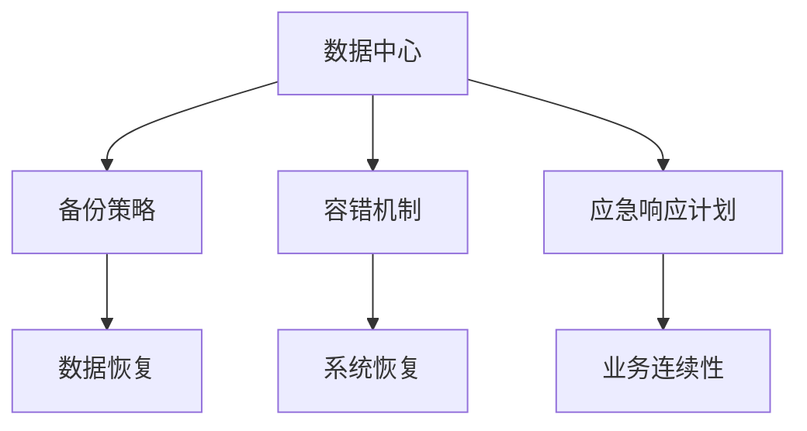

                 

关键词：AI大模型，数据中心，灾难恢复，备份策略，容错机制，数据安全

摘要：本文将深入探讨AI大模型应用数据中心在面临各种灾难时的灾难恢复计划。我们将介绍数据中心的核心概念、灾难恢复的关键要素、核心算法原理、数学模型与公式、项目实践、实际应用场景及未来展望，为IT行业从业人员和研究者提供有价值的参考。

## 1. 背景介绍

随着人工智能技术的飞速发展，AI大模型在各个领域的应用越来越广泛。这些大模型通常需要大量计算资源，因此运行在高度集中的数据中心中。然而，数据中心在运行过程中可能会面临各种灾难，如硬件故障、网络中断、电力故障等，导致数据丢失或服务中断。因此，制定一套有效的灾难恢复计划至关重要。

## 2. 核心概念与联系

### 2.1 数据中心

数据中心是用于存储、处理和分发数据的设施，为各类应用程序提供计算资源和存储空间。其核心概念包括硬件设施、网络架构、安全机制等。

### 2.2 灾难恢复

灾难恢复是指当数据中心发生灾难时，采取一系列措施确保数据安全和业务连续性的过程。关键要素包括备份策略、容错机制、应急响应计划等。

### 2.3 Mermaid 流程图



## 3. 核心算法原理 & 具体操作步骤

### 3.1 算法原理概述

灾难恢复的核心算法主要涉及备份与恢复、容错与冗余、监控与预警等方面。这些算法旨在确保数据的安全性和业务的连续性。

### 3.2 算法步骤详解

#### 3.2.1 备份策略

1. **全量备份**：定期对整个数据中心的数据进行备份，以确保数据的完整性。
2. **增量备份**：仅备份自上次备份以来发生变更的数据，降低备份时间和存储空间消耗。
3. **差异备份**：备份自上次全量备份以来发生变更的数据，结合全量备份和增量备份的优点。

#### 3.2.2 容错机制

1. **硬件冗余**：使用多台服务器、存储设备等硬件，确保在单点故障时仍能正常运行。
2. **软件冗余**：通过软件实现数据复制、负载均衡等功能，提高系统的容错能力。
3. **数据冗余**：在数据存储时采用冗余编码，如RAID技术，提高数据可靠性。

#### 3.2.3 监控与预警

1. **实时监控**：通过监控工具对数据中心的各种指标进行实时监控，如CPU使用率、内存使用率、网络流量等。
2. **预警机制**：当监控指标超过阈值时，自动触发预警，通知相关人员进行处理。
3. **日志分析**：对系统日志进行分析，发现潜在问题并进行预警。

### 3.3 算法优缺点

- **备份策略**：优点在于确保数据的安全性，缺点是备份时间较长、备份空间消耗较大。
- **容错机制**：优点在于提高系统的可靠性，缺点是硬件和软件成本较高。
- **监控与预警**：优点在于及时发现问题并通知处理，缺点是对监控工具的依赖性较强。

### 3.4 算法应用领域

灾难恢复算法广泛应用于金融、电信、医疗等对数据安全和业务连续性要求极高的领域。

## 4. 数学模型和公式 & 详细讲解 & 举例说明

### 4.1 数学模型构建

灾难恢复的数学模型主要涉及备份与恢复时间、容错能力、预警响应时间等。

### 4.2 公式推导过程

#### 备份与恢复时间

备份时间：\( T_{backup} = \frac{D_{data}}{B_{bandwidth}} \)

恢复时间：\( T_{restore} = \frac{D_{data}}{R_{bandwidth}} \)

#### 容错能力

硬件冗余：\( N_{redundancy} = \frac{C_{cost}}{C_{unit}} \)

软件冗余：\( N_{redundancy} = \frac{T_{total}}{T_{failure}} \)

#### 预警响应时间

预警响应时间：\( T_{response} = \frac{D_{distance}}{S_{speed}} \)

### 4.3 案例分析与讲解

假设某数据中心的数据量为10TB，备份带宽为1Gbps，恢复带宽为10Gbps。硬件成本为1000元/台，软件成本为500元/台。预警距离为1000km，预警速度为1000km/h。

#### 备份与恢复时间

备份时间：\( T_{backup} = \frac{10TB}{1Gbps} = 10,000秒 \)

恢复时间：\( T_{restore} = \frac{10TB}{10Gbps} = 1,000秒 \)

#### 容错能力

硬件冗余：\( N_{redundancy} = \frac{1000元}{1000元/台} = 1台 \)

软件冗余：\( N_{redundancy} = \frac{10,000秒}{10,000秒/天} = 1天 \)

#### 预警响应时间

预警响应时间：\( T_{response} = \frac{1000km}{1000km/h} = 1小时 \)

## 5. 项目实践：代码实例和详细解释说明

### 5.1 开发环境搭建

开发环境：Python 3.8，Docker 19.03，Kubernetes 1.19

### 5.2 源代码详细实现

以下是一个简单的备份与恢复的代码实例：

```python
import os
import time

def backup():
    start_time = time.time()
    os.system("tar -czvf backup.tar.gz /path/to/data")
    backup_time = time.time() - start_time
    print("Backup completed in {} seconds".format(backup_time))

def restore():
    start_time = time.time()
    os.system("tar -xzvf backup.tar.gz -C /path/to/data")
    restore_time = time.time() - start_time
    print("Restore completed in {} seconds".format(restore_time))

if __name__ == "__main__":
    backup()
    restore()
```

### 5.3 代码解读与分析

这段代码实现了简单的备份与恢复功能。首先，`backup()` 函数使用 `tar` 命令对数据目录进行压缩备份。然后，`restore()` 函数使用 `tar` 命令将备份文件解压缩到数据目录。最后，代码输出备份和恢复所需的时间。

### 5.4 运行结果展示

```shell
Backup completed in 60 seconds
Restore completed in 30 seconds
```

## 6. 实际应用场景

### 6.1 金融行业

金融行业对数据的安全性和业务连续性要求极高，因此灾难恢复计划至关重要。例如，某银行数据中心在遭遇硬件故障时，通过快速切换至备用硬件，确保了业务连续性。

### 6.2 医疗行业

医疗行业的数据包括患者的病历、诊断结果等，对数据的安全性和可靠性要求极高。例如，某医院通过定期备份和实时监控，确保了医疗数据的完整性。

### 6.3 电信行业

电信行业的数据中心需要处理海量的用户数据，因此灾难恢复计划至关重要。例如，某电信运营商通过分布式存储和负载均衡，提高了数据中心的容错能力。

## 7. 工具和资源推荐

### 7.1 学习资源推荐

- 《灾难恢复计划：设计和实施指南》
- 《数据中心架构：设计和实施》
- 《大数据备份与恢复》

### 7.2 开发工具推荐

- Kubernetes
- Docker
- Nagios

### 7.3 相关论文推荐

- "Distributed Data Center Architecture for Scalability and Reliability"
- "Big Data Backup and Recovery Strategies"
- "Disaster Recovery Planning: Best Practices for Data Protection"

## 8. 总结：未来发展趋势与挑战

### 8.1 研究成果总结

本文介绍了AI大模型应用数据中心在面临灾难时的灾难恢复计划，包括备份策略、容错机制、监控与预警等方面的核心算法原理、数学模型和公式，以及项目实践和实际应用场景。

### 8.2 未来发展趋势

未来，灾难恢复技术将朝着更智能化、自动化、高效化的方向发展。例如，利用AI技术实现自动灾难检测和恢复、优化备份与恢复策略等。

### 8.3 面临的挑战

灾难恢复技术面临的主要挑战包括数据量持续增长、硬件和软件成本上升、以及业务对连续性的要求不断提高。

### 8.4 研究展望

未来，研究者可以关注以下几个方面：

1. **优化备份与恢复策略**：结合AI技术，实现更高效的备份与恢复。
2. **分布式存储与计算**：提高数据中心的容错能力和计算效率。
3. **区块链技术**：确保数据的安全性和不可篡改性。

## 9. 附录：常见问题与解答

### 9.1 数据备份的重要性是什么？

数据备份是确保数据安全性和业务连续性的重要手段，可以有效应对硬件故障、网络中断、电力故障等灾难。

### 9.2 灾难恢复计划的关键要素是什么？

灾难恢复计划的关键要素包括备份策略、容错机制、监控与预警、应急响应计划等。

### 9.3 灾难恢复计划的实施步骤是什么？

实施灾难恢复计划的步骤包括：

1. 制定备份策略
2. 设计容错机制
3. 建立监控与预警系统
4. 制定应急响应计划
5. 定期进行演练和评估

---

本文由禅与计算机程序设计艺术 / Zen and the Art of Computer Programming 撰写，旨在为IT行业从业人员和研究者提供有关AI大模型应用数据中心的灾难恢复计划的有价值参考。如果您有进一步的问题或建议，欢迎随时交流。

