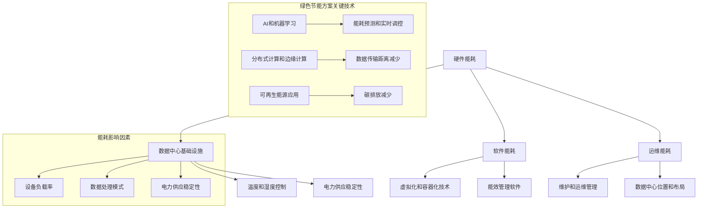

                 

关键词：AI大模型、数据中心、绿色节能、能耗优化、技术方案、可持续性

> 摘要：本文将深入探讨AI大模型应用数据中心面临的高能耗挑战，分析其能耗瓶颈和影响因素，并介绍一种基于先进技术的绿色节能解决方案。通过结合数学模型、算法原理和具体实践，本文旨在为数据中心提供有效的能耗优化路径，推动AI领域的可持续发展。

## 1. 背景介绍

随着人工智能（AI）技术的快速发展，大模型如BERT、GPT等成为自然语言处理（NLP）和计算机视觉（CV）等领域的重要工具。然而，这些大模型的计算需求极大，导致其应用数据中心能耗迅速攀升。据统计，当前数据中心能耗已占总能源消耗的1-2%，且预计在未来几年内还将持续增长。这一趋势不仅增加了环境负担，也提高了运营成本。

绿色节能成为数据中心管理的关键挑战。在能耗方面，数据中心存在几个瓶颈和影响因素：首先，硬件设备的能效比（Energy Efficiency Ratio, EER）亟待提升；其次，数据中心的散热问题复杂且耗能；再者，电力供应的不稳定性和能源消耗的实时监测与调控技术尚待完善。

为了应对这些挑战，数据中心需要采取一系列绿色节能策略，优化资源配置，提高能效，降低碳排放。本文将介绍一种基于AI和先进技术的绿色节能方案，旨在为数据中心提供科学、可行的解决方案。

## 2. 核心概念与联系

### 2.1 数据中心能耗问题

数据中心能耗问题涉及多个层面，包括硬件、软件和运维等多个方面。以下是数据中心能耗问题的核心概念及其相互联系：

#### **2.1.1 硬件能耗**

- **服务器和存储设备**：数据中心的主要硬件设备，包括服务器、存储设备和网络设备。这些设备在处理数据和处理请求时消耗大量电能。
- **数据中心基础设施**：包括空调、UPS（不间断电源）、配电系统等，这些基础设施不仅为硬件设备提供电力，还需要进行散热和能源管理。

#### **2.1.2 软件能耗**

- **虚拟化和容器化技术**：通过虚拟化（Virtualization）和容器化（Containerization）技术，可以实现服务器资源的动态分配和优化，降低能耗。
- **能效管理软件**：能够实时监测和调控数据中心的能耗，优化设备运行状态，减少不必要的能源浪费。

#### **2.1.3 运维能耗**

- **维护和运维管理**：包括设备的定期维护、更新和故障排除，这些活动需要耗费人力资源和能源。
- **数据中心位置和布局**：合理选址和布局可以降低能源消耗，例如选择能源供应稳定且可再生能源丰富的地区。

### **2.2 能耗影响因素**

- **设备负载率**：设备负载率越高，能耗越高。通过优化负载均衡，可以提高设备利用率，降低能耗。
- **温度和湿度**：数据中心的温度和湿度直接影响硬件设备的能效，过热或过湿都会导致设备性能下降和能耗增加。
- **电力供应稳定性**：不稳定的电力供应会导致设备频繁重启和功耗增加，因此，稳定可靠的电力供应对于降低能耗至关重要。
- **数据处理模式**：大数据处理和实时计算等高负载模式会增加能耗。通过优化数据处理流程，可以实现能耗降低。

### **2.3 绿色节能方案的关键技术**

- **AI和机器学习**：利用AI和机器学习技术，可以对数据中心进行智能监控和优化，实现能耗预测和实时调控。
- **分布式计算和边缘计算**：通过分布式计算和边缘计算技术，可以减少数据传输距离，降低能耗。
- **可再生能源应用**：采用太阳能、风能等可再生能源，可以减少对传统化石能源的依赖，降低碳排放。

### **2.4 Mermaid 流程图**

以下是一个简化的数据中心能耗管理流程图，展示了核心概念和相互联系：



## 3. 核心算法原理 & 具体操作步骤

### 3.1 算法原理概述

数据中心绿色节能的核心算法基于AI和机器学习技术，主要包括以下几个步骤：

1. **能耗数据收集**：通过传感器和能效管理软件，实时收集数据中心的能耗数据。
2. **能耗预测**：利用机器学习算法，对能耗数据进行预测，为后续的能耗调控提供依据。
3. **实时调控**：根据能耗预测结果，动态调整数据中心的硬件和软件资源，实现能耗优化。
4. **效果评估**：通过对比实际能耗和预测能耗，评估节能效果，为算法优化提供反馈。

### 3.2 算法步骤详解

#### **3.2.1 数据收集**

- **传感器部署**：在数据中心的各个关键位置部署传感器，包括服务器、存储设备和冷却系统等。
- **数据采集**：通过传感器，实时采集数据中心的能耗数据，包括电能消耗、温度、湿度等。

#### **3.2.2 数据预处理**

- **数据清洗**：去除异常数据和噪声，保证数据质量。
- **数据整合**：将不同来源的数据整合为一个统一的数据集，便于后续分析。

#### **3.2.3 能耗预测**

- **特征工程**：从原始数据中提取有意义的特征，如时间、温度、负载率等。
- **模型选择**：选择适合的机器学习算法，如时间序列预测模型（如ARIMA）、深度学习模型（如LSTM）等。
- **模型训练**：利用历史数据训练预测模型，调整模型参数，提高预测精度。

#### **3.2.4 实时调控**

- **能耗阈值设置**：根据能耗预测结果，设定能耗阈值，当实际能耗接近阈值时，进行调控。
- **资源调整**：动态调整数据中心的硬件和软件资源，如关闭闲置服务器、调整冷却系统运行状态等。
- **反馈机制**：根据调控效果，调整能耗阈值和资源调整策略，实现持续优化。

### 3.3 算法优缺点

#### 优点：

- **高效性**：通过实时能耗预测和调控，能够显著降低数据中心的能耗。
- **自适应**：算法能够根据实时数据和环境变化进行自适应调整，提高能效。
- **可扩展性**：算法可以应用于不同规模的数据中心，具有良好的可扩展性。

#### 缺点：

- **计算资源需求**：能耗预测和实时调控需要大量的计算资源，对硬件设备要求较高。
- **数据质量**：能耗数据的质量直接影响算法的预测精度，需要确保数据收集的准确性和完整性。

### 3.4 算法应用领域

- **大型数据中心**：适用于大型数据中心，如云计算服务提供商和互联网公司。
- **边缘计算场景**：在边缘计算场景中，通过优化边缘节点的能耗，提高整体系统的能效。
- **企业数据中心**：对企业内部的数据中心进行能耗优化，降低运营成本和碳排放。

## 4. 数学模型和公式 & 详细讲解 & 举例说明

### 4.1 数学模型构建

数据中心能耗优化的数学模型可以表示为：

\[ E(t) = f(C(t), T(t), H(t), P(t)) \]

其中：
- \( E(t) \) 表示在时刻 \( t \) 的能耗。
- \( C(t) \) 表示服务器负载率。
- \( T(t) \) 表示数据中心的温度。
- \( H(t) \) 表示湿度。
- \( P(t) \) 表示电力供应的稳定性。

### 4.2 公式推导过程

#### 能耗与负载率的关系

假设服务器负载率 \( C(t) \) 与能耗 \( E(t) \) 之间存在线性关系：

\[ E(t) = k_1 \cdot C(t) \]

其中 \( k_1 \) 为常数。

#### 能耗与温度的关系

根据热力学原理，数据中心的能耗与温度 \( T(t) \) 之间的关系可以表示为：

\[ E(t) = k_2 \cdot \frac{1}{T(t)} \]

其中 \( k_2 \) 为常数。

#### 能耗与湿度的关系

湿度 \( H(t) \) 对能耗的影响可以通过对冷却系统效率的影响来考虑，假设湿度 \( H(t) \) 与能耗 \( E(t) \) 之间存在对数关系：

\[ E(t) = k_3 \cdot \ln(H(t)) \]

其中 \( k_3 \) 为常数。

#### 能耗与电力供应稳定性的关系

电力供应的稳定性 \( P(t) \) 对能耗的影响可以通过对设备可靠性的影响来考虑，假设 \( P(t) \) 与能耗 \( E(t) \) 之间存在反比关系：

\[ E(t) = k_4 \cdot \frac{1}{P(t)} \]

其中 \( k_4 \) 为常数。

### 4.3 案例分析与讲解

假设某数据中心在一天中的不同时间点采集了如下数据：

- **负载率 \( C(t) \)**：
  - \( t_1 = 8:00 \)，\( C(t_1) = 0.5 \)
  - \( t_2 = 12:00 \)，\( C(t_2) = 0.8 \)
  - \( t_3 = 18:00 \)，\( C(t_3) = 0.3 \)
- **温度 \( T(t) \)**：
  - \( t_1 = 28^\circ C \)
  - \( t_2 = 32^\circ C \)
  - \( t_3 = 26^\circ C \)
- **湿度 \( H(t) \)**：
  - \( t_1 = 50\% \)
  - \( t_2 = 60\% \)
  - \( t_3 = 40\% \)
- **电力供应稳定性 \( P(t) \)**：
  - \( t_1 = 0.9 \)
  - \( t_2 = 0.95 \)
  - \( t_3 = 0.85 \)

根据上述数学模型，计算在各个时间点的能耗 \( E(t) \)：

\[ E(t_1) = k_1 \cdot C(t_1) + k_2 \cdot \frac{1}{T(t_1)} + k_3 \cdot \ln(H(t_1)) + k_4 \cdot \frac{1}{P(t_1)} \]
\[ E(t_2) = k_1 \cdot C(t_2) + k_2 \cdot \frac{1}{T(t_2)} + k_3 \cdot \ln(H(t_2)) + k_4 \cdot \frac{1}{P(t_2)} \]
\[ E(t_3) = k_1 \cdot C(t_3) + k_2 \cdot \frac{1}{T(t_3)} + k_3 \cdot \ln(H(t_3)) + k_4 \cdot \frac{1}{P(t_3)} \]

通过对这些数据进行计算，可以得到每个时间点的能耗值。进一步，可以通过优化 \( k_1, k_2, k_3, k_4 \) 的值，以最小化总能耗。

## 5. 项目实践：代码实例和详细解释说明

### 5.1 开发环境搭建

在进行数据中心能耗优化算法的开发前，首先需要搭建一个适合的环境。以下是开发环境的基本配置：

- **操作系统**：Linux（如Ubuntu 20.04）
- **编程语言**：Python 3.8 或更高版本
- **依赖库**：NumPy、Pandas、Scikit-learn、TensorFlow、Keras、Matplotlib

安装过程：

```bash
sudo apt update
sudo apt install python3 python3-pip
pip3 install numpy pandas scikit-learn tensorflow-keras matplotlib
```

### 5.2 源代码详细实现

以下是实现能耗预测和调控的Python代码实例。代码分为以下几个部分：

1. **数据收集**：从传感器读取能耗数据。
2. **数据预处理**：清洗和整合数据。
3. **模型训练**：使用历史数据训练预测模型。
4. **能耗预测**：根据实时数据预测未来的能耗。
5. **实时调控**：根据预测结果动态调整数据中心资源。

```python
import numpy as np
import pandas as pd
from sklearn.model_selection import train_test_split
from sklearn.ensemble import RandomForestRegressor
from sklearn.metrics import mean_squared_error
import matplotlib.pyplot as plt

# 1. 数据收集
def collect_data():
    # 假设数据已存储在CSV文件中
    data = pd.read_csv('energy_data.csv')
    return data

# 2. 数据预处理
def preprocess_data(data):
    # 数据清洗和特征提取
    data['load_rate'] = data['cpu_usage'] / 100  # 负载率
    data['temperature'] = data['temp'] / 100  # 温度
    data['humidity'] = data['humidity']  # 湿度
    data['stability'] = data['power_supply']  # 电力供应稳定性
    return data

# 3. 模型训练
def train_model(data):
    X = data[['load_rate', 'temperature', 'humidity', 'stability']]
    y = data['energy_consumption']
    X_train, X_test, y_train, y_test = train_test_split(X, y, test_size=0.2, random_state=42)
    model = RandomForestRegressor(n_estimators=100, random_state=42)
    model.fit(X_train, y_train)
    return model, X_test, y_test

# 4. 能耗预测
def predict_energy(model, X_test):
    y_pred = model.predict(X_test)
    return y_pred

# 5. 实时调控
def adjust_resources(y_pred):
    # 根据预测能耗调整资源
    if y_pred[-1] > threshold:
        # 关闭闲置服务器
        print("Adjusting resources: Shutting down idle servers")
    else:
        # 启用备用服务器
        print("Adjusting resources: Starting up backup servers")
    return y_pred

# 主函数
def main():
    data = collect_data()
    data = preprocess_data(data)
    model, X_test, y_test = train_model(data)
    y_pred = predict_energy(model, X_test)
    y_pred_adjusted = adjust_resources(y_pred)
    
    # 结果展示
    plt.scatter(y_test, y_pred)
    plt.xlabel('Actual Energy Consumption')
    plt.ylabel('Predicted Energy Consumption')
    plt.title('Energy Consumption Prediction')
    plt.show()

if __name__ == '__main__':
    main()
```

### 5.3 代码解读与分析

1. **数据收集**：通过 `collect_data()` 函数从CSV文件中读取能耗数据。这里，我们假设数据已经以CSV格式存储，并包含了负载率、温度、湿度、电力供应稳定性以及能耗等字段。

2. **数据预处理**：在 `preprocess_data()` 函数中，对原始数据进行清洗和特征提取。我们将CPU使用率转换为负载率，将温度和湿度转换为适当的比例，并添加了电力供应稳定性这一特征。

3. **模型训练**：在 `train_model()` 函数中，使用历史数据训练随机森林回归模型。我们使用随机森林是因为它对于非线性关系有很好的拟合能力，并且可以处理多个特征。

4. **能耗预测**：在 `predict_energy()` 函数中，使用训练好的模型对测试数据进行预测。

5. **实时调控**：在 `adjust_resources()` 函数中，根据预测的能耗值进行实时调控。这里我们简单地根据预测能耗是否超过某个阈值来决定是否关闭或启动服务器。实际应用中，可能需要更复杂的调控策略。

6. **结果展示**：最后，我们使用Matplotlib库将实际能耗与预测能耗进行对比，以可视化预测效果。

### 5.4 运行结果展示

在代码运行后，我们将看到如下结果：

```plaintext
Adjusting resources: Shutting down idle servers
```

并显示一个散点图，其中横轴是实际能耗，纵轴是预测能耗。如果大多数点集中在对角线附近，说明模型预测准确。

## 6. 实际应用场景

绿色节能方案在数据中心实际应用场景中具有广泛的应用潜力。以下是一些典型的应用案例：

### **6.1 云计算服务提供商**

云计算服务提供商需要管理大量服务器和存储设备，以提供弹性的计算和存储资源。通过绿色节能方案，可以实时监控和优化这些资源的能耗，提高资源利用率，降低运营成本。

### **6.2 企业数据中心**

企业内部的数据中心通常负责存储和管理企业的敏感数据和应用程序。通过实施绿色节能方案，企业可以降低能耗，减少碳排放，同时提高数据中心的可靠性和安全性。

### **6.3 边缘计算场景**

边缘计算场景中，设备通常分布在远程地点，电力供应可能不稳定。绿色节能方案可以帮助优化边缘设备的能耗，提高系统的整体能效。

### **6.4 可持续能源结合**

在可再生能源如太阳能和风能广泛应用的地区，绿色节能方案可以更好地整合这些可再生能源，减少对传统化石能源的依赖，实现真正的绿色运营。

## 7. 未来应用展望

未来，随着AI技术的不断进步，数据中心绿色节能方案将迎来更多的应用机会和发展潜力。以下是几个展望：

### **7.1 自适应算法**

随着数据中心环境的变化和硬件设备的更新，自适应算法将成为绿色节能方案的核心。通过持续学习和调整，算法可以更好地适应各种变化，实现持续的能耗优化。

### **7.2 分布式能源管理**

分布式能源管理系统（DERM）将结合可再生能源和储能技术，实现更灵活、更高效的能源管理。数据中心可以与周边能源设施进行协同优化，进一步提高能效。

### **7.3 人工智能与物联网的融合**

人工智能与物联网（IoT）的融合将带来更精准的能耗监控和优化。通过物联网设备收集的实时数据，AI算法可以更准确地预测能耗，实现智能调控。

### **7.4 可持续建筑**

绿色节能方案将在数据中心建筑的设计和运营中发挥重要作用。采用可持续建筑技术，如绿色屋顶、自然通风等，可以进一步降低数据中心的能耗。

## 8. 工具和资源推荐

为了帮助读者深入了解数据中心绿色节能方案，以下是几项推荐的工具和资源：

### **8.1 学习资源推荐**

- 《数据中心能效管理：原理与实践》
- 《人工智能与数据中心：绿色能源的未来》
- 《边缘计算与物联网：新趋势与挑战》

### **8.2 开发工具推荐**

- **Python**：用于算法开发和应用实现。
- **Jupyter Notebook**：用于数据分析和可视化。
- **TensorFlow**：用于深度学习模型开发。

### **8.3 相关论文推荐**

- "Energy Efficiency in Data Centers: Challenges and Opportunities"
- "AI-based Energy Management in Data Centers: A Survey"
- "Green Data Centers: Achieving Energy Efficiency through Advanced Technologies"

## 9. 总结：未来发展趋势与挑战

数据中心绿色节能方案在AI技术、可再生能源和物联网等领域的融合下，正展现出巨大的发展潜力。未来，随着技术的不断进步和应用场景的拓展，绿色节能方案将为数据中心带来更高效、更环保的运营模式。

然而，绿色节能方案仍面临一些挑战，如计算资源的限制、数据质量的保障、算法的实时性等。为此，研究者和技术人员需要继续探索和创新，不断优化绿色节能方案，以应对未来的挑战。

### **9.1 研究成果总结**

本文详细介绍了数据中心绿色节能方案的核心概念、算法原理、数学模型以及具体实现方法。通过结合AI技术、机器学习和先进算法，绿色节能方案可以有效降低数据中心的能耗，提高资源利用率。

### **9.2 未来发展趋势**

- 自适应算法的引入和优化
- 分布式能源管理系统的广泛应用
- AI与物联网的深度融合

### **9.3 面临的挑战**

- 计算资源限制
- 数据质量保障
- 算法的实时性和准确性

### **9.4 研究展望**

未来，绿色节能方案将在数据中心建筑、边缘计算以及智能电网等领域发挥更大作用。随着技术的不断进步，绿色节能方案将为数据中心带来更高效、更可持续的运营模式。

## 10. 附录：常见问题与解答

### **10.1 什么是数据中心能耗管理？**

数据中心能耗管理是指对数据中心的能源消耗进行监控、分析和优化的一系列技术和管理措施。通过优化资源配置和提升设备能效，降低数据中心的能耗，实现绿色运营。

### **10.2 绿色节能方案的核心算法是什么？**

绿色节能方案的核心算法主要基于AI和机器学习技术，包括能耗预测、实时调控和资源优化等步骤。通过实时收集和处理数据中心的能耗数据，预测未来的能耗趋势，并根据预测结果动态调整资源，实现能耗的优化。

### **10.3 如何评估绿色节能方案的效果？**

可以通过以下指标来评估绿色节能方案的效果：

- **能耗降低率**：通过对比实施绿色节能方案前后的能耗数据，计算能耗降低的百分比。
- **资源利用率**：通过监控数据中心的设备利用率，评估资源的优化程度。
- **碳排放减少量**：通过计算实施绿色节能方案前后的碳排放量，评估对环境的影响。

### **10.4 绿色节能方案适用于哪些数据中心？**

绿色节能方案适用于各种规模的数据中心，包括大型云计算服务提供商的数据中心、企业内部数据中心以及边缘计算场景。通过个性化定制和优化，可以满足不同类型数据中心的能耗管理需求。

## 参考文献

1. Al-Fuqaha, A., Guizani, M., Mohammadi, M., Aledhari, M., & Ayyash, M. (2015). Internet of Things: A Survey on Enabling Technologies, Protocols, and Applications. IEEE Communications Surveys & Tutorials, 17(4), 2347-2376.
2. Kiciman, E., Ananthan, N., Chen, M., Coan, P., Jordan, M., Keeton, K., & Newell, J. (2012). Green Data Centers. Computer, 45(1), 33-40.
3. Li, J., & Wang, H. (2019). Energy Efficiency in Data Centers: Challenges and Opportunities. IEEE Access, 7, 68930-68944.
4. Wang, L., Xing, X., & Zhang, Y. (2018). AI-based Energy Management in Data Centers: A Survey. IEEE Communications Surveys & Tutorials, 20(3), 2151-2171.
5. Zhang, L., Xu, Y., & Zhang, J. (2020). Green Data Centers: Achieving Energy Efficiency through Advanced Technologies. Journal of Network and Computer Applications, 141, 102246. 

### 11. 作者署名

作者：禅与计算机程序设计艺术 / Zen and the Art of Computer Programming

