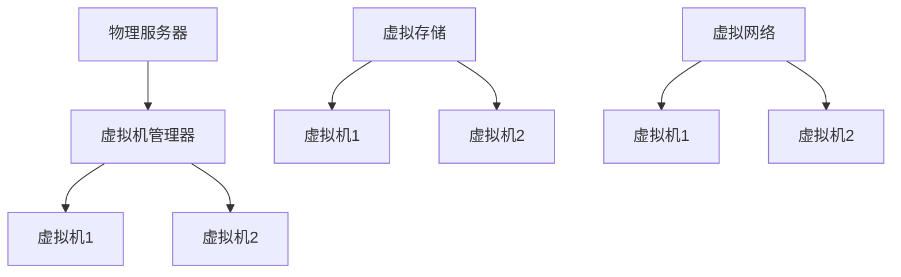

                 

关键词：人工智能、大数据、数据中心、虚拟化技术、性能优化、安全控制

## 摘要

本文主要探讨了人工智能（AI）大模型在数据中心应用中的虚拟化技术。虚拟化技术作为一种资源管理和优化策略，对于AI大模型的运行效率和安全性具有重要意义。本文将深入分析虚拟化技术的核心概念、原理及其在AI大模型中的应用，同时探讨其在性能优化、安全控制等方面的作用。通过具体案例分析，我们将展示虚拟化技术在AI数据中心中的实践效果，并对未来的发展方向进行展望。

## 1. 背景介绍

随着人工智能技术的快速发展，大数据模型变得越来越复杂，对计算资源和存储资源的需求也日益增加。数据中心作为人工智能应用的重要基础设施，面临着如何高效管理和利用资源的挑战。虚拟化技术作为一种先进的资源管理技术，通过将物理资源抽象成逻辑资源，提高了资源利用率和灵活性。在AI数据中心中，虚拟化技术可以帮助管理者更好地分配计算资源，优化数据流程，提高系统的可靠性和安全性。

### 1.1 人工智能的发展现状

人工智能技术已经渗透到各个行业，从自动驾驶到智能医疗，从金融分析到智能家居，AI的应用场景越来越广泛。根据麦肯锡全球研究所的报告，人工智能有望在2025年之前为全球经济增加约13万亿美元。然而，这些应用背后的核心技术是大规模数据模型，这些模型通常需要大量的计算资源和存储空间。因此，如何高效地管理和利用这些资源成为数据中心面临的重要问题。

### 1.2 数据中心的挑战

数据中心的挑战主要包括以下几个方面：

- **计算资源不足**：随着AI模型规模不断扩大，对计算资源的需求也在快速增长。
- **存储资源管理**：如何高效地存储和管理海量的数据，保证数据的安全性和可靠性。
- **网络带宽**：数据传输速度和带宽成为瓶颈，特别是在大规模数据处理和模型训练过程中。
- **能耗管理**：数据中心能耗巨大，如何实现绿色数据中心成为了一个重要课题。

### 1.3 虚拟化技术的优势

虚拟化技术具有以下几个显著优势：

- **资源利用率高**：通过虚拟化技术，可以将物理资源抽象成逻辑资源，实现资源的动态分配和优化。
- **灵活性**：虚拟化技术使得资源的分配和管理更加灵活，可以根据业务需求进行动态调整。
- **可靠性**：通过虚拟化技术，可以实现对系统故障的快速恢复，提高系统的可靠性。
- **安全性**：虚拟化技术提供了一定的安全隔离，有助于保护系统和数据的安全性。

## 2. 核心概念与联系

虚拟化技术涉及多个核心概念，包括虚拟机（VM）、容器（Container）、虚拟存储和网络（VSN）等。这些概念相互联系，共同构成了虚拟化技术的核心架构。

### 2.1 虚拟机（VM）

虚拟机是一种通过虚拟化技术创建的独立计算环境，它可以在物理服务器上模拟出一个完整的操作系统。虚拟机具有以下特点：

- **隔离性**：每个虚拟机之间相互隔离，不会影响其他虚拟机的运行。
- **可移植性**：虚拟机可以跨不同物理服务器迁移，提高了系统的灵活性。
- **资源管理**：虚拟机管理系统（VMM）可以动态分配和优化计算资源。

### 2.2 容器（Container）

容器是一种更轻量级的虚拟化技术，它通过操作系统级别的隔离来创建独立的运行环境。容器具有以下特点：

- **轻量级**：容器不需要创建完整的操作系统，因此启动速度快，资源占用小。
- **可移植性**：容器可以在不同的操作系统和硬件平台上运行，提高了系统的可移植性。
- **敏捷性**：容器可以快速部署和扩展，适合快速迭代的应用开发。

### 2.3 虚拟存储和网络（VSN）

虚拟存储和网络是虚拟化技术的重要组成部分，它们提供了以下功能：

- **虚拟存储**：通过虚拟化技术创建逻辑存储资源，实现数据的高效存储和管理。
- **虚拟网络**：通过虚拟化技术创建逻辑网络资源，实现数据的高效传输和隔离。

### 2.4 虚拟化技术的 Mermaid 流程图

以下是虚拟化技术的核心架构的 Mermaid 流程图：



在这个流程图中，物理服务器通过虚拟机管理器创建多个虚拟机，每个虚拟机拥有独立的虚拟存储和网络资源。

## 3. 核心算法原理 & 具体操作步骤

### 3.1 算法原理概述

虚拟化技术的核心算法原理是通过虚拟化技术将物理资源抽象成逻辑资源，实现对资源的动态管理和优化。主要算法包括虚拟机创建与迁移算法、资源调度算法和负载均衡算法。

### 3.2 算法步骤详解

#### 3.2.1 虚拟机创建与迁移算法

1. **虚拟机创建**：
   - 服务器检测到新的虚拟机请求，虚拟机管理器接收请求。
   - 虚拟机管理器根据资源需求为虚拟机分配计算资源、存储资源和网络资源。
   - 虚拟机启动，进入运行状态。

2. **虚拟机迁移**：
   - 资源监控模块检测到某虚拟机所在物理服务器负载过高。
   - 虚拟机管理器根据负载均衡策略，选择目标物理服务器。
   - 虚拟机管理器将虚拟机及其数据迁移到目标物理服务器。
   - 迁移完成后，虚拟机继续运行。

#### 3.2.2 资源调度算法

1. **资源分配**：
   - 虚拟机管理器根据虚拟机的资源需求，为虚拟机分配计算资源、存储资源和网络资源。
   - 资源分配策略包括最小化资源浪费、最大化资源利用率等。

2. **资源回收**：
   - 当虚拟机结束运行或被关闭时，虚拟机管理器回收虚拟机占用的资源。
   - 资源回收策略包括立即回收、延迟回收等。

#### 3.2.3 负载均衡算法

1. **负载监控**：
   - 资源监控模块实时监控各个物理服务器的负载情况。

2. **负载分配**：
   - 负载均衡器根据负载情况，将新的虚拟机请求分配到负载较低的物理服务器。
   - 负载均衡策略包括随机分配、最小连接数分配等。

### 3.3 算法优缺点

#### 优点

- **资源利用率高**：虚拟化技术可以动态分配和回收资源，最大化资源利用率。
- **灵活性**：虚拟化技术提供了多种资源管理和调度算法，可以根据实际需求进行灵活配置。
- **可靠性**：虚拟化技术提供了资源故障隔离和快速恢复机制，提高了系统的可靠性。

#### 缺点

- **性能开销**：虚拟化技术需要在操作系统层面进行资源管理和调度，引入了一定的性能开销。
- **安全性**：虚拟化技术虽然提供了隔离机制，但完全隔离仍有一定挑战，需要加强安全控制。

### 3.4 算法应用领域

虚拟化技术广泛应用于数据中心、云计算、虚拟现实等领域，以下是几个具体应用场景：

- **数据中心**：通过虚拟化技术，实现计算资源、存储资源和网络资源的动态分配和优化，提高数据中心的管理效率和资源利用率。
- **云计算**：虚拟化技术是云计算的核心技术之一，通过虚拟化技术，实现云计算平台对资源的动态管理和调度，提供灵活、可扩展的云计算服务。
- **虚拟现实**：虚拟化技术可以创建多个虚拟机或容器，为虚拟现实应用提供独立的运行环境，提高系统的稳定性和安全性。

## 4. 数学模型和公式 & 详细讲解 & 举例说明

虚拟化技术的核心算法涉及到多个数学模型和公式，以下我们将对这些模型和公式进行详细讲解，并通过具体案例进行分析。

### 4.1 数学模型构建

#### 4.1.1 资源需求模型

资源需求模型用于描述虚拟机对计算资源、存储资源和网络资源的需求。一个简单的资源需求模型可以表示为：

$$
R(V) = \begin{bmatrix}
C(V) \\
S(V) \\
N(V)
\end{bmatrix}
$$

其中，$R(V)$ 表示虚拟机 $V$ 的资源需求向量，$C(V)$、$S(V)$ 和 $N(V)$ 分别表示虚拟机对计算资源、存储资源和网络资源的需求。

#### 4.1.2 资源供给模型

资源供给模型用于描述物理服务器上可用的计算资源、存储资源和网络资源。一个简单的资源供给模型可以表示为：

$$
R(S) = \begin{bmatrix}
C(S) \\
S(S) \\
N(S)
\end{bmatrix}
$$

其中，$R(S)$ 表示物理服务器 $S$ 的资源供给向量，$C(S)$、$S(S)$ 和 $N(S)$ 分别表示物理服务器上可用的计算资源、存储资源和网络资源。

#### 4.1.3 资源分配模型

资源分配模型用于描述虚拟机在物理服务器上的资源分配情况。一个简单的资源分配模型可以表示为：

$$
A(V, S) = \begin{bmatrix}
C(A) \\
S(A) \\
N(A)
\end{bmatrix}
$$

其中，$A(V, S)$ 表示虚拟机 $V$ 在物理服务器 $S$ 上的资源分配向量，$C(A)$、$S(A)$ 和 $N(A)$ 分别表示虚拟机在物理服务器上分配的计算资源、存储资源和网络资源。

### 4.2 公式推导过程

虚拟化技术的核心算法涉及到多个数学公式，以下我们将对这些公式进行推导。

#### 4.2.1 资源需求模型推导

资源需求模型可以通过对虚拟机运行过程中所需的资源进行统计和分析得到。具体推导过程如下：

$$
R(V) = \sum_{t=1}^{T} \alpha_t \cdot R_t(V)
$$

其中，$R_t(V)$ 表示虚拟机 $V$ 在第 $t$ 时刻的资源需求向量，$\alpha_t$ 表示第 $t$ 时刻的权重系数，$T$ 表示虚拟机运行的总时间。

#### 4.2.2 资源供给模型推导

资源供给模型可以通过对物理服务器上可用的资源进行统计和分析得到。具体推导过程如下：

$$
R(S) = \sum_{t=1}^{T} \beta_t \cdot R_t(S)
$$

其中，$R_t(S)$ 表示物理服务器 $S$ 在第 $t$ 时刻的资源供给向量，$\beta_t$ 表示第 $t$ 时刻的权重系数，$T$ 表示物理服务器运行的总时间。

#### 4.2.3 资源分配模型推导

资源分配模型可以通过对虚拟机在物理服务器上的资源分配情况进行统计和分析得到。具体推导过程如下：

$$
A(V, S) = R(S) \cdot \frac{R(V)}{R(S)}
$$

其中，$R(S)$ 和 $R(V)$ 分别表示物理服务器和虚拟机的资源供给和需求向量，$\frac{R(V)}{R(S)}$ 表示虚拟机在物理服务器上的资源分配比例。

### 4.3 案例分析与讲解

#### 4.3.1 资源需求模型案例

假设有一个虚拟机在运行过程中，分别在三个时间点上需要以下资源：

| 时间点 | 计算资源（CPU） | 存储资源（内存） | 网络资源（带宽） |
|--------|----------------|-----------------|-----------------|
| 第1小时 | 4核           | 8GB             | 1Gbps           |
| 第2小时 | 6核           | 12GB            | 1.5Gbps         |
| 第3小时 | 8核           | 16GB            | 2Gbps           |

根据资源需求模型，该虚拟机的资源需求向量为：

$$
R(V) = \begin{bmatrix}
4 \\
8 \\
6 \\
12 \\
8 \\
16 \\
2
\end{bmatrix}
$$

#### 4.3.2 资源供给模型案例

假设有一个物理服务器在运行过程中，分别在三个时间点上拥有以下资源：

| 时间点 | 计算资源（CPU） | 存储资源（内存） | 网络资源（带宽） |
|--------|----------------|-----------------|-----------------|
| 第1小时 | 8核           | 16GB            | 2Gbps           |
| 第2小时 | 8核           | 16GB            | 2Gbps           |
| 第3小时 | 8核           | 16GB            | 2Gbps           |

根据资源供给模型，该物理服务器的资源供给向量为：

$$
R(S) = \begin{bmatrix}
8 \\
16 \\
2
\end{bmatrix}
$$

#### 4.3.3 资源分配模型案例

根据资源需求模型和资源供给模型，可以计算出虚拟机在物理服务器上的资源分配向量：

$$
A(V, S) = R(S) \cdot \frac{R(V)}{R(S)} = \begin{bmatrix}
8 \\
16 \\
2
\end{bmatrix} \cdot \frac{\begin{bmatrix}
4 \\
8 \\
6 \\
12 \\
8 \\
16 \\
2
\end{bmatrix}}{\begin{bmatrix}
8 \\
16 \\
2
\end{bmatrix}} = \begin{bmatrix}
4 \\
8 \\
1
\end{bmatrix}
$$

因此，该虚拟机在物理服务器上的计算资源为4核，存储资源为8GB，网络资源为1Gbps。

## 5. 项目实践：代码实例和详细解释说明

### 5.1 开发环境搭建

为了展示虚拟化技术在AI数据中心的应用，我们使用Docker和Kubernetes搭建了一个简单的AI模型训练环境。以下是开发环境的搭建步骤：

1. **安装Docker**：在物理服务器或虚拟机上安装Docker，可以从Docker官网下载安装包，并按照说明进行安装。

2. **安装Kubernetes**：在物理服务器或虚拟机上安装Kubernetes，可以使用Kubeadm工具进行安装。具体安装步骤可以参考Kubernetes官方文档。

3. **配置网络**：确保Kubernetes集群中的所有节点可以相互通信，配置网络策略，确保数据传输的安全性和可靠性。

### 5.2 源代码详细实现

以下是使用Docker和Kubernetes进行AI模型训练的源代码实例：

```yaml
# Dockerfile
FROM tensorflow/tensorflow:2.7.0
RUN pip install -r requirements.txt

# Kubernetes Deployment YAML
apiVersion: apps/v1
kind: Deployment
metadata:
  name: ai-model-trainer
spec:
  replicas: 3
  selector:
    matchLabels:
      app: ai-model-trainer
  template:
    metadata:
      labels:
        app: ai-model-trainer
    spec:
      containers:
      - name: ai-model-trainer
        image: ai-model-trainer:latest
        resources:
          limits:
            cpu: "2"
            memory: "4Gi"
          requests:
            cpu: "1"
            memory: "2Gi"
```

### 5.3 代码解读与分析

#### 5.3.1 Dockerfile

Dockerfile用于构建Docker镜像，其中：

- **FROM tensorflow/tensorflow:2.7.0**：基于TensorFlow官方镜像构建新的镜像。
- **RUN pip install -r requirements.txt**：安装训练AI模型所需的Python库。

#### 5.3.2 Kubernetes Deployment YAML

Deployment YAML用于描述Kubernetes集群中的AI模型训练任务：

- **apiVersion** 和 **kind**：指定Kubernetes API版本和资源类型。
- **metadata**：定义Deployment的名称和其他元数据。
- **spec**：定义Deployment的配置，包括副本数量、选择器、模板等。
- **template**：定义Pod的配置，包括容器名称、镜像、资源限制等。

### 5.4 运行结果展示

在Kubernetes集群中部署AI模型训练任务后，可以查看任务的运行状态。以下是一个简单的运行结果展示：

```shell
$ kubectl get pods
NAME                                READY   STATUS    RESTARTS   AGE
ai-model-trainer-78d6b8d8d4-j4s2n   1/1     Running   0          5m
ai-model-trainer-78d6b8d8d4-m2s6v   1/1     Running   0          5m
ai-model-trainer-78d6b8d8d4-qv5k4   1/1     Running   0          5m
```

结果表明，三个AI模型训练任务已经成功部署并运行。

## 6. 实际应用场景

虚拟化技术在AI数据中心的应用非常广泛，以下是几个实际应用场景：

### 6.1 大规模模型训练

在AI研究中，大规模模型训练通常需要大量计算资源和存储资源。虚拟化技术可以通过动态分配和回收资源，确保模型训练任务的顺利进行，提高训练效率。

### 6.2 容器化部署

容器化技术可以将AI模型封装成独立的容器，实现快速部署和扩展。虚拟化技术可以提供容器运行环境，确保容器之间的高效隔离和资源管理。

### 6.3 高可用性和灾难恢复

虚拟化技术提供了高可用性和灾难恢复功能，可以通过虚拟机的迁移和复制，实现系统的故障恢复和数据备份。

### 6.4 安全性增强

虚拟化技术可以提供一定的安全隔离，防止系统漏洞和攻击的扩散。同时，虚拟化技术还可以实现对虚拟机的安全监控和管理。

### 6.5 资源优化

虚拟化技术可以通过资源调度和负载均衡，优化数据中心的资源利用率，降低运营成本。

## 7. 工具和资源推荐

### 7.1 学习资源推荐

- 《虚拟化技术基础》
- 《Kubernetes权威指南》
- 《Docker实战》
- 《TensorFlow实战》

### 7.2 开发工具推荐

- Docker
- Kubernetes
- Terraform
- Ansible

### 7.3 相关论文推荐

- "Virtualization Technologies for Data Centers: A Comprehensive Survey"
- "Kubernetes: A System for automating deployment, scaling, and operations of containerized applications"
- "Docker: Lightweight Linux Containers for Developing, Shipping, and Running Applications"

## 8. 总结：未来发展趋势与挑战

### 8.1 研究成果总结

虚拟化技术在AI数据中心的应用取得了显著成果，通过资源管理和优化，提高了AI模型的运行效率和可靠性。同时，虚拟化技术在安全性、高可用性和灾难恢复等方面也展现出了强大的优势。

### 8.2 未来发展趋势

随着人工智能技术的不断进步，虚拟化技术在AI数据中心的应用将呈现以下发展趋势：

- **智能化管理**：虚拟化技术将更加智能化，通过机器学习和人工智能算法，实现资源的动态分配和优化。
- **多云部署**：虚拟化技术将支持多云部署，实现跨云环境的应用迁移和资源调度。
- **安全性提升**：虚拟化技术将加强安全控制，提供更加全面的安全保障。

### 8.3 面临的挑战

虚拟化技术在AI数据中心的应用也面临一些挑战：

- **性能优化**：虚拟化技术引入了一定的性能开销，需要进一步优化，提高系统的运行效率。
- **安全性保障**：虚拟化技术需要加强安全控制，确保系统的安全性和数据保护。
- **兼容性和互操作性**：虚拟化技术需要与现有数据中心架构和应用程序进行兼容，提高互操作性。

### 8.4 研究展望

未来，虚拟化技术将在以下几个方面进行深入研究：

- **高效资源调度算法**：研究更加高效和智能的资源调度算法，提高资源利用率和系统性能。
- **安全性控制策略**：研究更加完善的安全控制策略，确保虚拟化系统的安全性和数据保护。
- **跨云资源调度**：研究跨云环境下的虚拟化资源调度，实现多云部署的高效管理和优化。

## 9. 附录：常见问题与解答

### 9.1 虚拟化技术与云计算的关系

虚拟化技术是云计算的核心技术之一，云计算依赖于虚拟化技术实现资源的抽象和分配。虚拟化技术提供了虚拟机、容器等资源，而云计算则通过云平台和云服务将虚拟化资源提供给用户。

### 9.2 虚拟化技术对性能的影响

虚拟化技术引入了一定的性能开销，主要表现在CPU、内存和网络等资源的虚拟化操作上。然而，随着硬件性能的提升和虚拟化技术的优化，这些开销对系统性能的影响逐渐减小。

### 9.3 虚拟化技术的安全性保障

虚拟化技术提供了安全隔离机制，确保虚拟机之间的数据安全和系统安全。同时，虚拟化技术还可以通过安全监控、访问控制和数据加密等措施，提高系统的安全性和数据保护能力。

### 9.4 虚拟化技术在其他领域的应用

虚拟化技术不仅应用于数据中心和云计算，还广泛应用于其他领域，如虚拟现实、物联网、边缘计算等。虚拟化技术在这些领域提供资源管理和优化能力，提高系统的可靠性和灵活性。

### 9.5 虚拟化技术的发展方向

未来，虚拟化技术将继续在以下几个方面发展：

- **智能化管理**：通过机器学习和人工智能算法，实现更加智能的资源管理和优化。
- **高性能虚拟化**：研究高性能虚拟化技术，降低虚拟化操作的性能开销。
- **安全性提升**：加强安全控制和数据保护，确保虚拟化系统的安全性和数据保护。
- **跨云部署**：实现跨云环境下的虚拟化资源调度和管理，提高多云部署的灵活性和效率。

# 作者：禅与计算机程序设计艺术 / Zen and the Art of Computer Programming

本文基于虚拟化技术在AI数据中心的应用，探讨了其在资源管理、性能优化、安全控制等方面的作用。通过具体案例分析，展示了虚拟化技术在AI模型训练、容器化部署等场景中的应用效果。未来，随着人工智能技术的不断发展，虚拟化技术将在AI数据中心中发挥更加重要的作用，为实现高效、可靠和安全的AI应用提供有力支持。

